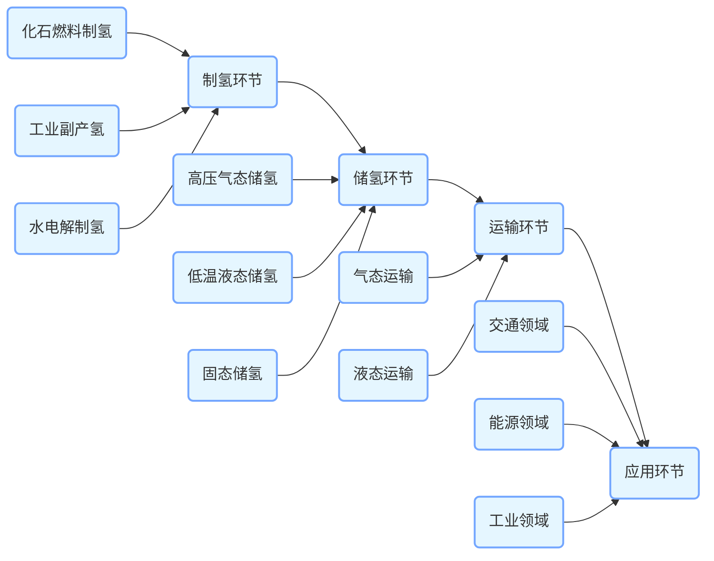

# 价值投资中的氢能源产业链分析

> 关键词：价值投资、氢能源产业链、制氢技术、储氢运输、应用场景
> 摘要：本文聚焦于价值投资视角下的氢能源产业链分析。在全球能源转型和碳中和的大背景下，氢能源作为一种极具潜力的清洁能源备受关注。文章首先介绍了研究氢能源产业链在价值投资中的目的和范围，明确预期读者。接着阐述核心概念，包括氢能源产业链各环节的原理与联系，并通过示意图和流程图展示。详细讲解核心算法原理及操作步骤，运用数学模型和公式分析相关经济指标。通过项目实战案例，说明开发环境搭建、代码实现与解读。探讨氢能源在不同领域的实际应用场景，推荐学习资源、开发工具和相关论文著作。最后总结氢能源产业链的未来发展趋势与挑战，解答常见问题并提供扩展阅读与参考资料，旨在为价值投资者提供全面、深入的氢能源产业链分析，助力其做出明智的投资决策。

## 1. 背景介绍 
### 1.1 目的和范围
在全球应对气候变化、推动能源转型的大背景下，氢能源作为一种清洁、高效、可持续的能源载体，正逐渐成为能源领域的焦点。本研究的目的在于从价值投资的角度，全面深入地分析氢能源产业链，为投资者提供有关氢能源产业的详细信息和投资建议。研究范围涵盖氢能源产业链的各个环节，包括制氢、储氢、运输、应用等，分析各环节的技术特点、市场现状、发展趋势以及投资价值。

### 1.2 预期读者
本文的预期读者主要包括对氢能源产业感兴趣的投资者，如个人投资者、机构投资者等；从事能源行业研究的专业人士，包括分析师、研究员等；以及关注能源转型和可持续发展的政策制定者和相关企业管理者。

### 1.3 文档结构概述
本文将按照以下结构进行阐述：首先介绍氢能源产业链的核心概念与联系，通过文本示意图和流程图清晰展示各环节的关系；接着讲解核心算法原理和具体操作步骤，运用 Python 代码详细说明；然后介绍相关的数学模型和公式，并举例说明；通过项目实战案例，包括开发环境搭建、源代码实现和代码解读，进一步加深对氢能源产业链的理解；探讨氢能源在不同领域的实际应用场景；推荐学习资源、开发工具和相关论文著作；最后总结氢能源产业链的未来发展趋势与挑战，解答常见问题并提供扩展阅读与参考资料。

### 1.4 术语表
#### 1.4.1 核心术语定义
- **氢能源**：以氢气为载体的一种二次能源，具有能量密度高、无污染等优点。
- **制氢**：通过各种技术手段将含氢物质转化为氢气的过程。
- **储氢**：将氢气以合适的方式储存起来，以便后续使用。
- **加氢站**：为氢燃料电池汽车等提供氢气加注服务的场所。
- **氢燃料电池**：一种将氢气和氧气的化学能直接转化为电能的装置。

#### 1.4.2 相关概念解释
- **可再生能源制氢**：利用太阳能、风能、水能等可再生能源产生的电力电解水制氢，具有环保、可持续的特点。
- **灰氢**：通过化石燃料（如煤炭、天然气）制取的氢气，制取过程中会产生一定的碳排放。
- **蓝氢**：在灰氢制取过程中，采用碳捕集、利用与封存（CCUS）技术减少碳排放得到的氢气。
- **绿氢**：完全通过可再生能源制氢，实现零碳排放。

#### 1.4.3 缩略词列表
- **CCUS**：Carbon Capture, Utilization and Storage，碳捕集、利用与封存
- **PEM**：Proton Exchange Membrane，质子交换膜
- **SOEC**：Solid Oxide Electrolysis Cell，固体氧化物电解池

## 2. 核心概念与联系 

### 氢能源产业链的核心概念
氢能源产业链主要包括制氢、储氢、运输和应用四个核心环节。

- **制氢环节**：是氢能源产业链的起点，主要有化石燃料制氢、工业副产氢、水电解制氢等多种技术路线。不同的制氢技术在成本、碳排放等方面存在差异。
- **储氢环节**：由于氢气具有低密度、易燃等特性，需要采用合适的储氢方式，如高压气态储氢、低温液态储氢、固态储氢等。
- **运输环节**：根据氢气的储存状态和运输距离，可选择气态运输（如长管拖车）、液态运输（如液氢槽车）等方式。
- **应用环节**：氢能源的应用领域广泛，主要包括交通领域（如氢燃料电池汽车）、能源领域（如分布式发电）、工业领域（如冶金、化工）等。

### 核心概念原理和架构的文本示意图
```plaintext
制氢环节
├── 化石燃料制氢
│   ├── 天然气重整制氢
│   ├── 煤气化制氢
├── 工业副产氢
│   ├── 氯碱工业副产氢
│   ├── 合成氨工业副产氢
├── 水电解制氢
│   ├── 碱性水电解制氢
│   ├── PEM水电解制氢
│   ├── SOEC水电解制氢

储氢环节
├── 高压气态储氢
├── 低温液态储氢
├── 固态储氢

运输环节
├── 气态运输
│   ├── 长管拖车
├── 液态运输
│   ├── 液氢槽车

应用环节
├── 交通领域
│   ├── 氢燃料电池汽车
│   ├── 氢燃料电池公交车
├── 能源领域
│   ├── 分布式发电
├── 工业领域
│   ├── 冶金
│   ├── 化工
```

### Mermaid 流程图


从流程图可以看出，氢能源产业链各环节相互关联，形成一个完整的体系。制氢环节为后续的储氢、运输和应用提供氢气来源；储氢环节解决氢气的储存问题，以便于运输和使用；运输环节将氢气从生产地输送到应用地；应用环节则是氢能源实现价值的最终环节。

## 3. 核心算法原理 & 具体操作步骤 

### 制氢成本计算算法原理
制氢成本是评估制氢技术经济性的重要指标。以水电解制氢为例，其成本主要包括电力成本、设备投资成本、运维成本等。下面是一个简单的水电解制氢成本计算的 Python 代码示例：

```python
def calculate_water_electrolysis_cost(power_price, power_consumption, equipment_cost, operation_life, annual_operation_hours):
    """
    计算水电解制氢成本
    :param power_price: 电价（元/度）
    :param power_consumption: 制氢单位耗电量（度/立方米）
    :param equipment_cost: 设备投资成本（元）
    :param operation_life: 设备运行寿命（年）
    :param annual_operation_hours: 年运行小时数
    :return: 制氢成本（元/立方米）
    """
    # 计算每年设备折旧成本
    annual_depreciation = equipment_cost / operation_life
    # 计算每年制氢量
    annual_production = annual_operation_hours / power_consumption
    # 计算每立方米氢气的设备折旧成本
    depreciation_cost = annual_depreciation / annual_production
    # 计算每立方米氢气的电力成本
    power_cost = power_price * power_consumption
    # 假设运维成本为电力成本和设备折旧成本之和的 10%
    maintenance_cost = 0.1 * (power_cost + depreciation_cost)
    # 计算制氢总成本
    total_cost = power_cost + depreciation_cost + maintenance_cost
    return total_cost

# 示例参数
power_price = 0.5  # 电价 0.5 元/度
power_consumption = 5  # 制氢单位耗电量 5 度/立方米
equipment_cost = 100000  # 设备投资成本 100000 元
operation_life = 10  # 设备运行寿命 10 年
annual_operation_hours = 2000  # 年运行小时数

cost = calculate_water_electrolysis_cost(power_price, power_consumption, equipment_cost, operation_life, annual_operation_hours)
print(f"水电解制氢成本: {cost} 元/立方米")
```

### 具体操作步骤
1. **数据收集**：收集电价、制氢单位耗电量、设备投资成本、设备运行寿命、年运行小时数等相关数据。
2. **参数设置**：将收集到的数据作为参数传入 `calculate_water_electrolysis_cost` 函数中。
3. **成本计算**：调用函数计算水电解制氢成本。
4. **结果分析**：根据计算结果，分析制氢成本的构成和影响因素，评估该制氢技术的经济性。

## 4. 数学模型和公式 & 详细讲解 & 举例说明 

### 制氢成本数学模型
水电解制氢成本 $C_{total}$ 可以用以下公式表示：

$$C_{total}=C_{power}+C_{depreciation}+C_{maintenance}$$

其中：
- $C_{power}$ 为电力成本，计算公式为：
  $$C_{power}=P_{price}\times P_{consumption}$$
  式中，$P_{price}$ 为电价（元/度），$P_{consumption}$ 为制氢单位耗电量（度/立方米）。
- $C_{depreciation}$ 为设备折旧成本，计算公式为：
  $$C_{depreciation}=\frac{E_{cost}}{L_{life}\times H_{annual}/P_{consumption}}$$
  式中，$E_{cost}$ 为设备投资成本（元），$L_{life}$ 为设备运行寿命（年），$H_{annual}$ 为年运行小时数。
- $C_{maintenance}$ 为运维成本，假设运维成本为电力成本和设备折旧成本之和的 $r$ 倍（这里 $r = 0.1$），计算公式为：
  $$C_{maintenance}=r\times(C_{power}+C_{depreciation})$$

### 详细讲解
- **电力成本**：是水电解制氢成本的主要组成部分，与电价和制氢单位耗电量直接相关。电价越高、制氢单位耗电量越大，电力成本就越高。
- **设备折旧成本**：反映了设备投资在制氢过程中的分摊情况。设备投资成本越高、运行寿命越短，设备折旧成本就越高。
- **运维成本**：包括设备的维护、保养、检修等费用，通常与电力成本和设备折旧成本相关。

### 举例说明
假设电价 $P_{price}=0.5$ 元/度，制氢单位耗电量 $P_{consumption}=5$ 度/立方米，设备投资成本 $E_{cost}=100000$ 元，设备运行寿命 $L_{life}=10$ 年，年运行小时数 $H_{annual}=2000$ 小时，运维成本系数 $r = 0.1$。

1. 计算电力成本：
   $$C_{power}=P_{price}\times P_{consumption}=0.5\times5 = 2.5$$（元/立方米）
2. 计算设备折旧成本：
   首先计算每年制氢量 $V_{annual}=\frac{H_{annual}}{P_{consumption}}=\frac{2000}{5}=400$（立方米）
   然后计算每年设备折旧成本 $A_{depreciation}=\frac{E_{cost}}{L_{life}}=\frac{100000}{10}=10000$（元）
   最后计算每立方米氢气的设备折旧成本 $C_{depreciation}=\frac{A_{depreciation}}{V_{annual}}=\frac{10000}{400}=25$（元/立方米）
3. 计算运维成本：
   $$C_{maintenance}=r\times(C_{power}+C_{depreciation})=0.1\times(2.5 + 25)=2.75$$（元/立方米）
4. 计算制氢总成本：
   $$C_{total}=C_{power}+C_{depreciation}+C_{maintenance}=2.5 + 25 + 2.75 = 30.25$$（元/立方米）

通过以上计算，可以清晰地了解水电解制氢成本的构成和具体数值，为投资决策提供参考。

## 5. 项目实战：代码实际案例和详细解释说明 

### 5.1  开发环境搭建
#### 操作系统
可以选择 Windows、Linux 或 macOS 操作系统。本案例以 Windows 10 为例进行说明。

#### Python 安装
从 Python 官方网站（https://www.python.org/downloads/）下载 Python 3.x 版本，并按照安装向导进行安装。安装完成后，在命令行中输入 `python --version` 验证安装是否成功。

#### 开发工具
推荐使用 PyCharm 作为开发工具。可以从 JetBrains 官方网站（https://www.jetbrains.com/pycharm/download/）下载 PyCharm Community 版本并安装。

### 5.2  源代码详细实现和代码解读
以下是一个更完整的氢能源产业链项目实战代码示例，包括制氢成本计算、不同制氢技术的对比分析：

```python
class HydrogenProduction:
    def __init__(self, power_price, power_consumption, equipment_cost, operation_life, annual_operation_hours):
        """
        初始化制氢参数
        :param power_price: 电价（元/度）
        :param power_consumption: 制氢单位耗电量（度/立方米）
        :param equipment_cost: 设备投资成本（元）
        :param operation_life: 设备运行寿命（年）
        :param annual_operation_hours: 年运行小时数
        """
        self.power_price = power_price
        self.power_consumption = power_consumption
        self.equipment_cost = equipment_cost
        self.operation_life = operation_life
        self.annual_operation_hours = annual_operation_hours

    def calculate_cost(self):
        """
        计算制氢成本
        :return: 制氢成本（元/立方米）
        """
        # 计算每年设备折旧成本
        annual_depreciation = self.equipment_cost / self.operation_life
        # 计算每年制氢量
        annual_production = self.annual_operation_hours / self.power_consumption
        # 计算每立方米氢气的设备折旧成本
        depreciation_cost = annual_depreciation / annual_production
        # 计算每立方米氢气的电力成本
        power_cost = self.power_price * self.power_consumption
        # 假设运维成本为电力成本和设备折旧成本之和的 10%
        maintenance_cost = 0.1 * (power_cost + depreciation_cost)
        # 计算制氢总成本
        total_cost = power_cost + depreciation_cost + maintenance_cost
        return total_cost


# 不同制氢技术的参数设置
alkaline_params = {
    "power_price": 0.5,
    "power_consumption": 5,
    "equipment_cost": 100000,
    "operation_life": 10,
    "annual_operation_hours": 2000
}

pem_params = {
    "power_price": 0.5,
    "power_consumption": 4,
    "equipment_cost": 150000,
    "operation_life": 8,
    "annual_operation_hours": 2000
}

# 创建不同制氢技术的对象
alkaline_production = HydrogenProduction(**alkaline_params)
pem_production = HydrogenProduction(**pem_params)

# 计算不同制氢技术的成本
alkaline_cost = alkaline_production.calculate_cost()
pem_cost = pem_production.calculate_cost()

print(f"碱性水电解制氢成本: {alkaline_cost} 元/立方米")
print(f"PEM 水电解制氢成本: {pem_cost} 元/立方米")

# 对比分析
if alkaline_cost < pem_cost:
    print("碱性水电解制氢成本更低")
else:
    print("PEM 水电解制氢成本更低")
```

### 5.3  代码解读与分析
#### 类定义
`HydrogenProduction` 类用于封装制氢相关的参数和计算方法。`__init__` 方法用于初始化制氢参数，包括电价、制氢单位耗电量、设备投资成本、设备运行寿命和年运行小时数。

#### 成本计算方法
`calculate_cost` 方法实现了制氢成本的计算，具体步骤与前面的示例相同，包括计算设备折旧成本、电力成本、运维成本和总成本。

#### 不同制氢技术的对比
通过创建不同制氢技术（碱性水电解和 PEM 水电解）的对象，并调用 `calculate_cost` 方法计算成本，最后进行对比分析，得出哪种制氢技术成本更低的结论。

通过这个项目实战，我们可以更直观地了解不同制氢技术的成本差异，为价值投资提供更具体的参考。

## 6. 实际应用场景 
### 交通领域
- **氢燃料电池汽车**：氢燃料电池汽车以氢气为燃料，通过氢燃料电池将化学能转化为电能，驱动汽车行驶。与传统燃油汽车相比，氢燃料电池汽车具有零排放、续航里程长、加氢时间短等优点。目前，国内外已经有多家汽车厂商推出了氢燃料电池汽车产品，如丰田的 Mirai、现代的 Nexo 等。
- **氢燃料电池公交车**：在城市公共交通领域，氢燃料电池公交车具有广阔的应用前景。氢燃料电池公交车可以减少尾气排放，改善城市空气质量，同时其加氢时间短、续航里程长的特点也能满足公交运营的需求。一些城市已经开始试点运营氢燃料电池公交车，取得了良好的效果。

### 能源领域
- **分布式发电**：氢能源可以作为分布式发电的能源载体。通过氢燃料电池将氢气的化学能转化为电能，为局部区域提供电力供应。分布式发电具有灵活性高、可靠性强等优点，可以与可再生能源发电相结合，提高能源利用效率。
- **储能**：氢气可以作为一种储能介质。在可再生能源发电过剩时，利用多余的电力进行水电解制氢，将电能转化为化学能储存起来；在能源需求高峰期，通过氢燃料电池将氢气转化为电能释放出来，实现能源的平稳供应。

### 工业领域
- **冶金**：在冶金行业，氢气可以作为还原剂用于铁矿石的直接还原，替代传统的焦炭还原工艺，减少碳排放。氢气还原铁矿石可以降低炼铁过程中的能源消耗和环境污染，是冶金行业实现绿色发展的重要途径。
- **化工**：氢气是化工行业的重要原料，广泛应用于合成氨、甲醇等化工产品的生产。随着氢能源技术的发展，采用可再生能源制氢替代传统的化石燃料制氢，可以降低化工生产过程中的碳排放，推动化工行业的可持续发展。

## 7. 工具和资源推荐
### 7.1 学习资源推荐
#### 7.1.1 书籍推荐
- 《氢能源：未来能源新希望》：本书全面介绍了氢能源的基础知识、技术原理、应用领域和发展前景，适合对氢能源感兴趣的初学者阅读。
- 《燃料电池技术原理与应用》：深入讲解了燃料电池的工作原理、技术特点和应用案例，对于了解氢燃料电池技术有很大帮助。
- 《能源转型：从化石能源到可再生能源》：探讨了全球能源转型的趋势和挑战，其中包括氢能源在能源转型中的作用和发展路径。

#### 7.1.2 在线课程
- Coursera 上的“Hydrogen and Fuel Cells”课程：由知名高校教授授课，系统介绍了氢能源和燃料电池的相关知识。
- edX 上的“Renewable Energy Systems”课程：涵盖了可再生能源的各个方面，包括氢能源的制取、储存和应用。
- 中国大学 MOOC 上的“能源与可持续发展”课程：从可持续发展的角度出发，讲解了氢能源在能源体系中的地位和作用。

#### 7.1.3 技术博客和网站
- 国际氢能协会（International Association for Hydrogen Energy，IAHE）官网：提供了全球氢能源领域的最新研究成果、行业动态和政策信息。
- 中国氢能联盟（China Hydrogen Alliance）官网：聚焦中国氢能源产业的发展，发布行业报告、研究成果和政策解读。
- 氢云链（Hydrogen Chain）：专注于氢能源产业链的资讯平台，提供实时的行业新闻、企业动态和市场分析。

### 7.2 开发工具框架推荐
#### 7.2.1 IDE和编辑器
- PyCharm：功能强大的 Python 集成开发环境，提供代码编辑、调试、版本控制等功能，适合开发氢能源相关的 Python 代码。
- Visual Studio Code：轻量级的代码编辑器，支持多种编程语言，通过安装相关插件可以实现代码的高效编写和调试。
- Jupyter Notebook：交互式的编程环境，适合进行数据探索、模型验证和代码演示，在氢能源数据分析和建模方面有广泛应用。

#### 7.2.2 调试和性能分析工具
- PDB：Python 内置的调试器，可以帮助开发者定位代码中的问题，进行单步调试和变量查看。
- cProfile：Python 标准库中的性能分析工具，可以分析代码的运行时间和函数调用次数，找出性能瓶颈。
- Py-Spy：一款轻量级的 Python 性能分析工具，无需修改代码即可进行性能分析，提供直观的可视化界面。

#### 7.2.3 相关框架和库
- Pandas：用于数据处理和分析的 Python 库，提供了高效的数据结构和数据操作方法，在氢能源数据处理和分析中非常实用。
- NumPy：Python 的科学计算库，提供了多维数组对象和各种数学函数，可用于氢能源相关的数值计算。
- Matplotlib：Python 的绘图库，可以绘制各种类型的图表，用于氢能源数据的可视化展示。

### 7.3 相关论文著作推荐
#### 7.3.1 经典论文
- “Hydrogen energy systems: A critical review”：对氢能源系统进行了全面的综述，包括制氢、储氢、运输和应用等方面的技术和挑战。
- “Fuel cells: Fundamentals, types, and applications”：详细介绍了燃料电池的基本原理、分类和应用领域，是燃料电池领域的经典文献。
- “Renewable hydrogen production from water electrolysis: A review”：对可再生能源水电解制氢技术进行了系统的回顾和分析，探讨了该技术的发展趋势和前景。

#### 7.3.2 最新研究成果
- 关注《Journal of Power Sources》《International Journal of Hydrogen Energy》等学术期刊，这些期刊发表了大量关于氢能源领域的最新研究成果。
- 参加国际氢能会议（World Hydrogen Energy Conference，WHEC）等学术会议，了解行业内的前沿研究动态和最新技术进展。

#### 7.3.3 应用案例分析
- 《Hydrogen Energy Applications in Transportation: Case Studies》：通过实际案例分析了氢能源在交通领域的应用情况，包括氢燃料电池汽车的示范运营、加氢站的建设和运营等。
- 《Industrial Applications of Hydrogen Energy: Case Studies and Best Practices》：介绍了氢能源在工业领域的应用案例，如冶金、化工等行业的氢能源利用实践和经验。

## 8. 总结：未来发展趋势与挑战
### 未来发展趋势
- **政策支持加强**：随着全球对气候变化和能源转型的重视，各国政府将加大对氢能源产业的政策支持力度，出台更多的补贴政策、税收优惠政策和产业发展规划，推动氢能源产业的快速发展。
- **技术创新加速**：在制氢、储氢、运输和应用等环节，将不断涌现新的技术和工艺，提高氢能源的生产效率、降低成本、增强安全性。例如，可再生能源制氢技术将不断完善，固态储氢技术有望取得突破。
- **产业规模扩大**：氢能源产业链将不断完善，产业规模将逐步扩大。从上游的制氢设备制造、中游的储氢运输到下游的应用领域，将形成完整的产业生态系统，带动相关产业的发展。
- **应用领域拓展**：氢能源的应用领域将不断拓展，除了交通、能源和工业领域，还将在建筑、航空航天等领域得到应用，实现氢能源的多元化发展。

### 挑战
- **成本较高**：目前，氢能源的生产成本相对较高，尤其是可再生能源制氢和氢燃料电池的成本。降低氢能源成本是推动其大规模应用的关键。
- **基础设施不完善**：氢能源的储存、运输和加注等基础设施建设相对滞后，制约了氢能源产业的发展。需要加大基础设施建设的投入，提高基础设施的覆盖率和服务能力。
- **技术标准和规范缺失**：氢能源产业的技术标准和规范还不够完善，影响了产业的健康发展。需要加快制定和完善相关的技术标准和规范，保障氢能源的安全使用和产业的有序发展。
- **公众认知度不高**：公众对氢能源的认知度和接受度相对较低，对氢能源的安全性存在疑虑。需要加强氢能源的科普宣传，提高公众对氢能源的认知和理解。

## 9. 附录：常见问题与解答
### 1. 氢能源是否安全？
氢能源本身具有一定的危险性，如氢气易燃、易爆等。但是，只要采取合理的安全措施和技术手段，氢能源的使用是可以得到有效保障的。例如，在储氢和运输环节，采用合适的储存方式和运输设备，确保氢气的安全；在应用环节，制定严格的安全操作规程和标准，加强安全监管。

### 2. 氢能源与其他新能源相比有哪些优势？
与其他新能源（如太阳能、风能）相比，氢能源具有以下优势：
- **能量密度高**：氢气的能量密度远高于传统的化石燃料和其他新能源，能够提供更持久的动力。
- **可储存性好**：氢气可以通过合适的方式储存起来，解决了新能源间歇性和波动性的问题，实现能源的平稳供应。
- **应用领域广泛**：氢能源可以应用于交通、能源、工业等多个领域，具有多元化的应用前景。

### 3. 制氢技术有哪些发展趋势？
制氢技术的发展趋势主要包括以下几个方面：
- **可再生能源制氢占比增加**：随着可再生能源的大规模发展，可再生能源制氢将成为未来制氢的主要发展方向，实现零碳排放。
- **制氢效率提高**：通过技术创新和工艺改进，不断提高制氢效率，降低制氢成本。
- **多种制氢技术协同发展**：不同的制氢技术具有各自的特点和适用场景，未来将实现多种制氢技术的协同发展，满足不同领域的需求。

### 4. 氢能源产业的投资前景如何？
氢能源产业具有广阔的投资前景。随着全球能源转型的加速和氢能源技术的不断进步，氢能源产业将迎来快速发展的机遇。投资者可以关注氢能源产业链的各个环节，如制氢设备制造、储氢运输、氢燃料电池研发等领域的投资机会。但是，投资也存在一定的风险，需要投资者充分了解行业动态和市场情况，做出合理的投资决策。

## 10. 扩展阅读 & 参考资料
### 扩展阅读
- 《氢经济：未来能源革命的关键》：深入探讨了氢能源在未来能源体系中的地位和作用，以及氢经济的发展模式和前景。
- 《氢能时代：开启绿色能源新纪元》：介绍了氢能源的发展历程、技术现状和应用前景，呼吁人们积极参与氢能源革命。
- 《零碳社会：氢能源引领的绿色未来》：从可持续发展的角度出发，阐述了氢能源在实现零碳社会中的重要作用和发展路径。

### 参考资料
- International Energy Agency (IEA). “The Future of Hydrogen: Seizing Today’s Opportunities”. 2019.
- China Hydrogen Alliance. “China Hydrogen Energy and Fuel Cell Industry White Paper 2020”. 2020.
- U.S. Department of Energy. “Hydrogen Program Plan”. 2021.

作者：AI天才研究院/AI Genius Institute & 禅与计算机程序设计艺术 /Zen And The Art of Computer Programming