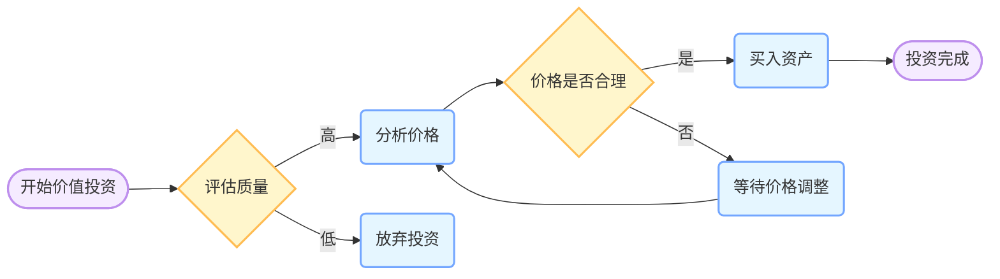

# 价值投资中的质量 vs 价格权衡

> 关键词：价值投资、质量、价格、权衡、投资策略

> 摘要：本文聚焦于价值投资领域中质量与价格的权衡问题。通过深入剖析质量和价格在价值投资中的核心概念及相互联系，阐述相关核心算法原理和数学模型，结合项目实战案例详细解读代码实现，探讨其在实际投资场景中的应用。同时，推荐了学习资源、开发工具框架以及相关论文著作，最后对价值投资中质量与价格权衡的未来发展趋势和挑战进行总结，并解答常见问题，为投资者提供全面且深入的投资决策参考。

## 1. 背景介绍 

### 1.1 目的和范围
价值投资是一种被广泛应用的投资策略，其核心在于寻找被市场低估的资产以获取长期回报。在价值投资过程中，质量和价格是两个至关重要的因素。本文的目的是深入探讨价值投资中质量与价格之间的权衡关系，帮助投资者更好地理解如何在这两个因素之间做出合理的决策。

本文的范围涵盖了价值投资中质量和价格的基本概念、核心算法原理、数学模型、实际应用案例以及相关的工具和资源推荐等方面。通过全面的分析和阐述，为投资者提供一个系统的框架来思考和处理质量与价格的权衡问题。

### 1.2 预期读者
本文预期读者包括但不限于以下几类人群：
- 个人投资者：希望提升自己的投资知识和技能，更好地进行价值投资决策的普通投资者。
- 金融从业者：如股票分析师、基金经理等，需要深入理解价值投资中质量与价格的关系，以制定更有效的投资策略。
- 金融专业学生：正在学习金融投资相关课程，希望通过本文加深对价值投资理论和实践的理解。

### 1.3 文档结构概述
本文将按照以下结构进行组织：
- 核心概念与联系：介绍价值投资中质量和价格的核心概念，以及它们之间的相互关系，并通过文本示意图和 Mermaid 流程图进行直观展示。
- 核心算法原理 & 具体操作步骤：阐述用于评估质量和价格的核心算法原理，并给出具体的操作步骤，同时使用 Python 源代码进行详细说明。
- 数学模型和公式 & 详细讲解 & 举例说明：介绍相关的数学模型和公式，对其进行详细讲解，并通过具体的例子进行说明。
- 项目实战：代码实际案例和详细解释说明：通过一个实际的投资项目案例，展示如何运用前面介绍的算法和模型进行质量与价格的权衡，并对代码进行详细解读。
- 实际应用场景：探讨价值投资中质量与价格权衡在不同实际场景中的应用。
- 工具和资源推荐：推荐一些学习价值投资、进行质量与价格评估的工具和资源，包括书籍、在线课程、技术博客、开发工具框架和相关论文著作等。
- 总结：未来发展趋势与挑战：对价值投资中质量与价格权衡的未来发展趋势进行展望，并分析可能面临的挑战。
- 附录：常见问题与解答：解答读者在价值投资中质量与价格权衡方面可能遇到的常见问题。
- 扩展阅读 & 参考资料：提供一些扩展阅读的建议和本文参考的相关资料。

### 1.4 术语表

#### 1.4.1 核心术语定义
- **价值投资**：一种投资策略，通过分析资产的内在价值，寻找被市场低估的资产进行投资，以获取长期的资本增值。
- **质量**：在价值投资中，质量通常指资产的基本面状况，包括公司的盈利能力、财务健康状况、竞争优势、管理团队能力等方面。
- **价格**：指资产在市场上的交易价格，是投资者购买资产所需支付的成本。
- **内在价值**：资产的真实价值，是基于其未来现金流、盈利能力等基本面因素估算出来的价值。

#### 1.4.2 相关概念解释
- **质量评估**：对资产的基本面状况进行分析和评估，以确定其质量水平。常见的评估指标包括净资产收益率（ROE）、净利润增长率、资产负债率等。
- **价格评估**：分析资产的市场价格，判断其是否被低估或高估。常用的方法包括市盈率（PE）、市净率（PB）等估值指标。
- **质量与价格权衡**：在价值投资中，投资者需要在资产的质量和价格之间进行权衡，寻找质量较高且价格相对合理的资产进行投资。

#### 1.4.3 缩略词列表
- **ROE**：Return on Equity，净资产收益率
- **PE**：Price-to-Earnings Ratio，市盈率
- **PB**：Price-to-Book Ratio，市净率

## 2. 核心概念与联系 

### 2.1 质量的概念
在价值投资中，质量是一个综合性的概念，它反映了资产的基本面状况。高质量的资产通常具有以下特征：
- **盈利能力强**：公司能够持续稳定地创造利润，具有较高的净资产收益率（ROE）和净利润增长率。例如，一家公司的 ROE 长期保持在 20%以上，且净利润每年都有一定的增长，说明该公司具有较强的盈利能力。
- **财务健康**：公司的资产负债率较低，现金流充足，偿债能力强。这样的公司在面对市场波动和经济衰退时，具有更强的抗风险能力。
- **竞争优势明显**：公司在所处行业中具有独特的竞争优势，如品牌优势、技术优势、成本优势等。这些优势能够帮助公司在市场竞争中脱颖而出，保持较高的市场份额和盈利能力。
- **管理团队优秀**：公司拥有一支经验丰富、能力卓越的管理团队，他们能够制定合理的发展战略，有效地管理公司的运营，为股东创造价值。

### 2.2 价格的概念
价格是资产在市场上的交易价格，它受到多种因素的影响，包括市场供求关系、宏观经济环境、行业发展趋势等。在价值投资中，价格是投资者关注的重要因素之一，因为投资者希望以较低的价格购买到高质量的资产，从而获得更高的投资回报。

### 2.3 质量与价格的关系
质量和价格之间存在着密切的关系。一般来说，高质量的资产往往具有较高的价格，因为市场会对其优秀的基本面状况给予一定的溢价。然而，市场并不总是有效的，有时会出现价格与质量背离的情况，即高质量的资产价格被低估，或者低质量的资产价格被高估。

价值投资的核心就是寻找这种价格与质量背离的机会，通过深入的基本面分析和估值评估，发现被市场低估的高质量资产，以较低的价格买入，等待市场对其价值的重新认可，从而实现投资回报。

### 2.4 文本示意图
```plaintext
价值投资
|-- 质量
|   |-- 盈利能力
|   |-- 财务健康
|   |-- 竞争优势
|   |-- 管理团队
|-- 价格
|   |-- 市场供求关系
|   |-- 宏观经济环境
|   |-- 行业发展趋势
|-- 质量与价格权衡
    |-- 寻找价格与质量背离机会
    |-- 低价格买入高质量资产
```

### 2.5 Mermaid 流程图


## 3. 核心算法原理 & 具体操作步骤 

### 3.1 质量评估算法原理
质量评估的核心是对公司的基本面状况进行综合分析，常用的评估指标包括净资产收益率（ROE）、净利润增长率、资产负债率等。下面是一个简单的 Python 代码示例，用于计算这些指标：

```python
import pandas as pd

def calculate_roe(net_income, shareholders_equity):
    """
    计算净资产收益率（ROE）
    :param net_income: 净利润
    :param shareholders_equity: 股东权益
    :return: ROE
    """
    return net_income / shareholders_equity

def calculate_net_income_growth_rate(net_income_current, net_income_previous):
    """
    计算净利润增长率
    :param net_income_current: 当前净利润
    :param net_income_previous: 上一期净利润
    :return: 净利润增长率
    """
    return (net_income_current - net_income_previous) / net_income_previous

def calculate_debt_ratio(total_debt, total_assets):
    """
    计算资产负债率
    :param total_debt: 总负债
    :param total_assets: 总资产
    :return: 资产负债率
    """
    return total_debt / total_assets

# 示例数据
data = {
    'net_income': [1000, 1200],
    'shareholders_equity': [5000, 5500],
    'total_debt': [2000, 2200],
    'total_assets': [8000, 8500]
}
df = pd.DataFrame(data)

# 计算指标
df['ROE'] = calculate_roe(df['net_income'], df['shareholders_equity'])
df['net_income_growth_rate'] = calculate_net_income_growth_rate(df['net_income'], df['net_income'].shift(1))
df['debt_ratio'] = calculate_debt_ratio(df['total_debt'], df['total_assets'])

print(df)
```

### 3.2 价格评估算法原理
价格评估常用的方法是使用市盈率（PE）和市净率（PB）等估值指标。下面是一个简单的 Python 代码示例，用于计算这些指标：

```python
def calculate_pe(stock_price, earnings_per_share):
    """
    计算市盈率（PE）
    :param stock_price: 股票价格
    :param earnings_per_share: 每股收益
    :return: PE
    """
    return stock_price / earnings_per_share

def calculate_pb(stock_price, book_value_per_share):
    """
    计算市净率（PB）
    :param stock_price: 股票价格
    :param book_value_per_share: 每股净资产
    :return: PB
    """
    return stock_price / book_value_per_share

# 示例数据
stock_price = 50
earnings_per_share = 5
book_value_per_share = 20

# 计算指标
pe = calculate_pe(stock_price, earnings_per_share)
pb = calculate_pb(stock_price, book_value_per_share)

print(f"市盈率（PE）: {pe}")
print(f"市净率（PB）: {pb}")
```

### 3.3 质量与价格权衡操作步骤
1. **收集数据**：收集公司的财务报表数据，包括净利润、股东权益、总负债、总资产、每股收益、每股净资产等，以及股票的市场价格数据。
2. **质量评估**：使用上述质量评估算法，计算公司的 ROE、净利润增长率、资产负债率等指标，对公司的质量进行评估。
3. **价格评估**：使用上述价格评估算法，计算公司的 PE、PB 等估值指标，对公司的价格进行评估。
4. **权衡决策**：根据质量评估和价格评估的结果，进行权衡决策。如果公司的质量较高，且价格相对合理（如 PE、PB 低于行业平均水平），则可以考虑买入该公司的股票；如果公司的质量较低，或者价格过高，则应该放弃投资。

## 4. 数学模型和公式 & 详细讲解 & 举例说明 

### 4.1 净资产收益率（ROE）
- **公式**：$$ROE = \frac{Net\ Income}{Shareholders'\ Equity}$$
- **讲解**：ROE 反映了公司运用自有资本的效率，即股东每投入一元钱能够获得多少净利润。ROE 越高，说明公司的盈利能力越强，股东的回报越高。
- **举例**：假设一家公司的净利润为 1000 万元，股东权益为 5000 万元，则该公司的 ROE 为：$$ROE = \frac{1000}{5000} = 0.2 = 20\%$$

### 4.2 净利润增长率
- **公式**：$$Net\ Income\ Growth\ Rate = \frac{Net\ Income_{current} - Net\ Income_{previous}}{Net\ Income_{previous}}$$
- **讲解**：净利润增长率反映了公司净利润的增长情况，是衡量公司成长性的重要指标。净利润增长率越高，说明公司的发展势头越好。
- **举例**：假设一家公司上一年的净利润为 1000 万元，今年的净利润为 1200 万元，则该公司的净利润增长率为：$$Net\ Income\ Growth\ Rate = \frac{1200 - 1000}{1000} = 0.2 = 20\%$$

### 4.3 资产负债率
- **公式**：$$Debt\ Ratio = \frac{Total\ Debt}{Total\ Assets}$$
- **讲解**：资产负债率反映了公司的负债水平，即公司的总资产中有多少是通过负债获得的。资产负债率越高，说明公司的财务风险越大。
- **举例**：假设一家公司的总负债为 2000 万元，总资产为 8000 万元，则该公司的资产负债率为：$$Debt\ Ratio = \frac{2000}{8000} = 0.25 = 25\%$$

### 4.4 市盈率（PE）
- **公式**：$$PE = \frac{Stock\ Price}{Earnings\ Per\ Share}$$
- **讲解**：PE 反映了市场对公司盈利的预期，即投资者愿意为公司每一元的净利润支付多少价格。PE 越高，说明市场对公司的预期越高，但同时也意味着投资风险越大。
- **举例**：假设一只股票的价格为 50 元，每股收益为 5 元，则该股票的 PE 为：$$PE = \frac{50}{5} = 10$$

### 4.5 市净率（PB）
- **公式**：$$PB = \frac{Stock\ Price}{Book\ Value\ Per\ Share}$$
- **讲解**：PB 反映了市场对公司净资产的估值，即投资者愿意为公司每一元的净资产支付多少价格。PB 越低，说明公司的股票越便宜，但同时也可能意味着公司的盈利能力较弱。
- **举例**：假设一只股票的价格为 50 元，每股净资产为 20 元，则该股票的 PB 为：$$PB = \frac{50}{20} = 2.5$$

## 5. 项目实战：代码实际案例和详细解释说明 

### 5.1 开发环境搭建
为了完成本项目实战，我们需要搭建以下开发环境：
- **Python 环境**：建议使用 Python 3.7 及以上版本。可以从 Python 官方网站（https://www.python.org/downloads/）下载并安装。
- **开发工具**：推荐使用 PyCharm 作为开发工具，它是一款功能强大的 Python IDE，可以提高开发效率。可以从 JetBrains 官方网站（https://www.jetbrains.com/pycharm/download/）下载并安装。
- **第三方库**：需要安装 pandas、numpy 等第三方库，用于数据处理和分析。可以使用以下命令进行安装：
```sh
pip install pandas numpy
```

### 5.2 源代码详细实现和代码解读
以下是一个完整的 Python 代码示例，用于实现价值投资中质量与价格的权衡：

```python
import pandas as pd

# 质量评估函数
def calculate_roe(net_income, shareholders_equity):
    """
    计算净资产收益率（ROE）
    :param net_income: 净利润
    :param shareholders_equity: 股东权益
    :return: ROE
    """
    return net_income / shareholders_equity

def calculate_net_income_growth_rate(net_income_current, net_income_previous):
    """
    计算净利润增长率
    :param net_income_current: 当前净利润
    :param net_income_previous: 上一期净利润
    :return: 净利润增长率
    """
    return (net_income_current - net_income_previous) / net_income_previous

def calculate_debt_ratio(total_debt, total_assets):
    """
    计算资产负债率
    :param total_debt: 总负债
    :param total_assets: 总资产
    :return: 资产负债率
    """
    return total_debt / total_assets

# 价格评估函数
def calculate_pe(stock_price, earnings_per_share):
    """
    计算市盈率（PE）
    :param stock_price: 股票价格
    :param earnings_per_share: 每股收益
    :return: PE
    """
    return stock_price / earnings_per_share

def calculate_pb(stock_price, book_value_per_share):
    """
    计算市净率（PB）
    :param stock_price: 股票价格
    :param book_value_per_share: 每股净资产
    :return: PB
    """
    return stock_price / book_value_per_share

# 质量与价格权衡函数
def quality_price_tradeoff(data):
    """
    质量与价格权衡
    :param data: 包含财务数据和股票价格的数据框
    :return: 筛选后的投资建议数据框
    """
    # 计算质量指标
    data['ROE'] = calculate_roe(data['net_income'], data['shareholders_equity'])
    data['net_income_growth_rate'] = calculate_net_income_growth_rate(data['net_income'], data['net_income'].shift(1))
    data['debt_ratio'] = calculate_debt_ratio(data['total_debt'], data['total_assets'])

    # 计算价格指标
    data['PE'] = calculate_pe(data['stock_price'], data['earnings_per_share'])
    data['PB'] = calculate_pb(data['stock_price'], data['book_value_per_share'])

    # 筛选高质量、低价格的股票
    high_quality = data['ROE'] > 0.2  # ROE 大于 20%
    low_debt = data['debt_ratio'] < 0.5  # 资产负债率小于 50%
    low_pe = data['PE'] < 15  # PE 小于 15
    low_pb = data['PB'] < 2  # PB 小于 2

    selected_stocks = data[high_quality & low_debt & low_pe & low_pb]
    return selected_stocks

# 示例数据
data = {
    'stock_code': ['000001', '000002', '000003'],
    'stock_price': [50, 60, 70],
    'net_income': [1000, 1200, 1500],
    'shareholders_equity': [5000, 5500, 6000],
    'total_debt': [2000, 2200, 2500],
    'total_assets': [8000, 8500, 9000],
    'earnings_per_share': [5, 6, 7],
    'book_value_per_share': [20, 22, 25]
}
df = pd.DataFrame(data)

# 进行质量与价格权衡
selected_stocks = quality_price_tradeoff(df)
print(selected_stocks)
```

### 5.3 代码解读与分析
- **质量评估函数**：`calculate_roe`、`calculate_net_income_growth_rate` 和 `calculate_debt_ratio` 函数分别用于计算净资产收益率、净利润增长率和资产负债率，这些指标用于评估公司的质量。
- **价格评估函数**：`calculate_pe` 和 `calculate_pb` 函数分别用于计算市盈率和市净率，这些指标用于评估公司的价格。
- **质量与价格权衡函数**：`quality_price_tradeoff` 函数首先计算公司的质量和价格指标，然后根据预设的筛选条件（ROE 大于 20%、资产负债率小于 50%、PE 小于 15、PB 小于 2）筛选出高质量、低价格的股票。
- **示例数据**：创建一个包含股票代码、股票价格、财务数据等信息的数据框 `df`，作为示例数据。
- **执行权衡操作**：调用 `quality_price_tradeoff` 函数对示例数据进行质量与价格的权衡，筛选出符合条件的股票，并打印结果。

通过这个代码示例，我们可以看到如何运用 Python 实现价值投资中质量与价格的权衡，帮助投资者筛选出具有投资价值的股票。

## 6. 实际应用场景 
### 6.1 股票投资
在股票投资中，质量与价格的权衡是非常重要的。投资者可以通过分析公司的基本面状况和估值指标，寻找高质量、低价格的股票进行投资。例如，投资者可以关注那些 ROE 较高、净利润增长率稳定、资产负债率较低，同时 PE 和 PB 相对较低的公司。这样的公司往往具有较强的盈利能力和成长潜力，且股票价格相对合理，投资风险相对较低。

### 6.2 基金投资
在基金投资中，投资者也可以运用质量与价格的权衡原则。例如，投资者可以选择那些业绩表现优秀、管理团队经验丰富、投资策略稳健的基金，同时关注基金的费率水平，选择费用较低的基金进行投资。这样可以在保证基金质量的前提下，降低投资成本，提高投资回报。

### 6.3 债券投资
在债券投资中，质量与价格的权衡同样重要。投资者需要评估债券的信用质量，选择信用等级较高、违约风险较低的债券。同时，投资者还需要关注债券的收益率，选择收益率相对较高的债券进行投资。通过在债券质量和收益率之间进行权衡，投资者可以实现风险和收益的平衡。

## 7. 工具和资源推荐

### 7.1 学习资源推荐

#### 7.1.1 书籍推荐
- 《聪明的投资者》（The Intelligent Investor）：本杰明·格雷厄姆（Benjamin Graham）著，被誉为价值投资的圣经，详细介绍了价值投资的理念和方法。
- 《巴菲特致股东的信》（Letters to Shareholders of Berkshire Hathaway）：沃伦·巴菲特（Warren Buffett）著，通过巴菲特致股东的信，深入了解巴菲特的投资思想和决策过程。
- 《财务报表分析与证券定价》（Financial Statement Analysis and Security Valuation）：斯蒂芬·佩因曼（Stephen Penman）著，系统介绍了财务报表分析的方法和技术，以及如何运用财务报表进行证券定价。

#### 7.1.2 在线课程
- Coursera 上的“投资学原理”（Principles of Investing）：由耶鲁大学教授罗伯特·席勒（Robert Shiller）授课，介绍了投资学的基本原理和方法。
- edX 上的“价值投资入门”（Introduction to Value Investing）：由哥伦比亚大学教授布鲁斯·格林沃尔德（Bruce Greenwald）授课，深入讲解了价值投资的理念和实践。

#### 7.1.3 技术博客和网站
- Seeking Alpha（https://seekingalpha.com/）：一个提供股票分析、投资策略和财经新闻的网站，有很多专业的投资者和分析师分享他们的观点和研究成果。
- Morningstar（https://www.morningstar.com/）：全球知名的基金评级和研究机构，提供基金、股票、债券等多种金融产品的分析和评级服务。

### 7.2 开发工具框架推荐

#### 7.2.1 IDE 和编辑器
- PyCharm：一款功能强大的 Python IDE，具有代码编辑、调试、版本控制等多种功能，适合 Python 开发者使用。
- Jupyter Notebook：一个交互式的开发环境，支持 Python、R 等多种编程语言，适合数据分析师和科研人员使用。

#### 7.2.2 调试和性能分析工具
- pdb：Python 自带的调试工具，可以帮助开发者在代码中设置断点、单步执行代码等，方便调试程序。
- cProfile：Python 自带的性能分析工具，可以分析程序的运行时间和函数调用情况，帮助开发者找出程序的性能瓶颈。

#### 7.2.3 相关框架和库
- pandas：一个强大的数据处理和分析库，提供了 DataFrame 等数据结构，方便进行数据清洗、转换和分析。
- numpy：一个用于科学计算的库，提供了高效的数组和矩阵运算功能，是很多数据分析和机器学习库的基础。

### 7.3 相关论文著作推荐

#### 7.3.1 经典论文
- “The Capital Asset Pricing Model: Theory and Evidence”：由威廉·夏普（William Sharpe）等人撰写，介绍了资本资产定价模型（CAPM）的理论和实证研究。
- “Efficient Capital Markets: A Review of Theory and Empirical Work”：由尤金·法玛（Eugene F. Fama）撰写，对有效市场假说进行了系统的阐述和实证检验。

#### 7.3.2 最新研究成果
- 关注《Journal of Finance》、《Review of Financial Studies》等顶级金融学术期刊，了解价值投资领域的最新研究成果。
- 参加金融学术会议，如美国金融协会（American Finance Association）年会等，与国内外的学者和专家交流最新的研究进展。

#### 7.3.3 应用案例分析
- 研究巴菲特、查理·芒格等投资大师的投资案例，分析他们在价值投资中如何进行质量与价格的权衡。
- 关注一些知名投资机构的研究报告和投资策略，学习他们在实际投资中的经验和方法。

## 8. 总结：未来发展趋势与挑战
### 8.1 未来发展趋势
- **数据驱动的投资决策**：随着大数据、人工智能等技术的发展，投资者将越来越多地运用数据驱动的方法进行投资决策。通过分析海量的财务数据、市场数据和非结构化数据，投资者可以更准确地评估资产的质量和价格，发现投资机会。
- **ESG 投资的兴起**：环境、社会和治理（ESG）因素在投资决策中的重要性日益凸显。投资者将更加关注公司的可持续发展能力、社会责任履行情况和治理结构，将 ESG 因素纳入质量评估体系，寻找具有良好 ESG 表现的资产进行投资。
- **全球资产配置**：随着全球经济一体化的发展，投资者将越来越倾向于进行全球资产配置，以分散投资风险，提高投资回报。在全球范围内寻找高质量、低价格的资产，需要投资者具备更广泛的市场视野和跨文化的投资能力。

### 8.2 挑战
- **市场不确定性增加**：全球政治经济形势的不确定性增加，如贸易摩擦、地缘政治冲突、宏观经济政策调整等，将对资产价格产生较大的影响，增加了投资者进行质量与价格权衡的难度。
- **信息过载**：随着信息技术的发展，投资者面临着海量的信息，如何从众多的信息中筛选出有价值的信息，进行准确的质量和价格评估，是投资者面临的一大挑战。
- **模型风险**：投资者在进行质量与价格评估时，往往会使用各种数学模型和算法。然而，这些模型和算法都存在一定的局限性，可能会导致评估结果出现偏差，增加投资风险。

## 9. 附录：常见问题与解答
### 9.1 如何确定质量和价格的权重？
质量和价格的权重没有固定的标准，需要根据投资者的投资目标、风险偏好和市场环境等因素进行综合考虑。一般来说，风险偏好较低的投资者可能会更注重质量，给予质量较高的权重；而风险偏好较高的投资者可能会更注重价格，给予价格较高的权重。

### 9.2 质量和价格哪个更重要？
质量和价格都很重要，不能简单地说哪个更重要。在价值投资中，投资者需要在质量和价格之间进行权衡，寻找质量较高且价格相对合理的资产进行投资。如果只注重质量而忽视价格，可能会买入价格过高的资产，导致投资回报率较低；如果只注重价格而忽视质量，可能会买入低质量的资产，面临较高的投资风险。

### 9.3 如何处理质量和价格的矛盾？
当质量和价格出现矛盾时，投资者需要进行深入的分析和判断。如果高质量的资产价格过高，可以考虑等待价格调整后再买入；如果低价格的资产质量较低，需要进一步分析其质量下降的原因，判断是否存在改善的可能性。在做出投资决策时，投资者需要综合考虑各种因素，权衡利弊，做出合理的选择。

## 10. 扩展阅读 & 参考资料
### 10.1 扩展阅读
- 《怎样选择成长股》（Common Stocks and Uncommon Profits）：菲利普·费雪（Philip Fisher）著，介绍了如何寻找具有成长潜力的股票。
- 《金融炼金术》（The Alchemy of Finance）：乔治·索罗斯（George Soros）著，探讨了金融市场的运行规律和投资者的心理因素。

### 10.2 参考资料
- 上市公司的财务报表和公告
- 金融数据提供商的数据，如 Wind、东方财富等
- 金融学术期刊和研究报告

作者：AI天才研究院/AI Genius Institute & 禅与计算机程序设计艺术 /Zen And The Art of Computer Programming