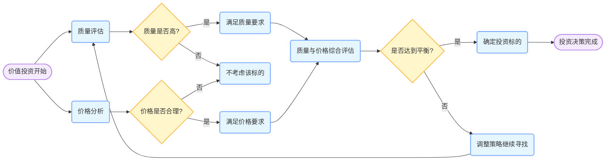

# 价值投资中的质量与价格平衡

> 关键词：价值投资、质量评估、价格分析、平衡策略、投资决策

> 摘要：本文聚焦于价值投资领域中质量与价格平衡的重要性及相关策略。通过对价值投资核心概念的深入剖析，阐述了如何评估投资标的的质量和价格，以及运用何种方法实现两者的平衡。文中详细介绍了相关的核心算法原理、数学模型，并结合实际案例进行分析。同时，探讨了该理念在不同实际场景中的应用，推荐了相关的学习资源、开发工具和论文著作。最后对价值投资中质量与价格平衡的未来发展趋势与挑战进行了总结，为投资者在价值投资决策中提供全面且深入的参考。

## 1. 背景介绍
### 1.1 目的和范围
价值投资作为一种长期投资策略，旨在通过评估资产的内在价值，以合理的价格买入具有优质特征的资产，从而获得长期稳定的回报。本文的目的在于深入探讨价值投资中质量与价格的平衡问题，涵盖了对投资标的质量评估的方法、价格分析的技巧，以及如何运用各种工具和策略来实现两者的最佳平衡。范围涉及股票、债券、基金等多种金融投资领域。

### 1.2 预期读者
本文预期读者包括对价值投资感兴趣的个人投资者、专业金融分析师、投资顾问以及相关领域的研究人员。无论是初涉投资领域的新手，还是具有一定经验的专业人士，都能从本文中获取关于价值投资中质量与价格平衡的深入见解和实用方法。

### 1.3 文档结构概述
本文将首先介绍价值投资中涉及的核心概念以及它们之间的联系，包括质量和价格的定义、评估标准等，并通过文本示意图和 Mermaid 流程图进行直观展示。接着详细阐述用于评估质量和价格的核心算法原理及具体操作步骤，同时给出相应的 Python 源代码。然后介绍相关的数学模型和公式，并结合实际例子进行说明。之后通过一个项目实战案例，详细解释代码实现和解读。再探讨价值投资中质量与价格平衡在实际应用中的场景。随后推荐相关的学习资源、开发工具和论文著作。最后总结未来发展趋势与挑战，并提供常见问题的解答和扩展阅读的参考资料。

### 1.4 术语表
#### 1.4.1 核心术语定义
- **价值投资**：一种基于对资产内在价值的分析，以低于或合理于内在价值的价格买入资产，并长期持有的投资策略。
- **投资标的质量**：指投资对象所具备的内在品质，包括但不限于公司的财务状况、行业竞争力、管理团队能力、品牌价值等。
- **投资标的价格**：即市场上该投资对象的交易价格，它受到市场供求关系、宏观经济环境、投资者情绪等多种因素的影响。
- **内在价值**：资产在正常市场条件下所应具有的价值，是基于对资产未来现金流、盈利能力等因素的评估得出的。

#### 1.4.2 相关概念解释
- **质量评估**：通过对投资标的的各项指标进行分析和研究，以确定其质量高低的过程。评估指标可以包括财务比率、行业排名、市场份额等。
- **价格分析**：对投资标的当前价格进行研究，判断其是否合理，以及与内在价值的关系。价格分析可以采用技术分析、基本面分析等方法。
- **平衡策略**：在价值投资中，通过综合考虑投资标的的质量和价格，制定出既能保证投资质量又能以合理价格买入的投资策略。

#### 1.4.3 缩略词列表
- **PE**：市盈率（Price - Earnings Ratio），即股票价格除以每股收益，用于衡量股票的估值水平。
- **PB**：市净率（Price - to - Book Ratio），即股票价格除以每股净资产，反映了股票价格相对于净资产的倍数。
- **ROE**：净资产收益率（Return on Equity），衡量公司运用自有资本的效率，反映股东权益的收益水平。

## 2. 核心概念与联系
### 核心概念原理
在价值投资中，质量和价格是两个核心概念。质量是投资标的的内在属性，它决定了投资标的的长期价值和稳定性。一个高质量的投资标的通常具有良好的财务状况、强大的行业竞争力、优秀的管理团队和较高的品牌价值等特征。这些特征使得投资标的能够在市场波动中保持相对稳定的业绩，并具有较高的成长潜力。

价格则是投资标的在市场上的交易价值，它受到市场供求关系、宏观经济环境、投资者情绪等多种因素的影响。价格的波动是市场的正常现象，但在价值投资中，我们关注的是价格与内在价值的关系。当价格低于内在价值时，投资标的具有一定的安全边际，此时买入可能获得较高的回报；而当价格高于内在价值时，投资风险相对较高。

质量和价格之间存在着密切的联系。一般来说，高质量的投资标的往往具有较高的价格，但这并不意味着价格高就一定代表质量好。在实际投资中，我们需要寻找那些质量较高但价格相对合理的投资标的，即实现质量与价格的平衡。

### 文本示意图
```plaintext
价值投资
|
|-- 质量评估
|   |-- 财务状况（盈利能力、偿债能力等）
|   |-- 行业竞争力（市场份额、技术优势等）
|   |-- 管理团队（经验、能力等）
|   |-- 品牌价值（知名度、美誉度等）
|
|-- 价格分析
|   |-- 市场价格
|   |-- 内在价值评估（现金流折现法、相对估值法等）
|
|-- 质量与价格平衡
|   |-- 寻找高质量低价格标的
|   |-- 制定投资策略
```

### Mermaid 流程图


## 3. 核心算法原理 & 具体操作步骤
### 质量评估算法原理及 Python 实现
#### 财务比率评估
财务比率是评估投资标的质量的重要指标之一，常用的财务比率包括市盈率（PE）、市净率（PB）、净资产收益率（ROE）等。以下是使用 Python 计算这些财务比率的代码示例：

```python
class FinancialRatioCalculator:
    def __init__(self, stock_price, earnings_per_share, book_value_per_share, net_income, shareholders_equity):
        self.stock_price = stock_price
        self.earnings_per_share = earnings_per_share
        self.book_value_per_share = book_value_per_share
        self.net_income = net_income
        self.shareholders_equity = shareholders_equity

    def calculate_pe_ratio(self):
        """计算市盈率"""
        if self.earnings_per_share == 0:
            return None
        return self.stock_price / self.earnings_per_share

    def calculate_pb_ratio(self):
        """计算市净率"""
        if self.book_value_per_share == 0:
            return None
        return self.stock_price / self.book_value_per_share

    def calculate_roe(self):
        """计算净资产收益率"""
        if self.shareholders_equity == 0:
            return None
        return (self.net_income / self.shareholders_equity) * 100


# 示例数据
stock_price = 50
earnings_per_share = 2
book_value_per_share = 10
net_income = 1000000
shareholders_equity = 5000000

calculator = FinancialRatioCalculator(stock_price, earnings_per_share, book_value_per_share, net_income, shareholders_equity)
pe_ratio = calculator.calculate_pe_ratio()
pb_ratio = calculator.calculate_pb_ratio()
roe = calculator.calculate_roe()

print(f"市盈率: {pe_ratio}")
print(f"市净率: {pb_ratio}")
print(f"净资产收益率: {roe}%")
```

#### 行业竞争力评估
行业竞争力可以通过市场份额、技术优势等指标来评估。以下是一个简单的示例，假设我们有一个公司的市场份额数据，通过计算市场份额排名来评估其行业竞争力：

```python
class IndustryCompetitivenessEvaluator:
    def __init__(self, market_shares):
        self.market_shares = market_shares

    def rank_companies_by_market_share(self):
        """按市场份额对公司进行排名"""
        sorted_companies = sorted(self.market_shares.items(), key=lambda item: item[1], reverse=True)
        ranked_companies = {company: rank + 1 for rank, (company, _) in enumerate(sorted_companies)}
        return ranked_companies


# 示例数据
market_shares = {
    "Company A": 0.2,
    "Company B": 0.3,
    "Company C": 0.1,
    "Company D": 0.4
}

evaluator = IndustryCompetitivenessEvaluator(market_shares)
ranked_companies = evaluator.rank_companies_by_market_share()

print("按市场份额排名的公司:")
for company, rank in ranked_companies.items():
    print(f"{company}: 排名 {rank}")
```

### 价格分析算法原理及 Python 实现
#### 相对估值法
相对估值法是通过与同行业其他公司进行比较来评估投资标的价格是否合理。常用的相对估值指标包括市盈率（PE）、市净率（PB）等。以下是一个简单的相对估值示例：

```python
class RelativeValuationAnalyzer:
    def __init__(self, target_pe, peer_group_pe):
        self.target_pe = target_pe
        self.peer_group_pe = peer_group_pe

    def is_undervalued(self):
        """判断目标公司是否被低估"""
        return self.target_pe < self.peer_group_pe


# 示例数据
target_pe = 15
peer_group_pe = 20

analyzer = RelativeValuationAnalyzer(target_pe, peer_group_pe)
if analyzer.is_undervalued():
    print("目标公司被低估")
else:
    print("目标公司未被低估")
```

#### 现金流折现法
现金流折现法是通过预测投资标的未来的现金流，并将其折现到当前来评估其内在价值。以下是一个简单的现金流折现法示例：

```python
class DCFAnalyzer:
    def __init__(self, cash_flows, discount_rate):
        self.cash_flows = cash_flows
        self.discount_rate = discount_rate

    def calculate_dcf(self):
        """计算现金流折现价值"""
        dcf = 0
        for i, cash_flow in enumerate(self.cash_flows):
            discounted_cash_flow = cash_flow / ((1 + self.discount_rate) ** (i + 1))
            dcf += discounted_cash_flow
        return dcf


# 示例数据
cash_flows = [100, 120, 150, 180, 200]
discount_rate = 0.1

analyzer = DCFAnalyzer(cash_flows, discount_rate)
dcf_value = analyzer.calculate_dcf()

print(f"现金流折现价值: {dcf_value}")
```

## 4. 数学模型和公式 & 详细讲解 & 举例说明
### 财务比率相关公式
#### 市盈率（PE）
市盈率是股票价格与每股收益的比率，计算公式为：
$$PE = \frac{P}{EPS}$$
其中，$P$ 表示股票价格，$EPS$ 表示每股收益。

例如，某股票的价格为 50 元，每股收益为 2 元，则该股票的市盈率为：
$$PE = \frac{50}{2} = 25$$

市盈率反映了投资者为获得每一元收益所愿意支付的价格。一般来说，较低的市盈率可能表示股票被低估，但也可能反映了公司的业绩不佳或市场对其前景不看好。

#### 市净率（PB）
市净率是股票价格与每股净资产的比率，计算公式为：
$$PB = \frac{P}{BVPS}$$
其中，$P$ 表示股票价格，$BVPS$ 表示每股净资产。

例如，某股票的价格为 50 元，每股净资产为 10 元，则该股票的市净率为：
$$PB = \frac{50}{10} = 5$$

市净率反映了股票价格相对于净资产的倍数。较低的市净率可能表示股票被低估，但也可能意味着公司的资产质量不佳或盈利能力较弱。

#### 净资产收益率（ROE）
净资产收益率是净利润与股东权益的比率，计算公式为：
$$ROE = \frac{NI}{SE} \times 100\%$$
其中，$NI$ 表示净利润，$SE$ 表示股东权益。

例如，某公司的净利润为 100 万元，股东权益为 500 万元，则该公司的净资产收益率为：
$$ROE = \frac{100}{500} \times 100\% = 20\%$$

净资产收益率反映了公司运用自有资本的效率，是衡量公司盈利能力的重要指标。较高的净资产收益率通常表示公司具有较强的盈利能力和良好的管理水平。

### 现金流折现法公式
现金流折现法的基本公式为：
$$DCF = \sum_{t = 1}^{n} \frac{CF_t}{(1 + r)^t}$$
其中，$DCF$ 表示现金流折现价值，$CF_t$ 表示第 $t$ 期的现金流，$r$ 表示折现率，$n$ 表示预测期数。

例如，假设某投资项目未来 5 年的现金流分别为 100 万元、120 万元、150 万元、180 万元、200 万元，折现率为 10%，则该项目的现金流折现价值为：
$$DCF = \frac{100}{(1 + 0.1)^1} + \frac{120}{(1 + 0.1)^2} + \frac{150}{(1 + 0.1)^3} + \frac{180}{(1 + 0.1)^4} + \frac{200}{(1 + 0.1)^5}$$
$$DCF \approx 90.91 + 99.17 + 112.69 + 122.94 + 124.18 = 549.89$$（万元）

现金流折现法通过将未来的现金流折现到当前，考虑了货币的时间价值，能够更准确地评估投资标的的内在价值。

## 5. 项目实战：代码实际案例和详细解释说明
### 5.1 开发环境搭建
为了实现价值投资中质量与价格平衡的分析，我们可以使用 Python 进行开发。以下是搭建开发环境的步骤：
1. **安装 Python**：从 Python 官方网站（https://www.python.org/downloads/）下载并安装适合你操作系统的 Python 版本。建议安装 Python 3.7 及以上版本。
2. **安装必要的库**：我们需要使用一些 Python 库来进行数据处理、财务分析等操作，例如 `pandas`、`numpy` 等。可以使用以下命令进行安装：
```sh
pip install pandas numpy
```

### 5.2 源代码详细实现和代码解读
以下是一个综合的代码示例，用于评估多个股票的质量和价格，并筛选出质量较高且价格相对合理的股票：

```python
import pandas as pd
import numpy as np

# 定义股票数据类
class StockData:
    def __init__(self, name, stock_price, earnings_per_share, book_value_per_share, net_income, shareholders_equity):
        self.name = name
        self.stock_price = stock_price
        self.earnings_per_share = earnings_per_share
        self.book_value_per_share = book_value_per_share
        self.net_income = net_income
        self.shareholders_equity = shareholders_equity

    def calculate_pe_ratio(self):
        """计算市盈率"""
        if self.earnings_per_share == 0:
            return None
        return self.stock_price / self.earnings_per_share

    def calculate_pb_ratio(self):
        """计算市净率"""
        if self.book_value_per_share == 0:
            return None
        return self.stock_price / self.book_value_per_share

    def calculate_roe(self):
        """计算净资产收益率"""
        if self.shareholders_equity == 0:
            return None
        return (self.net_income / self.shareholders_equity) * 100

# 定义股票筛选器类
class StockFilter:
    def __init__(self, stocks):
        self.stocks = stocks

    def filter_stocks(self, max_pe, max_pb, min_roe):
        """筛选股票"""
        filtered_stocks = []
        for stock in self.stocks:
            pe_ratio = stock.calculate_pe_ratio()
            pb_ratio = stock.calculate_pb_ratio()
            roe = stock.calculate_roe()

            if pe_ratio is not None and pb_ratio is not None and roe is not None:
                if pe_ratio <= max_pe and pb_ratio <= max_pb and roe >= min_roe:
                    filtered_stocks.append(stock)

        return filtered_stocks

# 示例数据
stocks = [
    StockData("Stock A", 50, 2, 10, 1000000, 5000000),
    StockData("Stock B", 60, 3, 12, 1500000, 6000000),
    StockData("Stock C", 40, 1, 8, 800000, 4000000)
]

# 创建股票筛选器
filter = StockFilter(stocks)

# 设置筛选条件
max_pe = 20
max_pb = 5
min_roe = 15

# 筛选股票
filtered_stocks = filter.filter_stocks(max_pe, max_pb, min_roe)

# 输出筛选结果
print("筛选后的股票:")
for stock in filtered_stocks:
    print(f"名称: {stock.name}, 市盈率: {stock.calculate_pe_ratio()}, 市净率: {stock.calculate_pb_ratio()}, 净资产收益率: {stock.calculate_roe()}%")
```

### 5.3 代码解读与分析
1. **StockData 类**：该类用于存储股票的基本信息，并提供计算市盈率、市净率和净资产收益率的方法。
2. **StockFilter 类**：该类用于筛选股票，根据设定的最大市盈率、最大市净率和最小净资产收益率条件，筛选出符合要求的股票。
3. **主程序**：创建了一些示例股票数据，实例化 `StockFilter` 类，并设置筛选条件，最后调用 `filter_stocks` 方法进行股票筛选，并输出筛选结果。

通过这个代码示例，我们可以看到如何使用 Python 来实现价值投资中质量与价格平衡的分析，通过设置合理的筛选条件，能够快速筛选出质量较高且价格相对合理的股票。

## 6. 实际应用场景
### 股票投资
在股票投资中，价值投资者通过评估公司的质量和股票的价格，寻找那些被低估的优质股票。例如，通过分析公司的财务报表、行业竞争力等因素评估公司的质量，使用市盈率、市净率等指标分析股票的价格。当发现某只股票质量较高但价格相对较低时，价值投资者会选择买入该股票，并长期持有，等待其价值回归。

### 债券投资
在债券投资中，质量主要体现在债券发行人的信用状况、偿债能力等方面。价格则受到市场利率、债券期限等因素的影响。投资者可以通过评估债券的质量和价格，选择信用等级较高、收益率合理的债券进行投资。例如，当市场利率上升时，债券价格可能会下跌，此时对于一些信用良好的债券，投资者可以在价格下跌时买入，以获得较高的收益率。

### 基金投资
在基金投资中，基金的质量可以通过基金的业绩表现、基金经理的管理能力、基金的投资策略等方面进行评估。价格则通常表现为基金的净值。投资者可以通过比较不同基金的质量和净值，选择质量较高、净值相对合理的基金进行投资。例如，一些长期业绩优秀、基金经理经验丰富的基金，在市场调整时净值可能会出现一定程度的下跌，此时投资者可以考虑买入。

## 7. 工具和资源推荐
### 7.1 学习资源推荐
#### 7.1.1 书籍推荐
- 《聪明的投资者》（The Intelligent Investor）：本杰明·格雷厄姆（Benjamin Graham）著，被誉为价值投资的圣经，详细阐述了价值投资的理念和方法。
- 《证券分析》（Security Analysis）：本杰明·格雷厄姆和戴维·多德（David Dodd）著，是价值投资领域的经典著作，对证券分析的理论和实践进行了系统的阐述。
- 《巴菲特致股东的信：投资者和公司高管教程》（Letters to Shareholders of Berkshire Hathaway）：沃伦·巴菲特（Warren Buffett）著，通过巴菲特致股东的信，深入了解巴菲特的投资哲学和方法。

#### 7.1.2 在线课程
- Coursera 上的“投资学原理”（Principles of Investing）课程：由宾夕法尼亚大学的教授授课，涵盖了投资学的基本原理和方法，包括价值投资的相关内容。
- edX 上的“金融市场”（Financial Markets）课程：由耶鲁大学的教授授课，介绍了金融市场的各种投资工具和策略，对价值投资有深入的讲解。

#### 7.1.3 技术博客和网站
- 雪球网（https://xueqiu.com/）：国内知名的投资社区，提供股票、基金等投资领域的资讯、分析和交流平台，有很多价值投资者分享自己的投资经验和见解。
- Seeking Alpha（https://seekingalpha.com/）：国外知名的投资研究网站，提供大量的股票分析报告、投资策略等内容，对价值投资有深入的研究和探讨。

### 7.2 开发工具框架推荐
#### 7.2.1 IDE和编辑器
- PyCharm：一款专业的 Python 集成开发环境，提供代码编辑、调试、版本控制等功能，适合进行价值投资相关的 Python 代码开发。
- Jupyter Notebook：一种交互式的开发环境，支持 Python 等多种编程语言，适合进行数据分析和可视化，在价值投资的数据处理和分析中非常有用。

#### 7.2.2 调试和性能分析工具
- PDB：Python 自带的调试器，可以帮助开发者在代码执行过程中进行调试，查找和解决问题。
- cProfile：Python 标准库中的性能分析工具，可以分析代码的执行时间和函数调用情况，帮助优化代码性能。

#### 7.2.3 相关框架和库
- Pandas：一个强大的数据处理和分析库，提供了 DataFrame 等数据结构，方便进行财务数据的处理和分析。
- Numpy：一个用于科学计算的 Python 库，提供了高效的数组操作和数学函数，在价值投资的数值计算中非常有用。

### 7.3 相关论文著作推荐
#### 7.3.1 经典论文
- 《普通股定价：原则与应用》（Common Stock Values: Principles and Practice）：本杰明·格雷厄姆著，提出了价值投资的基本原理和方法，对后世的价值投资理论和实践产生了深远的影响。
- 《有效资本市场：理论与实证研究回顾》（Efficient Capital Markets: A Review of Theory and Empirical Work）：尤金·法玛（Eugene F. Fama）著，探讨了有效市场假说，对价值投资的理论基础产生了重要的影响。

#### 7.3.2 最新研究成果
- 近年来，关于价值投资的研究主要集中在如何结合大数据、人工智能等技术提高价值投资的效率和准确性。例如，一些研究使用机器学习算法对公司的财务数据和市场数据进行分析，以预测股票的未来走势和价值。
- 还有一些研究关注价值投资在不同市场环境下的适应性，以及如何应对市场的不确定性和风险。

#### 7.3.3 应用案例分析
- 可以参考一些知名价值投资者的投资案例，如沃伦·巴菲特投资可口可乐、富国银行等案例，分析他们在投资过程中如何评估公司的质量和价格，以及如何实现质量与价格的平衡。
- 一些金融机构和研究机构也会发布价值投资的应用案例分析报告，可以从中学习他们的投资策略和方法。

## 8. 总结：未来发展趋势与挑战
### 未来发展趋势
- **技术融合**：随着大数据、人工智能、机器学习等技术的不断发展，价值投资将与这些技术深度融合。通过利用大数据分析公司的财务数据、市场数据、社交媒体数据等多源数据，结合机器学习算法进行建模和预测，可以更准确地评估投资标的的质量和价格，提高投资决策的效率和准确性。
- **多元化投资**：未来价值投资将不仅仅局限于股票、债券等传统金融资产，还将拓展到房地产、大宗商品、私募股权等多元化的投资领域。投资者将更加注重资产的配置和组合，以实现风险的分散和收益的最大化。
- **社会责任投资**：随着社会对环境保护、社会责任和公司治理（ESG）的关注度不断提高，价值投资也将更加注重投资标的的 ESG 表现。投资者将更加倾向于投资那些具有良好 ESG 表现的公司，以实现经济效益和社会效益的双赢。

### 挑战
- **市场不确定性**：金融市场受到宏观经济环境、政策变化、地缘政治等多种因素的影响，具有高度的不确定性。在这种情况下，准确评估投资标的的质量和价格变得更加困难，价值投资策略的有效性也受到挑战。
- **数据质量和隐私问题**：在利用大数据和人工智能进行价值投资分析时，数据的质量和隐私问题是需要解决的重要挑战。不准确或不完整的数据可能导致错误的投资决策，而数据隐私问题则可能引发法律和道德风险。
- **竞争加剧**：随着价值投资理念的普及，越来越多的投资者开始采用价值投资策略，市场竞争加剧。这使得寻找被低估的优质投资标的变得更加困难，投资者需要不断提升自己的分析能力和投资技巧。

## 9. 附录：常见问题与解答
### 问题 1：如何确定投资标的的内在价值？
解答：确定投资标的的内在价值可以采用多种方法，如现金流折现法、相对估值法等。现金流折现法通过预测投资标的未来的现金流，并将其折现到当前来评估其内在价值；相对估值法通过与同行业其他公司进行比较，使用市盈率、市净率等指标来评估投资标的的价值。

### 问题 2：质量和价格哪个更重要？
解答：质量和价格在价值投资中都非常重要，两者缺一不可。高质量的投资标的具有更好的长期稳定性和成长潜力，但如果价格过高，可能会降低投资的回报率；而价格较低的投资标的可能具有一定的吸引力，但如果质量不佳，可能会面临较大的投资风险。因此，需要在质量和价格之间找到一个平衡点。

### 问题 3：价值投资是否适合短期投资？
解答：价值投资通常是一种长期投资策略，更注重投资标的的内在价值和长期发展潜力。短期市场波动较大，价格可能会偏离内在价值，难以准确评估投资标的的质量和价格。因此，价值投资更适合那些具有长期投资目标和耐心的投资者。

### 问题 4：如何评估公司的管理团队能力？
解答：可以从以下几个方面评估公司的管理团队能力：管理团队的经验和背景，包括他们在行业内的工作年限、曾经担任的职位等；公司的业绩表现，如营收增长、利润增长等；管理团队的战略决策能力，包括公司的发展战略、市场定位等；管理团队的创新能力，如是否能够推出新产品、开拓新市场等。

## 10. 扩展阅读 & 参考资料
### 扩展阅读
- 《投资中最简单的事》：邱国鹭著，作者结合自己多年的投资经验，深入浅出地阐述了价值投资的理念和方法，具有很高的实践指导意义。
- 《穷查理宝典：查理·芒格的智慧箴言录》：彼得·考夫曼（Peter D. Kaufman）编著，收录了查理·芒格的演讲、文章等内容，展示了芒格的投资哲学和思维方式，对价值投资者有很大的启发。

### 参考资料
- 各金融机构发布的研究报告和分析文章，如券商的研报、基金公司的投资策略报告等。
- 财经媒体的相关报道，如《财经》《财新》等杂志，以及新浪财经、腾讯财经等网站的报道。

作者：AI天才研究院/AI Genius Institute & 禅与计算机程序设计艺术 /Zen And The Art of Computer Programming