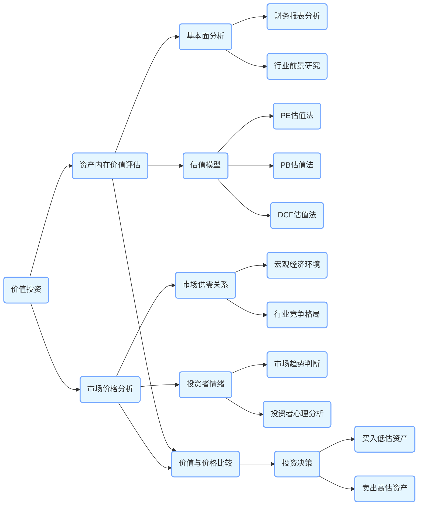

# 价值投资在不同资产类别中的应用

> 关键词：价值投资、资产类别、股票、债券、房地产、大宗商品、应用策略

> 摘要：本文围绕价值投资在不同资产类别中的应用展开深入探讨。首先介绍了价值投资的背景知识，包括目的、预期读者等内容。接着阐述了价值投资的核心概念及其与不同资产类别的联系，详细讲解了核心算法原理和操作步骤，并给出了相关数学模型和公式。通过项目实战案例，具体分析了价值投资在实际中的代码实现和解读。还探讨了价值投资在各类资产中的实际应用场景，推荐了学习价值投资的工具和资源。最后总结了价值投资的未来发展趋势与挑战，提供了常见问题解答及扩展阅读和参考资料，旨在为投资者全面了解和应用价值投资提供专业且系统的指导。

## 1. 背景介绍 
### 1.1 目的和范围
价值投资作为一种经典的投资理念，旨在通过分析资产的内在价值，寻找被市场低估的投资机会，以获取长期稳定的收益。本文的目的是深入研究价值投资在不同资产类别，如股票、债券、房地产、大宗商品等中的具体应用。我们将探讨如何运用价值投资的方法对各类资产进行评估、选择和管理，为投资者提供全面的投资策略和决策依据。研究范围涵盖了不同资产类别的特点、价值评估方法、投资风险和收益特征，以及价值投资在实际市场环境中的应用案例。

### 1.2 预期读者
本文预期读者包括各类投资者，无论是个人投资者还是机构投资者，只要对价值投资感兴趣并希望了解其在不同资产类别中的应用，都可以从本文中获得有价值的信息。同时，金融专业的学生、研究人员以及从事投资分析和咨询工作的专业人士也可以将本文作为参考资料，深入学习和研究价值投资的理论和实践。

### 1.3 文档结构概述
本文将按照以下结构进行阐述：首先介绍价值投资的核心概念及其与不同资产类别的联系，通过文本示意图和 Mermaid 流程图展示其原理和架构；接着详细讲解价值投资的核心算法原理和具体操作步骤，并使用 Python 源代码进行说明；然后给出价值投资的数学模型和公式，并通过举例进行详细讲解；之后通过项目实战案例，展示价值投资在实际中的代码实现和解读；再探讨价值投资在不同资产类别中的实际应用场景；推荐学习价值投资的工具和资源，包括书籍、在线课程、技术博客、开发工具框架和相关论文著作；最后总结价值投资的未来发展趋势与挑战，提供常见问题解答及扩展阅读和参考资料。

### 1.4 术语表
#### 1.4.1 核心术语定义
- **价值投资**：一种投资策略，基于对资产内在价值的分析，寻找价格低于内在价值的资产进行投资，以获取长期的资本增值和收益。
- **内在价值**：资产的真实价值，是根据资产的基本面因素，如盈利能力、现金流、资产质量等，通过一定的估值方法计算得出的价值。
- **资产类别**：根据资产的性质、特征和风险收益特点进行分类的不同投资对象，常见的资产类别包括股票、债券、房地产、大宗商品等。
- **估值**：对资产内在价值进行评估的过程，通过使用各种估值方法和模型，计算出资产的合理价值。
- **安全边际**：资产的市场价格与内在价值之间的差值，安全边际越大，投资的风险越低。

#### 1.4.2 相关概念解释
- **基本面分析**：通过研究资产的基本面因素，如公司的财务状况、行业前景、宏观经济环境等，来评估资产的内在价值和投资价值。
- **技术分析**：通过研究资产的价格走势、成交量等市场数据，来预测资产价格的未来走势。
- **投资组合**：由多种不同资产组成的投资集合，通过分散投资可以降低投资风险。
- **风险收益特征**：资产的风险和收益之间的关系，不同的资产类别具有不同的风险收益特征。

#### 1.4.3 缩略词列表
- **PE**：市盈率（Price-to-Earnings Ratio），是指股票价格与每股收益的比率，用于衡量股票的估值水平。
- **PB**：市净率（Price-to-Book Ratio），是指股票价格与每股净资产的比率，用于衡量股票的估值水平。
- **DCF**：现金流折现法（Discounted Cash Flow），是一种常用的估值方法，通过将资产未来的现金流折现到当前，来计算资产的内在价值。
- **ROE**：净资产收益率（Return on Equity），是指公司净利润与净资产的比率，用于衡量公司的盈利能力。

## 2. 核心概念与联系 
价值投资的核心概念是寻找被市场低估的资产，通过长期持有这些资产，等待市场对其价值进行重新评估，从而实现资产的增值。其基本原理是基于资产的内在价值与市场价格之间的差异。当市场价格低于内在价值时，就存在投资机会；当市场价格高于内在价值时，就应该考虑卖出资产。

### 核心概念原理示意图


### 不同资产类别与价值投资的联系
- **股票**：股票是价值投资中最常见的资产类别之一。通过对公司的基本面分析，如财务报表、行业前景、管理层能力等，可以评估公司的内在价值。当股票价格低于其内在价值时，就可以考虑买入；当股票价格高于其内在价值时，就可以考虑卖出。
- **债券**：债券的价值主要取决于其票面利率、到期时间、信用等级等因素。通过对债券的基本面分析和市场利率的研究，可以评估债券的内在价值。当债券价格低于其内在价值时，就可以考虑买入；当债券价格高于其内在价值时，就可以考虑卖出。
- **房地产**：房地产的价值受到地理位置、土地稀缺性、租金收益、市场供需关系等因素的影响。通过对房地产的基本面分析和市场调研，可以评估房地产的内在价值。当房地产价格低于其内在价值时，就可以考虑买入；当房地产价格高于其内在价值时，就可以考虑卖出。
- **大宗商品**：大宗商品的价值受到供求关系、宏观经济环境、地缘政治等因素的影响。通过对大宗商品的基本面分析和市场趋势的研究，可以评估大宗商品的内在价值。当大宗商品价格低于其内在价值时，就可以考虑买入；当大宗商品价格高于其内在价值时，就可以考虑卖出。

## 3. 核心算法原理 & 具体操作步骤 
### 核心算法原理
价值投资的核心算法是通过评估资产的内在价值，并将其与市场价格进行比较，以确定投资机会。常用的估值方法包括市盈率（PE）估值法、市净率（PB）估值法和现金流折现法（DCF）。

#### 市盈率（PE）估值法
市盈率是指股票价格与每股收益的比率，计算公式为：
$$PE = \frac{股价}{每股收益}$$
通过比较目标股票的市盈率与同行业其他股票的市盈率或历史平均市盈率，可以判断该股票是否被低估或高估。

#### 市净率（PB）估值法
市净率是指股票价格与每股净资产的比率，计算公式为：
$$PB = \frac{股价}{每股净资产}$$
通过比较目标股票的市净率与同行业其他股票的市净率或历史平均市净率，可以判断该股票是否被低估或高估。

#### 现金流折现法（DCF）
现金流折现法是一种基于资产未来现金流的估值方法，其基本原理是将资产未来的现金流折现到当前，以计算资产的内在价值。计算公式为：
$$V = \sum_{t=1}^{n} \frac{CF_t}{(1 + r)^t}$$
其中，$V$ 表示资产的内在价值，$CF_t$ 表示第 $t$ 期的现金流，$r$ 表示折现率，$n$ 表示现金流的期数。

### 具体操作步骤
#### 步骤 1：确定投资目标和范围
明确自己的投资目标，如长期资本增值、稳定收益等，并确定投资的资产类别和范围，如股票、债券、房地产等。

#### 步骤 2：收集和分析数据
收集目标资产的相关数据，如财务报表、行业报告、市场数据等，并进行分析。对于股票投资，需要分析公司的盈利能力、偿债能力、成长能力等；对于债券投资，需要分析债券的票面利率、到期时间、信用等级等；对于房地产投资，需要分析房地产的地理位置、租金收益、市场供需关系等。

#### 步骤 3：选择估值方法
根据目标资产的特点和数据情况，选择合适的估值方法。对于股票投资，常用的估值方法包括市盈率估值法、市净率估值法和现金流折现法；对于债券投资，常用的估值方法包括现金流折现法和债券定价模型；对于房地产投资，常用的估值方法包括收益法、成本法和市场比较法。

#### 步骤 4：计算内在价值
使用选择的估值方法，计算目标资产的内在价值。在计算过程中，需要合理估计相关参数，如折现率、增长率等。

#### 步骤 5：比较内在价值和市场价格
将计算得到的内在价值与目标资产的市场价格进行比较。如果市场价格低于内在价值，说明该资产被低估，具有投资价值；如果市场价格高于内在价值，说明该资产被高估，不具有投资价值。

#### 步骤 6：做出投资决策
根据比较结果，做出投资决策。如果目标资产被低估，可以考虑买入；如果目标资产被高估，可以考虑卖出或不买入。

### Python 代码示例
```python
# 市盈率（PE）估值法示例
def pe_valuation(stock_price, earnings_per_share):
    """
    计算市盈率
    :param stock_price: 股票价格
    :param earnings_per_share: 每股收益
    :return: 市盈率
    """
    return stock_price / earnings_per_share

# 市净率（PB）估值法示例
def pb_valuation(stock_price, book_value_per_share):
    """
    计算市净率
    :param stock_price: 股票价格
    :param book_value_per_share: 每股净资产
    :return: 市净率
    """
    return stock_price / book_value_per_share

# 现金流折现法（DCF）示例
def dcf_valuation(cash_flows, discount_rate):
    """
    计算现金流折现价值
    :param cash_flows: 未来现金流列表
    :param discount_rate: 折现率
    :return: 现金流折现价值
    """
    present_value = 0
    for i, cf in enumerate(cash_flows):
        present_value += cf / ((1 + discount_rate) ** (i + 1))
    return present_value

# 示例数据
stock_price = 50
earnings_per_share = 5
book_value_per_share = 20
cash_flows = [10, 12, 15, 18, 20]
discount_rate = 0.1

# 计算估值结果
pe = pe_valuation(stock_price, earnings_per_share)
pb = pb_valuation(stock_price, book_value_per_share)
dcf = dcf_valuation(cash_flows, discount_rate)

print(f"市盈率（PE）: {pe}")
print(f"市净率（PB）: {pb}")
print(f"现金流折现价值（DCF）: {dcf}")
```

## 4. 数学模型和公式 & 详细讲解 & 举例说明 
### 市盈率（PE）估值法
#### 数学模型和公式
$$PE = \frac{P}{EPS}$$
其中，$PE$ 表示市盈率，$P$ 表示股票价格，$EPS$ 表示每股收益。

#### 详细讲解
市盈率是衡量股票估值水平的常用指标之一。一般来说，市盈率越低，说明股票越便宜，具有更高的投资价值；市盈率越高，说明股票越贵，投资风险相对较高。但是，市盈率并不是越低越好，还需要结合公司的盈利能力、成长前景等因素进行综合分析。

#### 举例说明
假设某公司的股票价格为 50 元，每股收益为 5 元，则该公司的市盈率为：
$$PE = \frac{50}{5} = 10$$
如果同行业其他公司的平均市盈率为 15，则该公司的股票相对被低估，具有一定的投资价值。

### 市净率（PB）估值法
#### 数学模型和公式
$$PB = \frac{P}{BVPS}$$
其中，$PB$ 表示市净率，$P$ 表示股票价格，$BVPS$ 表示每股净资产。

#### 详细讲解
市净率是衡量股票估值水平的另一个常用指标。市净率反映了股票价格与每股净资产之间的关系，市净率越低，说明股票越便宜，具有更高的投资价值；市净率越高，说明股票越贵，投资风险相对较高。但是，市净率也不是越低越好，还需要考虑公司的资产质量、盈利能力等因素。

#### 举例说明
假设某公司的股票价格为 50 元，每股净资产为 20 元，则该公司的市净率为：
$$PB = \frac{50}{20} = 2.5$$
如果同行业其他公司的平均市净率为 3，则该公司的股票相对被低估，具有一定的投资价值。

### 现金流折现法（DCF）
#### 数学模型和公式
$$V = \sum_{t=1}^{n} \frac{CF_t}{(1 + r)^t}$$
其中，$V$ 表示资产的内在价值，$CF_t$ 表示第 $t$ 期的现金流，$r$ 表示折现率，$n$ 表示现金流的期数。

#### 详细讲解
现金流折现法是一种基于资产未来现金流的估值方法，其基本原理是将资产未来的现金流折现到当前，以计算资产的内在价值。折现率反映了投资者对资产未来现金流的风险偏好，折现率越高，说明投资者对风险的要求越高，资产的内在价值越低；折现率越低，说明投资者对风险的要求越低，资产的内在价值越高。

#### 举例说明
假设某公司未来 5 年的现金流分别为 10 万元、12 万元、15 万元、18 万元、20 万元，折现率为 10%，则该公司的内在价值为：
$$V = \frac{10}{(1 + 0.1)^1} + \frac{12}{(1 + 0.1)^2} + \frac{15}{(1 + 0.1)^3} + \frac{18}{(1 + 0.1)^4} + \frac{20}{(1 + 0.1)^5} \approx 58.73$$（万元）
如果该公司的市场价值低于 58.73 万元，则说明该公司的股票被低估，具有投资价值。

## 5. 项目实战：代码实际案例和详细解释说明 
### 5.1  开发环境搭建
为了实现价值投资的代码实战，我们需要搭建一个 Python 开发环境。以下是具体的搭建步骤：

#### 步骤 1：安装 Python
可以从 Python 官方网站（https://www.python.org/downloads/）下载适合你操作系统的 Python 安装包，并按照安装向导进行安装。

#### 步骤 2：安装必要的库
我们需要安装一些必要的 Python 库，如 `pandas`、`numpy` 等。可以使用以下命令进行安装：
```sh
pip install pandas numpy
```

### 5.2  源代码详细实现和代码解读
以下是一个使用 Python 实现价值投资选股的代码示例：
```python
import pandas as pd
import numpy as np

# 模拟股票数据
data = {
    '股票代码': ['000001', '000002', '000003', '000004', '000005'],
    '股票价格': [50, 60, 40, 70, 55],
    '每股收益': [5, 6, 4, 7, 5.5],
    '每股净资产': [20, 25, 15, 30, 22]
}
df = pd.DataFrame(data)

# 计算市盈率（PE）和市净率（PB）
df['PE'] = df['股票价格'] / df['每股收益']
df['PB'] = df['股票价格'] / df['每股净资产']

# 筛选被低估的股票
# 假设 PE < 10 且 PB < 2 为被低估的股票
undervalued_stocks = df[(df['PE'] < 10) & (df['PB'] < 2)]

print("所有股票数据：")
print(df)
print("\n被低估的股票：")
print(undervalued_stocks)
```

### 5.3  代码解读与分析
#### 代码功能概述
该代码模拟了一组股票数据，包括股票代码、股票价格、每股收益和每股净资产。然后，计算了每只股票的市盈率（PE）和市净率（PB），并筛选出 PE < 10 且 PB < 2 的被低估的股票。

#### 代码详细解读
1. **数据模拟**：使用 `pandas` 库创建一个包含股票数据的 DataFrame。
2. **计算市盈率和市净率**：通过将股票价格分别除以每股收益和每股净资产，计算出每只股票的市盈率和市净率。
3. **筛选被低估的股票**：使用布尔索引筛选出 PE < 10 且 PB < 2 的股票。
4. **输出结果**：打印所有股票数据和被低估的股票数据。

#### 分析与思考
通过该代码示例，我们可以看到如何使用 Python 进行价值投资选股。在实际应用中，我们可以使用真实的股票数据，并根据自己的投资策略和风险偏好调整筛选条件。同时，还可以结合其他估值方法和指标，如现金流折现法、股息率等，进行更全面的股票分析和筛选。

## 6. 实际应用场景 
### 股票投资
在股票投资中，价值投资可以帮助投资者寻找被市场低估的优质股票。通过对公司的基本面分析和估值，投资者可以选择具有良好盈利能力、稳定现金流和低估值的股票进行投资。例如，巴菲特就是价值投资的典型代表，他通过深入研究公司的基本面，长期持有可口可乐、富国银行等优质股票，获得了丰厚的回报。

### 债券投资
在债券投资中，价值投资可以帮助投资者选择具有较高信用等级和合理收益率的债券。通过对债券的票面利率、到期时间、信用等级等因素进行分析，投资者可以评估债券的内在价值，并选择被低估的债券进行投资。例如，在市场利率下降时，债券价格通常会上涨，投资者可以通过价值投资的方法，提前买入被低估的债券，以获取债券价格上涨带来的收益。

### 房地产投资
在房地产投资中，价值投资可以帮助投资者选择具有良好地理位置、稳定租金收益和增值潜力的房地产项目。通过对房地产的市场供需关系、租金收益率、土地稀缺性等因素进行分析，投资者可以评估房地产的内在价值，并选择被低估的房地产进行投资。例如，在城市核心区域，由于土地稀缺性和人口流入，房地产的增值潜力通常较大，投资者可以通过价值投资的方法，选择该区域被低估的房地产项目进行投资。

### 大宗商品投资
在大宗商品投资中，价值投资可以帮助投资者选择具有合理价格和供需关系的大宗商品。通过对大宗商品的供求关系、宏观经济环境、地缘政治等因素进行分析，投资者可以评估大宗商品的内在价值，并选择被低估的大宗商品进行投资。例如，在全球经济复苏期间，对能源、金属等大宗商品的需求通常会增加，投资者可以通过价值投资的方法，选择该时期被低估的大宗商品进行投资。

## 7. 工具和资源推荐
### 7.1 学习资源推荐
#### 7.1.1 书籍推荐
- 《聪明的投资者》（The Intelligent Investor）：本杰明·格雷厄姆（Benjamin Graham）著，被誉为价值投资的圣经，详细介绍了价值投资的理念、方法和策略。
- 《证券分析》（Security Analysis）：本杰明·格雷厄姆和大卫·多德（David Dodd）著，是价值投资领域的经典著作，对证券分析的理论和方法进行了系统的阐述。
- 《巴菲特致股东的信：股份公司教程》（The Essays of Warren Buffett: Lessons for Corporate America）：沃伦·巴菲特（Warren Buffett）著，收录了巴菲特历年致股东的信，从中可以学习到巴菲特的投资理念、方法和决策过程。
- 《怎样选择成长股》（Common Stocks and Uncommon Profits）：菲利普·费雪（Philip Fisher）著，介绍了如何通过研究公司的基本面和成长潜力，选择具有长期投资价值的成长股。

#### 7.1.2 在线课程
- Coursera 上的“投资学原理”（Principles of Investing）：由哥伦比亚大学教授主讲，系统介绍了投资学的基本原理和方法，包括价值投资、资产定价、投资组合管理等内容。
- edX 上的“金融市场”（Financial Markets）：由耶鲁大学教授罗伯特·席勒（Robert Shiller）主讲，深入探讨了金融市场的运行机制和投资策略，对价值投资有一定的涉及。
- 网易云课堂上的“价值投资实战训练营”：由国内知名投资专家主讲，结合实际案例，详细讲解了价值投资的实战方法和技巧。

#### 7.1.3 技术博客和网站
- 雪球网（https://xueqiu.com/）：国内知名的投资社区，提供了丰富的股票、基金、债券等投资信息和分析工具，同时还有很多投资者分享自己的投资经验和见解。
- 价值投资网（https://www.value-investing-world.com/）：专注于价值投资领域，提供了价值投资的理论、方法、案例等方面的内容，以及全球范围内的价值投资机会分析。
- Seeking Alpha（https://seekingalpha.com/）：国际知名的金融投资网站，提供了大量的股票分析报告、投资策略和市场评论，对价值投资者有很大的参考价值。

### 7.2 开发工具框架推荐
#### 7.2.1 IDE和编辑器
- PyCharm：一款专业的 Python 集成开发环境，具有强大的代码编辑、调试、分析等功能，适合开发价值投资相关的 Python 程序。
- Jupyter Notebook：一种交互式的开发环境，支持 Python、R 等多种编程语言，适合进行数据分析和模型验证，在价值投资的研究和实践中广泛应用。
- Visual Studio Code：一款轻量级的代码编辑器，支持多种编程语言和插件扩展，具有丰富的代码提示和调试功能，是开发价值投资代码的不错选择。

#### 7.2.2 调试和性能分析工具
- PySnooper：一个简单易用的 Python 调试工具，可以自动记录函数的调用过程和变量的值，帮助开发者快速定位问题。
- cProfile：Python 内置的性能分析工具，可以统计程序中各个函数的执行时间和调用次数，帮助开发者找出性能瓶颈。
- Memory Profiler：一个用于分析 Python 程序内存使用情况的工具，可以帮助开发者优化程序的内存占用。

#### 7.2.3 相关框架和库
- Pandas：一个强大的数据分析库，提供了高效的数据结构和数据处理工具，适合进行股票数据、财务数据等的分析和处理。
- NumPy：一个用于科学计算的 Python 库，提供了高效的数组操作和数学函数，在价值投资的模型计算中广泛应用。
- Scikit-learn：一个机器学习库，提供了丰富的机器学习算法和工具，可用于股票预测、风险评估等方面的研究和实践。

### 7.3 相关论文著作推荐
#### 7.3.1 经典论文
- 《资本资产定价模型：风险条件下的市场均衡理论》（Capital Asset Pricing Model: A Theory of Market Equilibrium under Conditions of Risk）：威廉·夏普（William Sharpe）著，提出了资本资产定价模型（CAPM），为资产定价和投资组合理论奠定了基础。
- 《有效资本市场：理论与实证研究综述》（Efficient Capital Markets: A Review of Theory and Empirical Work）：尤金·法玛（Eugene F. Fama）著，对有效市场假说进行了系统的阐述和实证研究，对价值投资的理论和实践产生了深远的影响。
- 《公司资本成本、公司财务与投资理论》（The Cost of Capital, Corporation Finance and the Theory of Investment）：弗兰科·莫迪利安尼（Franco Modigliani）和默顿·米勒（Merton H. Miller）著，提出了莫迪利安尼 - 米勒定理（MM 定理），为公司财务和资本结构理论提供了重要的理论基础。

#### 7.3.2 最新研究成果
- 《行为金融学与价值投资》（Behavioral Finance and Value Investing）：探讨了行为金融学对价值投资的影响，以及如何利用行为金融学的原理来优化价值投资策略。
- 《大数据与价值投资》（Big Data and Value Investing）：研究了大数据技术在价值投资中的应用，如利用大数据分析公司的基本面、市场情绪等，以提高投资决策的准确性。
- 《人工智能与价值投资》（Artificial Intelligence and Value Investing）：介绍了人工智能技术在价值投资中的应用，如机器学习、深度学习等，以挖掘投资机会和降低投资风险。

#### 7.3.3 应用案例分析
- 《价值投资在中国市场的实践与案例分析》：分析了价值投资在中国股票市场、债券市场、房地产市场等领域的应用案例，总结了价值投资在中国市场的特点和经验。
- 《巴菲特投资案例分析》：深入分析了巴菲特的投资案例，包括他对可口可乐、富国银行、苹果等公司的投资决策过程和投资策略，为投资者提供了宝贵的借鉴。
- 《价值投资在新兴市场的应用与挑战》：研究了价值投资在新兴市场的应用情况和面临的挑战，如市场效率低下、信息不对称等，并提出了相应的应对策略。

## 8. 总结：未来发展趋势与挑战
### 未来发展趋势
- **多元化资产配置**：随着金融市场的不断发展和创新，投资者将更加注重多元化资产配置，不仅投资于传统的股票、债券等资产，还会涉足房地产、大宗商品、私募股权等领域。价值投资将在多元化资产配置中发挥重要作用，帮助投资者寻找不同资产类别中的被低估机会。
- **科技与价值投资的融合**：科技的快速发展将为价值投资带来新的机遇和挑战。大数据、人工智能、机器学习等技术将被广泛应用于价值投资领域，帮助投资者更准确地评估资产的内在价值、预测市场趋势和挖掘投资机会。
- **社会责任投资的兴起**：越来越多的投资者开始关注企业的社会责任和可持续发展，社会责任投资（SRI）将成为未来价值投资的一个重要发展方向。价值投资者将更加注重企业的环境、社会和治理（ESG）表现，选择具有良好社会形象和可持续发展能力的企业进行投资。

### 挑战
- **市场有效性提高**：随着金融市场的不断发展和完善，市场有效性将逐渐提高，寻找被低估资产的难度将增加。价值投资者需要不断提高自己的分析能力和研究水平，以发现市场中的投资机会。
- **宏观经济环境不确定性增加**：全球宏观经济环境的不确定性增加，如贸易摩擦、汇率波动、利率变化等，将对资产价格产生较大影响。价值投资者需要更加关注宏观经济环境的变化，及时调整投资策略，以应对市场风险。
- **信息过载和信息不对称**：在信息时代，投资者面临着海量的信息，信息过载和信息不对称问题日益突出。价值投资者需要具备较强的信息筛选和分析能力，以获取准确、有用的信息，做出合理的投资决策。

## 9. 附录：常见问题与解答
### 问题 1：价值投资适合所有投资者吗？
解答：价值投资并不适合所有投资者。价值投资需要投资者具备一定的财务知识和分析能力，能够对资产的内在价值进行评估。同时，价值投资是一种长期投资策略，需要投资者具备耐心和长期投资的理念。对于那些追求短期高收益、缺乏投资经验和风险承受能力较低的投资者来说，价值投资可能并不是最佳选择。

### 问题 2：如何确定资产的内在价值？
解答：确定资产的内在价值是价值投资的核心问题。常用的方法包括市盈率（PE）估值法、市净率（PB）估值法、现金流折现法（DCF）等。不同的资产类别和投资对象可能需要使用不同的估值方法。在确定资产的内在价值时，需要综合考虑资产的基本面因素、行业前景、宏观经济环境等因素，并合理估计相关参数。

### 问题 3：价值投资和技术分析有什么区别？
解答：价值投资和技术分析是两种不同的投资方法。价值投资基于对资产内在价值的分析，寻找被市场低估的资产进行投资，注重资产的基本面因素和长期投资价值。技术分析则基于对资产价格走势和成交量等市场数据的分析，预测资产价格的未来走势，注重市场的短期波动和交易机会。价值投资更适合长期投资者，而技术分析更适合短期交易者。

### 问题 4：价值投资需要多长时间才能获得收益？
解答：价值投资是一种长期投资策略，获得收益的时间因人而异。一般来说，价值投资需要投资者持有资产较长时间，等待市场对资产的价值进行重新评估。在持有期间，投资者可能会面临市场波动和短期亏损的情况。但是，从长期来看，价值投资有望获得稳定的资本增值和收益。具体的投资期限需要根据投资者的投资目标、风险承受能力和市场情况等因素来确定。

## 10. 扩展阅读 & 参考资料
### 扩展阅读
- 《金融炼金术》（The Alchemy of Finance）：乔治·索罗斯（George Soros）著，介绍了索罗斯的投资哲学和反身性理论，对价值投资者有一定的启发。
- 《黑天鹅：如何应对不可预知的未来》（The Black Swan: The Impact of the Highly Improbable）：纳西姆·尼古拉斯·塔勒布（Nassim Nicholas Taleb）著，探讨了极端事件对金融市场和投资决策的影响，提醒投资者要关注不确定性和风险。
- 《穷查理宝典：查理·芒格的智慧箴言录》（Poor Charlie's Almanack: The Wit and Wisdom of Charles T. Munger）：查理·芒格（Charles T. Munger）著，收录了芒格的演讲、文章和语录，从中可以学习到芒格的投资理念、思维方式和人生智慧。

### 参考资料
- 《投资学》（Investments）：滋维·博迪（Zvi Bodie）、亚历克斯·凯恩（Alex Kane）和艾伦·J·马库斯（Alan J. Marcus）著，是投资学领域的经典教材，系统介绍了投资学的基本原理、方法和实践。
- 《金融市场与金融机构》（Financial Markets and Institutions）：弗雷德里克·S·米什金（Frederic S. Mishkin）和斯坦利·G·埃金斯（Stanley G. Eakins）著，对金融市场和金融机构的运行机制和功能进行了详细的阐述，为价值投资提供了宏观的金融背景知识。
- 《公司理财》（Corporate Finance）：斯蒂芬·A·罗斯（Stephen A. Ross）、伦道夫·W·威斯特菲尔德（Randolph W. Westerfield）和杰弗利·F·杰富（Jeffrey F. Jaffe）著，是公司理财领域的经典教材，介绍了公司的财务决策、资本结构、投资决策等内容，对价值投资者理解公司的基本面和财务状况有很大的帮助。

作者：AI天才研究院/AI Genius Institute & 禅与计算机程序设计艺术 /Zen And The Art of Computer Programming