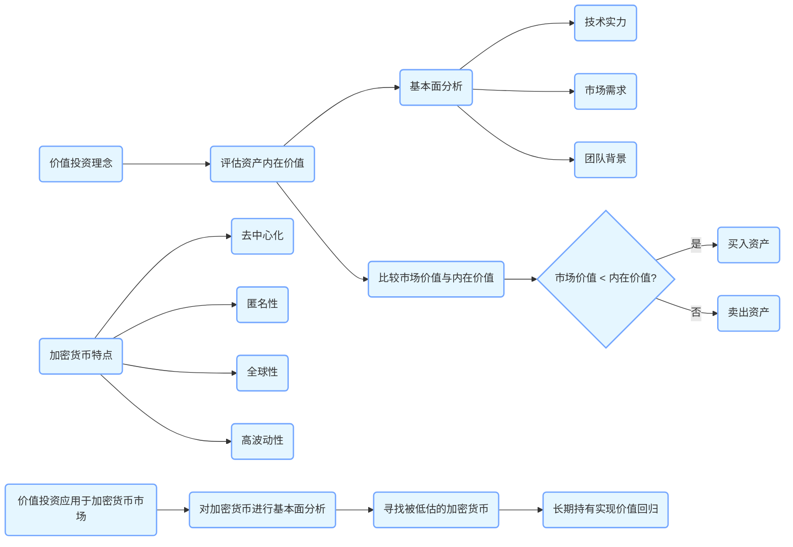

# 价值投资在加密货币市场中的应用与风险

> 关键词：价值投资、加密货币市场、应用策略、投资风险、市场分析

> 摘要：本文聚焦于价值投资在加密货币市场中的应用与风险。首先介绍了文章的背景信息，包括目的、预期读者、文档结构和相关术语。接着阐述了价值投资和加密货币的核心概念及联系，详细讲解了适用于加密货币市场的价值投资核心算法原理与操作步骤，给出了相关数学模型和公式并举例说明。通过项目实战，展示了在加密货币市场运用价值投资策略的代码实现与解读。分析了价值投资在加密货币市场的实际应用场景，推荐了相关学习资源、开发工具框架和论文著作。最后总结了未来发展趋势与挑战，解答了常见问题并提供了扩展阅读和参考资料，旨在为投资者在加密货币市场运用价值投资策略提供全面且深入的指导。

## 1. 背景介绍 
### 1.1 目的和范围
随着加密货币市场的迅速发展，越来越多的投资者开始关注这一新兴领域。价值投资作为一种成熟的投资理念，能否在加密货币市场中有效应用成为了一个备受关注的问题。本文的目的在于深入探讨价值投资在加密货币市场中的应用方式，同时分析其中可能存在的风险。我们将研究价值投资的基本原则如何与加密货币的特性相结合，为投资者提供可行的投资策略。研究范围涵盖了主流加密货币，如比特币、以太坊等，以及相关的市场数据和技术指标。

### 1.2 预期读者
本文预期读者主要包括对加密货币投资感兴趣的个人投资者、金融机构的投资分析师、区块链技术研究者以及对新兴金融市场有研究需求的学者。无论您是初涉加密货币市场的新手，还是有一定投资经验的专业人士，都能从本文中获取有价值的信息和见解。

### 1.3 文档结构概述
本文将按照以下结构进行阐述：首先介绍核心概念，包括价值投资和加密货币的定义、特点以及它们之间的联系；接着讲解适用于加密货币市场的价值投资核心算法原理和具体操作步骤，并给出相应的 Python 代码示例；然后通过数学模型和公式对投资策略进行量化分析，并举例说明；在项目实战部分，详细介绍开发环境搭建、源代码实现和代码解读；之后分析价值投资在加密货币市场的实际应用场景；推荐相关的学习资源、开发工具框架和论文著作；最后总结未来发展趋势与挑战，解答常见问题并提供扩展阅读和参考资料。

### 1.4 术语表
#### 1.4.1 核心术语定义
- **价值投资**：一种基于对资产内在价值的评估进行投资的策略，投资者通过分析资产的基本面，寻找价格低于内在价值的投资机会，以获取长期的投资回报。
- **加密货币**：一种使用密码学原理来确保交易安全及控制交易单位创造的数字货币，它基于去中心化的区块链技术，不受任何中央机构的控制。
- **内在价值**：资产在其基本面因素（如技术实力、市场需求、团队背景等）的支持下所具有的真实价值。
- **市场价值**：资产在市场上的当前交易价格。

#### 1.4.2 相关概念解释
- **区块链**：一种分布式账本技术，通过去中心化和去信任的方式集体维护一个可靠数据库。它由一个个数据块组成，每个数据块包含了一定时间内的交易信息，这些数据块按照时间顺序链接起来形成链条，具有不可篡改、公开透明等特点。
- **智能合约**：一种基于区块链技术的自动化合约，它可以在满足预设条件时自动执行，无需第三方中介的干预。智能合约可以实现各种复杂的业务逻辑，为加密货币的应用提供了更多的可能性。

#### 1.4.3 缩略词列表
- **BTC**：比特币（Bitcoin）
- **ETH**：以太坊（Ethereum）
- **ICO**：首次代币发行（Initial Coin Offering）

## 2. 核心概念与联系 

### 价值投资的原理
价值投资的核心原理是寻找被市场低估的资产，通过长期持有来实现资产价值的回归和增值。投资者需要对资产的基本面进行深入分析，包括财务状况、行业前景、竞争优势等，以评估其内在价值。当市场价格低于内在价值时，投资者认为该资产具有投资价值，从而进行买入操作；当市场价格高于内在价值时，投资者可以考虑卖出资产以获取收益。

### 加密货币的特点
加密货币具有以下特点：
- **去中心化**：不依赖于任何中央机构，由分布式网络中的节点共同维护。
- **匿名性**：交易双方的身份信息可以得到一定程度的保护。
- **全球性**：可以在全球范围内进行交易，不受地域限制。
- **高波动性**：价格波动较大，投资风险较高。

### 价值投资与加密货币的联系
虽然加密货币市场具有高度的不确定性和波动性，但价值投资的理念仍然可以在一定程度上应用于该市场。投资者可以通过分析加密货币的技术实力、应用场景、社区活跃度等基本面因素来评估其内在价值。例如，一个具有创新技术和广泛应用前景的加密货币项目，可能具有较高的内在价值。当市场价格低于其内在价值时，投资者可以考虑进行投资。

### 核心概念的文本示意图
```plaintext
价值投资
|-- 评估内在价值
|   |-- 基本面分析
|       |-- 技术实力
|       |-- 市场需求
|       |-- 团队背景
|-- 比较市场价值与内在价值
|   |-- 买入低估资产
|   |-- 卖出高估资产

加密货币
|-- 去中心化
|-- 匿名性
|-- 全球性
|-- 高波动性

价值投资与加密货币的联系
|-- 对加密货币进行基本面分析
|-- 寻找被低估的加密货币
|-- 长期持有实现价值回归
```

### Mermaid 流程图


## 3. 核心算法原理 & 具体操作步骤 

### 核心算法原理
在加密货币市场中应用价值投资策略，我们可以通过构建一个评估模型来计算加密货币的内在价值。一种简单的方法是基于加密货币的市场需求、技术实力和社区活跃度等因素进行综合评估。以下是一个简化的评估模型：

设加密货币的内在价值为 $V$，市场需求评估值为 $D$，技术实力评估值为 $T$，社区活跃度评估值为 $C$，则有：

$V = w_1D + w_2T + w_3C$

其中，$w_1$、$w_2$、$w_3$ 分别为市场需求、技术实力和社区活跃度的权重，且 $w_1 + w_2 + w_3 = 1$。

### 具体操作步骤
1. **数据收集**：收集加密货币的市场需求数据（如交易量、用户数量等）、技术实力数据（如代码更新频率、技术创新点等）和社区活跃度数据（如社交媒体关注度、论坛讨论热度等）。
2. **评估指标计算**：根据收集到的数据，计算市场需求评估值 $D$、技术实力评估值 $T$ 和社区活跃度评估值 $C$。可以采用标准化的方法将不同指标的数据转换为可比较的数值。
3. **权重确定**：根据投资者对不同因素的重视程度，确定权重 $w_1$、$w_2$、$w_3$。例如，如果投资者更看重技术实力，可以将 $w_2$ 设置为较大的值。
4. **内在价值计算**：将计算得到的 $D$、$T$、$C$ 和确定的权重代入公式 $V = w_1D + w_2T + w_3C$，计算加密货币的内在价值 $V$。
5. **投资决策**：比较加密货币的市场价值 $P$ 和内在价值 $V$。如果 $P < V$，则认为该加密货币被低估，可以考虑买入；如果 $P > V$，则认为该加密货币被高估，可以考虑卖出。

### Python 源代码实现
```python
import pandas as pd

# 定义评估指标数据
data = {
    '加密货币': ['BTC', 'ETH'],
    '市场需求评估值': [0.8, 0.7],
    '技术实力评估值': [0.9, 0.8],
    '社区活跃度评估值': [0.7, 0.6]
}

df = pd.DataFrame(data)

# 确定权重
w1 = 0.3
w2 = 0.4
w3 = 0.3

# 计算内在价值
df['内在价值'] = w1 * df['市场需求评估值'] + w2 * df['技术实力评估值'] + w3 * df['社区活跃度评估值']

# 假设市场价值
df['市场价值'] = [0.85, 0.75]

# 投资决策
df['投资决策'] = df.apply(lambda row: '买入' if row['市场价值'] < row['内在价值'] else '卖出', axis=1)

print(df)
```

### 代码解释
1. **数据收集与整理**：使用 `pandas` 库创建一个包含加密货币名称、市场需求评估值、技术实力评估值和社区活跃度评估值的 DataFrame。
2. **权重确定**：定义市场需求、技术实力和社区活跃度的权重 $w_1$、$w_2$、$w_3$。
3. **内在价值计算**：根据公式 $V = w_1D + w_2T + w_3C$ 计算每个加密货币的内在价值，并将结果添加到 DataFrame 中。
4. **假设市场价值**：为每个加密货币假设一个市场价值，并添加到 DataFrame 中。
5. **投资决策**：使用 `apply` 方法根据市场价值和内在价值的比较结果做出投资决策，并将结果添加到 DataFrame 中。

## 4. 数学模型和公式 & 详细讲解 & 举例说明 

### 数学模型和公式
我们之前提到的评估加密货币内在价值的数学模型为：

$V = w_1D + w_2T + w_3C$

其中：
- $V$ 表示加密货币的内在价值。
- $D$ 表示市场需求评估值，反映了加密货币在市场上的受欢迎程度和使用频率。
- $T$ 表示技术实力评估值，体现了加密货币的技术创新能力和发展潜力。
- $C$ 表示社区活跃度评估值，衡量了加密货币社区的参与度和支持力度。
- $w_1$、$w_2$、$w_3$ 分别为市场需求、技术实力和社区活跃度的权重，且满足 $w_1 + w_2 + w_3 = 1$。

### 详细讲解
- **市场需求评估值 $D$**：可以通过多种指标来衡量，如加密货币的交易量、用户数量、应用场景的广泛性等。交易量越大、用户数量越多、应用场景越广泛，说明市场需求越高，$D$ 的值也越大。
- **技术实力评估值 $T$**：可以从代码更新频率、技术创新点、安全性等方面进行评估。代码更新频繁、有独特的技术创新、安全性高的加密货币，其技术实力较强，$T$ 的值也较大。
- **社区活跃度评估值 $C$**：可以通过社交媒体关注度、论坛讨论热度、开发者社区的活跃程度等指标来衡量。社区关注度高、讨论热烈、开发者积极参与的加密货币，其社区活跃度较高，$C$ 的值也较大。
- **权重 $w_1$、$w_2$、$w_3$**：投资者可以根据自己的投资偏好和风险承受能力来确定权重。例如，对于注重市场需求的投资者，可以将 $w_1$ 设置为较大的值；对于关注技术创新的投资者，可以将 $w_2$ 设置为较大的值。

### 举例说明
假设我们要评估比特币（BTC）和以太坊（ETH）的内在价值，相关数据如下：

| 加密货币 | 市场需求评估值 $D$ | 技术实力评估值 $T$ | 社区活跃度评估值 $C$ |
| ---- | ---- | ---- | ---- |
| BTC | 0.8 | 0.9 | 0.7 |
| ETH | 0.7 | 0.8 | 0.6 |

假设我们确定的权重为 $w_1 = 0.3$，$w_2 = 0.4$，$w_3 = 0.3$。

#### 计算比特币的内在价值 $V_{BTC}$
$V_{BTC} = w_1D_{BTC} + w_2T_{BTC} + w_3C_{BTC}$

$= 0.3\times0.8 + 0.4\times0.9 + 0.3\times0.7$

$= 0.24 + 0.36 + 0.21$

$= 0.81$

#### 计算以太坊的内在价值 $V_{ETH}$
$V_{ETH} = w_1D_{ETH} + w_2T_{ETH} + w_3C_{ETH}$

$= 0.3\times0.7 + 0.4\times0.8 + 0.3\times0.6$

$= 0.21 + 0.32 + 0.18$

$= 0.71$

假设比特币的市场价值为 $P_{BTC} = 0.85$，以太坊的市场价值为 $P_{ETH} = 0.75$。

由于 $P_{BTC} > V_{BTC}$，所以比特币被高估，建议卖出；由于 $P_{ETH} > V_{ETH}$，所以以太坊也被高估，建议卖出。

## 5. 项目实战：代码实际案例和详细解释说明 

### 5.1  开发环境搭建
#### 安装 Python
首先，确保你已经安装了 Python 环境。可以从 Python 官方网站（https://www.python.org/downloads/） 下载适合你操作系统的 Python 版本，并按照安装向导进行安装。

#### 安装必要的库
在项目中，我们使用了 `pandas` 库来处理数据。可以使用以下命令来安装 `pandas`：
```sh
pip install pandas
```

### 5.2  源代码详细实现和代码解读
```python
import pandas as pd

# 定义评估指标数据
data = {
    '加密货币': ['BTC', 'ETH', 'LTC'],
    '市场需求评估值': [0.8, 0.7, 0.6],
    '技术实力评估值': [0.9, 0.8, 0.7],
    '社区活跃度评估值': [0.7, 0.6, 0.5]
}

df = pd.DataFrame(data)

# 确定权重
w1 = 0.3
w2 = 0.4
w3 = 0.3

# 计算内在价值
df['内在价值'] = w1 * df['市场需求评估值'] + w2 * df['技术实力评估值'] + w3 * df['社区活跃度评估值']

# 假设市场价值
df['市场价值'] = [0.85, 0.75, 0.65]

# 投资决策
df['投资决策'] = df.apply(lambda row: '买入' if row['市场价值'] < row['内在价值'] else '卖出', axis=1)

# 输出结果
print(df)
```

### 代码解读与分析
1. **数据导入与处理**：
    - 使用 `pandas` 库的 `DataFrame` 类创建一个包含加密货币名称、市场需求评估值、技术实力评估值和社区活跃度评估值的数据表。
    - 通过字典 `data` 定义数据，并将其传递给 `DataFrame` 构造函数。

2. **权重确定**：
    - 定义市场需求、技术实力和社区活跃度的权重 $w_1$、$w_2$、$w_3$，这里分别设置为 0.3、0.4 和 0.3。

3. **内在价值计算**：
    - 使用 `pandas` 的向量运算，将每个加密货币的市场需求评估值、技术实力评估值和社区活跃度评估值乘以相应的权重，并求和得到内在价值。
    - 将计算结果存储在新的列 `内在价值` 中。

4. **市场价值假设**：
    - 为每个加密货币假设一个市场价值，并将其存储在新的列 `市场价值` 中。

5. **投资决策**：
    - 使用 `pandas` 的 `apply` 方法，对每一行数据应用一个匿名函数。
    - 匿名函数根据市场价值和内在价值的比较结果返回 “买入” 或 “卖出”，并将结果存储在新的列 `投资决策` 中。

6. **结果输出**：
    - 使用 `print` 函数输出包含所有信息的数据表，方便查看投资决策结果。

通过这个项目实战，我们可以看到如何使用 Python 和 `pandas` 库来实现价值投资策略在加密货币市场中的应用。通过对加密货币的基本面进行评估，计算其内在价值，并与市场价值进行比较，从而做出投资决策。

## 6. 实际应用场景 
### 个人投资者
对于个人投资者来说，价值投资策略可以帮助他们在加密货币市场中做出更理性的投资决策。个人投资者可以通过分析加密货币的基本面，寻找被低估的项目进行投资。例如，一个具有创新技术和广泛应用前景的加密货币项目，可能在短期内由于市场情绪等因素导致价格下跌，但从长期来看，其内在价值可能会逐渐体现出来。个人投资者可以在价格低于内在价值时买入，等待价值回归，从而获得投资收益。

### 机构投资者
机构投资者通常具有更专业的研究团队和更雄厚的资金实力。他们可以利用价值投资策略对加密货币市场进行全面的分析和评估，构建投资组合。机构投资者可以通过分散投资不同类型的加密货币，降低投资风险。例如，他们可以同时投资于具有不同技术特点和应用场景的加密货币，以平衡投资组合的风险和收益。

### 区块链项目方
区块链项目方可以运用价值投资的理念来评估自身项目的价值，并制定合理的发展策略。项目方可以通过提升项目的技术实力、拓展应用场景、加强社区建设等方式来提高项目的内在价值。同时，项目方也可以通过与投资者的沟通和交流，让投资者更好地了解项目的价值，从而吸引更多的投资。

### 金融监管机构
金融监管机构可以借鉴价值投资的方法来评估加密货币市场的风险。通过对加密货币的基本面进行分析，监管机构可以了解市场的整体情况，识别潜在的风险点。例如，监管机构可以关注那些技术实力较弱、市场需求不明确的加密货币项目，加强对这些项目的监管，防范金融风险。

## 7. 工具和资源推荐
### 7.1 学习资源推荐
#### 7.1.1 书籍推荐
- 《价值投资实战手册》：本书详细介绍了价值投资的基本原理和实战方法，通过大量的案例分析，帮助读者理解如何评估资产的内在价值，做出合理的投资决策。
- 《区块链：从数字货币到信用社会》：深入探讨了区块链技术的原理、应用和发展趋势，对于理解加密货币的底层技术和市场背景具有重要的参考价值。
- 《加密资产：新的投资前沿》：全面介绍了加密资产的投资策略、风险管理和市场分析方法，是一本适合投资者的实用指南。

#### 7.1.2 在线课程
- Coursera 上的 “区块链基础” 课程：由知名高校教授授课，系统地介绍了区块链技术的基本概念、原理和应用，帮助学习者建立区块链的知识体系。
- Udemy 上的 “加密货币投资策略” 课程：该课程结合实际案例，讲解了加密货币投资的方法和技巧，适合想要学习加密货币投资的初学者。
- edX 上的 “金融科技与区块链” 课程：从金融科技的角度出发，探讨了区块链技术在金融领域的应用和发展，对于理解加密货币市场的金融背景具有重要意义。

#### 7.1.3 技术博客和网站
- CoinDesk：全球领先的加密货币新闻和信息平台，提供最新的加密货币市场动态、技术分析和行业趋势报道。
- CoinMarketCap：提供全球加密货币的实时价格、市值、交易量等数据，是投资者了解加密货币市场的重要工具。
- Medium 上的区块链和加密货币相关博客：许多行业专家和学者在 Medium 上分享他们的研究成果和观点，通过阅读这些博客可以获取最新的行业信息和技术进展。

### 7.2 开发工具框架推荐
#### 7.2.1 IDE和编辑器
- PyCharm：一款专业的 Python 集成开发环境，提供了丰富的代码编辑、调试和分析功能，适合开发 Python 代码实现价值投资策略。
- Visual Studio Code：一款轻量级的代码编辑器，支持多种编程语言，具有丰富的插件生态系统，可以根据需要安装各种插件来扩展功能。
- Jupyter Notebook：一种交互式的编程环境，适合进行数据探索和分析。可以使用 Jupyter Notebook 来编写和运行 Python 代码，进行加密货币数据的处理和分析。

#### 7.2.2 调试和性能分析工具
- `pdb`：Python 自带的调试器，可以帮助开发者在代码运行过程中进行调试，定位和解决问题。
- `cProfile`：Python 的性能分析工具，可以分析代码的运行时间和函数调用情况，帮助开发者优化代码性能。
- Py-Spy：一个用于分析 Python 程序性能的工具，可以实时监控 Python 程序的 CPU 使用情况和函数调用频率。

#### 7.2.3 相关框架和库
- `pandas`：一个强大的数据处理和分析库，提供了高效的数据结构和数据操作方法，适合处理加密货币市场数据。
- `numpy`：一个用于科学计算的 Python 库，提供了高性能的多维数组对象和各种数学函数，可用于加密货币数据的数值计算。
- `scikit-learn`：一个机器学习库，提供了丰富的机器学习算法和工具，可用于加密货币市场的预测和分析。

### 7.3 相关论文著作推荐
#### 7.3.1 经典论文
- “Bitcoin: A Peer-to-Peer Electronic Cash System”：比特币的白皮书，由中本聪撰写，详细介绍了比特币的技术原理和设计理念，是理解加密货币的经典文献。
- “Ethereum: A Next-Generation Smart Contract and Decentralized Application Platform”：以太坊的白皮书，阐述了以太坊的智能合约和去中心化应用平台的概念和技术实现。
- “The Efficient Market Hypothesis and Its Critics”：探讨了有效市场假说及其面临的挑战，对于理解加密货币市场的有效性和投资策略具有重要的参考价值。

#### 7.3.2 最新研究成果
- 关注顶级学术期刊如 ACM Transactions on Internet Technology、IEEE Transactions on Computers 等，这些期刊会发表关于区块链和加密货币的最新研究成果。
- 参加国际学术会议如 IEEE International Conference on Blockchain 和 ACM Conference on Computer and Communications Security，了解行业内的最新研究动态。

#### 7.3.3 应用案例分析
- 《区块链金融应用与实践》：本书通过多个实际案例，介绍了区块链技术在金融领域的应用场景和解决方案，对于理解加密货币在金融市场的应用具有重要的参考价值。
- 《加密货币投资实战案例解析》：分析了多个加密货币投资案例，总结了投资经验和教训，为投资者提供了实际操作的参考。

## 8. 总结：未来发展趋势与挑战
### 未来发展趋势
#### 市场规模扩大
随着区块链技术的不断发展和普及，加密货币市场的规模有望继续扩大。越来越多的机构和个人投资者将进入市场，推动加密货币的应用场景不断拓展。

#### 合规化进程加速
各国政府和监管机构对加密货币市场的监管力度将不断加强，推动市场朝着合规化方向发展。合规的加密货币交易平台和投资产品将不断涌现，提高市场的透明度和稳定性。

#### 技术创新不断
区块链技术将不断创新和发展，为加密货币带来更多的应用场景和功能。例如，智能合约的应用将更加广泛，加密货币与实体经济的结合将更加紧密。

#### 价值投资理念深入人心
随着投资者对加密货币市场的认识不断加深，价值投资理念将逐渐深入人心。投资者将更加注重加密货币的基本面分析，寻找具有真正价值的项目进行投资。

### 挑战
#### 市场波动性
加密货币市场的高波动性仍然是投资者面临的主要挑战之一。价格的大幅波动可能导致投资者的损失，增加投资风险。

#### 监管不确定性
各国政府对加密货币的监管政策存在差异，且监管政策可能随时发生变化。监管不确定性增加了市场的风险，给投资者和项目方带来了困扰。

#### 技术安全问题
区块链技术虽然具有一定的安全性，但仍然面临着技术攻击和漏洞的风险。加密货币的交易和存储安全是投资者关注的重点问题。

#### 市场操纵
加密货币市场相对较小，容易受到市场操纵的影响。一些大户和机构可能通过操纵市场价格来获取利益，损害普通投资者的权益。

## 9. 附录：常见问题与解答
### 价值投资在加密货币市场中是否有效？
价值投资的理念在加密货币市场中具有一定的有效性。虽然加密货币市场具有高度的不确定性和波动性，但通过对加密货币的基本面进行分析，评估其内在价值，仍然可以找到被低估的投资机会。然而，由于加密货币市场的特殊性，价值投资策略的应用需要结合市场特点进行调整。

### 如何评估加密货币的内在价值？
可以从市场需求、技术实力、社区活跃度等方面评估加密货币的内在价值。市场需求可以通过交易量、用户数量等指标来衡量；技术实力可以从代码更新频率、技术创新点等方面进行评估；社区活跃度可以通过社交媒体关注度、论坛讨论热度等指标来衡量。然后根据这些指标计算一个综合的内在价值评估值。

### 加密货币市场的风险主要有哪些？
加密货币市场的风险主要包括市场波动性风险、监管不确定性风险、技术安全风险和市场操纵风险等。市场价格的大幅波动可能导致投资者的损失；监管政策的变化可能影响市场的发展；技术攻击和漏洞可能导致加密货币的丢失；市场操纵可能损害普通投资者的权益。

### 如何降低加密货币投资的风险？
可以通过分散投资、进行基本面分析、控制投资比例等方式降低加密货币投资的风险。分散投资不同类型的加密货币可以降低单一资产的风险；进行基本面分析可以选择具有真正价值的项目进行投资；控制投资比例可以避免过度投资带来的风险。

## 10. 扩展阅读 & 参考资料
### 扩展阅读
- 《数字黄金：比特币鲜为人知的故事》：通过讲述比特币的发展历程，深入了解加密货币的起源和发展。
- 《区块链革命：比特币底层技术如何改变货币、商业和世界》：探讨了区块链技术对社会和经济的影响，以及加密货币在未来的发展前景。
- 《智能合约：从区块链到商业应用》：详细介绍了智能合约的原理和应用，对于理解加密货币的技术创新具有重要意义。

### 参考资料
- Nakamoto, S. (2008). Bitcoin: A Peer-to-Peer Electronic Cash System.
- Buterin, V. (2013). Ethereum: A Next-Generation Smart Contract and Decentralized Application Platform.
- Fama, E. F. (1970). Efficient Capital Markets: A Review of Theory and Empirical Work. Journal of Finance, 25(2), 383-417.

作者：AI天才研究院/AI Genius Institute & 禅与计算机程序设计艺术 /Zen And The Art of Computer Programming