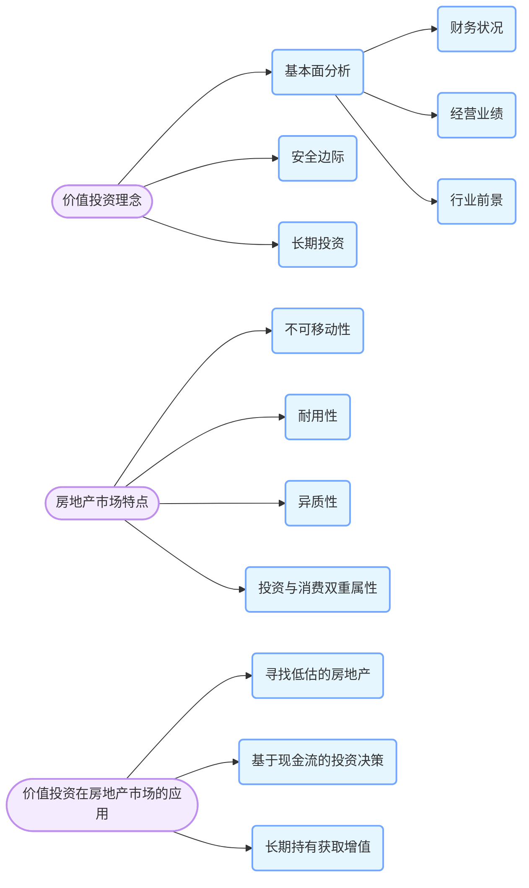

# 价值投资在房地产市场的应用

> 关键词：价值投资、房地产市场、投资策略、现金流分析、市场估值

> 摘要：本文旨在深入探讨价值投资理念在房地产市场中的应用。详细阐述了价值投资的核心概念，分析其与房地产市场的内在联系。通过介绍核心算法原理、数学模型和公式，为房地产价值投资提供理论支持。结合实际案例，展示价值投资在房地产项目中的具体操作流程和决策方法。同时，探讨了房地产价值投资的实际应用场景，推荐了相关的学习资源、开发工具和研究论文。最后，总结了价值投资在房地产市场的未来发展趋势与挑战，并对常见问题进行解答，为投资者在房地产市场运用价值投资策略提供全面的指导。

## 1. 背景介绍 
### 1.1 目的和范围
价值投资作为一种成熟的投资理念，在股票市场等领域已经取得了显著的成果。然而，将其应用于房地产市场具有独特的特点和挑战。本文的目的在于系统地探讨价值投资在房地产市场的应用，帮助投资者理解如何运用价值投资的原则和方法，在房地产市场中做出更明智的投资决策。研究范围涵盖了住宅、商业地产等主要房地产类型，分析从宏观市场环境到微观物业个体的价值评估和投资策略制定。

### 1.2 预期读者
本文的预期读者包括房地产投资者、房地产开发商、金融机构相关人员以及对房地产投资感兴趣的学者和研究人员。无论是新手投资者希望了解房地产投资的基本原理，还是经验丰富的投资者寻求优化投资策略，都能从本文中获得有价值的信息。

### 1.3 文档结构概述
本文将按照以下结构展开：首先介绍价值投资和房地产市场的核心概念及其联系，接着阐述核心算法原理和具体操作步骤，包括如何运用 Python 代码进行相关计算。然后通过数学模型和公式对房地产价值进行评估，并举例说明。之后通过实际案例展示价值投资在房地产项目中的应用，包括开发环境搭建、源代码实现和代码解读。再探讨房地产价值投资的实际应用场景，推荐相关的工具和资源。最后总结未来发展趋势与挑战，解答常见问题，并提供扩展阅读和参考资料。

### 1.4 术语表
#### 1.4.1 核心术语定义
- **价值投资**：一种基于资产内在价值进行投资的策略，通过分析资产的基本面，寻找被低估的资产进行投资，以获取长期的投资回报。
- **房地产内在价值**：房地产在正常市场条件下，基于其未来现金流和风险因素所确定的合理价值。
- **净现值（NPV）**：投资项目在未来各期现金流入量的现值与现金流出量的现值之差，用于评估投资项目的盈利能力。
- **内部收益率（IRR）**：使投资项目净现值为零的折现率，反映了投资项目的实际收益率。

#### 1.4.2 相关概念解释
- **现金流分析**：对房地产投资项目在未来一定时期内的现金流入和流出进行预测和分析，以评估项目的盈利能力和资金需求。
- **市场估值**：通过对房地产市场的供需关系、租金水平、房价走势等因素进行分析，确定房地产的市场价值。
- **风险评估**：对房地产投资项目可能面临的各种风险，如市场风险、政策风险、经营风险等进行评估和分析，以制定相应的风险管理策略。

#### 1.4.3 缩略词列表
- **NPV**：Net Present Value（净现值）
- **IRR**：Internal Rate of Return（内部收益率）
- **CAPM**：Capital Asset Pricing Model（资本资产定价模型）

## 2. 核心概念与联系 

### 2.1 价值投资的核心概念
价值投资的核心思想是寻找被市场低估的资产，通过长期持有来获取资产价值回归带来的收益。其基本原理基于以下几个方面：
- **基本面分析**：通过研究资产的财务状况、经营业绩、行业前景等基本面因素，评估资产的内在价值。
- **安全边际**：在购买资产时，要确保购买价格低于其内在价值，以提供一定的安全边际，降低投资风险。
- **长期投资**：价值投资强调长期持有资产，因为市场的短期波动可能会导致资产价格偏离其内在价值，但从长期来看，资产价格会逐渐回归其内在价值。

### 2.2 房地产市场的特点
房地产市场具有以下特点：
- **不可移动性**：房地产是固定在特定地理位置上的，其价值受到地理位置、周边环境等因素的影响较大。
- **耐用性**：房地产是一种耐用消费品和投资品，具有较长的使用寿命。
- **异质性**：每一处房地产都具有独特的物理特征和区位条件，不存在完全相同的房地产。
- **投资与消费的双重属性**：房地产既可以作为消费品满足人们的居住需求，也可以作为投资品获取租金收益和资产增值。

### 2.3 价值投资与房地产市场的联系
价值投资理念可以很好地应用于房地产市场，主要体现在以下几个方面：
- **寻找低估的房地产**：通过对房地产市场的基本面分析，寻找那些被市场低估的房地产项目，如地理位置优越但暂时价格较低的房产。
- **基于现金流的投资决策**：价值投资注重资产的现金流，在房地产投资中，可以通过分析房地产的租金收入、运营成本等现金流因素，评估房地产的投资价值。
- **长期持有获取增值**：房地产市场的长期趋势通常是向上的，通过长期持有房地产，可以享受资产增值带来的收益。

### 2.4 核心概念原理和架构的文本示意图
```plaintext
价值投资理念
|
|-- 基本面分析
|   |-- 财务状况
|   |-- 经营业绩
|   |-- 行业前景
|
|-- 安全边际
|
|-- 长期投资

房地产市场特点
|
|-- 不可移动性
|-- 耐用性
|-- 异质性
|-- 投资与消费双重属性

价值投资在房地产市场的应用
|
|-- 寻找低估的房地产
|-- 基于现金流的投资决策
|-- 长期持有获取增值
```

### 2.5 Mermaid 流程图


## 3. 核心算法原理 & 具体操作步骤 

### 3.1 净现值（NPV）算法原理
净现值（NPV）是评估投资项目盈利能力的重要指标，其计算公式为：
$$NPV = \sum_{t=0}^{n} \frac{CF_t}{(1 + r)^t}$$
其中，$CF_t$ 表示第 $t$ 期的现金流量，$r$ 表示折现率，$n$ 表示投资项目的期限。

### 3.2 Python 实现净现值计算
```python
def npv(cash_flows, discount_rate):
    npv_value = 0
    for i, cf in enumerate(cash_flows):
        npv_value += cf / ((1 + discount_rate) ** i)
    return npv_value

# 示例
cash_flows = [-100000, 20000, 25000, 30000, 35000, 40000]  # 初始投资为负，后续为现金流入
discount_rate = 0.1
result = npv(cash_flows, discount_rate)
print(f"净现值: {result}")
```
### 3.3 内部收益率（IRR）算法原理
内部收益率（IRR）是使投资项目净现值为零的折现率，通常需要通过迭代的方法求解。一种常用的方法是牛顿 - 拉夫逊法。

### 3.4 Python 实现内部收益率计算
```python
import numpy as np

def irr(cash_flows):
    return np.irr(cash_flows)

# 示例
cash_flows = [-100000, 20000, 25000, 30000, 35000, 40000]
result = irr(cash_flows)
print(f"内部收益率: {result}")
```
### 3.5 具体操作步骤
1. **确定投资期限**：明确房地产投资项目的预计持有期限。
2. **预测现金流量**：对房地产投资项目在未来各期的现金流入（如租金收入）和现金流出（如购房成本、运营成本、维修成本等）进行预测。
3. **选择折现率**：折现率反映了投资的风险和机会成本，可以根据市场利率、投资者的要求收益率等因素确定。
4. **计算净现值和内部收益率**：使用上述公式和 Python 代码计算房地产投资项目的净现值和内部收益率。
5. **决策判断**：如果净现值大于零，且内部收益率大于投资者的要求收益率，则该房地产投资项目具有投资价值；反之，则不建议投资。

## 4. 数学模型和公式 & 详细讲解 & 举例说明 

### 4.1 房地产价值评估的基本模型
房地产的价值可以通过以下两种常见的模型进行评估：

#### 4.1.1 收益法模型
收益法是基于房地产未来产生的现金流来评估其价值的方法，其基本公式为：
$$V = \frac{NOI}{r}$$
其中，$V$ 表示房地产的价值，$NOI$ 表示净运营收入（Net Operating Income），即房地产每年的租金收入减去运营成本后的净额，$r$ 表示资本化率。

**详细讲解**：资本化率反映了投资者对房地产投资的预期收益率，它受到市场利率、房地产市场风险等因素的影响。收益法适用于具有稳定租金收入的房地产，如商业地产、公寓等。

**举例说明**：某商业地产每年的净运营收入为 50 万元，市场资本化率为 8%，则该商业地产的价值为：
$$V = \frac{50}{0.08} = 625 \text{（万元）}$$

#### 4.1.2 现金流折现模型（DCF）
现金流折现模型是一种更全面的价值评估方法，它考虑了房地产在未来多个期间的现金流量，并将其折现到当前时刻。其公式为：
$$V = \sum_{t=1}^{n} \frac{CF_t}{(1 + r)^t} + \frac{TV}{(1 + r)^n}$$
其中，$CF_t$ 表示第 $t$ 期的现金流量，$TV$ 表示房地产在第 $n$ 期末的终值，$r$ 表示折现率，$n$ 表示投资期限。

**详细讲解**：终值 $TV$ 可以通过多种方法计算，如假设房地产在第 $n$ 期末以一定的价格出售，或者根据收益法模型计算。现金流折现模型考虑了房地产投资的时间价值和风险因素，更适用于长期投资项目的价值评估。

**举例说明**：某房地产投资项目的初始投资为 100 万元，预计未来 5 年的现金流量分别为 10 万元、12 万元、15 万元、18 万元、20 万元，第 5 期末的终值为 150 万元，折现率为 10%，则该房地产的价值为：
$$V = \frac{10}{(1 + 0.1)^1} + \frac{12}{(1 + 0.1)^2} + \frac{15}{(1 + 0.1)^3} + \frac{18}{(1 + 0.1)^4} + \frac{20}{(1 + 0.1)^5} + \frac{150}{(1 + 0.1)^5}$$
```python
import numpy as np

cash_flows = [10, 12, 15, 18, 20]
terminal_value = 150
discount_rate = 0.1
n = len(cash_flows)

pv_cash_flows = np.sum([cf / ((1 + discount_rate) ** (i + 1)) for i, cf in enumerate(cash_flows)])
pv_terminal_value = terminal_value / ((1 + discount_rate) ** n)

value = pv_cash_flows + pv_terminal_value
print(f"房地产价值: {value} 万元")
```

### 4.2 风险调整模型
在房地产投资中，需要考虑风险因素对投资价值的影响。一种常用的风险调整方法是使用资本资产定价模型（CAPM）来确定折现率。

#### 4.2.1 资本资产定价模型（CAPM）
$$r = r_f + \beta (r_m - r_f)$$
其中，$r$ 表示投资的必要收益率，$r_f$ 表示无风险收益率，$\beta$ 表示投资的系统性风险系数，$r_m$ 表示市场组合的收益率。

**详细讲解**：无风险收益率通常可以用国债收益率来近似代替。$\beta$ 系数反映了投资的系统性风险，即投资收益与市场组合收益的相关性。如果 $\beta$ 大于 1，则表示投资的系统性风险高于市场平均水平；如果 $\beta$ 小于 1，则表示投资的系统性风险低于市场平均水平。

**举例说明**：假设无风险收益率为 3%，市场组合的收益率为 10%，某房地产投资项目的 $\beta$ 系数为 1.2，则该项目的必要收益率为：
$$r = 3\% + 1.2 \times (10\% - 3\%) = 11.4\%$$

### 4.3 敏感性分析模型
敏感性分析用于评估不同因素的变化对房地产投资价值的影响程度。常见的敏感性因素包括租金增长率、资本化率、折现率等。

#### 4.3.1 敏感性分析公式
以租金增长率为例，假设房地产的初始租金为 $R_0$，租金增长率为 $g$，资本化率为 $r$，则房地产的价值为：
$$V = \frac{R_0(1 + g)}{r - g}$$

**详细讲解**：通过改变租金增长率 $g$ 的值，可以计算出不同租金增长率下房地产的价值，从而分析租金增长率对房地产价值的敏感性。

**举例说明**：某房地产的初始租金为 20 万元，资本化率为 8%，当租金增长率分别为 2%、3%、4% 时，计算房地产的价值：
```python
R0 = 20
r = 0.08

g_values = [0.02, 0.03, 0.04]
for g in g_values:
    V = R0 * (1 + g) / (r - g)
    print(f"租金增长率为 {g * 100}% 时，房地产价值为 {V} 万元")
```

## 5. 项目实战：代码实际案例和详细解释说明 

### 5.1  开发环境搭建
为了实现房地产价值投资的相关计算，我们可以使用 Python 编程语言，并安装以下必要的库：
- **NumPy**：用于数值计算和数组操作。
- **Pandas**：用于数据处理和分析。

可以使用以下命令安装这些库：
```sh
pip install numpy pandas
```

### 5.2  源代码详细实现和代码解读
以下是一个完整的 Python 代码示例，用于评估一个房地产投资项目的价值：
```python
import numpy as np
import pandas as pd

# 定义房地产投资项目的参数
initial_investment = -1000000  # 初始投资
rental_income = [50000, 52000, 54000, 56000, 58000]  # 每年的租金收入
operating_costs = [10000, 11000, 12000, 13000, 14000]  # 每年的运营成本
terminal_value = 1200000  # 第 5 期末的终值
discount_rate = 0.1  # 折现率

# 计算每年的净现金流量
cash_flows = [initial_investment]
for i in range(len(rental_income)):
    net_cash_flow = rental_income[i] - operating_costs[i]
    cash_flows.append(net_cash_flow)
cash_flows.append(terminal_value)

# 计算净现值
def npv(cash_flows, discount_rate):
    npv_value = 0
    for i, cf in enumerate(cash_flows):
        npv_value += cf / ((1 + discount_rate) ** i)
    return npv_value

npv_result = npv(cash_flows, discount_rate)

# 计算内部收益率
irr_result = np.irr(cash_flows)

# 输出结果
print(f"净现值: {npv_result}")
print(f"内部收益率: {irr_result}")

# 进行敏感性分析
# 假设租金收入增长 10%
rental_income_increased = [ri * 1.1 for ri in rental_income]
cash_flows_increased = [initial_investment]
for i in range(len(rental_income_increased)):
    net_cash_flow = rental_income_increased[i] - operating_costs[i]
    cash_flows_increased.append(net_cash_flow)
cash_flows_increased.append(terminal_value)

npv_result_increased = npv(cash_flows_increased, discount_rate)
irr_result_increased = np.irr(cash_flows_increased)

print(f"租金收入增长 10% 后的净现值: {npv_result_increased}")
print(f"租金收入增长 10% 后的内部收益率: {irr_result_increased}")
```

### 5.3  代码解读与分析
- **参数定义**：首先定义了房地产投资项目的各项参数，包括初始投资、每年的租金收入、运营成本、终值和折现率。
- **净现金流量计算**：通过循环计算每年的净现金流量，并将其存储在 `cash_flows` 列表中。
- **净现值计算**：定义了 `npv` 函数，用于计算投资项目的净现值。
- **内部收益率计算**：使用 `np.irr` 函数计算投资项目的内部收益率。
- **敏感性分析**：假设租金收入增长 10%，重新计算净现金流量、净现值和内部收益率，以分析租金收入变化对投资项目的影响。

通过这个代码示例，我们可以对房地产投资项目进行全面的评估，并分析不同因素的变化对投资价值的影响。

## 6. 实际应用场景 
### 6.1 住宅投资
在住宅投资中，价值投资理念可以帮助投资者选择具有增值潜力的房产。投资者可以通过分析周边的基础设施建设、学校、医院等配套设施，以及未来的城市规划，评估住宅的内在价值。例如，某区域正在规划建设地铁线路，预计未来该区域的房价会上涨，投资者可以在地铁线路建设初期以较低的价格购买房产，等待房价上涨后出售获取收益。

### 6.2 商业地产投资
商业地产的价值主要取决于其租金收入和市场需求。价值投资者可以通过分析商业地产的地理位置、人流量、周边商业氛围等因素，评估其租金收益的稳定性和增长潜力。例如，在繁华的商业中心投资购物中心或写字楼，可以获得较高的租金收入。同时，投资者还需要关注商业地产的运营管理，确保其能够保持良好的经营状况。

### 6.3 房地产开发投资
对于房地产开发商来说，价值投资理念可以帮助其在项目选址、规划设计和营销策略等方面做出更明智的决策。开发商可以通过分析市场需求和土地价值，选择具有开发潜力的地块进行开发。在项目规划设计阶段，要注重产品的品质和性价比，以提高项目的市场竞争力。在营销策略方面，要根据市场定位和目标客户群体，制定合理的销售价格和促销方案。

### 6.4 房地产信托投资基金（REITs）投资
房地产信托投资基金（REITs）是一种通过发行股票或受益凭证，汇集投资者的资金，投资于房地产项目的金融产品。价值投资者可以通过分析 REITs 的资产组合、租金收入、分红政策等因素，评估其投资价值。例如，选择投资于具有稳定租金收入和良好资产质量的 REITs，可以获得稳定的分红收益和资产增值。

## 7. 工具和资源推荐
### 7.1 学习资源推荐
#### 7.1.1 书籍推荐
- 《聪明的投资者》（The Intelligent Investor）：本杰明·格雷厄姆（Benjamin Graham）著，被誉为价值投资的圣经，对价值投资的理念和方法进行了系统的阐述。
- 《房地产投资分析》（Real Estate Investment Analysis）：大卫·M·吉廷斯（David M. Geltner）等著，详细介绍了房地产投资的分析方法和技术。
- 《财富自由之路》（Rich Dad Poor Dad）：罗伯特·清崎（Robert Kiyosaki）著，通过生动的故事和案例，介绍了房地产投资等财富积累的方法和理念。

#### 7.1.2 在线课程
- Coursera 平台上的“Real Estate Finance and Investment”课程，由宾夕法尼亚大学的教授授课，系统介绍了房地产金融和投资的知识。
- Udemy 平台上的“Real Estate Investing for Beginners”课程，适合初学者学习房地产投资的基本原理和方法。

#### 7.1.3 技术博客和网站
- 雪球网：提供房地产投资的资讯、分析和讨论，投资者可以在这里交流投资经验和观点。
- 房天下研究院：发布房地产市场的研究报告和数据分析，为投资者提供参考。

### 7.2 开发工具框架推荐
#### 7.2.1 IDE和编辑器
- PyCharm：一款功能强大的 Python 集成开发环境，提供代码编辑、调试、版本控制等功能，适合开发房地产投资分析的 Python 代码。
- Jupyter Notebook：一种交互式的开发环境，适合进行数据分析和可视化，方便投资者进行房地产数据的探索和分析。

#### 7.2.2 调试和性能分析工具
- PDB：Python 自带的调试工具，可以帮助开发者定位代码中的问题。
- cProfile：Python 的性能分析工具，可以分析代码的运行时间和资源消耗，帮助开发者优化代码性能。

#### 7.2.3 相关框架和库
- NumPy：用于数值计算和数组操作，是房地产投资分析中常用的库。
- Pandas：用于数据处理和分析，可以方便地处理房地产数据。
- Matplotlib：用于数据可视化，可以将房地产数据以图表的形式展示出来，方便投资者进行分析和决策。

### 7.3 相关论文著作推荐
#### 7.3.1 经典论文
- “The Determinants of Real Estate Returns”：研究了影响房地产投资回报的因素，为房地产投资分析提供了理论基础。
- “Real Estate and the Stock Market: A Comparison of Risk and Return”：比较了房地产投资和股票投资的风险和回报，为投资者的资产配置提供了参考。

#### 7.3.2 最新研究成果
- 关注《Journal of Real Estate Finance and Economics》《Real Estate Economics》等学术期刊，获取房地产投资领域的最新研究成果。

#### 7.3.3 应用案例分析
- 一些咨询公司和研究机构会发布房地产投资的应用案例分析报告，投资者可以通过阅读这些报告，了解实际项目中的投资策略和决策方法。

## 8. 总结：未来发展趋势与挑战
### 8.1 未来发展趋势
- **数字化转型**：随着科技的发展，房地产市场将迎来数字化转型。投资者可以利用大数据、人工智能等技术，对房地产市场进行更精准的分析和预测，提高投资决策的科学性和准确性。
- **绿色可持续发展**：环保和可持续发展已经成为全球关注的焦点，房地产市场也不例外。未来，绿色建筑、可持续社区等项目将受到更多投资者的青睐，具有更大的发展潜力。
- **多元化投资**：投资者将越来越倾向于多元化的房地产投资组合，包括不同类型的房地产（如住宅、商业地产、工业地产等）和不同地区的房地产，以降低投资风险。
- **金融创新**：房地产金融市场将不断创新，推出更多的金融产品和服务，如房地产众筹、房地产期权等，为投资者提供更多的投资渠道和选择。

### 8.2 挑战
- **市场不确定性**：房地产市场受到宏观经济环境、政策法规、人口变化等多种因素的影响，市场不确定性较大。投资者需要密切关注市场动态，及时调整投资策略。
- **风险管理**：房地产投资涉及的资金量大，投资周期长，面临的风险也较多，如市场风险、信用风险、流动性风险等。投资者需要建立完善的风险管理体系，有效防范和控制风险。
- **专业知识和技能要求高**：房地产投资需要具备丰富的专业知识和技能，包括房地产市场分析、财务分析、法律知识等。投资者需要不断学习和提升自己的专业素养，才能在市场中取得成功。
- **竞争激烈**：随着房地产市场的发展，投资竞争日益激烈。投资者需要具备敏锐的市场洞察力和独特的投资眼光，才能找到具有投资价值的项目。

## 9. 附录：常见问题与解答
### 9.1 如何确定房地产的内在价值？
可以通过收益法、现金流折现模型等方法，结合房地产的租金收入、运营成本、折现率等因素进行计算。同时，还需要考虑房地产的地理位置、周边环境、市场供需关系等因素对其价值的影响。

### 9.2 价值投资在房地产市场一定能获得成功吗？
价值投资只是一种投资策略，不能保证一定能获得成功。房地产市场受到多种因素的影响，存在不确定性和风险。投资者需要在充分了解市场和项目的基础上，运用价值投资的理念和方法，进行科学的分析和决策，并合理控制风险。

### 9.3 如何选择合适的折现率？
折现率的选择需要考虑投资的风险和机会成本。可以参考市场利率、投资者的要求收益率等因素。一般来说，风险较高的房地产投资项目需要使用较高的折现率；风险较低的项目可以使用较低的折现率。

### 9.4 房地产投资的风险有哪些？
房地产投资的风险主要包括市场风险、政策风险、信用风险、流动性风险等。市场风险是指房地产市场价格波动带来的风险；政策风险是指政府政策法规变化对房地产市场的影响；信用风险是指租户或合作伙伴违约带来的风险；流动性风险是指房地产资产难以快速变现的风险。

## 10. 扩展阅读 & 参考资料
### 10.1 扩展阅读
- 《房地产投资实战手册》：提供了更多房地产投资的实战案例和操作技巧。
- 《房地产市场分析与预测》：深入介绍了房地产市场分析和预测的方法和技术。

### 10.2 参考资料
- 相关房地产市场研究报告和统计数据，如国家统计局发布的房地产数据、房地产咨询机构发布的市场报告等。
- 学术期刊和会议论文，如《中国房地产研究》《国际房地产研究会议论文集》等。

作者：AI天才研究院/AI Genius Institute & 禅与计算机程序设计艺术 /Zen And The Art of Computer Programming