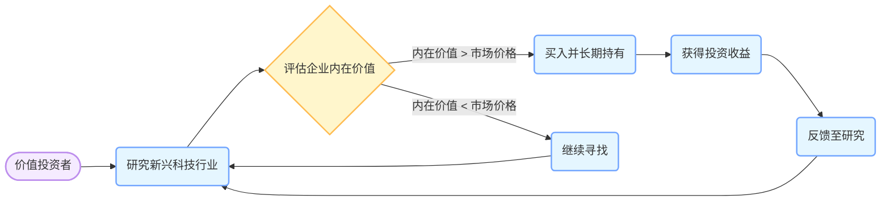

# 价值投资者如何看待并评估新兴科技行业

> 关键词：价值投资者、新兴科技行业、评估方法、市场趋势、投资策略

> 摘要：本文聚焦于价值投资者对新兴科技行业的看法和评估方式。首先介绍了价值投资的背景以及研究此主题的目的和范围，明确预期读者和文档结构。接着阐述了价值投资和新兴科技行业的核心概念及其联系，详细讲解了评估新兴科技行业的核心算法原理与操作步骤，并结合数学模型和公式进行说明。通过实际项目案例展示了如何运用这些评估方法，探讨了新兴科技行业的实际应用场景。同时推荐了相关的学习资源、开发工具框架以及论文著作。最后总结了新兴科技行业的未来发展趋势与挑战，解答了常见问题，并提供了扩展阅读和参考资料，旨在为价值投资者在新兴科技行业的投资决策提供全面而深入的指导。

## 1. 背景介绍 
### 1.1 目的和范围
价值投资作为一种成熟的投资理念，强调寻找被低估的资产并长期持有。然而，新兴科技行业具有快速变化、创新性强等特点，与传统行业存在显著差异。本文的目的在于帮助价值投资者理解如何将价值投资的原则应用于新兴科技行业，提供一套全面的评估方法和策略。范围涵盖了新兴科技行业的主要领域，如人工智能、生物技术、新能源等，分析其独特的价值驱动因素和风险特征。

### 1.2 预期读者
本文主要面向对新兴科技行业投资感兴趣的价值投资者，包括个人投资者、专业投资机构的分析师和基金经理等。同时，也适合对科技行业和投资领域有一定了解，希望深入学习如何评估新兴科技企业价值的人士阅读。

### 1.3 文档结构概述
本文将按照以下结构展开：首先介绍核心概念，明确价值投资和新兴科技行业的定义及联系；接着阐述评估新兴科技行业的核心算法原理和具体操作步骤；然后通过数学模型和公式进一步解释评估方法；再通过实际项目案例说明如何应用这些方法进行投资决策；探讨新兴科技行业的实际应用场景；推荐相关的学习资源、开发工具框架和论文著作；最后总结未来发展趋势与挑战，解答常见问题并提供扩展阅读和参考资料。

### 1.4 术语表
#### 1.4.1 核心术语定义
- **价值投资者**：遵循价值投资理念，通过分析资产的内在价值，寻找被市场低估的投资机会，并长期持有以获取收益的投资者。
- **新兴科技行业**：指基于最新科学技术成果发展起来的，具有高创新性、高成长性和高风险性的行业，如人工智能、大数据、区块链、生物技术等。
- **内在价值**：资产在未来能够产生的现金流的现值，是价值投资者评估投资对象的重要依据。

#### 1.4.2 相关概念解释
- **科技泡沫**：指在新兴科技行业发展过程中，由于市场过度乐观和投机行为，导致科技企业的股价远远高于其内在价值，最终泡沫破裂引发股价暴跌的现象。
- **技术护城河**：科技企业凭借其独特的技术优势、专利、品牌等形成的竞争壁垒，能够保护企业在市场中获得长期的竞争优势和超额利润。

#### 1.4.3 缩略词列表
- **AI**：人工智能（Artificial Intelligence）
- **BI**：商业智能（Business Intelligence）
- **AIoT**：人工智能物联网（Artificial Intelligence of Things）

## 2. 核心概念与联系 

### 价值投资的核心原理
价值投资的核心思想是认为市场有时会对企业的价值产生误判，投资者可以通过深入分析企业的基本面，寻找那些内在价值被低估的股票进行投资。价值投资者关注企业的财务状况、盈利能力、竞争优势等因素，以确定企业的内在价值。例如，通过分析企业的资产负债表、利润表和现金流量表，评估企业的资产质量、盈利稳定性和现金流状况。

### 新兴科技行业的特点
新兴科技行业具有以下特点：
1. **高创新性**：不断推出新的技术和产品，推动行业的快速发展。
2. **高成长性**：由于市场需求的快速增长和技术的不断进步，新兴科技企业往往具有较高的成长潜力。
3. **高风险性**：技术创新存在不确定性，市场竞争激烈，新兴科技企业面临着较高的失败风险。

### 价值投资与新兴科技行业的联系
虽然新兴科技行业具有高风险性，但对于价值投资者来说，也蕴含着巨大的投资机会。价值投资者可以通过深入研究新兴科技行业的发展趋势和企业的核心竞争力，寻找那些具有长期增长潜力且被市场低估的科技企业进行投资。例如，在人工智能领域，一些具有核心算法和大量数据的企业，虽然目前可能盈利较少，但未来具有巨大的发展潜力，价值投资者可以通过评估其内在价值，在合适的时机进行投资。

### 文本示意图
价值投资与新兴科技行业的关系可以用以下示意图表示：
价值投资者通过对新兴科技行业的市场趋势、技术创新、企业竞争力等方面进行分析，评估企业的内在价值。如果发现企业的内在价值高于市场价格，价值投资者会选择买入并长期持有该企业的股票。而新兴科技行业的发展也会受到价值投资者的影响，价值投资者的资金流入可以支持企业的研发和发展，促进整个行业的进步。

### Mermaid 流程图


## 3. 核心算法原理 & 具体操作步骤 

### 现金流折现模型（DCF）原理
现金流折现模型是价值投资中常用的评估企业内在价值的方法。其基本原理是将企业未来的现金流按照一定的折现率折现到当前，得到企业的内在价值。公式如下：
$$V = \sum_{t=1}^{n} \frac{CF_t}{(1 + r)^t}$$
其中，$V$ 表示企业的内在价值，$CF_t$ 表示第 $t$ 期的现金流，$r$ 表示折现率，$n$ 表示预测期数。

### Python 代码实现
```python
def dcf_analysis(cash_flows, discount_rate):
    """
    现金流折现模型分析
    :param cash_flows: 未来各期现金流列表
    :param discount_rate: 折现率
    :return: 企业内在价值
    """
    present_value = 0
    for i, cf in enumerate(cash_flows):
        present_value += cf / ((1 + discount_rate) ** (i + 1))
    return present_value

# 示例
cash_flows = [100, 120, 150, 180, 200]
discount_rate = 0.1
intrinsic_value = dcf_analysis(cash_flows, discount_rate)
print(f"企业内在价值: {intrinsic_value}")
```

### 具体操作步骤
1. **预测未来现金流**：分析新兴科技企业的业务模式、市场前景和竞争优势，预测其未来各期的现金流。这需要考虑企业的销售收入、成本、利润率等因素。
2. **确定折现率**：折现率反映了投资的风险和机会成本。对于新兴科技行业，由于其高风险性，折现率通常较高。可以参考行业平均回报率、无风险利率和风险溢价等因素来确定折现率。
3. **计算内在价值**：将预测的未来现金流按照确定的折现率折现到当前，得到企业的内在价值。
4. **比较内在价值和市场价格**：如果企业的内在价值高于市场价格，说明该企业被低估，具有投资价值；反之，则说明该企业被高估，不建议投资。

## 4. 数学模型和公式 & 详细讲解 & 举例说明 

### 市盈率（P/E）模型
市盈率是指股票价格与每股收益的比率，公式为：
$$P/E = \frac{P}{EPS}$$
其中，$P$ 表示股票价格，$EPS$ 表示每股收益。

市盈率模型通过比较不同企业的市盈率，来评估企业的相对估值水平。一般来说，市盈率较低的企业可能被低估，具有投资价值。但对于新兴科技行业，由于其高成长性，市盈率可能较高，需要结合其他指标进行综合评估。

### 举例说明
假设一家新兴科技企业的股票价格为 $50$ 元，每股收益为 $2$ 元，则其市盈率为：
$$P/E = \frac{50}{2} = 25$$
如果同行业其他企业的平均市盈率为 $30$，则该企业的市盈率相对较低，可能被低估。但需要注意的是，市盈率模型没有考虑企业的未来增长潜力，因此不能单独作为投资决策的依据。

### 市净率（P/B）模型
市净率是指股票价格与每股净资产的比率，公式为：
$$P/B = \frac{P}{BVPS}$$
其中，$P$ 表示股票价格，$BVPS$ 表示每股净资产。

市净率模型主要用于评估企业的资产价值。对于新兴科技行业，由于其资产主要是无形资产（如技术、专利等），市净率可能不能准确反映企业的真实价值。但在某些情况下，如企业的无形资产具有较高的价值时，市净率仍然可以作为一个参考指标。

### 举例说明
假设一家新兴科技企业的股票价格为 $60$ 元，每股净资产为 $10$ 元，则其市净率为：
$$P/B = \frac{60}{10} = 6$$
如果同行业其他企业的平均市净率为 $8$，则该企业的市净率相对较低，可能具有一定的投资价值。

### 综合评估模型
在实际评估新兴科技企业时，需要综合运用多种模型和指标，如现金流折现模型、市盈率模型、市净率模型等，并结合企业的行业地位、技术实力、管理团队等因素进行全面评估。例如，可以构建一个综合评估指标体系，对企业的各个方面进行打分，然后根据权重计算综合得分，以此来评估企业的投资价值。

## 5. 项目实战：代码实际案例和详细解释说明 

### 5.1  开发环境搭建
为了进行新兴科技企业的评估，我们可以使用 Python 语言进行数据处理和模型计算。以下是开发环境的搭建步骤：
1. **安装 Python**：从 Python 官方网站（https://www.python.org/downloads/）下载并安装 Python 3.x 版本。
2. **安装必要的库**：使用 `pip` 命令安装以下库：
```sh
pip install pandas numpy matplotlib scikit-learn
```
其中，`pandas` 用于数据处理和分析，`numpy` 用于数值计算，`matplotlib` 用于数据可视化，`scikit-learn` 用于机器学习模型的构建和评估。

### 5.2  源代码详细实现和代码解读
以下是一个使用 Python 对新兴科技企业进行综合评估的示例代码：
```python
import pandas as pd
import numpy as np

# 定义企业数据
data = {
    '企业名称': ['科技公司 A', '科技公司 B', '科技公司 C'],
    '市盈率': [20, 25, 30],
    '市净率': [3, 4, 5],
    '未来增长率': [0.2, 0.25, 0.3],
    '技术实力得分': [80, 85, 90],
    '管理团队得分': [70, 75, 80]
}

df = pd.DataFrame(data)

# 定义指标权重
weights = {
    '市盈率': 0.2,
    '市净率': 0.2,
    '未来增长率': 0.3,
    '技术实力得分': 0.15,
    '管理团队得分': 0.15
}

# 标准化数据
def standardize(data):
    return (data - data.mean()) / data.std()

for col in df.columns[1:]:
    df[col] = standardize(df[col])

# 计算综合得分
df['综合得分'] = 0
for col, weight in weights.items():
    df['综合得分'] += df[col] * weight

# 排序并输出结果
df = df.sort_values(by='综合得分', ascending=False)
print(df)
```

### 代码解读与分析
1. **数据定义**：使用字典 `data` 定义了三家新兴科技企业的相关数据，包括市盈率、市净率、未来增长率、技术实力得分和管理团队得分。
2. **指标权重定义**：使用字典 `weights` 定义了各个指标的权重，用于计算综合得分。
3. **数据标准化**：使用 `standardize` 函数对各个指标的数据进行标准化处理，以消除不同指标之间的量纲差异。
4. **综合得分计算**：根据各个指标的权重，计算每家企业的综合得分。
5. **结果排序与输出**：按照综合得分对企业进行排序，并输出结果。

通过这个示例代码，我们可以对不同的新兴科技企业进行综合评估，选择综合得分较高的企业进行投资。

## 6. 实际应用场景 
### 人工智能领域
在人工智能领域，价值投资者可以关注那些具有核心算法和大量数据的企业。例如，一些人工智能芯片企业，通过不断研发和创新，提高芯片的性能和效率，具有较高的技术护城河。价值投资者可以通过评估企业的技术实力、市场份额和未来增长潜力，来确定其投资价值。同时，人工智能在医疗、金融、交通等领域的应用也具有巨大的市场潜力，价值投资者可以关注相关的应用企业，寻找投资机会。

### 生物技术领域
生物技术领域是新兴科技行业的重要组成部分，具有高创新性和高风险性。价值投资者可以关注那些在基因编辑、药物研发等领域具有领先技术的企业。例如，一些基因测序企业，通过不断提高测序技术的准确性和效率，为药物研发和个性化医疗提供支持。价值投资者可以通过评估企业的研发能力、临床进展和市场前景，来确定其投资价值。

### 新能源领域
随着全球对环境保护和可持续发展的重视，新能源领域成为了投资热点。价值投资者可以关注那些在太阳能、风能、电动汽车等领域具有核心技术和市场优势的企业。例如，一些电动汽车企业，通过不断提高电池技术和自动驾驶技术，推动电动汽车的普及和发展。价值投资者可以通过评估企业的技术创新能力、生产规模和市场份额，来确定其投资价值。

## 7. 工具和资源推荐
### 7.1 学习资源推荐
#### 7.1.1 书籍推荐
- 《聪明的投资者》（The Intelligent Investor）：本杰明·格雷厄姆（Benjamin Graham）著，价值投资领域的经典著作，介绍了价值投资的基本理念和方法。
- 《证券分析》（Security Analysis）：本杰明·格雷厄姆和戴维·多德（David Dodd）著，详细阐述了价值投资的分析方法和技巧。
- 《创新者的窘境》（The Innovator's Dilemma）：克莱顿·克里斯坦森（Clayton Christensen）著，探讨了新兴科技企业在创新过程中面临的挑战和机遇。

#### 7.1.2 在线课程
- Coursera 上的“投资学原理”（Principles of Investing）：由宾夕法尼亚大学沃顿商学院教授授课，介绍了投资的基本原理和方法。
- edX 上的“人工智能基础”（Fundamentals of Artificial Intelligence）：由麻省理工学院教授授课，介绍了人工智能的基本概念和技术。
- Udemy 上的“数据分析实战”（Data Analysis in Practice）：介绍了数据分析的基本方法和工具，对于评估新兴科技企业的数据具有重要帮助。

#### 7.1.3 技术博客和网站
- 36氪：关注新兴科技行业的最新动态和创业项目，提供行业分析和投资建议。
- 虎嗅网：深度报道科技、商业等领域的热点事件和趋势，具有较高的参考价值。
- Seeking Alpha：提供全球金融市场的分析和评论，包括新兴科技行业的投资机会和风险。

### 7.2 开发工具框架推荐
#### 7.2.1 IDE和编辑器
- PyCharm：一款专业的 Python 集成开发环境，具有代码编辑、调试、自动补全、代码分析等功能，适合 Python 开发。
- Jupyter Notebook：一种交互式的开发环境，支持多种编程语言，适合数据处理和分析。
- Visual Studio Code：一款轻量级的代码编辑器，支持多种编程语言和插件，具有丰富的扩展功能。

#### 7.2.2 调试和性能分析工具
- Py-Spy：一个用于 Python 程序性能分析的工具，可以实时监控程序的运行状态和性能指标。
- cProfile：Python 自带的性能分析模块，可以统计程序中各个函数的调用次数和执行时间。
-pdb：Python 自带的调试器，可以在程序运行过程中设置断点，进行单步调试。

#### 7.2.3 相关框架和库
- Pandas：用于数据处理和分析的 Python 库，提供了高效的数据结构和数据操作方法。
- NumPy：用于数值计算的 Python 库，提供了高效的多维数组和数学函数。
- Scikit-learn：用于机器学习的 Python 库，提供了各种机器学习算法和工具。

### 7.3 相关论文著作推荐
#### 7.3.1 经典论文
- “有效市场假说”（Efficient Markets Hypothesis）：由尤金·法玛（Eugene F. Fama）提出，探讨了市场效率和股票价格的关系。
- “资本资产定价模型”（Capital Asset Pricing Model）：由威廉·夏普（William F. Sharpe）提出，用于计算资产的预期收益率。
- “技术创新的扩散”（Diffusion of Innovations）：由埃弗雷特·罗杰斯（Everett M. Rogers）提出，研究了新技术在社会中的传播和应用过程。

#### 7.3.2 最新研究成果
- 《人工智能与未来社会》（Artificial Intelligence and the Future of Society）：探讨了人工智能对社会、经济和就业的影响。
- 《生物技术的前沿进展》（Frontiers in Biotechnology）：介绍了生物技术领域的最新研究成果和发展趋势。
- 《新能源的未来展望》（Future Prospects of New Energy）：分析了新能源领域的发展前景和挑战。

#### 7.3.3 应用案例分析
- 《科技企业的投资策略与案例分析》：通过实际案例分析，介绍了价值投资者在新兴科技行业的投资策略和方法。
- 《新兴科技行业的创业与投资》：探讨了新兴科技企业的创业模式和投资机会，以及如何评估创业项目的价值。

## 8. 总结：未来发展趋势与挑战
### 未来发展趋势
1. **技术融合加速**：新兴科技行业之间的技术融合将越来越明显，如人工智能与物联网、生物技术与信息技术的融合，将创造出更多的创新应用和商业机会。
2. **应用场景拓展**：新兴科技将在更多的领域得到应用，如智能医疗、智能交通、智能家居等，为人们的生活和工作带来更多的便利和改变。
3. **全球化竞争加剧**：随着新兴科技行业的全球化发展，企业之间的竞争将越来越激烈。价值投资者需要关注全球市场的动态，寻找具有国际竞争力的企业进行投资。

### 挑战
1. **技术不确定性**：新兴科技行业的技术创新速度快，技术发展方向不确定，企业面临着较高的技术风险。价值投资者需要具备较强的技术分析能力，准确判断技术发展趋势。
2. **市场泡沫风险**：由于新兴科技行业的高成长性和市场关注度，容易出现市场泡沫。价值投资者需要保持理性，避免盲目跟风投资。
3. **监管政策变化**：新兴科技行业的发展受到监管政策的影响较大，监管政策的变化可能会对企业的发展产生不利影响。价值投资者需要关注监管政策的动态，及时调整投资策略。

## 9. 附录：常见问题与解答
### 问题 1：新兴科技行业的估值方法与传统行业有何不同？
答：新兴科技行业具有高创新性、高成长性和高风险性等特点，其估值方法与传统行业有所不同。传统行业的估值方法主要基于企业的历史财务数据和现金流，而新兴科技行业的估值需要更多地考虑企业的未来增长潜力、技术创新能力和市场前景等因素。例如，现金流折现模型在新兴科技行业的应用中，需要更准确地预测企业的未来现金流和折现率。

### 问题 2：如何判断新兴科技企业是否具有技术护城河？
答：可以从以下几个方面判断新兴科技企业是否具有技术护城河：
1. **专利技术**：企业拥有的专利数量和质量是衡量其技术实力的重要指标。具有大量核心专利的企业，其技术护城河相对较深。
2. **研发投入**：持续的研发投入是企业保持技术领先的关键。研发投入占销售收入比例较高的企业，通常具有较强的技术创新能力。
3. **人才团队**：优秀的人才团队是企业技术创新的核心。拥有一支高素质的研发团队和管理团队的企业，其技术护城河相对较深。
4. **数据优势**：在大数据时代，数据是企业的重要资产。拥有大量数据的企业，可以通过数据分析和挖掘，不断优化产品和服务，提高企业的竞争力。

### 问题 3：价值投资者在新兴科技行业投资时应注意哪些风险？
答：价值投资者在新兴科技行业投资时应注意以下风险：
1. **技术风险**：新兴科技行业的技术创新速度快，技术发展方向不确定，企业面临着较高的技术风险。投资者需要关注企业的技术研发能力和技术储备情况。
2. **市场风险**：新兴科技行业的市场竞争激烈，市场需求变化快，企业面临着较高的市场风险。投资者需要关注企业的市场份额和市场竞争力。
3. **财务风险**：新兴科技企业通常需要大量的资金投入进行研发和市场拓展，企业的财务状况可能不稳定。投资者需要关注企业的财务报表和现金流情况。
4. **政策风险**：新兴科技行业的发展受到政策的影响较大，政策的变化可能会对企业的发展产生不利影响。投资者需要关注政策的动态，及时调整投资策略。

## 10. 扩展阅读 & 参考资料
### 扩展阅读
- 《从0到1：开启商业与未来的秘密》（Zero to One: Notes on Startups, or How to Build the Future）：彼得·蒂尔（Peter Thiel）著，探讨了创业和创新的本质，对于理解新兴科技企业的发展具有重要启示。
- 《黑天鹅：如何应对不可预知的未来》（The Black Swan: The Impact of the Highly Improbable）：纳西姆·尼古拉斯·塔勒布（Nassim Nicholas Taleb）著，介绍了不确定性和风险管理的方法，对于新兴科技行业的投资具有重要参考价值。

### 参考资料
- 相关行业报告：如艾瑞咨询、德勤等机构发布的新兴科技行业研究报告。
- 企业财务报表：可以从证券交易所网站或企业官方网站获取新兴科技企业的财务报表。
- 学术论文数据库：如知网、万方等，搜索关于新兴科技行业和价值投资的学术论文。

作者：AI天才研究院/AI Genius Institute & 禅与计算机程序设计艺术 /Zen And The Art of Computer Programming