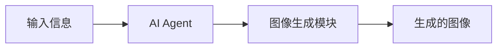

# 企业AI Agent的图像生成技术：产品设计与营销创意

> 关键词：企业AI Agent、图像生成技术、产品设计、营销创意、人工智能

> 摘要：本文聚焦于企业AI Agent的图像生成技术在产品设计与营销创意领域的应用。详细介绍了该技术的背景、核心概念、算法原理、数学模型等内容，通过项目实战展示其实际应用过程，探讨了其在不同场景下的应用价值，同时推荐了相关的学习资源、开发工具和论文著作。最后总结了该技术的未来发展趋势与挑战，并对常见问题进行了解答，旨在为企业在产品设计和营销创意方面合理运用AI Agent图像生成技术提供全面的参考。

## 1. 背景介绍 
### 1.1 目的和范围
随着人工智能技术的飞速发展，企业AI Agent的图像生成技术逐渐成为企业在产品设计和营销创意领域的重要工具。本文章的目的在于深入探讨这一技术在企业实际业务中的应用，包括其原理、实现方法以及实际应用场景等。范围涵盖了从基础概念的介绍到具体项目实战的分析，为企业和相关技术人员提供全面的技术参考和应用指导。

### 1.2 预期读者
本文的预期读者主要包括企业的产品设计师、营销策划人员、技术研发人员以及对人工智能图像生成技术感兴趣的爱好者。产品设计师可以从中获取利用AI Agent进行创新设计的灵感和方法；营销策划人员能够了解如何借助该技术提升营销创意的效果；技术研发人员可以深入学习技术原理和实现细节；而爱好者则可以对这一前沿技术有一个系统的认识。

### 1.3 文档结构概述
本文将按照以下结构进行阐述：首先介绍核心概念与联系，帮助读者建立对企业AI Agent图像生成技术的基本认知；接着详细讲解核心算法原理和具体操作步骤，通过Python代码进行深入剖析；然后介绍数学模型和公式，并举例说明其应用；随后通过项目实战展示该技术在实际中的应用过程；再探讨其在不同实际场景中的应用价值；之后推荐相关的学习资源、开发工具和论文著作；最后总结未来发展趋势与挑战，解答常见问题，并提供扩展阅读和参考资料。

### 1.4 术语表
#### 1.4.1 核心术语定义
- **企业AI Agent**：是指在企业环境中运行的人工智能代理，它能够模拟人类的行为和决策过程，根据预设的规则和目标自主地完成特定任务，在图像生成技术中可根据输入的需求生成相应的图像。
- **图像生成技术**：是指利用计算机算法和模型，根据一定的输入信息（如文本描述、图像样本等）生成全新图像的技术。
- **产品设计**：是一个将人的某种目的或需要转换为一个具体的物理形式或工具的过程，在本文中主要指利用AI Agent图像生成技术辅助进行产品外观、功能布局等方面的设计。
- **营销创意**：是指在市场营销活动中，通过创新的思维和方法，创造出具有吸引力和影响力的营销内容，图像生成技术可用于制作广告海报、宣传图片等营销素材。

#### 1.4.2 相关概念解释
- **生成对抗网络（GAN）**：是一种深度学习模型，由生成器和判别器组成。生成器负责生成图像，判别器负责判断生成的图像是真实的还是生成的，两者通过对抗训练不断提高生成图像的质量。
- **变分自编码器（VAE）**：是一种生成模型，它可以学习数据的潜在分布，并根据潜在分布生成新的数据。在图像生成中，VAE可以将输入图像编码为潜在向量，然后从潜在向量中解码生成新的图像。

#### 1.4.3 缩略词列表
- **GAN**：Generative Adversarial Network（生成对抗网络）
- **VAE**：Variational Autoencoder（变分自编码器）
- **CNN**：Convolutional Neural Network（卷积神经网络）

## 2. 核心概念与联系 

### 核心概念原理
企业AI Agent的图像生成技术主要基于深度学习模型，其中生成对抗网络（GAN）和变分自编码器（VAE）是两种常用的模型。

#### 生成对抗网络（GAN）原理
GAN由生成器（Generator）和判别器（Discriminator）两个神经网络组成。生成器的输入是一个随机噪声向量，它的任务是将这个随机噪声向量转换为一个图像。判别器的输入是一个图像，它的任务是判断这个图像是真实的图像还是生成器生成的假图像。生成器和判别器通过对抗训练不断提高自己的能力。具体来说，生成器试图生成越来越逼真的图像来欺骗判别器，而判别器则试图越来越准确地判断图像的真假。经过多次迭代训练后，生成器可以生成高质量的图像。

#### 变分自编码器（VAE）原理
VAE由编码器（Encoder）和解码器（Decoder）组成。编码器的作用是将输入的图像编码为一个潜在向量，这个潜在向量表示了图像的特征。解码器的作用是将潜在向量解码为一个图像。VAE的特点是它不仅学习了数据的潜在分布，还引入了一个正则化项，使得潜在向量的分布更加平滑，从而可以在潜在空间中进行插值和采样，生成新的图像。

### 架构的文本示意图
以下是企业AI Agent图像生成技术的基本架构示意图：

```plaintext
输入信息（文本描述、图像样本等）
    |
    v
AI Agent（包含GAN或VAE模型）
    |
    v
图像生成模块
    |
    v
生成的图像
```

### Mermaid流程图


## 3. 核心算法原理 & 具体操作步骤 

### 生成对抗网络（GAN）算法原理及Python实现

#### 算法原理
如前文所述，GAN由生成器和判别器组成。生成器的目标是最大化判别器将其生成的图像判断为真实图像的概率，而判别器的目标是最大化正确判断图像真假的概率。这可以通过最小化一个损失函数来实现。

生成器的损失函数可以表示为：
$$L_G = -\log(D(G(z)))$$
其中，$G$ 是生成器，$z$ 是随机噪声向量，$D$ 是判别器。

判别器的损失函数可以表示为：
$$L_D = -\log(D(x)) - \log(1 - D(G(z)))$$
其中，$x$ 是真实图像。

#### 具体操作步骤
1. 初始化生成器和判别器的参数。
2. 从随机噪声向量中生成假图像。
3. 从真实图像数据集中获取真实图像。
4. 计算判别器的损失函数，并更新判别器的参数。
5. 计算生成器的损失函数，并更新生成器的参数。
6. 重复步骤2 - 5，直到达到预定的训练次数。

#### Python源代码实现
```python
import torch
import torch.nn as nn
import torch.optim as optim
import torchvision
import torchvision.datasets as datasets
import torchvision.transforms as transforms

# 定义生成器
class Generator(nn.Module):
    def __init__(self, z_dim=100, img_dim=784):
        super(Generator, self).__init__()
        self.gen = nn.Sequential(
            nn.Linear(z_dim, 256),
            nn.LeakyReLU(0.1),
            nn.Linear(256, img_dim),
            nn.Tanh()
        )

    def forward(self, x):
        return self.gen(x)

# 定义判别器
class Discriminator(nn.Module):
    def __init__(self, img_dim=784):
        super(Discriminator, self).__init__()
        self.disc = nn.Sequential(
            nn.Linear(img_dim, 128),
            nn.LeakyReLU(0.1),
            nn.Linear(128, 1),
            nn.Sigmoid()
        )

    def forward(self, x):
        return self.disc(x)

# 超参数设置
device = torch.device("cuda" if torch.cuda.is_available() else "cpu")
lr = 3e-4
z_dim = 100
img_dim = 28 * 28
batch_size = 32
num_epochs = 50

# 数据加载
transform = transforms.Compose([
    transforms.ToTensor(),
    transforms.Normalize((0.5,), (0.5,))
])

dataset = datasets.MNIST(root='./data', train=True,
                         transform=transform, download=True)
dataloader = torch.utils.data.DataLoader(dataset, batch_size=batch_size, shuffle=True)

# 初始化生成器和判别器
gen = Generator(z_dim, img_dim).to(device)
disc = Discriminator(img_dim).to(device)

# 定义优化器和损失函数
opt_gen = optim.Adam(gen.parameters(), lr=lr)
opt_disc = optim.Adam(disc.parameters(), lr=lr)
criterion = nn.BCELoss()

# 训练循环
for epoch in range(num_epochs):
    for batch_idx, (real, _) in enumerate(dataloader):
        real = real.view(-1, 784).to(device)
        batch_size = real.shape[0]

        ### 训练判别器
        noise = torch.randn(batch_size, z_dim).to(device)
        fake = gen(noise)
        disc_real = disc(real).view(-1)
        lossD_real = criterion(disc_real, torch.ones_like(disc_real))
        disc_fake = disc(fake.detach()).view(-1)
        lossD_fake = criterion(disc_fake, torch.zeros_like(disc_fake))
        lossD = (lossD_real + lossD_fake) / 2
        disc.zero_grad()
        lossD.backward()
        opt_disc.step()

        ### 训练生成器
        output = disc(fake).view(-1)
        lossG = criterion(output, torch.ones_like(output))
        gen.zero_grad()
        lossG.backward()
        opt_gen.step()

    print(f"Epoch [{epoch + 1}/{num_epochs}] Loss D: {lossD.item():.4f}, Loss G: {lossG.item():.4f}")
```

### 变分自编码器（VAE）算法原理及Python实现

#### 算法原理
VAE的编码器将输入图像 $x$ 编码为均值 $\mu$ 和方差 $\log\sigma^2$，然后从以 $\mu$ 和 $\sigma$ 为参数的正态分布中采样得到潜在向量 $z$。解码器将潜在向量 $z$ 解码为图像 $\hat{x}$。

VAE的损失函数由两部分组成：重构损失和KL散度。重构损失衡量了输入图像 $x$ 和生成图像 $\hat{x}$ 之间的差异，通常使用均方误差（MSE）。KL散度衡量了潜在向量的分布与标准正态分布之间的差异，用于正则化潜在空间。

损失函数可以表示为：
$$L = \text{MSE}(x, \hat{x}) + \text{KL}(\mathcal{N}(\mu, \sigma^2) || \mathcal{N}(0, 1))$$

#### 具体操作步骤
1. 初始化编码器和解码器的参数。
2. 将输入图像通过编码器得到均值 $\mu$ 和方差 $\log\sigma^2$。
3. 从以 $\mu$ 和 $\sigma$ 为参数的正态分布中采样得到潜在向量 $z$。
4. 将潜在向量 $z$ 通过解码器得到生成图像 $\hat{x}$。
5. 计算损失函数，并更新编码器和解码器的参数。
6. 重复步骤2 - 5，直到达到预定的训练次数。

#### Python源代码实现
```python
import torch
import torch.nn as nn
import torch.optim as optim
import torchvision
import torchvision.datasets as datasets
import torchvision.transforms as transforms

# 定义VAE编码器
class Encoder(nn.Module):
    def __init__(self, input_dim=784, hidden_dim=400, latent_dim=20):
        super(Encoder, self).__init__()
        self.fc1 = nn.Linear(input_dim, hidden_dim)
        self.fc_mu = nn.Linear(hidden_dim, latent_dim)
        self.fc_logvar = nn.Linear(hidden_dim, latent_dim)

    def forward(self, x):
        h = torch.relu(self.fc1(x))
        mu = self.fc_mu(h)
        logvar = self.fc_logvar(h)
        return mu, logvar

# 定义VAE解码器
class Decoder(nn.Module):
    def __init__(self, latent_dim=20, hidden_dim=400, output_dim=784):
        super(Decoder, self).__init__()
        self.fc1 = nn.Linear(latent_dim, hidden_dim)
        self.fc2 = nn.Linear(hidden_dim, output_dim)

    def forward(self, z):
        h = torch.relu(self.fc1(z))
        x_recon = torch.sigmoid(self.fc2(h))
        return x_recon

# 定义VAE模型
class VAE(nn.Module):
    def __init__(self, input_dim=784, hidden_dim=400, latent_dim=20):
        super(VAE, self).__init__()
        self.encoder = Encoder(input_dim, hidden_dim, latent_dim)
        self.decoder = Decoder(latent_dim, hidden_dim, input_dim)

    def reparameterize(self, mu, logvar):
        std = torch.exp(0.5 * logvar)
        eps = torch.randn_like(std)
        return mu + eps * std

    def forward(self, x):
        mu, logvar = self.encoder(x)
        z = self.reparameterize(mu, logvar)
        x_recon = self.decoder(z)
        return x_recon, mu, logvar

# 超参数设置
device = torch.device("cuda" if torch.cuda.is_available() else "cpu")
lr = 1e-3
batch_size = 128
num_epochs = 10

# 数据加载
transform = transforms.Compose([
    transforms.ToTensor()
])

dataset = datasets.MNIST(root='./data', train=True,
                         transform=transform, download=True)
dataloader = torch.utils.data.DataLoader(dataset, batch_size=batch_size, shuffle=True)

# 初始化VAE模型
vae = VAE().to(device)

# 定义优化器
optimizer = optim.Adam(vae.parameters(), lr=lr)

# 训练循环
for epoch in range(num_epochs):
    for batch_idx, (data, _) in enumerate(dataloader):
        data = data.view(-1, 784).to(device)
        recon_batch, mu, logvar = vae(data)

        # 计算重构损失和KL散度
        recon_loss = nn.functional.binary_cross_entropy(recon_batch, data, reduction='sum')
        kl_div = -0.5 * torch.sum(1 + logvar - mu.pow(2) - logvar.exp())

        # 计算总损失
        loss = recon_loss + kl_div

        # 反向传播和优化
        optimizer.zero_grad()
        loss.backward()
        optimizer.step()

    print(f"Epoch [{epoch + 1}/{num_epochs}] Loss: {loss.item() / len(dataset):.4f}")
```

## 4. 数学模型和公式 & 详细讲解 & 举例说明 

### 生成对抗网络（GAN）数学模型和公式
#### 目标函数
如前文所述，GAN的目标是通过对抗训练来学习生成器和判别器的参数。生成器的目标是最大化判别器将其生成的图像判断为真实图像的概率，判别器的目标是最大化正确判断图像真假的概率。这可以用以下目标函数来表示：

$$\min_G \max_D V(D, G) = \mathbb{E}_{x \sim p_{data}(x)}[\log D(x)] + \mathbb{E}_{z \sim p_z(z)}[\log(1 - D(G(z)))]$$

其中，$p_{data}(x)$ 是真实图像的分布，$p_z(z)$ 是随机噪声的分布。

#### 详细讲解
这个目标函数可以分解为两个部分：
- 第一部分 $\mathbb{E}_{x \sim p_{data}(x)}[\log D(x)]$ 表示判别器对真实图像的判断能力。判别器希望这个值越大越好，因为它表示判别器能够准确地将真实图像判断为真实图像。
- 第二部分 $\mathbb{E}_{z \sim p_z(z)}[\log(1 - D(G(z)))]$ 表示判别器对生成图像的判断能力。判别器希望这个值越大越好，因为它表示判别器能够准确地将生成图像判断为假图像。而生成器希望这个值越小越好，因为它表示判别器容易被生成的图像欺骗。

#### 举例说明
假设我们有一个简单的二维数据集，真实数据点分布在一个圆形上，随机噪声向量是从一个均匀分布中采样得到的。生成器的任务是将随机噪声向量映射到二维平面上，使得生成的点尽可能地接近真实数据点。判别器的任务是判断一个点是真实数据点还是生成的点。在训练过程中，生成器会不断调整自己的参数，使得生成的点越来越接近真实数据点，而判别器会不断调整自己的参数，使得能够更准确地判断点的真假。

### 变分自编码器（VAE）数学模型和公式
#### 损失函数
VAE的损失函数由重构损失和KL散度两部分组成，如前文所述：
$$L = \text{MSE}(x, \hat{x}) + \text{KL}(\mathcal{N}(\mu, \sigma^2) || \mathcal{N}(0, 1))$$

其中，$\text{MSE}(x, \hat{x})$ 是输入图像 $x$ 和生成图像 $\hat{x}$ 之间的均方误差，$\text{KL}(\mathcal{N}(\mu, \sigma^2) || \mathcal{N}(0, 1))$ 是潜在向量的分布 $\mathcal{N}(\mu, \sigma^2)$ 与标准正态分布 $\mathcal{N}(0, 1)$ 之间的KL散度。

#### 详细讲解
- 重构损失 $\text{MSE}(x, \hat{x})$ 衡量了输入图像和生成图像之间的差异，它希望生成图像尽可能地接近输入图像。
- KL散度 $\text{KL}(\mathcal{N}(\mu, \sigma^2) || \mathcal{N}(0, 1))$ 用于正则化潜在空间，使得潜在向量的分布更加平滑。它的计算公式为：
$$\text{KL}(\mathcal{N}(\mu, \sigma^2) || \mathcal{N}(0, 1)) = \frac{1}{2} \sum_{i=1}^{d} (\sigma_i^2 + \mu_i^2 - 1 - \log(\sigma_i^2))$$
其中，$d$ 是潜在向量的维度。

#### 举例说明
假设我们有一个手写数字图像数据集，输入图像是一张手写数字图像。VAE的编码器将输入图像编码为一个潜在向量，解码器将潜在向量解码为一张新的图像。在训练过程中，重构损失会促使解码器生成的图像尽可能地接近输入图像，而KL散度会使得潜在向量的分布更加接近标准正态分布。这样，我们就可以在潜在空间中进行插值和采样，生成新的手写数字图像。

## 5. 项目实战：代码实际案例和详细解释说明 

### 5.1  开发环境搭建
#### 操作系统
建议使用Linux系统（如Ubuntu）或Windows 10及以上版本，因为这些操作系统对深度学习框架的支持较好。

#### 编程语言
使用Python 3.7及以上版本，Python是深度学习领域最常用的编程语言，拥有丰富的库和工具。

#### 深度学习框架
使用PyTorch作为深度学习框架，PyTorch具有动态图机制，易于调试和开发。可以通过以下命令安装PyTorch：
```sh
pip install torch torchvision
```

#### 其他依赖库
还需要安装一些其他的依赖库，如NumPy、Matplotlib等，可以通过以下命令安装：
```sh
pip install numpy matplotlib
```

### 5.2  源代码详细实现和代码解读
#### 产品设计案例：生成不同风格的手机外观图像
以下是一个使用GAN生成不同风格手机外观图像的示例代码：

```python
import torch
import torch.nn as nn
import torch.optim as optim
import torchvision
import torchvision.datasets as datasets
import torchvision.transforms as transforms
import matplotlib.pyplot as plt

# 定义生成器
class Generator(nn.Module):
    def __init__(self, z_dim=100, img_dim=3 * 64 * 64):
        super(Generator, self).__init__()
        self.gen = nn.Sequential(
            nn.Linear(z_dim, 256),
            nn.LeakyReLU(0.1),
            nn.Linear(256, 512),
            nn.LeakyReLU(0.1),
            nn.Linear(512, img_dim),
            nn.Tanh()
        )

    def forward(self, x):
        return self.gen(x).view(-1, 3, 64, 64)

# 定义判别器
class Discriminator(nn.Module):
    def __init__(self, img_dim=3 * 64 * 64):
        super(Discriminator, self).__init__()
        self.disc = nn.Sequential(
            nn.Linear(img_dim, 512),
            nn.LeakyReLU(0.1),
            nn.Linear(512, 256),
            nn.LeakyReLU(0.1),
            nn.Linear(256, 1),
            nn.Sigmoid()
        )

    def forward(self, x):
        return self.disc(x.view(-1, img_dim))

# 超参数设置
device = torch.device("cuda" if torch.cuda.is_available() else "cpu")
lr = 3e-4
z_dim = 100
img_dim = 3 * 64 * 64
batch_size = 32
num_epochs = 50

# 数据加载
transform = transforms.Compose([
    transforms.Resize((64, 64)),
    transforms.ToTensor(),
    transforms.Normalize((0.5, 0.5, 0.5), (0.5, 0.5, 0.5))
])

# 假设我们有一个手机外观图像数据集
dataset = datasets.ImageFolder(root='./phone_images', transform=transform)
dataloader = torch.utils.data.DataLoader(dataset, batch_size=batch_size, shuffle=True)

# 初始化生成器和判别器
gen = Generator(z_dim, img_dim).to(device)
disc = Discriminator(img_dim).to(device)

# 定义优化器和损失函数
opt_gen = optim.Adam(gen.parameters(), lr=lr)
opt_disc = optim.Adam(disc.parameters(), lr=lr)
criterion = nn.BCELoss()

# 训练循环
for epoch in range(num_epochs):
    for batch_idx, (real, _) in enumerate(dataloader):
        real = real.to(device)
        batch_size = real.shape[0]

        ### 训练判别器
        noise = torch.randn(batch_size, z_dim).to(device)
        fake = gen(noise)
        disc_real = disc(real).view(-1)
        lossD_real = criterion(disc_real, torch.ones_like(disc_real))
        disc_fake = disc(fake.detach()).view(-1)
        lossD_fake = criterion(disc_fake, torch.zeros_like(disc_fake))
        lossD = (lossD_real + lossD_fake) / 2
        disc.zero_grad()
        lossD.backward()
        opt_disc.step()

        ### 训练生成器
        output = disc(fake).view(-1)
        lossG = criterion(output, torch.ones_like(output))
        gen.zero_grad()
        lossG.backward()
        opt_gen.step()

    print(f"Epoch [{epoch + 1}/{num_epochs}] Loss D: {lossD.item():.4f}, Loss G: {lossG.item():.4f}")

# 生成一些示例图像
num_samples = 16
noise = torch.randn(num_samples, z_dim).to(device)
generated_images = gen(noise).cpu().detach()

# 显示生成的图像
fig, axes = plt.subplots(4, 4, figsize=(8, 8))
axes = axes.flatten()
for i in range(num_samples):
    img = generated_images[i].permute(1, 2, 0).numpy()
    img = (img + 1) / 2  # 反归一化
    axes[i].imshow(img)
    axes[i].axis('off')
plt.show()
```

#### 代码解读
1. **生成器和判别器的定义**：
    - 生成器 `Generator` 接受一个随机噪声向量作为输入，通过一系列全连接层生成一个图像。
    - 判别器 `Discriminator` 接受一个图像作为输入，通过一系列全连接层判断图像的真假。

2. **数据加载**：
    - 使用 `torchvision.datasets.ImageFolder` 加载手机外观图像数据集，并进行预处理，包括调整图像大小、转换为张量和归一化。

3. **训练过程**：
    - 训练过程分为两个阶段：训练判别器和训练生成器。
    - 训练判别器时，先计算判别器对真实图像和生成图像的损失，然后更新判别器的参数。
    - 训练生成器时，计算生成器生成的图像被判别器判断为真实图像的损失，然后更新生成器的参数。

4. **生成示例图像**：
    - 训练完成后，使用生成器生成一些示例图像，并使用 `matplotlib` 库显示这些图像。

#### 营销创意案例：生成广告海报图像
以下是一个使用VAE生成广告海报图像的示例代码：

```python
import torch
import torch.nn as nn
import torch.optim as optim
import torchvision
import torchvision.datasets as datasets
import torchvision.transforms as transforms
import matplotlib.pyplot as plt

# 定义VAE编码器
class Encoder(nn.Module):
    def __init__(self, input_dim=3 * 64 * 64, hidden_dim=400, latent_dim=20):
        super(Encoder, self).__init__()
        self.fc1 = nn.Linear(input_dim, hidden_dim)
        self.fc_mu = nn.Linear(hidden_dim, latent_dim)
        self.fc_logvar = nn.Linear(hidden_dim, latent_dim)

    def forward(self, x):
        h = torch.relu(self.fc1(x))
        mu = self.fc_mu(h)
        logvar = self.fc_logvar(h)
        return mu, logvar

# 定义VAE解码器
class Decoder(nn.Module):
    def __init__(self, latent_dim=20, hidden_dim=400, output_dim=3 * 64 * 64):
        super(Decoder, self).__init__()
        self.fc1 = nn.Linear(latent_dim, hidden_dim)
        self.fc2 = nn.Linear(hidden_dim, output_dim)

    def forward(self, z):
        h = torch.relu(self.fc1(z))
        x_recon = torch.sigmoid(self.fc2(h))
        return x_recon.view(-1, 3, 64, 64)

# 定义VAE模型
class VAE(nn.Module):
    def __init__(self, input_dim=3 * 64 * 64, hidden_dim=400, latent_dim=20):
        super(VAE, self).__init__()
        self.encoder = Encoder(input_dim, hidden_dim, latent_dim)
        self.decoder = Decoder(latent_dim, hidden_dim, input_dim)

    def reparameterize(self, mu, logvar):
        std = torch.exp(0.5 * logvar)
        eps = torch.randn_like(std)
        return mu + eps * std

    def forward(self, x):
        mu, logvar = self.encoder(x.view(-1, input_dim))
        z = self.reparameterize(mu, logvar)
        x_recon = self.decoder(z)
        return x_recon, mu, logvar

# 超参数设置
device = torch.device("cuda" if torch.cuda.is_available() else "cpu")
lr = 1e-3
batch_size = 128
num_epochs = 10

# 数据加载
transform = transforms.Compose([
    transforms.Resize((64, 64)),
    transforms.ToTensor()
])

# 假设我们有一个广告海报图像数据集
dataset = datasets.ImageFolder(root='./poster_images', transform=transform)
dataloader = torch.utils.data.DataLoader(dataset, batch_size=batch_size, shuffle=True)

# 初始化VAE模型
vae = VAE().to(device)

# 定义优化器
optimizer = optim.Adam(vae.parameters(), lr=lr)

# 训练循环
for epoch in range(num_epochs):
    for batch_idx, (data, _) in enumerate(dataloader):
        data = data.to(device)
        recon_batch, mu, logvar = vae(data)

        # 计算重构损失和KL散度
        recon_loss = nn.functional.mse_loss(recon_batch, data, reduction='sum')
        kl_div = -0.5 * torch.sum(1 + logvar - mu.pow(2) - logvar.exp())

        # 计算总损失
        loss = recon_loss + kl_div

        # 反向传播和优化
        optimizer.zero_grad()
        loss.backward()
        optimizer.step()

    print(f"Epoch [{epoch + 1}/{num_epochs}] Loss: {loss.item() / len(dataset):.4f}")

# 生成一些示例图像
num_samples = 16
z = torch.randn(num_samples, 20).to(device)
generated_images = vae.decoder(z).cpu().detach()

# 显示生成的图像
fig, axes = plt.subplots(4, 4, figsize=(8, 8))
axes = axes.flatten()
for i in range(num_samples):
    img = generated_images[i].permute(1, 2, 0).numpy()
    axes[i].imshow(img)
    axes[i].axis('off')
plt.show()
```

#### 代码解读
1. **VAE模型的定义**：
    - 编码器 `Encoder` 将输入图像编码为均值 $\mu$ 和方差 $\log\sigma^2$。
    - 解码器 `Decoder` 将潜在向量解码为图像。
    - VAE模型 `VAE` 结合了编码器和解码器，并实现了重参数化技巧。

2. **数据加载**：
    - 使用 `torchvision.datasets.ImageFolder` 加载广告海报图像数据集，并进行预处理，包括调整图像大小和转换为张量。

3. **训练过程**：
    - 训练过程中，计算重构损失和KL散度，然后将两者相加得到总损失。
    - 使用反向传播和优化器更新模型的参数。

4. **生成示例图像**：
    - 训练完成后，从标准正态分布中采样得到潜在向量，然后使用解码器生成示例图像，并使用 `matplotlib` 库显示这些图像。

### 5.3  代码解读与分析
#### 产品设计案例分析
- **优点**：使用GAN可以生成具有多样性的手机外观图像，为产品设计提供更多的创意和选择。通过调整随机噪声向量，可以生成不同风格、不同形状的手机外观。
- **缺点**：GAN的训练过程不稳定，容易出现模式崩溃的问题，即生成器只能生成有限的几种图像。此外，GAN的训练时间较长，需要大量的计算资源。

#### 营销创意案例分析
- **优点**：VAE可以学习到广告海报图像的潜在分布，生成的图像具有一定的语义信息。通过在潜在空间中进行插值和采样，可以生成具有不同风格和主题的广告海报。
- **缺点**：VAE生成的图像质量相对较低，尤其是在细节方面。此外，VAE的重构损失和KL散度的平衡需要手动调整，否则可能会导致生成的图像过于模糊或缺乏多样性。

## 6. 实际应用场景 
### 产品设计
#### 外观设计
企业可以使用AI Agent的图像生成技术为产品设计不同的外观。例如，汽车制造商可以使用该技术生成不同款式的汽车外观图像，设计师可以从中选择合适的设计方案。手机制造商可以生成不同颜色、材质和形状的手机外观，满足不同用户的需求。

#### 功能布局设计
在产品的功能布局设计方面，AI Agent可以根据产品的功能需求和用户的使用习惯，生成不同的布局方案。例如，智能家居产品的界面设计、电子产品的按键布局等。通过生成多种布局方案，设计师可以进行比较和选择，提高设计效率和质量。

### 营销创意
#### 广告海报制作
AI Agent的图像生成技术可以快速生成各种风格的广告海报。企业可以输入产品的相关信息和营销主题，AI Agent可以生成具有吸引力的广告海报，节省设计时间和成本。例如，化妆品公司可以输入产品的名称、特点和目标受众，AI Agent可以生成适合不同渠道和场景的广告海报。

#### 社交媒体营销素材创作
在社交媒体营销中，需要大量的高质量素材来吸引用户的关注。AI Agent可以根据社交媒体平台的特点和用户的喜好，生成适合的营销素材，如图片、视频等。例如，服装品牌可以使用该技术生成模特穿着自家服装的图片，用于社交媒体的推广。

#### 产品宣传册设计
企业可以使用AI Agent生成产品宣传册的页面布局和图像内容。宣传册可以展示产品的特点、优势和使用方法，吸引潜在客户的兴趣。通过AI Agent的图像生成技术，可以快速生成多种宣传册设计方案，满足不同客户的需求。

## 7. 工具和资源推荐
### 7.1 学习资源推荐
#### 7.1.1 书籍推荐
- 《深度学习》（Deep Learning）：由Ian Goodfellow、Yoshua Bengio和Aaron Courville合著，是深度学习领域的经典教材，涵盖了深度学习的基本原理、算法和应用。
- 《Python深度学习》（Deep Learning with Python）：由Francois Chollet（Keras库的作者）撰写，通过大量的代码示例介绍了如何使用Python和Keras进行深度学习项目的开发。
- 《生成对抗网络实战》（GANs in Action）：由Jakub Langr和Vladimir Bok撰写，详细介绍了生成对抗网络的原理、算法和应用，包含了大量的代码示例和实际案例。

#### 7.1.2 在线课程
- Coursera上的“深度学习专项课程”（Deep Learning Specialization）：由Andrew Ng教授授课，涵盖了深度学习的各个方面，包括神经网络、卷积神经网络、循环神经网络等。
- edX上的“人工智能基础”（Introduction to Artificial Intelligence）：由MIT的Patrick Winston教授授课，介绍了人工智能的基本概念、算法和应用。
- Udemy上的“生成对抗网络实战”（GANs实战教程）：详细介绍了生成对抗网络的原理和实现方法，通过实际项目帮助学员掌握GAN的应用。

#### 7.1.3 技术博客和网站
- Medium：是一个技术博客平台，上面有很多关于人工智能和深度学习的文章，包括最新的研究成果、技术教程和应用案例。
- arXiv：是一个预印本服务器，上面可以找到很多最新的人工智能和深度学习领域的研究论文。
- Towards Data Science：是一个专注于数据科学和机器学习的博客平台，上面有很多高质量的技术文章和教程。

### 7.2 开发工具框架推荐
#### 7.2.1 IDE和编辑器
- PyCharm：是一款专门为Python开发设计的集成开发环境，具有代码自动补全、调试、版本控制等功能，适合开发深度学习项目。
- Jupyter Notebook：是一个交互式的开发环境，可以在浏览器中编写和运行Python代码，同时可以展示代码的运行结果和可视化图表，非常适合进行数据探索和模型实验。
- Visual Studio Code：是一款轻量级的代码编辑器，支持多种编程语言和插件，通过安装相关的插件可以实现Python代码的开发和调试。

#### 7.2.2 调试和性能分析工具
- TensorBoard：是TensorFlow提供的一个可视化工具，可以用于可视化模型的训练过程、损失函数的变化、模型的结构等，帮助开发者调试和优化模型。
- PyTorch Profiler：是PyTorch提供的一个性能分析工具，可以用于分析模型的运行时间、内存使用情况等，帮助开发者找出模型的性能瓶颈。
- NVIDIA Nsight Systems：是NVIDIA提供的一个性能分析工具，可以用于分析GPU的使用情况和性能瓶颈，帮助开发者优化GPU代码。

#### 7.2.3 相关框架和库
- PyTorch：是一个开源的深度学习框架，具有动态图机制，易于调试和开发，支持多种深度学习模型和算法。
- TensorFlow：是一个广泛使用的深度学习框架，具有强大的分布式训练和部署能力，支持多种深度学习模型和算法。
- Keras：是一个高级神经网络API，可以运行在TensorFlow、Theano等后端之上，简化了深度学习模型的开发过程。

### 7.3 相关论文著作推荐
#### 7.3.1 经典论文
- “Generative Adversarial Nets”：由Ian Goodfellow等人发表，首次提出了生成对抗网络的概念，为后来的图像生成技术奠定了基础。
- “Auto-Encoding Variational Bayes”：由Diederik P. Kingma和Max Welling发表，提出了变分自编码器的概念，为生成模型的发展做出了重要贡献。
- “Unsupervised Representation Learning with Deep Convolutional Generative Adversarial Networks”：由Alec Radford等人发表，提出了深度卷积生成对抗网络（DCGAN），提高了生成图像的质量。

#### 7.3.2 最新研究成果
- “Diffusion Models Beat GANs on Image Synthesis”：提出了扩散模型，在图像合成任务上取得了优于GAN的效果。
- “StableDiffusion: High-Resolution Image Synthesis with Latent Diffusion Models”：介绍了StableDiffusion模型，该模型可以根据文本描述生成高质量的图像。

#### 7.3.3 应用案例分析
- “AI in Product Design: Transforming the Way We Create”：分析了AI在产品设计中的应用案例，包括使用AI进行产品外观设计、功能布局设计等。
- “Marketing Creativity with AI: How Brands are Leveraging AI for Content Creation”：介绍了企业如何使用AI进行营销创意，包括广告海报制作、社交媒体营销素材创作等。

## 8. 总结：未来发展趋势与挑战
### 未来发展趋势
#### 图像质量和多样性的提升
随着技术的不断发展，企业AI Agent的图像生成技术将能够生成更高质量、更具多样性的图像。例如，生成的图像将更加逼真、细腻，能够满足更多领域的需求。同时，通过引入更多的约束和控制条件，图像生成技术将能够生成具有特定风格、主题和语义信息的图像。

#### 与其他技术的融合
图像生成技术将与其他技术如自然语言处理、计算机视觉等进行更深入的融合。例如，用户可以通过自然语言描述来生成图像，或者将生成的图像与计算机视觉技术相结合，实现图像的编辑、识别和分析等功能。

#### 应用领域的拓展
企业AI Agent的图像生成技术将在更多的领域得到应用，如游戏开发、影视制作、虚拟现实等。在游戏开发中，该技术可以用于生成游戏场景、角色和道具等；在影视制作中，可以用于特效制作和场景生成；在虚拟现实中，可以用于创建逼真的虚拟环境。

### 挑战
#### 数据隐私和安全问题
图像生成技术需要大量的数据进行训练，这些数据可能包含用户的隐私信息。因此，如何保护数据的隐私和安全是一个重要的挑战。此外，恶意使用图像生成技术可能会导致虚假信息的传播和滥用，对社会造成不良影响。

#### 模型可解释性问题
深度学习模型通常是黑盒模型，难以解释其决策过程和生成结果。在企业的产品设计和营销创意中，需要对生成的图像进行解释和评估，以确保其符合企业的需求和目标。因此，如何提高模型的可解释性是一个亟待解决的问题。

#### 计算资源和成本问题
图像生成技术需要大量的计算资源和时间进行训练，尤其是对于大规模的数据集和复杂的模型。这对于企业来说可能是一个巨大的成本负担。因此，如何提高模型的训练效率和降低计算成本是一个重要的挑战。

## 9. 附录：常见问题与解答
### 1. 企业AI Agent的图像生成技术需要多少数据进行训练？
这取决于具体的模型和应用场景。一般来说，数据量越大，模型的性能越好。对于简单的图像生成任务，可能需要几千张图像进行训练；对于复杂的任务，可能需要数万甚至数十万张图像。

### 2. 生成的图像是否可以用于商业用途？
这取决于数据的来源和使用的许可协议。如果使用的是公开数据集或经过授权的数据集，并且符合相关的许可协议，生成的图像可以用于商业用途。但是，在使用之前，建议咨询专业的法律意见。

### 3. 如何选择合适的图像生成模型？
选择合适的图像生成模型需要考虑多个因素，如生成图像的质量、多样性、训练效率、可解释性等。如果需要生成高质量、逼真的图像，可以选择GAN模型；如果需要学习数据的潜在分布并生成具有语义信息的图像，可以选择VAE模型。

### 4. 图像生成技术的训练时间需要多久？
训练时间取决于多个因素，如数据集的大小、模型的复杂度、计算资源的性能等。对于简单的模型和小规模的数据集，训练时间可能只需要几个小时；对于复杂的模型和大规模的数据集，训练时间可能需要数天甚至数周。

### 5. 如何评估生成图像的质量？
评估生成图像的质量可以使用多种指标，如视觉评估、结构相似性指数（SSIM）、峰值信噪比（PSNR）等。视觉评估是最直观的方法，通过人工观察生成的图像来评估其质量。SSIM和PSNR是常用的量化指标，用于衡量生成图像与真实图像之间的相似程度。

## 10. 扩展阅读 & 参考资料
### 扩展阅读
- 《人工智能：现代方法》（Artificial Intelligence: A Modern Approach）：全面介绍了人工智能的各个领域，包括搜索算法、知识表示、机器学习等。
- 《计算机视觉：算法与应用》（Computer Vision: Algorithms and Applications）：详细介绍了计算机视觉的基本算法和应用，如图像处理、特征提取、目标检测等。
- 《自然语言处理入门》（Natural Language Processing in Action）：介绍了自然语言处理的基本概念、算法和应用，如文本分类、情感分析、机器翻译等。

### 参考资料
- Goodfellow, I. J., et al. "Generative adversarial nets." Advances in neural information processing systems. 2014.
- Kingma, D. P., & Welling, M. "Auto-encoding variational bayes." arXiv preprint arXiv:1312.6114 (2013).
- Radford, A., Metz, L., & Chintala, S. "Unsupervised representation learning with deep convolutional generative adversarial networks." arXiv preprint arXiv:1511.06434 (2015).
- Ho, J., Jain, A., & Abbeel, P. "Denoising diffusion probabilistic models." Advances in Neural Information Processing Systems 33 (2020): 6840-6851.
- Rombach, R., et al. "High-resolution image synthesis with latent diffusion models." arXiv preprint arXiv:2112.10752 (2021).

作者：AI天才研究院/AI Genius Institute & 禅与计算机程序设计艺术 /Zen And The Art of Computer Programming