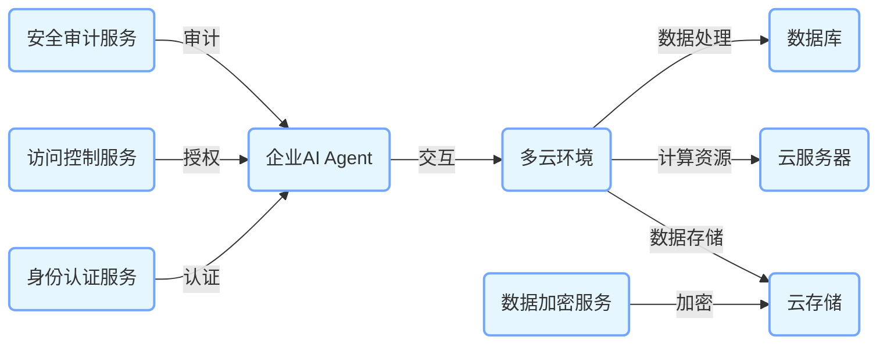

# 企业AI Agent的多云环境安全策略

> 关键词：企业AI Agent、多云环境、安全策略、人工智能安全、云计算安全

> 摘要：本文聚焦于企业AI Agent在多云环境下的安全策略。随着企业数字化转型的加速，AI Agent在多云环境中的应用日益广泛，但同时也面临着诸多安全挑战。文章深入探讨了相关核心概念与联系，详细阐述了核心算法原理及操作步骤，通过数学模型和公式进行理论分析，并结合项目实战给出代码案例与解释。此外，还介绍了实际应用场景、推荐了相关工具和资源，最后对未来发展趋势与挑战进行总结，旨在为企业构建有效的AI Agent多云环境安全策略提供全面且深入的指导。

## 1. 背景介绍 
### 1.1 目的和范围
随着云计算技术的不断发展，越来越多的企业选择采用多云环境来满足其多样化的业务需求。同时，人工智能技术的兴起使得AI Agent在企业中得到了广泛应用，它们可以自动化执行各种任务，提高企业的运营效率。然而，企业AI Agent在多云环境中的安全问题却成为了一个亟待解决的关键问题。本文章的目的在于深入研究企业AI Agent在多云环境下可能面临的安全风险，并提出相应的安全策略，以保障企业数据和业务的安全。范围涵盖了从核心概念的阐述到实际应用场景的分析，以及相关工具和资源的推荐等多个方面。

### 1.2 预期读者
本文预期读者包括企业的IT管理人员、安全专家、AI开发者、云计算工程师以及对企业AI Agent和多云环境安全感兴趣的研究人员。这些读者可以从文章中获取关于企业AI Agent在多云环境下安全策略的全面知识，从而更好地应对实际工作中的安全挑战。

### 1.3 文档结构概述
本文共分为十个部分。首先是背景介绍，阐述文章的目的、预期读者和文档结构概述，并给出相关术语表。接着介绍核心概念与联系，包括核心概念原理和架构的文本示意图以及Mermaid流程图。然后详细讲解核心算法原理和具体操作步骤，使用Python源代码进行阐述。随后通过数学模型和公式进行详细讲解并举例说明。之后是项目实战，包括开发环境搭建、源代码详细实现和代码解读以及代码分析。再介绍实际应用场景，推荐相关工具和资源。最后进行总结，探讨未来发展趋势与挑战，并给出附录常见问题与解答以及扩展阅读和参考资料。

### 1.4 术语表
#### 1.4.1 核心术语定义
- **企业AI Agent**：是指在企业环境中运行的具有人工智能能力的智能体，它可以感知环境、做出决策并执行相应的任务，以实现企业的业务目标。
- **多云环境**：是指企业同时使用多个云服务提供商的云资源，如同时使用亚马逊云、微软Azure和阿里云等，以满足不同的业务需求。
- **安全策略**：是指为了保护企业的信息资产和业务安全而制定的一系列规则、措施和流程。

#### 1.4.2 相关概念解释
- **人工智能安全**：主要关注人工智能系统的安全性，包括数据安全、模型安全、算法安全等方面，以防止人工智能系统被攻击或滥用。
- **云计算安全**：涉及云计算环境中的各种安全问题，如数据隐私、访问控制、网络安全等，确保云服务的安全可靠运行。

#### 1.4.3 缩略词列表
- **AI**：Artificial Intelligence（人工智能）
- **IAM**：Identity and Access Management（身份和访问管理）
- **DDoS**：Distributed Denial of Service（分布式拒绝服务攻击）

## 2. 核心概念与联系 
### 核心概念原理
企业AI Agent在多云环境中的安全策略涉及多个核心概念。首先，企业AI Agent需要与多云环境中的各种资源进行交互，包括云服务器、存储设备、数据库等。在这个过程中，需要确保数据的安全传输和存储，防止数据泄露和篡改。其次，身份和访问管理（IAM）是保障安全的重要环节，需要对AI Agent的身份进行认证和授权，确保只有合法的AI Agent能够访问相应的资源。此外，还需要考虑AI Agent的模型安全，防止模型被攻击或窃取。

### 架构的文本示意图
企业AI Agent的多云环境安全架构可以分为几个层次。最底层是多云基础设施层，包括各个云服务提供商的物理资源。中间层是安全服务层，包括身份认证、访问控制、数据加密、安全审计等安全服务。最上层是企业AI Agent应用层，AI Agent在这个层次上与多云环境进行交互。通过安全服务层的保护，确保AI Agent在多云环境中的安全运行。

### Mermaid流程图


## 3. 核心算法原理 & 具体操作步骤 
### 核心算法原理
在企业AI Agent的多云环境安全策略中，涉及到多个核心算法。例如，身份认证算法可以使用基于公钥基础设施（PKI）的数字证书来验证AI Agent的身份。访问控制算法可以使用基于角色的访问控制（RBAC）模型，根据AI Agent的角色和权限来控制其对资源的访问。数据加密算法可以使用对称加密算法（如AES）或非对称加密算法（如RSA）来保护数据的安全。

### 具体操作步骤及Python源代码
#### 身份认证
以下是一个简单的基于数字证书的身份认证示例：
```python
import ssl
import socket

# 服务器端代码
def server():
    context = ssl.SSLContext(ssl.PROTOCOL_TLS_SERVER)
    context.load_cert_chain(certfile='server.crt', keyfile='server.key')

    with socket.socket(socket.AF_INET, socket.SOCK_STREAM, 0) as sock:
        sock.bind(('localhost', 8443))
        sock.listen(5)
        with context.wrap_socket(sock, server_side=True) as ssock:
            conn, addr = ssock.accept()
            print(f'Connected by {addr}')
            data = conn.recv(1024)
            print(f'Received: {data}')
            conn.sendall(b'Hello, client!')

# 客户端代码
def client():
    context = ssl.SSLContext(ssl.PROTOCOL_TLS_CLIENT)
    context.load_verify_locations(cafile='server.crt')

    with socket.socket(socket.AF_INET, socket.SOCK_STREAM, 0) as sock:
        with context.wrap_socket(sock, server_hostname='localhost') as ssock:
            ssock.connect(('localhost', 8443))
            ssock.sendall(b'Hello, server!')
            data = ssock.recv(1024)
            print(f'Received: {data}')

if __name__ == '__main__':
    import threading
    server_thread = threading.Thread(target=server)
    server_thread.start()

    client_thread = threading.Thread(target=client)
    client_thread.start()

    server_thread.join()
    client_thread.join()
```
#### 访问控制
以下是一个基于RBAC模型的简单访问控制示例：
```python
class Role:
    def __init__(self, name, permissions):
        self.name = name
        self.permissions = permissions

class User:
    def __init__(self, name, role):
        self.name = name
        self.role = role

    def has_permission(self, permission):
        return permission in self.role.permissions

# 定义角色和权限
admin_role = Role('admin', ['read', 'write', 'delete'])
user_role = Role('user', ['read'])

# 创建用户
admin_user = User('admin_user', admin_role)
normal_user = User('normal_user', user_role)

# 检查权限
print(admin_user.has_permission('write'))  # 输出: True
print(normal_user.has_permission('write'))  # 输出: False
```
#### 数据加密
以下是一个使用AES算法进行数据加密和解密的示例：
```python
from Crypto.Cipher import AES
from Crypto.Util.Padding import pad, unpad
import os

# 加密函数
def encrypt(plaintext, key):
    cipher = AES.new(key, AES.MODE_CBC)
    ciphertext = cipher.encrypt(pad(plaintext.encode('utf-8'), AES.block_size))
    iv = cipher.iv
    return iv + ciphertext

# 解密函数
def decrypt(ciphertext, key):
    iv = ciphertext[:AES.block_size]
    ciphertext = ciphertext[AES.block_size:]
    cipher = AES.new(key, AES.MODE_CBC, iv)
    plaintext = unpad(cipher.decrypt(ciphertext), AES.block_size)
    return plaintext.decode('utf-8')

# 生成密钥
key = os.urandom(16)

# 待加密的数据
plaintext = 'Hello, world!'

# 加密
encrypted_data = encrypt(plaintext, key)

# 解密
decrypted_data = decrypt(encrypted_data, key)

print(f'Original text: {plaintext}')
print(f'Decrypted text: {decrypted_data}')
```

## 4. 数学模型和公式 & 详细讲解 & 举例说明 
### 身份认证的数学模型
在基于公钥基础设施（PKI）的身份认证中，涉及到非对称加密算法，如RSA算法。RSA算法基于大数分解的困难性。设 $p$ 和 $q$ 是两个大素数，$n = p \times q$ 是模数，$\varphi(n)=(p - 1)\times(q - 1)$ 是欧拉函数。选择一个整数 $e$ 作为公钥指数，满足 $1 < e < \varphi(n)$ 且 $\gcd(e,\varphi(n)) = 1$。然后计算私钥指数 $d$，使得 $e\times d\equiv 1\pmod{\varphi(n)}$。

加密过程：对于明文 $m$，$c = m^e\pmod{n}$，其中 $c$ 是密文。

解密过程：对于密文 $c$，$m = c^d\pmod{n}$。

举例说明：假设 $p = 3$，$q = 11$，则 $n = p\times q=33$，$\varphi(n)=(3 - 1)\times(11 - 1)=20$。选择 $e = 3$，满足 $\gcd(3,20)=1$。计算 $d$，使得 $3\times d\equiv 1\pmod{20}$，可以得到 $d = 7$。假设明文 $m = 5$，则密文 $c = 5^3\pmod{33}=125\pmod{33}=26$。解密时，$m = 26^7\pmod{33}=8031810176\pmod{33}=5$。

### 访问控制的数学模型
基于角色的访问控制（RBAC）模型可以用集合论来描述。设 $U$ 是用户集合，$R$ 是角色集合，$P$ 是权限集合。存在两个映射：用户 - 角色映射 $f:U\rightarrow R$ 和角色 - 权限映射 $g:R\rightarrow 2^P$。对于用户 $u\in U$，其拥有的权限集合为 $g(f(u))$。

举例说明：设 $U=\{u_1,u_2\}$，$R = \{r_1,r_2\}$，$P=\{p_1,p_2,p_3\}$。$f(u_1)=r_1$，$f(u_2)=r_2$，$g(r_1)=\{p_1,p_2\}$，$g(r_2)=\{p_2,p_3\}$。则用户 $u_1$ 拥有的权限集合为 $\{p_1,p_2\}$，用户 $u_2$ 拥有的权限集合为 $\{p_2,p_3\}$。

### 数据加密的数学模型
以AES算法为例，AES是一种对称加密算法，它基于置换 - 置换网络（SPN）结构。AES的加密过程可以分为多个轮次，每一轮包括字节替换、行移位、列混淆和轮密钥加四个操作。

字节替换操作是一个非线性的替换操作，使用一个固定的S盒进行替换。行移位操作是对状态矩阵的行进行循环移位。列混淆操作是对状态矩阵的列进行线性变换。轮密钥加操作是将状态矩阵与轮密钥进行异或运算。

举例说明：假设输入的明文是一个128位的二进制数据，密钥也是128位。经过多轮的加密操作后，得到密文。解密过程是加密过程的逆过程，通过逆字节替换、逆行移位、逆列混淆和轮密钥加操作，将密文还原为明文。

## 5. 项目实战：代码实际案例和详细解释说明 
### 5.1  开发环境搭建
#### 操作系统
可以选择Linux系统，如Ubuntu 20.04，因为Linux系统具有良好的开源性和稳定性，适合进行开发和测试。

#### 编程语言
选择Python 3.8及以上版本，Python具有丰富的库和工具，方便进行安全策略的开发和实现。

#### 相关库安装
使用pip安装所需的库，如`pycryptodome`用于加密操作，`ssl`用于身份认证。
```bash
pip install pycryptodome
```

### 5.2  源代码详细实现和代码解读
#### 综合安全策略实现
```python
import ssl
import socket
from Crypto.Cipher import AES
from Crypto.Util.Padding import pad, unpad
import os

# 身份认证相关
class Authentication:
    def __init__(self, certfile, keyfile):
        self.context = ssl.SSLContext(ssl.PROTOCOL_TLS_SERVER)
        self.context.load_cert_chain(certfile=certfile, keyfile=keyfile)

    def start_server(self):
        with socket.socket(socket.AF_INET, socket.SOCK_STREAM, 0) as sock:
            sock.bind(('localhost', 8443))
            sock.listen(5)
            with self.context.wrap_socket(sock, server_side=True) as ssock:
                conn, addr = ssock.accept()
                print(f'Connected by {addr}')
                data = conn.recv(1024)
                print(f'Received: {data}')
                conn.sendall(b'Hello, client!')

# 数据加密相关
class Encryption:
    def __init__(self):
        self.key = os.urandom(16)

    def encrypt(self, plaintext):
        cipher = AES.new(self.key, AES.MODE_CBC)
        ciphertext = cipher.encrypt(pad(plaintext.encode('utf-8'), AES.block_size))
        iv = cipher.iv
        return iv + ciphertext

    def decrypt(self, ciphertext):
        iv = ciphertext[:AES.block_size]
        ciphertext = ciphertext[AES.block_size:]
        cipher = AES.new(self.key, AES.MODE_CBC, iv)
        plaintext = unpad(cipher.decrypt(ciphertext), AES.block_size)
        return plaintext.decode('utf-8')

# 主程序
if __name__ == '__main__':
    auth = Authentication('server.crt', 'server.key')
    encryption = Encryption()

    # 启动身份认证服务器
    import threading
    server_thread = threading.Thread(target=auth.start_server)
    server_thread.start()

    # 加密数据
    plaintext = 'Sensitive data'
    encrypted_data = encryption.encrypt(plaintext)
    print(f'Encrypted data: {encrypted_data}')

    # 解密数据
    decrypted_data = encryption.decrypt(encrypted_data)
    print(f'Decrypted data: {decrypted_data}')

    server_thread.join()
```
#### 代码解读
- **身份认证部分**：`Authentication`类负责身份认证，通过`ssl.SSLContext`加载证书和密钥，启动一个基于TLS的服务器，等待客户端连接并进行身份验证。
- **数据加密部分**：`Encryption`类负责数据加密和解密，使用AES算法进行加密和解密操作。
- **主程序部分**：创建`Authentication`和`Encryption`对象，启动身份认证服务器线程，对敏感数据进行加密和解密操作。

### 5.3  代码解读与分析
#### 优点
- 代码结构清晰，将身份认证和数据加密功能分别封装在不同的类中，提高了代码的可维护性和可扩展性。
- 使用了标准的加密库和协议，如`pycryptodome`和`ssl`，保证了加密和身份认证的安全性。

#### 缺点
- 代码中使用的是本地的证书和密钥，在实际应用中需要考虑证书的管理和分发问题。
- 没有实现完整的访问控制功能，需要进一步扩展。

#### 改进建议
- 引入证书管理系统，如Let's Encrypt，实现证书的自动颁发和更新。
- 实现基于RBAC模型的访问控制功能，对不同的用户和角色进行权限管理。

## 6. 实际应用场景 
### 金融行业
在金融行业，企业AI Agent可以用于风险评估、交易处理等任务。在多云环境中，需要确保AI Agent处理的金融数据的安全。通过身份认证和数据加密等安全策略，防止金融数据泄露和篡改，保障客户的资金安全。例如，银行的AI Agent在处理客户的转账请求时，需要对客户的身份进行严格认证，对转账数据进行加密传输和存储。

### 医疗行业
在医疗行业，企业AI Agent可以用于医疗影像分析、疾病诊断等任务。多云环境中的医疗数据包含患者的敏感信息，如病历、诊断结果等。通过安全策略保护这些数据的安全，防止患者隐私泄露。例如，医院的AI Agent在分析患者的医疗影像时，需要对影像数据进行加密处理，同时对访问这些数据的AI Agent进行严格的身份认证和授权。

### 制造业
在制造业，企业AI Agent可以用于生产调度、质量控制等任务。在多云环境中，需要确保AI Agent与生产设备之间的通信安全，防止生产数据被窃取或篡改。例如，工厂的AI Agent在调度生产设备时，需要对设备的身份进行认证，对生产数据进行加密传输，确保生产过程的安全和稳定。

## 7. 工具和资源推荐
### 7.1 学习资源推荐
#### 7.1.1 书籍推荐
- 《云计算安全：概念、技术与实践》：全面介绍了云计算安全的相关概念、技术和实践方法，对理解企业AI Agent在多云环境中的安全问题有很大帮助。
- 《Python密码学编程》：详细介绍了Python中各种加密算法的实现和应用，对于学习和实现数据加密功能非常有用。
- 《人工智能安全：基础与前沿》：探讨了人工智能安全的基本原理和前沿技术，有助于深入理解企业AI Agent的安全问题。

#### 7.1.2 在线课程
- Coursera上的“云计算安全基础”课程：由知名高校的教授授课，系统地介绍了云计算安全的基础知识和技术。
- edX上的“Python编程与数据安全”课程：通过实际案例讲解Python编程在数据安全领域的应用。
- Udemy上的“人工智能安全实战”课程：结合实际项目，介绍人工智能安全的实战技巧和方法。

#### 7.1.3 技术博客和网站
- 云安全联盟（CSA）的官方网站：提供了大量关于云计算安全的研究报告、最佳实践和技术文章。
- 安全博客“KrebsOnSecurity”：关注网络安全领域的最新动态和技术，对企业AI Agent的安全问题有深入的分析和报道。
- 开源安全项目“OWASP”的官方网站：提供了丰富的安全工具和资源，以及关于应用安全的最佳实践。

### 7.2 开发工具框架推荐
#### 7.2.1 IDE和编辑器
- PyCharm：是一款专业的Python集成开发环境，具有代码自动补全、调试、版本控制等功能，方便进行Python代码的开发和调试。
- Visual Studio Code：是一款轻量级的代码编辑器，支持多种编程语言和插件，适合快速开发和调试。

#### 7.2.2 调试和性能分析工具
- PDB：Python自带的调试器，可以帮助开发者定位和解决代码中的问题。
- cProfile：Python的性能分析工具，可以分析代码的运行时间和资源消耗，帮助优化代码性能。

#### 7.2.3 相关框架和库
- Flask：是一个轻量级的Python Web框架，适合快速开发基于Web的AI Agent应用。
- Django：是一个功能强大的Python Web框架，提供了丰富的组件和工具，适合开发大型的企业级AI Agent应用。
- TensorFlow：是一个开源的机器学习框架，可用于开发和训练AI Agent的模型。

### 7.3 相关论文著作推荐
#### 7.3.1 经典论文
- “A Taxonomy of Cloud Computing Security Threats”：对云计算安全威胁进行了分类和分析，为研究企业AI Agent在多云环境中的安全问题提供了理论基础。
- “Security and Privacy in Cloud Computing”：探讨了云计算环境中的安全和隐私问题，提出了一些解决方案和建议。

#### 7.3.2 最新研究成果
- 近期发表在ACM SIGSAC、IEEE Security & Privacy等顶级安全会议上的关于企业AI Agent和多云环境安全的研究论文，这些论文反映了该领域的最新研究进展和技术趋势。

#### 7.3.3 应用案例分析
- 一些知名企业的云计算安全实践案例分析，如亚马逊云、微软Azure等的安全策略和最佳实践，为企业构建AI Agent的多云环境安全策略提供了实际参考。

## 8. 总结：未来发展趋势与挑战
### 未来发展趋势
- **自动化安全策略管理**：随着企业AI Agent和多云环境的不断发展，安全策略的管理将越来越复杂。未来，将出现更多的自动化工具和技术，实现安全策略的自动配置、更新和优化。
- **零信任架构的应用**：零信任架构将成为企业AI Agent在多云环境中的主流安全架构。零信任架构基于“默认不信任，始终验证”的原则，对任何访问请求都进行严格的身份认证和授权，提高了系统的安全性。
- **AI与安全的深度融合**：AI技术将在安全领域得到更广泛的应用，如使用AI技术进行安全威胁检测、预测和响应。同时，安全技术也将为AI Agent的安全运行提供保障。

### 挑战
- **复杂的多云环境**：不同云服务提供商的安全机制和接口存在差异，企业需要在多个云环境中协调和管理安全策略，增加了安全管理的难度。
- **AI Agent的安全漏洞**：AI Agent的模型和算法可能存在安全漏洞，如对抗攻击、模型窃取等。如何发现和修复这些安全漏洞是一个亟待解决的问题。
- **法律法规和合规性要求**：不同国家和地区的法律法规对数据安全和隐私有不同的要求，企业需要确保其AI Agent在多云环境中的安全策略符合相关法律法规和合规性要求。

## 9. 附录：常见问题与解答
### 1. 企业AI Agent在多云环境中面临的主要安全风险有哪些？
企业AI Agent在多云环境中面临的主要安全风险包括数据泄露、数据篡改、身份冒用、DDoS攻击、模型窃取等。

### 2. 如何选择合适的加密算法来保护企业AI Agent的数据安全？
选择加密算法时需要考虑数据的敏感性、加密性能、算法的安全性等因素。对于一般的数据，可以选择对称加密算法，如AES；对于需要数字签名和身份认证的场景，可以选择非对称加密算法，如RSA。

### 3. 如何实现企业AI Agent在多云环境中的身份认证和授权？
可以使用基于公钥基础设施（PKI）的数字证书来实现身份认证，使用基于角色的访问控制（RBAC）模型来实现授权。同时，还可以结合多因素认证等技术提高身份认证的安全性。

### 4. 如何应对企业AI Agent在多云环境中的安全漏洞？
需要建立完善的安全漏洞管理机制，包括漏洞扫描、漏洞修复、安全审计等。同时，还需要关注安全领域的最新动态，及时更新安全策略和技术。

## 10. 扩展阅读 & 参考资料
### 扩展阅读
- 《云计算：原理与应用》
- 《人工智能：一种现代方法》
- 《网络安全技术与实践》

### 参考资料
- 云安全联盟（CSA）的相关报告和文档
- 各云服务提供商（如亚马逊云、微软Azure、阿里云等）的安全文档和最佳实践
- 相关学术期刊和会议论文，如ACM SIGSAC、IEEE Security & Privacy等

作者：AI天才研究院/AI Genius Institute & 禅与计算机程序设计艺术 /Zen And The Art of Computer Programming