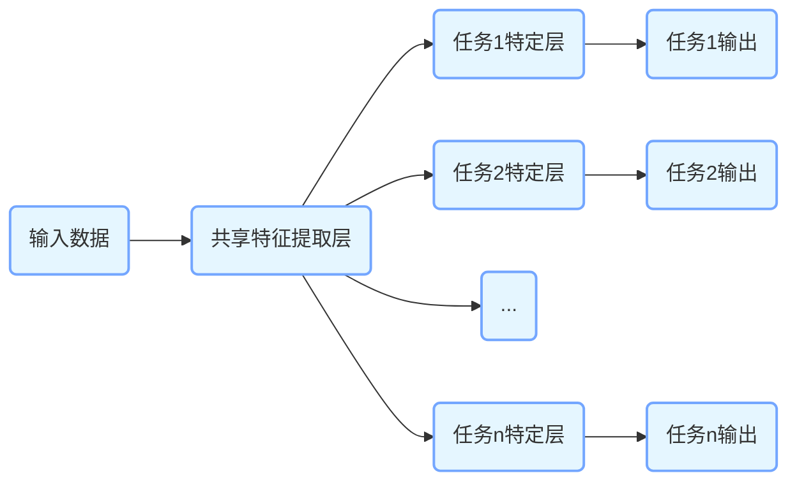

# 企业AI Agent的多任务学习框架：提升模型通用性与效率

> 关键词：企业AI Agent、多任务学习框架、模型通用性、模型效率、深度学习

> 摘要：本文聚焦于企业AI Agent的多任务学习框架，旨在深入探讨如何通过该框架提升模型的通用性与效率。首先介绍了相关背景知识，包括目的范围、预期读者等内容。接着详细阐述了核心概念、算法原理、数学模型等理论基础。通过项目实战案例，展示了多任务学习框架在实际中的应用和实现方式。分析了其实际应用场景，并推荐了相关的学习资源、开发工具和论文著作。最后总结了未来发展趋势与挑战，同时提供了常见问题解答和扩展阅读参考资料，为企业在AI Agent多任务学习方面的应用提供全面的技术指导。

## 1. 背景介绍 
### 1.1 目的和范围
在当今数字化快速发展的时代，企业面临着越来越复杂多样的业务需求。企业AI Agent作为一种能够模拟人类智能进行决策和执行任务的技术，逐渐成为企业提升竞争力的重要手段。然而，传统的单任务学习模型在处理多个不同类型的任务时，往往需要为每个任务单独训练一个模型，这不仅耗费大量的计算资源和时间，而且模型之间缺乏信息共享，难以实现知识的迁移和整合。

本文章的目的在于介绍企业AI Agent的多任务学习框架，探讨如何通过该框架实现多个任务的联合学习，从而提升模型的通用性和效率。范围涵盖了多任务学习框架的核心概念、算法原理、数学模型、项目实战以及实际应用场景等方面，旨在为企业和相关技术人员提供全面的技术指导和实践参考。

### 1.2 预期读者
本文预期读者主要包括企业的技术管理人员、AI研发工程师、数据科学家以及对企业AI Agent和多任务学习感兴趣的研究人员。对于技术管理人员，本文可以帮助他们了解多任务学习框架的优势和应用场景，为企业的技术战略决策提供参考；对于AI研发工程师和数据科学家，文章提供了详细的技术原理和实现步骤，有助于他们在实际项目中应用和开发多任务学习模型；对于研究人员，本文可以激发他们对相关领域的研究兴趣，推动技术的进一步发展。

### 1.3 文档结构概述
本文将按照以下结构进行详细阐述：
- 核心概念与联系：介绍企业AI Agent和多任务学习框架的核心概念，以及它们之间的联系，并通过文本示意图和Mermaid流程图进行直观展示。
- 核心算法原理 & 具体操作步骤：讲解多任务学习框架的核心算法原理，并用Python源代码详细阐述具体操作步骤。
- 数学模型和公式 & 详细讲解 & 举例说明：给出多任务学习的数学模型和相关公式，并进行详细讲解和举例说明。
- 项目实战：代码实际案例和详细解释说明：通过一个实际的项目案例，展示多任务学习框架的开发环境搭建、源代码实现和代码解读。
- 实际应用场景：分析多任务学习框架在企业中的实际应用场景。
- 工具和资源推荐：推荐相关的学习资源、开发工具框架和论文著作。
- 总结：未来发展趋势与挑战：总结多任务学习框架的未来发展趋势和面临的挑战。
- 附录：常见问题与解答：提供常见问题的解答，帮助读者更好地理解和应用多任务学习框架。
- 扩展阅读 & 参考资料：列出扩展阅读的相关内容和参考资料，方便读者进一步深入研究。

### 1.4 术语表
#### 1.4.1 核心术语定义
- **企业AI Agent**：是指在企业环境中应用的，能够感知环境、做出决策并执行任务的人工智能实体。它可以集成多种人工智能技术，如机器学习、自然语言处理、计算机视觉等，以实现复杂的业务功能。
- **多任务学习框架**：一种机器学习框架，允许模型同时学习多个相关的任务。通过共享模型的部分参数，多任务学习框架可以提高模型的泛化能力和效率，同时减少过拟合的风险。
- **模型通用性**：指模型能够在不同类型的任务和数据集上表现良好的能力。具有高通用性的模型可以适应多种业务场景，减少为每个新任务单独训练模型的需求。
- **模型效率**：包括模型的训练效率和推理效率。训练效率指模型在训练过程中所需的计算资源和时间；推理效率指模型在预测或决策过程中的速度和准确性。

#### 1.4.2 相关概念解释
- **共享表示**：在多任务学习中，共享表示是指模型的一部分参数被多个任务共享。这些共享参数可以学习到不同任务之间的共同特征和模式，从而实现知识的迁移和整合。
- **任务特定层**：除了共享表示外，多任务学习模型通常还包含任务特定层。这些层的参数是每个任务独有的，用于学习每个任务的特定特征和模式。
- **损失函数**：在多任务学习中，损失函数用于衡量模型在每个任务上的预测误差。通常，多任务学习的损失函数是各个任务损失的加权和，通过调整权重可以平衡不同任务的重要性。

#### 1.4.3 缩略词列表
- **ML**：Machine Learning，机器学习
- **NLP**：Natural Language Processing，自然语言处理
- **CV**：Computer Vision，计算机视觉
- **DNN**：Deep Neural Network，深度神经网络
- **CNN**：Convolutional Neural Network，卷积神经网络
- **RNN**：Recurrent Neural Network，循环神经网络

## 2. 核心概念与联系 
### 核心概念原理
企业AI Agent的多任务学习框架的核心思想是让一个模型同时学习多个相关的任务。传统的单任务学习模型为每个任务独立训练一个模型，而多任务学习模型通过共享部分模型参数，使得不同任务之间可以共享知识和特征。

具体来说，多任务学习模型通常由一个共享的特征提取层和多个任务特定的输出层组成。共享特征提取层用于学习不同任务之间的共同特征和模式，而任务特定的输出层则用于学习每个任务的特定特征和模式。通过这种方式，模型可以在不同任务之间进行知识迁移，提高模型的通用性和效率。

### 架构的文本示意图
```plaintext
输入数据
|
|-- 共享特征提取层
|   |
|   |-- 任务1特定层
|   |   |
|   |   |-- 任务1输出
|   |
|   |-- 任务2特定层
|   |   |
|   |   |-- 任务2输出
|   |
|  ...
|   |
|   |-- 任务n特定层
|       |
|       |-- 任务n输出
```

### Mermaid流程图


## 3. 核心算法原理 & 具体操作步骤 
### 核心算法原理
多任务学习的核心算法是通过优化一个联合损失函数来同时训练模型在多个任务上的表现。联合损失函数通常是各个任务损失的加权和，公式如下：

$$L(\theta) = \sum_{i=1}^{n} w_i L_i(\theta)$$

其中，$L(\theta)$ 是联合损失函数，$\theta$ 是模型的参数，$n$ 是任务的数量，$w_i$ 是第 $i$ 个任务的权重，$L_i(\theta)$ 是第 $i$ 个任务的损失函数。

在训练过程中，模型通过反向传播算法来更新参数，使得联合损失函数最小化。通过共享部分参数，模型可以学习到不同任务之间的共同特征和模式，从而提高模型的通用性和效率。

### 具体操作步骤（Python源代码实现）
以下是一个简单的多任务学习示例，使用PyTorch实现。假设我们有两个任务：分类任务和回归任务。

```python
import torch
import torch.nn as nn
import torch.optim as optim

# 定义多任务学习模型
class MultiTaskModel(nn.Module):
    def __init__(self):
        super(MultiTaskModel, self).__init__()
        # 共享特征提取层
        self.shared_layer = nn.Linear(10, 20)
        # 任务1特定层（分类任务）
        self.task1_layer = nn.Linear(20, 2)
        # 任务2特定层（回归任务）
        self.task2_layer = nn.Linear(20, 1)

    def forward(self, x):
        # 通过共享特征提取层
        shared_output = self.shared_layer(x)
        # 任务1输出
        task1_output = self.task1_layer(shared_output)
        # 任务2输出
        task2_output = self.task2_layer(shared_output)
        return task1_output, task2_output

# 初始化模型
model = MultiTaskModel()

# 定义损失函数和优化器
criterion1 = nn.CrossEntropyLoss()
criterion2 = nn.MSELoss()
optimizer = optim.Adam(model.parameters(), lr=0.001)

# 模拟输入数据和标签
inputs = torch.randn(32, 10)
task1_labels = torch.randint(0, 2, (32,))
task2_labels = torch.randn(32, 1)

# 训练模型
for epoch in range(100):
    optimizer.zero_grad()
    # 前向传播
    task1_output, task2_output = model(inputs)
    # 计算损失
    loss1 = criterion1(task1_output, task1_labels)
    loss2 = criterion2(task2_output, task2_labels)
    # 联合损失
    total_loss = loss1 + loss2
    # 反向传播
    total_loss.backward()
    # 更新参数
    optimizer.step()

    if (epoch + 1) % 10 == 0:
        print(f'Epoch {epoch + 1}, Total Loss: {total_loss.item()}')
```

### 代码解释
1. **模型定义**：`MultiTaskModel` 类定义了一个简单的多任务学习模型，包含一个共享特征提取层和两个任务特定层。
2. **损失函数和优化器**：使用交叉熵损失函数 `nn.CrossEntropyLoss()` 处理分类任务，使用均方误差损失函数 `nn.MSELoss()` 处理回归任务。使用Adam优化器来更新模型参数。
3. **训练过程**：在每个训练周期中，首先将梯度清零，然后进行前向传播计算每个任务的输出，接着计算每个任务的损失，将它们相加得到联合损失。最后进行反向传播和参数更新。

## 4. 数学模型和公式 & 详细讲解 & 举例说明 
### 数学模型
多任务学习的数学模型可以用以下公式表示：

假设我们有 $n$ 个任务，每个任务的输入数据为 $x_i$，对应的标签为 $y_i$。模型的参数为 $\theta$，第 $i$ 个任务的损失函数为 $L_i(\theta; x_i, y_i)$。联合损失函数可以表示为：

$$L(\theta) = \sum_{i=1}^{n} w_i L_i(\theta; x_i, y_i)$$

其中，$w_i$ 是第 $i$ 个任务的权重，用于平衡不同任务的重要性。

### 详细讲解
- **损失函数**：不同的任务可以使用不同的损失函数。例如，分类任务通常使用交叉熵损失函数，回归任务通常使用均方误差损失函数。
- **权重调整**：权重 $w_i$ 的选择非常重要，它可以根据任务的重要性、数据分布等因素进行调整。如果某个任务的数据量较少，可以适当增加其权重，以确保模型在该任务上有足够的学习。
- **参数更新**：在训练过程中，模型通过最小化联合损失函数来更新参数。可以使用梯度下降等优化算法来实现参数更新，具体公式如下：

$$\theta_{t+1} = \theta_t - \alpha \nabla L(\theta_t)$$

其中，$\theta_t$ 是第 $t$ 次迭代的参数，$\alpha$ 是学习率，$\nabla L(\theta_t)$ 是联合损失函数在 $\theta_t$ 处的梯度。

### 举例说明
假设我们有两个任务：图像分类任务和图像分割任务。图像分类任务的损失函数为交叉熵损失 $L_1(\theta; x_1, y_1)$，图像分割任务的损失函数为Dice损失 $L_2(\theta; x_2, y_2)$。联合损失函数可以表示为：

$$L(\theta) = w_1 L_1(\theta; x_1, y_1) + w_2 L_2(\theta; x_2, y_2)$$

假设 $w_1 = 0.6$，$w_2 = 0.4$，表示图像分类任务的重要性略高于图像分割任务。在训练过程中，模型通过最小化 $L(\theta)$ 来更新参数，从而同时提高在两个任务上的表现。

## 5. 项目实战：代码实际案例和详细解释说明 
### 5.1  开发环境搭建
- **操作系统**：推荐使用Ubuntu 18.04或更高版本，或者Windows 10。
- **Python环境**：安装Python 3.7或更高版本。可以使用Anaconda来管理Python环境，具体安装步骤如下：
  1. 从Anaconda官网下载适合你操作系统的安装包。
  2. 运行安装包，按照提示进行安装。
  3. 创建一个新的Python环境：
```bash
conda create -n multitask python=3.8
conda activate multitask
```
- **深度学习框架**：安装PyTorch和相关依赖库。可以根据自己的CUDA版本选择合适的PyTorch版本，安装命令如下：
```bash
pip install torch torchvision torchaudio
```

### 5.2  源代码详细实现和代码解读
以下是一个更完整的多任务学习项目示例，假设我们要同时进行手写数字分类和手写数字旋转角度预测两个任务。

```python
import torch
import torch.nn as nn
import torch.optim as optim
from torchvision import datasets, transforms
from torch.utils.data import DataLoader

# 定义多任务学习模型
class MultiTaskModel(nn.Module):
    def __init__(self):
        super(MultiTaskModel, self).__init__()
        # 共享卷积层
        self.shared_conv1 = nn.Conv2d(1, 16, kernel_size=3, padding=1)
        self.shared_conv2 = nn.Conv2d(16, 32, kernel_size=3, padding=1)
        self.pool = nn.MaxPool2d(2, 2)
        # 任务1特定层（分类任务）
        self.task1_fc1 = nn.Linear(32 * 7 * 7, 128)
        self.task1_fc2 = nn.Linear(128, 10)
        # 任务2特定层（回归任务）
        self.task2_fc1 = nn.Linear(32 * 7 * 7, 128)
        self.task2_fc2 = nn.Linear(128, 1)

    def forward(self, x):
        # 共享卷积层
        x = self.pool(torch.relu(self.shared_conv1(x)))
        x = self.pool(torch.relu(self.shared_conv2(x)))
        x = x.view(-1, 32 * 7 * 7)
        # 任务1输出
        task1_output = torch.relu(self.task1_fc1(x))
        task1_output = self.task1_fc2(task1_output)
        # 任务2输出
        task2_output = torch.relu(self.task2_fc1(x))
        task2_output = self.task2_fc2(task2_output)
        return task1_output, task2_output

# 数据预处理
transform = transforms.Compose([
    transforms.ToTensor(),
    transforms.Normalize((0.1307,), (0.3081,))
])

# 加载数据集
train_dataset = datasets.MNIST(root='./data', train=True,
                               download=True, transform=transform)
train_loader = DataLoader(train_dataset, batch_size=64, shuffle=True)

# 初始化模型
model = MultiTaskModel()

# 定义损失函数和优化器
criterion1 = nn.CrossEntropyLoss()
criterion2 = nn.MSELoss()
optimizer = optim.Adam(model.parameters(), lr=0.001)

# 训练模型
num_epochs = 10
for epoch in range(num_epochs):
    running_loss = 0.0
    for i, (images, labels) in enumerate(train_loader):
        # 模拟旋转角度标签
        rotation_labels = torch.randn(labels.size(0), 1)

        optimizer.zero_grad()
        # 前向传播
        task1_output, task2_output = model(images)
        # 计算损失
        loss1 = criterion1(task1_output, labels)
        loss2 = criterion2(task2_output, rotation_labels)
        # 联合损失
        total_loss = loss1 + loss2
        # 反向传播
        total_loss.backward()
        # 更新参数
        optimizer.step()

        running_loss += total_loss.item()

    print(f'Epoch {epoch + 1}, Loss: {running_loss / len(train_loader)}')
```

### 5.3  代码解读与分析
- **模型定义**：`MultiTaskModel` 类定义了一个多任务学习模型，包含共享卷积层和两个任务特定的全连接层。共享卷积层用于提取图像的共同特征，任务特定的全连接层用于学习每个任务的特定特征。
- **数据预处理**：使用 `transforms.Compose` 对数据进行预处理，包括将图像转换为张量和归一化处理。
- **数据集加载**：使用 `torchvision.datasets.MNIST` 加载MNIST手写数字数据集，并使用 `DataLoader` 进行批量加载。
- **损失函数和优化器**：使用交叉熵损失函数处理分类任务，使用均方误差损失函数处理回归任务。使用Adam优化器来更新模型参数。
- **训练过程**：在每个训练周期中，首先模拟旋转角度标签，然后进行前向传播计算每个任务的输出，接着计算每个任务的损失，将它们相加得到联合损失。最后进行反向传播和参数更新。

## 6. 实际应用场景 
### 客户服务领域
在企业的客户服务中，AI Agent可以同时处理多个任务，如客户问题分类、问题解答和情绪分析。通过多任务学习框架，模型可以学习到不同任务之间的关联，提高处理效率和准确性。例如，在分类客户问题时，可以同时考虑客户的情绪信息，从而更好地为客户提供服务。

### 金融风控领域
金融机构需要对客户进行信用评估、风险预警和欺诈检测等多个任务。多任务学习框架可以让模型在不同任务之间共享信息，提高模型的通用性和效率。例如，在信用评估时，可以结合欺诈检测的信息，更全面地评估客户的信用风险。

### 医疗诊断领域
在医疗诊断中，AI Agent可以同时进行疾病分类、病情预测和影像诊断等任务。多任务学习框架可以帮助模型学习到不同任务之间的共同特征，提高诊断的准确性和效率。例如，在影像诊断中，可以结合病情预测的信息，更准确地判断疾病的发展趋势。

## 7. 工具和资源推荐
### 7.1 学习资源推荐
#### 7.1.1 书籍推荐
- 《深度学习》（Deep Learning）：由Ian Goodfellow、Yoshua Bengio和Aaron Courville所著，是深度学习领域的经典教材，涵盖了深度学习的基本原理、算法和应用。
- 《Python深度学习》（Deep Learning with Python）：由Francois Chollet所著，介绍了如何使用Python和Keras进行深度学习开发，适合初学者入门。
- 《多任务学习》（Multi-Task Learning）：由Sebastian Ruder所著，全面介绍了多任务学习的理论和实践。

#### 7.1.2 在线课程
- Coursera上的“深度学习专项课程”（Deep Learning Specialization）：由Andrew Ng教授授课，涵盖了深度学习的各个方面，包括多任务学习。
- edX上的“人工智能基础”（Introduction to Artificial Intelligence）：介绍了人工智能的基本概念和算法，包括机器学习和多任务学习。
- Udemy上的“Python深度学习实战”（Deep Learning with Python Hands-On）：通过实际项目介绍如何使用Python和深度学习框架进行开发。

#### 7.1.3 技术博客和网站
- Medium上的Towards Data Science：是一个专注于数据科学和机器学习的技术博客，经常发布关于多任务学习的文章。
- arXiv.org：是一个预印本论文平台，提供了大量关于多任务学习的最新研究成果。
- Kaggle：是一个数据科学竞赛平台，上面有很多关于多任务学习的竞赛和开源代码。

### 7.2 开发工具框架推荐
#### 7.2.1 IDE和编辑器
- PyCharm：是一个专业的Python集成开发环境，提供了丰富的代码编辑、调试和版本控制功能。
- Jupyter Notebook：是一个交互式的开发环境，适合进行数据探索和模型实验。
- Visual Studio Code：是一个轻量级的代码编辑器，支持多种编程语言和插件扩展。

#### 7.2.2 调试和性能分析工具
- PyTorch Profiler：是PyTorch自带的性能分析工具，可以帮助开发者分析模型的训练和推理性能。
- TensorBoard：是TensorFlow的可视化工具，也可以用于PyTorch模型的可视化和性能分析。
- NVIDIA Nsight Systems：是NVIDIA提供的性能分析工具，适用于GPU加速的深度学习模型。

#### 7.2.3 相关框架和库
- PyTorch：是一个开源的深度学习框架，提供了丰富的神经网络层和优化算法，支持多任务学习。
- TensorFlow：是另一个流行的深度学习框架，具有强大的分布式训练和模型部署功能。
- Scikit-learn：是一个用于机器学习的Python库，提供了多种机器学习算法和工具，可用于多任务学习的预处理和评估。

### 7.3 相关论文著作推荐
#### 7.3.1 经典论文
- “An Overview of Multi-Task Learning in Deep Neural Networks”：介绍了深度学习中多任务学习的基本概念和方法。
- “Multi-Task Learning Using Uncertainty to Weigh Losses for Scene Geometry and Semantics”：提出了一种基于不确定性的损失权重调整方法，用于多任务学习。
- “Cross-Stitch Networks for Multi-Task Learning”：提出了一种跨任务连接的网络结构，用于多任务学习。

#### 7.3.2 最新研究成果
- 可以通过arXiv.org和顶级学术会议（如NeurIPS、ICML、CVPR等）的官方网站获取多任务学习的最新研究成果。

#### 7.3.3 应用案例分析
- 可以在Kaggle和相关企业的技术博客上找到多任务学习的应用案例分析，了解多任务学习在实际项目中的应用和实现方式。

## 8. 总结：未来发展趋势与挑战
### 未来发展趋势
- **更复杂的任务组合**：未来企业AI Agent的多任务学习框架将支持更复杂的任务组合，不仅包括分类、回归等传统任务，还将涉及到自然语言生成、图像生成等更高级的任务。
- **强化学习与多任务学习的结合**：强化学习可以让AI Agent在动态环境中进行决策和学习，将强化学习与多任务学习相结合，可以提高AI Agent的适应性和智能水平。
- **跨领域多任务学习**：随着企业业务的多元化，跨领域多任务学习将成为未来的发展方向。例如，将金融和医疗领域的任务结合起来，实现更全面的数据分析和决策支持。

### 挑战
- **任务平衡问题**：在多任务学习中，如何平衡不同任务的重要性是一个挑战。不同任务的数据分布、难度和重要性可能差异很大，需要设计有效的损失权重调整方法。
- **模型复杂度问题**：随着任务数量的增加，模型的复杂度也会增加，容易导致过拟合和训练时间过长。需要研究更有效的模型结构和训练方法，以提高模型的效率和泛化能力。
- **数据隐私和安全问题**：在企业环境中，数据隐私和安全是非常重要的问题。多任务学习需要共享数据和模型参数，如何在保证数据隐私和安全的前提下实现多任务学习是一个挑战。

## 9. 附录：常见问题与解答
### 多任务学习一定比单任务学习好吗？
不一定。多任务学习的优势在于可以共享知识和特征，提高模型的通用性和效率。但如果任务之间的相关性较低，或者数据量较少，多任务学习可能会导致性能下降。因此，在选择使用多任务学习还是单任务学习时，需要根据具体的任务和数据情况进行评估。

### 如何选择合适的损失权重？
损失权重的选择可以根据任务的重要性、数据分布和模型性能等因素进行调整。常见的方法包括手动调整、基于经验的调整和自动调整方法（如基于不确定性的调整）。可以通过实验不同的权重组合，选择在验证集上性能最好的权重。

### 多任务学习模型的训练时间会更长吗？
一般来说，多任务学习模型的训练时间会比单任务学习模型长，因为需要同时考虑多个任务的损失。但如果任务之间的相关性较高，共享特征可以减少模型的参数数量，从而提高训练效率。此外，还可以使用并行计算和分布式训练等技术来加速训练过程。

## 10. 扩展阅读 & 参考资料
### 扩展阅读
- 《人工智能：现代方法》（Artificial Intelligence: A Modern Approach）：全面介绍了人工智能的各个领域，包括机器学习、自然语言处理和计算机视觉等。
- 《强化学习：原理与Python实现》（Reinforcement Learning: Principles and Python Implementation）：介绍了强化学习的基本原理和算法，以及如何使用Python进行实现。

### 参考资料
- Goodfellow, I., Bengio, Y., & Courville, A. (2016). Deep Learning. MIT Press.
- Chollet, F. (2018). Deep Learning with Python. Manning Publications.
- Ruder, S. (2017). An Overview of Multi-Task Learning in Deep Neural Networks. arXiv preprint arXiv:1706.05098.

作者：AI天才研究院/AI Genius Institute & 禅与计算机程序设计艺术 /Zen And The Art of Computer Programming