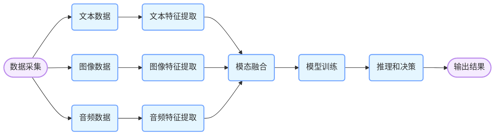

# 企业AI Agent的多模态学习在用户体验优化中的创新应用

> 关键词：企业AI Agent、多模态学习、用户体验优化、创新应用、多模态融合

> 摘要：本文聚焦于企业AI Agent的多模态学习在用户体验优化方面的创新应用。首先介绍了相关背景，包括目的范围、预期读者等内容。接着阐述了核心概念，分析了多模态学习与企业AI Agent的联系，并给出了原理和架构的示意图与流程图。详细讲解了核心算法原理，结合Python代码说明具体操作步骤。探讨了相关数学模型和公式，通过实例加深理解。进行项目实战，包括开发环境搭建、源代码实现与解读。列举了实际应用场景，推荐了学习资源、开发工具框架以及相关论文著作。最后总结未来发展趋势与挑战，提供常见问题解答和扩展阅读参考资料，旨在为企业在利用AI Agent多模态学习提升用户体验方面提供全面的技术指导和思路。

## 1. 背景介绍 
### 1.1 目的和范围
在当今数字化时代，企业面临着越来越激烈的市场竞争，如何提升用户体验成为企业成功的关键因素之一。企业AI Agent作为一种能够模拟人类智能与用户进行交互的工具，其能力的提升对于优化用户体验至关重要。多模态学习允许AI Agent同时处理多种不同类型的数据，如文本、图像、音频等，从而更全面、准确地理解用户的需求和意图。

本文的目的在于深入探讨企业AI Agent的多模态学习在用户体验优化中的创新应用。范围涵盖了多模态学习的核心概念、算法原理、数学模型，以及如何将其应用于实际项目中以提升用户体验。同时，还将介绍相关的工具和资源，为企业和开发者提供全面的技术指导。

### 1.2 预期读者
本文的预期读者包括企业的技术决策者、AI开发者、产品经理以及对AI技术在用户体验优化方面感兴趣的研究人员。对于企业技术决策者，本文可以帮助他们了解多模态学习在提升企业竞争力方面的潜在价值；对于AI开发者，提供了详细的算法原理和代码实现，有助于他们在实际项目中应用多模态学习技术；对于产品经理，能够从中获得创新应用的思路，以设计出更符合用户需求的产品；对于研究人员，则可以作为进一步深入研究的参考资料。

### 1.3 文档结构概述
本文将按照以下结构进行阐述：
1. 背景介绍：包括目的和范围、预期读者、文档结构概述以及术语表。
2. 核心概念与联系：介绍企业AI Agent、多模态学习的核心概念，以及它们之间的联系，并给出原理和架构的示意图与流程图。
3. 核心算法原理 & 具体操作步骤：详细讲解多模态学习的核心算法原理，结合Python代码说明具体操作步骤。
4. 数学模型和公式 & 详细讲解 & 举例说明：介绍相关的数学模型和公式，并通过实例进行详细讲解。
5. 项目实战：代码实际案例和详细解释说明，包括开发环境搭建、源代码实现与解读。
6. 实际应用场景：列举企业AI Agent的多模态学习在用户体验优化中的实际应用场景。
7. 工具和资源推荐：推荐学习资源、开发工具框架以及相关论文著作。
8. 总结：未来发展趋势与挑战：总结多模态学习在用户体验优化中的未来发展趋势和面临的挑战。
9. 附录：常见问题与解答：提供常见问题的解答。
10. 扩展阅读 & 参考资料：列出扩展阅读的内容和参考资料。

### 1.4 术语表
#### 1.4.1 核心术语定义
- **企业AI Agent**：一种基于人工智能技术的软件实体，能够在企业环境中模拟人类智能，与用户进行交互，执行各种任务，如回答问题、提供建议、处理业务流程等。
- **多模态学习**：指的是同时处理多种不同类型的数据模态，如文本、图像、音频、视频等，以获取更全面、准确的信息和知识。
- **用户体验优化**：通过改进产品或服务的各个方面，如易用性、功能性、交互性等，以提高用户在使用过程中的满意度和忠诚度。

#### 1.4.2 相关概念解释
- **模态融合**：将不同模态的数据进行整合和处理，以获取更丰富的信息和更准确的理解。模态融合可以在不同的层次上进行，如特征层、决策层等。
- **多模态交互**：用户与系统之间通过多种模态进行交互，如语音、手势、文本等。多模态交互可以提供更加自然、便捷的用户体验。

#### 1.4.3 缩略词列表
- **AI**：Artificial Intelligence，人工智能
- **ML**：Machine Learning，机器学习
- **DL**：Deep Learning，深度学习
- **NLP**：Natural Language Processing，自然语言处理
- **CV**：Computer Vision，计算机视觉

## 2. 核心概念与联系 
### 核心概念原理
#### 企业AI Agent
企业AI Agent是一种智能化的软件系统，它可以在企业的业务流程中扮演重要角色。其核心原理是基于人工智能技术，包括机器学习、自然语言处理等，通过对大量数据的学习和分析，模拟人类的智能行为。企业AI Agent可以与用户进行交互，理解用户的需求，提供相应的服务和解决方案。例如，在客户服务场景中，AI Agent可以自动回答客户的常见问题，处理客户的投诉和建议，提高客户服务的效率和质量。

#### 多模态学习
多模态学习的核心原理是利用不同模态的数据之间的互补性，以获取更全面、准确的信息和知识。不同模态的数据具有不同的特点和优势，例如文本数据可以提供详细的语义信息，图像数据可以直观地展示物体的外观和特征，音频数据可以传达语音的情感和语调等。通过将这些不同模态的数据进行融合和处理，多模态学习可以克服单一模态数据的局限性，提高模型的性能和泛化能力。

### 架构的文本示意图
企业AI Agent的多模态学习架构主要包括以下几个部分：
1. **数据采集层**：负责采集多种不同模态的数据，如文本、图像、音频等。这些数据可以来自不同的数据源，如用户输入、传感器、数据库等。
2. **特征提取层**：对采集到的不同模态的数据进行特征提取，将其转换为计算机能够处理的特征向量。不同模态的数据需要使用不同的特征提取方法，例如文本数据可以使用词嵌入、TF-IDF等方法，图像数据可以使用卷积神经网络（CNN）进行特征提取，音频数据可以使用梅尔频率倒谱系数（MFCC）等方法。
3. **模态融合层**：将不同模态的特征向量进行融合，以获取更丰富的信息和更准确的理解。模态融合可以在不同的层次上进行，如特征层、决策层等。常见的模态融合方法包括早期融合、晚期融合、混合融合等。
4. **模型训练层**：使用融合后的特征向量对模型进行训练，以学习不同模态数据之间的关联和规律。可以使用各种机器学习和深度学习模型，如神经网络、支持向量机等。
5. **推理和决策层**：根据训练好的模型对新的输入数据进行推理和决策，为用户提供相应的服务和解决方案。

### Mermaid流程图


## 3. 核心算法原理 & 具体操作步骤 
### 核心算法原理
多模态学习的核心算法之一是基于深度学习的模态融合算法。这里以早期融合为例进行说明。早期融合是指在特征提取之后，直接将不同模态的特征向量进行拼接，然后输入到一个统一的神经网络中进行训练。

假设我们有两种模态的数据：文本数据和图像数据。文本数据经过特征提取后得到特征向量 $\mathbf{x}_t$，图像数据经过特征提取后得到特征向量 $\mathbf{x}_i$。早期融合的过程可以表示为：

$\mathbf{x} = [\mathbf{x}_t; \mathbf{x}_i]$

其中，$[\cdot; \cdot]$ 表示向量拼接操作。然后，将融合后的特征向量 $\mathbf{x}$ 输入到一个多层感知机（MLP）中进行训练：

$\mathbf{h}_1 = \sigma(\mathbf{W}_1\mathbf{x} + \mathbf{b}_1)$

$\mathbf{h}_2 = \sigma(\mathbf{W}_2\mathbf{h}_1 + \mathbf{b}_2)$

$\cdots$

$\mathbf{y} = \text{softmax}(\mathbf{W}_n\mathbf{h}_{n-1} + \mathbf{b}_n)$

其中，$\mathbf{W}_i$ 和 $\mathbf{b}_i$ 分别是第 $i$ 层的权重矩阵和偏置向量，$\sigma(\cdot)$ 是激活函数，如ReLU函数，$\text{softmax}(\cdot)$ 是用于分类的激活函数。

### 具体操作步骤（Python代码实现）
以下是一个使用Python和PyTorch实现早期融合的简单示例：

```python
import torch
import torch.nn as nn

# 定义文本特征提取器
class TextFeatureExtractor(nn.Module):
    def __init__(self, input_dim, output_dim):
        super(TextFeatureExtractor, self).__init__()
        self.fc = nn.Linear(input_dim, output_dim)

    def forward(self, x):
        return self.fc(x)

# 定义图像特征提取器
class ImageFeatureExtractor(nn.Module):
    def __init__(self, input_dim, output_dim):
        super(ImageFeatureExtractor, self).__init__()
        self.fc = nn.Linear(input_dim, output_dim)

    def forward(self, x):
        return self.fc(x)

# 定义多模态融合模型
class MultiModalModel(nn.Module):
    def __init__(self, text_input_dim, image_input_dim, hidden_dim, output_dim):
        super(MultiModalModel, self).__init__()
        self.text_extractor = TextFeatureExtractor(text_input_dim, hidden_dim)
        self.image_extractor = ImageFeatureExtractor(image_input_dim, hidden_dim)
        self.fc = nn.Linear(2 * hidden_dim, output_dim)

    def forward(self, text_x, image_x):
        text_features = self.text_extractor(text_x)
        image_features = self.image_extractor(image_x)
        # 早期融合：拼接特征向量
        fused_features = torch.cat((text_features, image_features), dim=1)
        output = self.fc(fused_features)
        return output

# 初始化模型
text_input_dim = 100
image_input_dim = 200
hidden_dim = 50
output_dim = 10
model = MultiModalModel(text_input_dim, image_input_dim, hidden_dim, output_dim)

# 生成随机输入数据
text_input = torch.randn(32, text_input_dim)
image_input = torch.randn(32, image_input_dim)

# 前向传播
output = model(text_input, image_input)
print(output.shape)
```

在上述代码中，我们首先定义了文本特征提取器和图像特征提取器，然后定义了一个多模态融合模型。在模型的前向传播过程中，我们分别对文本数据和图像数据进行特征提取，然后将提取的特征向量进行拼接，最后输入到一个全连接层中得到输出。

## 4. 数学模型和公式 & 详细讲解 & 举例说明 
### 数学模型和公式
#### 特征提取
对于文本数据，常用的特征提取方法是词嵌入。假设我们有一个文本序列 $\mathbf{w} = [w_1, w_2, \cdots, w_T]$，其中 $w_i$ 是第 $i$ 个词。我们可以使用预训练的词嵌入模型（如Word2Vec、GloVe等）将每个词映射到一个低维向量空间中，得到词向量 $\mathbf{v}_i$。然后，我们可以对这些词向量进行平均池化或最大池化操作，得到文本的特征向量 $\mathbf{x}_t$：

$\mathbf{x}_t = \frac{1}{T} \sum_{i=1}^{T} \mathbf{v}_i$ （平均池化）

或者

$\mathbf{x}_t = \max_{i=1}^{T} \mathbf{v}_i$ （最大池化）

对于图像数据，常用的特征提取方法是卷积神经网络（CNN）。假设我们有一个图像 $\mathbf{I}$，经过一系列卷积层、池化层和全连接层后，得到图像的特征向量 $\mathbf{x}_i$。

#### 模态融合
如前面所述，早期融合的数学公式为：

$\mathbf{x} = [\mathbf{x}_t; \mathbf{x}_i]$

#### 模型训练
在模型训练过程中，我们通常使用交叉熵损失函数来衡量模型的预测结果与真实标签之间的差异。假设我们有 $N$ 个样本，每个样本的输入为 $(\mathbf{x}_t^{(n)}, \mathbf{x}_i^{(n)})$，真实标签为 $\mathbf{y}^{(n)}$，模型的预测结果为 $\hat{\mathbf{y}}^{(n)}$。交叉熵损失函数的定义为：

$L = -\frac{1}{N} \sum_{n=1}^{N} \sum_{k=1}^{K} y_k^{(n)} \log(\hat{y}_k^{(n)})$

其中，$K$ 是类别数，$y_k^{(n)}$ 是第 $n$ 个样本的第 $k$ 个类别的真实标签，$\hat{y}_k^{(n)}$ 是第 $n$ 个样本的第 $k$ 个类别的预测概率。

### 详细讲解
特征提取是多模态学习的基础，它将不同模态的数据转换为计算机能够处理的特征向量。对于文本数据，词嵌入可以将离散的词转换为连续的向量，使得模型能够更好地理解文本的语义信息。平均池化和最大池化操作可以将文本序列的多个词向量合并为一个特征向量，减少数据的维度。

模态融合是多模态学习的核心，它将不同模态的特征向量进行整合，以获取更丰富的信息。早期融合是一种简单而有效的模态融合方法，它直接将不同模态的特征向量进行拼接，然后输入到一个统一的模型中进行训练。

模型训练是通过最小化损失函数来调整模型的参数，使得模型能够更好地拟合训练数据。交叉熵损失函数是一种常用的损失函数，它适用于分类问题。在训练过程中，我们使用反向传播算法来计算损失函数对模型参数的梯度，然后使用优化算法（如随机梯度下降、Adam等）来更新模型的参数。

### 举例说明
假设我们有一个图像分类任务，同时考虑图像的文本描述信息。我们有一组图像和对应的文本描述，每个图像有一个类别标签。我们可以使用以下步骤进行多模态学习：
1. 特征提取：使用预训练的CNN模型（如ResNet）对图像进行特征提取，得到图像的特征向量 $\mathbf{x}_i$；使用预训练的词嵌入模型（如GloVe）对文本描述进行特征提取，得到文本的特征向量 $\mathbf{x}_t$。
2. 模态融合：将图像特征向量 $\mathbf{x}_i$ 和文本特征向量 $\mathbf{x}_t$ 进行拼接，得到融合后的特征向量 $\mathbf{x}$。
3. 模型训练：使用融合后的特征向量 $\mathbf{x}$ 和对应的类别标签，训练一个全连接神经网络。在训练过程中，使用交叉熵损失函数来衡量模型的预测结果与真实标签之间的差异，使用Adam优化算法来更新模型的参数。
4. 推理和决策：对于新的图像和文本描述，重复步骤1和步骤2，得到融合后的特征向量，然后输入到训练好的模型中进行推理，得到预测的类别标签。

## 5. 项目实战：代码实际案例和详细解释说明 
### 5.1  开发环境搭建
#### 操作系统
可以选择Windows、Linux或macOS操作系统。这里以Ubuntu 20.04为例进行说明。

#### Python环境
安装Python 3.7或以上版本。可以使用以下命令进行安装：
```bash
sudo apt update
sudo apt install python3 python3-pip
```

#### 深度学习框架
使用PyTorch作为深度学习框架。可以使用以下命令进行安装：
```bash
pip install torch torchvision
```

#### 其他依赖库
安装其他必要的依赖库，如NumPy、Pandas等：
```bash
pip install numpy pandas
```

### 5.2  源代码详细实现和代码解读
以下是一个完整的多模态学习项目实战代码示例，用于图像和文本的情感分类任务：

```python
import torch
import torch.nn as nn
import torch.optim as optim
from torch.utils.data import Dataset, DataLoader
import numpy as np
import pandas as pd

# 定义数据集类
class MultiModalDataset(Dataset):
    def __init__(self, text_data, image_data, labels):
        self.text_data = text_data
        self.image_data = image_data
        self.labels = labels

    def __len__(self):
        return len(self.labels)

    def __getitem__(self, idx):
        text = torch.tensor(self.text_data[idx], dtype=torch.float32)
        image = torch.tensor(self.image_data[idx], dtype=torch.float32)
        label = torch.tensor(self.labels[idx], dtype=torch.long)
        return text, image, label

# 定义文本特征提取器
class TextFeatureExtractor(nn.Module):
    def __init__(self, input_dim, output_dim):
        super(TextFeatureExtractor, self).__init__()
        self.fc = nn.Linear(input_dim, output_dim)

    def forward(self, x):
        return self.fc(x)

# 定义图像特征提取器
class ImageFeatureExtractor(nn.Module):
    def __init__(self, input_dim, output_dim):
        super(ImageFeatureExtractor, self).__init__()
        self.fc = nn.Linear(input_dim, output_dim)

    def forward(self, x):
        return self.fc(x)

# 定义多模态融合模型
class MultiModalModel(nn.Module):
    def __init__(self, text_input_dim, image_input_dim, hidden_dim, output_dim):
        super(MultiModalModel, self).__init__()
        self.text_extractor = TextFeatureExtractor(text_input_dim, hidden_dim)
        self.image_extractor = ImageFeatureExtractor(image_input_dim, hidden_dim)
        self.fc = nn.Linear(2 * hidden_dim, output_dim)

    def forward(self, text_x, image_x):
        text_features = self.text_extractor(text_x)
        image_features = self.image_extractor(image_x)
        # 早期融合：拼接特征向量
        fused_features = torch.cat((text_features, image_features), dim=1)
        output = self.fc(fused_features)
        return output

# 生成模拟数据
text_data = np.random.randn(100, 100)
image_data = np.random.randn(100, 200)
labels = np.random.randint(0, 10, 100)

# 创建数据集和数据加载器
dataset = MultiModalDataset(text_data, image_data, labels)
dataloader = DataLoader(dataset, batch_size=32, shuffle=True)

# 初始化模型、损失函数和优化器
text_input_dim = 100
image_input_dim = 200
hidden_dim = 50
output_dim = 10
model = MultiModalModel(text_input_dim, image_input_dim, hidden_dim, output_dim)
criterion = nn.CrossEntropyLoss()
optimizer = optim.Adam(model.parameters(), lr=0.001)

# 训练模型
num_epochs = 10
for epoch in range(num_epochs):
    running_loss = 0.0
    for text, image, label in dataloader:
        optimizer.zero_grad()
        output = model(text, image)
        loss = criterion(output, label)
        loss.backward()
        optimizer.step()
        running_loss += loss.item()
    print(f'Epoch {epoch + 1}, Loss: {running_loss / len(dataloader)}')
```

### 5.3  代码解读与分析
#### 数据集类 `MultiModalDataset`
该类继承自 `torch.utils.data.Dataset`，用于封装多模态数据。在 `__init__` 方法中，我们传入文本数据、图像数据和标签。在 `__getitem__` 方法中，我们根据索引返回对应的文本、图像和标签。

#### 特征提取器
`TextFeatureExtractor` 和 `ImageFeatureExtractor` 分别用于提取文本和图像的特征。它们都是简单的全连接层，将输入特征映射到指定的输出维度。

#### 多模态融合模型 `MultiModalModel`
该模型包含文本特征提取器、图像特征提取器和一个全连接层。在 `forward` 方法中，我们分别对文本和图像进行特征提取，然后将提取的特征向量进行拼接，最后输入到全连接层中得到输出。

#### 数据加载和训练
我们使用 `DataLoader` 来批量加载数据。在训练过程中，我们使用交叉熵损失函数来衡量模型的预测结果与真实标签之间的差异，使用Adam优化算法来更新模型的参数。

## 6. 实际应用场景 
### 客户服务
在客户服务场景中，企业AI Agent可以通过多模态学习来更好地理解客户的需求和意图。客户可以通过语音、文本、图像等多种方式与AI Agent进行交互。例如，客户可以通过语音描述问题，同时上传相关的图片或文档。AI Agent可以同时处理这些多模态信息，提供更准确、详细的解决方案。这样可以提高客户服务的效率和质量，提升客户的满意度。

### 智能营销
在智能营销场景中，企业AI Agent可以通过多模态学习来分析用户的行为和偏好。AI Agent可以收集用户的浏览历史、购买记录、社交媒体数据等多模态信息，通过分析这些信息来了解用户的兴趣和需求。然后，AI Agent可以根据用户的特点和需求，提供个性化的营销推荐，如商品推荐、广告投放等。这样可以提高营销的精准度和效果，增加企业的销售额。

### 智能教育
在智能教育场景中，企业AI Agent可以通过多模态学习来提供个性化的学习服务。学生可以通过语音、文本、视频等多种方式与AI Agent进行交互。AI Agent可以根据学生的学习进度、学习习惯、学习能力等多模态信息，为学生提供个性化的学习计划和学习资源。例如，AI Agent可以根据学生的语音回答来评估学生的学习情况，提供针对性的辅导和建议。这样可以提高学生的学习效果和学习兴趣。

### 智能家居
在智能家居场景中，企业AI Agent可以通过多模态学习来实现更自然、便捷的家居控制。用户可以通过语音、手势、表情等多种方式与AI Agent进行交互。AI Agent可以同时处理这些多模态信息，理解用户的意图，控制智能家居设备。例如，用户可以通过语音命令打开灯光，同时通过手势调整灯光的亮度。这样可以提高家居控制的便捷性和智能化程度。

## 7. 工具和资源推荐
### 7.1 学习资源推荐
#### 7.1.1 书籍推荐
- 《深度学习》（Deep Learning）：由Ian Goodfellow、Yoshua Bengio和Aaron Courville撰写，是深度学习领域的经典教材，涵盖了深度学习的基本原理、算法和应用。
- 《Python深度学习》（Deep Learning with Python）：由Francois Chollet撰写，介绍了如何使用Python和Keras库进行深度学习开发，适合初学者入门。
- 《多模态机器学习：基础与应用》（Multimodal Machine Learning: Foundations and Applications）：全面介绍了多模态机器学习的基本概念、算法和应用，是多模态学习领域的重要参考书籍。

#### 7.1.2 在线课程
- Coursera上的“深度学习专项课程”（Deep Learning Specialization）：由Andrew Ng教授讲授，包括深度学习的基础、卷积神经网络、循环神经网络等内容。
- edX上的“人工智能导论”（Introduction to Artificial Intelligence）：介绍了人工智能的基本概念、算法和应用，适合初学者入门。
- Udemy上的“多模态深度学习实战”（Multimodal Deep Learning in Practice）：通过实际项目介绍了多模态深度学习的应用，适合有一定基础的学习者。

#### 7.1.3 技术博客和网站
- Medium：是一个技术博客平台，上面有很多关于人工智能、深度学习、多模态学习的文章和教程。
- arXiv：是一个预印本平台，上面有很多最新的学术研究论文，包括多模态学习领域的研究成果。
- Towards Data Science：是一个专注于数据科学和人工智能的博客网站，上面有很多实用的技术文章和案例分析。

### 7.2 开发工具框架推荐
#### 7.2.1 IDE和编辑器
- PyCharm：是一款专业的Python集成开发环境，提供了丰富的代码编辑、调试、测试等功能，适合Python开发。
- Jupyter Notebook：是一个交互式的开发环境，支持Python、R等多种编程语言，适合数据探索和模型开发。
- Visual Studio Code：是一款轻量级的代码编辑器，支持多种编程语言和插件扩展，适合快速开发和调试。

#### 7.2.2 调试和性能分析工具
- TensorBoard：是TensorFlow提供的一个可视化工具，可以用于可视化模型的训练过程、损失函数、准确率等指标，帮助开发者调试和优化模型。
- PyTorch Profiler：是PyTorch提供的一个性能分析工具，可以用于分析模型的性能瓶颈，如计算时间、内存使用等，帮助开发者优化模型的性能。
- NVIDIA Nsight Systems：是NVIDIA提供的一个性能分析工具，可以用于分析GPU的性能，帮助开发者优化GPU加速的模型。

#### 7.2.3 相关框架和库
- PyTorch：是一个开源的深度学习框架，提供了丰富的深度学习模型和工具，支持GPU加速，适合多模态学习的开发。
- TensorFlow：是另一个开源的深度学习框架，提供了强大的分布式训练和部署功能，也适合多模态学习的开发。
- Hugging Face Transformers：是一个开源的自然语言处理库，提供了多种预训练的语言模型，如BERT、GPT等，方便开发者进行文本处理和多模态学习。

### 7.3 相关论文著作推荐
#### 7.3.1 经典论文
- “Multimodal Deep Learning”：这篇论文介绍了多模态深度学习的基本概念和方法，是多模态学习领域的经典论文。
- “Show, Attend and Tell: Neural Image Caption Generation with Visual Attention”：提出了一种基于注意力机制的图像描述生成模型，展示了多模态学习在图像和文本融合方面的应用。
- “Deep Speech 2: End-to-End Speech Recognition in English and Mandarin”：介绍了一种端到端的语音识别模型，展示了多模态学习在语音和文本融合方面的应用。

#### 7.3.2 最新研究成果
- 可以关注arXiv上的最新论文，了解多模态学习领域的最新研究进展。例如，一些研究致力于改进模态融合的方法，提高多模态模型的性能；另一些研究则关注多模态学习在新领域的应用，如医疗、交通等。

#### 7.3.3 应用案例分析
- 可以参考一些企业的技术博客和研究报告，了解多模态学习在实际应用中的案例分析。例如，谷歌、微软等公司在多模态学习方面有很多实践经验，他们的技术博客上会分享一些实际应用的案例和经验教训。

## 8. 总结：未来发展趋势与挑战
### 未来发展趋势
#### 更强大的多模态融合方法
未来，研究人员将继续探索更强大的多模态融合方法，以充分发挥不同模态数据之间的互补性。例如，开发更复杂的注意力机制，能够自适应地分配不同模态数据的权重；研究跨模态的特征表示学习方法，使得不同模态的数据能够在统一的特征空间中进行融合。

#### 多模态预训练模型的发展
类似于自然语言处理领域的预训练模型（如BERT、GPT等），多模态预训练模型将成为未来的发展趋势。通过在大规模多模态数据上进行预训练，模型可以学习到更通用的多模态特征和知识，然后在具体的任务上进行微调，提高模型的性能和泛化能力。

#### 多模态交互的普及
随着技术的不断进步，多模态交互将变得更加普及和自然。用户可以通过语音、手势、表情等多种方式与计算机系统进行交互，系统能够准确地理解用户的意图，并提供相应的服务和反馈。例如，智能家居系统可以根据用户的语音指令和手势动作，自动调整家居设备的状态。

#### 多模态学习在更多领域的应用
多模态学习将在更多领域得到应用，如医疗、交通、教育等。在医疗领域，多模态学习可以结合医学图像、病历文本、基因数据等多种信息，进行疾病的诊断和预测；在交通领域，多模态学习可以结合摄像头图像、雷达数据、传感器数据等，实现自动驾驶和智能交通管理。

### 挑战
#### 数据获取和标注
多模态学习需要大量的多模态数据，但是获取和标注这些数据是一个挑战。不同模态的数据来源不同，数据格式也不同，需要进行统一的处理和标注。此外，标注多模态数据需要专业的知识和技能，成本较高。

#### 计算资源和效率
多模态学习通常需要处理大量的数据和复杂的模型，对计算资源的需求较大。训练和推理过程需要消耗大量的计算时间和内存，这对硬件设备和计算平台提出了更高的要求。因此，如何提高多模态学习的计算效率，降低计算成本，是一个亟待解决的问题。

#### 模态间的语义鸿沟
不同模态的数据具有不同的语义表示，存在模态间的语义鸿沟。如何有效地弥合这种语义鸿沟，实现不同模态数据之间的语义对齐和融合，是多模态学习面临的一个挑战。例如，如何将图像中的物体和文本中的描述进行准确的对应，是一个具有挑战性的问题。

#### 模型可解释性
多模态学习模型通常是复杂的深度学习模型，其决策过程往往是不透明的，缺乏可解释性。在一些关键领域，如医疗、金融等，模型的可解释性是非常重要的。因此，如何提高多模态学习模型的可解释性，让用户能够理解模型的决策过程和依据，是一个需要解决的问题。

## 9. 附录：常见问题与解答
### 问题1：多模态学习和单模态学习有什么区别？
多模态学习同时处理多种不同类型的数据模态，如文本、图像、音频等，以获取更全面、准确的信息和知识。而单模态学习只处理单一类型的数据模态。多模态学习可以利用不同模态数据之间的互补性，克服单一模态数据的局限性，提高模型的性能和泛化能力。

### 问题2：多模态融合有哪些方法？
常见的多模态融合方法包括早期融合、晚期融合和混合融合。早期融合是在特征提取之后，直接将不同模态的特征向量进行拼接，然后输入到一个统一的模型中进行训练；晚期融合是分别对不同模态的数据进行建模和预测，然后将各个模型的预测结果进行融合；混合融合是结合了早期融合和晚期融合的优点，在不同的层次上进行模态融合。

### 问题3：如何选择合适的特征提取方法？
选择合适的特征提取方法需要考虑数据的类型和特点。对于文本数据，可以使用词嵌入、TF-IDF等方法；对于图像数据，可以使用卷积神经网络（CNN）进行特征提取；对于音频数据，可以使用梅尔频率倒谱系数（MFCC）等方法。此外，还可以使用预训练的模型进行特征提取，如预训练的CNN模型、预训练的语言模型等。

### 问题4：多模态学习模型的训练需要注意什么？
在训练多模态学习模型时，需要注意以下几点：
1. 数据的质量和平衡性：确保训练数据的质量和平衡性，避免数据偏差对模型性能的影响。
2. 学习率的选择：选择合适的学习率，避免学习率过大导致模型无法收敛，或者学习率过小导致训练速度过慢。
3. 模型的复杂度：根据数据的规模和复杂度，选择合适的模型复杂度，避免过拟合或欠拟合。
4. 模态间的权重分配：在模态融合过程中，需要合理分配不同模态数据的权重，以充分发挥不同模态数据的优势。

## 10. 扩展阅读 & 参考资料
### 扩展阅读
- 《人工智能：现代方法》（Artificial Intelligence: A Modern Approach）：全面介绍了人工智能的基本概念、算法和应用，是人工智能领域的经典教材。
- 《自然语言处理入门》（Natural Language Processing with Python）：介绍了如何使用Python进行自然语言处理，包括文本处理、词法分析、句法分析等内容。
- 《计算机视觉：算法与应用》（Computer Vision: Algorithms and Applications）：介绍了计算机视觉的基本概念、算法和应用，包括图像特征提取、目标检测、图像分割等内容。

### 参考资料
- Goodfellow, I., Bengio, Y., & Courville, A. (2016). Deep Learning. MIT Press.
- Chollet, F. (2018). Deep Learning with Python. Manning Publications.
- Baltrušaitis, T., Ahuja, C., & Morency, L.-P. (2018). Multimodal Machine Learning: A Survey and Taxonomy. IEEE Transactions on Pattern Analysis and Machine Intelligence, 41(2), 423-443.

作者：AI天才研究院/AI Genius Institute & 禅与计算机程序设计艺术 /Zen And The Art of Computer Programming