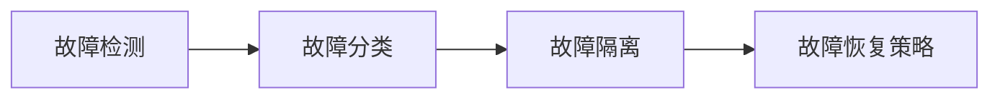

# 企业AI Agent的故障恢复机制

> 关键词：企业AI Agent、故障恢复机制、容错策略、自动化恢复、系统稳定性

> 摘要：本文聚焦于企业AI Agent的故障恢复机制，深入探讨其核心概念、算法原理、数学模型，并结合实际案例进行详细分析。通过对故障恢复机制的全面研究，旨在帮助企业提高AI Agent系统的稳定性和可靠性，降低因故障带来的损失。同时，文章还介绍了相关的工具和资源，以及未来的发展趋势与挑战，为企业在AI Agent故障恢复方面提供了全面的指导。

## 1. 背景介绍 
### 1.1 目的和范围
在当今数字化转型的浪潮中，企业越来越依赖AI Agent来处理复杂的业务任务和决策。然而，由于各种原因，如硬件故障、软件漏洞、网络中断等，AI Agent可能会出现故障，导致业务流程中断、数据丢失等问题。因此，建立有效的故障恢复机制对于企业AI Agent的稳定运行至关重要。

本文的目的是深入研究企业AI Agent的故障恢复机制，包括其原理、算法、实现方法和应用场景。通过对故障恢复机制的全面分析，为企业提供一套可行的解决方案，帮助企业提高AI Agent系统的容错能力和恢复能力。

本文的范围涵盖了企业AI Agent故障恢复的各个方面，包括故障检测、故障分类、故障隔离、故障恢复策略等。同时，本文还将结合实际案例，介绍故障恢复机制在企业中的应用和实践经验。

### 1.2 预期读者
本文的预期读者包括企业的技术管理人员、AI工程师、系统架构师、运维人员等。这些读者对企业AI Agent的故障恢复机制感兴趣，希望了解如何提高AI Agent系统的稳定性和可靠性。

### 1.3 文档结构概述
本文的结构如下：
- 核心概念与联系：介绍企业AI Agent故障恢复机制的核心概念和相关联系，包括故障检测、故障分类、故障隔离、故障恢复策略等。
- 核心算法原理 & 具体操作步骤：详细阐述故障恢复机制的核心算法原理，并给出具体的操作步骤。
- 数学模型和公式 & 详细讲解 & 举例说明：建立故障恢复机制的数学模型，给出相关公式，并通过具体例子进行详细讲解。
- 项目实战：代码实际案例和详细解释说明：通过实际案例，介绍故障恢复机制的代码实现和详细解释。
- 实际应用场景：介绍故障恢复机制在企业中的实际应用场景。
- 工具和资源推荐：推荐相关的工具和资源，帮助读者更好地学习和实践故障恢复机制。
- 总结：未来发展趋势与挑战：总结故障恢复机制的未来发展趋势和面临的挑战。
- 附录：常见问题与解答：解答读者在学习和实践故障恢复机制过程中遇到的常见问题。
- 扩展阅读 & 参考资料：提供相关的扩展阅读和参考资料，帮助读者深入了解故障恢复机制。

### 1.4 术语表
#### 1.4.1 核心术语定义
- **企业AI Agent**：指在企业环境中运行的人工智能代理，能够自主执行任务、做出决策，并与其他系统进行交互。
- **故障恢复机制**：指在AI Agent出现故障时，能够自动检测、分类、隔离故障，并采取相应的恢复策略，使系统恢复正常运行的机制。
- **故障检测**：指通过监测AI Agent的运行状态，及时发现故障的过程。
- **故障分类**：指根据故障的性质、严重程度等因素，将故障分为不同类型的过程。
- **故障隔离**：指将故障部分与正常部分隔离开来，防止故障扩散的过程。
- **故障恢复策略**：指针对不同类型的故障，采取的相应恢复措施。

#### 1.4.2 相关概念解释
- **容错能力**：指系统在出现故障时，能够继续正常运行或在一定时间内恢复正常运行的能力。
- **恢复时间目标（RTO）**：指系统从出现故障到恢复正常运行所需的最长时间。
- **恢复点目标（RPO）**：指系统在出现故障时，允许丢失的数据量。

#### 1.4.3 缩略词列表
- **AI**：Artificial Intelligence，人工智能
- **RTO**：Recovery Time Objective，恢复时间目标
- **RPO**：Recovery Point Objective，恢复点目标

## 2. 核心概念与联系 

### 2.1 故障恢复机制的核心概念
企业AI Agent的故障恢复机制主要包括以下几个核心概念：

#### 2.1.1 故障检测
故障检测是故障恢复机制的第一步，其目的是及时发现AI Agent的故障。故障检测可以通过监测AI Agent的运行状态、性能指标、日志信息等方式来实现。常见的故障检测方法包括阈值检测、规则检测、机器学习检测等。

#### 2.1.2 故障分类
故障分类是将检测到的故障按照一定的标准进行分类，以便采取不同的恢复策略。常见的故障分类方法包括按照故障的性质（如硬件故障、软件故障、网络故障等）、严重程度（如轻微故障、中度故障、严重故障等）进行分类。

#### 2.1.3 故障隔离
故障隔离是将故障部分与正常部分隔离开来，防止故障扩散的过程。故障隔离可以通过物理隔离、逻辑隔离等方式来实现。例如，在分布式系统中，可以通过将故障节点从集群中移除，来实现故障隔离。

#### 2.1.4 故障恢复策略
故障恢复策略是针对不同类型的故障，采取的相应恢复措施。常见的故障恢复策略包括重启、回滚、替换、修复等。例如，对于轻微故障，可以通过重启AI Agent来恢复正常运行；对于严重故障，可能需要进行数据回滚或替换故障组件。

### 2.2 核心概念之间的联系
故障恢复机制的各个核心概念之间相互关联、相互影响，形成一个有机的整体。具体来说，故障检测是故障恢复的前提，只有及时发现故障，才能采取相应的恢复措施；故障分类是故障恢复的基础，不同类型的故障需要采取不同的恢复策略；故障隔离是故障恢复的保障，通过隔离故障，可以防止故障扩散，减少损失；故障恢复策略是故障恢复的核心，根据故障的类型和严重程度，选择合适的恢复策略，是实现故障恢复的关键。

### 2.3 文本示意图
下面是企业AI Agent故障恢复机制的文本示意图：

```plaintext
故障检测 -> 故障分类 -> 故障隔离 -> 故障恢复策略
```

### 2.4 Mermaid流程图


## 3. 核心算法原理 & 具体操作步骤 

### 3.1 故障检测算法原理及Python实现
#### 3.1.1 阈值检测算法
阈值检测算法是一种简单而常用的故障检测方法，其原理是通过设定一个阈值，当监测指标超过该阈值时，判定为故障。

以下是一个使用Python实现的阈值检测算法示例：

```python
def threshold_detection(monitoring_value, threshold):
    if monitoring_value > threshold:
        return True  # 检测到故障
    else:
        return False  # 未检测到故障

# 示例使用
monitoring_value = 100
threshold = 80
result = threshold_detection(monitoring_value, threshold)
print(f"故障检测结果: {result}")
```

#### 3.1.2 规则检测算法
规则检测算法是根据预设的规则来判断是否发生故障。例如，当多个监测指标同时满足某些条件时，判定为故障。

以下是一个使用Python实现的规则检测算法示例：

```python
def rule_detection(monitoring_values, rules):
    for rule in rules:
        condition_met = True
        for key, value in rule.items():
            if monitoring_values[key]!= value:
                condition_met = False
                break
        if condition_met:
            return True  # 检测到故障
    return False  # 未检测到故障

# 示例使用
monitoring_values = {'cpu_usage': 90, 'memory_usage': 80}
rules = [{'cpu_usage': 90, 'memory_usage': 80}]
result = rule_detection(monitoring_values, rules)
print(f"故障检测结果: {result}")
```

### 3.2 故障分类算法原理及Python实现
#### 3.2.1 基于规则的故障分类算法
基于规则的故障分类算法是根据预设的规则将故障分为不同类型。

以下是一个使用Python实现的基于规则的故障分类算法示例：

```python
def rule_based_fault_classification(fault_info, rules):
    for fault_type, rule in rules.items():
        if all(fault_info.get(key) == value for key, value in rule.items()):
            return fault_type
    return 'Unknown'

# 示例使用
fault_info = {'error_code': 1001, 'message': 'Memory error'}
rules = {
    'Hardware fault': {'error_code': 1001},
    'Software fault': {'error_code': 1002}
}
fault_type = rule_based_fault_classification(fault_info, rules)
print(f"故障类型: {fault_type}")
```

### 3.3 故障恢复策略选择算法原理及Python实现
#### 3.3.1 基于故障类型的恢复策略选择算法
基于故障类型的恢复策略选择算法是根据故障的类型选择相应的恢复策略。

以下是一个使用Python实现的基于故障类型的恢复策略选择算法示例：

```python
def recovery_strategy_selection(fault_type, strategies):
    return strategies.get(fault_type, 'No suitable strategy')

# 示例使用
fault_type = 'Hardware fault'
strategies = {
    'Hardware fault': 'Replace hardware',
    'Software fault': 'Restart software'
}
strategy = recovery_strategy_selection(fault_type, strategies)
print(f"恢复策略: {strategy}")
```

### 3.4 具体操作步骤
#### 3.4.1 故障检测步骤
1. 确定需要监测的指标，如CPU使用率、内存使用率、网络带宽等。
2. 选择合适的故障检测算法，如阈值检测、规则检测等。
3. 定期或实时监测指标，并根据检测算法判断是否发生故障。

#### 3.4.2 故障分类步骤
1. 收集故障信息，如错误代码、错误消息等。
2. 选择合适的故障分类算法，如基于规则的故障分类算法。
3. 根据故障信息和分类算法，将故障分为不同类型。

#### 3.4.3 故障隔离步骤
1. 根据故障类型和系统架构，确定故障隔离的方式，如物理隔离、逻辑隔离等。
2. 执行故障隔离操作，如将故障节点从集群中移除。

#### 3.4.4 故障恢复步骤
1. 根据故障类型和恢复策略选择算法，选择合适的恢复策略。
2. 执行恢复策略，如重启AI Agent、回滚数据等。

## 4. 数学模型和公式 & 详细讲解 & 举例说明 

### 4.1 故障检测的数学模型
#### 4.1.1 阈值检测的数学模型
设监测指标为 $x$，阈值为 $T$，则阈值检测的数学模型可以表示为：

$$
f(x) = 
\begin{cases}
1, & x > T \\
0, & x \leq T
\end{cases}
$$

其中，$f(x)$ 表示故障检测结果，$1$ 表示检测到故障，$0$ 表示未检测到故障。

#### 4.1.2 举例说明
假设监测的CPU使用率为 $x = 90\%$，阈值 $T = 80\%$，则根据阈值检测的数学模型可得：

$$
f(90) = 
\begin{cases}
1, & 90 > 80 \\
0, & 90 \leq 80
\end{cases} = 1
$$

即检测到故障。

### 4.2 故障分类的数学模型
#### 4.2.1 基于规则的故障分类的数学模型
设故障信息为向量 $\mathbf{x} = (x_1, x_2, \cdots, x_n)$，规则集合为 $R = \{r_1, r_2, \cdots, r_m\}$，其中每个规则 $r_i$ 可以表示为一个条件集合 $\{(x_{i1}, v_{i1}), (x_{i2}, v_{i2}), \cdots, (x_{ik}, v_{ik})\}$，表示当故障信息中的 $x_{i1} = v_{i1}, x_{i2} = v_{i2}, \cdots, x_{ik} = v_{ik}$ 时，故障属于第 $i$ 类。

则基于规则的故障分类的数学模型可以表示为：

$$
C(\mathbf{x}) = 
\begin{cases}
i, & \exists r_i \in R \text{ s.t. } \mathbf{x} \text{ satisfies } r_i \\
\text{Unknown}, & \text{otherwise}
\end{cases}
$$

其中，$C(\mathbf{x})$ 表示故障分类结果。

#### 4.2.2 举例说明
假设故障信息为 $\mathbf{x} = (1001, \text{'Memory error'})$，规则集合为：

$$
R = \{
    r_1 = \{(x_1, 1001)\},
    r_2 = \{(x_1, 1002)\}
\}
$$

则根据基于规则的故障分类的数学模型可得：

$$
C(\mathbf{x}) = 
\begin{cases}
1, & \exists r_1 \in R \text{ s.t. } \mathbf{x} \text{ satisfies } r_1 \\
\text{Unknown}, & \text{otherwise}
\end{cases} = 1
$$

即故障属于第 $1$ 类（硬件故障）。

### 4.3 故障恢复的数学模型
#### 4.3.1 基于故障类型的恢复策略选择的数学模型
设故障类型为 $t$，恢复策略集合为 $S = \{s_1, s_2, \cdots, s_k\}$，映射函数为 $\phi: T \to S$，其中 $T$ 为故障类型集合。

则基于故障类型的恢复策略选择的数学模型可以表示为：

$$
\phi(t) = s_j, \text{ where } t \in T_j \text{ and } T_j \text{ is the set of fault types corresponding to } s_j
$$

#### 4.3.2 举例说明
假设故障类型为 $t = \text{'Hardware fault'}$，恢复策略集合为：

$$
S = \{
    s_1 = \text{'Replace hardware'},
    s_2 = \text{'Restart software'}
\}
$$

映射函数为：

$$
\phi(\text{'Hardware fault'}) = \text{'Replace hardware'}
$$

则根据基于故障类型的恢复策略选择的数学模型可得：

$$
\phi(\text{'Hardware fault'}) = \text{'Replace hardware'}
$$

即选择的恢复策略为“替换硬件”。

## 5. 项目实战：代码实际案例和详细解释说明 

### 5.1  开发环境搭建
#### 5.1.1 操作系统
选择适合开发的操作系统，如Ubuntu 20.04 LTS。

#### 5.1.2 编程语言和环境
使用Python 3.8及以上版本，并安装必要的库，如`numpy`、`pandas`等。可以使用`pip`进行安装：

```bash
pip install numpy pandas
```

#### 5.1.3 开发工具
选择合适的开发工具，如PyCharm或VS Code。

### 5.2  源代码详细实现和代码解读
以下是一个完整的企业AI Agent故障恢复机制的Python代码示例：

```python
import time

# 故障检测模块
def threshold_detection(monitoring_value, threshold):
    if monitoring_value > threshold:
        return True  # 检测到故障
    else:
        return False  # 未检测到故障

# 故障分类模块
def rule_based_fault_classification(fault_info, rules):
    for fault_type, rule in rules.items():
        if all(fault_info.get(key) == value for key, value in rule.items()):
            return fault_type
    return 'Unknown'

# 故障恢复策略选择模块
def recovery_strategy_selection(fault_type, strategies):
    return strategies.get(fault_type, 'No suitable strategy')

# 模拟AI Agent运行
def simulate_ai_agent():
    # 模拟监测指标
    cpu_usage = 70
    memory_usage = 60
    threshold_cpu = 80
    threshold_memory = 70

    # 故障检测
    cpu_fault = threshold_detection(cpu_usage, threshold_cpu)
    memory_fault = threshold_detection(memory_usage, threshold_memory)

    if cpu_fault or memory_fault:
        # 收集故障信息
        fault_info = {}
        if cpu_fault:
            fault_info['cpu_error'] = 'High CPU usage'
        if memory_fault:
            fault_info['memory_error'] = 'High memory usage'

        # 故障分类规则
        rules = {
            'CPU fault': {'cpu_error': 'High CPU usage'},
            'Memory fault': {'memory_error': 'High memory usage'}
        }

        # 故障分类
        fault_type = rule_based_fault_classification(fault_info, rules)

        # 恢复策略
        strategies = {
            'CPU fault': 'Restart AI Agent',
            'Memory fault': 'Clear memory cache'
        }

        # 选择恢复策略
        strategy = recovery_strategy_selection(fault_type, strategies)

        print(f"检测到故障: {fault_type}")
        print(f"选择的恢复策略: {strategy}")

        # 执行恢复策略
        if strategy == 'Restart AI Agent':
            print("正在重启AI Agent...")
            time.sleep(5)  # 模拟重启时间
            print("AI Agent重启完成")
        elif strategy == 'Clear memory cache':
            print("正在清除内存缓存...")
            time.sleep(3)  # 模拟清除缓存时间
            print("内存缓存清除完成")
    else:
        print("未检测到故障，AI Agent正常运行")

if __name__ == "__main__":
    simulate_ai_agent()
```

### 5.3  代码解读与分析
#### 5.3.1 故障检测模块
`threshold_detection`函数实现了阈值检测算法，通过比较监测指标和阈值，判断是否发生故障。

#### 5.3.2 故障分类模块
`rule_based_fault_classification`函数实现了基于规则的故障分类算法，根据预设的规则将故障分为不同类型。

#### 5.3.3 故障恢复策略选择模块
`recovery_strategy_selection`函数实现了基于故障类型的恢复策略选择算法，根据故障类型选择相应的恢复策略。

#### 5.3.4 模拟AI Agent运行模块
`simulate_ai_agent`函数模拟了AI Agent的运行过程，包括故障检测、故障分类、恢复策略选择和执行等步骤。

## 6. 实际应用场景 
### 6.1 金融行业
在金融行业，企业AI Agent常用于风险评估、交易决策等关键业务。一旦AI Agent出现故障，可能会导致重大的经济损失。因此，建立有效的故障恢复机制至关重要。例如，当AI Agent在进行风险评估时出现故障，可以通过故障恢复机制及时重启或切换到备用模型，确保业务的正常运行。

### 6.2 医疗行业
在医疗行业，企业AI Agent可用于疾病诊断、治疗方案推荐等。如果AI Agent发生故障，可能会影响患者的治疗效果。通过故障恢复机制，可以快速检测和恢复故障，保证AI Agent的可靠性。例如，当AI Agent在诊断疾病时出现故障，可以通过回滚数据或使用备用算法来恢复正常诊断。

### 6.3 制造业
在制造业，企业AI Agent可用于生产调度、质量控制等。故障恢复机制可以帮助企业减少生产中断时间，提高生产效率。例如，当AI Agent在生产调度中出现故障，可以通过重启或调整算法来恢复正常调度。

## 7. 工具和资源推荐
### 7.1 学习资源推荐
#### 7.1.1 书籍推荐
- 《人工智能：现代方法》：全面介绍了人工智能的基本概念、算法和应用，是学习人工智能的经典教材。
- 《机器学习》：详细讲解了机器学习的各种算法和模型，对于理解故障检测和分类算法有很大帮助。

#### 7.1.2 在线课程
- Coursera上的“人工智能基础”课程：由知名教授授课，系统地介绍了人工智能的基础知识。
- edX上的“机器学习导论”课程：提供了丰富的案例和实践项目，帮助学习者掌握机器学习的应用。

#### 7.1.3 技术博客和网站
- Medium：有许多关于人工智能和故障恢复的技术文章，可以了解最新的研究成果和实践经验。
- arXiv：提供了大量的学术论文，对于深入研究故障恢复机制有很大帮助。

### 7.2 开发工具框架推荐
#### 7.2.1 IDE和编辑器
- PyCharm：功能强大的Python集成开发环境，提供了代码编辑、调试、版本控制等功能。
- VS Code：轻量级的代码编辑器，支持多种编程语言，具有丰富的插件生态系统。

#### 7.2.2 调试和性能分析工具
- PDB：Python自带的调试工具，可以帮助开发者定位代码中的问题。
- cProfile：Python的性能分析工具，可以分析代码的运行时间和资源消耗。

#### 7.2.3 相关框架和库
- TensorFlow：开源的机器学习框架，提供了丰富的算法和工具，可用于故障检测和分类。
- Scikit-learn：简单易用的机器学习库，包含了各种常用的机器学习算法，可用于快速实现故障恢复机制。

### 7.3 相关论文著作推荐
#### 7.3.1 经典论文
- “Fault Tolerance in Distributed Systems”：介绍了分布式系统中故障容错的基本原理和方法。
- “Machine Learning for Anomaly Detection: A Survey”：对基于机器学习的异常检测方法进行了全面的综述。

#### 7.3.2 最新研究成果
- 关注顶级学术会议（如NeurIPS、ICML等）上发表的关于故障恢复和人工智能的研究论文，了解最新的研究动态。

#### 7.3.3 应用案例分析
- 一些知名企业（如Google、Microsoft等）会发布关于AI Agent故障恢复的应用案例，可以从中学习实际应用中的经验和方法。

## 8. 总结：未来发展趋势与挑战
### 8.1 未来发展趋势
#### 8.1.1 智能化恢复
未来的故障恢复机制将更加智能化，能够自动学习和适应不同的故障场景，选择最优的恢复策略。例如，利用深度学习算法对故障数据进行分析，实现智能的故障分类和恢复策略选择。

#### 8.1.2 分布式恢复
随着企业AI Agent系统的分布式架构越来越复杂，分布式故障恢复将成为未来的发展方向。分布式恢复机制可以在不影响整个系统运行的情况下，快速恢复故障节点。

#### 8.1.3 与区块链结合
区块链技术具有去中心化、不可篡改等特点，可以为故障恢复机制提供更可靠的保障。例如，利用区块链记录故障信息和恢复过程，确保数据的完整性和可追溯性。

### 8.2 挑战
#### 8.2.1 故障复杂性增加
随着AI Agent系统的功能越来越强大，故障的复杂性也在不断增加。例如，复杂的算法和模型可能会导致难以检测和分类的故障。

#### 8.2.2 数据安全和隐私
在故障恢复过程中，需要处理大量的数据，如何保证数据的安全和隐私是一个重要的挑战。例如，在数据回滚和替换过程中，需要防止数据泄露。

#### 8.2.3 跨系统兼容性
企业AI Agent系统通常与多个其他系统进行交互，如何保证故障恢复机制在跨系统环境下的兼容性是一个挑战。例如，在与不同的数据库、网络系统交互时，需要确保故障恢复的一致性。

## 9. 附录：常见问题与解答
### 9.1 如何选择合适的故障检测算法？
选择合适的故障检测算法需要考虑多个因素，如监测指标的特点、故障的类型和频率等。例如，如果监测指标是连续的数值型数据，可以选择阈值检测算法；如果故障的发生与多个指标的组合有关，可以选择规则检测算法。

### 9.2 故障恢复机制的恢复时间目标（RTO）和恢复点目标（RPO）如何确定？
RTO和RPO的确定需要根据企业的业务需求和容忍度来确定。例如，对于一些对业务连续性要求较高的企业，RTO和RPO可能需要设置得较低；对于一些对业务影响较小的企业，RTO和RPO可以设置得相对较高。

### 9.3 如何测试故障恢复机制的有效性？
可以通过模拟故障场景来测试故障恢复机制的有效性。例如，在测试环境中手动触发故障，观察故障恢复机制的响应和恢复效果。同时，还可以使用自动化测试工具来进行大规模的测试。

## 10. 扩展阅读 & 参考资料
### 10.1 扩展阅读
- 《云计算与分布式系统：从并行处理到物联网》：介绍了云计算和分布式系统的相关知识，对于理解企业AI Agent的分布式架构和故障恢复有帮助。
- 《数据挖掘：概念与技术》：详细讲解了数据挖掘的各种算法和应用，可用于故障数据的分析和处理。

### 10.2 参考资料
- IEEE Transactions on Reliability：发表了许多关于系统可靠性和故障恢复的研究论文。
- ACM SIGOPS Operating Systems Review：提供了操作系统领域的最新研究成果和实践经验。

作者：AI天才研究院/AI Genius Institute & 禅与计算机程序设计艺术 /Zen And The Art of Computer Programming