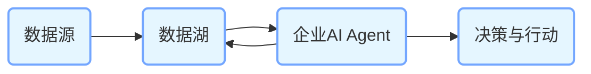

# 企业AI Agent的数据湖架构设计

> 关键词：企业AI Agent、数据湖架构、数据存储、数据处理、数据应用

> 摘要：本文聚焦于企业AI Agent的数据湖架构设计。首先介绍了该架构设计的背景，包括目的、预期读者、文档结构和相关术语。接着阐述了核心概念与联系，以清晰的文本示意图和Mermaid流程图展示架构原理。详细讲解了核心算法原理和具体操作步骤，通过Python源代码进行说明。深入分析了数学模型和公式，并举例说明。通过项目实战，展示了开发环境搭建、源代码实现与解读。探讨了实际应用场景，推荐了相关的工具和资源。最后总结了未来发展趋势与挑战，提供了常见问题解答和扩展阅读参考资料，旨在为企业构建高效的数据湖架构以支持AI Agent提供全面的指导。

## 1. 背景介绍 
### 1.1 目的和范围
在当今数字化时代，企业面临着海量、多源、异构的数据。企业AI Agent作为一种智能化的工具，需要强大的数据支持来实现高效的决策和交互。数据湖架构的设计旨在为企业AI Agent提供一个统一、灵活、可扩展的数据存储和处理平台，使得企业能够充分利用各种数据资源，提升AI Agent的性能和智能水平。

本文的范围涵盖了企业AI Agent数据湖架构的各个方面，包括架构的核心概念、算法原理、数学模型、实际应用、工具资源等，旨在为企业架构师、数据科学家和开发人员提供一个全面的参考。

### 1.2 预期读者
- **企业架构师**：负责企业整体技术架构的规划和设计，需要了解数据湖架构如何与企业现有的IT系统集成，以支持AI Agent的部署。
- **数据科学家**：专注于数据的分析和挖掘，需要熟悉数据湖中的数据存储和处理方式，以便更好地进行数据建模和算法开发。
- **开发人员**：负责AI Agent和相关应用的开发，需要了解数据湖的接口和使用方法，以便在开发过程中能够高效地获取和处理数据。

### 1.3 文档结构概述
本文将按照以下结构进行阐述：
- **核心概念与联系**：介绍企业AI Agent和数据湖架构的核心概念，以及它们之间的联系，并通过示意图和流程图进行展示。
- **核心算法原理 & 具体操作步骤**：讲解数据湖架构中涉及的核心算法，如数据清洗、数据集成等，并给出具体的Python代码实现。
- **数学模型和公式 & 详细讲解 & 举例说明**：分析数据湖架构中的数学模型和公式，如数据相似度计算、数据分布模型等，并通过具体例子进行说明。
- **项目实战：代码实际案例和详细解释说明**：通过一个实际的项目案例，展示如何搭建开发环境、实现源代码，并对代码进行详细解读。
- **实际应用场景**：探讨企业AI Agent数据湖架构在不同行业和业务场景中的应用。
- **工具和资源推荐**：推荐相关的学习资源、开发工具和论文著作。
- **总结：未来发展趋势与挑战**：总结企业AI Agent数据湖架构的未来发展趋势和面临的挑战。
- **附录：常见问题与解答**：解答读者在学习和实践过程中常见的问题。
- **扩展阅读 & 参考资料**：提供相关的扩展阅读材料和参考资料。

### 1.4 术语表
#### 1.4.1 核心术语定义
- **企业AI Agent**：一种基于人工智能技术的智能体，能够在企业环境中自主地完成各种任务，如决策支持、客户服务等。
- **数据湖**：一个集中存储企业所有结构化和非结构化数据的存储库，这些数据可以以原始形式保存，以便后续的分析和处理。
- **数据清洗**：对原始数据进行预处理，去除噪声、重复数据和不一致的数据，以提高数据质量。
- **数据集成**：将来自不同数据源的数据整合到一个统一的数据湖中，以便进行统一的分析和处理。

#### 1.4.2 相关概念解释
- **ETL（Extract, Transform, Load）**：一种数据处理过程，包括从数据源中提取数据、对数据进行转换和清洗，然后将处理后的数据加载到目标数据存储中。
- **OLAP（Online Analytical Processing）**：一种在线分析处理技术，用于对大量数据进行多维分析和查询。
- **机器学习**：一门多领域交叉学科，涉及概率论、统计学、逼近论、凸分析、算法复杂度理论等多门学科。它专门研究计算机怎样模拟或实现人类的学习行为，以获取新的知识或技能，重新组织已有的知识结构使之不断改善自身的性能。

#### 1.4.3 缩略词列表
- **AI**：Artificial Intelligence，人工智能
- **ETL**：Extract, Transform, Load
- **OLAP**：Online Analytical Processing
- **ML**：Machine Learning，机器学习

## 2. 核心概念与联系 
### 核心概念原理
企业AI Agent是一种智能化的实体，它能够感知企业环境中的信息，根据预设的规则和算法进行决策，并采取相应的行动。为了实现这些功能，企业AI Agent需要大量的数据支持，包括历史数据、实时数据、结构化数据和非结构化数据等。

数据湖是一个集中存储企业所有数据的存储库，它可以存储各种类型的数据，包括文本、图像、视频、日志等。数据湖的核心思想是将数据以原始形式保存，不进行预先的结构化处理，以便在需要时可以根据不同的需求进行灵活的分析和处理。

企业AI Agent和数据湖之间存在着紧密的联系。数据湖为企业AI Agent提供了丰富的数据资源，使得AI Agent能够学习和理解企业的业务模式和用户行为。同时，企业AI Agent可以对数据湖中的数据进行实时分析和处理，提取有价值的信息，为企业的决策提供支持。

### 架构的文本示意图
```plaintext
+---------------------+
|    企业AI Agent     |
+---------------------+
| - 感知环境信息      |
| - 决策与行动        |
| - 与数据湖交互      |
+---------------------+
           |
           v
+---------------------+
|      数据湖         |
+---------------------+
| - 结构化数据存储    |
| - 非结构化数据存储  |
| - 数据清洗与集成    |
| - 数据查询与分析    |
+---------------------+
           |
           v
+---------------------+
|    数据源           |
+---------------------+
| - 业务系统          |
| - 传感器网络        |
| - 社交媒体          |
| - 外部数据源        |
+---------------------+
```

### Mermaid流程图


## 3. 核心算法原理 & 具体操作步骤 
### 数据清洗算法原理
数据清洗是数据预处理的重要步骤，其目的是去除噪声、重复数据和不一致的数据，以提高数据质量。常见的数据清洗算法包括：
- **缺失值处理**：对于缺失的数据，可以采用删除、填充等方法进行处理。
- **重复值处理**：检测并删除重复的数据记录。
- **异常值处理**：识别并处理数据中的异常值，可以采用统计方法或机器学习方法。

### Python代码实现
```python
import pandas as pd

# 读取数据
data = pd.read_csv('data.csv')

# 处理缺失值
# 删除包含缺失值的行
data = data.dropna()

# 处理重复值
data = data.drop_duplicates()

# 处理异常值（以删除大于均值3倍标准差的值为例）
mean = data['column_name'].mean()
std = data['column_name'].std()
data = data[(data['column_name'] < mean + 3 * std) & (data['column_name'] > mean - 3 * std)]

# 保存清洗后的数据
data.to_csv('cleaned_data.csv', index=False)
```

### 数据集成算法原理
数据集成是将来自不同数据源的数据整合到一个统一的数据湖中，其核心步骤包括：
- **数据抽取**：从不同的数据源中提取数据。
- **数据转换**：对提取的数据进行转换，使其符合数据湖的格式要求。
- **数据加载**：将转换后的数据加载到数据湖中。

### Python代码实现
```python
import pandas as pd

# 从不同数据源读取数据
data1 = pd.read_csv('data_source1.csv')
data2 = pd.read_excel('data_source2.xlsx')

# 数据转换（以合并两个数据集为例）
merged_data = pd.concat([data1, data2], ignore_index=True)

# 数据加载
merged_data.to_csv('integrated_data.csv', index=False)
```

## 4. 数学模型和公式 & 详细讲解 & 举例说明 
### 数据相似度计算
在数据湖架构中，经常需要计算数据之间的相似度，以便进行数据聚类、分类等操作。常见的数据相似度计算方法包括欧氏距离、余弦相似度等。

#### 欧氏距离
欧氏距离是最常用的距离度量方法之一，用于计算两个向量之间的距离。对于两个向量 $\mathbf{x}=(x_1,x_2,\cdots,x_n)$ 和 $\mathbf{y}=(y_1,y_2,\cdots,y_n)$，它们之间的欧氏距离定义为：
$$
d(\mathbf{x},\mathbf{y})=\sqrt{\sum_{i=1}^{n}(x_i - y_i)^2}
$$

**举例说明**：假设有两个二维向量 $\mathbf{x}=(1,2)$ 和 $\mathbf{y}=(3,4)$，则它们之间的欧氏距离为：
$$
d(\mathbf{x},\mathbf{y})=\sqrt{(1 - 3)^2+(2 - 4)^2}=\sqrt{4 + 4}=\sqrt{8}=2\sqrt{2}
$$

#### 余弦相似度
余弦相似度用于计算两个向量之间的夹角余弦值，它衡量的是两个向量的方向相似度。对于两个向量 $\mathbf{x}$ 和 $\mathbf{y}$，它们之间的余弦相似度定义为：
$$
\cos(\mathbf{x},\mathbf{y})=\frac{\mathbf{x}\cdot\mathbf{y}}{\|\mathbf{x}\|\|\mathbf{y}\|}=\frac{\sum_{i=1}^{n}x_iy_i}{\sqrt{\sum_{i=1}^{n}x_i^2}\sqrt{\sum_{i=1}^{n}y_i^2}}
$$

**举例说明**：假设有两个二维向量 $\mathbf{x}=(1,2)$ 和 $\mathbf{y}=(3,4)$，则它们之间的余弦相似度为：
$$
\cos(\mathbf{x},\mathbf{y})=\frac{1\times3 + 2\times4}{\sqrt{1^2 + 2^2}\sqrt{3^2 + 4^2}}=\frac{3 + 8}{\sqrt{5}\sqrt{25}}=\frac{11}{5\sqrt{5}}
$$

### 数据分布模型
在数据湖架构中，了解数据的分布情况对于数据的分析和处理非常重要。常见的数据分布模型包括正态分布、泊松分布等。

#### 正态分布
正态分布是一种常见的连续概率分布，其概率密度函数为：
$$
f(x)=\frac{1}{\sigma\sqrt{2\pi}}e^{-\frac{(x - \mu)^2}{2\sigma^2}}
$$
其中，$\mu$ 是均值，$\sigma$ 是标准差。

**举例说明**：假设某企业的员工工资服从正态分布，均值 $\mu = 5000$ 元，标准差 $\sigma = 1000$ 元。则工资在 $4000$ 元到 $6000$ 元之间的员工比例可以通过计算正态分布的累积分布函数得到：
$$
P(4000<X<6000)=\Phi(\frac{6000 - 5000}{1000})-\Phi(\frac{4000 - 5000}{1000})=\Phi(1)-\Phi(-1)
$$
其中，$\Phi(x)$ 是标准正态分布的累积分布函数。

## 5. 项目实战：代码实际案例和详细解释说明 
### 5.1  开发环境搭建
#### 操作系统
选择适合开发的操作系统，如Ubuntu 20.04 LTS。

#### 编程语言和环境
- **Python**：安装Python 3.8及以上版本。
- **Anaconda**：使用Anaconda来管理Python环境和安装第三方库。

#### 数据库
- **Hadoop Distributed File System (HDFS)**：用于存储数据湖中的数据。
- **Hive**：用于数据的查询和分析。

#### 开发工具
- **Jupyter Notebook**：用于交互式开发和数据分析。

### 5.2  源代码详细实现和代码解读
#### 数据采集
```python
import requests
import json

# 从API获取数据
url = 'https://api.example.com/data'
response = requests.get(url)
data = json.loads(response.text)

# 保存数据到本地文件
with open('raw_data.json', 'w') as f:
    json.dump(data, f)
```
**代码解读**：这段代码使用`requests`库从API获取数据，并将数据保存到本地的`raw_data.json`文件中。

#### 数据清洗
```python
import pandas as pd

# 读取数据
data = pd.read_json('raw_data.json')

# 处理缺失值
data = data.dropna()

# 处理重复值
data = data.drop_duplicates()

# 保存清洗后的数据
data.to_json('cleaned_data.json', orient='records')
```
**代码解读**：这段代码使用`pandas`库读取JSON数据，对数据进行缺失值和重复值处理，然后将清洗后的数据保存到`cleaned_data.json`文件中。

#### 数据存储到HDFS
```python
from hdfs import InsecureClient

# 连接到HDFS
client = InsecureClient('http://localhost:50070', user='hadoop')

# 上传清洗后的数据到HDFS
client.upload('/user/hadoop/cleaned_data.json', 'cleaned_data.json')
```
**代码解读**：这段代码使用`hdfs`库连接到HDFS，并将清洗后的数据上传到HDFS的指定目录。

#### 数据查询和分析
```python
from pyhive import hive

# 连接到Hive
conn = hive.connect(host='localhost', port=10000, database='default')
cursor = conn.cursor()

# 创建表
cursor.execute('''
CREATE TABLE IF NOT EXISTS my_table (
    column1 STRING,
    column2 INT
)
ROW FORMAT DELIMITED
FIELDS TERMINATED BY ','
STORED AS TEXTFILE
''')

# 加载数据到表中
cursor.execute('LOAD DATA INPATH \'/user/hadoop/cleaned_data.json\' INTO TABLE my_table')

# 查询数据
cursor.execute('SELECT * FROM my_table LIMIT 10')
results = cursor.fetchall()
for row in results:
    print(row)

# 关闭连接
conn.close()
```
**代码解读**：这段代码使用`pyhive`库连接到Hive，创建表，将HDFS中的数据加载到表中，然后执行查询操作并打印结果，最后关闭连接。

### 5.3  代码解读与分析
通过以上代码，我们实现了从数据采集、清洗、存储到查询和分析的完整流程。在数据采集阶段，我们使用`requests`库从API获取数据；在数据清洗阶段，我们使用`pandas`库对数据进行预处理；在数据存储阶段，我们使用`hdfs`库将数据上传到HDFS；在数据查询和分析阶段，我们使用`pyhive`库连接到Hive进行数据操作。

这种架构的优点是具有高度的灵活性和可扩展性，可以根据企业的需求进行定制和扩展。同时，使用HDFS和Hive可以处理大规模的数据，提高数据处理的效率。

## 6. 实际应用场景 
### 金融行业
在金融行业，企业AI Agent可以利用数据湖中的数据进行风险评估、信贷审批、投资决策等。例如，通过分析客户的历史交易数据、信用记录、社交媒体数据等，可以更准确地评估客户的信用风险，从而做出更合理的信贷决策。

### 医疗行业
在医疗行业，企业AI Agent可以帮助医生进行疾病诊断、治疗方案推荐等。数据湖可以存储患者的病历、检查报告、影像数据等，AI Agent可以通过对这些数据的分析和学习，为医生提供更准确的诊断建议和治疗方案。

### 零售行业
在零售行业，企业AI Agent可以根据数据湖中的销售数据、客户行为数据等进行精准营销、库存管理等。例如，通过分析客户的购买历史和偏好，向客户推荐个性化的商品，提高客户的购买转化率。

## 7. 工具和资源推荐
### 7.1 学习资源推荐
#### 7.1.1 书籍推荐
- 《数据湖实战》：全面介绍了数据湖的概念、架构、技术和实践经验。
- 《Python数据分析实战》：详细讲解了Python在数据分析中的应用，包括数据清洗、可视化、机器学习等。
- 《人工智能：一种现代的方法》：经典的人工智能教材，涵盖了人工智能的各个领域。

#### 7.1.2 在线课程
- Coursera上的“数据科学专业化课程”：提供了全面的数据科学知识体系，包括数据处理、机器学习、深度学习等。
- edX上的“人工智能基础课程”：介绍了人工智能的基本概念、算法和应用。
- Udemy上的“Python数据科学和机器学习实战课程”：通过实际案例讲解Python在数据科学和机器学习中的应用。

#### 7.1.3 技术博客和网站
- Towards Data Science：一个专注于数据科学和机器学习的博客平台，提供了大量的技术文章和案例分析。
- DataCamp：提供数据科学和机器学习的在线教程和实践项目。
- Kaggle：一个数据科学竞赛平台，提供了丰富的数据集和竞赛项目，可以帮助学习者提高实践能力。

### 7.2 开发工具框架推荐
#### 7.2.1 IDE和编辑器
- PyCharm：一款专业的Python集成开发环境，提供了丰富的功能和插件，适合Python开发。
- Jupyter Notebook：一个交互式的开发环境，支持多种编程语言，非常适合数据分析和机器学习。
- Visual Studio Code：一款轻量级的代码编辑器，支持多种编程语言和插件，具有良好的扩展性。

#### 7.2.2 调试和性能分析工具
- PDB：Python自带的调试工具，可以帮助开发者调试Python代码。
- cProfile：Python的性能分析工具，可以分析代码的运行时间和内存使用情况。
- TensorBoard：TensorFlow的可视化工具，可以帮助开发者可视化模型的训练过程和性能指标。

#### 7.2.3 相关框架和库
- Pandas：一个强大的数据分析库，提供了高效的数据结构和数据处理工具。
- NumPy：一个用于科学计算的Python库，提供了高效的多维数组和数学函数。
- Scikit-learn：一个常用的机器学习库，提供了丰富的机器学习算法和工具。

### 7.3 相关论文著作推荐
#### 7.3.1 经典论文
- “Data Lakes: A New Paradigm for Big Data Analytics”：介绍了数据湖的概念和架构，以及与传统数据仓库的区别。
- “Machine Learning: A Probabilistic Perspective”：从概率的角度介绍了机器学习的基本概念和算法。
- “Deep Learning”：深度学习领域的经典论文，介绍了深度学习的基本原理和应用。

#### 7.3.2 最新研究成果
- 关注顶级学术会议如NeurIPS、ICML、CVPR等上关于数据湖和企业AI Agent的最新研究成果。
- 查阅知名学术期刊如Journal of Artificial Intelligence Research (JAIR)、ACM Transactions on Intelligent Systems and Technology (TIST)等上的相关论文。

#### 7.3.3 应用案例分析
- 分析一些大型企业如Google、Amazon、Microsoft等在数据湖和企业AI Agent方面的应用案例，了解他们的实践经验和技术选型。

## 8. 总结：未来发展趋势与挑战
### 未来发展趋势
- **智能化程度不断提高**：随着人工智能技术的不断发展，企业AI Agent将具备更强的学习能力和决策能力，能够更好地理解和处理复杂的数据，为企业提供更智能的服务。
- **与物联网深度融合**：物联网产生的大量数据将为数据湖提供更丰富的数据源，企业AI Agent可以结合物联网数据进行实时监测和分析，实现更精准的决策和控制。
- **多云和混合云架构**：企业将越来越多地采用多云和混合云架构来构建数据湖，以提高数据的可用性和灵活性，同时降低成本。

### 挑战
- **数据安全和隐私问题**：数据湖存储了企业的大量敏感数据，如何保障数据的安全和隐私是一个重要的挑战。需要采用先进的加密技术、访问控制技术和数据脱敏技术等。
- **数据质量和一致性问题**：由于数据湖中的数据来源广泛，数据质量和一致性难以保证。需要建立完善的数据质量管理体系，对数据进行实时监测和清洗。
- **人才短缺问题**：企业AI Agent和数据湖架构的设计和开发需要具备跨领域知识和技能的人才，目前这类人才相对短缺，需要加强人才培养和引进。

## 9. 附录：常见问题与解答
### 问题1：数据湖和数据仓库有什么区别？
**解答**：数据仓库通常是为了支持特定的业务需求而设计的，它对数据进行了预先的结构化处理，适合进行确定性的查询和分析。而数据湖则是一个集中存储所有数据的存储库，数据以原始形式保存，不进行预先的结构化处理，更适合进行探索性的数据分析和挖掘。

### 问题2：如何选择适合企业的AI Agent？
**解答**：选择适合企业的AI Agent需要考虑多个因素，如企业的业务需求、数据规模、技术实力等。可以根据AI Agent的功能、性能、可扩展性、易用性等方面进行评估和比较，同时也可以参考其他企业的使用经验和案例。

### 问题3：数据湖架构的成本高吗？
**解答**：数据湖架构的成本取决于多个因素，如数据存储规模、计算资源需求、软件工具使用等。一般来说，数据湖架构的初期建设成本较高，但从长期来看，它可以为企业带来更高的收益和价值。可以通过合理规划和优化架构，选择合适的技术和工具来降低成本。

## 10. 扩展阅读 & 参考资料
### 扩展阅读
- 《大数据架构师指南》
- 《人工智能时代的企业转型》
- 《机器学习实战》

### 参考资料
- [Hadoop官方文档](https://hadoop.apache.org/docs/)
- [Pandas官方文档](https://pandas.pydata.org/docs/)
- [Scikit-learn官方文档](https://scikit-learn.org/stable/documentation.html)

作者：AI天才研究院/AI Genius Institute & 禅与计算机程序设计艺术 /Zen And The Art of Computer Programming