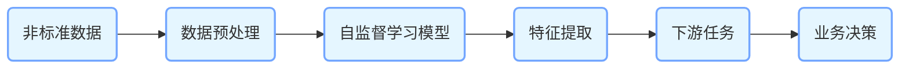

# 企业AI Agent的自监督学习在非标准数据利用中的突破性实践

> 关键词：企业AI Agent、自监督学习、非标准数据利用、突破性实践、数据处理

> 摘要：本文聚焦于企业AI Agent的自监督学习在非标准数据利用方面的突破性实践。首先介绍了相关背景，包括目的范围、预期读者等内容。接着深入探讨核心概念与联系，分析自监督学习和非标准数据的原理及架构。详细阐述核心算法原理和具体操作步骤，并给出Python代码示例。从数学模型和公式角度进行详细讲解和举例说明。通过项目实战展示代码实际案例和详细解释。探讨实际应用场景，推荐相关工具和资源，最后总结未来发展趋势与挑战，解答常见问题并提供扩展阅读和参考资料，旨在为企业在非标准数据利用方面提供有价值的技术指导和实践思路。

## 1. 背景介绍 
### 1.1 目的和范围
在当今数字化时代，企业面临着海量的数据，其中很大一部分是非标准数据，如文本、图像、音频、视频等。这些非标准数据蕴含着丰富的商业价值，但由于其结构复杂、缺乏明确标注等特点，传统的数据处理和机器学习方法难以充分挖掘其潜力。企业AI Agent的自监督学习为解决这一问题提供了新的途径。本文的目的在于深入探讨企业AI Agent如何利用自监督学习技术在非标准数据利用方面实现突破性实践，包括核心概念、算法原理、实际应用等方面。范围涵盖了自监督学习在企业不同业务场景下对非标准数据的处理和分析。

### 1.2 预期读者
本文预期读者包括企业的技术人员、数据科学家、AI工程师、业务决策者等。技术人员可以从中学到具体的算法实现和代码实践；数据科学家可以深入了解自监督学习在非标准数据上的应用原理和数学模型；AI工程师可以获取开发相关项目的思路和方法；业务决策者可以了解该技术对企业业务的潜在价值和应用场景，从而做出更明智的决策。

### 1.3 文档结构概述
本文共分为十个部分。第一部分为背景介绍，阐述目的范围、预期读者和文档结构概述；第二部分介绍核心概念与联系，包括自监督学习和非标准数据的原理及架构；第三部分讲解核心算法原理和具体操作步骤，并给出Python代码示例；第四部分从数学模型和公式角度进行详细讲解和举例说明；第五部分通过项目实战展示代码实际案例和详细解释；第六部分探讨实际应用场景；第七部分推荐相关工具和资源；第八部分总结未来发展趋势与挑战；第九部分为附录，解答常见问题；第十部分提供扩展阅读和参考资料。

### 1.4 术语表
#### 1.4.1 核心术语定义
- **企业AI Agent**：指在企业环境中运行的人工智能代理，它可以自主地完成各种任务，如数据处理、分析、决策等。
- **自监督学习**：一种无监督学习方法，通过设计合适的预训练任务，让模型从数据自身中学习到有用的特征和表示，无需人工标注数据。
- **非标准数据**：指那些不具有固定结构、格式和规范的数据，如文本、图像、音频、视频等。

#### 1.4.2 相关概念解释
- **预训练任务**：在自监督学习中，为了让模型学习到有用的特征，需要设计一些特定的任务，如掩码语言模型、图像填充等。
- **特征表示**：模型从数据中学习到的一种数值表示，它可以用于后续的任务，如分类、回归等。

#### 1.4.3 缩略词列表
- **MLP**：多层感知机（Multi-Layer Perceptron）
- **CNN**：卷积神经网络（Convolutional Neural Network）
- **RNN**：循环神经网络（Recurrent Neural Network）

## 2. 核心概念与联系 
### 自监督学习原理
自监督学习的核心思想是利用数据自身的结构和信息来学习有用的特征表示。传统的监督学习需要大量的人工标注数据，这在实际应用中往往是昂贵且耗时的。而自监督学习通过设计合适的预训练任务，让模型从无标注的数据中学习到通用的特征。例如，在自然语言处理中，可以使用掩码语言模型（Masked Language Model，MLM）作为预训练任务。在这个任务中，随机将输入文本中的一些词掩码，然后让模型预测这些被掩码的词。通过不断地优化这个任务，模型可以学习到语言的语义和语法信息。

### 非标准数据特点
非标准数据具有以下特点：
- **结构复杂**：不像标准的表格数据那样具有固定的结构和格式，如文本数据可以是不同长度、不同主题的句子或段落，图像数据具有不同的尺寸、分辨率和色彩模式。
- **缺乏标注**：获取大量的标注数据成本高昂，很多非标准数据没有明确的标注信息。
- **多样性**：包括文本、图像、音频、视频等多种类型，每种类型的数据又有不同的表现形式。

### 架构示意图
下面是一个简单的企业AI Agent利用自监督学习处理非标准数据的架构示意图：



这个架构的工作流程如下：首先，非标准数据经过数据预处理步骤，如清洗、归一化等。然后，将处理后的数据输入到自监督学习模型中进行训练，模型学习到数据的特征表示。接着，从模型中提取特征，用于下游任务，如下分类、回归等。最后，根据下游任务的结果进行业务决策。

## 3. 核心算法原理 & 具体操作步骤 
### 核心算法原理
这里以掩码语言模型（MLM）为例，介绍自监督学习的核心算法原理。假设输入的文本序列为 $x = [x_1, x_2, \cdots, x_n]$，在MLM任务中，随机选择一些词进行掩码，得到掩码后的序列 $\tilde{x} = [\tilde{x}_1, \tilde{x}_2, \cdots, \tilde{x}_n]$。模型的目标是预测这些被掩码的词。具体来说，模型将 $\tilde{x}$ 作为输入，输出每个位置的词预测概率分布 $p(y_i| \tilde{x})$，其中 $y_i$ 是第 $i$ 个位置的真实词。损失函数通常使用交叉熵损失：

$$L = - \sum_{i \in \mathcal{M}} \log p(y_i| \tilde{x})$$

其中 $\mathcal{M}$ 是被掩码的位置集合。通过最小化这个损失函数，模型可以学习到语言的语义和语法信息。

### 具体操作步骤
以下是使用Python和PyTorch实现一个简单的MLM模型的具体操作步骤：

```python
import torch
import torch.nn as nn
import torch.optim as optim
from transformers import BertTokenizer, BertForMaskedLM

# 1. 加载预训练的BERT模型和分词器
tokenizer = BertTokenizer.from_pretrained('bert-base-uncased')
model = BertForMaskedLM.from_pretrained('bert-base-uncased')

# 2. 准备数据
text = "The quick brown fox jumps over the lazy dog."
inputs = tokenizer(text, return_tensors='pt')

# 3. 随机掩码一些词
masked_index = 3  # 假设掩码第4个词
inputs['input_ids'][0][masked_index] = tokenizer.mask_token_id

# 4. 前向传播
outputs = model(**inputs)
logits = outputs.logits

# 5. 获取掩码位置的预测结果
masked_logits = logits[0, masked_index]
predicted_index = torch.argmax(masked_logits).item()
predicted_token = tokenizer.convert_ids_to_tokens([predicted_index])[0]

print(f"Predicted token: {predicted_token}")

# 6. 定义损失函数和优化器
loss_fn = nn.CrossEntropyLoss()
optimizer = optim.Adam(model.parameters(), lr=1e-5)

# 7. 训练模型
labels = inputs['input_ids'].clone()
loss = loss_fn(logits.view(-1, tokenizer.vocab_size), labels.view(-1))
optimizer.zero_grad()
loss.backward()
optimizer.step()

print(f"Loss: {loss.item()}")
```

### 代码解释
1. **加载预训练的BERT模型和分词器**：使用 `transformers` 库加载预训练的BERT模型和分词器。
2. **准备数据**：将输入文本进行分词，并转换为PyTorch张量。
3. **随机掩码一些词**：将输入序列中的某个词替换为掩码标记。
4. **前向传播**：将掩码后的输入序列输入到模型中，得到预测的词概率分布。
5. **获取掩码位置的预测结果**：从预测结果中选择概率最大的词作为预测词。
6. **定义损失函数和优化器**：使用交叉熵损失函数和Adam优化器。
7. **训练模型**：计算损失并进行反向传播和参数更新。

## 4. 数学模型和公式 & 详细讲解 & 举例说明 
### 自监督学习的数学模型
自监督学习的目标是学习一个函数 $f: X \to Z$，将输入数据 $X$ 映射到特征空间 $Z$ 中，使得特征表示 $z = f(x)$ 能够捕捉到数据的重要信息。在自监督学习中，通常通过定义一个预训练任务来实现这个目标。假设预训练任务的损失函数为 $\mathcal{L}(f, x)$，则自监督学习的优化目标可以表示为：

$$\min_{f} \mathbb{E}_{x \sim \mathcal{D}} [\mathcal{L}(f, x)]$$

其中 $\mathcal{D}$ 是数据分布。

### 掩码语言模型的详细公式
在掩码语言模型中，假设输入文本序列为 $x = [x_1, x_2, \cdots, x_n]$，掩码后的序列为 $\tilde{x} = [\tilde{x}_1, \tilde{x}_2, \cdots, \tilde{x}_n]$。模型的输出是每个位置的词预测概率分布 $p(y_i| \tilde{x})$，其中 $y_i$ 是第 $i$ 个位置的真实词。损失函数使用交叉熵损失：

$$L = - \sum_{i \in \mathcal{M}} \log p(y_i| \tilde{x})$$

其中 $\mathcal{M}$ 是被掩码的位置集合。

### 举例说明
假设输入文本为 "The quick brown fox jumps over the lazy dog."，我们随机掩码第4个词 "fox"，得到掩码后的序列 "The quick brown [MASK] jumps over the lazy dog."。模型的目标是预测 [MASK] 位置的词。假设模型输出的预测概率分布为：

| 词 | 概率 |
| --- | --- |
| cat | 0.1 |
| dog | 0.2 |
| fox | 0.7 |

则预测的词为 "fox"，与真实词一致。损失函数的值为：

$$L = - \log(0.7) \approx 0.357$$

## 5. 项目实战：代码实际案例和详细解释说明 
### 5.1  开发环境搭建
在进行项目实战之前，需要搭建开发环境。以下是具体步骤：
1. **安装Python**：建议使用Python 3.7及以上版本。
2. **安装必要的库**：使用 `pip` 安装 `torch`、`transformers` 等库。
```bash
pip install torch transformers
```
3. **选择开发工具**：可以使用Jupyter Notebook、PyCharm等开发工具。

### 5.2  源代码详细实现和代码解读
以下是一个完整的项目实战代码示例，用于对文本数据进行自监督学习：

```python
import torch
import torch.nn as nn
import torch.optim as optim
from transformers import BertTokenizer, BertForMaskedLM
from torch.utils.data import DataLoader, Dataset

# 自定义数据集类
class TextDataset(Dataset):
    def __init__(self, texts, tokenizer, max_length):
        self.texts = texts
        self.tokenizer = tokenizer
        self.max_length = max_length

    def __len__(self):
        return len(self.texts)

    def __getitem__(self, idx):
        text = self.texts[idx]
        inputs = self.tokenizer(text, return_tensors='pt', max_length=self.max_length, padding='max_length', truncation=True)
        input_ids = inputs['input_ids'].squeeze(0)
        attention_mask = inputs['attention_mask'].squeeze(0)

        # 随机掩码一些词
        masked_indices = torch.rand(input_ids.shape) < 0.15
        masked_input_ids = input_ids.clone()
        masked_input_ids[masked_indices] = self.tokenizer.mask_token_id

        labels = input_ids.clone()
        labels[~masked_indices] = -100  # 只计算掩码位置的损失

        return {
            'input_ids': masked_input_ids,
            'attention_mask': attention_mask,
            'labels': labels
        }

# 数据准备
texts = [
    "The quick brown fox jumps over the lazy dog.",
    "I love programming in Python.",
    "Artificial intelligence is the future."
]

tokenizer = BertTokenizer.from_pretrained('bert-base-uncased')
max_length = 32
dataset = TextDataset(texts, tokenizer, max_length)
dataloader = DataLoader(dataset, batch_size=2, shuffle=True)

# 加载模型
model = BertForMaskedLM.from_pretrained('bert-base-uncased')

# 定义损失函数和优化器
loss_fn = nn.CrossEntropyLoss()
optimizer = optim.Adam(model.parameters(), lr=1e-5)

# 训练模型
num_epochs = 3
for epoch in range(num_epochs):
    model.train()
    total_loss = 0
    for batch in dataloader:
        input_ids = batch['input_ids']
        attention_mask = batch['attention_mask']
        labels = batch['labels']

        outputs = model(input_ids, attention_mask=attention_mask, labels=labels)
        loss = outputs.loss

        optimizer.zero_grad()
        loss.backward()
        optimizer.step()

        total_loss += loss.item()

    print(f'Epoch {epoch + 1}/{num_epochs}, Loss: {total_loss / len(dataloader)}')
```

### 代码解读与分析
1. **自定义数据集类**：`TextDataset` 类用于封装文本数据，并进行数据预处理和掩码操作。在 `__getitem__` 方法中，将文本进行分词，并随机掩码一些词，同时准备好标签。
2. **数据准备**：定义了一个包含三个文本的列表 `texts`，并使用 `TextDataset` 类创建数据集，使用 `DataLoader` 类创建数据加载器。
3. **加载模型**：使用 `transformers` 库加载预训练的BERT模型。
4. **定义损失函数和优化器**：使用交叉熵损失函数和Adam优化器。
5. **训练模型**：进行多个epoch的训练，每个epoch中遍历数据加载器，进行前向传播、计算损失、反向传播和参数更新。

## 6. 实际应用场景 
### 自然语言处理
在自然语言处理领域，企业AI Agent的自监督学习可以用于文本分类、情感分析、信息检索等任务。例如，在文本分类任务中，通过自监督学习可以从大量的无标注文本数据中学习到通用的语言特征，然后将这些特征用于分类模型的训练，提高分类的准确率。

### 图像识别
在图像识别领域，自监督学习可以用于图像分类、目标检测、图像生成等任务。例如，通过设计合适的预训练任务，如图像填充、图像旋转预测等，让模型学习到图像的特征表示，然后将这些特征用于下游任务。

### 音频处理
在音频处理领域，自监督学习可以用于语音识别、音乐分类、音频生成等任务。例如，通过对音频数据进行自监督学习，可以学习到音频的声学特征，然后将这些特征用于语音识别模型的训练。

## 7. 工具和资源推荐
### 7.1 学习资源推荐
#### 7.1.1 书籍推荐
- 《深度学习》（Deep Learning）：由Ian Goodfellow、Yoshua Bengio和Aaron Courville撰写，是深度学习领域的经典教材。
- 《自然语言处理入门》（Natural Language Processing with Python）：由Steven Bird、Ewan Klein和Edward Loper撰写，介绍了使用Python进行自然语言处理的基础知识和方法。

#### 7.1.2 在线课程
- Coursera上的“深度学习专项课程”（Deep Learning Specialization）：由Andrew Ng教授授课，涵盖了深度学习的各个方面。
- edX上的“自然语言处理”（Natural Language Processing）：由哈佛大学和微软研究院的教授授课，介绍了自然语言处理的最新技术和应用。

#### 7.1.3 技术博客和网站
- arXiv.org：提供了大量的学术论文，包括自监督学习、深度学习等领域的最新研究成果。
- Medium上的Towards Data Science：有很多关于数据科学、机器学习和深度学习的技术文章和案例分析。

### 7.2 开发工具框架推荐
#### 7.2.1 IDE和编辑器
- PyCharm：一款功能强大的Python集成开发环境，提供了代码编辑、调试、版本控制等功能。
- Jupyter Notebook：一个交互式的笔记本环境，适合进行数据分析、模型训练和可视化。

#### 7.2.2 调试和性能分析工具
- TensorBoard：一个可视化工具，用于监控和分析深度学习模型的训练过程和性能。
- Py-Spy：一个用于分析Python代码性能的工具，可以找出代码中的性能瓶颈。

#### 7.2.3 相关框架和库
- PyTorch：一个开源的深度学习框架，提供了丰富的神经网络层和优化算法。
- Transformers：一个用于自然语言处理的开源库，提供了预训练的模型和工具，方便进行自监督学习和下游任务。

### 7.3 相关论文著作推荐
#### 7.3.1 经典论文
- “Attention Is All You Need”：介绍了Transformer架构，是自然语言处理领域的经典论文。
- “BERT: Pre-training of Deep Bidirectional Transformers for Language Understanding”：提出了BERT模型，开启了自然语言处理领域的预训练时代。

#### 7.3.2 最新研究成果
- 可以关注arXiv.org上的最新论文，了解自监督学习在不同领域的最新研究进展。

#### 7.3.3 应用案例分析
- 一些知名企业的技术博客会分享自监督学习在实际业务中的应用案例，可以从中学习到实际应用的经验和方法。

## 8. 总结：未来发展趋势与挑战
### 未来发展趋势
- **多模态自监督学习**：将不同类型的非标准数据（如文本、图像、音频等）进行联合自监督学习，学习到更全面的特征表示。
- **强化自监督学习**：将自监督学习与强化学习相结合，让模型在与环境的交互中学习到更有用的知识和技能。
- **自监督学习在边缘设备上的应用**：随着边缘计算的发展，将自监督学习模型部署到边缘设备上，实现实时、高效的数据处理和分析。

### 挑战
- **计算资源需求**：自监督学习通常需要大量的计算资源和时间进行训练，如何降低计算成本是一个挑战。
- **数据质量和多样性**：非标准数据的质量和多样性对自监督学习的效果有很大影响，如何获取高质量、多样化的数据是一个问题。
- **模型可解释性**：自监督学习模型通常是黑盒模型，缺乏可解释性，如何提高模型的可解释性是一个重要的研究方向。

## 9. 附录：常见问题与解答
### 问题1：自监督学习和无监督学习有什么区别？
自监督学习是无监督学习的一种特殊形式。无监督学习的目标是发现数据中的结构和模式，而自监督学习通过设计特定的预训练任务，让模型从数据自身中学习到有用的特征表示。自监督学习通常需要更多的设计和工程技巧来定义预训练任务。

### 问题2：如何选择合适的预训练任务？
选择合适的预训练任务需要考虑数据的特点和下游任务的需求。例如，对于文本数据，可以选择掩码语言模型、下一句预测等任务；对于图像数据，可以选择图像填充、图像旋转预测等任务。此外，还可以通过实验和比较不同的预训练任务来选择最优的任务。

### 问题3：自监督学习模型的训练时间通常需要多久？
自监督学习模型的训练时间取决于多个因素，如数据规模、模型复杂度、计算资源等。一般来说，训练一个大规模的自监督学习模型可能需要数天甚至数周的时间。可以通过使用分布式训练、混合精度训练等技术来加速训练过程。

## 10. 扩展阅读 & 参考资料
### 扩展阅读
- 《动手学深度学习》（Dive into Deep Learning）：提供了丰富的深度学习实践案例和代码。
- 《深度学习实战》（Deep Learning in Practice）：介绍了深度学习在不同领域的实际应用和案例。

### 参考资料
- Goodfellow, I., Bengio, Y., & Courville, A. (2016). Deep Learning. MIT Press.
- Devlin, J., Chang, M. W., Lee, K., & Toutanova, K. (2018). BERT: Pre-training of Deep Bidirectional Transformers for Language Understanding. arXiv preprint arXiv:1810.04805.
- Vaswani, A., Shazeer, N., Parmar, N., Uszkoreit, J., Jones, L., Gomez, A. N.,... & Polosukhin, I. (2017). Attention Is All You Need. Advances in Neural Information Processing Systems, 5998-6008.

作者：AI天才研究院/AI Genius Institute & 禅与计算机程序设计艺术 /Zen And The Art of Computer Programming