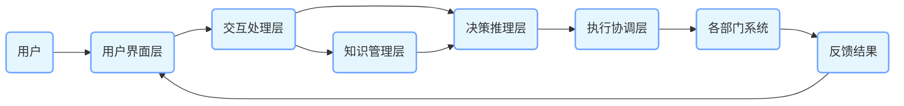

# 企业AI Agent的跨部门协作功能：打破信息孤岛

> 关键词：企业AI Agent、跨部门协作、信息孤岛、智能交互、数据共享

> 摘要：本文聚焦于企业AI Agent的跨部门协作功能，旨在探讨如何借助这一技术打破企业内部的信息孤岛。首先介绍了相关背景，包括目的范围、预期读者等内容。接着阐述了企业AI Agent及跨部门协作的核心概念与联系，分析其原理和架构。详细讲解了核心算法原理，并给出Python源代码示例。通过数学模型和公式进一步剖析其工作机制，同时结合项目实战案例进行代码实现与解读。还探讨了实际应用场景，推荐了相关工具和资源。最后总结了未来发展趋势与挑战，提供常见问题解答和扩展阅读参考资料，帮助企业更好地理解和应用企业AI Agent实现跨部门高效协作。

## 1. 背景介绍 
### 1.1 目的和范围
在当今数字化的企业环境中，各部门之间的信息流通不畅、数据孤立等问题导致了严重的信息孤岛现象。这不仅影响了企业的决策效率，还阻碍了业务的协同发展。本文的目的在于深入研究企业AI Agent的跨部门协作功能，探讨如何利用这一技术手段打破信息孤岛，实现企业内部各部门之间的高效沟通与协作。

研究范围涵盖了企业AI Agent的基本概念、核心算法、数学模型，以及在不同企业场景下的实际应用。同时，还会介绍相关的开发工具、学习资源和研究成果，为企业实施跨部门协作提供全面的技术支持和指导。

### 1.2 预期读者
本文的预期读者主要包括企业的管理人员、技术决策者、IT部门工作人员以及对企业数字化转型和AI技术应用感兴趣的研究人员。对于企业管理人员，本文可以帮助他们了解如何利用企业AI Agent提升跨部门协作效率，做出更明智的决策；技术决策者可以从中获取关于技术选型、架构设计等方面的参考；IT部门工作人员则可以学习到具体的开发实现方法和技巧；研究人员可以进一步深入探讨相关技术的发展趋势和研究方向。

### 1.3 文档结构概述
本文将按照以下结构进行组织：首先介绍企业AI Agent跨部门协作功能的背景知识，包括目的、预期读者和文档结构等；接着阐述核心概念与联系，通过文本示意图和Mermaid流程图展示其原理和架构；然后详细讲解核心算法原理，并给出Python源代码示例；再通过数学模型和公式深入分析其工作机制，并举例说明；之后通过项目实战案例，介绍开发环境搭建、源代码实现和代码解读；探讨实际应用场景；推荐相关的工具和资源；最后总结未来发展趋势与挑战，提供常见问题解答和扩展阅读参考资料。

### 1.4 术语表
#### 1.4.1 核心术语定义
- **企业AI Agent**：是一种基于人工智能技术的智能软件实体，能够在企业环境中自动执行特定任务，模拟人类的智能行为，与其他系统或人员进行交互，以实现企业的业务目标。
- **跨部门协作**：指企业内部不同部门之间为了实现共同的目标，通过共享信息、资源和知识，协同工作的过程。
- **信息孤岛**：是指企业内部各部门由于信息系统独立建设、数据标准不统一等原因，导致信息无法在部门之间自由流通和共享的现象。

#### 1.4.2 相关概念解释
- **智能交互**：企业AI Agent通过自然语言处理、机器学习等技术，与用户进行自然、高效的交互，理解用户的意图并提供相应的服务。
- **数据共享**：将企业内部不同部门的数据进行整合和开放，使得各部门能够获取和使用所需的数据，提高工作效率和决策的准确性。

#### 1.4.3 缩略词列表
- **NLP**：Natural Language Processing，自然语言处理
- **ML**：Machine Learning，机器学习
- **API**：Application Programming Interface，应用程序编程接口

## 2. 核心概念与联系 

### 核心概念原理
企业AI Agent的跨部门协作功能基于多个核心概念和技术，主要包括自然语言处理、机器学习、知识图谱和智能推理等。

自然语言处理（NLP）技术使得AI Agent能够理解和处理人类的自然语言，实现与用户的交互。通过文本分析、语义理解等技术，AI Agent可以准确地识别用户的意图，并生成相应的回复或执行相应的任务。

机器学习（ML）技术用于训练AI Agent，使其能够从大量的数据中学习到模式和规律，提高其决策和处理问题的能力。常见的机器学习算法包括决策树、神经网络、支持向量机等。

知识图谱是一种语义网络，用于表示企业内部的知识和信息。通过构建知识图谱，AI Agent可以更好地理解企业的业务逻辑和数据关系，从而更准确地回答用户的问题和提供相关的建议。

智能推理技术使得AI Agent能够根据已知的信息和规则，进行逻辑推理和判断，得出新的结论和决策。这有助于AI Agent在跨部门协作中，根据不同部门的需求和情况，做出合理的决策和协调。

### 架构的文本示意图
企业AI Agent的跨部门协作架构主要包括以下几个部分：

- **用户界面层**：提供用户与AI Agent进行交互的界面，如网页界面、移动应用界面等。用户可以通过自然语言输入问题或指令，AI Agent将在该界面显示相应的回复和结果。
- **交互处理层**：负责接收用户的输入，进行自然语言处理和语义理解，将用户的意图转化为系统能够理解的格式。同时，该层还负责与其他模块进行通信和协调，确保AI Agent能够准确地执行用户的请求。
- **知识管理层**：存储和管理企业内部的知识和信息，包括数据、文档、规则等。通过知识图谱技术，将这些知识进行整合和关联，以便AI Agent能够快速准确地获取所需的知识。
- **决策推理层**：根据用户的请求和知识管理层提供的信息，进行智能推理和决策。该层使用机器学习算法和规则引擎，对数据进行分析和处理，得出最优的解决方案。
- **执行协调层**：负责将决策推理层得出的结果转化为具体的行动，并协调不同部门的系统和人员进行执行。该层通过API接口与各部门的信息系统进行集成，实现数据的共享和业务流程的自动化。

### Mermaid流程图


该流程图展示了企业AI Agent跨部门协作的工作流程。用户通过用户界面层输入请求，交互处理层对请求进行处理，然后从知识管理层获取相关知识，决策推理层根据知识进行决策，执行协调层将决策转化为行动并与各部门系统进行交互，最后将结果反馈给用户。

## 3. 核心算法原理 & 具体操作步骤 

### 核心算法原理
企业AI Agent的跨部门协作功能涉及到多个核心算法，其中自然语言处理和机器学习算法是关键。

#### 自然语言处理算法
自然语言处理主要包括文本预处理、词性标注、命名实体识别、句法分析和语义理解等步骤。以下是一个简单的文本预处理和词性标注的Python代码示例：

```python
import nltk
from nltk.tokenize import word_tokenize
from nltk import pos_tag

# 下载必要的数据
nltk.download('punkt')
nltk.download('averaged_perceptron_tagger')

# 输入文本
text = "企业AI Agent可以帮助跨部门协作。"

# 文本预处理：分词
tokens = word_tokenize(text)

# 词性标注
pos_tags = pos_tag(tokens)

print("分词结果:", tokens)
print("词性标注结果:", pos_tags)
```

#### 机器学习算法
在企业AI Agent中，机器学习算法常用于分类、预测和推荐等任务。以朴素贝叶斯分类器为例，以下是一个简单的文本分类的Python代码示例：

```python
from sklearn.feature_extraction.text import CountVectorizer
from sklearn.naive_bayes import MultinomialNB
from sklearn.model_selection import train_test_split
from sklearn.metrics import accuracy_score

# 示例数据
documents = ["企业AI Agent可以提高效率。", "跨部门协作很重要。", "信息孤岛影响企业发展。", "智能交互提升用户体验。"]
labels = ["效率提升", "协作重要", "信息问题", "用户体验"]

# 特征提取
vectorizer = CountVectorizer()
X = vectorizer.fit_transform(documents)

# 划分训练集和测试集
X_train, X_test, y_train, y_test = train_test_split(X, labels, test_size=0.2, random_state=42)

# 训练模型
clf = MultinomialNB()
clf.fit(X_train, y_train)

# 预测
y_pred = clf.predict(X_test)

# 评估模型
accuracy = accuracy_score(y_test, y_pred)
print("模型准确率:", accuracy)
```

### 具体操作步骤
1. **数据收集和预处理**：收集企业内部各部门的相关数据，包括文本数据、业务数据等。对数据进行清洗、标注和特征提取等预处理操作，以便后续的模型训练和分析。
2. **模型训练**：根据具体的任务需求，选择合适的机器学习算法和模型结构。使用预处理后的数据对模型进行训练，调整模型的参数，提高模型的性能。
3. **系统集成**：将训练好的模型集成到企业AI Agent的系统中，通过API接口与各部门的信息系统进行对接，实现数据的共享和业务流程的自动化。
4. **测试和优化**：对企业AI Agent的跨部门协作功能进行测试，检查其在不同场景下的性能和准确性。根据测试结果，对模型和系统进行优化和调整，提高其稳定性和可靠性。
5. **上线部署**：经过充分的测试和优化后，将企业AI Agent的跨部门协作功能正式上线部署，为企业的各部门提供服务。

## 4. 数学模型和公式 & 详细讲解 & 举例说明 

### 自然语言处理中的数学模型
#### 词袋模型（Bag of Words）
词袋模型是一种简单而有效的文本表示方法，它将文本看作是一个无序的词集合。假设一个文本集合 $D = \{d_1, d_2, \cdots, d_n\}$，其中 $d_i$ 表示第 $i$ 个文本，词表 $V = \{w_1, w_2, \cdots, w_m\}$ 包含了所有文本中出现的不同词汇。对于每个文本 $d_i$，可以用一个向量 $\mathbf{x}_i = [x_{i1}, x_{i2}, \cdots, x_{im}]$ 来表示，其中 $x_{ij}$ 表示词 $w_j$ 在文本 $d_i$ 中出现的次数。

例如，有两个文本 $d_1$ = "企业AI Agent" 和 $d_2$ = "AI Agent跨部门协作"，词表 $V$ = ["企业", "AI", "Agent", "跨部门", "协作"]，则 $d_1$ 的词袋向量为 $\mathbf{x}_1 = [1, 1, 1, 0, 0]$，$d_2$ 的词袋向量为 $\mathbf{x}_2 = [0, 1, 1, 1, 1]$。

#### TF-IDF模型
TF-IDF（Term Frequency-Inverse Document Frequency）是一种常用的文本特征加权方法，它结合了词频（TF）和逆文档频率（IDF）两个因素。词频 $tf_{ij}$ 表示词 $w_j$ 在文本 $d_i$ 中出现的频率，逆文档频率 $idf_j$ 表示词 $w_j$ 在整个文本集合中的重要性，计算公式如下：

$$tf_{ij} = \frac{n_{ij}}{\sum_{k=1}^{m} n_{ik}}$$

其中 $n_{ij}$ 表示词 $w_j$ 在文本 $d_i$ 中出现的次数，$\sum_{k=1}^{m} n_{ik}$ 表示文本 $d_i$ 中所有词的出现次数之和。

$$idf_j = \log\frac{N}{df_j}$$

其中 $N$ 表示文本集合中的文本总数，$df_j$ 表示包含词 $w_j$ 的文本数量。

TF-IDF值 $tfidf_{ij}$ 为词频和逆文档频率的乘积：

$$tfidf_{ij} = tf_{ij} \times idf_j$$

### 机器学习中的数学模型
#### 朴素贝叶斯分类器
朴素贝叶斯分类器基于贝叶斯定理和特征条件独立假设。对于一个文本分类问题，假设类别集合为 $C = \{c_1, c_2, \cdots, c_k\}$，文本特征向量为 $\mathbf{x} = [x_1, x_2, \cdots, x_m]$，朴素贝叶斯分类器的目标是找到一个类别 $c^*$，使得后验概率 $P(c^*|\mathbf{x})$ 最大，即：

$$c^* = \arg\max_{c \in C} P(c|\mathbf{x})$$

根据贝叶斯定理，有：

$$P(c|\mathbf{x}) = \frac{P(\mathbf{x}|c)P(c)}{P(\mathbf{x})}$$

由于 $P(\mathbf{x})$ 对于所有类别都是相同的，因此可以忽略，只需要比较 $P(\mathbf{x}|c)P(c)$ 的大小。在朴素贝叶斯分类器中，假设特征之间是条件独立的，即：

$$P(\mathbf{x}|c) = \prod_{i=1}^{m} P(x_i|c)$$

因此，最终的分类决策可以表示为：

$$c^* = \arg\max_{c \in C} P(c) \prod_{i=1}^{m} P(x_i|c)$$

例如，在前面的文本分类示例中，假设类别 $c_1$ = "效率提升"，$c_2$ = "协作重要"，文本特征向量 $\mathbf{x}$ 表示一个新的文本。通过计算 $P(c_1) \prod_{i=1}^{m} P(x_i|c_1)$ 和 $P(c_2) \prod_{i=1}^{m} P(x_i|c_2)$ 的值，选择值较大的类别作为分类结果。

## 5. 项目实战：代码实际案例和详细解释说明 

### 5.1  开发环境搭建
#### 安装Python
首先需要安装Python编程语言，建议使用Python 3.7及以上版本。可以从Python官方网站（https://www.python.org/downloads/）下载并安装适合自己操作系统的Python版本。

#### 安装必要的库
在项目中，需要使用一些Python库来实现自然语言处理和机器学习功能，如 `nltk`、`sklearn` 等。可以使用 `pip` 命令来安装这些库：

```bash
pip install nltk sklearn
```

#### 下载NLTK数据
在使用 `nltk` 库时，需要下载一些必要的数据，如分词器、词性标注器等。可以在Python交互式环境中运行以下代码来下载数据：

```python
import nltk
nltk.download('punkt')
nltk.download('averaged_perceptron_tagger')
```

### 5.2  源代码详细实现和代码解读
以下是一个完整的企业AI Agent跨部门协作的代码示例，包括文本预处理、分类和回复生成等功能：

```python
import nltk
from nltk.tokenize import word_tokenize
from nltk import pos_tag
from sklearn.feature_extraction.text import CountVectorizer
from sklearn.naive_bayes import MultinomialNB
from sklearn.model_selection import train_test_split
from sklearn.metrics import accuracy_score

# 示例数据
documents = ["企业AI Agent可以提高效率。", "跨部门协作很重要。", "信息孤岛影响企业发展。", "智能交互提升用户体验。"]
labels = ["效率提升", "协作重要", "信息问题", "用户体验"]

# 文本预处理函数
def preprocess_text(text):
    tokens = word_tokenize(text)
    pos_tags = pos_tag(tokens)
    return tokens

# 特征提取
vectorizer = CountVectorizer(tokenizer=preprocess_text)
X = vectorizer.fit_transform(documents)

# 划分训练集和测试集
X_train, X_test, y_train, y_test = train_test_split(X, labels, test_size=0.2, random_state=42)

# 训练模型
clf = MultinomialNB()
clf.fit(X_train, y_train)

# 预测函数
def predict_category(text):
    X_new = vectorizer.transform([text])
    category = clf.predict(X_new)[0]
    return category

# 回复生成函数
def generate_response(category):
    if category == "效率提升":
        return "企业AI Agent确实可以通过自动化任务和智能决策提高各部门的工作效率。"
    elif category == "协作重要":
        return "跨部门协作能够整合资源，促进信息流通，对企业的发展至关重要。"
    elif category == "信息问题":
        return "信息孤岛会导致数据不一致和沟通障碍，企业需要加强数据共享和整合。"
    elif category == "用户体验":
        return "智能交互可以让用户更方便地获取信息和服务，提升用户的满意度。"
    else:
        return "抱歉，我不太理解您的问题。"

# 测试
test_text = "企业AI Agent能提升效率吗？"
category = predict_category(test_text)
response = generate_response(category)
print("输入文本:", test_text)
print("分类结果:", category)
print("回复内容:", response)
```

### 5.3  代码解读与分析
1. **数据准备**：定义了示例数据 `documents` 和对应的标签 `labels`，用于训练分类模型。
2. **文本预处理**：`preprocess_text` 函数对输入的文本进行分词和词性标注，将文本转换为适合机器学习模型处理的格式。
3. **特征提取**：使用 `CountVectorizer` 对文本进行特征提取，将文本转换为词袋向量。
4. **模型训练**：使用 `MultinomialNB` 朴素贝叶斯分类器对训练数据进行训练。
5. **预测函数**：`predict_category` 函数接受一个文本输入，将其转换为特征向量，并使用训练好的模型进行分类预测。
6. **回复生成函数**：`generate_response` 函数根据分类结果生成相应的回复内容。
7. **测试**：输入一个测试文本，调用 `predict_category` 函数进行分类预测，再调用 `generate_response` 函数生成回复内容，并打印结果。

通过这个代码示例，可以看到如何使用Python实现一个简单的企业AI Agent跨部门协作系统，包括文本分类和回复生成等基本功能。

## 6. 实际应用场景 
### 项目管理
在企业的项目管理中，不同部门可能负责项目的不同阶段和任务。企业AI Agent可以作为一个智能协调者，收集各部门的项目进度信息，根据项目目标和资源情况进行任务分配和调度。例如，当某个部门遇到资源短缺或进度延迟的问题时，AI Agent可以自动与其他部门进行沟通和协调，寻找解决方案，确保项目能够按时完成。

### 客户服务
企业的客户服务通常涉及多个部门，如销售、技术支持、售后等。当客户提出问题或需求时，企业AI Agent可以通过自然语言处理技术理解客户的意图，并根据问题的类型将其分配给相应的部门。同时，AI Agent可以在各部门之间传递信息，协调解决客户问题的流程，提高客户服务的效率和质量。

### 数据分析与决策
企业内部各部门通常拥有大量的数据，但由于信息孤岛的存在，这些数据难以得到有效的整合和利用。企业AI Agent可以跨部门收集和整合数据，运用机器学习和数据分析技术对数据进行挖掘和分析，为企业的决策提供支持。例如，AI Agent可以分析销售数据、市场数据和生产数据，为企业的产品研发、市场推广和生产计划提供决策建议。

### 知识共享与培训
企业的不同部门拥有各自的专业知识和经验，但这些知识往往分散在各个部门内部，难以共享和传承。企业AI Agent可以构建知识图谱，将各部门的知识进行整合和关联，为员工提供统一的知识查询和学习平台。同时，AI Agent可以根据员工的岗位需求和学习进度，提供个性化的培训建议和学习资源，促进员工的知识共享和能力提升。

## 7. 工具和资源推荐
### 7.1 学习资源推荐
#### 7.1.1 书籍推荐
- 《Python自然语言处理》（Natural Language Processing with Python）：这本书详细介绍了使用Python进行自然语言处理的基本技术和方法，包括分词、词性标注、命名实体识别、句法分析等内容。
- 《机器学习》（Machine Learning）：由周志华教授编写，是机器学习领域的经典教材，全面介绍了机器学习的基本概念、算法和应用。
- 《知识图谱：方法、实践与应用》：系统地介绍了知识图谱的基本概念、构建方法和应用场景，对于理解企业AI Agent中的知识管理和推理技术有很大的帮助。

#### 7.1.2 在线课程
- Coursera上的“Natural Language Processing Specialization”：由斯坦福大学的教授授课，涵盖了自然语言处理的各个方面，包括文本分类、情感分析、机器翻译等内容。
- edX上的“Introduction to Artificial Intelligence”：介绍了人工智能的基本概念、算法和应用，包括机器学习、深度学习、知识表示和推理等内容。
- 网易云课堂上的“Python数据分析与机器学习实战”：通过实际案例介绍了Python在数据分析和机器学习中的应用，适合初学者入门。

#### 7.1.3 技术博客和网站
- 机器之心（https://www.alienlab.cn/）：专注于人工智能领域的技术和应用，提供最新的技术资讯、研究成果和实践案例。
- 开源中国（https://www.oschina.net/）：国内知名的开源技术社区，提供丰富的开源项目和技术文章，包括人工智能、机器学习等领域的内容。
- 博客园（https://www.cnblogs.com/）：国内知名的技术博客平台，有很多开发者分享人工智能和机器学习的经验和心得。

### 7.2 开发工具框架推荐
#### 7.2.1 IDE和编辑器
- PyCharm：是一款专门为Python开发设计的集成开发环境（IDE），提供了丰富的代码编辑、调试、测试等功能，适合开发企业AI Agent项目。
- Jupyter Notebook：是一个基于Web的交互式开发环境，支持Python、R等多种编程语言，方便进行数据探索、模型训练和结果展示。
- Visual Studio Code：是一款轻量级的代码编辑器，支持多种编程语言和插件扩展，具有良好的代码编辑和调试功能，适合快速开发和调试Python代码。

#### 7.2.2 调试和性能分析工具
- pdb：是Python自带的调试工具，可以在代码中设置断点，逐步执行代码，查看变量的值和程序的执行流程。
- cProfile：是Python的性能分析工具，可以统计代码的运行时间和函数调用次数，帮助开发者找出代码中的性能瓶颈。
- TensorBoard：是TensorFlow的可视化工具，可以用于可视化深度学习模型的训练过程、参数分布和性能指标，方便开发者进行模型调试和优化。

#### 7.2.3 相关框架和库
- NLTK：是Python中最常用的自然语言处理库，提供了丰富的文本处理工具和语料库，方便进行分词、词性标注、命名实体识别等任务。
- Scikit-learn：是Python中常用的机器学习库，提供了各种机器学习算法和工具，如分类、回归、聚类等，适合快速开发和实验机器学习模型。
- PyTorch：是一个开源的深度学习框架，具有动态图和静态图两种编程方式，支持GPU加速，适合开发深度学习模型，如神经网络、卷积神经网络等。

### 7.3 相关论文著作推荐
#### 7.3.1 经典论文
- "A Mathematical Theory of Communication"（Claude E. Shannon）：这篇论文奠定了信息论的基础，对于理解自然语言处理中的信息表示和传输有重要的意义。
- "The Elements of Statistical Learning"（Trevor Hastie, Robert Tibshirani, Jerome Friedman）：是统计学习领域的经典著作，系统地介绍了统计学习的基本理论和方法，包括线性回归、逻辑回归、决策树等内容。
- "Word2Vec Explained: Deriving Mikolov et al.'s Negative-Sampling Word-Embedding Method"（Yoav Goldberg, Omer Levy）：详细解释了Word2Vec模型的原理和训练方法，对于理解词向量表示和文本语义分析有很大的帮助。

#### 7.3.2 最新研究成果
- 每年的国际人工智能联合会议（IJCAI）、神经信息处理系统大会（NeurIPS）和自然语言处理经验方法会议（EMNLP）等顶级学术会议上都会发表大量关于人工智能和自然语言处理的最新研究成果，可以关注这些会议的论文集和相关报道。
- 一些知名的学术期刊，如《Journal of Artificial Intelligence Research》、《Artificial Intelligence》和《Computational Linguistics》等，也会发表人工智能和自然语言处理领域的前沿研究论文。

#### 7.3.3 应用案例分析
- 《AI in Practice: How 50 Successful Companies Used Artificial Intelligence to Solve Problems》：这本书介绍了50个成功的企业应用人工智能解决实际问题的案例，包括客户服务、供应链管理、市场营销等领域，可以为企业实施AI Agent跨部门协作提供参考和借鉴。
- 一些咨询公司和研究机构，如麦肯锡、波士顿咨询集团等，也会发布关于企业数字化转型和人工智能应用的研究报告和案例分析，可以关注这些机构的官方网站获取相关信息。

## 8. 总结：未来发展趋势与挑战
### 未来发展趋势
#### 更强大的智能交互能力
未来的企业AI Agent将具备更强大的自然语言处理和对话管理能力，能够实现更加自然、流畅的人机交互。不仅可以理解用户的表面意图，还能深入理解用户的情感和需求，提供更加个性化的服务和建议。

#### 与物联网和大数据的深度融合
随着物联网技术的发展，企业内部的各种设备和传感器将产生大量的数据。企业AI Agent将与物联网和大数据技术深度融合，实时收集和分析这些数据，为企业的决策提供更全面、准确的信息支持。

#### 跨企业和跨行业的协作
未来的企业AI Agent不仅可以实现企业内部各部门之间的协作，还可以与其他企业和行业的AI Agent进行交互和协作。通过建立跨企业和跨行业的智能生态系统，实现资源共享、优势互补，促进整个产业链的协同发展。

#### 自主学习和进化能力
企业AI Agent将具备更强的自主学习和进化能力，能够不断从新的数据和经验中学习，自动调整和优化自己的模型和策略。这将使AI Agent能够更好地适应企业环境的变化和业务需求的发展。

### 挑战
#### 数据安全和隐私问题
企业AI Agent需要收集和处理大量的企业内部数据，这些数据往往包含敏感信息，如客户信息、商业机密等。因此，如何保障数据的安全和隐私是企业实施AI Agent跨部门协作面临的重要挑战之一。

#### 技术集成和兼容性问题
企业内部可能存在多种不同的信息系统和技术架构，如何将AI Agent与这些系统进行集成，确保数据的流畅流通和业务流程的无缝对接，是一个技术难题。同时，不同的AI技术和工具之间也可能存在兼容性问题，需要进行有效的整合和协调。

#### 员工接受度和培训问题
引入企业AI Agent可能会对员工的工作方式和职业发展产生影响，部分员工可能会对新技术产生抵触情绪。因此，如何提高员工对AI Agent的接受度，为员工提供相关的培训和支持，帮助他们适应新的工作模式，是企业需要解决的问题。

#### 法律法规和伦理问题
随着人工智能技术的广泛应用，相关的法律法规和伦理问题也日益凸显。例如，AI Agent的决策结果可能会对企业和个人产生影响，如何确保AI Agent的决策符合法律法规和伦理道德标准，是企业和社会需要共同面对的挑战。

## 9. 附录：常见问题与解答
### 企业AI Agent与传统软件系统有什么区别？
企业AI Agent具有智能交互、自主学习和决策等能力，能够根据不同的情况和需求自动调整自己的行为。而传统软件系统通常是按照预设的规则和流程执行任务，缺乏灵活性和智能性。企业AI Agent可以更好地适应企业环境的变化和业务需求的发展，提供更加个性化的服务和支持。

### 实施企业AI Agent跨部门协作需要多少成本？
实施企业AI Agent跨部门协作的成本取决于多个因素，如系统的规模和复杂度、数据的处理量、技术的选型和开发团队的能力等。一般来说，需要投入一定的资金用于技术研发、数据收集和处理、人员培训等方面。但从长远来看，通过提高企业的协作效率和决策准确性，企业AI Agent可以为企业带来显著的经济效益。

### 如何评估企业AI Agent跨部门协作的效果？
可以从多个方面评估企业AI Agent跨部门协作的效果，如工作效率的提升、沟通成本的降低、决策准确性的提高、业务流程的优化等。可以通过对比实施前后的相关指标，如项目完成时间、客户满意度、销售额等，来评估AI Agent的实际效果。同时，也可以收集员工的反馈意见，了解他们对AI Agent的使用体验和满意度。

### 企业AI Agent是否会取代人类员工？
企业AI Agent的主要作用是辅助人类员工进行工作，提高工作效率和决策准确性，而不是取代人类员工。虽然AI Agent可以自动执行一些重复性和规律性的任务，但在一些需要创造性、情感理解和人际交往能力的工作中，人类员工仍然具有不可替代的优势。企业AI Agent将与人类员工形成互补关系，共同推动企业的发展。

## 10. 扩展阅读 & 参考资料
### 扩展阅读
- 《人工智能时代与人类未来》：探讨了人工智能技术的发展对人类社会和未来的影响，帮助读者从更宏观的角度理解企业AI Agent的应用和发展。
- 《数字化转型：企业如何实现跨越发展》：介绍了企业数字化转型的理论和实践，包括如何利用新兴技术提升企业的竞争力和创新能力，对于企业实施AI Agent跨部门协作具有重要的参考价值。
- 《大数据时代：生活、工作与思维的大变革》：阐述了大数据技术的发展和应用对社会各个领域的影响，为企业AI Agent的数据处理和分析提供了理论基础和实践指导。

### 参考资料
- 各技术库和框架的官方文档，如NLTK、Scikit-learn、PyTorch等。
- 相关的学术研究论文和报告，如在IEEE、ACM等学术数据库中搜索关于企业AI Agent和跨部门协作的研究成果。
- 行业报告和咨询机构的研究资料，如Gartner、IDC等发布的关于人工智能和企业数字化转型的报告。

作者：AI天才研究院/AI Genius Institute & 禅与计算机程序设计艺术 /Zen And The Art of Computer Programming