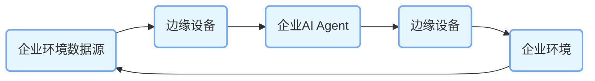

# 企业AI Agent的边缘智能部署策略

> 关键词：企业AI Agent、边缘智能、部署策略、边缘计算、人工智能

> 摘要：本文聚焦于企业AI Agent的边缘智能部署策略。首先介绍了相关背景，包括目的范围、预期读者等内容。接着阐述了企业AI Agent和边缘智能的核心概念及联系，通过文本示意图和Mermaid流程图进行清晰展示。详细讲解了核心算法原理，结合Python源代码进行说明，并给出相关数学模型和公式。通过项目实战，展示了开发环境搭建、源代码实现与解读。探讨了实际应用场景，推荐了学习资源、开发工具框架以及相关论文著作。最后总结了未来发展趋势与挑战，还包含常见问题解答和扩展阅读参考资料，旨在为企业在AI Agent边缘智能部署方面提供全面且深入的指导。

## 1. 背景介绍 
### 1.1 目的和范围
在当今数字化时代，企业面临着海量数据的处理和实时决策的需求。企业AI Agent作为一种能够模拟人类智能行为的软件实体，可以帮助企业实现自动化的业务流程、提高生产效率和决策的准确性。而边缘智能则是将计算和数据存储靠近数据源的边缘设备上，减少数据传输延迟，提高系统的响应速度和安全性。本文章的目的在于探讨企业AI Agent在边缘智能环境下的部署策略，范围涵盖了从核心概念的理解到实际项目的实施，以及未来发展趋势的展望。

### 1.2 预期读者
本文预期读者包括企业的技术管理人员、AI开发工程师、边缘计算领域的从业者以及对企业数字化转型和人工智能应用感兴趣的研究人员。这些读者可能希望了解如何将AI Agent与边缘智能相结合，以提升企业的竞争力和创新能力。

### 1.3 文档结构概述
本文首先介绍相关背景知识，让读者对企业AI Agent的边缘智能部署有初步的认识。接着阐述核心概念与联系，为后续的技术讲解奠定基础。然后详细讲解核心算法原理、数学模型和公式，使读者深入理解技术的本质。通过项目实战部分，展示如何将理论应用到实际项目中。探讨实际应用场景，让读者了解该技术的实际价值。推荐相关的工具和资源，帮助读者进一步学习和实践。最后总结未来发展趋势与挑战，并提供常见问题解答和扩展阅读参考资料，形成一个完整的知识体系。

### 1.4 术语表
#### 1.4.1 核心术语定义
- **企业AI Agent**：是一种基于人工智能技术的软件实体，它能够感知企业环境中的信息，根据预设的规则和学习到的知识进行推理和决策，并采取相应的行动来实现企业的目标。
- **边缘智能**：是指在靠近数据源的边缘设备上集成人工智能算法和模型，实现数据的实时处理和分析，减少数据传输到云端的延迟和带宽需求。
- **边缘计算**：是一种分布式计算范式，它将计算和数据存储靠近数据源，通过在边缘设备上执行计算任务，减少数据传输和处理的延迟，提高系统的响应速度和可靠性。

#### 1.4.2 相关概念解释
- **云计算**：是一种基于互联网的计算方式，通过将计算任务分布在大量的计算机构成的资源池上，使各种应用系统能够根据需要获取计算力、存储空间和信息服务。与边缘计算相对，云计算强调集中式的数据处理和存储。
- **人工智能**：是研究、开发用于模拟、延伸和扩展人的智能的理论、方法、技术及应用系统的一门新的技术科学。它包括机器学习、深度学习、自然语言处理等多个领域。

#### 1.4.3 缩略词列表
- **AI**：Artificial Intelligence，人工智能
- **IoT**：Internet of Things，物联网
- **ML**：Machine Learning，机器学习
- **DL**：Deep Learning，深度学习

## 2. 核心概念与联系 

### 企业AI Agent的原理
企业AI Agent通常由感知模块、决策模块和执行模块组成。感知模块负责收集企业环境中的信息，如传感器数据、业务系统数据等。决策模块根据感知到的信息，运用人工智能算法进行推理和决策，生成相应的行动方案。执行模块则根据决策模块的结果，采取具体的行动，如控制设备、执行业务流程等。

### 边缘智能的原理
边缘智能的核心思想是将人工智能算法和模型部署在边缘设备上，使边缘设备能够在本地进行数据处理和分析。边缘设备可以是物联网设备、工业控制器、智能终端等。通过在边缘设备上运行轻量级的人工智能模型，能够实现实时的决策和响应，减少数据传输到云端的延迟和带宽需求。

### 企业AI Agent与边缘智能的联系
企业AI Agent与边缘智能相互补充、相互促进。边缘智能为企业AI Agent提供了实时的数据处理和分析能力，使企业AI Agent能够在本地快速做出决策。而企业AI Agent则可以利用边缘智能的计算资源，优化自身的决策过程，提高决策的准确性和效率。同时，企业AI Agent的决策结果可以反馈给边缘设备，实现对边缘设备的智能控制和管理。

### 文本示意图
企业AI Agent与边缘智能的关系可以用以下文本示意图表示：

企业环境中的数据源（传感器、业务系统等） -> 边缘设备（采集数据并进行初步处理） -> 企业AI Agent（感知数据、决策、执行） -> 边缘设备（执行决策结果） -> 企业环境（反馈影响）

### Mermaid流程图


## 3. 核心算法原理 & 具体操作步骤 

### 核心算法原理
在企业AI Agent的边缘智能部署中，常用的算法包括机器学习算法和深度学习算法。以下以一个简单的机器学习算法——线性回归为例，介绍其原理和实现。

线性回归是一种用于预测连续数值的机器学习算法。它的基本思想是通过找到一条直线（或超平面），使得数据点到该直线（或超平面）的距离之和最小。线性回归的数学模型可以表示为：

$$y = \theta_0 + \theta_1x_1 + \theta_2x_2 + \cdots + \theta_nx_n$$

其中，$y$ 是预测值，$x_1, x_2, \cdots, x_n$ 是输入特征，$\theta_0, \theta_1, \cdots, \theta_n$ 是模型的参数。

### Python源代码实现
```python
import numpy as np
from sklearn.linear_model import LinearRegression

# 生成示例数据
X = np.array([[1], [2], [3], [4], [5]])
y = np.array([2, 4, 6, 8, 10])

# 创建线性回归模型
model = LinearRegression()

# 训练模型
model.fit(X, y)

# 进行预测
new_X = np.array([[6]])
prediction = model.predict(new_X)

print("预测值:", prediction)
```

### 具体操作步骤
1. **数据准备**：收集企业环境中的相关数据，并进行预处理，包括数据清洗、特征提取、数据标准化等。
2. **模型选择**：根据问题的类型和数据的特点，选择合适的机器学习或深度学习算法。
3. **模型训练**：使用准备好的数据对模型进行训练，调整模型的参数，使其能够准确地预测或分类。
4. **模型评估**：使用测试数据对训练好的模型进行评估，计算模型的性能指标，如准确率、召回率、均方误差等。
5. **模型部署**：将训练好的模型部署到边缘设备上，使其能够在本地进行数据处理和分析。
6. **实时监测和优化**：对边缘设备上的模型进行实时监测，根据实际情况对模型进行优化和调整。

## 4. 数学模型和公式 & 详细讲解 & 举例说明 

### 线性回归的数学模型
线性回归的数学模型如前面所述：

$$y = \theta_0 + \theta_1x_1 + \theta_2x_2 + \cdots + \theta_nx_n$$

可以用矩阵形式表示为：

$$y = X\theta$$

其中，$y$ 是 $m \times 1$ 的向量，$X$ 是 $m \times (n + 1)$ 的矩阵，$\theta$ 是 $(n + 1) \times 1$ 的向量，$m$ 是样本数量，$n$ 是特征数量。

### 损失函数
线性回归的目标是找到一组参数 $\theta$，使得预测值 $y$ 与真实值 $\hat{y}$ 之间的误差最小。常用的损失函数是均方误差（Mean Squared Error，MSE）：

$$J(\theta) = \frac{1}{2m}\sum_{i = 1}^{m}(h_{\theta}(x^{(i)}) - y^{(i)})^2$$

其中，$h_{\theta}(x^{(i)})$ 是第 $i$ 个样本的预测值，$y^{(i)}$ 是第 $i$ 个样本的真实值。

### 梯度下降法
为了找到使损失函数 $J(\theta)$ 最小的参数 $\theta$，可以使用梯度下降法。梯度下降法的基本思想是沿着损失函数的负梯度方向更新参数，直到损失函数收敛到最小值。

梯度下降法的更新公式为：

$$\theta_j := \theta_j - \alpha\frac{\partial}{\partial\theta_j}J(\theta)$$

其中，$\alpha$ 是学习率，控制参数更新的步长。

### 举例说明
假设有一个简单的线性回归问题，数据集如下：

| $x$ | $y$ |
|---|---|
| 1 | 2 |
| 2 | 4 |
| 3 | 6 |
| 4 | 8 |
| 5 | 10 |

我们可以使用梯度下降法来求解线性回归的参数 $\theta_0$ 和 $\theta_1$。

```python
import numpy as np

# 数据集
X = np.array([[1], [2], [3], [4], [5]])
y = np.array([2, 4, 6, 8, 10])

# 添加偏置项
X_b = np.c_[np.ones((X.shape[0], 1)), X]

# 初始化参数
theta = np.random.randn(2, 1)

# 学习率
alpha = 0.01

# 迭代次数
n_iterations = 1000

# 梯度下降
for iteration in range(n_iterations):
    gradients = 2/X_b.shape[0] * X_b.T.dot(X_b.dot(theta) - y.reshape(-1, 1))
    theta = theta - alpha * gradients

print("参数 theta:", theta)
```

## 5. 项目实战：代码实际案例和详细解释说明 

### 5.1  开发环境搭建
#### 硬件环境
- **边缘设备**：选择一款适合的边缘设备，如树莓派、NVIDIA Jetson等。
- **传感器**：根据项目需求，选择合适的传感器，如温度传感器、压力传感器等。

#### 软件环境
- **操作系统**：安装适合边缘设备的操作系统，如Raspbian、Ubuntu等。
- **开发工具**：安装Python开发环境，以及相关的机器学习和深度学习库，如NumPy、Pandas、Scikit-learn、TensorFlow等。

### 5.2  源代码详细实现和代码解读
以下是一个简单的企业AI Agent边缘智能部署的项目示例，该项目的目标是根据温度传感器的数据预测设备的故障概率。

```python
import numpy as np
from sklearn.linear_model import LogisticRegression
import random

# 模拟温度传感器数据
def generate_temperature_data(n_samples):
    temperatures = []
    for _ in range(n_samples):
        temperature = random.uniform(20, 80)
        temperatures.append(temperature)
    return np.array(temperatures).reshape(-1, 1)

# 模拟设备故障标签
def generate_fault_labels(temperatures):
    labels = []
    for temp in temperatures:
        if temp > 60:
            label = 1  # 故障
        else:
            label = 0  # 正常
        labels.append(label)
    return np.array(labels)

# 生成数据集
n_samples = 100
X = generate_temperature_data(n_samples)
y = generate_fault_labels(X)

# 创建逻辑回归模型
model = LogisticRegression()

# 训练模型
model.fit(X, y)

# 模拟新的温度数据
new_temperatures = generate_temperature_data(10)

# 进行预测
predictions = model.predict(new_temperatures)

print("新的温度数据:", new_temperatures.flatten())
print("预测的故障标签:", predictions)
```

### 5.3  代码解读与分析
1. **数据生成**：`generate_temperature_data` 函数用于生成模拟的温度传感器数据，`generate_fault_labels` 函数根据温度数据生成设备的故障标签。
2. **模型创建**：使用 `LogisticRegression` 类创建一个逻辑回归模型。
3. **模型训练**：使用 `fit` 方法对模型进行训练，将温度数据和故障标签作为输入。
4. **预测**：使用 `predict` 方法对新的温度数据进行预测，得到设备的故障标签。

通过这个项目示例，我们可以看到如何在边缘设备上实现一个简单的企业AI Agent，根据传感器数据进行实时的故障预测。

## 6. 实际应用场景 
### 工业制造
在工业制造领域，企业AI Agent的边缘智能部署可以实现设备的实时监测和故障预测。通过在生产线上的边缘设备上部署AI Agent，可以实时收集设备的运行数据，如温度、振动、压力等，并进行分析和处理。一旦发现设备存在潜在的故障风险，AI Agent可以及时发出警报，并采取相应的措施，如调整设备参数、安排维修等，从而减少设备停机时间，提高生产效率。

### 智能交通
在智能交通领域，企业AI Agent的边缘智能部署可以实现交通流量的实时监测和优化。通过在交通路口的边缘设备上部署AI Agent，可以实时收集交通流量数据，如车辆数量、车速、拥堵情况等，并进行分析和处理。AI Agent可以根据交通流量情况，实时调整交通信号灯的时间，优化交通流量，减少交通拥堵。

### 智能家居
在智能家居领域，企业AI Agent的边缘智能部署可以实现家居设备的智能控制和管理。通过在智能家居设备上部署AI Agent，可以实时收集家居环境数据，如温度、湿度、光照等，并根据用户的需求和习惯，自动控制家居设备的开关、调节设备的参数等。例如，当检测到室内温度过高时，AI Agent可以自动打开空调；当检测到室内光线较暗时，AI Agent可以自动打开灯光。

### 医疗保健
在医疗保健领域，企业AI Agent的边缘智能部署可以实现患者的实时监测和健康管理。通过在医疗设备上部署AI Agent，可以实时收集患者的生理数据，如心率、血压、血糖等，并进行分析和处理。AI Agent可以根据患者的生理数据，及时发现患者的健康问题，并向医生和患者发出警报，提醒他们采取相应的措施。

## 7. 工具和资源推荐
### 7.1 学习资源推荐
#### 7.1.1 书籍推荐
- 《Python机器学习》：这本书详细介绍了Python在机器学习领域的应用，包括各种机器学习算法的原理和实现，以及如何使用Python进行数据处理和模型训练。
- 《深度学习》：由深度学习领域的三位先驱Ian Goodfellow、Yoshua Bengio和Aaron Courville撰写，是深度学习领域的经典教材，全面介绍了深度学习的理论和实践。
- 《人工智能：一种现代的方法》：这本书是人工智能领域的经典教材，涵盖了人工智能的各个方面，包括搜索算法、知识表示、机器学习、自然语言处理等。

#### 7.1.2 在线课程
- Coursera上的《机器学习》课程：由Andrew Ng教授主讲，是机器学习领域的经典在线课程，适合初学者入门。
- edX上的《深度学习》课程：由知名学者和专家授课，系统介绍了深度学习的原理和应用。
- 中国大学MOOC上的《人工智能基础》课程：由国内高校的教授授课，讲解了人工智能的基本概念、算法和应用。

#### 7.1.3 技术博客和网站
- Medium：一个汇聚了众多技术专家和开发者的博客平台，上面有很多关于人工智能、机器学习和边缘计算的优质文章。
- Towards Data Science：专注于数据科学和机器学习领域的博客，提供了很多实用的技术教程和案例分析。
- 开源中国：国内知名的开源技术社区，上面有很多关于人工智能和边缘计算的技术文章和项目分享。

### 7.2 开发工具框架推荐
#### 7.2.1 IDE和编辑器
- PyCharm：一款专业的Python集成开发环境，提供了丰富的代码编辑、调试和分析功能，适合Python开发。
- Visual Studio Code：一款轻量级的代码编辑器，支持多种编程语言，具有丰富的插件生态系统，适合快速开发和调试。
- Jupyter Notebook：一种交互式的开发环境，适合数据探索、模型训练和结果展示，常用于机器学习和数据分析领域。

#### 7.2.2 调试和性能分析工具
- TensorBoard：TensorFlow提供的可视化工具，可以帮助用户直观地查看模型的训练过程、性能指标和网络结构。
- PyTorch Profiler：PyTorch提供的性能分析工具，可以帮助用户分析模型的性能瓶颈，优化模型的运行效率。
- cProfile：Python自带的性能分析工具，可以帮助用户分析Python代码的运行时间和