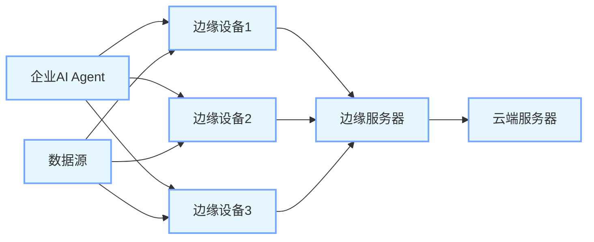

# 企业AI Agent的边缘计算资源调度策略

> 关键词：企业AI Agent、边缘计算、资源调度策略、计算资源分配、任务优先级

> 摘要：本文围绕企业AI Agent的边缘计算资源调度策略展开深入探讨。在企业应用场景中，AI Agent借助边缘计算的优势能够更高效地处理任务，但同时也面临着资源有限、调度复杂等问题。文章详细介绍了相关的核心概念、算法原理、数学模型，并通过项目实战案例展示了具体的实现过程。此外，还分析了实际应用场景，推荐了相关的工具和资源，最后对未来发展趋势与挑战进行了总结，旨在为企业在AI Agent边缘计算资源调度方面提供全面的技术指导和决策参考。

## 1. 背景介绍 
### 1.1 目的和范围
随着人工智能技术的飞速发展，企业中越来越多地引入AI Agent来处理各种复杂任务，如智能客服、数据分析、自动化流程等。同时，边缘计算作为一种新兴的计算模式，将计算和数据存储靠近数据源，能够有效减少数据传输延迟、提高系统响应速度。然而，在企业环境中，边缘计算资源通常是有限的，如何合理地调度这些资源以满足AI Agent的需求，成为了一个关键问题。

本文的目的是研究并提出有效的企业AI Agent边缘计算资源调度策略，以提高资源利用率、降低成本、提升系统性能。研究范围涵盖了从核心概念的阐述、算法原理的分析到实际应用场景的探讨，以及相关工具和资源的推荐等方面。

### 1.2 预期读者
本文主要面向企业的技术管理人员、系统架构师、AI开发人员以及对边缘计算和资源调度感兴趣的研究人员。对于希望了解如何在企业中优化AI Agent边缘计算资源使用的读者，本文将提供有价值的技术信息和实践经验。

### 1.3 文档结构概述
本文共分为十个部分。第一部分为背景介绍，阐述了研究的目的、范围、预期读者和文档结构。第二部分介绍了核心概念与联系，包括企业AI Agent、边缘计算和资源调度的原理和架构。第三部分详细讲解了核心算法原理和具体操作步骤，并给出了Python源代码示例。第四部分介绍了数学模型和公式，并进行了详细讲解和举例说明。第五部分通过项目实战，展示了代码的实际案例和详细解释。第六部分分析了实际应用场景。第七部分推荐了相关的工具和资源。第八部分总结了未来发展趋势与挑战。第九部分为附录，解答了常见问题。最后一部分提供了扩展阅读和参考资料。

### 1.4 术语表
#### 1.4.1 核心术语定义
- **企业AI Agent**：指在企业环境中运行的人工智能代理，能够自主地执行特定任务，如对话交互、数据处理、决策制定等。
- **边缘计算**：一种将计算和数据存储靠近数据源的计算模式，通过在网络边缘设备上进行数据处理，减少数据传输延迟，提高系统性能。
- **资源调度**：根据任务的需求和资源的可用性，合理地分配计算、存储和网络等资源，以实现系统的高效运行。
- **任务优先级**：用于确定任务执行顺序的指标，通常根据任务的重要性、紧急程度等因素来确定。

#### 1.4.2 相关概念解释
- **云计算**：一种基于互联网的计算模式，通过将计算资源集中在云端数据中心，提供按需使用的计算服务。与边缘计算不同，云计算的数据处理主要在远程的数据中心进行。
- **雾计算**：介于云计算和边缘计算之间的一种计算模式，将计算和数据存储分布在网络边缘和云端之间的中间节点上，以平衡数据处理和传输的需求。

#### 1.4.3 缩略词列表
- **AI**：Artificial Intelligence，人工智能
- **IoT**：Internet of Things，物联网
- **CPU**：Central Processing Unit，中央处理器
- **GPU**：Graphics Processing Unit，图形处理器
- **RAM**：Random Access Memory，随机存取存储器

## 2. 核心概念与联系 
### 核心概念原理
#### 企业AI Agent
企业AI Agent是基于人工智能技术构建的软件实体，它能够感知环境、理解任务需求，并自主地采取行动来完成任务。AI Agent通常具备以下几个关键特性：
- **自主性**：能够在没有人类干预的情况下独立地执行任务。
- **学习能力**：可以通过不断地学习和积累经验，提高自身的性能和智能水平。
- **交互性**：能够与其他Agent或人类进行交互，协同完成复杂任务。

#### 边缘计算
边缘计算的核心思想是将计算和数据存储靠近数据源，减少数据传输延迟。在边缘计算架构中，数据可以在本地的边缘设备（如传感器、网关、边缘服务器等）上进行初步处理，只将必要的数据传输到云端进行进一步分析和存储。这样可以有效降低网络带宽需求，提高系统的响应速度和可靠性。

#### 资源调度
资源调度是指在多个任务之间合理地分配计算、存储和网络等资源，以实现系统的高效运行。在企业AI Agent的边缘计算环境中，资源调度的目标是在满足任务需求的前提下，最大化资源利用率，降低成本。资源调度通常需要考虑以下几个因素：
- **任务优先级**：根据任务的重要性和紧急程度，确定任务的执行顺序。
- **资源可用性**：实时监测边缘设备的资源使用情况，确保资源分配的合理性。
- **任务特性**：不同的任务可能对计算、存储和网络资源有不同的需求，需要根据任务特性进行资源分配。

### 架构示意图

该示意图展示了企业AI Agent与边缘计算架构的关系。企业AI Agent可以将任务分配到不同的边缘设备上进行处理，边缘设备将处理结果汇总到边缘服务器，最后边缘服务器将必要的数据传输到云端服务器进行进一步分析和存储。数据源（如传感器、物联网设备等）为边缘设备提供数据输入。

## 3. 核心算法原理 & 具体操作步骤 
### 核心算法原理
在企业AI Agent的边缘计算资源调度中，常用的算法有基于任务优先级的调度算法、基于资源利用率的调度算法和基于预测的调度算法等。这里我们主要介绍基于任务优先级的调度算法。

基于任务优先级的调度算法的核心思想是根据任务的优先级来确定任务的执行顺序。优先级高的任务将优先分配资源并执行，优先级低的任务则需要等待资源空闲。具体步骤如下：
1. **任务优先级评估**：根据任务的重要性、紧急程度、截止时间等因素，为每个任务分配一个优先级。
2. **资源监测**：实时监测边缘设备的资源使用情况，包括CPU使用率、内存使用率、网络带宽等。
3. **任务调度**：按照任务优先级从高到低的顺序，依次为任务分配资源。如果当前资源不足以满足任务需求，则将任务放入等待队列。
4. **资源释放**：当任务执行完成后，释放所占用的资源，并检查等待队列中的任务是否可以分配资源。

### Python源代码实现
```python
import heapq

# 定义任务类
class Task:
    def __init__(self, id, priority, resource_demand):
        self.id = id
        self.priority = priority
        self.resource_demand = resource_demand

    def __lt__(self, other):
        # 优先级高的任务先执行
        return self.priority > other.priority

# 定义边缘设备类
class EdgeDevice:
    def __init__(self, id, total_resources):
        self.id = id
        self.total_resources = total_resources
        self.available_resources = total_resources
        self.running_tasks = []

    def allocate_resources(self, task):
        if self.available_resources >= task.resource_demand:
            self.available_resources -= task.resource_demand
            self.running_tasks.append(task)
            return True
        return False

    def release_resources(self, task):
        self.available_resources += task.resource_demand
        self.running_tasks.remove(task)

# 基于任务优先级的调度函数
def priority_based_scheduling(tasks, edge_devices):
    task_queue = []
    for task in tasks:
        heapq.heappush(task_queue, task)

    while task_queue:
        task = heapq.heappop(task_queue)
        allocated = False
        for device in edge_devices:
            if device.allocate_resources(task):
                print(f"Task {task.id} is allocated to Edge Device {device.id}")
                allocated = True
                break
        if not allocated:
            print(f"Task {task.id} cannot be allocated, waiting...")

# 示例使用
tasks = [
    Task(1, 3, 2),
    Task(2, 1, 1),
    Task(3, 2, 3)
]

edge_devices = [
    EdgeDevice(1, 5),
    EdgeDevice(2, 3)
]

priority_based_scheduling(tasks, edge_devices)
```
### 代码解释
1. **Task类**：表示一个任务，包含任务的ID、优先级和资源需求。`__lt__`方法用于定义任务的比较规则，使得优先级高的任务先被处理。
2. **EdgeDevice类**：表示一个边缘设备，包含设备的ID、总资源量、可用资源量和正在运行的任务列表。`allocate_resources`方法用于为任务分配资源，`release_resources`方法用于释放任务占用的资源。
3. **priority_based_scheduling函数**：实现了基于任务优先级的调度算法。首先将所有任务放入优先队列中，然后依次从队列中取出优先级最高的任务，尝试为其分配资源。如果所有边缘设备都无法满足任务需求，则将任务放入等待队列。

## 4. 数学模型和公式 & 详细讲解 & 举例说明 
### 数学模型
在企业AI Agent的边缘计算资源调度中，可以使用以下数学模型来描述问题：

设 $T = \{t_1, t_2, \cdots, t_n\}$ 为任务集合，其中 $t_i$ 表示第 $i$ 个任务。每个任务 $t_i$ 有一个优先级 $p_i$ 和资源需求 $r_i$。设 $D = \{d_1, d_2, \cdots, d_m\}$ 为边缘设备集合，其中 $d_j$ 表示第 $j$ 个边缘设备。每个边缘设备 $d_j$ 有总资源量 $R_j$ 和可用资源量 $A_j$。

定义决策变量 $x_{ij}$ 如下：
$$
x_{ij} = 
\begin{cases}
1, & \text{如果任务 } t_i \text{ 分配到边缘设备 } d_j \\
0, & \text{否则}
\end{cases}
$$

### 目标函数
目标是最大化任务的总优先级，即：
$$
\max \sum_{i=1}^{n} \sum_{j=1}^{m} p_i x_{ij}
$$

### 约束条件
1. **资源约束**：每个边缘设备分配的任务资源需求不能超过其可用资源量，即：
$$
\sum_{i=1}^{n} r_i x_{ij} \leq A_j, \quad j = 1, 2, \cdots, m
$$
2. **任务分配约束**：每个任务只能分配到一个边缘设备，即：
$$
\sum_{j=1}^{m} x_{ij} = 1, \quad i = 1, 2, \cdots, n
$$
3. **非负约束**：
$$
x_{ij} \geq 0, \quad i = 1, 2, \cdots, n; j = 1, 2, \cdots, m
$$

### 举例说明
假设有两个任务 $t_1$ 和 $t_2$，其优先级分别为 $p_1 = 3$ 和 $p_2 = 2$，资源需求分别为 $r_1 = 2$ 和 $r_2 = 1$。有两个边缘设备 $d_1$ 和 $d_2$，其总资源量分别为 $R_1 = 5$ 和 $R_2 = 3$，初始可用资源量分别为 $A_1 = 5$ 和 $A_2 = 3$。

根据上述数学模型，我们可以列出目标函数和约束条件：

目标函数：
$$
\max 3x_{11} + 3x_{12} + 2x_{21} + 2x_{22}
$$

约束条件：
$$
\begin{cases}
2x_{11} + x_{21} \leq 5 \\
2x_{12} + x_{22} \leq 3 \\
x_{11} + x_{12} = 1 \\
x_{21} + x_{22} = 1 \\
x_{ij} \geq 0, \quad i = 1, 2; j = 1, 2
\end{cases}
$$

通过求解上述线性规划问题，可以得到最优的任务分配方案。在这个例子中，最优方案可能是将任务 $t_1$ 分配到边缘设备 $d_1$，任务 $t_2$ 分配到边缘设备 $d_2$，此时目标函数的值最大。

## 5. 项目实战：代码实际案例和详细解释说明 
### 5.1  开发环境搭建
#### 操作系统
可以选择常见的操作系统，如Windows、Linux（如Ubuntu）或macOS。

#### Python环境
安装Python 3.6及以上版本。可以从Python官方网站（https://www.python.org/downloads/）下载并安装。

#### 依赖库
本项目需要使用`heapq`库，该库是Python标准库的一部分，无需额外安装。

### 5.2  源代码详细实现和代码解读
以下是完整的项目代码：
```python
import heapq

# 定义任务类
class Task:
    def __init__(self, id, priority, resource_demand):
        self.id = id
        self.priority = priority
        self.resource_demand = resource_demand

    def __lt__(self, other):
        # 优先级高的任务先执行
        return self.priority > other.priority

# 定义边缘设备类
class EdgeDevice:
    def __init__(self, id, total_resources):
        self.id = id
        self.total_resources = total_resources
        self.available_resources = total_resources
        self.running_tasks = []

    def allocate_resources(self, task):
        if self.available_resources >= task.resource_demand:
            self.available_resources -= task.resource_demand
            self.running_tasks.append(task)
            return True
        return False

    def release_resources(self, task):
        self.available_resources += task.resource_demand
        self.running_tasks.remove(task)

# 基于任务优先级的调度函数
def priority_based_scheduling(tasks, edge_devices):
    task_queue = []
    for task in tasks:
        heapq.heappush(task_queue, task)

    while task_queue:
        task = heapq.heappop(task_queue)
        allocated = False
        for device in edge_devices:
            if device.allocate_resources(task):
                print(f"Task {task.id} is allocated to Edge Device {device.id}")
                allocated = True
                break
        if not allocated:
            print(f"Task {task.id} cannot be allocated, waiting...")

# 示例使用
tasks = [
    Task(1, 3, 2),
    Task(2, 1, 1),
    Task(3, 2, 3)
]

edge_devices = [
    EdgeDevice(1, 5),
    EdgeDevice(2, 3)
]

priority_based_scheduling(tasks, edge_devices)
```
### 代码解读
1. **Task类**：
    - `__init__`方法：初始化任务的ID、优先级和资源需求。
    - `__lt__`方法：定义任务的比较规则，使得优先级高的任务先被处理。

2. **EdgeDevice类**：
    - `__init__`方法：初始化边缘设备的ID、总资源量和可用资源量。
    - `allocate_resources`方法：尝试为任务分配资源，如果可用资源足够，则分配资源并将任务添加到运行任务列表中。
    - `release_resources`方法：释放任务占用的资源，并从运行任务列表中移除任务。

3. **priority_based_scheduling函数**：
    - 使用`heapq`库将任务按优先级排序。
    - 依次从队列中取出优先级最高的任务，尝试为其分配资源。
    - 如果所有边缘设备都无法满足任务需求，则打印等待信息。

4. **示例使用**：
    - 创建了三个任务和两个边缘设备。
    - 调用`priority_based_scheduling`函数进行资源调度。

### 5.3  代码解读与分析
通过上述代码，我们实现了一个简单的基于任务优先级的边缘计算资源调度系统。代码的核心是`priority_based_scheduling`函数，它通过优先队列来管理任务，并根据任务的优先级依次分配资源。

优点：
- 算法简单易懂，易于实现。
- 能够保证优先级高的任务优先执行。

缺点：
- 没有考虑任务的执行时间和资源的动态变化。
- 可能会导致低优先级的任务长时间得不到执行。

在实际应用中，可以根据具体需求对算法进行改进，例如引入任务的执行时间预测、动态调整任务优先级等。

## 6. 实际应用场景 
### 智能工厂
在智能工厂中，企业AI Agent可以用于监控生产设备的运行状态、预测设备故障、优化生产流程等。边缘计算可以将数据处理和分析靠近生产设备，减少数据传输延迟，提高系统的响应速度。通过合理的资源调度策略，可以确保高优先级的任务（如设备故障预警）及时得到处理，提高生产效率和质量。

### 智能交通
在智能交通系统中，企业AI Agent可以用于交通流量监测、智能驾驶辅助、交通信号控制等。边缘计算可以在路边设备、车载设备等边缘节点上进行数据处理，减少对云端服务器的依赖。资源调度策略可以根据交通状况和任务的紧急程度，合理分配计算资源，提高交通系统的安全性和效率。

### 智能医疗
在智能医疗领域，企业AI Agent可以用于医疗影像诊断、远程医疗监测、智能健康管理等。边缘计算可以在医疗设备（如影像设备、可穿戴设备等）上进行数据处理，保护患者隐私，同时提高诊断效率。资源调度策略可以确保关键医疗任务（如紧急诊断）优先得到处理，保障患者的生命安全。

### 智能家居
在智能家居系统中，企业AI Agent可以用于家庭设备的智能控制、能源管理、安全监控等。边缘计算可以在家庭网关、智能插座等边缘设备上进行数据处理，实现本地智能决策。资源调度策略可以根据用户的需求和设备的状态，合理分配计算资源，提高家居生活的舒适度和便利性。

## 7. 工具和资源推荐
### 7.1 学习资源推荐
#### 7.1.1 书籍推荐
- 《人工智能：一种现代的方法》（Artificial Intelligence: A Modern Approach）：这是一本经典的人工智能教材，涵盖了人工智能的各个领域，包括知识表示、推理、搜索、机器学习等。
- 《边缘计算：原理与实践》：详细介绍了边缘计算的概念、架构、技术和应用场景，对于理解边缘计算的原理和实践具有重要的参考价值。
- 《Python人工智能编程》：介绍了如何使用Python实现人工智能算法，包括机器学习、深度学习、自然语言处理等方面的内容。

#### 7.1.2 在线课程
- Coursera上的“人工智能基础”课程：由知名高校的教授授课，系统地介绍了人工智能的基本概念、算法和应用。
- edX上的“边缘计算技术与应用”课程：深入讲解了边缘计算的技术原理和实际应用，通过案例分析和实验操作，帮助学员掌握边缘计算的开发和应用技能。
- 阿里云开发者社区的“Python编程入门”课程：适合初学者学习Python编程，为后续学习人工智能和边缘计算打下基础。

#### 7.1.3 技术博客和网站
- Medium：上面有很多关于人工智能、边缘计算和资源调度的技术文章，作者来自世界各地的技术专家和开发者。
- 开源中国：提供了丰富的开源项目和技术文章，涵盖了人工智能、边缘计算等多个领域。
- 知乎：可以在上面搜索相关的技术问题和讨论，了解行业动态和最新技术趋势。

### 7.2 开发工具框架推荐
#### 7.2.1 IDE和编辑器
- PyCharm：一款专业的Python集成开发环境，提供了丰富的代码编辑、调试、测试等功能，适合Python开发。
- Visual Studio Code：一款轻量级的代码编辑器，支持多种编程语言，具有丰富的插件生态系统，可以方便地进行人工智能和边缘计算开发。

#### 7.2.2 调试和性能分析工具
- Py-Spy：一个用于Python程序的性能分析工具，可以实时监测程序的CPU使用率、内存使用率等指标，帮助开发者找出性能瓶颈。
- cProfile：Python标准库中的性能分析模块，可以对Python程序进行详细的性能分析，输出函数调用时间、调用次数等信息。

#### 7.2.3 相关框架和库
- TensorFlow：一个开源的机器学习框架，提供了丰富的工具和库，用于构建和训练深度学习模型。
- PyTorch：另一个流行的深度学习框架，具有简洁易用的接口和高效的计算性能，广泛应用于学术界和工业界。
- EdgeX Foundry：一个开源的边缘计算框架，提供了设备管理、数据采集、规则引擎等功能，方便开发者快速构建边缘计算应用。

### 7.3 相关论文著作推荐
#### 7.3.1 经典论文
- “A Survey on Edge Computing: Vision, Challenges, and Opportunities”：对边缘计算的概念、架构、技术和应用进行了全面的综述，是边缘计算领域的经典论文之一。
- “Task Offloading and Resource Allocation in Mobile Edge Computing: A Tutorial”：详细介绍了移动边缘计算中的任务卸载和资源分配问题，包括算法设计、数学模型和性能分析等方面的内容。

#### 7.3.2 最新研究成果
- 可以关注IEEE Transactions on Mobile Computing、ACM Transactions on Sensor Networks等学术期刊，以及ACM MobiCom、IEEE INFOCOM等学术会议，了解边缘计算和资源调度领域的最新研究成果。

#### 7.3.3 应用案例分析
- 可以参考华为、阿里云等公司的技术博客和白皮书，了解他们在边缘计算和人工智能领域的应用案例和实践经验。

## 8. 总结：未来发展趋势与挑战
### 未来发展趋势
#### 融合发展
企业AI Agent和边缘计算将与物联网、云计算、大数据等技术进一步融合，形成更加复杂和智能的系统。例如，通过物联网设备收集大量的数据，利用边缘计算进行实时处理和分析，再将结果反馈给企业AI Agent进行决策和控制。

#### 智能化升级
随着人工智能技术的不断发展，企业AI Agent将具备更强的学习能力和智能决策能力。边缘计算也将更加智能化，能够自动调整资源分配策略，以适应不同的任务需求和环境变化。

#### 安全与隐私保护
在企业AI Agent和边缘计算的应用中，安全和隐私保护将变得越来越重要。未来的技术将更加注重数据的加密、访问控制和身份认证等方面的研究，以确保数据的安全性和隐私性。

### 挑战
#### 资源管理复杂性
随着企业AI Agent和边缘计算的应用规模不断扩大，资源管理的复杂性也将增加。如何在大规模的边缘设备和任务之间进行高效的资源调度，是一个亟待解决的问题。

#### 通信可靠性
边缘计算依赖于边缘设备和云端服务器之间的通信，通信可靠性将直接影响系统的性能和稳定性。在复杂的网络环境中，如何保证通信的可靠性和低延迟，是一个挑战。

#### 标准和规范缺乏
目前，企业AI Agent和边缘计算领域还缺乏统一的标准和规范。这使得不同厂商的设备和系统之间难以互操作，限制了技术的推广和应用。

## 9. 附录：常见问题与解答
### 问题1：企业AI Agent和边缘计算有什么关系？
答：企业AI Agent可以利用边缘计算的优势，将任务处理靠近数据源，减少数据传输延迟，提高系统响应速度。边缘计算为企业AI Agent提供了分布式的计算资源，使得AI Agent能够更高效地处理任务。

### 问题2：如何确定任务的优先级？
答：任务的优先级可以根据任务的重要性、紧急程度、截止时间等因素来确定。例如，对于智能工厂中的设备故障预警任务，由于其对生产安全和效率影响较大，可以将其优先级设置为较高。

### 问题3：基于任务优先级的调度算法有什么局限性？
答：基于任务优先级的调度算法没有考虑任务的执行时间和资源的动态变化，可能会导致低优先级的任务长时间得不到执行。在实际应用中，可以结合其他算法（如基于预测的调度算法）来改进。

### 问题4：如何提高边缘计算的通信可靠性？
答：可以采用多种技术来提高边缘计算的通信可靠性，如使用冗余通信链路、采用无线通信技术（如5G）、优化通信协议等。同时，还可以通过数据缓存和重传机制来应对通信故障。

### 问题5：企业AI Agent和边缘计算在安全方面有哪些挑战？
答：企业AI Agent和边缘计算在安全方面面临着数据泄露、恶意攻击、身份认证等挑战。为了保障安全，需要采用数据加密、访问控制、入侵检测等技术手段，同时加强安全管理和监控。

## 10. 扩展阅读 & 参考资料
### 扩展阅读
- 《智能系统原理与设计》：深入介绍了智能系统的原理和设计方法，对于理解企业AI Agent的工作原理和设计思路有很大帮助。
- 《云计算与分布式系统：从并行处理到物联网》：详细讲解了云计算和分布式系统的相关知识，包括架构、算法、应用等方面的内容。

### 参考资料
- [Edge Computing Consortium](https://www.edgecomputingconsortium.org/)：边缘计算领域的权威组织，提供了丰富的技术资料和行业动态。
- [IEEE Xplore](https://ieeexplore.ieee.org/)：IEEE的数字图书馆，包含了大量的学术论文和技术报告，对于了解边缘计算和人工智能领域的最新研究成果有很大帮助。

作者：AI天才研究院/AI Genius Institute & 禅与计算机程序设计艺术 /Zen And The Art of Computer Programming