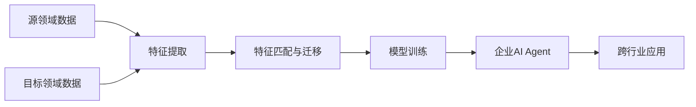

# 企业AI Agent的迁移学习在跨行业应用中的实践

> 关键词：企业AI Agent、迁移学习、跨行业应用、模型训练、知识迁移

> 摘要：本文聚焦于企业AI Agent的迁移学习在跨行业应用中的实践。首先介绍了相关背景，包括目的、预期读者等内容。接着阐述了核心概念与联系，详细讲解了迁移学习和企业AI Agent的原理及架构，并给出了相应的Mermaid流程图。然后深入探讨了核心算法原理和具体操作步骤，用Python代码进行了详细说明。同时给出了相关的数学模型和公式，并举例说明。通过项目实战展示了代码实际案例及详细解释。分析了实际应用场景，推荐了相关的工具和资源。最后总结了未来发展趋势与挑战，解答了常见问题并提供了扩展阅读和参考资料，旨在为企业在跨行业应用中利用迁移学习优化AI Agent提供全面的指导。

## 1. 背景介绍 
### 1.1 目的和范围
随着人工智能技术的飞速发展，企业AI Agent在各个行业的应用越来越广泛。然而，为每个行业单独训练一个AI Agent往往需要大量的时间、数据和计算资源。迁移学习作为一种有效的技术手段，可以将在一个领域学到的知识迁移到另一个领域，从而加速模型的训练过程，提高模型的性能。本文的目的在于探讨企业AI Agent的迁移学习在跨行业应用中的实践方法和策略，为企业在不同行业中快速部署和优化AI Agent提供参考。

本文的范围涵盖了迁移学习的基本原理、核心算法、数学模型，以及在跨行业应用中的项目实战案例。同时，还会介绍相关的工具和资源，以及未来的发展趋势和挑战。

### 1.2 预期读者
本文的预期读者包括企业的技术决策者、AI研发人员、数据科学家，以及对人工智能和迁移学习感兴趣的专业人士。对于技术决策者来说，本文可以帮助他们了解迁移学习在跨行业应用中的价值和潜力，为企业的技术战略提供参考；对于AI研发人员和数据科学家来说，本文提供了详细的算法原理、代码实现和项目实战案例，有助于他们在实际项目中应用迁移学习技术；对于对人工智能和迁移学习感兴趣的专业人士来说，本文可以作为一个入门指南，帮助他们了解相关的基本概念和应用场景。

### 1.3 文档结构概述
本文的文档结构如下：
- 核心概念与联系：介绍迁移学习和企业AI Agent的核心概念，以及它们之间的联系，并给出相应的文本示意图和Mermaid流程图。
- 核心算法原理 & 具体操作步骤：详细讲解迁移学习的核心算法原理，并用Python代码实现具体的操作步骤。
- 数学模型和公式 & 详细讲解 & 举例说明：给出迁移学习的数学模型和公式，并通过具体的例子进行详细说明。
- 项目实战：代码实际案例和详细解释说明：通过一个实际的项目案例，展示迁移学习在跨行业应用中的具体实现过程，并对代码进行详细的解读和分析。
- 实际应用场景：分析迁移学习在不同行业中的实际应用场景。
- 工具和资源推荐：推荐相关的学习资源、开发工具框架和论文著作。
- 总结：未来发展趋势与挑战：总结迁移学习在跨行业应用中的未来发展趋势和面临的挑战。
- 附录：常见问题与解答：解答读者在阅读本文过程中可能遇到的常见问题。
- 扩展阅读 & 参考资料：提供相关的扩展阅读材料和参考资料。

### 1.4 术语表
#### 1.4.1 核心术语定义
- **企业AI Agent**：是指企业为了实现特定的业务目标而开发的人工智能代理程序，它可以自主地感知环境、做出决策并执行相应的任务。
- **迁移学习**：是一种机器学习技术，它将在一个领域（源领域）中学习到的知识迁移到另一个领域（目标领域）中，以提高目标领域的学习效率和性能。
- **源领域**：是指迁移学习中提供知识的领域，通常是一个数据丰富、模型训练较为成熟的领域。
- **目标领域**：是指迁移学习中接收知识的领域，通常是一个数据相对较少、需要快速建立模型的领域。

#### 1.4.2 相关概念解释
- **特征迁移**：是迁移学习的一种常见方法，它通过提取源领域和目标领域的共同特征，将源领域的特征表示迁移到目标领域中。
- **模型迁移**：是指将在源领域中训练好的模型直接应用到目标领域中，或者对源领域的模型进行微调以适应目标领域的需求。
- **对抗迁移学习**：是一种基于对抗学习的迁移学习方法，它通过引入对抗机制，使得源领域和目标领域的数据分布更加接近，从而提高迁移学习的性能。

#### 1.4.3 缩略词列表
- **ML**：Machine Learning，机器学习
- **DL**：Deep Learning，深度学习
- **CNN**：Convolutional Neural Network，卷积神经网络
- **RNN**：Recurrent Neural Network，循环神经网络

## 2. 核心概念与联系 

### 2.1 迁移学习原理
迁移学习的核心思想是利用源领域和目标领域之间的相似性，将源领域中学习到的知识迁移到目标领域中。源领域和目标领域通常具有不同的数据集和任务，但它们可能共享一些潜在的特征或模式。迁移学习通过挖掘这些相似性，使得在目标领域中可以利用源领域的知识来加速模型的训练过程，提高模型的性能。

### 2.2 企业AI Agent原理
企业AI Agent是一种基于人工智能技术的智能代理程序，它可以自主地感知环境、做出决策并执行相应的任务。企业AI Agent通常由感知模块、决策模块和执行模块组成。感知模块用于收集环境信息，决策模块根据感知到的信息做出决策，执行模块则根据决策结果执行相应的任务。

### 2.3 迁移学习与企业AI Agent的联系
迁移学习可以为企业AI Agent在跨行业应用中提供有效的支持。通过迁移学习，企业AI Agent可以利用在一个行业中学习到的知识，快速适应另一个行业的需求。例如，在金融行业中训练好的AI Agent可以通过迁移学习将其知识迁移到医疗行业中，从而在医疗行业中快速建立起有效的模型。

### 2.4 文本示意图
```plaintext
源领域（数据丰富、模型成熟）
    |
    | 知识迁移
    v
目标领域（数据较少、需快速建模）
    |
    | 应用于
    v
企业AI Agent
```

### 2.5 Mermaid流程图


## 3. 核心算法原理 & 具体操作步骤 

### 3.1 核心算法原理
迁移学习有多种算法，这里以基于特征迁移的算法为例进行介绍。该算法的核心思想是提取源领域和目标领域的共同特征，然后将源领域的特征表示迁移到目标领域中。具体步骤如下：
1. **特征提取**：分别从源领域和目标领域的数据中提取特征。
2. **特征匹配**：找到源领域和目标领域特征之间的对应关系。
3. **特征迁移**：将源领域的特征表示迁移到目标领域中。
4. **模型训练**：在目标领域中使用迁移后的特征进行模型训练。

### 3.2 具体操作步骤及Python代码实现

```python
import numpy as np
from sklearn.feature_extraction.text import TfidfVectorizer
from sklearn.linear_model import LogisticRegression
from sklearn.model_selection import train_test_split

# 模拟源领域和目标领域的数据
source_data = ["This is a source sentence 1", "Another source sentence 2"]
source_labels = [0, 1]
target_data = ["This is a target sentence 1", "Another target sentence 2"]
target_labels = [0, 1]

# 步骤1：特征提取
vectorizer = TfidfVectorizer()
source_features = vectorizer.fit_transform(source_data)
target_features = vectorizer.transform(target_data)

# 步骤2：特征匹配（这里简化为直接使用相同的特征提取器）
# 步骤3：特征迁移（这里特征已经通过相同的提取器进行了迁移）

# 步骤4：模型训练
X_train, X_test, y_train, y_test = train_test_split(target_features, target_labels, test_size=0.2, random_state=42)
model = LogisticRegression()
model.fit(X_train, y_train)

# 评估模型
accuracy = model.score(X_test, y_test)
print(f"模型准确率: {accuracy}")
```

### 3.3 代码解释
- **特征提取**：使用`TfidfVectorizer`对源领域和目标领域的数据进行特征提取，将文本数据转换为数值特征。
- **特征匹配与迁移**：通过使用相同的`TfidfVectorizer`，实现了特征的匹配和迁移。
- **模型训练**：使用逻辑回归模型在目标领域的特征上进行训练，并评估模型的准确率。

## 4. 数学模型和公式 & 详细讲解 & 举例说明 

### 4.1 数学模型
假设源领域的数据集为 $D_s = \{(x_{s1}, y_{s1}), (x_{s2}, y_{s2}), \cdots, (x_{sn}, y_{sn})\}$，目标领域的数据集为 $D_t = \{(x_{t1}, y_{t1}), (x_{t2}, y_{t2}), \cdots, (x_{tm}, y_{tm})\}$，其中 $x_{si}$ 和 $x_{tj}$ 分别是源领域和目标领域的样本特征，$y_{si}$ 和 $y_{tj}$ 分别是对应的标签。

迁移学习的目标是找到一个映射函数 $f: X_s \to X_t$，将源领域的特征 $X_s$ 映射到目标领域的特征 $X_t$，使得在目标领域上的损失函数 $L_t$ 最小化。

### 4.2 损失函数
常见的损失函数可以表示为：

$$L_t = \sum_{i=1}^{m} L(y_{ti}, f(x_{ti})) + \lambda \cdot R(f)$$

其中，$L(y_{ti}, f(x_{ti}))$ 是目标领域的预测损失，$R(f)$ 是正则化项，$\lambda$ 是正则化系数。

### 4.3 详细讲解
- **预测损失**：$L(y_{ti}, f(x_{ti}))$ 衡量了模型在目标领域上的预测误差，常见的预测损失函数包括交叉熵损失、均方误差损失等。
- **正则化项**：$R(f)$ 用于防止模型过拟合，常见的正则化项包括 $L_1$ 正则化和 $L_2$ 正则化。
- **正则化系数**：$\lambda$ 控制了正则化项的权重，需要通过实验进行调整。

### 4.4 举例说明
假设我们使用逻辑回归模型进行分类任务，预测损失函数为交叉熵损失：

$$L(y_{ti}, f(x_{ti})) = -y_{ti} \log(f(x_{ti})) - (1 - y_{ti}) \log(1 - f(x_{ti}))$$

正则化项为 $L_2$ 正则化：

$$R(f) = \sum_{j=1}^{d} w_j^2$$

其中，$w_j$ 是模型的权重参数，$d$ 是特征的维度。

则损失函数可以表示为：

$$L_t = \sum_{i=1}^{m} [-y_{ti} \log(f(x_{ti})) - (1 - y_{ti}) \log(1 - f(x_{ti}))] + \lambda \cdot \sum_{j=1}^{d} w_j^2$$

通过最小化这个损失函数，可以得到最优的模型参数。

## 5. 项目实战：代码实际案例和详细解释说明 

### 5.1  开发环境搭建
- **操作系统**：Windows 10、Linux（如Ubuntu）或 macOS
- **Python版本**：Python 3.7及以上
- **开发工具**：可以使用Jupyter Notebook、PyCharm等
- **所需库**：安装`numpy`、`pandas`、`scikit-learn`、`tensorflow`或`pytorch`等库。可以使用以下命令进行安装：
```bash
pip install numpy pandas scikit-learn tensorflow
```

### 5.2  源代码详细实现和代码解读
下面是一个使用TensorFlow实现的基于迁移学习的图像分类项目示例：

```python
import tensorflow as tf
from tensorflow.keras.applications import VGG16
from tensorflow.keras.layers import Dense, GlobalAveragePooling2D
from tensorflow.keras.models import Model
from tensorflow.keras.preprocessing.image import ImageDataGenerator

# 步骤1：加载预训练模型
base_model = VGG16(weights='imagenet', include_top=False, input_shape=(224, 224, 3))

# 步骤2：冻结预训练模型的层
for layer in base_model.layers:
    layer.trainable = False

# 步骤3：添加自定义层
x = base_model.output
x = GlobalAveragePooling2D()(x)
x = Dense(128, activation='relu')(x)
predictions = Dense(2, activation='softmax')(x)

# 步骤4：构建新模型
model = Model(inputs=base_model.input, outputs=predictions)

# 步骤5：编译模型
model.compile(optimizer='adam', loss='categorical_crossentropy', metrics=['accuracy'])

# 步骤6：数据预处理
train_datagen = ImageDataGenerator(rescale=1./255, shear_range=0.2, zoom_range=0.2, horizontal_flip=True)
test_datagen = ImageDataGenerator(rescale=1./255)

train_generator = train_datagen.flow_from_directory('train_data_dir', target_size=(224, 224), batch_size=32, class_mode='categorical')
test_generator = test_datagen.flow_from_directory('test_data_dir', target_size=(224, 224), batch_size=32, class_mode='categorical')

# 步骤7：训练模型
model.fit(train_generator, steps_per_epoch=train_generator.samples // train_generator.batch_size, epochs=10, validation_data=test_generator, validation_steps=test_generator.samples // test_generator.batch_size)
```

### 5.3  代码解读与分析
- **加载预训练模型**：使用`VGG16`模型，该模型在ImageNet数据集上进行了预训练。`include_top=False`表示不包含模型的全连接层，因为我们要根据自己的任务添加自定义层。
- **冻结预训练模型的层**：通过将`layer.trainable = False`，可以防止在训练过程中更新预训练模型的权重，从而加快训练速度。
- **添加自定义层**：在预训练模型的基础上添加了全局平均池化层、全连接层和输出层，以适应我们的图像分类任务。
- **构建新模型**：将预训练模型的输入和自定义层的输出组合成一个新的模型。
- **编译模型**：使用`adam`优化器和`categorical_crossentropy`损失函数进行模型编译。
- **数据预处理**：使用`ImageDataGenerator`对训练数据和测试数据进行预处理，包括图像缩放、裁剪、翻转等操作，以增加数据的多样性。
- **训练模型**：使用`fit`方法对模型进行训练，并在验证集上进行验证。

## 6. 实际应用场景 
### 6.1 金融行业到医疗行业的迁移
在金融行业中，AI Agent可以用于风险评估、信用评分等任务。这些任务需要处理大量的结构化数据和文本数据。在医疗行业中，也存在着类似的数据处理需求，例如疾病预测、医疗影像分析等。通过迁移学习，可以将金融行业中训练好的AI Agent的知识迁移到医疗行业中，快速建立起有效的模型。

### 6.2 制造业到服务业的迁移
制造业中的AI Agent可以用于生产过程监控、质量检测等任务。这些任务需要对传感器数据进行分析和处理。在服务业中，例如物流行业，也需要对运输过程中的数据进行监控和管理。通过迁移学习，可以将制造业中AI Agent的知识迁移到服务业中，提高服务效率和质量。

### 6.3 教育行业到电商行业的迁移
教育行业中的AI Agent可以用于智能辅导、学习评估等任务。这些任务需要对学生的学习数据进行分析和挖掘。在电商行业中，也需要对用户的购买行为数据进行分析和推荐。通过迁移学习，可以将教育行业中AI Agent的知识迁移到电商行业中，提高电商平台的用户体验和销售转化率。

## 7. 工具和资源推荐
### 7.1 学习资源推荐
#### 7.1.1 书籍推荐
- 《深度学习》（Deep Learning）：由Ian Goodfellow、Yoshua Bengio和Aaron Courville所著，是深度学习领域的经典教材，涵盖了深度学习的基本原理、算法和应用。
- 《迁移学习》（Transfer Learning）：由Sinno Jialin Pan和Qiang Yang所著，是迁移学习领域的权威书籍，详细介绍了迁移学习的理论和方法。
- 《Python机器学习》（Python Machine Learning）：由Sebastian Raschka所著，通过Python代码实现了各种机器学习算法，适合初学者入门。

#### 7.1.2 在线课程
- Coursera上的“深度学习专项课程”（Deep Learning Specialization）：由Andrew Ng教授授课，包括神经网络和深度学习、改善深层神经网络、结构化机器学习项目等课程。
- edX上的“迁移学习”（Transfer Learning）：介绍了迁移学习的基本概念、算法和应用。
- 网易云课堂上的“Python机器学习实战”：通过实际案例讲解Python在机器学习中的应用。

#### 7.1.3 技术博客和网站
- Medium：有很多关于人工智能和迁移学习的优质博客文章。
- Towards Data Science：专注于数据科学和机器学习领域的技术博客。
- arXiv：提供了大量的学术论文，包括迁移学习领域的最新研究成果。

### 7.2 开发工具框架推荐
#### 7.2.1 IDE和编辑器
- PyCharm：是一款专门为Python开发设计的集成开发环境，具有强大的代码编辑、调试和项目管理功能。
- Jupyter Notebook：是一个交互式的开发环境，适合进行数据分析和模型实验。
- Visual Studio Code：是一款轻量级的代码编辑器，支持多种编程语言，有丰富的插件扩展。

#### 7.2.2 调试和性能分析工具
- TensorBoard：是TensorFlow提供的可视化工具，可以用于查看模型的训练过程、损失曲线、准确率等信息。
- PyTorch Profiler：是PyTorch提供的性能分析工具，可以帮助开发者找出代码中的性能瓶颈。
- Scikit-learn的GridSearchCV：可以用于模型调优，通过网格搜索找到最优的模型参数。

#### 7.2.3 相关框架和库
- TensorFlow：是一个开源的深度学习框架，提供了丰富的工具和库，支持迁移学习的实现。
- PyTorch：是另一个流行的深度学习框架，具有简洁易用的API，适合快速开发和实验。
- Scikit-learn：是一个常用的机器学习库，提供了各种机器学习算法和工具，方便进行数据预处理、模型训练和评估。

### 7.3 相关论文著作推荐
#### 7.3.1 经典论文
- “A Survey on Transfer Learning”：由Sinno Jialin Pan和Qiang Yang发表，是迁移学习领域的经典综述论文，对迁移学习的发展历程、方法和应用进行了全面的总结。
- “Domain Adaptation via Transfer Component Analysis”：提出了一种基于迁移成分分析的领域自适应方法，在迁移学习中得到了广泛的应用。
- “Deep Domain Confusion: Maximizing for Domain Invariance”：介绍了一种基于深度神经网络的领域自适应方法，通过引入领域混淆损失来提高模型的泛化能力。

#### 7.3.2 最新研究成果
- 关注arXiv上的最新论文，例如关于基于元学习的迁移学习、基于强化学习的迁移学习等方面的研究。
- 参加国际机器学习会议（ICML）、神经信息处理系统大会（NeurIPS）等顶级学术会议，了解迁移学习领域的最新研究动态。

#### 7.3.3 应用案例分析
- 一些知名企业的技术博客会分享他们在迁移学习方面的应用案例，例如Google、Facebook、Microsoft等公司的博客。
- 相关的学术期刊和会议论文集也会发表一些迁移学习在实际应用中的案例分析，例如ACM Transactions on Intelligent Systems and Technology、IEEE Transactions on Neural Networks and Learning Systems等。

## 8. 总结：未来发展趋势与挑战
### 8.1 未来发展趋势
- **更广泛的跨行业应用**：随着迁移学习技术的不断发展，企业AI Agent的迁移学习将在更多的行业中得到应用，实现知识的快速共享和复用。
- **与其他技术的融合**：迁移学习将与强化学习、元学习等技术相结合，进一步提高模型的学习能力和适应性。
- **自动化迁移学习**：开发自动化的迁移学习工具和平台，降低迁移学习的使用门槛，让更多的企业和开发者能够受益于迁移学习技术。

### 8.2 挑战
- **领域差异问题**：不同行业之间的领域差异较大，如何有效地处理这些差异，提高迁移学习的性能，是一个亟待解决的问题。
- **数据隐私和安全问题**：在迁移学习过程中，需要共享和使用不同领域的数据，这可能会涉及到数据隐私和安全问题，需要采取相应的措施来保护数据的安全。
- **模型可解释性问题**：迁移学习模型往往比较复杂，其决策过程难以解释，如何提高模型的可解释性，让用户更好地理解模型的决策依据，是一个重要的挑战。

## 9. 附录：常见问题与解答
### 9.1 迁移学习一定能提高目标领域的模型性能吗？
不一定。迁移学习的效果取决于源领域和目标领域之间的相似性、数据质量、模型选择等因素。如果源领域和目标领域差异较大，或者迁移学习的方法不当，可能会导致模型性能下降。

### 9.2 如何选择合适的源领域？
选择合适的源领域需要考虑以下因素：
- 相似性：源领域和目标领域应该具有一定的相似性，例如数据类型、任务类型等。
- 数据丰富度：源领域应该有足够的数据来训练一个有效的模型。
- 模型性能：源领域的模型性能应该较好，这样才能提供有价值的知识。

### 9.3 迁移学习需要多少目标领域的数据？
迁移学习可以在目标领域数据较少的情况下使用，但具体需要多少数据取决于源领域和目标领域之间的相似性、迁移学习的方法等因素。一般来说，目标领域的数据越多，迁移学习的效果越好。

## 10. 扩展阅读 & 参考资料
### 10.1 扩展阅读
- 《人工智能：现代方法》（Artificial Intelligence: A Modern Approach）：全面介绍了人工智能的基本概念、算法和应用。
- 《机器学习实战》（Machine Learning in Action）：通过实际案例讲解机器学习算法的实现和应用。
- 《深度学习实战》（Deep Learning in Practice）：介绍了深度学习在图像识别、自然语言处理等领域的实际应用。

### 10.2 参考资料
- TensorFlow官方文档：https://www.tensorflow.org/
- PyTorch官方文档：https://pytorch.org/
- Scikit-learn官方文档：https://scikit-learn.org/

作者：AI天才研究院/AI Genius Institute & 禅与计算机程序设计艺术 /Zen And The Art of Computer Programming