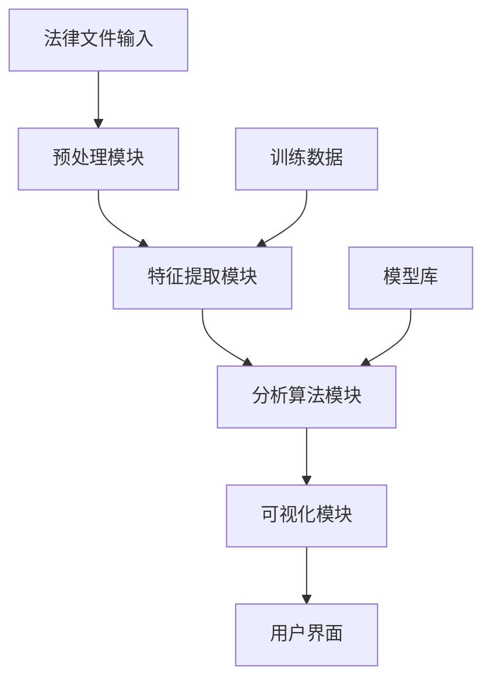

# 企业估值中的AI驱动的法律文件分析平台评估

> 关键词：企业估值、AI驱动、法律文件分析平台、评估方法、数据驱动决策

> 摘要：本文聚焦于企业估值中AI驱动的法律文件分析平台的评估。首先介绍了相关背景，包括目的、预期读者等内容。接着阐述了核心概念与联系，深入剖析AI驱动法律文件分析平台的原理和架构。详细讲解了核心算法原理及具体操作步骤，给出Python代码示例。通过数学模型和公式进一步说明评估的理论基础，并举例说明。结合项目实战，展示开发环境搭建、源代码实现与解读。探讨了该平台的实际应用场景，推荐了相关工具和资源。最后总结未来发展趋势与挑战，解答常见问题并提供扩展阅读和参考资料，旨在为企业准确评估AI驱动的法律文件分析平台价值提供全面的技术和理论支持。

## 1. 背景介绍 
### 1.1 目的和范围
在当今数字化和智能化快速发展的时代，企业面临着海量的法律文件处理和分析需求。AI驱动的法律文件分析平台应运而生，它能够高效、准确地处理法律文本，提取关键信息，为企业的决策提供有力支持。本文章的目的在于深入探讨如何对这类平台进行评估，以确定其在企业估值中的价值。范围涵盖了平台的技术原理、算法、数学模型、实际应用等多个方面，旨在为企业和投资者提供全面、科学的评估方法和思路。

### 1.2 预期读者
本文的预期读者包括企业管理人员、投资机构分析师、法律专业人士、技术研发人员以及对企业估值和AI技术应用感兴趣的相关人员。企业管理人员可以通过本文了解如何评估AI驱动的法律文件分析平台，以便在企业决策中合理利用该平台；投资机构分析师可以借助本文的评估方法，对相关企业进行准确估值；法律专业人士可以了解AI技术在法律文件处理中的应用和评估要点；技术研发人员可以从本文中获取平台技术原理和算法的相关知识，为进一步研发提供参考。

### 1.3 文档结构概述
本文将按照以下结构进行阐述：首先介绍背景信息，包括目的、预期读者和文档结构概述等。接着详细讲解核心概念与联系，包括平台的原理和架构。然后阐述核心算法原理及具体操作步骤，给出Python代码示例。再通过数学模型和公式进一步说明评估的理论基础，并举例说明。结合项目实战，展示开发环境搭建、源代码实现与解读。探讨该平台的实际应用场景，推荐相关工具和资源。最后总结未来发展趋势与挑战，解答常见问题并提供扩展阅读和参考资料。

### 1.4 术语表
#### 1.4.1 核心术语定义
- **企业估值**：指对企业的价值进行评估和估算的过程，通常基于企业的财务状况、市场前景、技术实力等多个因素。
- **AI驱动**：指利用人工智能技术来实现系统的功能和决策，包括机器学习、自然语言处理、深度学习等技术。
- **法律文件分析平台**：指专门用于处理和分析法律文件的软件系统，能够对法律文本进行解析、提取关键信息、进行法律风险评估等操作。
- **评估**：指对某个对象的价值、性能、质量等方面进行评价和判断的过程。

#### 1.4.2 相关概念解释
- **机器学习**：是一门多领域交叉学科，涉及概率论、统计学、逼近论、凸分析、算法复杂度理论等多门学科。它专门研究计算机怎样模拟或实现人类的学习行为，以获取新的知识或技能，重新组织已有的知识结构使之不断改善自身的性能。
- **自然语言处理**：是计算机科学领域与人工智能领域中的一个重要方向。它研究能实现人与计算机之间用自然语言进行有效通信的各种理论和方法，包括文本分类、信息提取、机器翻译等任务。
- **深度学习**：是机器学习的一个分支领域，它是一种基于对数据进行表征学习的方法。深度学习通过构建具有很多层的神经网络模型，自动从大量数据中学习特征和模式。

#### 1.4.3 缩略词列表
- **NLP**：Natural Language Processing，自然语言处理
- **ML**：Machine Learning，机器学习
- **DL**：Deep Learning，深度学习

## 2. 核心概念与联系 

### 2.1 AI驱动的法律文件分析平台原理
AI驱动的法律文件分析平台主要基于自然语言处理（NLP）和机器学习（ML）技术。其基本原理是将法律文件作为输入，通过一系列的处理步骤，提取出有用的信息并进行分析。

首先，对法律文件进行预处理，包括文本清洗、分词、词性标注等操作，将文本转换为计算机能够处理的格式。然后，利用机器学习算法对预处理后的文本进行特征提取，例如提取关键词、实体、关系等。接着，根据提取的特征，使用分类、聚类、预测等算法对法律文件进行分析，例如判断法律文件的类型、识别法律风险等。最后，将分析结果以可视化的方式呈现给用户，方便用户进行决策。

### 2.2 平台架构
以下是AI驱动的法律文件分析平台的架构示意图：



- **预处理模块**：负责对法律文件进行清洗、分词、词性标注等操作，将文本转换为适合后续处理的格式。
- **特征提取模块**：利用机器学习算法从预处理后的文本中提取关键词、实体、关系等特征。
- **分析算法模块**：根据提取的特征，使用分类、聚类、预测等算法对法律文件进行分析。
- **可视化模块**：将分析结果以图表、报表等可视化的方式呈现给用户。
- **用户界面**：提供用户与平台交互的接口，方便用户上传法律文件、查看分析结果等。
- **训练数据**：用于训练机器学习模型，提高模型的准确性和性能。
- **模型库**：存储训练好的机器学习模型，供分析算法模块调用。

### 2.3 各模块之间的联系
各模块之间相互协作，形成一个完整的处理流程。预处理模块为特征提取模块提供经过清洗和转换的文本数据；特征提取模块从预处理后的数据中提取有用的特征，为分析算法模块提供输入；分析算法模块根据提取的特征进行分析，并将结果传递给可视化模块；可视化模块将分析结果以直观的方式呈现给用户；用户通过用户界面与平台进行交互，上传法律文件并查看分析结果。同时，训练数据用于训练模型库中的模型，模型库中的模型为分析算法模块提供支持，形成一个闭环的系统。

## 3. 核心算法原理 & 具体操作步骤 

### 3.1 文本预处理算法
文本预处理是法律文件分析的第一步，主要包括文本清洗、分词、词性标注等操作。以下是使用Python实现的文本预处理代码示例：

```python
import re
import jieba
import jieba.posseg as pseg

def text_cleaning(text):
    # 去除特殊字符
    text = re.sub(r'[^\u4e00-\u9fa5a-zA-Z0-9]', ' ', text)
    # 去除多余空格
    text = re.sub(r'\s+', ' ', text)
    return text.strip()

def tokenize(text):
    # 使用jieba进行分词
    return jieba.lcut(text)

def pos_tagging(tokens):
    # 使用jieba进行词性标注
    return pseg.cut(''.join(tokens))

# 示例文本
text = "这是一份法律文件，包含了很多重要信息。"
cleaned_text = text_cleaning(text)
tokens = tokenize(cleaned_text)
pos_tags = pos_tagging(tokens)

for word, tag in pos_tags:
    print(f"{word}: {tag}")
```

### 3.2 特征提取算法
特征提取是从预处理后的文本中提取有用信息的过程，常用的特征包括关键词、实体、关系等。以下是使用TF-IDF算法提取关键词的Python代码示例：

```python
from sklearn.feature_extraction.text import TfidfVectorizer

def extract_keywords(texts, top_n=10):
    vectorizer = TfidfVectorizer()
    tfidf_matrix = vectorizer.fit_transform(texts)
    feature_names = vectorizer.get_feature_names_out()
    doc = tfidf_matrix[0]
    feature_index = doc.nonzero()[1]
    tfidf_scores = zip(feature_index, [doc[0, x] for x in feature_index])
    sorted_scores = sorted(tfidf_scores, key=lambda x: x[1], reverse=True)
    top_keywords = [feature_names[i] for i, score in sorted_scores[:top_n]]
    return top_keywords

# 示例文本列表
texts = ["这是一份法律文件，包含了很多重要信息。", "另一份法律文件也很关键。"]
keywords = extract_keywords(texts)
print(keywords)
```

### 3.3 分析算法
分析算法根据提取的特征对法律文件进行分类、聚类、预测等操作。以下是使用朴素贝叶斯算法进行文本分类的Python代码示例：

```python
from sklearn.naive_bayes import MultinomialNB
from sklearn.feature_extraction.text import CountVectorizer
from sklearn.model_selection import train_test_split
from sklearn.metrics import accuracy_score

# 示例数据
texts = ["这是一份合同文件", "这是一份诉讼文件", "另一份合同文件", "另一份诉讼文件"]
labels = ["合同", "诉讼", "合同", "诉讼"]

# 特征提取
vectorizer = CountVectorizer()
X = vectorizer.fit_transform(texts)

# 划分训练集和测试集
X_train, X_test, y_train, y_test = train_test_split(X, labels, test_size=0.2, random_state=42)

# 训练模型
model = MultinomialNB()
model.fit(X_train, y_train)

# 预测
y_pred = model.predict(X_test)

# 评估模型
accuracy = accuracy_score(y_test, y_pred)
print(f"Accuracy: {accuracy}")
```

### 3.4 具体操作步骤
1. **数据收集**：收集大量的法律文件作为训练数据和测试数据。
2. **文本预处理**：对收集到的法律文件进行清洗、分词、词性标注等操作。
3. **特征提取**：从预处理后的文本中提取关键词、实体、关系等特征。
4. **模型训练**：使用提取的特征和标注好的标签，训练分类、聚类、预测等模型。
5. **模型评估**：使用测试数据对训练好的模型进行评估，计算准确率、召回率、F1值等指标。
6. **模型优化**：根据评估结果，对模型进行优化，例如调整模型参数、增加训练数据等。
7. **部署和应用**：将优化后的模型部署到实际应用中，对新的法律文件进行分析和预测。

## 4. 数学模型和公式 & 详细讲解 & 举例说明 

### 4.1 TF-IDF算法
TF-IDF（Term Frequency-Inverse Document Frequency）是一种常用的文本特征提取算法，用于评估一个词在文档中的重要性。其计算公式如下：

$$TF-IDF(t, d, D) = TF(t, d) \times IDF(t, D)$$

其中：
- $TF(t, d)$ 表示词 $t$ 在文档 $d$ 中的词频，计算公式为：

$$TF(t, d) = \frac{词 t 在文档 d 中出现的次数}{文档 d 中的总词数}$$

- $IDF(t, D)$ 表示词 $t$ 的逆文档频率，计算公式为：

$$IDF(t, D) = \log(\frac{文档总数}{包含词 t 的文档数 + 1})$$

举例说明：假设有3篇文档，分别为 $d_1$、$d_2$、$d_3$，词 $t$ 在 $d_1$ 中出现了2次，$d_1$ 中的总词数为10；在 $d_2$ 中出现了1次，$d_2$ 中的总词数为8；在 $d_3$ 中未出现。则：

- $TF(t, d_1) = \frac{2}{10} = 0.2$
- $TF(t, d_2) = \frac{1}{8} = 0.125$
- $TF(t, d_3) = 0$

包含词 $t$ 的文档数为2，文档总数为3，则：

$$IDF(t, D) = \log(\frac{3}{2 + 1}) = \log(1) = 0$$

所以：

- $TF-IDF(t, d_1) = 0.2 \times 0 = 0$
- $TF-IDF(t, d_2) = 0.125 \times 0 = 0$
- $TF-IDF(t, d_3) = 0 \times 0 = 0$

### 4.2 朴素贝叶斯算法
朴素贝叶斯算法是一种基于贝叶斯定理和特征条件独立假设的分类算法。其基本思想是通过计算每个类别的后验概率，选择后验概率最大的类别作为预测结果。

贝叶斯定理的公式为：

$$P(c|x) = \frac{P(x|c)P(c)}{P(x)}$$

其中：
- $P(c|x)$ 表示在特征 $x$ 出现的条件下，类别 $c$ 发生的概率，即后验概率。
- $P(x|c)$ 表示在类别 $c$ 发生的条件下，特征 $x$ 出现的概率，即似然概率。
- $P(c)$ 表示类别 $c$ 发生的先验概率。
- $P(x)$ 表示特征 $x$ 出现的概率。

在朴素贝叶斯算法中，假设特征之间是条件独立的，即：

$$P(x|c) = \prod_{i=1}^{n}P(x_i|c)$$

其中 $x = (x_1, x_2, \cdots, x_n)$ 表示特征向量。

举例说明：假设有一个二分类问题，类别 $c_1$ 和 $c_2$，特征向量 $x = (x_1, x_2)$。已知：

- $P(c_1) = 0.6$，$P(c_2) = 0.4$
- $P(x_1|c_1) = 0.7$，$P(x_1|c_2) = 0.3$
- $P(x_2|c_1) = 0.8$，$P(x_2|c_2) = 0.2$

则：

- $P(x|c_1) = P(x_1|c_1) \times P(x_2|c_1) = 0.7 \times 0.8 = 0.56$
- $P(x|c_2) = P(x_1|c_2) \times P(x_2|c_2) = 0.3 \times 0.2 = 0.06$

根据贝叶斯定理：

- $P(c_1|x) = \frac{P(x|c_1)P(c_1)}{P(x)}$
- $P(c_2|x) = \frac{P(x|c_2)P(c_2)}{P(x)}$

由于 $P(x)$ 对于所有类别都是相同的，所以可以忽略不计，只比较 $P(x|c)P(c)$ 的大小。

- $P(x|c_1)P(c_1) = 0.56 \times 0.6 = 0.336$
- $P(x|c_2)P(c_2) = 0.06 \times 0.4 = 0.024$

因为 $0.336 > 0.024$，所以预测类别为 $c_1$。

## 5. 项目实战：代码实际案例和详细解释说明 

### 5.1  开发环境搭建
#### 5.1.1 安装Python
首先需要安装Python环境，建议使用Python 3.7及以上版本。可以从Python官方网站（https://www.python.org/downloads/） 下载适合自己操作系统的安装包，然后按照安装向导进行安装。

#### 5.1.2 安装依赖库
使用pip命令安装项目所需的依赖库，以下是主要的依赖库及其安装命令：

```sh
pip install jieba
pip install scikit-learn
```

### 5.2  源代码详细实现和代码解读
以下是一个完整的AI驱动的法律文件分析平台的Python代码示例：

```python
import re
import jieba
import jieba.posseg as pseg
from sklearn.feature_extraction.text import TfidfVectorizer
from sklearn.naive_bayes import MultinomialNB
from sklearn.model_selection import train_test_split
from sklearn.metrics import accuracy_score

# 文本预处理函数
def text_cleaning(text):
    # 去除特殊字符
    text = re.sub(r'[^\u4e00-\u9fa5a-zA-Z0-9]', ' ', text)
    # 去除多余空格
    text = re.sub(r'\s+', ' ', text)
    return text.strip()

def tokenize(text):
    # 使用jieba进行分词
    return jieba.lcut(text)

def pos_tagging(tokens):
    # 使用jieba进行词性标注
    return pseg.cut(''.join(tokens))

# 特征提取