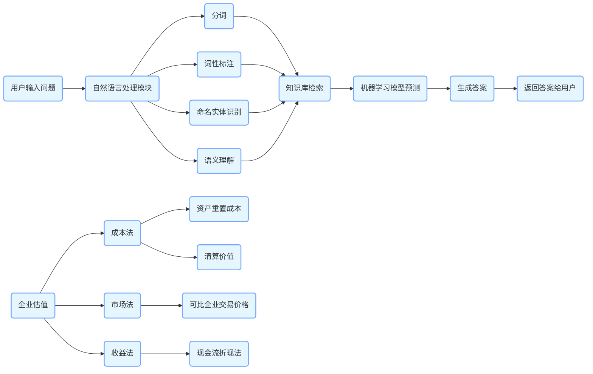

# 企业估值中的AI驱动的自然语言问答平台评估

> 关键词：企业估值、AI驱动、自然语言问答平台、评估方法、机器学习算法

> 摘要：本文聚焦于企业估值中AI驱动的自然语言问答平台评估这一关键领域。随着人工智能技术的飞速发展，自然语言问答平台在企业中发挥着越来越重要的作用，准确评估其价值对于企业的战略决策、投资分析等具有重大意义。文章首先介绍了相关背景信息，包括目的范围、预期读者等；接着阐述了核心概念及联系，分析了核心算法原理并给出具体操作步骤；探讨了相关数学模型和公式；通过项目实战给出代码案例及详细解释；介绍了实际应用场景；推荐了学习、开发相关的工具和资源；最后总结了未来发展趋势与挑战，解答了常见问题，并提供了扩展阅读和参考资料。

## 1. 背景介绍 
### 1.1 目的和范围
在当今数字化和智能化的时代，AI驱动的自然语言问答平台在企业中的应用日益广泛。对这类平台进行准确的估值，有助于企业合理规划资源、吸引投资、制定市场策略等。本文的目的在于系统地探讨企业估值中针对AI驱动的自然语言问答平台的评估方法和流程。范围涵盖了从核心概念的理解到实际项目中的应用，以及相关工具和资源的推荐等方面。

### 1.2 预期读者
本文预期读者包括企业管理人员、投资分析师、人工智能技术开发者、研究人员等。企业管理人员可以通过本文了解如何评估自然语言问答平台的价值，为企业决策提供依据；投资分析师能够掌握评估方法，进行准确的投资分析；人工智能技术开发者可以从算法原理和代码实现等方面获得启发；研究人员则可以在本文基础上进行更深入的学术研究。

### 1.3 文档结构概述
本文首先介绍了背景信息，让读者对文章的目的和适用对象有清晰的认识。接着阐述核心概念与联系，帮助读者理解相关的基本原理。然后详细讲解核心算法原理和具体操作步骤，并给出Python代码示例。之后介绍数学模型和公式，通过举例说明加深理解。项目实战部分提供了实际代码案例和详细解释。再介绍实际应用场景，让读者了解其实际用途。工具和资源推荐部分为读者提供了学习和开发的参考。最后总结未来发展趋势与挑战，解答常见问题，并提供扩展阅读和参考资料。

### 1.4 术语表
#### 1.4.1 核心术语定义
- **企业估值**：指对企业整体价值进行评估的过程，考虑企业的资产、负债、盈利能力、市场前景等多个因素。
- **AI驱动的自然语言问答平台**：利用人工智能技术，特别是自然语言处理技术，能够理解用户以自然语言提出的问题并给出准确回答的平台。
- **机器学习算法**：一类让计算机通过数据学习模式和规律，从而进行预测和决策的算法。
- **文本嵌入**：将文本转换为向量表示的技术，以便计算机能够更好地处理和分析文本。

#### 1.4.2 相关概念解释
- **自然语言处理（NLP）**：是人工智能的一个重要领域，研究如何让计算机理解、处理和生成人类语言。自然语言问答平台是NLP的一个具体应用场景。
- **深度学习**：一种基于神经网络的机器学习方法，在自然语言处理等领域取得了显著的成果。许多自然语言问答平台都采用了深度学习技术。

#### 1.4.3 缩略词列表
- **NLP**：Natural Language Processing（自然语言处理）
- **ML**：Machine Learning（机器学习）
- **DL**：Deep Learning（深度学习）

## 2. 核心概念与联系 
### 核心概念原理
#### AI驱动的自然语言问答平台原理
AI驱动的自然语言问答平台主要基于自然语言处理技术实现。其基本原理是将用户输入的自然语言问题进行解析，提取关键信息，然后在知识库中进行匹配和检索，找到最相关的答案并返回给用户。这个过程涉及到多个自然语言处理任务，如分词、词性标注、命名实体识别、语义理解等。

例如，当用户输入“苹果公司的创始人是谁？”平台首先会对句子进行分词，将其拆分为“苹果公司”、“创始人”、“是谁”等词语。然后通过命名实体识别确定“苹果公司”是一个公司实体。接着在知识库中搜索与“苹果公司创始人”相关的信息，最终找到答案“史蒂夫·乔布斯、史蒂夫·沃兹尼亚克和罗恩·韦恩”并返回给用户。

#### 企业估值原理
企业估值是一个复杂的过程，通常采用多种方法进行综合评估。常见的估值方法包括成本法、市场法和收益法。成本法主要考虑企业的资产成本，通过计算企业的重置成本或清算价值来评估企业的价值。市场法是通过比较类似企业的市场交易价格来确定目标企业的价值。收益法是基于企业未来的预期收益来评估企业的价值，常用的方法有现金流折现法（DCF）等。

### 核心概念架构的文本示意图
```plaintext
AI驱动的自然语言问答平台
|-- 用户界面
|   |-- 输入问题
|   |-- 显示答案
|-- 自然语言处理模块
|   |-- 分词
|   |-- 词性标注
|   |-- 命名实体识别
|   |-- 语义理解
|-- 知识库
|   |-- 知识存储
|   |-- 知识检索
|-- 机器学习模型
|   |-- 训练数据
|   |-- 模型训练
|   |-- 模型预测

企业估值
|-- 成本法
|   |-- 资产重置成本
|   |-- 清算价值
|-- 市场法
|   |-- 可比企业交易价格
|-- 收益法
|   |-- 现金流折现法
```

### Mermaid流程图


## 3. 核心算法原理 & 具体操作步骤 
### 核心算法原理
#### 文本嵌入算法（以Word2Vec为例）
Word2Vec是一种常用的文本嵌入算法，它能够将词语转换为向量表示。其基本思想是通过训练一个神经网络模型，让模型学习词语之间的语义关系。具体来说，Word2Vec有两种模型架构：连续词袋模型（CBOW）和跳字模型（Skip-gram）。

CBOW模型是根据上下文词语来预测目标词语。例如，给定上下文“the cat sits on the”，预测目标词语“mat”。Skip-gram模型则相反，是根据目标词语来预测上下文词语。

#### 问答匹配算法（以余弦相似度为例）
余弦相似度是一种常用的计算两个向量之间相似度的方法。在问答匹配中，将问题和答案都转换为向量表示，然后计算它们之间的余弦相似度。余弦相似度的值越接近1，表示两个向量越相似，即问题和答案越匹配。

### 具体操作步骤
#### 步骤1：数据收集和预处理
收集大量的问答数据，包括问题和对应的答案。对数据进行预处理，如去除停用词、分词等。

```python
import nltk
from nltk.corpus import stopwords
from nltk.tokenize import word_tokenize
nltk.download('stopwords')
nltk.download('punkt')

def preprocess_text(text):
    # 转换为小写
    text = text.lower()
    # 分词
    tokens = word_tokenize(text)
    # 去除停用词
    stop_words = set(stopwords.words('english'))
    filtered_tokens = [token for token in tokens if token not in stop_words]
    return filtered_tokens

# 示例
question = "What is the capital of France?"
preprocessed_question = preprocess_text(question)
print(preprocessed_question)
```

#### 步骤2：文本嵌入
使用Word2Vec模型将预处理后的文本转换为向量表示。

```python
from gensim.models import Word2Vec

# 假设我们有一个问答数据集
qa_data = [
    ["What", "is", "the", "capital", "of", "France"],
    ["The", "capital", "of", "France", "is", "Paris"]
]

# 训练Word2Vec模型
model = Word2Vec(sentences=qa_data, vector_size=100, window=5, min_count=1, workers=4)

# 获取词语的向量表示
vector = model.wv['France']
print(vector)
```

#### 步骤3：问答匹配
计算问题和答案之间的余弦相似度，找到最匹配的答案。

```python
import numpy as np
from sklearn.metrics.pairwise import cosine_similarity

# 假设我们有一个问题向量和多个答案向量
question_vector = np.array([[1, 2, 3]])
answer_vectors = np.array([[4, 5, 6], [7, 8, 9]])

# 计算余弦相似度
similarities = cosine_similarity(question_vector, answer_vectors)
print(similarities)

# 找到最匹配的答案索引
best_match_index = np.argmax(similarities)
print(best_match_index)
```

## 4. 数学模型和公式 & 详细讲解 & 举例说明 
### 文本嵌入数学模型（Word2Vec）
#### 连续词袋模型（CBOW）
CBOW模型的目标是根据上下文词语 $w_{c-m}, \cdots, w_{c-1}, w_{c+1}, \cdots, w_{c+m}$ 来预测目标词语 $w_c$，其中 $m$ 是上下文窗口的大小。

模型的输入是上下文词语的向量表示的平均值 $\mathbf{h}$：
$$
\mathbf{h} = \frac{1}{2m} \sum_{i=1}^{2m} \mathbf{x}_{c-m+i}
$$
其中 $\mathbf{x}_i$ 是第 $i$ 个上下文词语的输入向量。

模型的输出是一个概率分布 $\mathbf{y}$，表示每个词语作为目标词语的概率。通过softmax函数计算：
$$
y_j = \frac{\exp(\mathbf{v}_j^T \mathbf{h})}{\sum_{k=1}^{V} \exp(\mathbf{v}_k^T \mathbf{h})}
$$
其中 $\mathbf{v}_j$ 是第 $j$ 个词语的输出向量，$V$ 是词汇表的大小。

模型的训练目标是最大化目标词语的预测概率，即最小化负对数似然损失：
$$
L = - \log P(w_c | w_{c-m}, \cdots, w_{c-1}, w_{c+1}, \cdots, w_{c+m}) = - \log y_{c}
$$

#### 跳字模型（Skip-gram）
跳字模型的目标是根据目标词语 $w_c$ 来预测上下文词语 $w_{c-m}, \cdots, w_{c-1}, w_{c+1}, \cdots, w_{c+m}$。

模型的输入是目标词语的向量表示 $\mathbf{x}_c$。

对于每个上下文词语 $w_{c+i}$，模型的输出是一个概率分布 $\mathbf{y}_{c+i}$，同样通过softmax函数计算。

模型的训练目标是最大化所有上下文词语的预测概率，即最小化负对数似然损失：
$$
L = - \sum_{i=-m, i \neq 0}^{m} \log P(w_{c+i} | w_c)
$$

### 问答匹配数学模型（余弦相似度）
余弦相似度用于计算两个向量 $\mathbf{a}$ 和 $\mathbf{b}$ 之间的相似度，公式为：
$$
\cos(\theta) = \frac{\mathbf{a} \cdot \mathbf{b}}{\|\mathbf{a}\| \|\mathbf{b}\|}
$$
其中 $\mathbf{a} \cdot \mathbf{b}$ 是向量 $\mathbf{a}$ 和 $\mathbf{b}$ 的点积，$\|\mathbf{a}\|$ 和 $\|\mathbf{b}\|$ 分别是向量 $\mathbf{a}$ 和 $\mathbf{b}$ 的模。

### 举例说明
#### Word2Vec举例
假设我们有一个简单的文本语料库：["I", "love", "natural", "language", "processing"]。使用CBOW模型，上下文窗口大小 $m = 1$。

对于目标词语“love”，上下文词语是“I”和“natural”。假设“I”的输入向量是 $\mathbf{x}_1 = [0.1, 0.2]$，“natural”的输入向量是 $\mathbf{x}_2 = [0.3, 0.4]$。

则上下文词语的向量表示的平均值 $\mathbf{h}$ 为：
$$
\mathbf{h} = \frac{1}{2} ([0.1, 0.2] + [0.3, 0.4]) = [0.2, 0.3]
$$

假设词汇表中有三个词语：“I”、“love”、“natural”，它们的输出向量分别是 $\mathbf{v}_1 = [0.5, 0.6]$，$\mathbf{v}_2 = [0.7, 0.8]$，$\mathbf{v}_3 = [0.9, 1.0]$。

则“love”作为目标词语的预测概率 $y_2$ 为：
$$
y_2 = \frac{\exp([0.7, 0.8]^T [0.2, 0.3])}{\exp([0.5, 0.6]^T [0.2, 0.3]) + \exp([0.7, 0.8]^T [0.2, 0.3]) + \exp([0.9, 1.0]^T [0.2, 0.3])}
$$

#### 余弦相似度举例
假设问题向量 $\mathbf{a} = [1, 2, 3]$，答案向量 $\mathbf{b} = [4, 5, 6]$。

向量 $\mathbf{a}$ 的模 $\|\mathbf{a}\| = \sqrt{1^2 + 2^2 + 3^2} = \sqrt{14}$。

向量 $\mathbf{b}$ 的模 $\|\mathbf{b}\| = \sqrt{4^2 + 5^2 + 6^2} = \sqrt{77}$。

向量 $\mathbf{a}$ 和 $\mathbf{b}$ 的点积 $\mathbf{a} \cdot \mathbf{b} = 1 \times 4 + 2 \times 5 + 3 \times 6 = 32$。

则它们之间的余弦相似度为：
$$
\cos(\theta) = \frac{32}{\sqrt{14} \sqrt{77}} \approx 0.974
$$

## 5. 项目实战：代码实际案例和详细解释说明 
### 5.1  开发环境搭建
#### 安装Python
首先需要安装Python，建议使用Python 3.7及以上版本。可以从Python官方网站（https://www.python.org/downloads/）下载安装包进行安装。

#### 安装必要的库
使用pip命令安装以下必要的库：
```bash
pip install nltk gensim scikit-learn numpy
```

### 5.2  源代码详细实现和代码解读
```python
import nltk
from nltk.corpus import stopwords
from nltk.tokenize import word_tokenize
from gensim.models import Word2Vec
import numpy as np
from sklearn.metrics.pairwise import cosine_similarity

# 数据预处理函数
def preprocess_text(text):
    # 转换为小写
    text = text.lower()
    # 分词
    tokens = word_tokenize(text)
    # 去除停用词
    stop_words = set(stopwords.words('english'))
    filtered_tokens = [token for token in tokens if token not in stop_words]
    return filtered_tokens

# 训练Word2Vec模型
def train_word2vec_model(data):
    model = Word2Vec(sentences=data, vector_size=100, window=5, min_count=1, workers=4)
    return model

# 计算文本向量
def get_text_vector(text, model):
    vectors = []
    for token in text:
        if token in model.wv:
            vectors.append(model.wv[token])
    if not vectors:
        return np.zeros(model.vector_size)
    return np.mean(vectors, axis=0)

# 问答匹配函数
def match_question_answer(question, answers, model):
    preprocessed_question = preprocess_text(question)
    question_vector = get_text_vector(preprocessed_question, model)
    
    answer_vectors = []
    for answer in answers:
        preprocessed_answer = preprocess_text(answer)
        answer_vector = get_text_vector(preprocessed_answer, model)
        answer_vectors.append(answer_vector)
    
    answer_vectors = np.array(answer_vectors)
    similarities = cosine_similarity([question_vector], answer_vectors)
    best_match_index = np.argmax(similarities)
    return answers[best_match_index]

# 示例数据
qa_data = [
    "What is the capital of France?",
    "The capital of France is Paris.",
    "Which planet is known as the Red Planet?",
    "Mars is known as the Red Planet."
]

questions = [qa_data[i] for i in range(0, len(qa_data), 2)]
answers = [qa_data[i] for i in range(1, len(qa_data), 2)]

# 数据预处理
preprocessed_qa_data = [preprocess_text(text) for text in qa_data]

# 训练Word2Vec模型
model = train_word2vec_model(preprocessed_qa_data)

# 测试问答匹配
test_question = "What is the capital of France?"
best_answer = match_question_answer(test_question, answers, model)
print(f"Question: {test_question}")
print(f"Best answer: {best_answer}")
```

### 5.3  代码解读与分析
#### 数据预处理函数 `preprocess_text`
该函数将输入的文本转换为小写，然后进行分词，最后去除停用词。停用词是指在自然语言中频繁出现但对文本语义理解没有太大帮助的词语，如“the”、“is”、“and”等。

#### 训练Word2Vec模型函数 `train_word2vec_model`
该函数使用 `gensim` 库的 `Word2Vec` 类训练一个Word2Vec模型。`vector_size` 参数指定了向量的维度，`window` 参数指定了上下文窗口的大小，`min_count` 参数指定了词语出现的最小次数，`workers` 参数指定了训练时使用的线程数。

#### 计算文本向量函数 `get_text_vector`
该函数将预处理后的文本转换为向量表示。对于文本中的每个词语，如果该词语在Word2Vec模型的词汇表中，则获取其向量表示。最后将所有词语的向量求平均值，得到文本的向量表示。

#### 问答匹配函数 `match_question_answer`
该函数首先对问题和答案进行预处理，然后计算它们的向量表示。接着使用余弦相似度计算问题向量和答案向量之间的相似度，找到相似度最高的答案并返回。

#### 主程序
主程序中，我们定义了一个示例的问答数据集，将其分为问题和答案两部分。然后对数据集进行预处理，训练Word2Vec模型。最后使用一个测试问题进行问答匹配，并输出最佳答案。

## 6. 实际应用场景 
### 客户服务
在企业的客户服务中，AI驱动的自然语言问答平台可以自动回答客户的常见问题，提高客户服务效率。例如，电商企业可以使用问答平台回答客户关于商品信息、订单状态、退换货政策等问题。

### 智能客服机器人
智能客服机器人是自然语言问答平台的一个典型应用。它可以与客户进行实时对话，提供个性化的服务。例如，银行的智能客服机器人可以回答客户关于账户信息、贷款政策、理财产品等问题。

### 知识管理
企业可以使用自然语言问答平台来管理和检索内部知识。员工可以通过提问的方式快速获取所需的知识，提高工作效率。例如，科技公司可以使用问答平台来管理技术文档、项目经验等知识。

### 投资分析
在企业估值和投资分析中，自然语言问答平台可以帮助分析师快速获取和分析相关信息。例如，分析师可以通过提问的方式获取企业的财务报表、市场份额、行业动态等信息，从而更准确地评估企业的价值。

## 7. 工具和资源推荐
### 7.1 学习资源推荐
#### 7.1.1 书籍推荐
- 《自然语言处理入门》：这本书适合初学者，介绍了自然语言处理的基本概念、方法和技术。
- 《深度学习》：深度学习是自然语言处理的重要基础，这本书详细介绍了深度学习的理论和实践。
- 《Python自然语言处理》：这本书结合Python语言，介绍了自然语言处理的各种工具和库的使用。

#### 7.1.2 在线课程
- Coursera上的“Natural Language Processing Specialization”：这是一个由顶尖大学教授授课的自然语言处理专项课程，涵盖了自然语言处理的各个方面。
- edX上的“Deep Learning for Natural Language Processing”：该课程重点介绍了深度学习在自然语言处理中的应用。

#### 7.1.3 技术博客和网站
- Medium：上面有很多关于自然语言处理和人工智能的技术博客文章，作者来自世界各地的专家和爱好者。
- arXiv：这是一个预印本数据库，提供了大量的最新学术研究论文，包括自然语言处理领域的研究成果。

### 7.2 开发工具框架推荐
#### 7.2.1 IDE和编辑器
- PyCharm：是一款专业的Python集成开发环境，提供了丰富的功能，如代码编辑、调试、版本控制等。
- Jupyter Notebook：是一个交互式的开发环境，适合进行数据分析和模型实验。

#### 7.2.2 调试和性能分析工具
- TensorBoard：是TensorFlow提供的一个可视化工具，可以帮助开发者监控模型的训练过程和性能。
- Py-Spy：是一个用于Python程序的性能分析工具，可以帮助开发者找出程序中的性能瓶颈。

#### 7.2.3 相关框架和库
- NLTK：是Python中最常用的自然语言处理库，提供了丰富的工具和数据集。
- SpaCy：是一个高效的自然语言处理库，专注于处理大规模文本数据。
- Transformers：是Hugging Face开发的一个深度学习库，提供了各种预训练的自然语言处理模型。

### 7.3 相关论文著作推荐
#### 7.3.1 经典论文
- “Efficient Estimation of Word Representations in Vector Space”：这篇论文介绍了Word2Vec模型的原理和实现。
- “Attention Is All You Need”：这篇论文提出了Transformer架构，是自然语言处理领域的重要突破。

#### 7.3.2 最新研究成果
- 可以关注ACL（Association for Computational Linguistics）、EMNLP（Conference on Empirical Methods in Natural Language Processing）等自然语言处理领域的顶级会议，获取最新的研究成果。

#### 7.3.3 应用案例分析
- 可以参考一些企业的技术博客和案例分享，了解自然语言问答平台在实际应用中的经验和挑战。例如，谷歌、微软等公司的技术博客。

## 8. 总结：未来发展趋势与挑战
### 未来发展趋势
#### 多模态融合
未来的自然语言问答平台将不仅仅局限于文本输入和输出，还将融合图像、语音等多种模态信息。例如，用户可以通过语音提问，平台可以以图像或视频的形式回答问题。

#### 个性化服务
随着用户数据的不断积累，自然语言问答平台将能够提供更加个性化的服务。平台可以根据用户的历史提问记录、偏好等信息，为用户提供更加精准的答案和建议。

#### 知识图谱的应用
知识图谱可以将各种知识进行结构化表示，为自然语言问答平台提供更加丰富和准确的知识支持。未来的问答平台将更多地利用知识图谱来提高问答的质量和效率。

### 挑战
#### 语义理解的准确性
虽然自然语言处理技术取得了很大的进展，但在语义理解方面仍然存在挑战。例如，对于一些具有歧义的问题，平台可能无法准确理解其含义，从而给出错误的答案。

#### 数据隐私和安全
自然语言问答平台需要处理大量的用户数据，包括用户的提问和历史记录等。如何保护用户的数据隐私和安全是一个重要的挑战。

#### 跨语言和跨文化问题
在全球化的背景下，自然语言问答平台需要支持多种语言和文化。不同语言和文化之间存在着巨大的差异，如何处理这些差异是一个需要解决的问题。

## 9. 附录：常见问题与解答
### 问题1：如何提高自然语言问答平台的准确率？
解答：可以从以下几个方面提高准确率：1. 收集更多高质量的训练数据，包括各种类型的问题和答案。2. 选择合适的机器学习算法和模型，如深度学习模型。3. 进行数据预处理和特征工程，提高数据的质量。4. 利用知识图谱等外部知识源，丰富平台的知识储备。

### 问题2：自然语言问答平台的开发成本高吗？
解答：开发成本取决于多个因素，如平台的功能需求、使用的技术和算法、数据的规模等。一般来说，开发一个简单的问答平台成本相对较低，但如果需要实现复杂的功能，如多模态融合、个性化服务等，开发成本会相应增加。

### 问题3：如何评估自然语言问答平台的性能？
解答：常用的评估指标包括准确率、召回率、F1值等。准确率表示平台给出的正确答案的比例，召回率表示平台能够正确回答的问题的比例，F1值是准确率和召回率的调和平均值。此外，还可以通过用户反馈、人工评估等方式来综合评估平台的性能。

## 10. 扩展阅读 & 参考资料
### 扩展阅读
- 《人工智能：现代方法》：这本书全面介绍了人工智能的各个领域，包括自然语言处理、机器学习等。
- 《智能时代》：从社会和经济的角度探讨了人工智能的发展和影响。

### 参考资料
- 相关学术论文和研究报告
- 自然语言处理和人工智能领域的开源项目和代码库
- 企业的技术博客和案例分享

作者：AI天才研究院/AI Genius Institute & 禅与计算机程序设计艺术 /Zen And The Art of Computer Programming