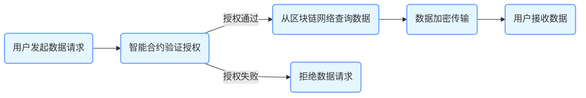

# 企业估值中的区块链医疗数据交换平台评估

> 关键词：企业估值、区块链、医疗数据交换平台、评估方法、应用场景

> 摘要：本文聚焦于企业估值中区块链医疗数据交换平台的评估。首先介绍了研究的背景、目的、预期读者、文档结构及相关术语。接着阐述了区块链、医疗数据交换平台等核心概念及其联系，通过文本示意图和 Mermaid 流程图展示架构。详细讲解了适用于该平台评估的核心算法原理及具体操作步骤，并结合 Python 代码进行说明。分析了相关数学模型和公式，给出具体例子。通过项目实战，包括开发环境搭建、源代码实现与解读，深入剖析该平台。探讨了其实际应用场景，推荐了学习资源、开发工具框架和相关论文著作。最后总结了未来发展趋势与挑战，解答常见问题，并提供扩展阅读和参考资料，旨在为企业准确评估区块链医疗数据交换平台价值提供全面且深入的指导。

## 1. 背景介绍 
### 1.1 目的和范围
随着区块链技术的不断发展和医疗行业数字化转型的加速，区块链医疗数据交换平台应运而生。这类平台旨在解决医疗数据共享过程中的安全、隐私、互操作性等问题，具有巨大的商业潜力。然而，如何准确评估此类平台的价值，对于投资者、企业管理者和监管机构来说都是一个关键问题。本文的目的在于提供一套全面、科学的评估方法和框架，帮助相关方在企业估值过程中准确衡量区块链医疗数据交换平台的价值。

本文的范围涵盖了区块链医疗数据交换平台的核心概念、评估算法、数学模型、实际应用场景等方面。我们将深入探讨该平台的技术架构、业务模式和市场前景，分析影响其价值的各种因素，并通过具体的案例和代码实现，展示评估过程和方法。

### 1.2 预期读者
本文的预期读者包括但不限于以下几类人群：
- **投资者**：希望了解区块链医疗数据交换平台的投资价值，以便做出明智的投资决策。
- **企业管理者**：负责区块链医疗数据交换平台的规划、开发和运营，需要准确评估平台的价值，为企业战略决策提供依据。
- **监管机构**：关注区块链医疗数据交换平台的合规性和市场稳定性，需要评估其对医疗行业的影响和潜在风险。
- **技术人员**：对区块链和医疗数据交换技术感兴趣，希望深入了解平台的技术原理和评估方法。

### 1.3 文档结构概述
本文将按照以下结构进行组织：
- **核心概念与联系**：介绍区块链、医疗数据交换平台等核心概念，分析它们之间的联系，并通过文本示意图和 Mermaid 流程图展示平台的架构。
- **核心算法原理 & 具体操作步骤**：阐述适用于区块链医疗数据交换平台评估的核心算法原理，包括收益法、市场法和成本法等，并给出具体的操作步骤，同时使用 Python 代码进行详细说明。
- **数学模型和公式 & 详细讲解 & 举例说明**：介绍相关的数学模型和公式，如净现值模型、市盈率模型等，并通过具体的例子进行详细讲解。
- **项目实战：代码实际案例和详细解释说明**：通过一个实际的项目案例，展示区块链医疗数据交换平台的开发环境搭建、源代码实现和代码解读。
- **实际应用场景**：探讨区块链医疗数据交换平台在医疗科研、临床诊断、医保结算等领域的实际应用场景。
- **工具和资源推荐**：推荐学习区块链和医疗数据交换技术的相关书籍、在线课程、技术博客和网站，以及开发工具框架和相关论文著作。
- **总结：未来发展趋势与挑战**：总结区块链医疗数据交换平台的未来发展趋势，分析其面临的挑战和机遇。
- **附录：常见问题与解答**：解答读者在评估区块链医疗数据交换平台过程中常见的问题。
- **扩展阅读 & 参考资料**：提供相关的扩展阅读材料和参考资料，供读者进一步深入学习。

### 1.4 术语表
#### 1.4.1 核心术语定义
- **区块链（Blockchain）**：一种分布式账本技术，通过密码学方法确保数据的不可篡改和可追溯性，实现去中心化的信任机制。
- **医疗数据交换平台（Medical Data Exchange Platform）**：用于实现医疗数据在不同医疗机构、企业和个人之间安全、高效交换的平台。
- **智能合约（Smart Contract）**：一种自动执行的合约，通过代码实现合约条款，当满足预设条件时自动执行相应的操作。
- **企业估值（Enterprise Valuation）**：对企业的价值进行评估的过程，通常基于企业的财务状况、市场前景、技术实力等因素。

#### 1.4.2 相关概念解释
- **去中心化（Decentralization）**：区块链的核心特性之一，指的是系统中没有中央控制节点，数据和权力分布在多个节点上，提高了系统的可靠性和安全性。
- **共识机制（Consensus Mechanism）**：区块链网络中用于达成节点间共识的算法，确保所有节点对数据的一致性和有效性达成共识。
- **加密算法（Encryption Algorithm）**：用于对数据进行加密的算法，确保数据在传输和存储过程中的安全性和隐私性。

#### 1.4.3 缩略词列表
- **NFT（Non - Fungible Token）**：非同质化代币，用于表示独一无二的资产或权益。
- **API（Application Programming Interface）**：应用程序编程接口，用于实现不同软件系统之间的交互和数据共享。
- **DApp（Decentralized Application）**：去中心化应用程序，基于区块链技术开发的应用程序。

## 2. 核心概念与联系 

### 2.1 区块链技术原理
区块链是一种分布式账本技术，它由一系列按时间顺序相连的区块组成，每个区块包含一定数量的交易记录。区块链的核心原理包括去中心化、共识机制、加密算法和智能合约等。

去中心化是区块链的重要特性，它通过分布式网络中的多个节点共同维护账本，避免了单点故障和中心化机构的控制。共识机制用于确保所有节点对账本的一致性和有效性达成共识，常见的共识机制有工作量证明（PoW）、权益证明（PoS）等。加密算法用于对交易数据进行加密，确保数据的安全性和隐私性。智能合约是一种自动执行的合约，通过代码实现合约条款，当满足预设条件时自动执行相应的操作。

### 2.2 医疗数据交换平台概述
医疗数据交换平台是一个用于实现医疗数据在不同医疗机构、企业和个人之间安全、高效交换的平台。该平台可以整合来自不同数据源的医疗数据，包括电子病历、检验检查报告、影像数据等，并提供数据查询、共享和分析等功能。

医疗数据交换平台的主要目标是解决医疗数据共享过程中的安全、隐私、互操作性等问题。通过区块链技术，平台可以实现数据的不可篡改和可追溯性，确保数据的真实性和完整性；同时，利用智能合约可以实现数据的授权访问和共享，保护患者的隐私权益。

### 2.3 核心概念联系
区块链技术为医疗数据交换平台提供了安全、可信的基础架构。通过区块链的去中心化特性，医疗数据可以存储在多个节点上，避免了数据的单点故障和被篡改的风险。共识机制确保了所有节点对数据的一致性和有效性达成共识，提高了数据的可信度。加密算法和智能合约则为数据的安全和隐私提供了保障，确保只有授权用户才能访问和共享数据。

另一方面，医疗数据交换平台为区块链技术提供了实际应用场景。医疗行业对数据的安全性和隐私性要求极高，区块链技术的特性正好满足了这些需求。通过在医疗数据交换平台中应用区块链技术，可以提高医疗数据的质量和利用效率，促进医疗行业的数字化转型。

### 2.4 文本示意图
```plaintext
区块链医疗数据交换平台
|-- 区块链网络
|   |-- 节点1
|   |-- 节点2
|   |--...
|   |-- 节点n
|-- 医疗数据存储
|   |-- 电子病历
|   |-- 检验检查报告
|   |-- 影像数据
|-- 智能合约
|   |-- 数据授权访问
|   |-- 数据共享规则
|-- 用户接口
|   |-- 医疗机构
|   |-- 企业
|   |-- 个人
```

### 2.5 Mermaid 流程图


## 3. 核心算法原理 & 具体操作步骤 

### 3.1 收益法
#### 3.1.1 原理
收益法是企业估值中常用的一种方法，它基于企业未来的预期收益来评估企业的价值。对于区块链医疗数据交换平台来说，其价值主要取决于平台未来的收益能力，包括数据交易收入、服务费用收入等。

收益法的基本原理是将企业未来的预期收益按照一定的折现率折现到当前时刻，得到企业的现值。折现率反映了投资者对投资风险的预期，风险越高，折现率越高。

#### 3.1.2 具体操作步骤
1. **预测未来收益**：根据平台的业务模式和市场前景，预测平台未来每年的收益。收益预测需要考虑多种因素，如市场规模、市场份额、竞争态势、技术发展等。
2. **确定折现率**：折现率的确定需要考虑投资的风险程度、市场利率等因素。通常可以采用资本资产定价模型（CAPM）来确定折现率。
3. **计算现值**：将未来每年的预期收益按照折现率折现到当前时刻，然后将各年的现值相加，得到平台的价值。

#### 3.1.3 Python 代码实现
```python
def income_approach(future_income, discount_rate):
    """
    收益法计算企业价值
    :param future_income: 未来每年的预期收益列表
    :param discount_rate: 折现率
    :return: 企业价值
    """
    present_value = 0
    for i, income in enumerate(future_income):
        present_value += income / ((1 + discount_rate) ** (i + 1))
    return present_value

# 示例数据
future_income = [100, 120, 150, 180, 200]  # 未来五年的预期收益
discount_rate = 0.1  # 折现率为 10%

value = income_approach(future_income, discount_rate)
print(f"平台价值: {value}")
```

### 3.2 市场法
#### 3.2.1 原理
市场法是通过比较类似企业的市场价值来评估目标企业的价值。对于区块链医疗数据交换平台来说，可以寻找市场上已经存在的类似平台，比较它们的财务指标、市场份额、用户数量等因素，来确定目标平台的价值。

市场法的基本假设是类似企业在市场上应该具有相似的价值。因此，通过比较类似企业的市场价值，可以得到目标企业的合理估值。

#### 3.2.2 具体操作步骤
1. **选择可比企业**：选择与目标平台在业务模式、市场定位、技术水平等方面相似的企业作为可比企业。
2. **收集可比企业数据**：收集可比企业的财务数据、市场数据等信息，如营业收入、净利润、市值等。
3. **计算估值指标**：根据可比企业的数据，计算常用的估值指标，如市盈率（P/E）、市销率（P/S）等。
4. **应用估值指标**：将目标平台的相应财务指标乘以可比企业的估值指标，得到目标平台的估值。

#### 3.2.3 Python 代码实现
```python
def market_approach(target_revenue, comparable_pe_ratio):
    """
    市场法计算企业价值
    :param target_revenue: 目标平台的营业收入
    :param comparable_pe_ratio: 可比企业的市盈率
    :return: 企业价值
    """
    return target_revenue * comparable_pe_ratio

# 示例数据
target_revenue = 500  # 目标平台的营业收入
comparable_pe_ratio = 20  # 可比企业的市盈率

value = market_approach(target_revenue, comparable_pe_ratio)
print(f"平台价值: {value}")
```

### 3.3 成本法
#### 3.3.1 原理
成本法是通过计算企业的重置成本来评估企业的价值。对于区块链医疗数据交换平台来说，重置成本包括平台的开发成本、运营成本、数据采集成本等。

成本法的基本假设是企业的价值等于其重置成本减去折旧和损耗。重置成本反映了重新构建一个类似平台所需的成本，折旧和损耗则反映了平台的实际使用情况和技术陈旧程度。

#### 3.3.2 具体操作步骤
1. **计算重置成本**：确定平台的各项成本，包括硬件设备成本、软件开发成本、人员成本等，并将它们相加得到重置成本。
2. **评估折旧和损耗**：考虑平台的使用年限、技术更新速度等因素，评估平台的折旧和损耗程度。
3. **计算企业价值**：将重置成本减去折旧和损耗，得到平台的价值。

#### 3.3.3 Python 代码实现
```python
def cost_approach(replacement_cost, depreciation):
    """
    成本法计算企业价值
    :param replacement_cost: 重置成本
    :param depreciation: 折旧和损耗
    :return: 企业价值
    """
    return replacement_cost - depreciation

# 示例数据
replacement_cost = 1000  # 重置成本
depreciation = 200  # 折旧和损耗

value = cost_approach(replacement_cost, depreciation)
print(f"平台价值: {value}")
```

## 4. 数学模型和公式 & 详细讲解 & 举例说明 

### 4.1 净现值模型
#### 4.1.1 公式
净现值（Net Present Value，NPV）是收益法中常用的一个数学模型，其公式为：
$$NPV=\sum_{t = 1}^{n}\frac{CF_t}{(1 + r)^t}-I_0$$
其中，$CF_t$ 表示第 $t$ 期的现金流量，$r$ 表示折现率，$n$ 表示项目的寿命期，$I_0$ 表示初始投资。

#### 4.1.2 详细讲解
净现值模型的核心思想是将未来的现金流量折现到当前时刻，然后减去初始投资，得到项目的净现值。如果净现值大于零，则说明项目的投资回报率高于折现率，项目具有投资价值；如果净现值小于零，则说明项目的投资回报率低于折现率，项目不具有投资价值。

#### 4.1.3 举例说明
假设一个区块链医疗数据交换平台的初始投资为 $I_0 = 500$ 万元，未来五年的现金流量分别为 $CF_1 = 100$ 万元，$CF_2 = 120$ 万元，$CF_3 = 150$ 万元，$CF_4 = 180$ 万元，$CF_5 = 200$ 万元，折现率 $r = 0.1$。则该平台的净现值为：
$$NPV=\frac{100}{(1 + 0.1)^1}+\frac{120}{(1 + 0.1)^2}+\frac{150}{(1 + 0.1)^3}+\frac{180}{(1 + 0.1)^4}+\frac{200}{(1 + 0.1)^5}-500$$
```python
import numpy as np

cash_flows = np.array([100, 120, 150, 180, 200])
discount_rate = 0.1
initial_investment = 500

npv = np.npv(discount_rate, np.insert(cash_flows, 0, -initial_investment))
print(f"净现值: {npv}")
```

### 4.2 市盈率模型
#### 4.2.1 公式
市盈率（Price - Earnings Ratio，P/E）是市场法中常用的一个估值指标，其公式为：
$$P/E=\frac{P}{E}$$
其中，$P$ 表示股票价格，$E$ 表示每股收益。

#### 4.2.2 详细讲解
市盈率模型的基本思想是通过比较类似企业的市盈率来评估目标企业的价值。如果目标企业的市盈率低于可比企业的市盈率，则说明目标企业的价值被低估，具有投资价值；反之，则说明目标企业的价值被高估。

#### 4.2.3 举例说明
假设一个可比企业的股票价格为 $P = 20$ 元，每股收益为 $E = 1$ 元，则该可比企业的市盈率为 $P/E = 20$。如果目标平台的每股收益为 $E_{target}= 2$ 元，则根据市盈率模型，目标平台的股票价格应为 $P_{target}= 20\times2 = 40$ 元。

### 4.3 成本加成模型
#### 4.3.1 公式
成本加成模型是成本法中常用的一个数学模型，其公式为：
$$V = C(1 + r)$$
其中，$V$ 表示企业价值，$C$ 表示重置成本，$r$ 表示成本加成率。

#### 4.3.2 详细讲解
成本加成模型的基本思想是在重置成本的基础上，加上一定的成本加成率，得到企业的价值。成本加成率反映了企业的利润水平和风险程度。

#### 4.3.3 举例说明
假设一个区块链医疗数据交换平台的重置成本为 $C = 1000$ 万元，成本加成率为 $r = 0.2$，则该平台的价值为：
$$V = 1000\times(1 + 0.2)=1200$$ 万元。

```python
replacement_cost = 1000
cost_addition_rate = 0.2

value = replacement_cost * (1 + cost_addition_rate)
print(f"平台价值: {value}")
```

## 5. 项目实战：代码实际案例和详细解释说明 

### 5.1  开发环境搭建
#### 5.1.1 硬件环境
- **服务器**：建议使用性能较好的云服务器，如阿里云、腾讯云等，配置为至少 4 核 CPU、8GB 内存、100GB 硬盘。
- **网络**：保证服务器有稳定的网络连接，带宽不低于 10Mbps。

#### 5.1.2 软件环境
- **操作系统**：选择 Linux 操作系统，如 Ubuntu 18.04 或 CentOS 7。
- **编程语言**：使用 Python 3.7 及以上版本。
- **区块链平台**：选择 Hyperledger Fabric 或 Ethereum 作为区块链平台。
- **数据库**：使用 MySQL 或 MongoDB 作为数据库。

#### 5.1.3 安装步骤
1. **安装 Python**：在 Linux 系统上，可以使用以下命令安装 Python：
```bash
sudo apt-get update
sudo apt-get install python3 python3-pip
```
2. **安装 Hyperledger Fabric**：按照 Hyperledger Fabric 的官方文档进行安装和配置。
3. **安装 MySQL**：在 Linux 系统上，可以使用以下命令安装 MySQL：
```bash
sudo apt-get install mysql-server
```
4. **安装 Python 依赖库**：使用以下命令安装所需的 Python 依赖库：
```bash
pip3 install flask pycryptodome pymysql
```

### 5.2  源代码详细实现和代码解读
#### 5.2.1 项目架构
本项目采用 Flask 作为 Web 框架，Hyperledger Fabric 作为区块链平台，MySQL 作为数据库。项目主要包括以下几个模块：
- **用户管理模块**：负责用户的注册、登录和权限管理。
- **数据上传模块**：负责将医疗数据上传到区块链网络。
- **数据查询模块**：负责从区块链网络查询医疗数据。
- **智能合约模块**：负责实现数据的授权访问和共享规则。

#### 5.2.2 代码实现
以下是一个简单的 Flask 应用示例，实现了用户注册和数据上传功能：
```python
from flask import Flask, request, jsonify
import pymysql
from Crypto.Hash import SHA256
from Crypto.PublicKey import RSA
from Crypto.Signature import pkcs1_15

app = Flask(__name__)

# 数据库连接配置
db_config = {
    'host': 'localhost',
    'user': 'root',
    'password': 'password',
    'database': 'medical_data_exchange'
}

# 用户注册接口
@app.route('/register', methods=['POST'])
def register():
    data = request.get_json()
    username = data.get('username')
    password = data.get('password')

    # 生成用户密钥对
    key = RSA.generate(2048)
    private_key = key.export_key()
    public_key = key.publickey().export_key()

    # 计算密码哈希值
    hash_object = SHA256.new(password.encode())
    password_hash = hash_object.hexdigest()

    # 插入用户信息到数据库
    try:
        conn = pymysql.connect(**db_config)
        cursor = conn.cursor()
        sql = "INSERT INTO users (username, password_hash, public_key, private_key) VALUES (%s, %s, %s, %s)"
        cursor.execute(sql, (username, password_hash, public_key, private_key))
        conn.commit()
        cursor.close()
        conn.close()
        return jsonify({'message': '注册成功'}), 200
    except Exception as e:
        return jsonify({'message': f'注册失败: {str(e)}'}), 500

# 数据上传接口
@app.route('/upload_data', methods=['POST'])
def upload_data():
    data = request.get_json()
    username = data.get('username')
    password = data.get('password')
    medical_data = data.get('medical_data')

    # 验证用户身份
    try:
        conn = pymysql.connect(**db_config)
        cursor = conn.cursor()
        sql = "SELECT password_hash, private_key FROM users WHERE username = %s"
        cursor.execute(sql, (username,))
        result = cursor.fetchone()
        if result:
            stored_password_hash = result[0]
            private_key = result[1]

            # 计算密码哈希值
            hash_object = SHA256.new(password.encode())
            input_password_hash = hash_object.hexdigest()

            if input_password_hash == stored_password_hash:
                # 对数据进行签名
                rsa_key = RSA.import_key(private_key)
                hash_data = SHA256.new(medical_data.encode())
                signature = pkcs1_15.new(rsa_key).sign(hash_data)

                # 上传数据到区块链网络（此处省略具体实现）
                #...

                return jsonify({'message': '数据上传成功'}), 200
            else:
                return jsonify({'message': '密码错误'}), 401
        else:
            return jsonify({'message': '用户不存在'}), 404
    except Exception as e:
        return jsonify({'message': f'数据上传失败: {str(e)}'}), 500

if __name__ == '__main__':
    app.run(debug=True)
```

#### 5.2.3 代码解读
- **用户注册接口**：接收用户的用户名和密码，生成用户的密钥对，计算密码的哈希值，将用户信息插入到数据库中。
- **数据上传接口**：接收用户的用户名、密码和医疗数据，验证用户身份，对数据进行签名，然后将数据上传到区块链网络（此处省略具体实现）。

### 5.3  代码解读与分析
#### 5.3.1 安全性分析
- **密码哈希**：使用 SHA256 算法对用户密码进行哈希处理，避免密码明文存储，提高了密码的安全性。
- **密钥对生成**：使用 RSA 算法生成用户的密钥对，用于数据的签名和验证，确保数据的完整性和真实性。
- **数据签名**：在数据上传时，使用用户的私钥对数据进行签名，确保数据的来源可信。

#### 5.3.2 可扩展性分析
- **模块化设计**：项目采用模块化设计，将不同的功能模块分开实现，便于代码的维护和扩展。
- **数据库交互**：使用 MySQL 作为数据库，可以方便地进行数据的存储和查询，并且可以根据需要扩展数据库的功能。
- **区块链集成**：使用 Hyperledger Fabric 作为区块链平台，可以方便地实现数据的不可篡改和可追溯性，并且可以根据需要扩展区块链网络的功能。

## 6. 实际应用场景 
### 6.1 医疗科研
在医疗科研领域，区块链医疗数据交换平台可以为研究人员提供安全、高效的数据共享服务。通过该平台，研究人员可以整合来自不同医疗机构的医疗数据，进行大规模的数据分析和挖掘，从而加速医学研究的进展。

例如，某癌症研究机构可以通过区块链医疗数据交换平台获取来自多家医院的癌症患者的病历、检验检查报告等数据，进行癌症的发病机制、治疗效果等方面的研究。由于区块链技术的不可篡改和可追溯性，研究人员可以确保数据的真实性和完整性，提高研究结果的可靠性。

### 6.2 临床诊断
在临床诊断方面，区块链医疗数据交换平台可以帮助医生更全面地了解患者的病史和病情。当患者在不同的医疗机构就诊时，医生可以通过该平台快速获取患者的电子病历、影像数据等信息，从而做出更准确的诊断和治疗方案。

例如，患者在一家医院进行了某项检查，当他到另一家医院就诊时，医生可以通过区块链医疗数据交换平台获取该患者的检查报告，避免了重复检查，提高了诊断效率和准确性。

### 6.3 医保结算
在医保结算领域，区块链医疗数据交换平台可以实现医保数据的实时共享和结算。医疗机构可以将患者的医疗费用信息上传到平台上，医保部门可以通过平台实时获取这些信息，进行审核和结算。

例如，某患者在医院就诊后，医院将患者的医疗费用信息上传到区块链医疗数据交换平台，医保部门通过平台获取该信息后，进行审核，审核通过后立即进行结算，实现了医保费用的快速结算，提高了医保资金的使用效率。

### 6.4 药品研发
在药品研发过程中，区块链医疗数据交换平台可以为药企提供大量的真实世界数据。药企可以通过该平台获取患者的用药情况、治疗效果等数据，进行药品的疗效评估和安全性监测，从而加速药品的研发进程。

例如，某药企在研发一种新药时，可以通过区块链医疗数据交换平台获取患者的用药数据，分析药物的疗效和安全性，及时调整研发策略，提高研发成功率。

## 7. 工具和资源推荐
### 7.1 学习资源推荐
#### 7.1.1 书籍推荐
- 《区块链：技术驱动金融》：这本书全面介绍了区块链技术的原理、应用和发展趋势，是学习区块链技术的经典书籍。
- 《医疗大数据：方法与应用》：该书详细介绍了医疗大数据的采集、存储、分析和应用等方面的知识，对于了解医疗数据交换平台的应用场景有很大帮助。
- 《Python 数据分析实战》：Python 是数据分析和区块链开发中常用的编程语言，这本书通过实际案例介绍了 Python 在数据分析中的应用。

#### 7.1.2 在线课程
- Coursera 上的“区块链基础”课程：由知名高校教授授课，系统地介绍了区块链技术的基础知识和应用。
- edX 上的“医疗信息学”课程：该课程涵盖了医疗信息系统、医疗数据管理等方面的内容，对于理解医疗数据交换平台的技术架构有很大帮助。
- 网易云课堂上的“Python 数据分析入门”课程：适合初学者学习 Python 数据分析的基本技能。

#### 7.1.3 技术博客和网站
- 区块链技术博客：如 Medium 上的区块链相关博客，经常分享区块链技术的最新进展和应用案例。
- 医疗信息网站：如 HealthIT.gov，提供了医疗信息技术的最新动态和政策法规。
- Python 官方文档：Python 官方文档是学习 Python 编程的权威资料。

### 7.2 开发工具框架推荐
#### 7.2.1 IDE和编辑器
- PyCharm：一款功能强大的 Python 集成开发环境，提供了代码编辑、调试、版本控制等功能。
- Visual Studio Code：一款轻量级的代码编辑器，支持多种编程语言，并且有丰富的插件扩展。
- Sublime Text：一款简洁高效的代码编辑器，适合快速编写代码。

#### 7.2.2 调试和性能分析工具
- Py-Spy：一个用于 Python 程序的性能分析工具，可以实时监控程序的 CPU 使用率和内存占用情况。
- Flask - DebugToolbar：一个 Flask 扩展，提供了调试和性能分析的功能，方便开发人员调试 Flask 应用。
- GDB：一个通用的调试器，可以用于调试 Python 程序和 C/C++ 程序。

#### 7.2.3 相关框架和库
- Flask：一个轻量级的 Python Web 框架，适合快速开发 Web 应用。
- Hyperledger Fabric SDK for Python：用于与 Hyperledger Fabric 区块链网络进行交互的 Python 开发工具包。
- PyMySQL：一个用于 Python 与 MySQL 数据库进行交互的库。

### 7.3 相关论文著作推荐
#### 7.3.1 经典论文
- “Bitcoin: A Peer - to - Peer Electronic Cash System”：比特币的白皮书，介绍了比特币的原理和实现机制，是区块链技术的开山之作。
- “Ethereum: A Next - Generation Smart Contract and Decentralized Application Platform”：以太坊的白皮书，介绍了以太坊的智能合约和去中心化应用平台。
- “Blockchain - Based Data Sharing Framework for Smart Healthcare”：一篇关于区块链在医疗数据共享中的应用的论文，提出了一种基于区块链的医疗数据共享框架。

#### 7.3.2 最新研究成果
- 关注顶级学术会议如 IEEE International Conference on Blockchain 和 ACM Conference on Health, Inference, and Learning 的最新研究成果，了解区块链医疗数据交换平台的最新技术和应用。
- 查阅知名学术期刊如 IEEE Transactions on Biomedical Engineering 和 Journal of Medical Internet Research 上的相关论文，获取最新的研究动态。

#### 7.3.3 应用案例分析
- 分析国内外知名区块链医疗数据交换平台的应用案例，如 MedRec、Gem Health Network 等，了解它们的业务模式、技术架构和运营策略。
- 参考咨询公司和研究机构发布的相关报告，如 Gartner、IDC 等，获取行业应用案例和市场趋势分析。

## 8. 总结：未来发展趋势与挑战
### 8.1 未来发展趋势
#### 8.1.1 技术融合
区块链技术将与人工智能、大数据、物联网等技术深度融合，进一步提升医疗数据交换平台的性能和功能。例如，通过人工智能技术对医疗数据进行分析和挖掘，为医生提供更精准的诊断和治疗建议；利用物联网技术实现医疗设备的互联互通，实时采集和传输医疗数据。

#### 8.1.2 标准化和规范化
随着区块链医疗数据交换平台的广泛应用，行业将逐渐形成统一的标准和规范。这些标准和规范将涵盖数据格式、接口协议、安全机制等方面，促进不同平台之间的互操作性和数据共享。

#### 8.1.3 应用场景拓展
区块链医疗数据交换平台的应用场景将不断拓展，除了医疗科研、临床诊断、医保结算等领域，还将在医疗供应链管理、医疗质量监管等方面发挥重要作用。

### 8.2 挑战
#### 8.2.1 技术挑战
- **性能问题**：区块链技术的性能问题是制约其在医疗数据交换平台中应用的一个重要因素。目前，区块链网络的交易处理速度较慢，无法满足医疗数据实时交换的需求。
- **安全问题**：虽然区块链技术具有一定的安全性，但仍然面临着黑客攻击、数据泄露等安全风险。特别是医疗数据涉及患者的隐私和敏感信息，安全问题尤为重要。

#### 8.2.2 法律和监管挑战
- **法律法规不完善**：目前，区块链医疗数据交换平台的相关法律法规还不完善，缺乏明确的监管标准和规范。这给平台的运营和发展带来了一定的法律风险。
- **数据主权和隐私保护**：在医疗数据交换过程中，数据主权和隐私保护是一个重要问题。如何确保患者对自己的医疗数据拥有控制权，以及如何保护患者的隐私权益，是需要解决的关键问题。

#### 8.2.3 市场推广挑战
- **用户认知度低**：区块链技术对于大多数医疗机构和患者来说还比较陌生，用户对区块链医疗数据交换平台的认知度和接受度较低。这给平台的市场推广带来了一定的困难。
- **行业壁垒**：医疗行业具有较高的专业性和行业壁垒，不同医疗机构之间的数据格式和标准存在差异，这给数据的共享和交换带来了一定的障碍。

## 9. 附录：常见问题与解答
### 9.1 区块链医疗数据交换平台与传统医疗数据交换平台有什么区别？
区块链医疗数据交换平台与传统医疗数据交换平台的主要区别在于其采用了区块链技术，具有去中心化、不可篡改、可追溯等特点。传统医疗数据交换平台通常依赖于中心化的服务器，存在单点故障和数据被篡改的风险；而区块链医疗数据交换平台通过分布式账本技术，将数据存储在多个节点上，提高了数据的安全性和可靠性。

### 9.2 如何确保区块链医疗数据交换平台的数据安全和隐私？
可以通过以下几种方式确保区块链医疗数据交换平台的数据安全和隐私：
- **加密算法**：使用先进的加密算法对数据进行加密，确保数据在传输和存储过程中的安全性。
- **智能合约**：通过智能合约实现数据的授权访问和共享，只有授权用户才能访问和共享数据。
- **匿名化处理**：对患者的个人身份信息进行匿名化处理，保护患者的隐私权益。

### 9.3 区块链医疗数据交换平台的成本高吗？
区块链医疗数据交换平台的成本主要包括开发成本、运营成本和维护成本等。与传统医疗数据交换平台相比，区块链医疗数据交换平台的开发成本可能会相对较高，因为需要掌握区块链技术和相关的开发工具。但是，随着区块链技术的不断发展和成熟，开发成本会逐渐降低。同时，区块链医疗数据交换平台可以提高数据的安全性和可靠性，减少数据泄露和篡改的风险，从长期来看，可以降低运营成本和维护成本。

### 9.4 区块链医疗数据交换平台的应用前景如何？
区块链医疗数据交换平台具有广阔的应用前景。随着医疗行业数字化转型的加速和对数据安全、隐私的重视，区块链医疗数据交换平台将在医疗科研、临床诊断、医保结算等领域得到广泛应用。同时，区块链技术与人工智能、大数据、物联网等技术的融合，将进一步拓展区块链医疗数据交换平台的应用场景，为医疗行业的发展带来新的机遇。

## 10. 扩展阅读 & 参考资料
### 10.1 扩展阅读
- 《区块链革命：比特币底层技术如何改变货币、商业和世界》：深入探讨了区块链技术对社会和经济的影响。
- 《医疗区块链：重塑医疗健康产业》：介绍了区块链技术在医疗健康领域的应用案例和发展趋势。
- 《Python 高级编程》：进一步学习 Python 编程的高级技巧和应用。

### 10.2 参考资料
- 比特币官方网站：https://bitcoin.org/
- 以太坊官方网站：https://ethereum.org/
- Hyperledger Fabric 官方文档：https://hyperledger-fabric.readthedocs.io/
- Flask 官方文档：https://flask.palletsprojects.com/

作者：AI天才研究院/AI Genius Institute & 禅与计算机程序设计艺术 /Zen And The Art of Computer Programming