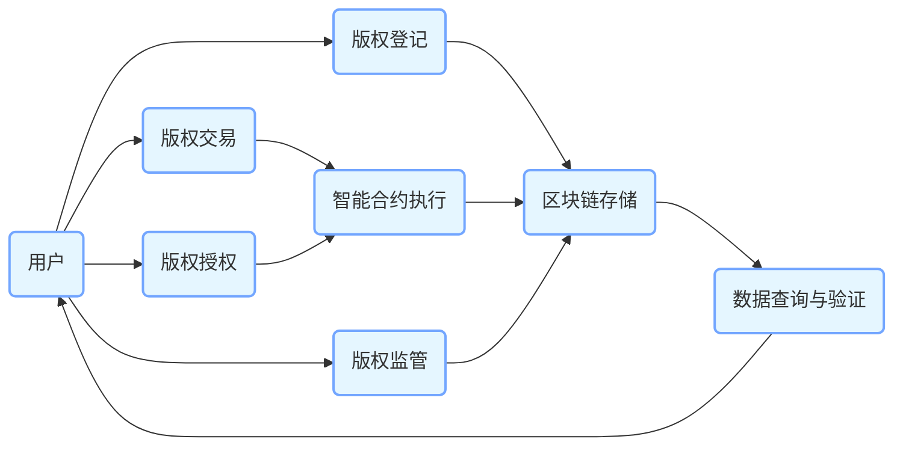

# 企业估值中的区块链数字艺术品版权管理平台评估

> 关键词：企业估值、区块链、数字艺术品、版权管理平台、评估方法

> 摘要：本文聚焦于企业估值中区块链数字艺术品版权管理平台的评估。首先介绍了相关背景，包括目的、预期读者、文档结构和术语表。接着阐述了核心概念与联系，通过文本示意图和 Mermaid 流程图展示其原理和架构。详细讲解了核心算法原理及具体操作步骤，并使用 Python 代码进行说明。给出了相关数学模型和公式，并举例说明。通过项目实战，从开发环境搭建、源代码实现与解读等方面进行了分析。探讨了该平台的实际应用场景，推荐了学习资源、开发工具框架和相关论文著作。最后总结了未来发展趋势与挑战，提供了常见问题解答和扩展阅读参考资料，旨在为企业准确评估区块链数字艺术品版权管理平台提供全面的技术和理论支持。

## 1. 背景介绍 
### 1.1 目的和范围
在当今数字化时代，数字艺术品市场蓬勃发展，但版权管理问题成为制约其进一步发展的关键因素。区块链技术凭借其去中心化、不可篡改、可追溯等特性，为数字艺术品版权管理提供了新的解决方案。本文章的目的在于深入探讨如何对企业中的区块链数字艺术品版权管理平台进行准确评估，涵盖平台的技术架构、功能特性、市场价值、潜在风险等多个方面。评估范围包括平台的技术原理、算法实现、数学模型、实际应用案例以及未来发展趋势等，旨在为企业管理者、投资者、技术开发者等提供全面的评估参考，以便做出合理的决策。

### 1.2 预期读者
本文的预期读者主要包括以下几类人群：
- **企业管理者**：负责企业战略规划和决策，需要了解区块链数字艺术品版权管理平台的价值和潜力，以便决定是否投资、开发或采用该平台。
- **投资者**：对数字艺术品市场和区块链技术感兴趣，希望通过评估平台的价值来判断投资机会和风险。
- **技术开发者**：专注于区块链和数字艺术品相关技术的研究和开发，希望深入了解平台的技术架构和算法原理，为后续的开发工作提供参考。
- **行业研究者**：关注数字艺术品版权管理领域的发展动态，希望通过本文获取最新的研究成果和实践经验。

### 1.3 文档结构概述
本文将按照以下结构进行组织：
- **核心概念与联系**：介绍区块链、数字艺术品、版权管理等核心概念，并阐述它们之间的联系，通过文本示意图和 Mermaid 流程图展示平台的原理和架构。
- **核心算法原理 & 具体操作步骤**：详细讲解平台中使用的核心算法，如哈希算法、共识算法等，并给出具体的操作步骤，同时使用 Python 代码进行实现和说明。
- **数学模型和公式 & 详细讲解 & 举例说明**：建立相关的数学模型和公式，用于评估平台的性能、安全性等指标，并通过具体的例子进行详细讲解。
- **项目实战：代码实际案例和详细解释说明**：通过一个实际的项目案例，介绍平台的开发环境搭建、源代码实现和代码解读，帮助读者更好地理解平台的实际应用。
- **实际应用场景**：探讨区块链数字艺术品版权管理平台在不同场景下的应用，如艺术品交易、展览展示、版权保护等。
- **工具和资源推荐**：推荐相关的学习资源、开发工具框架和论文著作，帮助读者进一步深入学习和研究。
- **总结：未来发展趋势与挑战**：总结区块链数字艺术品版权管理平台的发展趋势，分析面临的挑战，并提出相应的建议。
- **附录：常见问题与解答**：解答读者在阅读过程中可能遇到的常见问题。
- **扩展阅读 & 参考资料**：提供相关的扩展阅读材料和参考资料，方便读者进一步深入研究。

### 1.4 术语表
#### 1.4.1 核心术语定义
- **区块链（Blockchain）**：一种去中心化的分布式账本技术，由一系列按时间顺序相连的区块组成，每个区块包含一定数量的交易记录，通过密码学技术保证数据的不可篡改和可追溯性。
- **数字艺术品（Digital Artwork）**：以数字形式存在的艺术作品，包括但不限于图片、视频、音频、动画等，具有独特的艺术价值和版权属性。
- **版权管理（Copyright Management）**：对作品版权的保护、授权、交易等一系列管理活动，旨在确保版权所有者的合法权益得到保障，促进作品的合理使用和传播。
- **智能合约（Smart Contract）**：一种基于区块链技术的自动化合约，通过代码实现合约条款的自动执行，无需第三方干预，具有透明、不可篡改、高效等特点。

#### 1.4.2 相关概念解释
- **去中心化（Decentralization）**：区块链技术的核心特性之一，指系统不依赖于单一的中心化机构进行管理和控制，而是由多个节点共同参与维护和验证数据，提高了系统的可靠性和安全性。
- **哈希算法（Hash Algorithm）**：一种将任意长度的输入数据转换为固定长度哈希值的算法，具有唯一性和不可逆性，常用于数据完整性验证和加密。
- **共识算法（Consensus Algorithm）**：区块链网络中用于达成节点间共识的算法，确保所有节点对账本数据的一致性和正确性达成一致，常见的共识算法有工作量证明（PoW）、权益证明（PoS）等。

#### 1.4.3 缩略词列表
- **PoW（Proof of Work）**：工作量证明，一种常见的区块链共识算法，通过节点完成一定的计算工作量来竞争记账权。
- **PoS（Proof of Stake）**：权益证明，一种基于节点持有代币数量和时间的共识算法，持有代币越多、时间越长的节点越有可能获得记账权。
- **NFT（Non-Fungible Token）**：非同质化代币，一种基于区块链技术的数字资产代币，每个代币具有唯一的标识和属性，可用于表示数字艺术品的所有权和版权。

## 2. 核心概念与联系 

### 核心概念原理
#### 区块链原理
区块链是一种分布式账本技术，其核心原理基于密码学和分布式共识机制。它由一个个区块组成，每个区块包含前一个区块的哈希值、交易数据和时间戳等信息。通过哈希算法，每个区块的哈希值是唯一的，并且与前一个区块的哈希值相连，形成一个不可篡改的链式结构。例如，当一个新的交易发生时，该交易信息会被打包成一个新的区块，并通过共识算法在区块链网络中进行验证和确认。一旦区块被添加到区块链中，其数据就无法被修改，保证了数据的安全性和可靠性。

#### 数字艺术品原理
数字艺术品是以数字形式存在的艺术作品，它可以是图像、音频、视频等多种形式。数字艺术品的独特之处在于其可复制性和传播性，但同时也带来了版权保护的难题。数字艺术品的版权信息通常包含作者、创作时间、作品内容等，这些信息可以通过区块链技术进行存储和管理，确保版权的唯一性和可追溯性。

#### 版权管理原理
版权管理的核心是保护版权所有者的合法权益，确保作品的合法使用和传播。在区块链数字艺术品版权管理平台中，版权信息被记录在区块链上，通过智能合约实现版权的授权、交易和监管。智能合约是一种自动执行的合约，当满足预设的条件时，合约会自动执行相应的操作，如版权转让、费用支付等。这种方式提高了版权管理的效率和透明度，减少了中间环节的成本和风险。

### 架构的文本示意图
```plaintext
区块链数字艺术品版权管理平台架构

用户层：
|-- 艺术家
|-- 收藏家
|-- 投资者
|-- 监管机构

应用层：
|-- 版权登记
|-- 版权交易
|-- 版权授权
|-- 版权监管

服务层：
|-- 智能合约服务
|-- 数据存储服务
|-- 身份认证服务
|-- 共识机制服务

区块链层：
|-- 公有链
|-- 联盟链
|-- 私有链

基础设施层：
|-- 服务器
|-- 网络设备
|-- 存储设备
```

### Mermaid 流程图


该流程图展示了区块链数字艺术品版权管理平台的主要业务流程。用户可以进行版权登记、交易、授权和监管等操作，这些操作通过智能合约在区块链上执行，并将相关数据存储在区块链中。用户可以随时查询和验证存储在区块链上的版权信息。

## 3. 核心算法原理 & 具体操作步骤 

### 哈希算法原理及 Python 实现
#### 原理
哈希算法是区块链技术中非常重要的一部分，它将任意长度的输入数据转换为固定长度的哈希值。哈希值具有唯一性，即不同的输入数据会产生不同的哈希值，而且哈希算法是不可逆的，无法从哈希值反推出原始输入数据。在区块链中，哈希算法用于保证数据的完整性和不可篡改，每个区块的哈希值是由该区块的内容和前一个区块的哈希值计算得出的。

#### Python 代码实现
```python
import hashlib

def calculate_hash(data):
    """
    计算数据的哈希值
    :param data: 输入的数据
    :return: 哈希值
    """
    # 创建一个 SHA-256 哈希对象
    hash_object = hashlib.sha256()
    # 将数据编码为字节类型并更新哈希对象
    hash_object.update(data.encode())
    # 获取哈希值的十六进制表示
    return hash_object.hexdigest()

# 示例数据
data = "Hello, Blockchain!"
# 计算哈希值
hash_value = calculate_hash(data)
print(f"数据: {data}")
print(f"哈希值: {hash_value}")
```

### 共识算法原理及 Python 实现（以简单的工作量证明为例）
#### 原理
工作量证明（PoW）是一种常见的区块链共识算法，它通过让节点进行一定的计算工作量来竞争记账权。在 PoW 算法中，节点需要找到一个特定的数值（称为随机数），使得该数值与区块的其他信息组合后计算得到的哈希值满足一定的条件（通常是哈希值的前几位为 0）。找到符合条件的随机数的节点将获得记账权，并获得相应的奖励。

#### Python 代码实现
```python
import hashlib
import time

class Block:
    def __init__(self, index, previous_hash, data):
        self.index = index
        self.previous_hash = previous_hash
        self.data = data
        self.timestamp = time.time()
        self.nonce = 0
        self.hash = self.calculate_hash()

    def calculate_hash(self):
        """
        计算区块的哈希值
        :return: 哈希值
        """
        block_string = f"{self.index}{self.previous_hash}{self.data}{self.timestamp}{self.nonce}"
        return hashlib.sha256(block_string.encode()).hexdigest()

    def mine_block(self, difficulty):
        """
        挖矿操作，找到符合难度要求的哈希值
        :param difficulty: 挖矿难度，即哈希值前导 0 的个数
        """
        target = "0" * difficulty
        while self.hash[:difficulty]!= target:
            self.nonce += 1
            self.hash = self.calculate_hash()
        print(f"区块 {self.index} 已挖出，哈希值: {self.hash}")

# 创世区块
genesis_block = Block(0, "0", "Genesis Block")
# 挖矿难度
difficulty = 4
# 开始挖矿
genesis_block.mine_block(difficulty)
```

### 具体操作步骤
#### 哈希算法操作步骤
1. 选择合适的哈希算法，如 SHA-256。
2. 将输入数据编码为字节类型。
3. 创建哈希对象，并将编码后的数据更新到哈希对象中。
4. 获取哈希对象的十六进制表示作为最终的哈希值。

#### 工作量证明操作步骤
1. 创建一个新的区块，包含区块的索引、前一个区块的哈希值、数据、时间戳和随机数。
2. 计算当前区块的哈希值。
3. 设置挖矿难度，即哈希值前导 0 的个数。
4. 不断增加随机数，重新计算哈希值，直到哈希值满足难度要求。
5. 当找到符合条件的哈希值时，该区块被挖出，获得记账权。

## 4. 数学模型和公式 & 详细讲解 & 举例说明 

### 哈希算法的数学模型
哈希算法可以用数学函数 $H(x)$ 表示，其中 $x$ 是输入数据，$H(x)$ 是输出的哈希值。哈希函数具有以下性质：
- **确定性**：对于相同的输入 $x$，哈希函数 $H(x)$ 总是返回相同的输出。
- **唯一性**：不同的输入 $x_1$ 和 $x_2$，通常情况下 $H(x_1) \neq H(x_2)$。
- **不可逆性**：无法从哈希值 $H(x)$ 反推出原始输入 $x$。

例如，对于输入数据 $x = "Hello, World!"$，使用 SHA-256 哈希算法计算得到的哈希值为：
$$H("Hello, World!") = "65a8e27d8879283831b664bd8b7f0ad4"$$

### 工作量证明的数学模型
在工作量证明算法中，挖矿的目标是找到一个随机数 $n$，使得区块的哈希值 $H(B, n)$ 满足一定的条件。设难度目标为 $T$，则挖矿的条件可以表示为：
$$H(B, n) < T$$
其中 $B$ 是区块的其他信息（不包括随机数），$n$ 是随机数。挖矿的过程就是不断尝试不同的随机数 $n$，直到找到满足条件的哈希值。

例如，假设难度目标 $T$ 对应的哈希值前 4 位为 0，区块信息 $B$ 为：
$$B = "Index: 1, Previous Hash: 0, Data: Transaction Data"$$
初始随机数 $n = 0$，计算哈希值 $H(B, 0)$，如果不满足条件，则增加随机数 $n$ 为 1，再次计算哈希值 $H(B, 1)$，以此类推，直到找到满足条件的随机数。

### 智能合约的数学模型
智能合约可以用状态机来表示，状态机由状态集合 $S$、输入集合 $I$、转移函数 $\delta$ 和初始状态 $s_0$ 组成。智能合约的执行过程可以看作是状态机在输入的作用下从一个状态转移到另一个状态的过程。

设智能合约的当前状态为 $s \in S$，输入为 $i \in I$，则状态转移可以表示为：
$$\delta(s, i) = s'$$
其中 $s'$ 是转移后的状态。

例如，一个简单的版权转让智能合约，状态集合 $S = \{未转让, 已转让\}$，输入集合 $I = \{转让请求, 确认转让\}$，转移函数 $\delta$ 可以定义为：
- $\delta(未转让, 转让请求) = 待确认转让$
- $\delta(待确认转让, 确认转让) = 已转让$

初始状态 $s_0 = 未转让$，当接收到转让请求时，状态转移到待确认转让，当接收到确认转让时，状态转移到已转让。

## 5. 项目实战：代码实际案例和详细解释说明 

### 5.1  开发环境搭建
#### 硬件环境
- 服务器：建议使用具有较高性能的云服务器，如阿里云、腾讯云等，配置为至少 2 核 CPU、4GB 内存和 50GB 以上的存储空间。
- 网络设备：稳定的网络连接，带宽建议不低于 10Mbps。

#### 软件环境
- 操作系统：推荐使用 Linux 系统，如 Ubuntu 18.04 或更高版本。
- 编程语言：Python 3.7 或更高版本，因为 Python 具有丰富的库和工具，适合快速开发。
- 区块链平台：选择合适的区块链平台，如以太坊（Ethereum）或 Hyperledger Fabric。这里以以太坊为例，需要安装以太坊客户端（如 Geth）和相关的开发工具（如 Truffle）。
- 数据库：使用 MySQL 或 PostgreSQL 等关系型数据库来存储平台的业务数据。

#### 安装步骤
1. **安装 Python**：可以从 Python 官方网站下载安装包，按照安装向导进行安装。安装完成后，使用以下命令验证 Python 版本：
```bash
python --version
```
2. **安装以太坊客户端（Geth）**：根据操作系统的不同，从以太坊官方网站下载对应的 Geth 安装包，按照说明进行安装。安装完成后，启动 Geth 节点：
```bash
geth --datadir /path/to/data --networkid 1234 --rpc --rpcaddr "0.0.0.0" --rpcport "8545" --rpccorsdomain "*" --rpcapi "eth,net,web3,personal" console
```
3. **安装 Truffle**：使用 npm（Node.js 包管理器）安装 Truffle：
```bash
npm install -g truffle
```
4. **安装 MySQL**：根据操作系统的不同，从 MySQL 官方网站下载对应的安装包，按照说明进行安装。安装完成后，创建一个新的数据库用于存储平台数据。

### 5.2  源代码详细实现和代码解读
#### 智能合约代码实现（使用 Solidity 语言）
```solidity
// SPDX-License-Identifier: MIT
pragma solidity ^0.8.0;

contract DigitalArtworkCopyright {
    // 定义艺术品结构体
    struct Artwork {
        string title;
        string author;
        string description;
        address owner;
        bool isRegistered;
    }

    // 存储艺术品的映射
    mapping(uint256 => Artwork) public artworks;
    // 艺术品计数器
    uint256 public artworkCount;

    // 事件：艺术品注册
    event ArtworkRegistered(uint256 indexed id, string title, string author, address owner);

    // 注册艺术品
    function registerArtwork(string memory _title, string memory _author, string memory _description) public {
        artworkCount++;
        artworks[artworkCount] = Artwork({
            title: _title,
            author: _author,
            description: _description,
            owner: msg.sender,
            isRegistered: true
        });
        emit ArtworkRegistered(artworkCount, _title, _author, msg.sender);
    }

    // 获取艺术品信息
    function getArtwork(uint256 _id) public view returns (string memory, string memory, string memory, address, bool) {
        Artwork memory artwork = artworks[_id];
        return (artwork.title, artwork.author, artwork.description, artwork.owner, artwork.isRegistered);
    }
}
```
#### 代码解读
- **结构体定义**：`Artwork` 结构体用于存储艺术品的相关信息，包括标题、作者、描述、所有者地址和注册状态。
- **映射和计数器**：`artworks` 映射用于存储所有的艺术品信息，`artworkCount` 用于记录艺术品的数量。
- **事件**：`ArtworkRegistered` 事件用于在艺术品注册成功时触发，方便外部监听。
- **注册函数**：`registerArtwork` 函数用于注册新的艺术品，将艺术品信息存储到映射中，并触发事件。
- **查询函数**：`getArtwork` 函数用于获取指定 ID 的艺术品信息。

#### Python 脚本调用智能合约
```python
from web3 import Web3
import json

# 连接到以太坊节点
w3 = Web3(Web3.HTTPProvider('http://localhost:8545'))

# 加载智能合约的 ABI 和地址
with open('DigitalArtworkCopyright.json', 'r') as f:
    contract_data = json.load(f)
abi = contract_data['abi']
contract_address = '0x123456789abcdef...'  # 替换为实际的合约地址

# 创建合约实例
contract = w3.eth.contract(address=contract_address, abi=abi)

# 注册艺术品
title = "My Digital Artwork"
author = "John Doe"
description = "A beautiful digital artwork"
tx_hash = contract.functions.registerArtwork(title, author, description).transact({'from': w3.eth.accounts[0]})
w3.eth.waitForTransactionReceipt(tx_hash)

# 获取艺术品信息
artwork_id = 1
title, author, description, owner, is_registered = contract.functions.getArtwork(artwork_id).call()
print(f"Title: {title}")
print(f"Author: {author}")
print(f"Description: {description}")
print(f"Owner: {owner}")
print(f"Is Registered: {is_registered}")
```
#### 代码解读
- **连接到以太坊节点**：使用 `Web3` 库连接到本地的以太坊节点。
- **加载智能合约信息**：从 JSON 文件中加载智能合约的 ABI（应用二进制接口）和地址。
- **创建合约实例**：使用 ABI 和地址创建合约实例。
- **注册艺术品**：调用智能合约的 `registerArtwork` 函数注册新的艺术品，并等待交易确认。
- **获取艺术品信息**：调用智能合约的 `getArtwork` 函数获取指定 ID 的艺术品信息，并打印输出。

### 5.3  代码解读与分析
#### 智能合约代码分析
- **安全性**：智能合约使用了 Solidity 语言的最新版本，遵循了一定的安全规范，如使用 `view` 修饰符确保查询函数不会修改合约状态，使用 `require` 语句进行输入验证等。
- **可扩展性**：智能合约的结构设计具有一定的可扩展性，可以方便地添加新的功能，如版权转让、授权等。
- **事件机制**：通过事件机制，外部系统可以监听合约的状态变化，实现与其他系统的集成。

#### Python 脚本代码分析
- **易用性**：使用 `Web3` 库可以方便地与以太坊节点进行交互，降低了开发难度。
- **异步处理**：在调用智能合约函数时，使用 `transact` 方法发起交易，并使用 `waitForTransactionReceipt` 方法等待交易确认，确保交易的可靠性。
- **数据处理**：通过调用智能合约的查询函数，可以方便地获取艺术品的信息，并进行进一步的处理。

## 6. 实际应用场景 
### 艺术品交易
在传统的艺术品交易中，存在着信息不透明、真伪难辨、版权纠纷等问题。区块链数字艺术品版权管理平台可以为艺术品交易提供一个透明、可信的环境。艺术家可以将自己的数字艺术品在平台上进行版权登记，生成唯一的 NFT（非同质化代币），代表艺术品的所有权和版权。收藏家可以通过平台购买 NFT，获得艺术品的所有权，同时平台可以记录交易的全过程，确保交易的真实性和合法性。例如，知名数字艺术家 Beeple 的作品《Everydays: The First 5000 Days》通过 NFT 形式在佳士得拍卖行以 6934 万美元的价格成交，这充分展示了区块链数字艺术品交易的潜力。

### 展览展示
在艺术品展览展示方面，区块链数字艺术品版权管理平台可以为展览主办方提供准确的版权信息，确保展览的合法性。同时，平台可以通过智能合约实现艺术品的授权展示，只有获得授权的展览方才能展示相关艺术品。观众可以通过扫描艺术品上的二维码，查看艺术品的详细信息和版权归属，增加了展览的互动性和趣味性。例如，一些博物馆和画廊开始尝试使用区块链技术展示数字艺术品，为观众带来全新的观展体验。

### 版权保护
对于数字艺术品的版权保护，区块链平台具有天然的优势。通过将艺术品的版权信息记录在区块链上，形成不可篡改的证据链，一旦发生版权纠纷，可以快速准确地确定版权归属。同时，平台可以通过智能合约实现版权的自动维权，当发现有侵权行为时，智能合约可以自动触发相应的惩罚机制，如扣除侵权方的保证金等。例如，一些数字音乐平台开始使用区块链技术保护音乐作品的版权，有效地减少了侵权行为的发生。

### 艺术创作与合作
区块链数字艺术品版权管理平台可以为艺术家之间的创作与合作提供便利。艺术家可以在平台上发布自己的创作计划和需求，寻找合作伙伴。通过智能合约，可以明确合作双方的权利和义务，确保合作的公平性和合法性。同时，平台可以记录创作过程中的每一个环节，为作品的版权归属提供有力的证据。例如，一些艺术社区开始利用区块链技术促进艺术家之间的合作，共同创作优秀的数字艺术作品。

## 7. 工具和资源推荐
### 7.1 学习资源推荐
#### 7.1.1 书籍推荐
- 《区块链：技术驱动金融》：本书由中信出版社出版，作者是阿尔文德·纳拉亚南等。该书从技术和金融的角度深入介绍了区块链的原理、应用和发展趋势，是一本非常经典的区块链入门书籍。
- 《Python 区块链开发实战》：由机械工业出版社出版，作者是谢亮。本书以 Python 语言为基础，详细介绍了区块链的开发过程，包括区块链的基本概念、共识算法、智能合约等，适合有一定编程基础的读者学习。
- 《数字艺术：从概念到实践》：作者是克里斯·萨顿，本书全面介绍了数字艺术的发展历程、创作方法和应用领域，对于想要了解数字艺术品的读者来说是一本很好的参考书籍。

#### 7.1.2 在线课程
- Coursera 上的《区块链基础》：由普林斯顿大学教授阿尔文德·纳拉亚南授课，课程内容涵盖了区块链的基本概念、密码学原理、共识算法等，通过视频讲解、案例分析和编程作业等方式，帮助学习者深入理解区块链技术。
- edX 上的《Python 编程基础》：适合没有编程基础的读者学习，课程从 Python 的基本语法开始讲解，逐步引导学习者掌握 Python 编程的基本技能，为后续的区块链开发打下基础。
- Udemy 上的《数字艺术品创作与设计》：该课程由专业的数字艺术家授课，介绍了数字艺术品的创作工具、技巧和方法，通过实际案例演示，帮助学习者快速掌握数字艺术品的创作流程。

#### 7.1.3 技术博客和网站
- Medium：这是一个知名的技术博客平台，上面有很多关于区块链、数字艺术品和版权管理的文章，作者来自全球各地的技术专家和行业从业者，可以从中获取最新的技术动态和行业趋势。
- CoinDesk：专注于区块链和加密货币领域的新闻和分析，提供了大量的行业资讯、研究报告和专家观点，对于了解区块链数字艺术品市场的发展情况非常有帮助。
- Artincontext.org：一个关于艺术和文化的网站，上面有很多关于数字艺术品的评论、分析和展览信息，可以帮助读者深入了解数字艺术品的艺术价值和文化内涵。

### 7.2 开发工具框架推荐
#### 7.2.1 IDE和编辑器
- Visual Studio Code：一款功能强大的开源代码编辑器，支持多种编程语言和插件扩展。在区块链开发中，可以使用相关的插件来进行智能合约的开发、调试和部署，如 Solidity 插件、Web3 插件等。
- PyCharm：专门为 Python 开发设计的集成开发环境（IDE），具有代码自动补全、调试、版本控制等功能，适合进行 Python 脚本的开发和调试。
- Remix：一个基于网页的以太坊智能合约开发环境，无需安装，直接在浏览器中使用。它提供了代码编辑、编译、部署和调试等功能，方便开发者快速开发和测试智能合约。

#### 7.2.2 调试和性能分析工具
- Truffle Debugger：Truffle 是一个流行的以太坊开发框架，其调试器可以帮助开发者调试智能合约代码，查看合约的执行过程和状态变化，定位和解决问题。
- Ganache：一个本地的以太坊开发网络，提供了一个模拟的区块链环境，开发者可以在其中快速部署和测试智能合约，无需连接到真实的以太坊网络，提高了开发效率。
- Web3.py：一个 Python 库，用于与以太坊节点进行交互。它提供了丰富的 API 接口，可以方便地进行交易的发送、合约的调用和数据的查询等操作，同时支持调试和性能分析功能。

#### 7.2.3 相关框架和库
- Ethereum.js：一个用于与以太坊网络交互的 JavaScript 库，提供了丰富的 API 接口，支持智能合约的部署、调用和事件监听等功能，适用于前端开发。
- Hyperledger Fabric：一个开源的企业级区块链平台，具有高性能、可扩展性和安全性等特点，适合开发大规模的区块链应用，如版权管理平台。
- IPFS（InterPlanetary File System）：一个分布式文件系统，用于存储和共享数据。在区块链数字艺术品版权管理平台中，可以使用 IPFS 来存储艺术品的原始文件，确保数据的安全性和可靠性。

### 7.3 相关论文著作推荐
#### 7.3.1 经典论文
- 《比特币：一种点对点的电子现金系统》：作者是中本聪，这是比特币的创世论文，首次提出了区块链和比特币的概念，为区块链技术的发展奠定了基础。
- 《以太坊：下一代智能合约和去中心化应用平台》：由维塔利克·布特林等人撰写，介绍了以太坊的设计理念、技术架构和应用场景，推动了智能合约和去中心化应用的发展。
- 《区块链技术在版权保护中的应用研究》：该论文探讨了区块链技术在版权保护领域的应用原理、优势和挑战，为区块链数字艺术品版权管理平台的研究提供了重要的理论支持。

#### 7.3.2 最新研究成果
- 《基于区块链的数字艺术品版权管理模型研究》：该研究提出了一种基于区块链的数字艺术品版权管理模型，通过智能合约实现版权的自动化管理和交易，提高了版权管理的效率和安全性。
- 《区块链技术在数字资产交易中的应用与发展趋势》：分析了区块链技术在数字资产交易领域的应用现状和发展趋势，为区块链数字艺术品交易平台的开发和运营提供了参考。
- 《数字艺术品的价值评估与定价模型研究》：探讨了数字艺术品的价值评估方法和定价模型，对于企业评估区块链数字艺术品版权管理平台的市场价值具有重要的指导意义。

#### 7.3.3 应用案例分析
- 《某区块链数字艺术品交易平台的实践与探索》：介绍了一个实际的区块链数字艺术品交易平台的开发背景、技术架构、业务流程和运营模式，通过案例分析，为其他企业开发类似平台提供了借鉴和参考。
- 《区块链技术在博物馆数字藏品管理中的应用案例》：讲述了某博物馆如何利用区块链技术管理数字藏品的版权和交易，提高了博物馆数字藏品的管理效率和透明度。
- 《区块链数字艺术品版权保护的成功案例分析》：分析了一些成功的区块链数字艺术品版权保护案例，总结了其中的经验和教训，为企业加强版权保护提供了有益的启示。

## 8. 总结：未来发展趋势与挑战
### 未来发展趋势
#### 市场规模扩大
随着数字艺术品市场的不断发展和人们对版权保护意识的提高，区块链数字艺术品版权管理平台的市场需求将持续增长。越来越多的艺术家、收藏家、投资者和企业将参与到数字艺术品的创作、交易和收藏中，推动市场规模不断扩大。预计未来几年，区块链数字艺术品市场将呈现出爆发式增长的态势。

#### 技术创新不断
区块链技术本身也在不断发展和创新，未来可能会出现更加高效、安全、可扩展的区块链平台和共识算法。同时，人工智能、大数据、物联网等技术与区块链的融合将进一步提升数字艺术品版权管理平台的功能和性能。例如，利用人工智能技术对数字艺术品进行真伪鉴定和价值评估，利用大数据技术分析市场趋势和用户行为，利用物联网技术实现艺术品的实时监控和追踪。

#### 应用场景拓展
除了现有的艺术品交易、展览展示、版权保护和艺术创作与合作等应用场景外，区块链数字艺术品版权管理平台的应用场景还将不断拓展。例如，在文化旅游、教育、娱乐等领域，数字艺术品可以与这些领域进行深度融合，创造出更多的商业价值和社会价值。例如，在文化旅游景区，可以利用数字艺术品打造虚拟展览和体验项目，吸引更多的游客；在教育领域，可以将数字艺术品作为教学资源，丰富教学内容和形式。

#### 行业标准和规范逐步完善
随着区块链数字艺术品市场的发展，行业标准和规范将逐步完善。政府和相关监管机构将加强对数字艺术品市场的监管，制定相关的法律法规和政策，规范市场秩序，保护投资者和消费者的合法权益。同时，行业协会和组织也将发挥重要作用，制定行业标准和自律规范，促进市场的健康发展。

### 挑战
#### 技术难题
虽然区块链技术已经取得了很大的进展，但仍然面临一些技术难题。例如，区块链的性能问题，目前区块链的处理速度和吞吐量还无法满足大规模商业应用的需求；区块链的隐私保护问题，如何在保证数据公开透明的同时，保护用户的隐私信息；区块链的跨链互操作性问题，如何实现不同区块链平台之间的互联互通和数据共享等。

#### 法律和监管问题
区块链数字艺术品版权管理平台涉及到版权、金融、税收等多个领域的法律和监管问题。目前，相关的法律法规还不够完善，监管政策也存在一定的滞后性。例如，数字艺术品的版权归属和保护问题，NFT 的法律性质和监管问题，数字艺术品交易的税收问题等，都需要进一步明确和规范。

#### 市场认知和接受度问题
尽管区块链数字艺术品市场发展迅速，但仍然存在一些市场认知和接受度问题。一些投资者和消费者对区块链技术和数字艺术品的了解还不够深入，对其价值和风险认识不足。同时，市场上也存在一些虚假宣传和欺诈行为，影响了市场的健康发展。因此，需要加强市场宣传和教育，提高投资者和消费者的认知水平和风险意识。

#### 人才短缺问题
区块链数字艺术品版权管理平台的开发和运营需要具备区块链技术、数字艺术、版权管理、金融等多方面知识和技能的复合型人才。目前，这类人才非常短缺，制约了行业的发展。因此，需要加强人才培养和引进，提高行业的整体素质和竞争力。

## 9. 附录：常见问题与解答
### 1. 区块链数字艺术品版权管理平台与传统版权管理方式有什么区别？
传统版权管理方式主要依赖于中心化的机构和纸质文件，存在信息不透明、易篡改、效率低下等问题。而区块链数字艺术品版权管理平台采用去中心化的区块链技术，将版权信息记录在区块链上，具有不可篡改、可追溯、透明等特点，提高了版权管理的效率和安全性。同时，平台通过智能合约实现版权的自动化管理和交易，减少了中间环节，降低了成本。

### 2. 如何确保区块链上的数字艺术品版权信息的真实性？
在区块链数字艺术品版权管理平台中，艺术品的版权信息在上传到区块链之前需要经过严格的审核和验证。艺术家需要提供作品的原始创作资料、身份证明等相关信息，平台会对这些信息进行核实。同时，平台可以利用人工智能技术对艺术品进行真伪鉴定，确保版权信息的真实性。一旦版权信息被记录在区块链上，就无法被篡改，保证了信息的可靠性。

### 3. 区块链数字艺术品版权管理平台的安全性如何保障？
区块链数字艺术品版权管理平台的安全性主要通过以下几个方面来保障：
- **密码学技术**：区块链使用哈希算法、数字签名等密码学技术对数据进行加密和验证，确保数据的完整性和不可篡改。
- **共识算法**：通过共识算法，如工作量证明（PoW）、权益证明（PoS）等，保证区块链网络中节点之间的一致性和安全性。
- **智能合约安全**：在智能合约的开发过程中，遵循安全规范，进行严格的代码审查和测试，避免出现安全漏洞。
- **多重签名和冷钱包**：在数字资产的存储和交易中，采用多重签名和冷钱包等技术，提高资产的安全性。

### 4. 区块链数字艺术品版权管理平台的成本高吗？
区块链数字艺术品版权管理平台的成本主要包括技术开发成本、运营成本和交易成本等。在技术开发方面，需要投入一定的人力和物力来开发和维护平台。在运营方面，需要支付服务器租赁、网络带宽、人员工资等费用。在交易方面，区块链网络可能会收取一定的手续费。然而，随着技术的发展和市场的成熟，平台的成本会逐渐降低。同时，与传统版权管理方式相比，区块链平台可以提高效率、降低中间环节成本，从长远来看，具有一定的成本优势。

### 5. 如何参与区块链数字艺术品版权管理平台的投资？
参与区块链数字艺术品版权管理平台的投资可以通过以下几种方式：
- **投资平台企业**：可以通过购买平台企业的股票或股权，参与平台的发展和盈利。
- **投资数字艺术品**：可以购买数字艺术品的 NFT，获得艺术品的所有权和版权，随着艺术品价值的提升，实现投资收益。
- **参与平台的挖矿或节点运营**：一些区块链平台会提供挖矿或节点运营的机会，投资者可以通过参与这些活动获得平台的代币奖励。

在参与投资之前，需要充分了解平台的背景、技术、市场前景等信息，评估投资风险，并根据自己的风险承受能力和投资目标做出合理的投资决策。

## 10. 扩展阅读 & 参考资料
### 扩展阅读
- 《区块链革命：比特币底层技术如何改变货币、商业和世界》：深入探讨了区块链技术对各个行业的影响和变革，为读者提供了更广阔的视野和思考角度。
- 《数字艺术的未来：技术与创意的融合》：关注数字艺术的未来发展趋势，分析了技术与创意在数字艺术领域的相互作用和影响。
- 《版权保护与文化产业发展》：研究了版权保护在文化产业发展中的重要作用，以及如何通过有效的版权管理促进文化产业的繁荣。

### 参考资料
- 以太坊官方文档：https://ethereum.org/
- 比特币白皮书：https://bitcoin.org/bitcoin.pdf
- 国际数字艺术协会官方网站：https://www.idaa.org/
- 中国版权保护中心官方网站：https://www.ccopyright.com.cn/

作者：AI天才研究院/AI Genius Institute & 禅与计算机程序设计艺术 /Zen And The Art of Computer Programming