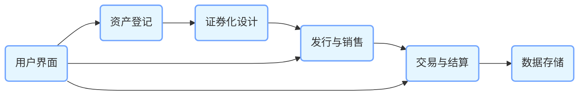

# 企业估值中的区块链数字资产证券化平台评估

> 关键词：企业估值、区块链、数字资产证券化、平台评估、金融科技

> 摘要：本文聚焦于企业估值中区块链数字资产证券化平台的评估。随着区块链技术的发展和数字资产市场的兴起，数字资产证券化平台成为金融领域的新兴热点。文章将深入探讨该平台的核心概念、算法原理、数学模型，通过实际案例展示其应用，分析实际应用场景，推荐相关工具和资源，最后总结未来发展趋势与挑战，并对常见问题进行解答。旨在为企业在评估区块链数字资产证券化平台时提供全面、深入的参考。

## 1. 背景介绍 
### 1.1 目的和范围
随着区块链技术的不断成熟和数字经济的快速发展，数字资产证券化逐渐成为金融创新的重要方向。企业在考虑参与数字资产证券化或评估相关平台时，需要一套科学、合理的评估方法。本文的目的就是提供一个全面的框架，用于评估区块链数字资产证券化平台在企业估值中的作用和价值。范围涵盖了平台的技术架构、业务模式、风险控制、市场潜力等多个方面。

### 1.2 预期读者
本文预期读者包括企业的财务管理人员、投资经理、金融分析师、区块链技术开发者以及对数字资产证券化感兴趣的研究人员。这些读者希望了解如何在企业估值中准确评估区块链数字资产证券化平台，以做出合理的投资决策或战略规划。

### 1.3 文档结构概述
本文将首先介绍区块链数字资产证券化平台的核心概念和相关联系，包括其原理和架构。接着详细阐述核心算法原理和具体操作步骤，并通过Python代码进行说明。然后给出数学模型和公式，并结合实际例子进行讲解。在项目实战部分，将展示代码实际案例并进行详细解释。之后分析该平台的实际应用场景，推荐相关的工具和资源。最后总结未来发展趋势与挑战，解答常见问题，并提供扩展阅读和参考资料。

### 1.4 术语表
#### 1.4.1 核心术语定义
- **区块链（Blockchain）**：一种分布式账本技术，通过去中心化、不可篡改的方式记录交易信息。
- **数字资产（Digital Asset）**：以电子数据形式存在的资产，如数字货币、虚拟股权等。
- **资产证券化（Asset Securitization）**：将缺乏流动性但具有可预期收入的资产，通过一定的结构安排，转化为可以在金融市场上流通的证券的过程。
- **区块链数字资产证券化平台（Blockchain-based Digital Asset Securitization Platform）**：基于区块链技术，实现数字资产证券化业务流程的平台，包括资产登记、交易、结算等功能。

#### 1.4.2 相关概念解释
- **智能合约（Smart Contract）**：一种自动执行的合约，其条款以代码形式存储在区块链上，当满足预设条件时自动执行。
- **分布式账本（Distributed Ledger）**：一种在多个参与者之间共享、复制和同步的账本，确保数据的一致性和安全性。
- **共识机制（Consensus Mechanism）**：区块链网络中达成共识的算法，用于确保所有节点对交易记录的一致性。

#### 1.4.3 缩略词列表
- **BTC**：比特币（Bitcoin）
- **ETH**：以太坊（Ethereum）
- **ICO**：首次代币发行（Initial Coin Offering）
- **STO**：证券型代币发行（Security Token Offering）

## 2. 核心概念与联系 

### 核心概念原理
区块链数字资产证券化平台的核心原理是利用区块链技术的特性，解决传统资产证券化过程中的痛点。区块链的去中心化特性可以消除中介机构的垄断，降低交易成本；不可篡改的特性可以保证交易记录的真实性和安全性；智能合约可以自动执行合约条款，提高交易效率。

具体来说，平台的运作流程如下：
1. **资产登记**：将数字资产的相关信息，如所有权、价值、收益权等，记录在区块链上。
2. **证券化设计**：根据资产的特点和市场需求，设计证券化产品的结构和条款。
3. **发行与销售**：通过平台向投资者发行证券化产品，并完成销售过程。
4. **交易与结算**：投资者在平台上进行证券化产品的交易，交易信息实时记录在区块链上，结算过程自动完成。

### 架构的文本示意图
```plaintext
区块链数字资产证券化平台架构

|----------------------|
|  用户界面层          |
|  （投资者、发行人）  |
|----------------------|
|  业务逻辑层          |
|  - 资产登记模块      |
|  - 证券化设计模块    |
|  - 发行销售模块      |
|  - 交易结算模块      |
|----------------------|
|  区块链层            |
|  - 分布式账本        |
|  - 智能合约          |
|  - 共识机制          |
|----------------------|
|  数据存储层          |
|  - 资产数据          |
|  - 交易数据          |
|  - 用户数据          |
|----------------------|
```

### Mermaid 流程图


## 3. 核心算法原理 & 具体操作步骤 

### 核心算法原理
在区块链数字资产证券化平台中，涉及到多个核心算法，如共识算法、加密算法和智能合约执行算法。以下分别进行介绍。

#### 共识算法
以常见的工作量证明（Proof of Work，PoW）算法为例，其核心思想是通过计算一个复杂的哈希函数，找到一个满足特定条件的随机数（Nonce）。节点需要不断尝试不同的Nonce值，直到找到满足条件的结果。第一个找到结果的节点将获得记账权，并将交易记录添加到区块链上。

#### 加密算法
加密算法用于保证数据的安全性和隐私性。常见的加密算法有哈希算法（如SHA-256）和非对称加密算法（如RSA）。哈希算法将任意长度的数据转换为固定长度的哈希值，用于验证数据的完整性；非对称加密算法使用一对密钥（公钥和私钥），公钥用于加密数据，私钥用于解密数据。

#### 智能合约执行算法
智能合约是一段自动执行的代码，其执行过程遵循预定义的规则。当满足合约条件时，智能合约将自动触发相应的操作。智能合约的执行通常基于虚拟机（如以太坊的EVM），虚拟机负责解释和执行合约代码。

### 具体操作步骤及Python代码示例

#### 1. 哈希计算示例
```python
import hashlib

def calculate_hash(data):
    """
    计算数据的SHA-256哈希值
    """
    data_bytes = str(data).encode('utf-8')
    hash_object = hashlib.sha256(data_bytes)
    return hash_object.hexdigest()

# 示例数据
data = "Hello, Blockchain!"
hash_value = calculate_hash(data)
print(f"数据 '{data}' 的哈希值为: {hash_value}")
```

#### 2. 简单智能合约示例
```python
# 简单的智能合约类
class SimpleSmartContract:
    def __init__(self, condition, action):
        self.condition = condition
        self.action = action

    def execute(self, input_data):
        """
        执行智能合约
        """
        if self.condition(input_data):
            return self.action(input_data)
        else:
            return None

# 定义条件函数和动作函数
def condition_function(input_data):
    return input_data > 10

def action_function(input_data):
    return input_data * 2

# 创建智能合约实例
contract = SimpleSmartContract(condition_function, action_function)

# 测试智能合约
input_data = 15
result = contract.execute(input_data)
if result is not None:
    print(f"智能合约执行结果: {result}")
else:
    print("未满足合约条件，未执行动作。")
```

## 4. 数学模型和公式 & 详细讲解 & 举例说明 

### 资产估值模型
在企业估值中，对数字资产证券化平台上的资产进行估值是关键环节。常用的资产估值模型有现金流折现模型（Discounted Cash Flow，DCF）。

#### 现金流折现模型公式
$$
V = \sum_{t=1}^{n} \frac{CF_t}{(1 + r)^t}
$$

其中：
- $V$ 表示资产的现值
- $CF_t$ 表示第 $t$ 期的现金流
- $r$ 表示折现率
- $n$ 表示现金流的期数

#### 详细讲解
现金流折现模型的核心思想是将资产未来各期的现金流按照一定的折现率折现到当前时刻，得到资产的现值。折现率反映了资金的时间价值和风险水平，一般根据市场利率、资产的风险特征等因素确定。

#### 举例说明
假设某数字资产在未来 3 年的现金流分别为 $CF_1 = 100$ 万元，$CF_2 = 120$ 万元，$CF_3 = 150$ 万元，折现率 $r = 10\%$。则该资产的现值为：

$$
\begin{align*}
V &= \frac{100}{(1 + 0.1)^1} + \frac{120}{(1 + 0.1)^2} + \frac{150}{(1 + 0.1)^3}\\
&= \frac{100}{1.1} + \frac{120}{1.21} + \frac{150}{1.331}\\
&\approx 90.91 + 99.17 + 112.69\\
&= 302.77 \text{（万元）}
\end{align*}
$$

### 风险评估模型
在评估区块链数字资产证券化平台时，需要考虑各种风险因素，如市场风险、信用风险、技术风险等。可以使用风险价值（Value at Risk，VaR）模型来评估市场风险。

#### 风险价值模型公式
$$
VaR_{\alpha}(X) = -\inf \{ x \in \mathbb{R} : F_X(x) \geq \alpha \}
$$

其中：
- $VaR_{\alpha}(X)$ 表示在置信水平 $\alpha$ 下的风险价值
- $F_X(x)$ 表示资产收益率 $X$ 的累积分布函数

#### 详细讲解
风险价值是指在一定的置信水平和持有期内，资产可能遭受的最大损失。通过计算风险价值，可以量化资产的市场风险，为投资者提供决策参考。

#### 举例说明
假设某数字资产的收益率服从正态分布 $N(\mu, \sigma^2)$，其中 $\mu = 0.05$，$\sigma = 0.1$，置信水平 $\alpha = 0.95$。则在 95% 的置信水平下，该资产的风险价值为：

首先，查找标准正态分布表，得到 $z_{0.95} = 1.645$。

$$
VaR_{0.95} = -\mu + z_{0.95} \sigma = -0.05 + 1.645 \times 0.1 = 0.1145
$$

即该资产在 95% 的置信水平下，可能遭受的最大损失为 11.45%。

## 5. 项目实战：代码实际案例和详细解释说明 

### 5.1  开发环境搭建
为了实现一个简单的区块链数字资产证券化平台，我们可以使用Python和以太坊开发环境。以下是具体的搭建步骤：

#### 安装Python
从Python官方网站（https://www.python.org/downloads/）下载并安装Python 3.x版本。

#### 安装以太坊开发工具
- **安装Ganache**：Ganache是一个本地以太坊开发网络，可以用于测试智能合约。从https://www.trufflesuite.com/ganache 下载并安装Ganache。
- **安装Web3.py**：Web3.py是一个Python库，用于与以太坊区块链进行交互。使用以下命令安装：
```sh
pip install web3
```

### 5.2  源代码详细实现和代码解读

#### 智能合约代码（Solidity）
```solidity
// SPDX-License-Identifier: MIT
pragma solidity ^0.8.0;

contract DigitalAssetSecuritization {
    // 定义资产信息结构体
    struct Asset {
        string name;
        uint256 value;
        address owner;
    }

    // 存储资产的映射
    mapping(uint256 => Asset) public assets;
    // 资产计数器
    uint256 public assetCount;

    // 登记资产的函数
    function registerAsset(string memory _name, uint256 _value) public {
        assetCount++;
        assets[assetCount] = Asset(_name, _value, msg.sender);
    }

    // 获取资产信息的函数
    function getAsset(uint256 _assetId) public view returns (string memory, uint256, address) {
        Asset memory asset = assets[_assetId];
        return (asset.name, asset.value, asset.owner);
    }
}
```

#### 代码解读
- **结构体定义**：定义了一个 `Asset` 结构体，用于存储资产的名称、价值和所有者信息。
- **映射和计数器**：使用 `mapping` 存储资产信息，`assetCount` 用于记录资产的数量。
- **登记资产函数**：`registerAsset` 函数用于将新的资产信息登记到区块链上。
- **获取资产信息函数**：`getAsset` 函数用于根据资产ID获取资产的详细信息。

#### Python代码调用智能合约
```python
from web3 import Web3

# 连接到Ganache本地网络
w3 = Web3(Web3.HTTPProvider('http://127.0.0.1:7545'))

# 确保连接成功
if not w3.is_connected():
    print("无法连接到以太坊网络。")
else:
    print("已连接到以太坊网络。")

# 智能合约ABI和地址
abi = [
    {
        "inputs": [
            {"internalType": "string", "name": "_name", "type": "string"},
            {"internalType": "uint256", "name": "_value", "type": "uint256"}
        ],
        "name": "registerAsset",
        "outputs": [],
        "stateMutability": "nonpayable",
        "type": "function"
    },
    {
        "inputs": [{"internalType": "uint256", "name": "_assetId", "type": "uint256"}],
        "name": "getAsset",
        "outputs": [
            {"internalType": "string", "name": "", "type": "string"},
            {"internalType": "uint256", "name": "", "type": "uint256"},
            {"internalType": "address", "name": "", "type": "address"}
        ],
        "stateMutability": "view",
        "type": "function"
    },
    {
        "inputs": [],
        "name": "assetCount",
        "outputs": [{"internalType": "uint256", "name": "", "type": "uint256"}],
        "stateMutability": "view",
        "type": "function"
    }
]
contract_address = "0xYourContractAddress"

# 创建合约实例
contract = w3.eth.contract(address=contract_address, abi=abi)

# 登记资产
tx_hash = contract.functions.registerAsset("Digital Asset 1", 1000).transact({'from': w3.eth.accounts[0]})
w3.eth.wait_for_transaction_receipt(tx_hash)

# 获取资产信息
asset_id = contract.functions.assetCount().call()
name, value, owner = contract.functions.getAsset(asset_id).call()
print(f"资产名称: {name}, 资产价值: {value}, 资产所有者: {owner}")
```

#### 代码解读
- **连接到以太坊网络**：使用 `Web3` 库连接到Ganache本地网络。
- **创建合约实例**：根据智能合约的ABI和地址创建合约实例。
- **登记资产**：调用 `registerAsset` 函数将新的资产信息登记到区块链上。
- **获取资产信息**：调用 `getAsset` 函数获取最新登记的资产信息。

### 5.3  代码解读与分析
通过上述代码，我们实现了一个简单的区块链数字资产证券化平台的核心功能，即资产登记和信息查询。智能合约确保了资产信息的不可篡改和安全性，Python代码实现了与智能合约的交互。在实际应用中，可以进一步扩展智能合约的功能，如资产交易、收益分配等。

## 6. 实际应用场景 
### 金融机构
金融机构可以利用区块链数字资产证券化平台将各种金融资产进行证券化，如贷款、债券等。通过平台的自动化流程和智能合约，可以提高证券化业务的效率和透明度，降低操作风险和成本。同时，区块链的不可篡改特性可以保证资产信息的真实性和完整性，增强投资者的信心。

### 企业融资
企业可以通过平台将自身的数字资产进行证券化，如知识产权、应收账款等，从而获得融资。这种方式可以拓宽企业的融资渠道，降低融资成本。同时，由于数字资产的流动性较强，投资者可以更方便地进行交易和退出，提高了资产的市场价值。

### 跨境交易
在跨境交易中，区块链数字资产证券化平台可以解决传统交易中的信任问题和结算效率问题。通过区块链的分布式账本和智能合约，可以实现交易信息的实时共享和自动结算，降低跨境交易的成本和风险。

### 投资者
投资者可以通过平台参与数字资产证券化产品的投资，获得更高的收益。平台提供的透明化信息和自动化交易流程，使投资者可以更方便地进行投资决策和风险管理。

## 7. 工具和资源推荐
### 7.1 学习资源推荐
#### 7.1.1 书籍推荐
- 《区块链：技术驱动金融》：全面介绍了区块链技术的原理、应用和发展趋势，适合初学者入门。
- 《智能合约：原理、设计与应用》：深入讲解了智能合约的概念、设计方法和实际应用案例。
- 《数字资产投资指南》：介绍了数字资产的投资策略、风险评估和市场分析方法。

#### 7.1.2 在线课程
- Coursera上的“区块链基础”课程：由知名教授授课，系统介绍区块链技术的基础知识和应用场景。
- edX上的“以太坊开发入门”课程：详细讲解以太坊平台的开发环境搭建、智能合约编写和部署。
- Udemy上的“数字资产证券化实战课程”：通过实际案例介绍数字资产证券化的业务流程和技术实现。

#### 7.1.3 技术博客和网站
- Medium：上面有很多区块链和数字资产领域的技术博客和文章，涵盖了最新的技术动态和研究成果。
- CoinDesk：专注于数字货币和区块链行业的新闻和分析，提供及时、准确的市场信息。
- Ethereum官方文档：以太坊官方提供的详细文档，是学习以太坊开发的重要资源。

### 7.2 开发工具框架推荐
#### 7.2.1 IDE和编辑器
- Remix：一个基于Web的以太坊智能合约开发环境，支持实时编译和调试。
- Visual Studio Code：功能强大的代码编辑器，通过安装相关插件可以支持区块链开发。
- Truffle Suite：以太坊开发的工具集，包括合约编译、部署、测试等功能。

#### 7.2.2 调试和性能分析工具
- Ganache：本地以太坊开发网络，用于测试智能合约和调试代码。
- Solidity Linter：用于检查Solidity代码的语法错误和规范问题。
- Web3.py调试工具：可以帮助开发者调试与以太坊区块链交互的Python代码。

#### 7.2.3 相关框架和库
- Web3.py：Python库，用于与以太坊区块链进行交互。
- ethers.js：JavaScript库，用于在浏览器和Node.js环境中与以太坊区块链进行交互。
- OpenZeppelin：提供了一系列安全可靠的智能合约模板和库，可用于快速开发智能合约。

### 7.3 相关论文著作推荐
#### 7.3.1 经典论文
- “Bitcoin: A Peer-to-Peer Electronic Cash System”：比特币的白皮书，介绍了比特币的原理和实现方法。
- “Ethereum: A Next-Generation Smart Contract and Decentralized Application Platform”：以太坊的白皮书，阐述了以太坊的核心概念和技术架构。
- “Blockchain Technology in Financial Markets: A Survey”：对区块链技术在金融市场中的应用进行了全面的综述。

#### 7.3.2 最新研究成果
- 可以关注ACM、IEEE等学术会议和期刊上发表的关于区块链和数字资产证券化的最新研究论文。
- 一些知名高校和研究机构的研究报告也是获取最新研究成果的重要来源。

#### 7.3.3 应用案例分析
- 可以参考一些实际的区块链数字资产证券化项目案例，如MakerDAO、Compound等，了解其业务模式和技术实现。

## 8. 总结：未来发展趋势与挑战
### 未来发展趋势
- **合规化发展**：随着监管政策的不断完善，区块链数字资产证券化平台将逐渐走向合规化。合规的平台将更受投资者和企业的信任，促进市场的健康发展。
- **跨链融合**：不同的区块链平台之间将实现跨链融合，提高数字资产的流动性和互操作性。跨链技术将使得数字资产可以在不同的区块链网络之间自由转移和交易。
- **与传统金融深度融合**：区块链数字资产证券化平台将与传统金融机构和金融市场深度融合，形成新的金融生态系统。例如，传统金融机构可以利用平台进行资产证券化业务，提高业务效率和竞争力。
- **人工智能与区块链结合**：人工智能技术将与区块链技术相结合，用于风险评估、智能决策等方面。通过人工智能算法，可以更准确地评估数字资产的价值和风险，提高投资决策的科学性。

### 挑战
- **监管政策不确定性**：目前，各国对区块链数字资产证券化的监管政策还不够明确，存在一定的不确定性。监管政策的变化可能会对平台的发展产生重大影响。
- **技术安全问题**：区块链技术虽然具有较高的安全性，但仍然存在一些安全隐患，如智能合约漏洞、私钥被盗等。保障平台的技术安全是平台发展的关键。
- **市场认知度和接受度**：区块链数字资产证券化是一种新兴的金融模式，市场认知度和接受度还不够高。需要加强市场宣传和教育，提高投资者和企业对该模式的了解和信任。
- **标准化问题**：目前，区块链数字资产证券化领域缺乏统一的标准和规范，导致不同平台之间的兼容性和互操作性较差。需要建立统一的标准和规范，促进市场的健康发展。

## 9. 附录：常见问题与解答
### 1. 区块链数字资产证券化平台与传统资产证券化平台有什么区别？
区块链数字资产证券化平台利用区块链技术的特性，如去中心化、不可篡改、智能合约等，解决了传统资产证券化平台中的一些痛点，如信息不透明、中介机构过多、交易效率低等。区块链平台可以实现资产信息的实时共享和自动执行合约，提高了证券化业务的效率和透明度。

### 2. 如何确保区块链数字资产证券化平台上的资产信息的真实性？
区块链的不可篡改特性可以保证资产信息一旦记录在区块链上就无法被篡改。同时，平台可以采用多签名、零知识证明等技术，确保资产信息的真实性和隐私性。此外，还可以引入第三方审计机构对资产信息进行审核。

### 3. 区块链数字资产证券化平台的投资风险有哪些？
投资风险包括市场风险、信用风险、技术风险等。市场风险是指数字资产价格波动带来的风险；信用风险是指发行人违约的风险；技术风险是指区块链技术本身存在的安全隐患和漏洞带来的风险。投资者在投资前需要充分了解这些风险，并根据自己的风险承受能力进行投资决策。

### 4. 如何选择合适的区块链数字资产证券化平台？
选择平台时需要考虑以下因素：平台的技术实力、合规性、业务模式、市场声誉等。可以查看平台的官方网站、白皮书、用户评价等，了解平台的详细信息。同时，建议选择具有良好口碑和丰富经验的平台进行投资。

## 10. 扩展阅读 & 参考资料
### 扩展阅读
- 《区块链革命：比特币底层技术如何改变货币、商业和世界》
- 《数字经济时代的金融科技》
- 《区块链与金融科技前沿》

### 参考资料
- Nakamoto, S. (2008). Bitcoin: A Peer-to-Peer Electronic Cash System.
- Buterin, V. (2013). Ethereum: A Next-Generation Smart Contract and Decentralized Application Platform.
- Swan, M. (2015). Blockchain: Blueprint for a New Economy.

作者：AI天才研究院/AI Genius Institute & 禅与计算机程序设计艺术 /Zen And The Art of Computer Programming