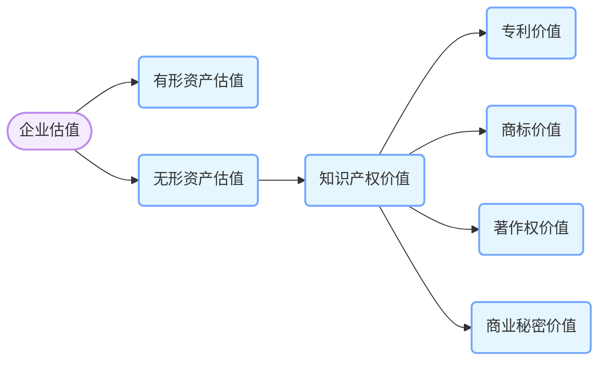

# 企业估值中的知识产权价值法

> 关键词：企业估值、知识产权价值法、知识产权评估、无形资产、估值模型

> 摘要：本文聚焦于企业估值中的知识产权价值法。详细介绍了该方法的背景知识，包括目的、预期读者和文档结构等。深入探讨了知识产权价值法所涉及的核心概念及其联系，通过 Mermaid 流程图清晰展示架构。阐述了核心算法原理并给出 Python 代码示例，对相关数学模型和公式进行详细讲解与举例说明。结合项目实战，给出代码实际案例及详细解释。分析了知识产权价值法在实际中的应用场景，推荐了学习资源、开发工具框架以及相关论文著作。最后总结了该方法的未来发展趋势与挑战，并对常见问题进行解答，为企业在估值过程中合理评估知识产权价值提供全面的技术参考。

## 1. 背景介绍 
### 1.1 目的和范围
在当今知识经济时代，知识产权已成为企业重要的资产组成部分。企业估值中的知识产权价值法旨在准确评估企业所拥有的知识产权对企业整体价值的贡献。其范围涵盖了各种类型的知识产权，如专利、商标、著作权、商业秘密等。通过该方法，投资者、企业管理者、评估机构等能够更全面地了解企业的真实价值，为投资决策、企业并购、融资等活动提供有力支持。

### 1.2 预期读者
本文的预期读者主要包括金融投资领域的专业人士，如投资经理、分析师等，他们需要在投资决策中准确评估企业价值；企业管理者，特别是负责战略规划、财务决策的人员，以便更好地管理企业资产和制定发展战略；资产评估机构的评估师，为其提供专业的评估方法和技术支持；同时也适合对企业估值和知识产权感兴趣的学者和研究人员阅读。

### 1.3 文档结构概述
本文首先介绍企业估值中知识产权价值法的背景信息，包括目的、预期读者和文档结构。接着阐述该方法的核心概念与联系，通过示意图和流程图进行清晰展示。然后详细讲解核心算法原理及具体操作步骤，并用 Python 代码进行实现。对涉及的数学模型和公式进行深入分析并举例说明。通过项目实战给出代码实际案例和详细解释。分析该方法在实际中的应用场景。推荐相关的学习资源、开发工具框架和论文著作。最后总结未来发展趋势与挑战，解答常见问题，并提供扩展阅读和参考资料。

### 1.4 术语表
#### 1.4.1 核心术语定义
- **企业估值**：指对企业的整体经济价值进行评估和估算的过程，综合考虑企业的资产、负债、盈利能力、市场竞争力等多方面因素。
- **知识产权价值法**：一种基于企业所拥有的知识产权来评估企业价值的方法，通过对知识产权的价值进行量化，进而确定其对企业整体价值的贡献。
- **知识产权**：人们对其智力劳动成果所享有的法定权利，包括专利、商标、著作权、商业秘密等。
- **无形资产**：企业拥有或者控制的没有实物形态的可辨认非货币性资产，知识产权是无形资产的重要组成部分。

#### 1.4.2 相关概念解释
- **专利**：是专利权的简称，是国家按专利法授予申请人在一定时间内对其发明创造成果所享有的独占、使用和处分的权利。专利具有独占性、时间性和地域性等特点。
- **商标**：是用以区别商品或服务来源的标志，由文字、图形、字母、数字、三维标志、颜色组合和声音等，以及上述要素的组合构成。商标可以增强消费者对企业产品或服务的辨识度和忠诚度。
- **著作权**：又称版权，是指作者对其创作的文学、艺术和科学作品依法享有的权利。著作权保护的对象包括文学作品、音乐作品、美术作品、影视作品等。
- **商业秘密**：是指不为公众所知悉、具有商业价值并经权利人采取相应保密措施的技术信息、经营信息等商业信息。商业秘密可以为企业带来竞争优势。

#### 1.4.3 缩略词列表
- **NPV**：Net Present Value，净现值，是指投资方案所产生的现金净流量以资金成本为贴现率折现之后与原始投资额现值的差额。
- **DCF**：Discounted Cash Flow，现金流折现法，是一种通过预测资产未来的现金流，并将其折现到当前来评估资产价值的方法。

## 2. 核心概念与联系 
### 核心概念原理
企业估值中的知识产权价值法的核心原理是将企业所拥有的知识产权视为一种有价值的资产，通过对其进行评估和量化，来确定其对企业整体价值的贡献。知识产权的价值主要来源于其能够为企业带来的未来经济利益，如通过专利技术提高生产效率、降低成本，通过商标提升品牌知名度和市场竞争力，从而增加企业的销售收入和利润。

### 架构的文本示意图
```plaintext
企业估值
|
|-- 有形资产估值
|
|-- 无形资产估值
    |
    |-- 知识产权价值
        |
        |-- 专利价值
        |-- 商标价值
        |-- 著作权价值
        |-- 商业秘密价值
```

### Mermaid 流程图


从流程图可以看出，企业估值由有形资产估值和无形资产估值两部分组成，而知识产权价值是无形资产估值的重要组成部分，包括专利价值、商标价值、著作权价值和商业秘密价值。

## 3. 核心算法原理 & 具体操作步骤 
### 核心算法原理
在企业估值中的知识产权价值法中，常用的算法原理是现金流折现法（DCF）。该方法的基本思想是将知识产权在未来一定时期内产生的预期现金流折现到当前时刻，以确定其现值。具体步骤如下：
1. **预测未来现金流**：根据知识产权的特点和市场情况，预测其在未来各期产生的现金流。例如，对于一项专利技术，可以预测其在专利有效期内通过提高生产效率、降低成本或开发新产品所带来的额外收入和成本节约。
2. **确定折现率**：折现率反映了资金的时间价值和投资风险。通常可以采用加权平均资本成本（WACC）作为折现率，考虑企业的债务成本和股权成本。
3. **计算净现值**：将预测的未来现金流按照折现率折现到当前时刻，计算净现值（NPV）。净现值即为知识产权的价值。

### Python 代码实现
```python
import numpy as np

def calculate_npv(cash_flows, discount_rate):
    """
    计算净现值
    :param cash_flows: 未来各期的现金流列表
    :param discount_rate: 折现率
    :return: 净现值
    """
    periods = len(cash_flows)
    npv = 0
    for i in range(periods):
        npv += cash_flows[i] / ((1 + discount_rate) ** i)
    return npv

# 示例数据
cash_flows = [100, 120, 150, 180, 200]  # 未来 5 年的现金流
discount_rate = 0.1  # 折现率为 10%

# 计算净现值
npv = calculate_npv(cash_flows, discount_rate)
print(f"知识产权的净现值为: {npv}")
```
### 代码解释
- `calculate_npv` 函数接受两个参数：`cash_flows` 表示未来各期的现金流列表，`discount_rate` 表示折现率。
- 在函数内部，通过循环遍历现金流列表，将每一期的现金流按照折现率折现到当前时刻，并累加到净现值中。
- 最后返回计算得到的净现值。

### 具体操作步骤
1. **收集数据**：收集与知识产权相关的信息，如专利的技术指标、市场需求、竞争情况，商标的知名度、市场份额，著作权的版权收益等。
2. **预测未来现金流**：根据收集到的数据，采用合理的方法预测知识产权在未来各期产生的现金流。可以参考历史数据、市场趋势、行业分析等。
3. **确定折现率**：根据企业的资本结构和风险水平，确定合适的折现率。可以参考同行业类似企业的加权平均资本成本。
4. **计算知识产权价值**：将预测的未来现金流按照折现率折现到当前时刻，计算净现值，即为知识产权的价值。
5. **调整和验证**：对计算得到的知识产权价值进行调整和验证，考虑市场不确定性、技术更新换代等因素。可以采用敏感性分析等方法，评估不同因素对知识产权价值的影响。

## 4. 数学模型和公式 & 详细讲解 & 举例说明 
### 数学模型和公式
现金流折现法的数学模型可以表示为：
$$NPV = \sum_{t=0}^{n} \frac{CF_t}{(1 + r)^t}$$
其中：
- $NPV$ 表示净现值，即知识产权的价值。
- $CF_t$ 表示第 $t$ 期的现金流。
- $r$ 表示折现率。
- $n$ 表示预测的期数。

### 详细讲解
该公式的含义是将未来各期的现金流 $CF_t$ 按照折现率 $r$ 折现到当前时刻，然后将各期的折现值相加，得到净现值 $NPV$。折现率 $r$ 反映了资金的时间价值和投资风险，折现率越高，未来现金流的现值越低。预测的期数 $n$ 通常根据知识产权的有效期或预期的经济寿命来确定。

### 举例说明
假设某企业拥有一项专利技术，预计该专利在未来 5 年内每年产生的现金流分别为 100 万元、120 万元、150 万元、180 万元和 200 万元，折现率为 10%。则该专利的价值可以通过以下步骤计算：
1. 第 1 年现金流的折现值：
$$PV_1 = \frac{CF_1}{(1 + r)^1} = \frac{100}{(1 + 0.1)^1} \approx 90.91 \text{（万元）}$$
2. 第 2 年现金流的折现值：
$$PV_2 = \frac{CF_2}{(1 + r)^2} = \frac{120}{(1 + 0.1)^2} \approx 99.17 \text{（万元）}$$
3. 第 3 年现金流的折现值：
$$PV_3 = \frac{CF_3}{(1 + r)^3} = \frac{150}{(1 + 0.1)^3} \approx 112.69 \text{（万元）}$$
4. 第 4 年现金流的折现值：
$$PV_4 = \frac{CF_4}{(1 + r)^4} = \frac{180}{(1 + 0.1)^4} \approx 122.94 \text{（万元）}$$
5. 第 5 年现金流的折现值：
$$PV_5 = \frac{CF_5}{(1 + r)^5} = \frac{200}{(1 + 0.1)^5} \approx 124.18 \text{（万元）}$$
6. 计算净现值：
$$NPV = PV_1 + PV_2 + PV_3 + PV_4 + PV_5 \approx 90.91 + 99.17 + 112.69 + 122.94 + 124.18 = 549.89 \text{（万元）}$$

因此，该专利技术的价值约为 549.89 万元。

## 5. 项目实战：代码实际案例和详细解释说明 
### 5.1  开发环境搭建
在进行项目实战之前，需要搭建相应的开发环境。以下是具体步骤：
1. **安装 Python**：从 Python 官方网站（https://www.python.org/downloads/）下载并安装 Python 3.x 版本。
2. **安装必要的库**：在命令行中使用以下命令安装所需的库：
```sh
pip install numpy
```
3. **选择开发工具**：可以选择使用 PyCharm、Jupyter Notebook 等开发工具。这里以 Jupyter Notebook 为例，在命令行中使用以下命令安装：
```sh
pip install jupyter notebook
```
安装完成后，在命令行中输入 `jupyter notebook` 启动 Jupyter Notebook 服务器，然后在浏览器中打开相应的链接。

### 5.2  源代码详细实现和代码解读
```python
import numpy as np

def calculate_npv(cash_flows, discount_rate):
    """
    计算净现值
    :param cash_flows: 未来各期的现金流列表
    :param discount_rate: 折现率
    :return: 净现值
    """
    periods = len(cash_flows)
    npv = 0
    for i in range(periods):
        npv += cash_flows[i] / ((1 + discount_rate) ** i)
    return npv

# 模拟某企业一项专利技术的未来现金流
cash_flows = [80, 100, 120, 140, 160]  # 未来 5 年的现金流
discount_rate = 0.08  # 折现率为 8%

# 计算专利技术的价值
patent_value = calculate_npv(cash_flows, discount_rate)
print(f"该专利技术的价值为: {patent_value} 万元")

# 进行敏感性分析，分析折现率变化对专利技术价值的影响
discount_rates = [0.06, 0.08, 0.1, 0.12]
for rate in discount_rates:
    value = calculate_npv(cash_flows, rate)
    print(f"当折现率为 {rate * 100}% 时，专利技术的价值为: {value} 万元")
```
### 代码解读
1. **导入必要的库**：导入 `numpy` 库，虽然在本代码中没有直接使用 `numpy` 的高级功能，但在实际项目中可能会用到其数组操作和数学计算功能。
2. **定义 `calculate_npv` 函数**：该函数用于计算净现值，接受两个参数：`cash_flows` 表示未来各期的现金流列表，`discount_rate` 表示折现率。在函数内部，通过循环遍历现金流列表，将每一期的现金流按照折现率折现到当前时刻，并累加到净现值中，最后返回计算得到的净现值。
3. **模拟未来现金流和折现率**：定义 `cash_flows` 列表表示某企业一项专利技术在未来 5 年的现金流，定义 `discount_rate` 表示折现率。
4. **计算专利技术的价值**：调用 `calculate_npv` 函数计算专利技术的价值，并将结果打印输出。
5. **进行敏感性分析**：定义 `discount_rates` 列表表示不同的折现率，通过循环遍历不同的折现率，调用 `calculate_npv` 函数计算专利技术在不同折现率下的价值，并将结果打印输出。敏感性分析可以帮助我们了解折现率变化对专利技术价值的影响程度。

### 5.3  代码解读与分析
通过上述代码，我们可以清晰地看到如何使用现金流折现法计算知识产权的价值，并进行敏感性分析。在实际项目中，我们需要根据具体情况准确预测未来现金流和确定合适的折现率。同时，敏感性分析可以帮助我们评估不同因素对知识产权价值的影响，提高估值的准确性和可靠性。

## 6. 实际应用场景 
### 企业并购
在企业并购过程中，准确评估目标企业的知识产权价值至关重要。通过知识产权价值法，可以确定目标企业所拥有的专利、商标、著作权等知识产权的价值，从而合理确定并购价格。例如，一家科技企业收购另一家拥有核心专利技术的企业时，通过评估专利技术的价值，可以判断该收购是否具有战略意义和经济价值。

### 投资决策
投资者在进行投资决策时，需要全面了解企业的价值。知识产权价值法可以帮助投资者评估企业所拥有的知识产权对其未来盈利能力的影响，从而做出更明智的投资决策。例如，投资者在考虑投资一家创新型企业时，会关注该企业的专利技术和商标品牌，通过评估其知识产权价值，判断该企业的投资潜力。

### 企业融资
企业在进行融资时，知识产权可以作为一种重要的资产进行质押或作价入股。通过知识产权价值法，可以确定知识产权的价值，为企业融资提供依据。例如，一家科技型中小企业可以将其拥有的专利技术进行评估，然后向银行申请知识产权质押贷款，解决企业的资金需求。

### 企业战略规划
企业在制定战略规划时，需要了解自身的知识产权资产状况。知识产权价值法可以帮助企业评估知识产权的价值，从而制定合理的知识产权战略。例如，企业可以根据知识产权的价值，决定是否加大研发投入、是否进行知识产权转让或许可等。

## 7. 工具和资源推荐
### 7.1 学习资源推荐
#### 7.1.1 书籍推荐
- 《企业价值评估：有效评估与决策的工具》：本书系统介绍了企业价值评估的各种方法和技术，包括知识产权价值评估，内容丰富，案例详实。
- 《知识产权评估》：专门针对知识产权评估进行深入探讨，涵盖了专利、商标、著作权等各类知识产权的评估方法和实务操作。
- 《估值：难点、解决方案及相关案例》：提供了企业估值过程中的各种难点问题及解决方案，对知识产权价值法有详细的分析和案例讲解。

#### 7.1.2 在线课程
- Coursera 平台上的“企业估值与金融建模”课程：由知名高校教授授课，系统介绍企业估值的理论和方法，包括知识产权价值评估的相关内容。
- edX 平台上的“知识产权管理与评估”课程：重点讲解知识产权的管理和评估方法，适合对知识产权价值法感兴趣的学习者。

#### 7.1.3 技术博客和网站
- 中国资产评估协会官网（https://www.cas.org.cn/）：提供了资产评估领域的最新政策法规、行业动态和技术标准，对企业估值和知识产权评估有重要的参考价值。
- 思博网（https://www.sipo.com.cn/）：专注于知识产权领域，提供专利、商标等知识产权的信息查询和分析服务，同时也有关于知识产权评估的相关文章和案例。

### 7.2 开发工具框架推荐
#### 7.2.1 IDE和编辑器
- PyCharm：一款专业的 Python 集成开发环境，具有代码编辑、调试、版本控制等功能，适合进行 Python 代码的开发和维护。
- Jupyter Notebook：一个交互式的开发环境，支持 Python、R 等多种编程语言，方便进行数据分析和代码演示。

#### 7.2.2 调试和性能分析工具
- PySnooper：一个简单易用的 Python 调试工具，可以自动记录函数的调用过程和变量的值，方便调试代码。
- cProfile：Python 内置的性能分析工具，可以分析代码的运行时间和函数调用次数，帮助优化代码性能。

#### 7.2.3 相关框架和库
- NumPy：一个用于科学计算的 Python 库，提供了高效的数组操作和数学计算功能，在知识产权价值评估的数据分析中经常使用。
- Pandas：一个用于数据处理和分析的 Python 库，提供了数据结构和数据操作工具，方便对现金流数据进行处理和分析。

### 7.3 相关论文著作推荐
#### 7.3.1 经典论文
- 《Valuation of Intellectual Property and Intangible Assets》：该论文系统阐述了知识产权和无形资产的估值方法和理论，是知识产权价值评估领域的经典之作。
- 《The Role of Intellectual Property in Corporate Valuation》：探讨了知识产权在企业估值中的作用和影响，对理解知识产权价值法的重要性有很大帮助。

#### 7.3.2 最新研究成果
- 关注《Journal of Intellectual Property Management》、《Journal of Business Valuation and Economic Loss Analysis》等学术期刊，这些期刊会发表知识产权价值评估领域的最新研究成果。

#### 7.3.3 应用案例分析
- 可以参考一些知名企业的知识产权评估案例，如苹果公司、华为公司等，了解他们在知识产权价值评估方面的实践经验和方法。

## 8. 总结：未来发展趋势与挑战
### 未来发展趋势
- **数字化和智能化**：随着信息技术的发展，知识产权的数字化和智能化程度将不断提高。未来，可能会出现更多基于大数据、人工智能的知识产权价值评估方法和工具，提高评估的准确性和效率。
- **国际化和标准化**：在全球经济一体化的背景下，知识产权价值评估的国际化和标准化趋势将更加明显。国际上可能会制定统一的知识产权价值评估标准和规范，促进知识产权的跨国交易和合作。
- **与企业战略融合**：知识产权价值评估将更加紧密地与企业战略相结合。企业将更加注重知识产权的战略规划和管理，通过评估知识产权价值，制定合理的企业战略，提高企业的核心竞争力。

### 挑战
- **数据获取和质量**：准确评估知识产权价值需要大量的相关数据，但数据的获取和质量可能存在一定的困难。例如，专利技术的市场需求、竞争情况等数据可能难以准确获取，数据的准确性和完整性也会影响评估结果的可靠性。
- **技术更新换代快**：知识产权的价值容易受到技术更新换代的影响。随着科技的快速发展，一些专利技术可能很快就会过时，其价值也会随之降低。因此，在评估知识产权价值时，需要考虑技术更新换代的因素，增加了评估的难度。
- **法律法规和政策变化**：知识产权的法律法规和政策不断变化，这也会对知识产权价值评估产生影响。例如，专利保护期限的调整、商标审查标准的变化等，都可能影响知识产权的价值。评估人员需要及时了解和掌握相关法律法规和政策的变化，确保评估结果的合法性和合理性。

## 9. 附录：常见问题与解答
### 问题 1：知识产权价值评估的结果是否具有确定性？
解答：知识产权价值评估的结果具有一定的不确定性。因为评估过程中涉及到对未来现金流的预测和折现率的确定，这些因素都存在一定的主观性和不确定性。不同的评估人员可能会采用不同的方法和假设，从而得出不同的评估结果。因此，评估结果只能作为参考，不能作为绝对的价值依据。

### 问题 2：如何确定合适的折现率？
解答：确定合适的折现率需要综合考虑多个因素。通常可以采用加权平均资本成本（WACC）作为折现率，考虑企业的债务成本和股权成本。同时，还需要考虑知识产权的风险水平、市场利率、行业平均收益率等因素。在实际操作中，可以参考同行业类似企业的折现率，并结合具体情况进行调整。

### 问题 3：知识产权价值评估是否只适用于大型企业？
解答：不是的。知识产权价值评估适用于各种规模的企业。无论是大型企业还是中小企业，都可能拥有一定的知识产权资产，通过评估知识产权价值，可以更好地了解企业的资产状况，为企业的决策提供支持。对于中小企业来说，准确评估知识产权价值还可以帮助其获得融资、进行技术合作等。

### 问题 4：评估知识产权价值需要哪些专业知识？
解答：评估知识产权价值需要具备多方面的专业知识，包括财务会计知识、经济学知识、知识产权法律知识、行业分析知识等。评估人员需要了解企业的财务状况、市场情况、知识产权的特点和法律保护等方面的信息，才能准确评估知识产权的价值。

## 10. 扩展阅读 & 参考资料
### 扩展阅读
- 《专利丛林经济学》：深入探讨了专利技术领域的经济现象和问题，对理解专利技术的价值和评估有一定的帮助。
- 《商标战略与品牌管理》：介绍了商标战略的制定和品牌管理的方法，有助于了解商标的价值和作用。

### 参考资料
- 中华人民共和国专利法
- 中华人民共和国商标法
- 中华人民共和国著作权法
- 《资产评估准则——无形资产》

作者：AI天才研究院/AI Genius Institute & 禅与计算机程序设计艺术 /Zen And The Art of Computer Programming