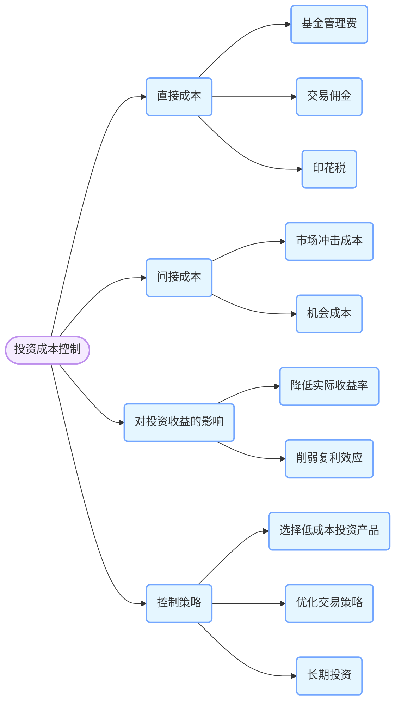

# 伯格的投资成本控制：为什么每个基点都重要

> 关键词：伯格投资、成本控制、基点、投资收益、投资策略

> 摘要：本文围绕伯格的投资成本控制理念，深入探讨为什么投资中的每个基点都至关重要。首先介绍相关背景知识，包括目的范围、预期读者等；接着阐述核心概念与联系，剖析成本控制和基点在投资中的原理及架构；详细讲解核心算法原理与操作步骤，并结合数学模型和公式进行举例说明；通过项目实战案例展示成本控制的实际应用；分析其在不同场景下的实际应用；推荐相关学习资源、开发工具和论文著作；最后总结未来发展趋势与挑战，解答常见问题并提供扩展阅读和参考资料，旨在帮助投资者更好地理解和运用投资成本控制策略。

## 1. 背景介绍 
### 1.1 目的和范围
本文的目的是深入解析伯格所倡导的投资成本控制理念，揭示在投资过程中每一个基点（0.01%）成本差异的重要性。范围涵盖投资成本控制的基本原理、对投资收益的影响、实际应用场景以及未来发展趋势等方面。通过全面的分析，帮助投资者认识到成本控制在投资决策中的关键作用，并提供实用的投资策略和方法。

### 1.2 预期读者
本文预期读者包括各类投资者，无论是个人投资者、专业投资机构从业者，还是对投资领域感兴趣的学生和研究人员。对于希望提高投资收益、优化投资组合的投资者，本文将提供有价值的见解和实用的建议；对于专业人士，可作为进一步深入研究投资成本控制的参考资料；对于初学者，则能帮助他们建立正确的投资成本观念。

### 1.3 文档结构概述
本文将按照以下结构展开：首先介绍相关背景知识，包括目的范围、预期读者等；接着阐述核心概念与联系，剖析成本控制和基点在投资中的原理及架构；详细讲解核心算法原理与操作步骤，并结合数学模型和公式进行举例说明；通过项目实战案例展示成本控制的实际应用；分析其在不同场景下的实际应用；推荐相关学习资源、开发工具和论文著作；最后总结未来发展趋势与挑战，解答常见问题并提供扩展阅读和参考资料。

### 1.4 术语表
#### 1.4.1 核心术语定义
- **伯格投资**：指以约翰·C·伯格（John C. Bogle）所倡导的投资理念和方法为基础的投资策略，强调低成本、长期投资和广泛分散化。
- **投资成本控制**：通过各种手段和方法，降低投资过程中产生的各类成本，以提高投资收益。
- **基点**：金融领域常用的术语，一个基点等于0.01%，用于衡量利率、收益率等微小的变动。
- **投资收益**：投资者在一定时期内从投资中获得的回报，包括资本利得和股息、利息等收入。

#### 1.4.2 相关概念解释
- **费用率**：基金或投资产品每年收取的管理费用占资产净值的比例，是投资成本的重要组成部分。
- **交易成本**：在买卖证券等投资产品过程中产生的成本，如佣金、印花税等。
- **复利效应**：指在投资过程中，本金和利息都能产生利息，随着时间的推移，投资收益会呈现指数级增长的现象。

#### 1.4.3 缩略词列表
- **ETF**：交易型开放式指数基金（Exchange Traded Fund）
- **Mutual Fund**：共同基金
- **IRR**：内部收益率（Internal Rate of Return）

## 2. 核心概念与联系 
### 核心概念原理
伯格的投资成本控制理念基于一个简单而深刻的原理：投资成本的高低直接影响投资收益。在投资过程中，投资者需要支付各种费用，如基金管理费、交易佣金、印花税等。这些成本看似微不足道，但长期积累下来，会对投资收益产生显著的影响。

每一个基点的成本差异，在复利的作用下，都会在未来的投资回报中产生巨大的差距。例如，假设两个投资者A和B都投资了10万元，预期年化收益率为8%，投资期限为30年。投资者A的投资产品费用率为0.5%，投资者B的投资产品费用率为1%。在不考虑其他因素的情况下，30年后投资者A的资产将达到109.35万元，而投资者B的资产仅为93.05万元。两者相差16.3万元，这就是仅仅0.5个基点的费用率差异在长期投资中的巨大影响。

### 架构的文本示意图
```plaintext
投资成本控制
|-- 直接成本
|   |-- 基金管理费
|   |-- 交易佣金
|   |-- 印花税
|-- 间接成本
|   |-- 市场冲击成本
|   |-- 机会成本
|
|-- 对投资收益的影响
|   |-- 降低实际收益率
|   |-- 削弱复利效应
|
|-- 控制策略
|   |-- 选择低成本投资产品
|   |-- 优化交易策略
|   |-- 长期投资
```

### Mermaid流程图


## 3. 核心算法原理 & 具体操作步骤 
### 核心算法原理
为了更好地理解投资成本对投资收益的影响，我们可以使用复利计算公式来进行分析。复利计算公式为：

$$A = P(1 + r - f)^n$$

其中：
- $A$ 为投资期末的资产总值
- $P$ 为初始投资本金
- $r$ 为年化收益率
- $f$ 为费用率
- $n$ 为投资年限

从这个公式可以看出，费用率 $f$ 的大小直接影响到最终的资产总值 $A$。费用率越高，最终的资产总值就越低。

### 具体操作步骤
#### 步骤1：确定初始投资本金 $P$
投资者首先需要确定自己的初始投资金额，这是计算投资收益的基础。

#### 步骤2：估计年化收益率 $r$
根据市场情况、投资产品的历史表现等因素，估计投资的年化收益率。需要注意的是，年化收益率是一个预期值，实际收益率可能会有所波动。

#### 步骤3：确定费用率 $f$
了解投资产品的费用结构，包括管理费、托管费、销售服务费等，计算出总的费用率。

#### 步骤4：确定投资年限 $n$
根据自己的投资目标和计划，确定投资的年限。

#### 步骤5：计算投资期末的资产总值 $A$
将上述参数代入复利计算公式，计算出投资期末的资产总值。

### Python源代码实现
```python
def calculate_investment_return(principal, annual_return_rate, fee_rate, years):
    """
    计算投资期末的资产总值
    :param principal: 初始投资本金
    :param annual_return_rate: 年化收益率
    :param fee_rate: 费用率
    :param years: 投资年限
    :return: 投资期末的资产总值
    """
    return principal * ((1 + annual_return_rate - fee_rate) ** years)

# 示例参数
principal = 100000  # 初始投资本金为10万元
annual_return_rate = 0.08  # 年化收益率为8%
fee_rate_1 = 0.005  # 费用率为0.5%
fee_rate_2 = 0.01  # 费用率为1%
years = 30  # 投资年限为30年

# 计算不同费用率下的投资回报
return_1 = calculate_investment_return(principal, annual_return_rate, fee_rate_1, years)
return_2 = calculate_investment_return(principal, annual_return_rate, fee_rate_2, years)

print(f"费用率为{fee_rate_1 * 100}%时，30年后的资产总值为：{return_1:.2f}元")
print(f"费用率为{fee_rate_2 * 100}%时，30年后的资产总值为：{return_2:.2f}元")
print(f"两者相差：{return_1 - return_2:.2f}元")
```

## 4. 数学模型和公式 & 详细讲解 & 举例说明 
### 数学模型和公式
除了前面提到的复利计算公式，我们还可以使用内部收益率（IRR）来评估投资成本对投资收益的影响。内部收益率是指使投资项目的净现值等于零的折现率，它反映了投资项目的实际盈利能力。

假设投资者在第 $t$ 期的现金流入为 $C_t$，现金流出为 $O_t$，则内部收益率 $IRR$ 满足以下方程：

$$\sum_{t = 0}^{n} \frac{C_t - O_t}{(1 + IRR)^t} = 0$$

其中，$n$ 为投资期限。

在考虑投资成本的情况下，现金流出 $O_t$ 包括初始投资本金和各期的费用支出。

### 详细讲解
复利计算公式和内部收益率模型都可以帮助我们定量地分析投资成本对投资收益的影响。复利计算公式侧重于长期投资中本金和收益的增长情况，而内部收益率模型则更关注投资项目的实际盈利能力。

通过这两个模型，我们可以比较不同投资产品或投资策略在考虑成本因素后的实际收益情况，从而做出更明智的投资决策。

### 举例说明
假设投资者A和投资者B分别投资了两只基金。投资者A投资的基金初始本金为10万元，年化收益率为8%，费用率为0.5%，投资期限为5年。投资者B投资的基金初始本金同样为10万元，年化收益率为8%，但费用率为1%，投资期限也为5年。

#### 使用复利计算公式计算
投资者A的投资期末资产总值为：

$$A_A = 100000 \times (1 + 0.08 - 0.005)^5 \approx 143562.94$$

投资者B的投资期末资产总值为：

$$A_B = 100000 \times (1 + 0.08 - 0.01)^5 \approx 140255.17$$

两者相差：$143562.94 - 140255.17 = 3307.77$ 元

#### 使用内部收益率模型计算
假设两只基金每年的现金流入仅为投资收益，现金流出为费用支出。我们可以使用Python的`numpy`库来计算内部收益率。

```python
import numpy as np

# 投资者A的现金流
cash_flows_A = [-100000] + [100000 * (0.08 - 0.005)] * 4 + [100000 * (1 + 0.08 - 0.005)]
irr_A = np.irr(cash_flows_A)

# 投资者B的现金流
cash_flows_B = [-100000] + [100000 * (0.08 - 0.01)] * 4 + [100000 * (1 + 0.08 - 0.01)]
irr_B = np.irr(cash_flows_B)

print(f"投资者A的内部收益率为：{irr_A * 100:.2f}%")
print(f"投资者B的内部收益率为：{irr_B * 100:.2f}%")
```

通过计算可以发现，投资者A的内部收益率高于投资者B，这说明在考虑成本因素后，投资者A的投资项目实际盈利能力更强。

## 5. 项目实战：代码实际案例和详细解释说明 
### 5.1  开发环境搭建
#### 安装Python
首先需要安装Python环境，建议使用Python 3.7及以上版本。可以从Python官方网站（https://www.python.org/downloads/）下载安装包，按照安装向导进行安装。

#### 安装必要的库
在本项目中，我们需要使用`numpy`库来进行数值计算。可以使用以下命令来安装`numpy`：

```sh
pip install numpy
```

### 5.2  源代码详细实现和代码解读
```python
import numpy as np

def calculate_investment_return(principal, annual_return_rate, fee_rate, years):
    """
    计算投资期末的资产总值
    :param principal: 初始投资本金
    :param annual_return_rate: 年化收益率
    :param fee_rate: 费用率
    :param years: 投资年限
    :return: 投资期末的资产总值
    """
    return principal * ((1 + annual_return_rate - fee_rate) ** years)

def calculate_irr(cash_flows):
    """
    计算内部收益率
    :param cash_flows: 现金流列表
    :return: 内部收益率
    """
    return np.irr(cash_flows)

# 示例参数
principal = 100000  # 初始投资本金为10万元
annual_return_rate = 0.08  # 年化收益率为8%
fee_rate_1 = 0.005  # 费用率为0.5%
fee_rate_2 = 0.01  # 费用率为1%
years = 5  # 投资年限为5年

# 计算不同费用率下的投资回报
return_1 = calculate_investment_return(principal, annual_return_rate, fee_rate_1, years)
return_2 = calculate_investment_return(principal, annual_return_rate, fee_rate_2, years)

print(f"费用率为{fee_rate_1 * 100}%时，{years}年后的资产总值为：{return_1:.2f}元")
print(f"费用率为{fee_rate_2 * 100}%时，{years}年后的资产总值为：{return_2:.2f}元")
print(f"两者相差：{return_1 - return_2:.2f}元")

# 计算不同费用率下的现金流
cash_flows_1 = [-principal] + [principal * (annual_return_rate - fee_rate_1)] * (years - 1) + [principal * (1 + annual_return_rate - fee_rate_1)]
cash_flows_2 = [-principal] + [principal * (annual_return_rate - fee_rate_2)] * (years - 1) + [principal * (1 + annual_return_rate - fee_rate_2)]

# 计算内部收益率
irr_1 = calculate_irr(cash_flows_1)
irr_2 = calculate_irr(cash_flows_2)

print(f"费用率为{fee_rate_1 * 100}%时，内部收益率为：{irr_1 * 100:.2f}%")
print(f"费用率为{fee_rate_2 * 100}%时，内部收益率为：{irr_2 * 100:.2f}%")
```

### 代码解读与分析
#### 函数`calculate_investment_return`
该函数接受初始投资本金、年化收益率、费用率和投资年限作为参数，使用复利计算公式计算投资期末的资产总值。

#### 函数`calculate_irr`
该函数接受现金流列表作为参数，使用`numpy`库的`irr`函数计算内部收益率。

#### 主程序
首先定义了示例参数，包括初始投资本金、年化收益率、不同的费用率和投资年限。然后调用`calculate_investment_return`函数计算不同费用率下的投资回报，并输出结果。接着计算不同费用率下的现金流，调用`calculate_irr`函数计算内部收益率，并输出结果。

通过这个代码示例，我们可以直观地看到不同费用率对投资回报和内部收益率的影响，从而深刻理解投资成本控制的重要性。

## 6. 实际应用场景 
### 个人投资者
对于个人投资者来说，投资成本控制尤为重要。个人投资者通常资金规模较小，每一个基点的成本差异都可能对最终的投资收益产生较大的影响。

- **选择低成本基金**：个人投资者可以选择费用率较低的指数基金或ETF。这些基金通常采用被动投资策略，管理成本较低，能够更好地跟踪市场指数。例如，某只沪深300指数基金的费用率为0.5%，而另一只主动管理型基金的费用率为1.5%。在相同的市场环境下，长期投资指数基金可能会获得更高的收益。
- **减少交易次数**：频繁的交易不仅会增加交易成本，还可能导致投资者做出错误的决策。个人投资者应该制定合理的投资计划，避免盲目跟风交易。例如，投资者可以采用定期定额投资的方式，每月固定投资一定金额的基金，这样可以降低市场波动的影响，同时减少交易成本。

### 机构投资者
机构投资者管理着大量的资金，投资成本控制同样是他们关注的重点。

- **优化投资组合**：机构投资者可以通过优化投资组合，降低投资成本。例如，他们可以采用多元化投资策略，分散投资于不同的资产类别和行业，同时选择低成本的投资产品。此外，机构投资者还可以利用量化投资模型，对投资组合进行动态调整，以提高投资收益。
- **与基金公司谈判**：机构投资者由于资金规模较大，具有较强的谈判能力。他们可以与基金公司谈判，争取更低的费用率。例如，某大型保险公司可以与基金公司协商，将旗下基金的管理费用率从1%降低到0.8%，从而为公司节省大量的投资成本。

### 养老金和社保基金
养老金和社保基金是为了保障人们的养老和社会保障需求而设立的，投资成本控制直接关系到这些基金的长期可持续性。

- **长期投资策略**：养老金和社保基金通常具有较长的投资期限，因此可以采用长期投资策略。长期投资可以降低市场波动的影响，同时充分发挥复利效应。例如，养老金基金可以将大部分资金投资于股票市场，通过长期持有优质股票，获得较高的投资收益。
- **严格控制成本**：养老金和社保基金的投资收益直接关系到广大民众的切身利益，因此需要严格控制投资成本。这些基金可以选择费用率较低的投资产品，同时加强对投资管理人的监督和考核，确保投资成本在合理范围内。

## 7. 工具和资源推荐
### 7.1 学习资源推荐
#### 7.1.1 书籍推荐
- 《漫步华尔街》（A Random Walk Down Wall Street）：作者是伯顿·马尔基尔（Burton Malkiel），这本书深入浅出地介绍了投资的基本原理和策略，强调了低成本指数基金投资的优势。
- 《聪明的投资者》（The Intelligent Investor）：作者是本杰明·格雷厄姆（Benjamin Graham），被誉为投资界的圣经。书中阐述了价值投资的理念和方法，对投资者树立正确的投资观念具有重要的指导意义。
- 《约翰·博格的投资50年》（John Bogle on Investing: The First 50 Years）：这本书详细介绍了约翰·C·伯格的投资理念和实践经验，是学习伯格投资思想的重要参考资料。

#### 7.1.2 在线课程
- Coursera上的“投资学原理”（Principles of Investment）课程：该课程由知名高校的教授授课，系统地介绍了投资学的基本理论和方法，包括资产定价、投资组合管理等内容。
- edX上的“金融市场”（Financial Markets）课程：由耶鲁大学教授罗伯特·席勒（Robert Shiller）主讲，课程涵盖了金融市场的各个方面，包括股票市场、债券市场、衍生品市场等，对投资者了解金融市场的运行机制具有重要的帮助。

#### 7.1.3 技术博客和网站
- 晨星网（Morningstar）：提供基金评级、分析报告等信息，帮助投资者评估基金的投资价值和风险。
- 雪球网：一个投资交流社区，投资者可以在上面分享投资经验、讨论投资策略，同时还可以获取各种投资资讯。
- 集思录：专注于低风险投资领域，提供可转债、分级基金等投资产品的实时数据和分析工具。

### 7.2 开发工具框架推荐
#### 7.2.1 IDE和编辑器
- PyCharm：一款专业的Python集成开发环境，具有代码编辑、调试、版本控制等功能，适合开发Python投资分析程序。
- Jupyter Notebook：一个交互式的开发环境，支持多种编程语言，尤其适合进行数据分析和可视化。投资者可以使用Jupyter Notebook进行投资数据的处理和分析。

#### 7.2.2 调试和性能分析工具
- PDB：Python自带的调试工具，可以帮助开发者定位和解决代码中的问题。
- cProfile：Python的性能分析工具，可以分析代码的运行时间和资源占用情况，帮助开发者优化代码性能。

#### 7.2.3 相关框架和库
- Pandas：一个强大的数据处理和分析库，提供了丰富的数据结构和函数，方便投资者处理和分析投资数据。
- NumPy：用于科学计算的基础库，提供了高效的数组操作和数学函数，在投资分析中经常用于数值计算。
- Matplotlib：一个绘图库，可以用于绘制各种类型的图表，如折线图、柱状图、散点图等，帮助投资者直观地展示投资数据。

### 7.3 相关论文著作推荐
#### 7.3.1 经典论文
- “The Capital Asset Pricing Model: Theory and Evidence” by Eugene F. Fama and Kenneth R. French：这篇论文对资本资产定价模型进行了深入的研究和实证分析，是投资领域的经典文献之一。
- “Efficient Capital Markets: A Review of Theory and Empirical Work” by Eugene F. Fama：该论文系统地阐述了有效市场假说，对投资理论和实践产生了深远的影响。

#### 7.3.2 最新研究成果
- 关注顶级金融学术期刊，如《Journal of Finance》、《Journal of Financial Economics》等，这些期刊发表了投资领域的最新研究成果。
- 参加金融学术会议，如美国金融协会年会（AFA Annual Meeting）等，与国内外的学者和专家交流最新的研究进展。

#### 7.3.3 应用案例分析
- 一些知名投资机构的研究报告和案例分析，如桥水基金（Bridgewater Associates）的研究报告，会分享他们在投资策略和风险管理方面的实践经验。
- 专业投资媒体的案例分析文章，如《财经》、《证券市场周刊》等，会对一些成功或失败的投资案例进行深入分析，为投资者提供借鉴。

## 8. 总结：未来发展趋势与挑战
### 未来发展趋势
#### 智能化投资成本控制
随着人工智能和大数据技术的发展，智能化投资成本控制将成为未来的发展趋势。通过人工智能算法，可以对投资成本进行实时监测和分析，自动调整投资策略，以降低成本、提高收益。例如，智能投顾平台可以根据投资者的风险偏好和投资目标，为其推荐低成本的投资组合，并实时监控市场变化，及时调整投资组合。

#### 绿色投资与成本控制的结合
随着社会对环境保护和可持续发展的关注度不断提高，绿色投资将成为未来投资的重要方向。在绿色投资中，投资者不仅要考虑投资收益，还要考虑环境和社会影响。同时，绿色投资也需要控制成本，以提高投资的可持续性。未来，将绿色投资与成本控制相结合的投资策略将得到更广泛的应用。

#### 全球投资成本控制的协调与合作
随着全球金融市场的一体化程度不断提高，投资者越来越倾向于进行全球投资。然而，不同国家和地区的投资成本结构和监管政策存在差异，这给全球投资成本控制带来了挑战。未来，需要加强全球投资成本控制的协调与合作，建立统一的投资成本标准和监管机制，以提高全球投资的效率和公平性。

### 挑战
#### 市场不确定性增加
全球经济和政治形势的不确定性增加，如贸易摩擦、地缘政治冲突等，会导致市场波动加剧，增加投资成本控制的难度。投资者需要更加灵活地调整投资策略，以应对市场变化。

#### 技术创新带来的挑战
虽然技术创新为投资成本控制带来了机遇，但也带来了挑战。例如，新的金融科技产品和服务可能存在安全隐患和监管漏洞，投资者需要谨慎选择和使用。此外，技术创新也会导致投资市场的竞争加剧，投资者需要不断提升自己的技术能力和投资水平。

#### 投资者教育不足
目前，我国投资者教育水平相对较低，很多投资者对投资成本控制的重要性认识不足。这导致一些投资者在投资过程中忽视成本因素，选择了高成本的投资产品和策略，从而降低了投资收益。因此，加强投资者教育，提高投资者的成本意识和投资能力，是未来投资市场发展的重要任务。

## 9. 附录：常见问题与解答
### 问题1：投资成本控制是不是只需要关注费用率？
答：不是。投资成本控制不仅仅是关注费用率，还包括交易成本、市场冲击成本、机会成本等。费用率是投资成本的重要组成部分，但其他成本也会对投资收益产生影响。例如，频繁的交易可能会导致较高的交易成本，而市场冲击成本则是指在大额交易时对市场价格产生的影响。因此，投资者在进行投资成本控制时，需要综合考虑各种成本因素。

### 问题2：低成本投资产品一定能获得高收益吗？
答：不一定。低成本投资产品可以降低投资成本，但并不能保证一定能获得高收益。投资收益还受到市场行情、投资策略、资产配置等多种因素的影响。例如，在市场行情不佳的情况下，即使是低成本的投资产品也可能会出现亏损。因此，投资者在选择投资产品时，不仅要关注成本，还要综合考虑产品的投资标的、风险水平、历史表现等因素。

### 问题3：如何衡量投资成本控制的效果？
答：可以通过以下几个指标来衡量投资成本控制的效果：
- **实际收益率**：实际收益率是指扣除投资成本后的收益率，反映了投资者实际获得的投资回报。实际收益率越高，说明投资成本控制的效果越好。
- **内部收益率（IRR）**：内部收益率是指使投资项目的净现值等于零的折现率，反映了投资项目的实际盈利能力。在考虑投资成本的情况下，内部收益率越高，说明投资成本控制的效果越好。
- **成本收益比**：成本收益比是指投资成本与投资收益的比值，反映了单位投资成本所获得的投资收益。成本收益比越低，说明投资成本控制的效果越好。

### 问题4：投资成本控制对短期投资和长期投资的影响有什么不同？
答：投资成本控制对短期投资和长期投资的影响有所不同。在短期投资中，投资成本的影响相对较小，因为短期投资的时间较短，成本的积累效应不明显。而在长期投资中，投资成本的影响则非常显著。由于复利效应的存在，每一个基点的成本差异在长期投资中都会产生巨大的差距。因此，对于长期投资者来说，投资成本控制尤为重要。

## 10. 扩展阅读 & 参考资料
### 扩展阅读
- 《金融炼金术》（The Alchemy of Finance）：作者是乔治·索罗斯（George Soros），书中介绍了索罗斯的投资哲学和交易策略，对投资者拓宽投资视野具有重要的帮助。
- 《黑天鹅》（The Black Swan）：作者是纳西姆·尼古拉斯·塔勒布（Nassim Nicholas Taleb），探讨了不可预测的重大事件对金融市场和投资的影响，提醒投资者要做好风险管理。

### 参考资料
- Bogle, John C. "Common Sense on Mutual Funds: New Imperatives for the Intelligent Investor." Wiley, 2009.
- Fama, Eugene F., and Kenneth R. French. "The Capital Asset Pricing Model: Theory and Evidence." Journal of Economic Perspectives 18, no. 3 (2004): 25-46.
- Shiller, Robert J. "Irrational Exuberance." Princeton University Press, 2000.

作者：AI天才研究院/AI Genius Institute & 禅与计算机程序设计艺术 /Zen And The Art of Computer Programming