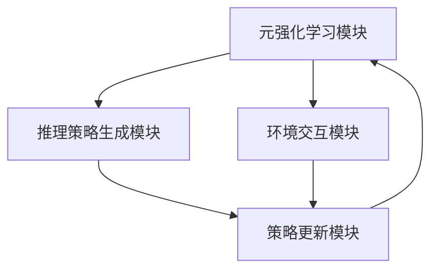

# 元强化学习在推理策略动态调整中的作用

> 关键词：元强化学习、推理策略、动态调整、智能决策、策略优化

> 摘要：本文深入探讨了元强化学习在推理策略动态调整中的作用。首先介绍了研究的背景、目的、预期读者和文档结构，明确相关术语和概念。接着阐述了元强化学习和推理策略的核心概念及它们之间的联系，给出了原理和架构的文本示意图与 Mermaid 流程图。详细讲解了核心算法原理，并用 Python 代码进行了说明，同时给出了相关数学模型和公式，并举例分析。通过项目实战，展示了代码的实际应用和详细解读。探讨了元强化学习在推理策略动态调整中的实际应用场景，推荐了相关的学习资源、开发工具框架和论文著作。最后总结了未来发展趋势与挑战，提供了常见问题解答和扩展阅读参考资料，旨在为读者全面呈现元强化学习在推理策略动态调整领域的重要性和应用价值。

## 1. 背景介绍 
### 1.1 目的和范围
在当今复杂多变的环境中，智能系统需要具备灵活的推理能力和动态调整策略的能力。传统的强化学习方法在面对新的任务或环境变化时，往往需要大量的重新训练，效率较低。元强化学习作为一种新兴的技术，旨在让智能体能够快速适应新的任务和环境，通过学习如何学习，在推理过程中动态调整策略。本文的目的是深入研究元强化学习在推理策略动态调整中的作用，探讨其原理、算法、应用场景等方面的内容。范围涵盖了元强化学习和推理策略的基本概念、核心算法、数学模型、项目实战以及实际应用等多个方面。

### 1.2 预期读者
本文预期读者包括人工智能领域的研究人员、开发者、学生，以及对元强化学习和智能决策感兴趣的技术爱好者。对于有一定机器学习和强化学习基础的读者，本文将提供更深入的技术细节和应用案例；对于初学者，也会在基础概念部分进行详细讲解，帮助他们逐步理解相关内容。

### 1.3 文档结构概述
本文首先介绍背景信息，让读者了解研究的目的和范围。接着阐述核心概念与联系，明确元强化学习和推理策略的定义和相互关系。然后详细讲解核心算法原理和具体操作步骤，给出数学模型和公式，并进行举例说明。通过项目实战，展示代码的实现和解读。之后探讨实际应用场景，推荐相关的工具和资源。最后总结未来发展趋势与挑战，提供常见问题解答和扩展阅读参考资料。

### 1.4 术语表
#### 1.4.1 核心术语定义
- **元强化学习（Meta-Reinforcement Learning）**：是一种强化学习的扩展，它不仅学习如何在特定环境中采取行动以最大化奖励，还学习如何快速适应新的任务和环境。元强化学习通过在多个任务上进行训练，让智能体学会学习的策略，从而能够在面对新任务时更快地收敛到最优策略。
- **推理策略（Inference Strategy）**：指在智能系统中，根据已有的信息和模型，对未知情况进行推断和决策的策略。推理策略决定了如何利用知识和数据来得出结论，是智能决策的重要组成部分。
- **动态调整（Dynamic Adjustment）**：在系统运行过程中，根据环境的变化、任务的需求或其他因素，实时地对策略进行修改和优化的过程。动态调整能够使系统更好地适应不同的情况，提高性能和效率。

#### 1.4.2 相关概念解释
- **强化学习（Reinforcement Learning）**：是一种机器学习方法，智能体通过与环境进行交互，根据环境反馈的奖励信号来学习最优的行动策略。强化学习的目标是最大化长期累积奖励。
- **元学习（Meta-Learning）**：也称为学习如何学习，旨在让模型能够快速适应新的任务和环境。元学习通过在多个任务上进行训练，学习到通用的学习策略和知识，从而在新任务上能够更快地学习和泛化。
- **策略梯度（Policy Gradient）**：是强化学习中的一种算法，通过直接优化策略函数的参数，使得策略能够最大化预期奖励。策略梯度方法避免了值函数的估计，直接对策略进行优化，具有更好的收敛性和可解释性。

#### 1.4.3 缩略词列表
- **MDP**：马尔可夫决策过程（Markov Decision Process），是一种用于描述强化学习问题的数学模型。
- **RL**：强化学习（Reinforcement Learning）
- **Meta-RL**：元强化学习（Meta-Reinforcement Learning）
- **PG**：策略梯度（Policy Gradient）

## 2. 核心概念与联系 

### 核心概念原理
#### 元强化学习原理
元强化学习的核心思想是让智能体在多个任务上进行训练，学习到如何快速适应新的任务。传统的强化学习通常是在单个任务上进行训练，智能体需要大量的时间和样本才能收敛到最优策略。而元强化学习通过在多个任务上学习，能够提取出通用的学习策略和知识，当面对新任务时，智能体可以利用这些先验知识快速调整策略。

元强化学习可以基于不同的方法实现，例如基于模型的元强化学习和基于策略的元强化学习。基于模型的元强化学习通过学习环境的模型，预测未来的状态和奖励，从而快速适应新任务。基于策略的元强化学习则直接优化策略函数，使得策略能够在不同任务上快速收敛。

#### 推理策略原理
推理策略是智能系统中根据已有信息进行决策的过程。在推理过程中，智能体需要根据输入的信息和已有的模型，选择合适的行动或输出结果。推理策略的好坏直接影响到智能系统的性能和决策质量。

推理策略可以基于不同的方法实现，例如基于规则的推理、基于机器学习的推理等。基于规则的推理通过预先定义的规则来进行决策，适用于规则明确的场景。基于机器学习的推理则通过训练模型来学习输入和输出之间的映射关系，适用于复杂的场景。

### 架构的文本示意图
```plaintext
                          元强化学习模块
                              |
                              | 学习多个任务的通用策略
                              |
            +------------------+------------------+
            |                                   |
  推理策略生成模块                         环境交互模块
            |                                   |
            | 根据元策略生成推理策略           | 与环境交互获取奖励
            |                                   |
            +------------------+------------------+
                              |
                              | 更新元策略和推理策略
                              |
                          策略更新模块
```

### Mermaid 流程图


在这个流程图中，元强化学习模块负责学习多个任务的通用策略。推理策略生成模块根据元策略生成具体的推理策略。环境交互模块与环境进行交互，获取奖励信号。策略更新模块根据奖励信号更新元策略和推理策略，形成一个闭环的学习过程。

## 3. 核心算法原理 & 具体操作步骤 

### 核心算法原理
这里我们以基于策略梯度的元强化学习算法为例进行讲解。策略梯度算法的目标是直接优化策略函数 $\pi_{\theta}(a|s)$，其中 $\theta$ 是策略函数的参数，$a$ 是行动，$s$ 是状态。策略梯度算法通过计算策略的梯度，更新策略函数的参数，使得策略能够最大化预期奖励。

在元强化学习中，我们需要在多个任务上进行训练。每个任务可以看作是一个马尔可夫决策过程（MDP）。我们的目标是学习一个元策略 $\pi_{\phi}$，使得在新的任务上能够快速适应。元策略的参数 $\phi$ 在多个任务上进行更新。

### 具体操作步骤
#### 步骤 1：初始化参数
初始化元策略的参数 $\phi$ 和每个任务的策略参数 $\theta$。

#### 步骤 2：采样任务
从任务分布中采样一个任务 $T$。

#### 步骤 3：在任务上进行交互
在任务 $T$ 上，使用当前的策略 $\pi_{\theta}$ 与环境进行交互，收集状态、行动和奖励序列 $\{(s_t, a_t, r_t)\}_{t=1}^T$。

#### 步骤 4：计算策略梯度
根据收集到的序列，计算策略 $\pi_{\theta}$ 的梯度 $\nabla_{\theta} J(\theta)$，其中 $J(\theta)$ 是策略的目标函数，通常是预期累积奖励。

#### 步骤 5：更新任务策略
使用梯度下降法更新任务策略的参数 $\theta$：
$$\theta \leftarrow \theta - \alpha \nabla_{\theta} J(\theta)$$
其中 $\alpha$ 是学习率。

#### 步骤 6：更新元策略
在多个任务上重复步骤 2 - 5，收集多个任务的梯度信息。然后使用元梯度更新元策略的参数 $\phi$：
$$\phi \leftarrow \phi - \beta \nabla_{\phi} \sum_{T \in \mathcal{T}} J_T(\theta_T(\phi))$$
其中 $\beta$ 是元学习率，$\mathcal{T}$ 是任务集合，$\theta_T(\phi)$ 是在任务 $T$ 上根据元策略 $\phi$ 得到的策略参数。

### Python 代码实现
```python
import torch
import torch.nn as nn
import torch.optim as optim
import numpy as np

# 定义策略网络
class PolicyNetwork(nn.Module):
    def __init__(self, input_dim, output_dim):
        super(PolicyNetwork, self).__init__()
        self.fc1 = nn.Linear(input_dim, 64)
        self.fc2 = nn.Linear(64, output_dim)
        self.softmax = nn.Softmax(dim=-1)

    def forward(self, x):
        x = torch.relu(self.fc1(x))
        x = self.fc2(x)
        x = self.softmax(x)
        return x

# 定义元强化学习类
class MetaReinforcementLearning:
    def __init__(self, input_dim, output_dim, meta_lr=0.001, lr=0.01):
        self.meta_policy = PolicyNetwork(input_dim, output_dim)
        self.meta_optimizer = optim.Adam(self.meta_policy.parameters(), lr=meta_lr)
        self.lr = lr

    def sample_task(self, task_distribution):
        # 从任务分布中采样一个任务
        task = np.random.choice(task_distribution)
        return task

    def interact_with_task(self, task, policy):
        # 在任务上进行交互，收集状态、行动和奖励序列
        states = []
        actions = []
        rewards = []
        state = task.reset()
        done = False
        while not done:
            states.append(state)
            state_tensor = torch.FloatTensor(state).unsqueeze(0)
            action_probs = policy(state_tensor)
            action = torch.multinomial(action_probs, 1).item()
            actions.append(action)
            next_state, reward, done, _ = task.step(action)
            rewards.append(reward)
            state = next_state
        return states, actions, rewards

    def compute_policy_gradient(self, states, actions, rewards):
        # 计算策略梯度
        states_tensor = torch.FloatTensor(states)
        actions_tensor = torch.LongTensor(actions)
        rewards_tensor = torch.FloatTensor(rewards)
        action_probs = self.meta_policy(states_tensor)
        log_probs = torch.log(action_probs.gather(1, actions_tensor.unsqueeze(1)).squeeze(1))
        returns = torch.flip(torch.cumsum(torch.flip(rewards_tensor, [0]), dim=0), [0])
        loss = -torch.mean(log_probs * returns)
        return loss

    def update_task_policy(self, task_loss):
        # 更新任务策略
        optimizer = optim.Adam(self.meta_policy.parameters(), lr=self.lr)
        optimizer.zero_grad()
        task_loss.backward()
        optimizer.step()

    def update_meta_policy(self, meta_loss):
        # 更新元策略
        self.meta_optimizer.zero_grad()
        meta_loss.backward()
        self.meta_optimizer.step()

    def train(self, task_distribution, num_iterations):
        for iteration in range(num_iterations):
            meta_losses = []
            for _ in range(len(task_distribution)):
                task = self.sample_task(task_distribution)
                states, actions, rewards = self.interact_with_task(task, self.meta_policy)
                task_loss = self.compute_policy_gradient(states, actions, rewards)
                self.update_task_policy(task_loss)
                meta_losses.append(task_loss)
            meta_loss = torch.mean(torch.stack(meta_losses))
            self.update_meta_policy(meta_loss)
            if iteration % 10 == 0:
                print(f'Iteration {iteration}, Meta Loss: {meta_loss.item()}')

# 示例使用
if __name__ == "__main__":
    input_dim = 4
    output_dim = 2
    mrl = MetaReinforcementLearning(input_dim, output_dim)
    # 假设任务分布是一个列表，每个任务是一个环境对象
    task_distribution = [env1, env2, env3]  # 这里需要替换为实际的环境对象
    num_iterations = 100
    mrl.train(task_distribution, num_iterations)
```

## 4. 数学模型和公式 & 详细讲解 & 举例说明 

### 马尔可夫决策过程（MDP）
马尔可夫决策过程是一种用于描述强化学习问题的数学模型，它由一个四元组 $(S, A, P, R)$ 组成，其中：
- $S$ 是状态空间，表示环境的所有可能状态。
- $A$ 是行动空间，表示智能体可以采取的所有可能行动。
- $P(s'|s, a)$ 是状态转移概率，表示在状态 $s$ 采取行动 $a$ 后转移到状态 $s'$ 的概率。
- $R(s, a)$ 是奖励函数，表示在状态 $s$ 采取行动 $a$ 后获得的奖励。

在 MDP 中，智能体的目标是找到一个最优策略 $\pi^*(a|s)$，使得长期累积奖励最大化。长期累积奖励通常使用折扣累积奖励来表示：
$$G_t = \sum_{k=0}^{\infty} \gamma^k r_{t+k+1}$$
其中 $r_{t+k+1}$ 是在时间步 $t + k + 1$ 获得的奖励，$\gamma \in [0, 1]$ 是折扣因子，用于权衡近期奖励和远期奖励。

### 策略梯度定理
策略梯度定理给出了策略梯度的计算公式。策略的目标函数 $J(\theta)$ 可以表示为：
$$J(\theta) = \mathbb{E}_{\tau \sim \pi_{\theta}} \left[ \sum_{t=0}^{\infty} \gamma^t r_t \right]$$
其中 $\tau = (s_0, a_0, r_0, s_1, a_1, r_1, \cdots)$ 是一个轨迹，$\pi_{\theta}$ 是策略函数。

策略梯度定理表明，策略的梯度可以表示为：
$$\nabla_{\theta} J(\theta) = \mathbb{E}_{\tau \sim \pi_{\theta}} \left[ \sum_{t=0}^{\infty} \nabla_{\theta} \log \pi_{\theta}(a_t|s_t) G_t \right]$$

### 元强化学习的目标函数
在元强化学习中，我们的目标是学习一个元策略 $\pi_{\phi}$，使得在新的任务上能够快速适应。元策略的目标函数可以表示为：
$$\mathcal{L}(\phi) = \sum_{T \in \mathcal{T}} J_T(\theta_T(\phi))$$
其中 $\mathcal{T}$ 是任务集合，$\theta_T(\phi)$ 是在任务 $T$ 上根据元策略 $\phi$ 得到的策略参数，$J_T(\theta_T(\phi))$ 是在任务 $T$ 上使用策略 $\theta_T(\phi)$ 的目标函数。

### 举例说明
假设我们有一个简单的机器人导航任务，机器人需要在一个二维网格世界中从起点移动到终点。状态空间 $S$ 是网格世界中所有可能的位置，行动空间 $A$ 是机器人可以采取的四个方向的移动（上、下、左、右）。奖励函数 $R$ 可以定义为：如果机器人到达终点，获得奖励 100；如果撞到障碍物，获得奖励 -10；其他情况获得奖励 -1。

在这个任务中，我们可以使用元强化学习来让机器人快速适应不同的网格世界布局。通过在多个不同布局的网格世界上进行训练，机器人可以学习到通用的导航策略，当面对新的布局时，能够更快地找到到达终点的路径。

## 5. 项目实战：代码实际案例和详细解释说明 

### 5.1  开发环境搭建
#### 安装 Python
首先需要安装 Python，建议使用 Python 3.7 及以上版本。可以从 Python 官方网站（https://www.python.org/downloads/）下载并安装。

#### 安装依赖库
使用以下命令安装所需的依赖库：
```sh
pip install torch numpy gym
```
其中 `torch` 是 PyTorch 深度学习框架，`numpy` 是用于数值计算的库，`gym` 是 OpenAI 提供的强化学习环境库。

### 5.2  源代码详细实现和代码解读
```python
import torch
import torch.nn as nn
import torch.optim as optim
import numpy as np
import gym

# 定义策略网络
class PolicyNetwork(nn.Module):
    def __init__(self, input_dim, output_dim):
        super(PolicyNetwork, self).__init__()
        self.fc1 = nn.Linear(input_dim, 64)
        self.fc2 = nn.Linear(64, output_dim)
        self.softmax = nn.Softmax(dim=-1)

    def forward(self, x):
        x = torch.relu(self.fc1(x))
        x = self.fc2(x)
        x = self.softmax(x)
        return x

# 定义元强化学习类
class MetaReinforcementLearning:
    def __init__(self, input_dim, output_dim, meta_lr=0.001, lr=0.01):
        self.meta_policy = PolicyNetwork(input_dim, output_dim)
        self.meta_optimizer = optim.Adam(self.meta_policy.parameters(), lr=meta_lr)
        self.lr = lr

    def sample_task(self, task_distribution):
        # 从任务分布中采样一个任务
        task = np.random.choice(task_distribution)
        return task

    def interact_with_task(self, task, policy):
        # 在任务上进行交互，收集状态、行动和奖励序列
        states = []
        actions = []
        rewards = []
        state = task.reset()
        done = False
        while not done:
            states.append(state)
            state_tensor = torch.FloatTensor(state).unsqueeze(0)
            action_probs = policy(state_tensor)
            action = torch.multinomial(action_probs, 1).item()
            actions.append(action)
            next_state, reward, done, _ = task.step(action)
            rewards.append(reward)
            state = next_state
        return states, actions, rewards

    def compute_policy_gradient(self, states, actions, rewards):
        # 计算策略梯度
        states_tensor = torch.FloatTensor(states)
        actions_tensor = torch.LongTensor(actions)
        rewards_tensor = torch.FloatTensor(rewards)
        action_probs = self.meta_policy(states_tensor)
        log_probs = torch.log(action_probs.gather(1, actions_tensor.unsqueeze(1)).squeeze(1))
        returns = torch.flip(torch.cumsum(torch.flip(rewards_tensor, [0]), dim=0), [0])
        loss = -torch.mean(log_probs * returns)
        return loss

    def update_task_policy(self, task_loss):
        # 更新任务策略
        optimizer = optim.Adam(self.meta_policy.parameters(), lr=self.lr)
        optimizer.zero_grad()
        task_loss.backward()
        optimizer.step()

    def update_meta_policy(self, meta_loss):
        # 更新元策略
        self.meta_optimizer.zero_grad()
        meta_loss.backward()
        self.meta_optimizer.step()

    def train(self, task_distribution, num_iterations):
        for iteration in range(num_iterations):
            meta_losses = []
            for _ in range(len(task_distribution)):
                task = self.sample_task(task_distribution)
                states, actions, rewards = self.interact_with_task(task, self.meta_policy)
                task_loss = self.compute_policy_gradient(states, actions, rewards)
                self.update_task_policy(task_loss)
                meta_losses.append(task_loss)
            meta_loss = torch.mean(torch.stack(meta_losses))
            self.update_meta_policy(meta_loss)
            if iteration % 10 == 0:
                print(f'Iteration {iteration}, Meta Loss: {meta_loss.item()}')

# 示例使用
if __name__ == "__main__":
    # 创建多个不同的 Gym 环境作为任务分布
    task_distribution = [gym.make('CartPole-v1') for _ in range(3)]
    input_dim = task_distribution[0].observation_space.shape[0]
    output_dim = task_distribution[0].action_space.n
    mrl = MetaReinforcementLearning(input_dim, output_dim)
    num_iterations = 100
    mrl.train(task_distribution, num_iterations)
```

### 5.3  代码解读与分析
#### 策略网络（PolicyNetwork）
`PolicyNetwork` 是一个简单的神经网络，用于表示策略函数。它包含两个全连接层和一个 Softmax 层，用于输出每个行动的概率。

#### 元强化学习类（MetaReinforcementLearning）
- `__init__` 方法：初始化元策略网络和优化器，设置学习率。
- `sample_task` 方法：从任务分布中随机采样一个任务。
- `interact_with_task` 方法：在采样的任务上与环境进行交互，收集状态、行动和奖励序列。
- `compute_policy_gradient` 方法：根据收集到的序列，计算策略的梯度。
- `update_task_policy` 方法：使用梯度下降法更新任务策略的参数。
- `update_meta_policy` 方法：使用元梯度更新元策略的参数。
- `train` 方法：进行训练，在多个任务上迭代更新元策略和任务策略。

#### 主程序
在主程序中，我们创建了多个 `CartPole-v1` 环境作为任务分布，初始化元强化学习对象，并调用 `train` 方法进行训练。训练过程中，每隔 10 个迭代打印一次元损失。

## 6. 实际应用场景 
### 机器人导航
在机器人导航中，环境可能会不断变化，例如障碍物的位置、地图的布局等。元强化学习可以让机器人学习到通用的导航策略，当面对新的环境时，能够快速调整推理策略，找到最优的路径。例如，在室内物流场景中，机器人需要在不同的仓库布局中导航，元强化学习可以帮助机器人快速适应新的仓库环境。

### 游戏智能体
在游戏中，游戏规则和环境可能会随着关卡的变化而变化。元强化学习可以让游戏智能体学习到通用的游戏策略，当面对新的关卡时，能够快速调整推理策略，提高游戏性能。例如，在《星际争霸》等实时策略游戏中，智能体需要根据不同的地图和对手策略，动态调整自己的战术。

### 金融投资决策
在金融市场中，市场环境和资产价格是不断变化的。元强化学习可以帮助投资者学习到通用的投资策略，当市场情况发生变化时，能够快速调整推理策略，做出更合理的投资决策。例如，在股票投资中，投资者可以使用元强化学习模型根据不同的市场行情和公司基本面，动态调整投资组合。

### 医疗诊断
在医疗诊断中，患者的病情和症状可能各不相同。元强化学习可以帮助医生学习到通用的诊断策略，当面对新的患者时，能够快速调整推理策略，提高诊断的准确性和效率。例如，在影像诊断中，医生可以使用元强化学习模型根据不同的影像数据和患者信息，快速判断疾病的类型和严重程度。

## 7. 工具和资源推荐
### 7.1 学习资源推荐
#### 7.1.1 书籍推荐
- 《Reinforcement Learning: An Introduction》：这是一本强化学习领域的经典教材，详细介绍了强化学习的基本概念、算法和应用。
- 《Deep Reinforcement Learning Hands-On》：这本书通过实践项目介绍了深度强化学习的应用，包括使用 PyTorch 和 TensorFlow 实现各种强化学习算法。
- 《Meta-Learning: Foundations and Trends® in Machine Learning》：专门介绍元学习的书籍，涵盖了元学习的理论和应用。

#### 7.1.2 在线课程
- Coursera 上的《Reinforcement Learning Specialization》：由 University of Alberta 提供的强化学习专项课程，包括多个课程模块，从基础概念到高级算法都有涉及。
- Udemy 上的《Deep Reinforcement Learning Bootcamp》：通过实践项目学习深度强化学习，适合有一定编程基础的学习者。
- OpenAI Gym 官方文档和教程：OpenAI Gym 是一个广泛使用的强化学习环境库，其官方文档和教程提供了丰富的学习资源。

#### 7.1.3 技术博客和网站
- Towards Data Science：一个专注于数据科学和机器学习的博客平台，有很多关于强化学习和元学习的文章。
- Medium 上的 Reinforcement Learning 社区：汇集了很多强化学习领域的专家和爱好者，分享最新的研究成果和实践经验。
- ArXiv.org：一个预印本论文库，提供了很多关于元强化学习的最新研究论文。

### 7.2 开发工具框架推荐
#### 7.2.1 IDE和编辑器
- PyCharm：一个专业的 Python 集成开发环境，提供了丰富的代码编辑、调试和项目管理功能。
- Jupyter Notebook：一个交互式的开发环境，适合进行数据分析和模型实验，支持 Python、R 等多种编程语言。
- Visual Studio Code：一个轻量级的代码编辑器，支持多种编程语言和插件，有很多与机器学习相关的插件可供选择。

#### 7.2.2 调试和性能分析工具
- PyTorch Profiler：PyTorch 提供的性能分析工具，可以帮助开发者分析模型的运行时间、内存使用等情况。
- TensorBoard：TensorFlow 提供的可视化工具，也可以与 PyTorch 结合使用，用于可视化模型的训练过程和性能指标。
- cProfile：Python 内置的性能分析工具，可以帮助开发者找出代码中的性能瓶颈。

#### 7.2.3 相关框架和库
- PyTorch：一个开源的深度学习框架，提供了丰富的神经网络层和优化算法，广泛应用于强化学习和元学习领域。
- TensorFlow：另一个流行的深度学习框架，有很多预训练模型和工具，适合大规模的机器学习项目。
- OpenAI Gym：一个开源的强化学习环境库，提供了多种不同类型的环境，方便开发者进行强化学习算法的实验和测试。

### 7.3 相关论文著作推荐
#### 7.3.1 经典论文
- "Model-Agnostic Meta-Learning for Fast Adaptation of Deep Networks"：提出了模型无关元学习（MAML）算法，是元学习领域的经典论文。
- "Proximal Policy Optimization Algorithms"：介绍了近端策略优化（PPO）算法，是一种高效的策略梯度算法，在强化学习中广泛应用。
- "Human-level control through deep reinforcement learning"：介绍了深度 Q 网络（DQN）算法，实现了在 Atari 游戏上的人类水平控制，开创了深度强化学习的先河。

#### 7.3.2 最新研究成果
- 在 ArXiv.org 上搜索 "Meta-Reinforcement Learning" 可以找到很多最新的研究论文，了解该领域的最新进展。
- 参加机器学习和人工智能领域的顶级会议，如 NeurIPS、ICML、ICLR 等，这些会议上会有很多关于元强化学习的最新研究成果发布。

#### 7.3.3 应用案例分析
- 很多科技公司的博客会分享他们在实际项目中应用元强化学习的案例，例如 Google、OpenAI 等公司的博客。
- 一些学术期刊和会议论文也会有关于元强化学习应用案例的研究，例如 Journal of Artificial Intelligence Research、ACM Transactions on Intelligent Systems and Technology 等。

## 8. 总结：未来发展趋势与挑战
### 未来发展趋势
#### 与其他技术的融合
元强化学习将与深度学习、计算机视觉、自然语言处理等技术进一步融合，拓展其应用领域。例如，在自动驾驶中，元强化学习可以与计算机视觉技术结合，让自动驾驶车辆更好地适应不同的路况和环境。

#### 更复杂的任务和环境
未来的元强化学习将能够处理更复杂的任务和环境，例如多智能体系统、连续动作空间、高维状态空间等。这将需要开发更高效的算法和模型，提高元强化学习的性能和泛化能力。

#### 应用于更多领域
元强化学习将在医疗、金融、工业控制等更多领域得到应用，为这些领域带来更智能的决策和优化方案。例如，在医疗领域，元强化学习可以帮助医生制定个性化的治疗方案，提高治疗效果。

### 挑战
#### 数据效率问题
元强化学习通常需要大量的数据进行训练，数据效率较低。如何在有限的数据下提高元强化学习的性能，是一个亟待解决的问题。可以探索使用少样本学习、迁移学习等技术来提高数据效率。

#### 可解释性问题
元强化学习模型通常是黑盒模型，难以解释其决策过程和推理依据。在一些对可解释性要求较高的领域，如医疗和金融，可解释性问题成为了元强化学习应用的障碍。需要研究开发可解释的元强化学习模型，提高模型的透明度和可信度。

#### 计算资源需求
元强化学习的训练过程通常需要大量的计算资源，尤其是在处理复杂任务和大规模数据时。如何降低计算资源的需求，提高训练效率，是一个重要的挑战。可以探索使用分布式计算、量子计算等技术来解决计算资源问题。

## 9. 附录：常见问题与解答
### 问题 1：元强化学习和传统强化学习有什么区别？
传统强化学习通常是在单个任务上进行训练，智能体需要大量的时间和样本才能收敛到最优策略。而元强化学习通过在多个任务上进行训练，学习到如何快速适应新的任务。当面对新任务时，元强化学习智能体可以利用先验知识快速调整策略，收敛速度更快。

### 问题 2：元强化学习的应用场景有哪些限制？
元强化学习的应用场景受到数据、计算资源和可解释性等因素的限制。在数据方面，元强化学习需要大量的任务数据进行训练，如果数据不足，可能会导致性能下降。在计算资源方面，元强化学习的训练过程通常需要大量的计算资源，对于一些资源受限的场景，应用可能会受到限制。在可解释性方面，元强化学习模型通常是黑盒模型，难以解释其决策过程，在一些对可解释性要求较高的领域，应用会受到限制。

### 问题 3：如何选择合适的元强化学习算法？
选择合适的元强化学习算法需要考虑任务的特点、数据的规模和计算资源等因素。如果任务的状态空间和行动空间较小，可以选择基于策略梯度的算法；如果任务的状态空间和行动空间较大，可以选择基于模型的算法。同时，还需要考虑算法的复杂度和计算资源的需求，选择适合自己场景的算法。

### 问题 4：元强化学习的训练过程中可能会遇到哪些问题？
元强化学习的训练过程中可能会遇到以下问题：
- 收敛速度慢：由于元强化学习需要在多个任务上进行训练，训练过程可能会比较缓慢。
- 过拟合：如果训练数据不足或模型复杂度较高，可能会导致过拟合问题，模型在训练集上表现良好，但在测试集上表现不佳。
- 梯度消失或爆炸：在深度神经网络中，梯度消失或爆炸问题可能会影响训练的稳定性。
- 超参数调优：元强化学习中有很多超参数需要调优，如学习率、折扣因子等，超参数的选择会影响模型的性能。

## 10. 扩展阅读 & 参考资料
### 扩展阅读
- Sutton, R. S., & Barto, A. G. (2018). Reinforcement Learning: An Introduction (2nd ed.). MIT Press.
- Finn, C., Abbeel, P., & Levine, S. (2017). Model-Agnostic Meta-Learning for Fast Adaptation of Deep Networks. Proceedings of the 34th International Conference on Machine Learning-Volume 70.
- Schulman, J., Wolski, F., Dhariwal, P., Radford, A., & Klimov, O. (2017). Proximal Policy Optimization Algorithms. arXiv preprint arXiv:1707.06347.

### 参考资料
- OpenAI Gym 官方文档：https://gym.openai.com/docs/
- PyTorch 官方文档：https://pytorch.org/docs/stable/index.html
- TensorFlow 官方文档：https://www.tensorflow.org/api_docs

作者：AI天才研究院/AI Genius Institute & 禅与计算机程序设计艺术 /Zen And The Art of Computer Programming