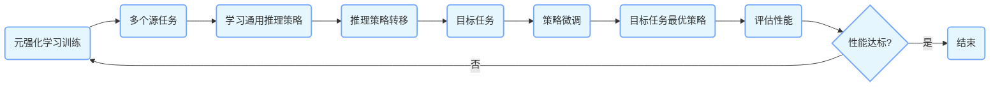

# 元强化学习在推理策略转移中的研究

> 关键词：元强化学习、推理策略转移、强化学习、策略泛化、学习迁移

> 摘要：本文聚焦于元强化学习在推理策略转移中的应用与研究。首先介绍了相关背景知识，包括研究目的、预期读者、文档结构和术语表。接着阐述了元强化学习和推理策略转移的核心概念及其联系，并给出了相应的原理和架构示意图。详细讲解了核心算法原理，通过Python代码进行具体操作步骤的演示。同时，给出了相关的数学模型和公式，并举例说明。在项目实战部分，搭建了开发环境，给出了源代码实现及详细解读。探讨了元强化学习在推理策略转移中的实际应用场景，推荐了学习资源、开发工具框架和相关论文著作。最后总结了未来发展趋势与挑战，提供了常见问题解答和扩展阅读参考资料，旨在为该领域的研究和实践提供全面而深入的指导。

## 1. 背景介绍 
### 1.1 目的和范围
元强化学习旨在让智能体能够快速适应新的任务或环境，通过学习如何学习，提高学习效率和泛化能力。推理策略转移则关注如何将在一个或多个源任务上学习到的推理策略有效地应用到目标任务中。本研究的目的在于深入探讨元强化学习在推理策略转移中的机制、方法和效果，为解决复杂多变环境下的智能决策问题提供理论支持和实践指导。

研究范围涵盖了元强化学习的基本理论、常见算法，推理策略转移的概念、评估指标，以及两者结合的具体方法和应用场景。通过理论分析、算法实现和实验验证，全面评估元强化学习在推理策略转移中的性能和优势。

### 1.2 预期读者
本文预期读者包括人工智能、机器学习、强化学习领域的研究人员、学生，以及对智能决策系统开发感兴趣的工程师和从业者。对于希望深入了解元强化学习和推理策略转移相关理论和技术的人员，本文提供了系统的知识体系和实践指导。

### 1.3 文档结构概述
本文共分为十个部分。背景介绍部分阐述了研究目的、预期读者和文档结构；核心概念与联系部分详细解释了元强化学习和推理策略转移的概念，并给出了它们之间的联系；核心算法原理 & 具体操作步骤部分介绍了元强化学习在推理策略转移中的核心算法，并通过Python代码进行实现；数学模型和公式 & 详细讲解 & 举例说明部分给出了相关的数学模型和公式，并举例说明；项目实战部分通过具体的代码案例，展示了如何在实际项目中应用元强化学习进行推理策略转移；实际应用场景部分探讨了元强化学习在推理策略转移中的实际应用；工具和资源推荐部分推荐了学习资源、开发工具框架和相关论文著作；总结部分分析了未来发展趋势与挑战；附录部分提供了常见问题解答；扩展阅读 & 参考资料部分列出了相关的参考资料，方便读者进一步深入学习。

### 1.4 术语表
#### 1.4.1 核心术语定义
- **元强化学习（Meta-Reinforcement Learning）**：一种让智能体能够学习如何学习的强化学习方法，通过在多个任务上进行训练，使智能体能够快速适应新的任务。
- **推理策略转移（Reasoning Policy Transfer）**：将在一个或多个源任务上学习到的推理策略应用到目标任务中的过程。
- **强化学习（Reinforcement Learning）**：智能体通过与环境进行交互，根据环境反馈的奖励信号来学习最优策略的机器学习方法。
- **策略（Policy）**：智能体在给定状态下选择动作的规则。
- **状态（State）**：环境的当前描述，用于智能体做出决策。
- **动作（Action）**：智能体在某个状态下采取的行为。
- **奖励（Reward）**：环境对智能体动作的反馈，用于评估动作的好坏。

#### 1.4.2 相关概念解释
- **学习迁移（Transfer Learning）**：将在一个任务上学习到的知识或技能应用到另一个相关任务上的过程。推理策略转移是学习迁移在强化学习中的一种具体形式。
- **元学习（Meta-Learning）**：学习如何学习的方法，元强化学习是元学习在强化学习领域的应用。
- **策略泛化（Policy Generalization）**：智能体学习到的策略能够在不同的环境或任务中有效应用的能力。

#### 1.4.3 缩略词列表
- **MDP**：Markov Decision Process，马尔可夫决策过程
- **RL**：Reinforcement Learning，强化学习
- **Meta-RL**：Meta-Reinforcement Learning，元强化学习

## 2. 核心概念与联系 

### 2.1 元强化学习原理
元强化学习的核心思想是在多个任务上进行训练，让智能体学会如何快速适应新的任务。传统的强化学习通常在单个任务上进行训练，智能体需要花费大量的时间和样本才能学习到一个有效的策略。而元强化学习通过在多个相关任务上进行训练，提取这些任务的共同特征和规律，使得智能体在面对新任务时能够利用之前学到的知识，快速调整策略，达到更好的学习效果。

元强化学习可以看作是一个双层优化问题。外层优化目标是在多个任务上最大化智能体的平均性能，内层优化目标是在每个具体任务上学习到最优策略。通过不断迭代外层和内层优化，智能体逐渐学会如何在不同任务之间进行快速迁移和适应。

### 2.2 推理策略转移原理
推理策略转移的目的是将在源任务上学习到的推理策略应用到目标任务中。推理策略是指智能体在面对问题时，根据已知信息进行推理和决策的规则。在源任务上，智能体通过与环境交互，学习到了一套有效的推理策略。当遇到目标任务时，由于目标任务与源任务可能存在一定的相似性，我们希望能够将源任务上的推理策略进行适当的调整和转移，以加速目标任务的学习过程。

推理策略转移的关键在于找到源任务和目标任务之间的相似性，并设计合适的转移方法。相似性可以从任务的状态空间、动作空间、奖励函数等方面进行衡量。转移方法可以分为基于模型的方法和无模型的方法。基于模型的方法通过构建任务模型，利用模型的先验知识进行策略转移；无模型的方法则直接在策略层面进行转移，不依赖于具体的任务模型。

### 2.3 元强化学习与推理策略转移的联系
元强化学习为推理策略转移提供了一种有效的学习机制。通过在多个任务上进行元学习，智能体可以学习到通用的推理策略和学习方法，这些知识可以在不同任务之间进行转移。推理策略转移则是元强化学习的一个具体应用场景，通过将在源任务上学习到的推理策略转移到目标任务中，实现智能体在新任务上的快速适应和学习。

具体来说，元强化学习可以帮助智能体在源任务上学习到更具泛化能力的推理策略，这些策略可以更容易地转移到目标任务中。同时，推理策略转移的评估和优化也可以反馈到元强化学习的训练过程中，进一步提高元强化学习的性能。

### 2.4 核心概念原理和架构的文本示意图
```plaintext
元强化学习
|-- 外层优化：在多个任务上最大化平均性能
|   |-- 任务集合 {T1, T2,..., Tn}
|   |-- 元目标函数：最大化平均奖励
|-- 内层优化：在每个任务上学习最优策略
|   |-- 任务 Ti
|   |   |-- 状态空间 Si
|   |   |-- 动作空间 Ai
|   |   |-- 奖励函数 Ri
|   |   |-- 策略 πi
|
推理策略转移
|-- 源任务 Ts
|   |-- 推理策略 πs
|-- 目标任务 Tt
|   |-- 初始策略 πt0（基于 πs 转移得到）
|   |-- 策略调整：根据目标任务的特点进行微调
```

### 2.5 Mermaid 流程图


## 3. 核心算法原理 & 具体操作步骤 

### 3.1 核心算法原理
元强化学习在推理策略转移中常用的算法之一是基于模型无关的元强化学习（Model-Free Meta-Reinforcement Learning），例如 MAML（Model-Agnostic Meta-Learning）算法。MAML 的核心思想是通过在多个任务上进行训练，找到一个初始化参数，使得在这个初始化参数的基础上，只需要进行少量的梯度更新，就能够在新任务上快速收敛到最优策略。

具体来说，MAML 的训练过程分为两个阶段：元训练阶段和元测试阶段。在元训练阶段，从任务分布中采样一组任务，对于每个任务，使用当前的元参数进行梯度更新，得到该任务的适应参数。然后，使用这些适应参数在相应任务上进行评估，计算损失函数。最后，通过反向传播更新元参数，使得在不同任务上的适应能力得到提高。在元测试阶段，使用训练好的元参数，在新任务上进行少量的梯度更新，得到新任务的最优策略。

### 3.2 具体操作步骤

#### 步骤 1：初始化元参数 $\theta$
随机初始化一个神经网络的参数 $\theta$，作为元参数。这个神经网络可以是策略网络或价值网络，用于表示智能体的策略或价值函数。

#### 步骤 2：元训练阶段
1. **采样任务**：从任务分布 $\mathcal{T}$ 中采样一组任务 $\{T_1, T_2, \ldots, T_n\}$。
2. **内循环更新**：对于每个任务 $T_i$，使用当前的元参数 $\theta$ 进行 $k$ 步的梯度更新，得到适应参数 $\theta_i'$。具体来说，对于第 $j$ 步更新，使用梯度下降法更新参数：
   $$\theta_i^{(j+1)} = \theta_i^{(j)} - \alpha \nabla_{\theta_i^{(j)}} L(T_i, \theta_i^{(j)})$$
   其中，$\alpha$ 是内循环的学习率，$L(T_i, \theta_i^{(j)})$ 是任务 $T_i$ 在参数 $\theta_i^{(j)}$ 下的损失函数。经过 $k$ 步更新后，得到适应参数 $\theta_i' = \theta_i^{(k)}$。
3. **外循环更新**：使用适应参数 $\theta_i'$ 在相应任务 $T_i$ 上进行评估，计算元损失函数：
   $$L_{meta}(\theta) = \sum_{i=1}^{n} L(T_i, \theta_i')$$
   然后，使用梯度下降法更新元参数 $\theta$：
   $$\theta \leftarrow \theta - \beta \nabla_{\theta} L_{meta}(\theta)$$
   其中，$\beta$ 是外循环的学习率。

#### 步骤 3：元测试阶段
1. **选择新任务**：从任务分布 $\mathcal{T}$ 中选择一个新任务 $T_{new}$。
2. **适应新任务**：使用训练好的元参数 $\theta$，在新任务 $T_{new}$ 上进行 $m$ 步的梯度更新，得到新任务的最优策略参数 $\theta_{new}'$。具体更新方法与内循环更新相同。
3. **执行策略**：使用得到的最优策略参数 $\theta_{new}'$，在新任务 $T_{new}$ 上执行策略，与环境进行交互，获得奖励。

### 3.3 Python 源代码实现
```python
import torch
import torch.nn as nn
import torch.optim as optim

# 定义策略网络
class PolicyNetwork(nn.Module):
    def __init__(self, input_dim, output_dim):
        super(PolicyNetwork, self).__init__()
        self.fc1 = nn.Linear(input_dim, 64)
        self.fc2 = nn.Linear(64, output_dim)

    def forward(self, x):
        x = torch.relu(self.fc1(x))
        x = torch.softmax(self.fc2(x), dim=-1)
        return x

# 定义 MAML 算法类
class MAML:
    def __init__(self, input_dim, output_dim, inner_lr=0.01, outer_lr=0.001, num_inner_steps=5):
        self.policy = PolicyNetwork(input_dim, output_dim)
        self.inner_optimizer = optim.SGD(self.policy.parameters(), lr=inner_lr)
        self.outer_optimizer = optim.Adam(self.policy.parameters(), lr=outer_lr)
        self.num_inner_steps = num_inner_steps

    def inner_update(self, task_data, params=None):
        if params is None:
            params = self.policy.parameters()
        temp_policy = PolicyNetwork(self.policy.fc1.in_features, self.policy.fc2.out_features)
        temp_policy.load_state_dict(self.policy.state_dict())
        temp_optimizer = optim.SGD(temp_policy.parameters(), lr=self.inner_optimizer.param_groups[0]['lr'])

        for _ in range(self.num_inner_steps):
            states, actions, rewards = task_data
            log_probs = torch.log(temp_policy(states))
            action_log_probs = log_probs.gather(1, actions.unsqueeze(1)).squeeze(1)
            loss = -(action_log_probs * rewards).mean()

            temp_optimizer.zero_grad()
            loss.backward()
            temp_optimizer.step()

        return temp_policy.state_dict()

    def outer_update(self, task_datas):
        meta_loss = 0
        for task_data in task_datas:
            adapted_params = self.inner_update(task_data)
            states, actions, rewards = task_data
            temp_policy = PolicyNetwork(self.policy.fc1.in_features, self.policy.fc2.out_features)
            temp_policy.load_state_dict(adapted_params)
            log_probs = torch.log(temp_policy(states))
            action_log_probs = log_probs.gather(1, actions.unsqueeze(1)).squeeze(1)
            loss = -(action_log_probs * rewards).mean()
            meta_loss += loss

        self.outer_optimizer.zero_grad()
        meta_loss.backward()
        self.outer_optimizer.step()

# 示例使用
input_dim = 10
output_dim = 5
maml = MAML(input_dim, output_dim)

# 模拟任务数据
num_tasks = 3
task_datas = []
for _ in range(num_tasks):
    states = torch.randn(100, input_dim)
    actions = torch.randint(0, output_dim, (100,))
    rewards = torch.randn(100)
    task_datas.append((states, actions, rewards))

# 元训练
for _ in range(10):
    maml.outer_update(task_datas)

# 元测试
new_task_data = (torch.randn(100, input_dim), torch.randint(0, output_dim, (100,)), torch.randn(100))
adapted_params = maml.inner_update(new_task_data)
```

## 4. 数学模型和公式 & 详细讲解 & 举例说明 

### 4.1 马尔可夫决策过程（MDP）
马尔可夫决策过程是强化学习中常用的数学模型，用于描述智能体与环境的交互过程。一个 MDP 可以用一个五元组 $\langle \mathcal{S}, \mathcal{A}, P, R, \gamma \rangle$ 表示，其中：
- $\mathcal{S}$ 是状态空间，表示环境的所有可能状态。
- $\mathcal{A}$ 是动作空间，表示智能体可以采取的所有可能动作。
- $P(s'|s, a)$ 是状态转移概率，表示在状态 $s$ 下采取动作 $a$ 后，转移到状态 $s'$ 的概率。
- $R(s, a)$ 是奖励函数，表示在状态 $s$ 下采取动作 $a$ 后，获得的即时奖励。
- $\gamma \in [0, 1]$ 是折扣因子，用于权衡即时奖励和未来奖励的重要性。

智能体的目标是学习一个策略 $\pi(a|s)$，使得在 MDP 中获得的累积折扣奖励最大化。累积折扣奖励可以表示为：
$$G_t = \sum_{k=0}^{\infty} \gamma^k R(S_{t+k}, A_{t+k})$$
其中，$S_t$ 和 $A_t$ 分别表示时刻 $t$ 的状态和动作。

### 4.2 策略梯度定理
策略梯度定理是强化学习中用于优化策略的重要理论。对于一个参数化的策略 $\pi_{\theta}(a|s)$，策略梯度可以表示为：
$$\nabla_{\theta} J(\theta) = \mathbb{E}_{\tau \sim \pi_{\theta}} \left[ \sum_{t=0}^{T} \nabla_{\theta} \log \pi_{\theta}(A_t|S_t) Q^{\pi_{\theta}}(S_t, A_t) \right]$$
其中，$J(\theta)$ 是策略的目标函数，通常是累积折扣奖励的期望；$\tau = (S_0, A_0, R_0, S_1, A_1, R_1, \ldots)$ 是一个轨迹；$Q^{\pi_{\theta}}(s, a)$ 是动作价值函数，表示在策略 $\pi_{\theta}$ 下，从状态 $s$ 采取动作 $a$ 后获得的累积折扣奖励的期望。

策略梯度定理表明，我们可以通过沿着策略梯度的方向更新策略参数 $\theta$，来提高策略的性能。具体来说，使用梯度上升法更新参数：
$$\theta \leftarrow \theta + \alpha \nabla_{\theta} J(\theta)$$
其中，$\alpha$ 是学习率。

### 4.3 MAML 算法的数学模型
MAML 算法的目标是找到一个初始化参数 $\theta$，使得在这个初始化参数的基础上，只需要进行少量的梯度更新，就能够在新任务上快速收敛到最优策略。具体来说，MAML 的元目标函数可以表示为：
$$\min_{\theta} \sum_{T_i \sim \mathcal{T}} L(T_i, \theta_i')$$
其中，$\mathcal{T}$ 是任务分布，$T_i$ 是从任务分布中采样的一个任务，$\theta_i'$ 是在任务 $T_i$ 上进行 $k$ 步梯度更新后得到的适应参数。适应参数的更新公式为：
$$\theta_i' = \theta - \alpha \nabla_{\theta} L(T_i, \theta)$$
其中，$\alpha$ 是内循环的学习率。

### 4.4 举例说明
假设我们有一个简单的 MDP，状态空间 $\mathcal{S} = \{s_1, s_2\}$，动作空间 $\mathcal{A} = \{a_1, a_2\}$，状态转移概率和奖励函数如下：
- $P(s_1|s_1, a_1) = 0.8$，$P(s_2|s_1, a_1) = 0.2$，$R(s_1, a_1) = 1$
- $P(s_1|s_1, a_2) = 0.2$，$P(s_2|s_1, a_2) = 0.8$，$R(s_1, a_2) = -1$
- $P(s_2|s_2, a_1) = 0.2$，$P(s_1|s_2, a_1) = 0.8$，$R(s_2, a_1) = -1$
- $P(s_2|s_2, a_2) = 0.8$，$P(s_1|s_2, a_2) = 0.2$，$R(s_2, a_2) = 1$

折扣因子 $\gamma = 0.9$。我们使用 MAML 算法来学习一个策略，使得在这个 MDP 上获得的累积折扣奖励最大化。

首先，我们初始化策略网络的参数 $\theta$。然后，在元训练阶段，我们从任务分布中采样一组任务，对于每个任务，使用当前的元参数 $\theta$ 进行内循环更新，得到适应参数 $\theta_i'$。接着，使用适应参数 $\theta_i'$ 在相应任务上进行评估，计算元损失函数。最后，使用梯度下降法更新元参数 $\theta$。

在元测试阶段，我们选择一个新任务，使用训练好的元参数 $\theta$，在新任务上进行少量的梯度更新，得到新任务的最优策略参数 $\theta_{new}'$。然后，使用 $\theta_{new}'$ 在新任务上执行策略，与环境进行交互，获得奖励。

## 5. 项目实战：代码实际案例和详细解释说明 

### 5.1  开发环境搭建
#### 5.1.1 安装 Python
首先，确保你已经安装了 Python 3.6 或更高版本。可以从 Python 官方网站（https://www.python.org/downloads/）下载并安装适合你操作系统的 Python 版本。

#### 5.1.2 安装依赖库
我们需要安装一些常用的 Python 库，包括 PyTorch、NumPy 等。可以使用以下命令进行安装：
```sh
pip install torch numpy
```

### 5.2  源代码详细实现和代码解读
```python
import torch
import torch.nn as nn
import torch.optim as optim
import numpy as np

# 定义策略网络
class PolicyNetwork(nn.Module):
    def __init__(self, input_dim, output_dim):
        super(PolicyNetwork, self).__init__()
        self.fc1 = nn.Linear(input_dim, 64)
        self.fc2 = nn.Linear(64, output_dim)

    def forward(self, x):
        x = torch.relu(self.fc1(x))
        x = torch.softmax(self.fc2(x), dim=-1)
        return x

# 定义 MAML 算法类
class MAML:
    def __init__(self, input_dim, output_dim, inner_lr=0.01, outer_lr=0.001, num_inner_steps=5):
        self.policy = PolicyNetwork(input_dim, output_dim)
        self.inner_optimizer = optim.SGD(self.policy.parameters(), lr=inner_lr)
        self.outer_optimizer = optim.Adam(self.policy.parameters(), lr=outer_lr)
        self.num_inner_steps = num_inner_steps

    def inner_update(self, task_data, params=None):
        if params is None:
            params = self.policy.parameters()
        temp_policy = PolicyNetwork(self.policy.fc1.in_features, self.policy.fc2.out_features)
        temp_policy.load_state_dict(self.policy.state_dict())
        temp_optimizer = optim.SGD(temp_policy.parameters(), lr=self.inner_optimizer.param_groups[0]['lr'])

        for _ in range(self.num_inner_steps):
            states, actions, rewards = task_data
            log_probs = torch.log(temp_policy(states))
            action_log_probs = log_probs.gather(1, actions.unsqueeze(1)).squeeze(1)
            loss = -(action_log_probs * rewards).mean()

            temp_optimizer.zero_grad()
            loss.backward()
            temp_optimizer.step()

        return temp_policy.state_dict()

    def outer_update(self, task_datas):
        meta_loss = 0
        for task_data in task_datas:
            adapted_params = self.inner_update(task_data)
            states, actions, rewards = task_data
            temp_policy = PolicyNetwork(self.policy.fc1.in_features, self.policy.fc2.out_features)
            temp_policy.load_state_dict(adapted_params)
            log_probs = torch.log(temp_policy(states))
            action_log_probs = log_probs.gather(1, actions.unsqueeze(1)).squeeze(1)
            loss = -(action_log_probs * rewards).mean()
            meta_loss += loss

        self.outer_optimizer.zero_grad()
        meta_loss.backward()
        self.outer_optimizer.step()

# 模拟环境交互函数
def interact_with_environment(policy, state_dim, action_dim, num_steps):
    states = []
    actions = []
    rewards = []
    state = torch.randn(state_dim)
    for _ in range(num_steps):
        action_probs = policy(state.unsqueeze(0))
        action = torch.multinomial(action_probs, 1).squeeze().item()
        next_state = torch.randn(state_dim)
        reward = np.random.randn()

        states.append(state)
        actions.append(action)
        rewards.append(reward)

        state = next_state

    states = torch.stack(states)
    actions = torch.tensor(actions)
    rewards = torch.tensor(rewards)
    return states, actions, rewards

# 主函数
if __name__ == "__main__":
    input_dim = 10
    output_dim = 5
    maml = MAML(input_dim, output_dim)

    num_tasks = 3
    num_steps_per_task = 100
    num_epochs = 10

    for epoch in range(num_epochs):
        task_datas = []
        for _ in range(num_tasks):
            task_data = interact_with_environment(maml.policy, input_dim, output_dim, num_steps_per_task)
            task_datas.append(task_data)

        maml.outer_update(task_datas)
        print(f"Epoch {epoch+1}/{num_epochs} completed.")

    # 元测试
    new_task_data = interact_with_environment(maml.policy, input_dim, output_dim, num_steps_per_task)
    adapted_params = maml.inner_update(new_task_data)
    temp_policy = PolicyNetwork(input_dim, output_dim)
    temp_policy.load_state_dict(adapted_params)
    test_states, test_actions, test_rewards = interact_with_environment(temp_policy, input_dim, output_dim, num_steps_per_task)
    total_reward = test_rewards.sum().item()
    print(f"Test total reward: {total_reward}")
```

### 5.3  代码解读与分析
#### 5.3.1 策略网络定义
`PolicyNetwork` 类定义了一个简单的两层全连接神经网络，用于表示智能体的策略。输入层的维度为 `input_dim`，输出层的维度为 `output_dim`。通过 `forward` 方法，将输入的状态转换为动作概率分布。

#### 5.3.2 MAML 算法类
`MAML` 类实现了 MAML 算法的核心逻辑。`__init__` 方法初始化策略网络、内循环优化器和外循环优化器。`inner_update` 方法在单个任务上进行内循环更新，返回适应参数。`outer_update` 方法在多个任务上进行外循环更新，更新元参数。

#### 5.3.3 模拟环境交互函数
`interact_with_environment` 函数模拟智能体与环境的交互过程。在每个时间步，根据当前策略选择动作，与环境交互得到下一个状态和奖励。最后返回状态、动作和奖励的序列。

#### 5.3.4 主函数
主函数中，首先初始化 MAML 算法对象。然后进行多个 epoch 的训练，每个 epoch 中采样多个任务，与环境交互得到任务数据，调用 `outer_update` 方法进行元训练。训练完成后，进行元测试，在新任务上进行内循环更新，得到适应参数，使用适应后的策略与环境交互，计算总奖励。

## 6. 实际应用场景 
### 6.1 机器人控制
在机器人控制领域，机器人需要在不同的环境和任务中完成各种操作。元强化学习在推理策略转移中的应用可以帮助机器人快速适应新的任务和环境。例如，一个机器人在工厂中学习了如何搬运不同形状和重量的物体，当它被转移到一个新的仓库环境中时，可以利用之前学习到的推理策略，快速调整自己的动作和规划路径，以适应新的任务需求。

### 6.2 游戏智能体
在游戏领域，智能体需要在不同的游戏场景和规则下进行决策。元强化学习可以让智能体在多个游戏中学习到通用的推理策略，当遇到新的游戏时，能够快速迁移这些策略，提高学习效率和游戏性能。例如，一个智能体在学习了多个不同类型的格斗游戏后，当遇到一个新的格斗游戏时，可以利用之前学习到的策略，快速掌握游戏的技巧和规则。

### 6.3 自动驾驶
在自动驾驶领域，车辆需要在不同的道路条件和交通场景下做出决策。元强化学习在推理策略转移中的应用可以帮助自动驾驶车辆快速适应新的驾驶环境。例如，一辆自动驾驶汽车在城市道路上学习了如何应对各种交通信号和行人，当它行驶到乡村道路上时，可以利用之前学习到的推理策略，快速调整自己的驾驶行为，以适应乡村道路的特点。

### 6.4 金融投资
在金融投资领域，投资者需要根据不同的市场条件和投资目标做出决策。元强化学习可以帮助投资者学习到通用的投资策略，当市场环境发生变化时，能够快速转移这些策略，提高投资收益。例如，一个投资者在股票市场中学习了如何根据市场趋势和公司财务状况进行投资决策，当他进入期货市场时，可以利用之前学习到的推理策略，快速适应期货市场的特点。

## 7. 工具和资源推荐
### 7.1 学习资源推荐
#### 7.1.1 书籍推荐
- 《Reinforcement Learning: An Introduction》（Richard S. Sutton 和 Andrew G. Barto 著）：这是强化学习领域的经典教材，全面介绍了强化学习的基本概念、算法和应用。
- 《Deep Reinforcement Learning Hands-On》（Max Lapan 著）：本书通过大量的代码示例，详细介绍了深度强化学习的各种算法和应用，适合初学者和有一定基础的读者。
- 《Meta-Learning: A Survey》（Antreas Antoniou 等著）：这是一篇关于元学习的综述论文，对元学习的各种方法和应用进行了系统的介绍。

#### 7.1.2 在线课程
- Coursera 上的 “Reinforcement Learning Specialization”：由 University of Alberta 提供，全面介绍了强化学习的理论和实践。
- edX 上的 “Introduction to Artificial Intelligence”：由 Massachusetts Institute of Technology 提供，包含了强化学习和元学习的相关内容。
- OpenAI Gym 官方文档和教程：OpenAI Gym 是一个用于开发和比较强化学习算法的工具包，官方文档和教程提供了丰富的学习资源。

#### 7.1.3 技术博客和网站
- Towards Data Science：一个专注于数据科学和机器学习的技术博客，上面有很多关于强化学习和元学习的优秀文章。
- Medium 上的 “Reinforcement Learning” 主题：汇集了大量关于强化学习的最新研究和实践经验。
- ArXiv.org：一个开放的学术论文预印本平台，上面可以找到很多关于元强化学习和推理策略转移的最新研究成果。

### 7.2 开发工具框架推荐
#### 7.2.1 IDE和编辑器
- PyCharm：一款功能强大的 Python 集成开发环境，提供了代码编辑、调试、版本控制等功能，适合开发强化学习项目。
- Jupyter Notebook：一个交互式的开发环境，可以方便地进行代码编写、实验和文档记录，非常适合机器学习和数据科学项目。
- Visual Studio Code：一款轻量级的代码编辑器，支持多种编程语言和插件，可用于开发强化学习项目。

#### 7.2.2 调试和性能分析工具
- TensorBoard：一个用于可视化和分析深度学习模型训练过程的工具，可以帮助我们监控训练损失、奖励曲线等指标。
- PyTorch Profiler：PyTorch 提供的性能分析工具，可以帮助我们分析模型的运行时间、内存使用等情况，优化模型性能。
- cProfile：Python 标准库中的性能分析工具，可以帮助我们分析 Python 代码的运行时间和函数调用情况。

#### 7.2.3 相关框架和库
- PyTorch：一个开源的深度学习框架，提供了丰富的神经网络层和优化算法，广泛应用于强化学习和元学习领域。
- TensorFlow：另一个流行的深度学习框架，具有强大的分布式训练和模型部署能力，也可用于开发强化学习和元学习算法。
- OpenAI Gym：一个用于开发和比较强化学习算法的工具包，提供了大量的模拟环境和评估指标。

### 7.3 相关论文著作推荐
#### 7.3.1 经典论文
- “Model-Agnostic Meta-Learning for Fast Adaptation of Deep Networks”（Chelsea Finn 等著）：提出了 MAML 算法，是元强化学习领域的经典论文。
- “Learning to Learn by Gradient Descent by Gradient Descent”（Marcin Andrychowicz 等著）：介绍了一种基于梯度下降的元学习方法。
- “Reinforcement Learning: A Survey”（Leslie Pack Kaelbling 等著）：这是一篇关于强化学习的综述论文，对强化学习的发展历程和主要算法进行了系统的介绍。

#### 7.3.2 最新研究成果
- “Meta-Reinforcement Learning with Latent Variable Models”（Kurtland Chua 等著）：提出了一种基于潜变量模型的元强化学习方法。
- “Adversarial Meta-Learning for Few-Shot Learning”（Han-Jia Ye 等著）：将对抗学习与元学习相结合，用于少样本学习任务。
- “Meta-Learning for Adaptive Robotic Control”（Yunfei Bai 等著）：研究了元学习在自适应机器人控制中的应用。

#### 7.3.3 应用案例分析
- “Autonomous Driving using Deep Reinforcement Learning: A Survey”（Zhenghao Peng 等著）：对深度强化学习在自动驾驶中的应用进行了综述和分析。
- “Deep Reinforcement Learning in Finance”（Jianqing Fan 等著）：介绍了深度强化学习在金融领域的应用，包括投资决策、风险管理等。
- “Reinforcement Learning for Game Playing”（Julian Togelius 等著）：探讨了强化学习在游戏领域的应用，包括游戏智能体的设计和训练。

## 8. 总结：未来发展趋势与挑战
### 8.1 未来发展趋势
#### 8.1.1 多模态元强化学习
未来的研究可能会将元强化学习与多模态数据相结合，如视觉、语音、文本等。通过利用多模态信息，智能体可以更全面地理解环境和任务，提高推理策略转移的性能。例如，在机器人控制中，结合视觉和触觉信息，机器人可以更准确地感知物体的形状和质地，从而更好地完成搬运任务。

#### 8.1.2 元强化学习与人类智能的融合
研究人员可能会探索如何将元强化学习与人类智能相结合，以提高智能体的学习能力和适应性。例如，通过引入人类的先验知识和经验，帮助智能体更快地学习和适应新任务。同时，研究人类的学习机制，为元强化学习算法的设计提供灵感。

#### 8.1.3 元强化学习在复杂系统中的应用
随着科技的发展，越来越多的复杂系统需要智能决策支持，如能源管理系统、交通控制系统等。元强化学习在推理策略转移中的应用可以帮助这些系统快速适应环境变化，提高系统的性能和效率。未来的研究可能会将元强化学习应用到更多的复杂系统中，解决实际问题。

### 8.2 挑战
#### 8.2.1 样本效率问题
元强化学习通常需要大量的样本进行训练，以学习到通用的推理策略。在实际应用中，获取大量的样本可能是困难和昂贵的。因此，如何提高元强化学习的样本效率，减少对样本的依赖，是一个亟待解决的问题。

#### 8.2.2 策略泛化问题
虽然元强化学习的目标是提高策略的泛化能力，但在实际应用中，智能体学习到的策略可能仍然无法很好地适应新的任务和环境。如何设计更有效的策略转移方法，提高策略的泛化能力，是元强化学习面临的另一个挑战。

#### 8.2.3 可解释性问题
元强化学习算法通常是基于深度学习模型的，这些模型往往具有较高的复杂度和黑盒性，难以解释其决策过程和推理机制。在一些对安全性和可靠性要求较高的应用场景中，如自动驾驶、医疗诊断等，可解释性是一个重要的问题。如何提高元强化学习算法的可解释性，是未来研究的一个重要方向。

## 9. 附录：常见问题与解答
### 9.1 元强化学习和传统强化学习有什么区别？
传统强化学习通常在单个任务上进行训练，智能体需要花费大量的时间和样本才能学习到一个有效的策略。而元强化学习通过在多个任务上进行训练，让智能体学会如何快速适应新的任务。元强化学习可以看作是一种学习如何学习的方法，能够提高智能体的学习效率和泛化能力。

### 9.2 推理策略转移的评估指标有哪些？
常见的推理策略转移评估指标包括：
- **迁移增益（Transfer Gain）**：衡量策略转移后在目标任务上的性能提升程度。
- **适应时间（Adaptation Time）**：智能体在目标任务上达到一定性能所需的时间或步数。
- **策略相似度（Policy Similarity）**：衡量源任务和目标任务上策略的相似程度。

### 9.3 如何选择合适的元强化学习算法？
选择合适的元强化学习算法需要考虑以下因素：
- **任务类型**：不同的任务可能适合不同的算法。例如，对于连续控制任务，基于策略梯度的算法可能更合适；对于离散动作任务，基于价值函数的算法可能更有效。
- **样本效率**：如果样本获取成本较高，需要选择样本效率较高的算法。
- **计算资源**：一些复杂的元强化学习算法可能需要大量的计算资源，需要根据实际情况选择合适的算法。

### 9.4 元强化学习在实际应用中面临哪些困难？
元强化学习在实际应用中面临以下困难：
- **样本效率低**：需要大量的样本进行训练，获取样本的成本较高。
- **策略泛化能力不足**：学习到的策略可能无法很好地适应新的任务和环境。
- **可解释性差**：基于深度学习的元强化学习算法往往具有较高的复杂度和黑盒性，难以解释其决策过程。
- **环境建模困难**：在一些复杂的实际环境中，准确建模环境的状态转移和奖励函数是困难的。

## 10. 扩展阅读 & 参考资料
### 10.1 扩展阅读
- Finn, C., Abbeel, P., & Levine, S. (2017). Model-agnostic meta-learning for fast adaptation of deep networks. In Proceedings of the 34th International Conference on Machine Learning-Volume 70 (pp. 1126-1135).
- Andrychowicz, M., Denil, M., Gomez, S., Hoffman, M. W., Pfau, D., Schaul, T.,... & de Freitas, N. (2016). Learning to learn by gradient descent by gradient descent. In Advances in neural information processing systems (pp. 3981-3989).
- Kaelbling, L. P., Littman, M. L., & Moore, A. W. (1996). Reinforcement learning: A survey. Journal of artificial intelligence research, 4, 237-285.

### 10.2 参考资料
- Sutton, R. S., & Barto, A. G. (2018). Reinforcement learning: An introduction. MIT press.
- Lapan, M. (2018). Deep reinforcement learning hands-on: Apply modern RL methods, with deep Q-networks, value iteration, policy gradients, TRPO, AlphaGo Zero and more. Packt Publishing Ltd.
- OpenAI Gym Documentation: https://gym.openai.com/docs/
- PyTorch Documentation: https://pytorch.org/docs/stable/index.html
- TensorFlow Documentation: https://www.tensorflow.org/api_docs

作者：AI天才研究院/AI Genius Institute & 禅与计算机程序设计艺术 /Zen And The Art of Computer Programming