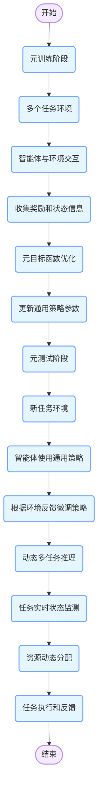

# 元强化学习驱动的动态多任务推理资源分配

> 关键词：元强化学习、动态多任务推理、资源分配、强化学习算法、智能决策

> 摘要：本文聚焦于元强化学习驱动的动态多任务推理资源分配问题。在当今复杂的计算环境中，多任务推理对资源的高效利用提出了挑战。元强化学习作为一种强大的技术，能够让智能体在不同任务环境中快速学习和适应，从而实现动态的资源分配决策。文章深入探讨了元强化学习的核心概念与架构，详细阐述了相关算法原理和具体操作步骤，通过数学模型和公式对资源分配问题进行了量化分析，并结合实际案例展示了如何运用元强化学习进行动态多任务推理的资源分配。此外，还介绍了该技术的实际应用场景、相关工具和资源，最后对未来发展趋势与挑战进行了总结。

## 1. 背景介绍 
### 1.1 目的和范围
在现代计算系统中，尤其是在人工智能和大数据处理领域，常常需要同时处理多个推理任务。这些任务具有不同的特点，如计算复杂度、实时性要求、数据规模等，对计算资源（如CPU、GPU、内存等）的需求也各不相同。传统的资源分配方法往往是静态的，无法根据任务的动态变化实时调整资源分配，导致资源利用率低下，任务执行效率不高。

本文的目的是研究如何利用元强化学习技术实现动态多任务推理的资源分配。通过元强化学习，智能体可以在不同的任务环境中快速学习和适应，根据任务的实时状态和系统资源的动态变化，做出最优的资源分配决策，从而提高资源利用率和任务执行效率。

本文的范围涵盖了元强化学习的基本概念、相关算法原理、数学模型分析、实际案例应用以及未来发展趋势等方面，旨在为研究人员和工程师提供一个全面的关于元强化学习驱动的动态多任务推理资源分配的技术指南。

### 1.2 预期读者
本文预期读者包括人工智能、机器学习、计算机科学等领域的研究人员、工程师和学生。对于那些对强化学习、资源分配和智能决策感兴趣的读者，本文可以提供深入的技术分析和实际应用案例。同时，对于从事云计算、边缘计算、数据中心管理等相关领域的专业人士，本文也可以为他们提供一种新的资源管理思路和方法。

### 1.3 文档结构概述
本文的结构如下：
- 核心概念与联系：介绍元强化学习、动态多任务推理和资源分配的核心概念，以及它们之间的联系，并给出相关的文本示意图和Mermaid流程图。
- 核心算法原理 & 具体操作步骤：详细阐述元强化学习的核心算法原理，如MAML（Model-Agnostic Meta-Learning）算法，并使用Python源代码进行详细说明。
- 数学模型和公式 & 详细讲解 & 举例说明：建立动态多任务推理资源分配的数学模型，给出相关公式，并通过具体例子进行详细讲解。
- 项目实战：代码实际案例和详细解释说明：通过一个实际的项目案例，展示如何使用元强化学习进行动态多任务推理的资源分配，包括开发环境搭建、源代码详细实现和代码解读。
- 实际应用场景：介绍元强化学习驱动的动态多任务推理资源分配在不同领域的实际应用场景。
- 工具和资源推荐：推荐相关的学习资源、开发工具框架和论文著作。
- 总结：未来发展趋势与挑战：总结元强化学习在动态多任务推理资源分配领域的未来发展趋势和面临的挑战。
- 附录：常见问题与解答：解答读者在阅读过程中可能遇到的常见问题。
- 扩展阅读 & 参考资料：提供相关的扩展阅读材料和参考资料。

### 1.4 术语表
#### 1.4.1 核心术语定义
- **元强化学习（Meta-Reinforcement Learning）**：一种强化学习的扩展，旨在让智能体在不同的任务环境中快速学习和适应，通过元学习机制，智能体可以利用以往的学习经验来加速在新任务上的学习过程。
- **动态多任务推理（Dynamic Multi-Task Inference）**：在计算系统中，同时处理多个具有不同特点和实时性要求的推理任务，并且这些任务的状态和需求会随着时间动态变化。
- **资源分配（Resource Allocation）**：将计算系统中的可用资源（如CPU、GPU、内存等）合理地分配给不同的任务，以满足任务的需求并提高资源利用率。
- **强化学习（Reinforcement Learning）**：一种机器学习方法，智能体通过与环境进行交互，根据环境反馈的奖励信号来学习最优的行为策略。
- **智能体（Agent）**：在强化学习中，能够感知环境状态并采取行动的实体，其目标是通过学习获得最大的累积奖励。

#### 1.4.2 相关概念解释
- **元学习（Meta-Learning）**：也称为“学习如何学习”，是一种让模型在多个任务上进行学习，从而能够快速适应新任务的技术。元学习的核心思想是学习一个通用的初始化参数或学习策略，使得模型在新任务上能够更快地收敛。
- **推理任务（Inference Task）**：在人工智能领域，推理任务是指利用训练好的模型对新的数据进行预测或分类的过程。不同的推理任务可能具有不同的计算复杂度和实时性要求。
- **资源利用率（Resource Utilization）**：指计算系统中实际使用的资源与可用资源的比例。提高资源利用率可以降低计算成本，提高系统的整体性能。

#### 1.4.3 缩略词列表
- **MAML**：Model-Agnostic Meta-Learning，与模型无关的元学习算法。
- **CPU**：Central Processing Unit，中央处理器。
- **GPU**：Graphics Processing Unit，图形处理器。
- **RL**：Reinforcement Learning，强化学习。
- **MRRL**：Meta-Reinforcement Learning，元强化学习。

## 2. 核心概念与联系 

### 核心概念原理
#### 元强化学习
元强化学习是强化学习和元学习的结合。传统的强化学习中，智能体需要在每个新的任务环境中从头开始学习最优策略，这往往需要大量的时间和样本。而元强化学习通过元学习机制，让智能体在多个任务上进行训练，学习到一种通用的学习能力，使得智能体在面对新的任务时能够快速适应，减少学习时间和样本需求。

元强化学习的核心思想是在元训练阶段，智能体在多个不同的任务环境中进行学习，通过优化元目标函数，学习到一个通用的初始化策略或学习策略。在元测试阶段，智能体将这个通用的策略应用到新的任务上，并根据新任务的环境反馈进行微调，从而快速获得在新任务上的最优策略。

#### 动态多任务推理
动态多任务推理是指在计算系统中同时处理多个推理任务，并且这些任务的状态和需求会随着时间动态变化。例如，在一个智能安防系统中，可能同时存在人脸检测、目标跟踪、行为分析等多个推理任务，这些任务的实时性要求和计算复杂度各不相同，并且随着场景的变化，任务的优先级和需求也会发生改变。

动态多任务推理需要解决的关键问题是如何根据任务的实时状态和系统资源的动态变化，合理地分配计算资源，以保证任务的高效执行。

#### 资源分配
资源分配是指将计算系统中的可用资源（如CPU、GPU、内存等）合理地分配给不同的任务。在动态多任务推理场景中，资源分配需要考虑任务的实时需求、计算复杂度、实时性要求等因素，以提高资源利用率和任务执行效率。

合理的资源分配可以避免资源的浪费和瓶颈，使得系统能够在有限的资源下处理更多的任务。例如，对于计算复杂度高、实时性要求低的任务，可以分配相对较少的资源；而对于计算复杂度低、实时性要求高的任务，则需要优先分配足够的资源。

### 架构的文本示意图
```plaintext
元强化学习系统
|
|-- 元训练阶段
|   |-- 多个任务环境
|   |   |-- 智能体与环境交互
|   |   |-- 收集奖励和状态信息
|   |-- 元目标函数优化
|       |-- 更新通用策略参数
|
|-- 元测试阶段
|   |-- 新任务环境
|   |   |-- 智能体使用通用策略
|   |   |-- 根据环境反馈微调策略
|   |-- 动态多任务推理
|       |-- 任务实时状态监测
|       |-- 资源动态分配
|       |-- 任务执行和反馈
```

### Mermaid流程图


## 3. 核心算法原理 & 具体操作步骤 

### MAML算法原理
MAML（Model-Agnostic Meta-Learning）是一种经典的元学习算法，也可以应用于元强化学习中。MAML的核心思想是学习一个通用的初始化参数，使得模型在经过少量的梯度更新后，能够在新的任务上快速收敛。

在元训练阶段，MAML的具体步骤如下：
1. **采样任务**：从任务分布 $\mathcal{T}$ 中采样一组任务 $\{T_1, T_2, \cdots, T_n\}$。
2. **内部更新**：对于每个任务 $T_i$，使用当前的通用参数 $\theta$ 初始化模型，然后在任务 $T_i$ 的训练数据上进行 $k$ 步的梯度更新，得到任务 $T_i$ 的特定参数 $\theta_i'$。
3. **外部更新**：计算所有任务 $T_i$ 的特定参数 $\theta_i'$ 在各自验证数据上的损失函数之和，然后根据这个损失函数对通用参数 $\theta$ 进行更新。

在元测试阶段，使用训练好的通用参数 $\theta$ 初始化模型，然后在新任务的训练数据上进行少量的梯度更新，得到新任务的最优参数。

### Python源代码详细阐述
```python
import torch
import torch.nn as nn
import torch.optim as optim

# 定义一个简单的神经网络模型
class SimpleModel(nn.Module):
    def __init__(self, input_size, hidden_size, output_size):
        super(SimpleModel, self).__init__()
        self.fc1 = nn.Linear(input_size, hidden_size)
        self.relu = nn.ReLU()
        self.fc2 = nn.Linear(hidden_size, output_size)

    def forward(self, x):
        out = self.fc1(x)
        out = self.relu(out)
        out = self.fc2(out)
        return out

# 定义MAML算法
class MAML:
    def __init__(self, model, inner_lr, outer_lr, num_inner_steps):
        self.model = model
        self.inner_lr = inner_lr
        self.outer_lr = outer_lr
        self.num_inner_steps = num_inner_steps
        self.outer_optimizer = optim.Adam(self.model.parameters(), lr=outer_lr)

    def inner_update(self, task_data, params):
        """
        内部更新步骤
        :param task_data: 任务数据
        :param params: 当前模型参数
        :return: 更新后的参数
        """
        inner_optimizer = optim.SGD(params, lr=self.inner_lr)
        for _ in range(self.num_inner_steps):
            inputs, targets = task_data
            outputs = self.model.forward_with_params(inputs, params)
            loss = nn.MSELoss()(outputs, targets)
            inner_optimizer.zero_grad()
            loss.backward()
            inner_optimizer.step()
        return list(self.model.parameters())

    def outer_update(self, tasks):
        """
        外部更新步骤
        :param tasks: 一组任务数据
        """
        meta_loss = 0
        for task_data in tasks:
            # 复制当前模型参数
            params = [p.clone() for p in self.model.parameters()]
            # 内部更新
            updated_params = self.inner_update(task_data, params)
            # 计算验证损失
            inputs, targets = task_data
            outputs = self.model.forward_with_params(inputs, updated_params)
            loss = nn.MSELoss()(outputs, targets)
            meta_loss += loss

        # 外部更新
        self.outer_optimizer.zero_grad()
        meta_loss.backward()
        self.outer_optimizer.step()

# 示例使用
input_size = 10
hidden_size = 20
output_size = 5
model = SimpleModel(input_size, hidden_size, output_size)
maml = MAML(model, inner_lr=0.01, outer_lr=0.001, num_inner_steps=5)

# 模拟一组任务数据
tasks = [
    (torch.randn(100, input_size), torch.randn(100, output_size)),
    (torch.randn(100, input_size), torch.randn(100, output_size))
]

# 进行元训练
for epoch in range(100):
    maml.outer_update(tasks)
    if epoch % 10 == 0:
        print(f'Epoch {epoch}: Meta loss = {meta_loss.item()}')
```

### 具体操作步骤
1. **定义模型**：首先需要定义一个神经网络模型，用于处理任务数据。在上述代码中，我们定义了一个简单的两层全连接神经网络 `SimpleModel`。
2. **初始化MAML类**：创建一个 `MAML` 类的实例，指定模型、内部学习率、外部学习率和内部更新步数。
3. **内部更新**：对于每个任务，使用当前的通用参数初始化模型，然后在任务的训练数据上进行多次梯度更新，得到任务的特定参数。
4. **外部更新**：计算所有任务的特定参数在各自验证数据上的损失函数之和，然后根据这个损失函数对通用参数进行更新。
5. **元训练**：重复步骤3和步骤4，直到达到指定的训练轮数。

## 4. 数学模型和公式 & 详细讲解 & 举例说明 

### 数学模型
假设我们有一个任务分布 $\mathcal{T}$，其中每个任务 $T$ 由一个马尔可夫决策过程（MDP）定义，记为 $T = \langle S, A, P, R, \gamma \rangle$，其中 $S$ 是状态空间，$A$ 是动作空间，$P$ 是状态转移概率，$R$ 是奖励函数，$\gamma$ 是折扣因子。

智能体的目标是学习一个策略 $\pi_{\theta}: S \to A$，使得在每个任务 $T$ 上的累积折扣奖励 $J_T(\theta)$ 最大，即：
$$
J_T(\theta) = \mathbb{E}_{\tau \sim \pi_{\theta}} \left[ \sum_{t=0}^{\infty} \gamma^t R(s_t, a_t) \right]
$$
其中 $\tau = (s_0, a_0, s_1, a_1, \cdots)$ 是一个轨迹，$s_t$ 是时刻 $t$ 的状态，$a_t$ 是时刻 $t$ 的动作。

在元强化学习中，我们的目标是学习一个通用的策略参数 $\theta$，使得在新的任务上能够快速适应。MAML算法通过优化以下元目标函数来实现这一目标：
$$
\min_{\theta} \sum_{T \sim \mathcal{T}} J_T(\theta')
$$
其中 $\theta'$ 是在任务 $T$ 上经过少量梯度更新后得到的参数，即：
$$
\theta' = \theta - \alpha \nabla_{\theta} J_T(\theta)
$$
这里 $\alpha$ 是内部学习率。

### 详细讲解
- **累积折扣奖励**：$J_T(\theta)$ 表示在任务 $T$ 上使用策略 $\pi_{\theta}$ 时的累积折扣奖励。折扣因子 $\gamma$ 用于平衡近期奖励和远期奖励，通常取值在 $(0, 1)$ 之间。
- **元目标函数**：元目标函数的目的是最小化在多个任务上经过少量梯度更新后的累积折扣奖励之和。通过优化这个目标函数，我们可以学习到一个通用的策略参数 $\theta$，使得在新的任务上能够快速收敛。
- **内部梯度更新**：在每个任务 $T$ 上，我们使用当前的通用参数 $\theta$ 初始化模型，然后在任务 $T$ 的训练数据上进行少量的梯度更新，得到任务 $T$ 的特定参数 $\theta'$。这个过程可以看作是在新任务上的快速适应。

### 举例说明
假设我们有两个任务 $T_1$ 和 $T_2$，每个任务都是一个简单的迷宫导航任务。在任务 $T_1$ 中，智能体需要从起点 $s_{10}$ 导航到终点 $g_1$；在任务 $T_2$ 中，智能体需要从起点 $s_{20}$ 导航到终点 $g_2$。

在元训练阶段，我们首先从任务分布中采样任务 $T_1$ 和 $T_2$，然后使用当前的通用参数 $\theta$ 初始化智能体的策略。对于任务 $T_1$，我们在其训练数据上进行 $k$ 步的梯度更新，得到任务 $T_1$ 的特定参数 $\theta_1'$；对于任务 $T_2$，同样进行 $k$ 步的梯度更新，得到任务 $T_2$ 的特定参数 $\theta_2'$。

然后，我们计算 $\theta_1'$ 在任务 $T_1$ 的验证数据上的累积折扣奖励 $J_{T_1}(\theta_1')$ 和 $\theta_2'$ 在任务 $T_2$ 的验证数据上的累积折扣奖励 $J_{T_2}(\theta_2')$，并将它们相加得到元目标函数的值。最后，根据元目标函数对通用参数 $\theta$ 进行更新。

在元测试阶段，当我们遇到一个新的迷宫导航任务 $T_3$ 时，我们使用训练好的通用参数 $\theta$ 初始化智能体的策略，然后在任务 $T_3$ 的训练数据上进行少量的梯度更新，就可以快速得到在任务 $T_3$ 上的最优策略。

## 5. 项目实战：代码实际案例和详细解释说明 

### 5.1  开发环境搭建
#### 安装Python
首先需要安装Python环境，建议使用Python 3.7及以上版本。可以从Python官方网站（https://www.python.org/downloads/） 下载并安装Python。

#### 安装必要的库
在项目中，我们需要使用一些Python库，如 `torch`、`numpy` 等。可以使用 `pip` 命令进行安装：
```bash
pip install torch numpy
```

#### 配置开发环境
可以使用任何喜欢的开发环境，如PyCharm、Jupyter Notebook等。这里我们以Jupyter Notebook为例，安装Jupyter Notebook：
```bash
pip install jupyter
```
然后在命令行中运行 `jupyter notebook` 启动Jupyter Notebook服务器。

### 5.2  源代码详细实现和代码解读
```python
import torch
import torch.nn as nn
import torch.optim as optim
import numpy as np

# 定义一个简单的神经网络模型
class ResourceAllocationModel(nn.Module):
    def __init__(self, input_size, hidden_size, output_size):
        super(ResourceAllocationModel, self).__init__()
        self.fc1 = nn.Linear(input_size, hidden_size)
        self.relu = nn.ReLU()
        self.fc2 = nn.Linear(hidden_size, output_size)

    def forward(self, x):
        out = self.fc1(x)
        out = self.relu(out)
        out = self.fc2(out)
        return out

# 定义MAML算法
class MAML:
    def __init__(self, model, inner_lr, outer_lr, num_inner_steps):
        self.model = model
        self.inner_lr = inner_lr
        self.outer_lr = outer_lr
        self.num_inner_steps = num_inner_steps
        self.outer_optimizer = optim.Adam(self.model.parameters(), lr=outer_lr)

    def inner_update(self, task_data, params):
        """
        内部更新步骤
        :param task_data: 任务数据
        :param params: 当前模型参数
        :return: 更新后的参数
        """
        inner_optimizer = optim.SGD(params, lr=self.inner_lr)
        for _ in range(self.num_inner_steps):
            inputs, targets = task_data
            outputs = self.model.forward_with_params(inputs, params)
            loss = nn.MSELoss()(outputs, targets)
            inner_optimizer.zero_grad()
            loss.backward()
            inner_optimizer.step()
        return list(self.model.parameters())

    def outer_update(self, tasks):
        """
        外部更新步骤
        :param tasks: 一组任务数据
        """
        meta_loss = 0
        for task_data in tasks:
            # 复制当前模型参数
            params = [p.clone() for p in self.model.parameters()]
            # 内部更新
            updated_params = self.inner_update(task_data, params)
            # 计算验证损失
            inputs, targets = task_data
            outputs = self.model.forward_with_params(inputs, updated_params)
            loss = nn.MSELoss()(outputs, targets)
            meta_loss += loss

        # 外部更新
        self.outer_optimizer.zero_grad()
        meta_loss.backward()
        self.outer_optimizer.step()
        return meta_loss.item()

# 模拟动态多任务推理的资源分配任务
def generate_task_data(num_tasks, input_size, output_size):
    tasks = []
    for _ in range(num_tasks):
        inputs = torch.randn(100, input_size)
        targets = torch.randn(100, output_size)
        tasks.append((inputs, targets))
    return tasks

# 主函数
def main():
    input_size = 10
    hidden_size = 20
    output_size = 5
    model = ResourceAllocationModel(input_size, hidden_size, output_size)
    maml = MAML(model, inner_lr=0.01, outer_lr=0.001, num_inner_steps=5)

    num_tasks = 5
    tasks = generate_task_data(num_tasks, input_size, output_size)

    num_epochs = 100
    for epoch in range(num_epochs):
        meta_loss = maml.outer_update(tasks)
        if epoch % 10 == 0:
            print(f'Epoch {epoch}: Meta loss = {meta_loss}')

if __name__ == "__main__":
    main()
```

### 代码解读与分析
- **`ResourceAllocationModel` 类**：定义了一个简单的两层全连接神经网络模型，用于处理资源分配任务。输入层的大小为 `input_size`，隐藏层的大小为 `hidden_size`，输出层的大小为 `output_size`。
- **`MAML` 类**：实现了MAML算法的核心逻辑，包括内部更新和外部更新。内部更新使用随机梯度下降（SGD）算法在每个任务上进行多次梯度更新，外部更新使用Adam优化器对通用参数进行更新。
- **`generate_task_data` 函数**：模拟动态多任务推理的资源分配任务，生成一组任务数据，每个任务包含输入数据和目标数据。
- **`main` 函数**：主函数，初始化模型和MAML类，生成任务数据，然后进行元训练。在训练过程中，每隔10个epoch打印一次元损失。

通过这个项目实战，我们可以看到如何使用MAML算法进行动态多任务推理的资源分配。在实际应用中，我们可以根据具体的任务需求和数据特点对模型和算法进行调整和优化。

## 6. 实际应用场景 
### 云计算数据中心
在云计算数据中心中，通常需要同时处理大量的用户请求和推理任务。这些任务具有不同的计算复杂度和实时性要求，对计算资源的需求也各不相同。使用元强化学习驱动的动态多任务推理资源分配技术，可以根据任务的实时状态和系统资源的动态变化，实时调整资源分配策略，提高资源利用率和任务执行效率。例如，对于一些紧急的实时推理任务，可以优先分配更多的计算资源；对于一些非实时的批量推理任务，可以在系统资源空闲时进行处理。

### 边缘计算网络
边缘计算网络中，设备资源有限，需要在本地设备上进行实时的推理任务。元强化学习可以帮助边缘设备在不同的任务环境中快速学习和适应，根据任务的实时需求和设备的资源状态，合理地分配计算资源。例如，在智能交通系统中，边缘设备需要同时处理车辆检测、交通流量预测等多个推理任务，使用元强化学习可以动态调整资源分配，提高系统的响应速度和可靠性。

### 智能物联网系统
智能物联网系统中，大量的传感器和设备会产生实时的数据，需要进行实时的推理和决策。元强化学习驱动的动态多任务推理资源分配技术可以应用于智能物联网系统中，根据不同设备的任务需求和资源状态，合理地分配计算资源，提高系统的整体性能和能源效率。例如，在智能家居系统中，不同的设备（如摄像头、传感器、智能家电等）会产生不同类型的推理任务，使用元强化学习可以动态调整资源分配，实现智能家居的智能化管理。

### 自动驾驶系统
自动驾驶系统需要同时处理多个复杂的推理任务，如目标检测、路径规划、行为预测等。这些任务对计算资源的需求非常高，并且需要实时响应。元强化学习可以帮助自动驾驶系统在不同的驾驶场景中快速学习和适应，根据任务的实时需求和车辆的资源状态，动态地分配计算资源，提高自动驾驶系统的安全性和可靠性。

## 7. 工具和资源推荐
### 7.1 学习资源推荐
#### 7.1.1 书籍推荐
- 《Reinforcement Learning: An Introduction》：这本书是强化学习领域的经典教材，详细介绍了强化学习的基本概念、算法和应用。对于理解元强化学习的基础非常有帮助。
- 《Deep Learning》：由Ian Goodfellow、Yoshua Bengio和Aaron Courville合著的深度学习领域的权威教材，涵盖了深度学习的各个方面，包括神经网络、优化算法等，对于深入理解元强化学习中的模型和算法有很大的帮助。
- 《Meta-Learning: A Survey》：这是一篇关于元学习的综述文章，全面介绍了元学习的概念、算法和应用。对于了解元强化学习的发展和现状非常有帮助。

#### 7.1.2 在线课程
- Coursera上的“Reinforcement Learning Specialization”：由Richard S. Sutton等知名学者授课，系统地介绍了强化学习的理论和实践，包括动态规划、蒙特卡罗方法、时序差分学习等内容。
- edX上的“Deep Learning MicroMasters Program”：该课程涵盖了深度学习的各个方面，包括神经网络、卷积神经网络、循环神经网络等，对于理解元强化学习中的深度学习模型有很大的帮助。
- OpenAI Gym官方文档和教程：OpenAI Gym是一个用于开发和比较强化学习算法的工具包，其官方文档和教程提供了丰富的强化学习实践案例和代码示例，对于学习和实践元强化学习非常有帮助。

#### 7.1.3 技术博客和网站
- Medium上的“Towards Data Science”：该博客平台上有很多关于人工智能、机器学习和强化学习的高质量文章，包括元强化学习的最新研究成果和应用案例。
- arXiv.org：这是一个预印本服务器，提供了大量的学术论文，包括元强化学习领域的最新研究成果。可以通过搜索关键词“meta-reinforcement learning”获取相关的论文。
- GitHub：GitHub上有很多开源的元强化学习项目和代码库，可以通过搜索相关关键词找到适合自己的项目进行学习和参考。

### 7.2 开发工具框架推荐
#### 7.2.1 IDE和编辑器
- PyCharm：一款专业的Python集成开发环境，提供了丰富的代码编辑、调试和分析功能，非常适合Python开发和强化学习项目的开发。
- Jupyter Notebook：一个交互式的开发环境，支持Python、R等多种编程语言，适合进行数据探索、模型实验和代码演示。
- Visual Studio Code：一款轻量级的代码编辑器，支持多种编程语言和插件扩展，具有丰富的代码编辑和调试功能，适合快速开发和调试强化学习代码。

#### 7.2.2 调试和性能分析工具
- PyTorch Profiler：PyTorch提供的性能分析工具，可以帮助开发者分析模型的运行时间、内存使用等性能指标，找出性能瓶颈并进行优化。
- TensorBoard：TensorFlow提供的可视化工具，也可以与PyTorch结合使用，用于可视化模型的训练过程、损失函数变化等信息，帮助开发者更好地理解模型的训练情况。
- cProfile：Python标准库中的性能分析工具，可以分析Python代码的运行时间和函数调用次数，帮助开发者找出代码中的性能瓶颈。

#### 7.2.3 相关框架和库
- PyTorch：一个开源的深度学习框架，提供了丰富的神经网络层和优化算法，支持GPU加速，非常适合开发元强化学习模型。
- TensorFlow：另一个广泛使用的深度学习框架，提供了丰富的工具和库，支持分布式训练和模型部署，适合大规模的元强化学习项目。
- OpenAI Gym：一个用于开发和比较强化学习算法的工具包，提供了丰富的环境和任务，方便开发者进行强化学习算法的实验和评估。

### 7.3 相关论文著作推荐
#### 7.3.1 经典论文
- “Model-Agnostic Meta-Learning for Fast Adaptation of Deep Networks”：这是MAML算法的原始论文，详细介绍了MAML算法的原理和实现，是元学习领域的经典论文之一。
- “Reinforcement Learning: A Survey”：这篇综述文章全面介绍了强化学习的基本概念、算法和应用，对于理解强化学习的发展和现状非常有帮助。
- “Meta-Reinforcement Learning with Latent Variable Models”：该论文提出了一种基于潜变量模型的元强化学习方法，用于处理复杂的任务环境和不确定性。

#### 7.3.2 最新研究成果
- 可以通过关注顶级学术会议（如NeurIPS、ICML、AAAI等）和学术期刊（如Journal of Artificial Intelligence Research、Artificial Intelligence等）上的最新论文，了解元强化学习领域的最新研究成果和发展趋势。

#### 7.3.3 应用案例分析
- 一些实际应用案例的论文可以帮助我们更好地理解元强化学习在不同领域的应用。例如，在云计算、边缘计算、智能物联网等领域的相关论文，可以提供实际应用中的问题和解决方案。

## 8. 总结：未来发展趋势与挑战
### 未来发展趋势
- **与其他技术的融合**：元强化学习可能会与其他技术（如深度学习、计算机视觉、自然语言处理等）进行更深入的融合，以解决更复杂的实际问题。例如，将元强化学习与计算机视觉相结合，可以实现更智能的图像识别和目标跟踪系统；将元强化学习与自然语言处理相结合，可以实现更智能的对话系统和智能客服。
- **应用领域的拓展**：随着元强化学习技术的不断发展，其应用领域将不断拓展。除了现有的云计算、边缘计算、智能物联网等领域，元强化学习还可能应用于医疗保健、金融、交通等更多领域，为这些领域带来更智能的决策和资源分配方案。
- **算法的优化和创新**：未来可能会出现更多优化和创新的元强化学习算法，以提高算法的效率和性能。例如，研究人员可能会探索更高效的元学习机制、更合理的奖励函数设计和更有效的策略更新方法，以提高智能体在不同任务环境中的学习速度和适应能力。

### 挑战
- **计算资源需求**：元强化学习通常需要大量的计算资源和时间来进行训练，尤其是在处理复杂的任务环境和大规模的数据集时。如何降低计算资源需求，提高算法的训练效率，是一个亟待解决的问题。
- **数据的多样性和质量**：元强化学习的性能很大程度上依赖于训练数据的多样性和质量。如何收集和整理具有代表性和多样性的训练数据，以及如何处理数据中的噪声和偏差，是元强化学习面临的另一个挑战。
- **可解释性和可靠性**：元强化学习模型通常是黑盒模型，其决策过程和行为难以解释和理解。在一些对安全性和可靠性要求较高的应用场景中，如自动驾驶、医疗诊断等，如何提高模型的可解释性和可靠性，是一个需要解决的重要问题。

## 9. 附录：常见问题与解答
### 问题1：元强化学习与传统强化学习有什么区别？
答：传统强化学习中，智能体需要在每个新的任务环境中从头开始学习最优策略，这往往需要大量的时间和样本。而元强化学习通过元学习机制，让智能体在多个任务上进行训练，学习到一种通用的学习能力，使得智能体在面对新的任务时能够快速适应，减少学习时间和样本需求。

### 问题2：MAML算法的核心思想是什么？
答：MAML算法的核心思想是学习一个通用的初始化参数，使得模型在经过少量的梯度更新后，能够在新的任务上快速收敛。在元训练阶段，MAML通过在多个任务上进行内部更新和外部更新，优化通用参数；在元测试阶段，使用训练好的通用参数初始化模型，然后在新任务上进行少量的梯度更新，得到新任务的最优参数。

### 问题3：元强化学习在实际应用中面临哪些挑战？
答：元强化学习在实际应用中面临的挑战包括计算资源需求大、数据的多样性和质量要求高、模型的可解释性和可靠性差等问题。此外，如何设计合理的奖励函数和策略更新方法，以提高智能体在不同任务环境中的学习速度和适应能力，也是一个需要解决的问题。

### 问题4：如何评估元强化学习模型的性能？
答：可以使用多种指标来评估元强化学习模型的性能，如累积折扣奖励、学习速度、泛化能力等。累积折扣奖励可以衡量智能体在任务上的表现；学习速度可以通过观察智能体在新任务上的收敛速度来评估；泛化能力可以通过在不同的任务环境中测试模型的性能来评估。

## 10. 扩展阅读 & 参考资料
### 扩展阅读
- “Meta-Learning for Few-Shot Natural Language Processing”：这篇论文探讨了元学习在少样本自然语言处理任务中的应用，对于了解元学习在自然语言处理领域的发展有很大的帮助。
- “Meta-Reinforcement Learning for Robotics”：该论文介绍了元强化学习在机器人领域的应用，包括机器人的运动控制、任务规划等方面，为元强化学习在机器人领域的研究提供了参考。

### 参考资料
- Finn, C., Abbeel, P., & Levine, S. (2017). Model-Agnostic Meta-Learning for Fast Adaptation of Deep Networks. arXiv preprint arXiv:1703.03400.
- Sutton, R. S., & Barto, A. G. (2018). Reinforcement Learning: An Introduction. MIT press.
- Goodfellow, I., Bengio, Y., & Courville, A. (2016). Deep Learning. MIT press.

作者：AI天才研究院/AI Genius Institute & 禅与计算机程序设计艺术 /Zen And The Art of Computer Programming