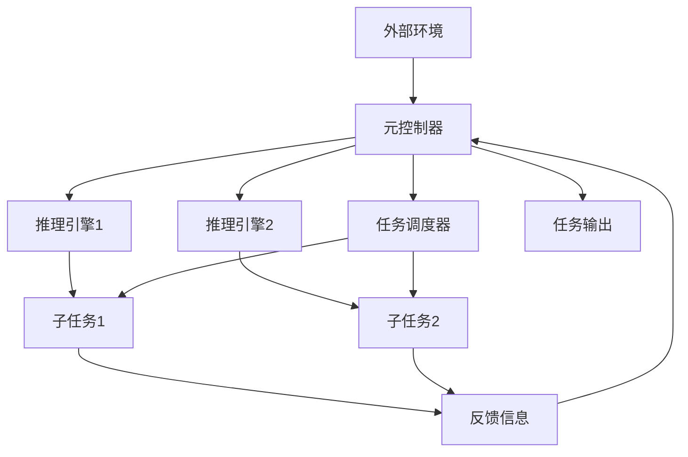

# 元控制器在复杂推理任务协调中的应用

> 关键词：元控制器、复杂推理任务、任务协调、人工智能、认知架构

> 摘要：本文深入探讨了元控制器在复杂推理任务协调中的应用。首先介绍了相关背景知识，包括目的、预期读者、文档结构和术语表。接着阐述了元控制器及复杂推理任务的核心概念与联系，并给出了原理和架构的文本示意图与Mermaid流程图。详细讲解了核心算法原理及具体操作步骤，通过Python源代码进行说明。分析了相关数学模型和公式，并举例说明。通过项目实战展示了代码实际案例及详细解释。探讨了实际应用场景，推荐了相关工具和资源，包括学习资源、开发工具框架和论文著作。最后总结了未来发展趋势与挑战，提供了常见问题解答和扩展阅读参考资料。

## 1. 背景介绍 
### 1.1 目的和范围
在当今复杂的人工智能和计算机科学领域，处理复杂推理任务变得越来越重要。复杂推理任务通常涉及多个子任务的协同工作，需要高效的协调机制来确保任务的顺利完成。元控制器作为一种高级的控制机制，能够对推理过程进行监督和管理，从而提高复杂推理任务的执行效率和准确性。本文的目的是全面介绍元控制器在复杂推理任务协调中的应用，涵盖从核心概念到实际应用的各个方面。范围包括元控制器的原理、算法、数学模型、实际案例以及未来发展趋势等。

### 1.2 预期读者
本文预期读者包括人工智能研究人员、计算机科学家、软件工程师、对复杂推理任务和元控制器感兴趣的学生以及相关领域的从业者。无论您是初学者想要了解基本概念，还是专业人士希望深入研究元控制器在复杂推理任务中的应用细节，本文都将为您提供有价值的信息。

### 1.3 文档结构概述
本文将按照以下结构进行组织：首先介绍核心概念与联系，帮助读者建立对元控制器和复杂推理任务的基本理解；接着详细讲解核心算法原理和具体操作步骤，并给出Python源代码示例；然后分析相关的数学模型和公式，并通过举例进行说明；之后通过项目实战展示元控制器在实际中的应用，包括开发环境搭建、源代码实现和代码解读；探讨元控制器在不同实际场景中的应用；推荐相关的工具和资源，包括学习资源、开发工具框架和论文著作；最后总结未来发展趋势与挑战，提供常见问题解答和扩展阅读参考资料。

### 1.4 术语表
#### 1.4.1 核心术语定义
- **元控制器**：一种高级控制机制，用于监督和管理其他控制器或推理过程，能够根据任务的状态和目标进行决策，以优化任务的执行。
- **复杂推理任务**：需要多个步骤、多个子任务协同完成的推理任务，通常涉及复杂的逻辑、知识和计算。
- **任务协调**：确保多个子任务按照一定的顺序和规则协同工作，以实现整体任务目标的过程。
- **认知架构**：一种描述人类或人工智能系统认知过程的模型，元控制器可以作为认知架构的一部分来实现复杂推理任务的协调。

#### 1.4.2 相关概念解释
- **推理引擎**：用于执行推理任务的程序或系统，根据给定的知识和规则进行推理，得出结论。
- **任务调度**：确定子任务的执行顺序和时间安排，以提高任务执行效率。
- **反馈机制**：元控制器通过反馈机制获取任务执行的状态信息，以便及时调整控制策略。

#### 1.4.3 缩略词列表
- **AI**：Artificial Intelligence，人工智能
- **ML**：Machine Learning，机器学习
- **RL**：Reinforcement Learning，强化学习

## 2. 核心概念与联系 
### 核心概念原理
元控制器的核心原理是基于对复杂推理任务的抽象和分层控制。它将复杂推理任务分解为多个子任务，并通过对这些子任务的监督和管理来实现任务的协调。元控制器可以根据任务的当前状态、目标和可用资源，动态地选择合适的子任务进行执行，并调整子任务的执行顺序和参数。

复杂推理任务通常具有以下特点：
- **多步骤性**：需要多个步骤才能完成，每个步骤可能涉及不同的推理方法和知识。
- **不确定性**：任务中可能存在不确定性因素，如不完全信息、噪声数据等，需要元控制器进行处理。
- **资源约束**：任务的执行可能受到资源的限制，如时间、计算能力等，元控制器需要在资源约束下优化任务执行。

### 架构的文本示意图
元控制器在复杂推理任务协调中的架构可以描述如下：

元控制器作为高层控制模块，与多个推理引擎和任务调度器进行交互。推理引擎负责执行具体的推理任务，根据输入的知识和规则进行推理。任务调度器根据元控制器的指令，安排子任务的执行顺序和时间。元控制器通过反馈机制获取推理引擎和任务调度器的状态信息，以便及时调整控制策略。同时，元控制器还可以与外部环境进行交互，获取任务的输入和输出信息。

### Mermaid流程图


该流程图展示了元控制器与推理引擎、任务调度器之间的交互关系，以及反馈机制和与外部环境的交互。元控制器根据外部环境的输入信息，向推理引擎和任务调度器发送指令，推理引擎执行子任务，任务调度器安排子任务的执行顺序。子任务执行的结果通过反馈机制返回给元控制器，元控制器根据反馈信息调整控制策略。最终，元控制器将任务的输出发送给外部环境。

## 3. 核心算法原理 & 具体操作步骤 
### 核心算法原理
元控制器的核心算法可以基于强化学习、规则引擎或其他控制理论。这里我们以强化学习为例进行说明。强化学习是一种通过与环境进行交互来学习最优策略的方法，元控制器可以将复杂推理任务看作一个强化学习问题，通过不断地尝试和学习，找到最优的任务协调策略。

在强化学习中，元控制器被看作一个智能体，它与环境进行交互，环境包括推理引擎、任务调度器和外部环境。智能体在每个时间步根据当前的状态选择一个动作，环境根据动作返回一个奖励和下一个状态。智能体的目标是最大化累积奖励，通过不断地学习和调整策略，找到最优的动作序列。

### 具体操作步骤
以下是元控制器基于强化学习的具体操作步骤：

1. **定义状态空间**：状态空间包括推理任务的当前状态、子任务的执行情况、可用资源等信息。例如，状态可以表示为一个向量，其中每个元素表示一个特定的状态变量。
2. **定义动作空间**：动作空间包括元控制器可以采取的所有可能动作，如选择执行哪个子任务、调整子任务的执行参数等。
3. **定义奖励函数**：奖励函数用于评估智能体的动作对任务执行的影响。奖励可以根据任务的完成情况、执行效率、资源利用率等因素进行设计。例如，如果一个子任务成功完成，可以给予正奖励；如果任务执行超时或消耗过多资源，可以给予负奖励。
4. **初始化策略**：策略是智能体根据当前状态选择动作的规则。可以使用随机策略作为初始策略。
5. **与环境进行交互**：智能体在每个时间步根据当前状态选择一个动作，并将动作发送给环境。环境根据动作返回一个奖励和下一个状态。
6. **更新策略**：根据奖励和下一个状态，使用强化学习算法更新策略，以提高累积奖励。常用的强化学习算法包括Q学习、策略梯度算法等。
7. **重复步骤5和6**：不断地与环境进行交互和更新策略，直到达到收敛条件或完成任务。

### Python源代码示例
```python
import numpy as np

# 定义状态空间和动作空间
state_space_size = 10
action_space_size = 5

# 初始化Q表
q_table = np.zeros((state_space_size, action_space_size))

# 定义超参数
learning_rate = 0.1
discount_rate = 0.9
exploration_rate = 1.0
max_exploration_rate = 1.0
min_exploration_rate = 0.01
exploration_decay_rate = 0.001

# 定义环境交互函数
def interact_with_environment(state, action):
    # 模拟环境返回奖励和下一个状态
    reward = np.random.randint(-1, 2)
    next_state = np.random.randint(0, state_space_size)
    return reward, next_state

# 强化学习训练过程
num_episodes = 1000
for episode in range(num_episodes):
    state = np.random.randint(0, state_space_size)
    done = False
    while not done:
        # 选择动作
        if np.random.uniform(0, 1) < exploration_rate:
            action = np.random.randint(0, action_space_size)
        else:
            action = np.argmax(q_table[state, :])
        
        # 与环境交互
        reward, next_state = interact_with_environment(state, action)
        
        # 更新Q表
        q_table[state, action] = q_table[state, action] + learning_rate * (reward + discount_rate * np.max(q_table[next_state, :]) - q_table[state, action])
        
        state = next_state
        
        # 检查是否完成任务
        if np.random.uniform(0, 1) < 0.1:
            done = True
    
    # 衰减探索率
    exploration_rate = min_exploration_rate + (max_exploration_rate - min_exploration_rate) * np.exp(-exploration_decay_rate * episode)

# 输出最终的Q表
print("Final Q-table:")
print(q_table)
```

在这个示例中，我们使用Q学习算法来训练元控制器。首先定义了状态空间和动作空间的大小，并初始化了Q表。然后设置了超参数，包括学习率、折扣率、探索率等。在训练过程中，智能体根据当前状态选择动作，并与环境进行交互，根据奖励和下一个状态更新Q表。最后，输出最终的Q表。

## 4. 数学模型和公式 & 详细讲解 & 举例说明 
### 数学模型和公式
在强化学习中，元控制器的学习过程可以用马尔可夫决策过程（MDP）来描述。MDP是一个五元组 $(S, A, P, R, \gamma)$，其中：
- $S$ 是状态空间，表示所有可能的状态集合。
- $A$ 是动作空间，表示所有可能的动作集合。
- $P(s'|s, a)$ 是状态转移概率，表示在状态 $s$ 下采取动作 $a$ 后转移到状态 $s'$ 的概率。
- $R(s, a, s')$ 是奖励函数，表示在状态 $s$ 下采取动作 $a$ 转移到状态 $s'$ 时获得的奖励。
- $\gamma$ 是折扣率，用于权衡当前奖励和未来奖励的重要性。

智能体的目标是找到一个最优策略 $\pi^*: S \to A$，使得累积折扣奖励最大化：
$$
V^{\pi^*}(s) = \max_{\pi} \mathbb{E}\left[\sum_{t=0}^{\infty} \gamma^t R(s_t, a_t, s_{t+1}) | s_0 = s, \pi\right]
$$
其中 $V^{\pi^*}(s)$ 是状态 $s$ 下的最优值函数，表示从状态 $s$ 开始按照最优策略 $\pi^*$ 执行所能获得的最大累积折扣奖励。

Q学习算法是一种基于值函数的强化学习算法，它通过学习Q值函数 $Q(s, a)$ 来近似最优策略。Q值函数表示在状态 $s$ 下采取动作 $a$ 所能获得的最大累积折扣奖励。Q学习算法的更新公式如下：
$$
Q(s, a) \leftarrow Q(s, a) + \alpha \left[R(s, a, s') + \gamma \max_{a'} Q(s', a') - Q(s, a)\right]
$$
其中 $\alpha$ 是学习率，用于控制每次更新的步长。

### 详细讲解
马尔可夫决策过程的核心思想是将复杂的决策问题分解为一系列的状态转移和奖励获取过程。在每个时间步，智能体根据当前状态选择一个动作，环境根据动作返回一个奖励和下一个状态。智能体的目标是通过不断地尝试和学习，找到一个最优策略，使得累积折扣奖励最大化。

Q学习算法通过迭代更新Q值函数来近似最优策略。在每次更新中，Q值函数根据当前的奖励和下一个状态的最大Q值进行调整。学习率 $\alpha$ 控制了每次更新的步长，折扣率 $\gamma$ 权衡了当前奖励和未来奖励的重要性。

### 举例说明
假设我们有一个简单的推理任务，状态空间 $S = \{s_1, s_2, s_3\}$，动作空间 $A = \{a_1, a_2\}$。状态转移概率和奖励函数如下：

| $s$ | $a$ | $s'$ | $P(s'|s, a)$ | $R(s, a, s')$ |
| --- | --- | --- | --- | --- |
| $s_1$ | $a_1$ | $s_2$ | 0.8 | 1 |
| $s_1$ | $a_1$ | $s_3$ | 0.2 | -1 |
| $s_1$ | $a_2$ | $s_2$ | 0.3 | 2 |
| $s_1$ | $a_2$ | $s_3$ | 0.7 | -2 |
| $s_2$ | $a_1$ | $s_1$ | 0.6 | -1 |
| $s_2$ | $a_1$ | $s_3$ | 0.4 | 1 |
| $s_2$ | $a_2$ | $s_1$ | 0.2 | -2 |
| $s_2$ | $a_2$ | $s_3$ | 0.8 | 2 |
| $s_3$ | $a_1$ | $s_1$ | 0.5 | 1 |
| $s_3$ | $a_1$ | $s_2$ | 0.5 | -1 |
| $s_3$ | $a_2$ | $s_1$ | 0.4 | 2 |
| $s_3$ | $a_2$ | $s_2$ | 0.6 | -2 |

假设初始状态为 $s_1$，学习率 $\alpha = 0.1$，折扣率 $\gamma = 0.9$。我们使用Q学习算法进行训练，初始Q表为：

| $s$ | $a_1$ | $a_2$ |
| --- | --- | --- |
| $s_1$ | 0 | 0 |
| $s_2$ | 0 | 0 |
| $s_3$ | 0 | 0 |

假设在第一次迭代中，智能体在状态 $s_1$ 下选择动作 $a_1$，并转移到状态 $s_2$，获得奖励 $R(s_1, a_1, s_2) = 1$。根据Q学习算法的更新公式，我们可以更新Q值：

$$
Q(s_1, a_1) \leftarrow Q(s_1, a_1) + \alpha \left[R(s_1, a_1, s_2) + \gamma \max_{a'} Q(s_2, a') - Q(s_1, a_1)\right]
$$

由于初始时 $Q(s_2, a_1) = Q(s_2, a_2) = 0$，所以：

$$
Q(s_1, a_1) \leftarrow 0 + 0.1 \times (1 + 0.9 \times 0 - 0) = 0.1
$$

更新后的Q表为：

| $s$ | $a_1$ | $a_2$ |
| --- | --- | --- |
| $s_1$ | 0.1 | 0 |
| $s_2$ | 0 | 0 |
| $s_3$ | 0 | 0 |

通过不断地迭代更新，Q表将逐渐收敛到最优Q值，从而得到最优策略。

## 5. 项目实战：代码实际案例和详细解释说明 
### 5.1  开发环境搭建
为了实现元控制器在复杂推理任务协调中的应用，我们可以使用Python作为开发语言，并使用一些常用的机器学习和深度学习库。以下是开发环境的搭建步骤：

1. **安装Python**：建议使用Python 3.6及以上版本。可以从Python官方网站（https://www.python.org/downloads/）下载并安装。
2. **安装必要的库**：使用pip命令安装以下库：
    - `numpy`：用于数值计算。
    - `pandas`：用于数据处理。
    - `tensorflow` 或 `pytorch`：用于深度学习模型的构建和训练。
    - `gym`：用于创建和管理强化学习环境。

示例安装命令：
```sh
pip install numpy pandas tensorflow gym
```

### 5.2  源代码详细实现和代码解读
以下是一个简单的项目实战示例，使用强化学习实现元控制器在复杂推理任务协调中的应用。假设我们有一个简单的推理任务，需要在不同的状态下选择合适的动作来完成任务。

```python
import gym
import numpy as np

# 创建一个自定义的强化学习环境
class SimpleReasoningEnv(gym.Env):
    def __init__(self):
        self.state_space_size = 5
        self.action_space_size = 3
        self.state = np.random.randint(0, self.state_space_size)
        self.reward_range = (-1, 1)
        self.action_space = gym.spaces.Discrete(self.action_space_size)
        self.observation_space = gym.spaces.Discrete(self.state_space_size)

    def step(self, action):
        # 模拟状态转移和奖励获取
        if action == 0:
            next_state = (self.state + 1) % self.state_space_size
            reward = 1 if next_state == 0 else -1
        elif action == 1:
            next_state = (self.state - 1) % self.state_space_size
            reward = 1 if next_state == 0 else -1
        else:
            next_state = self.state
            reward = 0
        
        done = next_state == 0
        info = {}
        self.state = next_state
        return next_state, reward, done, info

    def reset(self):
        self.state = np.random.randint(0, self.state_space_size)
        return self.state

    def render(self, mode='human'):
        print(f"Current state: {self.state}")

# 定义Q学习算法
class QLearningAgent:
    def __init__(self, state_space_size, action_space_size, learning_rate=0.1, discount_rate=0.9, exploration_rate=1.0, max_exploration_rate=1.0, min_exploration_rate=0.01, exploration_decay_rate=0.001):
        self.state_space_size = state_space_size
        self.action_space_size = action_space_size
        self.learning_rate = learning_rate
        self.discount_rate = discount_rate
        self.exploration_rate = exploration_rate
        self.max_exploration_rate = max_exploration_rate
        self.min_exploration_rate = min_exploration_rate
        self.exploration_decay_rate = exploration_decay_rate
        self.q_table = np.zeros((state_space_size, action_space_size))

    def choose_action(self, state):
        if np.random.uniform(0, 1) < self.exploration_rate:
            action = np.random.randint(0, self.action_space_size)
        else:
            action = np.argmax(self.q_table[state, :])
        return action

    def update_q_table(self, state, action, reward, next_state):
        self.q_table[state, action] = self.q_table[state, action] + self.learning_rate * (reward + self.discount_rate * np.max(self.q_table[next_state, :]) - self.q_table[state, action])

    def decay_exploration_rate(self, episode):
        self.exploration_rate = self.min_exploration_rate + (self.max_exploration_rate - self.min_exploration_rate) * np.exp(-self.exploration_decay_rate * episode)

# 训练过程
env = SimpleReasoningEnv()
agent = QLearningAgent(env.state_space_size, env.action_space_size)

num_episodes = 1000
for episode in range(num_episodes):
    state = env.reset()
    done = False
    while not done:
        action = agent.choose_action(state)
        next_state, reward, done, info = env.step(action)
        agent.update_q_table(state, action, reward, next_state)
        state = next_state
    agent.decay_exploration_rate(episode)

# 测试过程
state = env.reset()
done = False
while not done:
    action = agent.choose_action(state)
    next_state, reward, done, info = env.step(action)
    env.render()
    state = next_state

```

### 代码解读与分析
#### 自定义环境 `SimpleReasoningEnv`
- `__init__` 方法：初始化环境的状态空间、动作空间、初始状态等参数。
- `step` 方法：根据输入的动作模拟状态转移和奖励获取，返回下一个状态、奖励、是否完成任务等信息。
- `reset` 方法：重置环境的状态，返回初始状态。
- `render` 方法：显示当前环境的状态。

#### Q学习代理 `QLearningAgent`
- `__init__` 方法：初始化Q表、学习率、折扣率、探索率等参数。
- `choose_action` 方法：根据当前状态选择动作，使用探索率进行探索和利用的平衡。
- `update_q_table` 方法：根据Q学习算法的更新公式更新Q表。
- `decay_exploration_rate` 方法：随着训练的进行，逐渐衰减探索率。

#### 训练和测试过程
- 训练过程：在多个回合中，智能体与环境进行交互，不断更新Q表。
- 测试过程：使用训练好的Q表，智能体在环境中进行测试，观察其表现。

通过这个项目实战，我们可以看到如何使用强化学习实现元控制器在复杂推理任务协调中的应用。

## 6. 实际应用场景 
### 智能客服系统
在智能客服系统中，用户的问题往往具有多样性和复杂性，需要进行复杂的推理才能给出准确的回答。元控制器可以协调多个推理引擎，如语义理解引擎、知识检索引擎和答案生成引擎等。例如，当用户提出一个问题时，元控制器首先根据问题的特征选择合适的语义理解引擎进行处理，然后根据语义理解的结果选择知识检索引擎查找相关知识，最后根据检索到的知识选择答案生成引擎生成回答。同时，元控制器可以根据用户的反馈和历史交互记录，不断调整推理策略，提高回答的准确性和效率。

### 自动驾驶系统
自动驾驶系统需要处理大量的传感器数据和复杂的交通场景，进行实时的决策和控制。元控制器可以协调多个推理模块，如目标检测模块、路径规划模块和决策控制模块等。例如，在行驶过程中，元控制器根据传感器数据判断当前的交通状况，选择合适的目标检测算法进行目标检测；根据检测到的目标信息，选择路径规划算法规划行驶路径；根据路径规划结果，选择决策控制算法控制车辆的行驶速度和方向。元控制器还可以根据车辆的状态和环境的变化，动态调整推理策略，确保行驶的安全和高效。

### 医疗诊断系统
医疗诊断系统需要对患者的症状、检查结果等信息进行综合分析，进行准确的诊断和治疗建议。元控制器可以协调多个推理模型，如疾病预测模型、治疗推荐模型和风险评估模型等。例如，当医生输入患者的信息时，元控制器首先根据信息的类型选择合适的疾病预测模型进行疾病预测；根据预测结果，选择治疗推荐模型推荐合适的治疗方案；同时，使用风险评估模型评估治疗方案的风险。元控制器可以根据患者的反馈和治疗效果，不断优化推理策略，提高诊断的准确性和治疗的有效性。

### 工业自动化系统
在工业自动化系统中，需要对生产过程进行实时监控和控制，确保生产的高效和稳定。元控制器可以协调多个推理模块，如故障诊断模块、生产调度模块和质量控制模块等。例如，在生产过程中，元控制器根据传感器数据监测设备的运行状态，选择合适的故障诊断算法进行故障诊断；根据故障诊断结果，选择生产调度算法调整生产计划；同时，使用质量控制算法对产品质量进行实时监测和控制。元控制器可以根据生产环境的变化和生产需求的调整，动态调整推理策略，提高生产效率和产品质量。

## 7. 工具和资源推荐
### 7.1 学习资源推荐
#### 7.1.1 书籍推荐
- 《强化学习：原理与Python实现》：这本书详细介绍了强化学习的基本原理和算法，并通过Python代码实现了多个实例，适合初学者入门。
- 《人工智能：一种现代的方法》：这是一本经典的人工智能教材，涵盖了人工智能的各个领域，包括搜索、推理、学习等，对元控制器和复杂推理任务的理解有很大帮助。
- 《深度学习》：这本书由深度学习领域的三位先驱撰写，详细介绍了深度学习的基本原理、模型和算法，对于理解基于深度学习的元控制器有重要参考价值。

#### 7.1.2 在线课程
- Coursera上的“强化学习专项课程”：由多伦多大学的教授授课，系统地介绍了强化学习的理论和实践，包括马尔可夫决策过程、Q学习、策略梯度算法等。
- edX上的“人工智能基础”：这门课程涵盖了人工智能的基本概念、算法和应用，对元控制器和复杂推理任务的相关知识有一定的涉及。
- 吴恩达的“深度学习专项课程”：在Coursera上提供，深入介绍了深度学习的各个方面，包括神经网络、卷积神经网络、循环神经网络等，对于理解基于深度学习的元控制器有很大帮助。

#### 7.1.3 技术博客和网站
- OpenAI博客：OpenAI是人工智能领域的领先研究机构，其博客上发布了许多关于强化学习、人工智能等方面的最新研究成果和技术文章。
- Medium上的人工智能相关专栏：Medium上有许多人工智能领域的专家和爱好者分享他们的经验和见解，其中不乏关于元控制器和复杂推理任务的文章。
- arXiv：这是一个预印本服务器，提供了大量的学术论文，包括人工智能、机器学习等领域的最新研究成果。

### 7.2 开发工具框架推荐
#### 7.2.1 IDE和编辑器
- PyCharm：这是一款专门为Python开发设计的集成开发环境，提供了丰富的功能，如代码编辑、调试、版本控制等，适合开发基于Python的元控制器应用。
- Jupyter Notebook：这是一个交互式的开发环境，适合进行数据分析、模型训练和实验验证。可以使用Jupyter Notebook快速实现和测试元控制器的算法。
- Visual Studio Code：这是一款轻量级的代码编辑器，支持多种编程语言和插件，具有丰富的扩展功能，适合快速开发和调试元控制器代码。

#### 7.2.2 调试和性能分析工具
- TensorBoard：这是TensorFlow提供的一个可视化工具，可以用于可视化模型的训练过程、损失函数的变化、模型的结构等，帮助开发者调试和优化模型。
- PyTorch Profiler：这是PyTorch提供的一个性能分析工具，可以用于分析模型的性能瓶颈、计算时间、内存使用等，帮助开发者优化模型的性能。
- cProfile：这是Python标准库中的一个性能分析工具，可以用于分析Python代码的性能瓶颈，帮助开发者优化代码的执行效率。

#### 7.2.3 相关框架和库
- TensorFlow：这是一个开源的深度学习框架，提供了丰富的工具和库，用于构建和训练深度学习模型。可以使用TensorFlow实现基于深度学习的元控制器。
- PyTorch：这是另一个流行的深度学习框架，具有简洁易用的接口和高效的计算性能。可以使用PyTorch实现基于深度学习的元控制器。
- Gym：这是一个开源的强化学习环境库，提供了许多预定义的强化学习环境，方便开发者进行强化学习算法的开发和测试。可以使用Gym创建自定义的强化学习环境，用于训练元控制器。

### 7.3 相关论文著作推荐
#### 7.3.1 经典论文
- “Reinforcement Learning: An Introduction”：这是强化学习领域的经典著作，由Richard S. Sutton和Andrew G. Barto撰写，系统地介绍了强化学习的基本原理和算法。
- “Playing Atari with Deep Reinforcement Learning”：这篇论文提出了深度Q网络（DQN）算法，将深度学习和强化学习相结合，在Atari游戏中取得了很好的效果。
- “Asynchronous Methods for Deep Reinforcement Learning”：这篇论文提出了异步优势演员-评论家（A3C）算法，提高了强化学习算法的训练效率和稳定性。

#### 7.3.2 最新研究成果
- 在NeurIPS、ICML、AAAI等顶级人工智能会议上发表的关于元控制器和复杂推理任务的论文，这些论文代表了该领域的最新研究成果。
- 在《Journal of Artificial Intelligence Research》、《Artificial Intelligence》等顶级人工智能期刊上发表的相关论文。

#### 7.3.3 应用案例分析
- 一些实际应用案例的研究论文，如智能客服系统、自动驾驶系统、医疗诊断系统等领域中使用元控制器进行复杂推理任务协调的案例分析。这些论文可以帮助我们了解元控制器在实际应用中的具体实现和效果。

## 8. 总结：未来发展趋势与挑战
### 未来发展趋势
#### 与深度学习的深度融合
随着深度学习技术的不断发展，元控制器将与深度学习进行更深度的融合。例如，使用深度学习模型来学习元控制器的策略，提高元控制器的决策能力和适应性。同时，将深度学习模型作为推理引擎，元控制器可以更好地协调多个深度学习模型的工作，处理更复杂的推理任务。

#### 多智能体协同
在未来的应用场景中，可能会存在多个元控制器或智能体协同工作的情况。例如，在自动驾驶系统中，多辆自动驾驶车辆之间需要进行协同决策和控制。元控制器需要具备多智能体协同的能力，通过通信和协作，实现更高效的任务协调和决策。

#### 可解释性和安全性
随着人工智能技术在越来越多的关键领域的应用，元控制器的可解释性和安全性变得越来越重要。未来的研究将致力于提高元控制器的可解释性，使人们能够理解元控制器的决策过程和依据。同时，加强元控制器的安全性研究，防止恶意攻击和故障导致的系统崩溃。

#### 应用领域的拓展
元控制器在复杂推理任务协调中的应用将不断拓展到更多的领域，如金融、教育、娱乐等。例如，在金融领域，元控制器可以协调多个金融模型进行风险评估和投资决策；在教育领域，元控制器可以根据学生的学习情况和需求，协调多个教学资源进行个性化教学。

### 挑战
#### 计算资源的限制
元控制器在处理复杂推理任务时，通常需要大量的计算资源。例如，在基于深度学习的元控制器中，训练和推理过程需要强大的计算能力和内存支持。如何在有限的计算资源下实现高效的元控制器是一个挑战。

#### 数据的质量和可用性
元控制器的性能很大程度上依赖于数据的质量和可用性。在实际应用中，数据可能存在噪声、缺失值等问题，影响元控制器的决策准确性。同时，获取高质量的数据可能需要大量的时间和成本。如何处理数据质量和可用性问题是一个挑战。

#### 任务的复杂性和不确定性
复杂推理任务通常具有很高的复杂性和不确定性，元控制器需要能够处理各种复杂的情况和不确定性因素。例如，在自动驾驶系统中，交通场景的变化是复杂和不确定的，元控制器需要能够及时做出准确的决策。如何提高元控制器在复杂和不确定环境下的性能是一个挑战。

#### 伦理和法律问题
随着元控制器在越来越多的关键领域的应用，伦理和法律问题也变得越来越重要。例如，在医疗诊断系统中，元控制器的决策可能会影响患者的生命健康，需要考虑伦理和法律责任。如何解决元控制器应用中的伦理和法律问题是一个挑战。

## 9. 附录：常见问题与解答
### 什么是元控制器？
元控制器是一种高级控制机制，用于监督和管理其他控制器或推理过程。它可以根据任务的状态和目标进行决策，以优化任务的执行。元控制器通常用于处理复杂推理任务，协调多个子任务的执行。

### 元控制器与普通控制器有什么区别？
普通控制器通常负责执行具体的控制任务，根据预设的规则或算法进行决策。而元控制器则是对其他控制器或推理过程进行更高层次的管理和协调。元控制器可以根据任务的整体情况和目标，动态地调整控制策略，选择合适的子任务进行执行。

### 元控制器在复杂推理任务协调中有什么优势？
元控制器在复杂推理任务协调中有以下优势：
- **提高任务执行效率**：元控制器可以根据任务的状态和目标，动态地选择合适的子任务进行执行，避免不必要的计算和资源浪费，从而提高任务执行效率。
- **增强适应性**：元控制器可以根据任务的变化和环境的不确定性，及时调整控制策略，增强系统的适应性。
- **优化决策**：元控制器可以综合考虑多个因素，如任务的优先级、资源的可用性等，做出更优化的决策。

### 如何实现一个元控制器？
实现一个元控制器可以采用多种方法，如基于规则的方法、基于机器学习的方法等。基于机器学习的方法中，强化学习是一种常用的方法。具体实现步骤包括定义状态空间、动作空间和奖励函数，初始化策略，与环境进行交互，更新策略等。

### 元控制器在实际应用中面临哪些挑战？
元控制器在实际应用中面临以下挑战：
- **计算资源的限制**：处理复杂推理任务需要大量的计算资源，如何在有限的计算资源下实现高效的元控制器是一个挑战。
- **数据的质量和可用性**：元控制器的性能依赖于数据的质量和可用性，如何处理数据质量和可用性问题是一个挑战。
- **任务的复杂性和不确定性**：复杂推理任务通常具有很高的复杂性和不确定性，如何提高元控制器在复杂和不确定环境下的性能是一个挑战。
- **伦理和法律问题**：随着元控制器在关键领域的应用，伦理和法律问题变得越来越重要，如何解决这些问题是一个挑战。

## 10. 扩展阅读 & 参考资料
### 扩展阅读
- 《认知科学与人工智能》：这本书介绍了认知科学和人工智能的基本概念和方法，对于理解元控制器的认知基础有很大帮助。
- 《复杂系统理论与应用》：这本书介绍了复杂系统的基本理论和方法，对于理解复杂推理任务的本质和元控制器的作用有一定的参考价值。
- 《智能决策与控制》：这本书介绍了智能决策和控制的基本理论和方法，对于深入研究元控制器的决策和控制机制有很大帮助。

### 参考资料
- Sutton, R. S., & Barto, A. G. (2018). Reinforcement learning: An introduction. MIT press.
- Mnih, V., Kavukcuoglu, K., Silver, D., Rusu, A. A., Veness, J., Bellemare, M. G.,... & Petersen, S. (2015). Human-level control through deep reinforcement learning. Nature, 518(7540), 529-533.
- Mnih, V., Badia, A. P., Mirza, M., Graves, A., Lillicrap, T., Harley, T.,... & Kavukcuoglu, K. (2016). Asynchronous methods for deep reinforcement learning. In International conference on machine learning (pp. 1928-1937).

作者：AI天才研究院/AI Genius Institute & 禅与计算机程序设计艺术 /Zen And The Art of Computer Programming