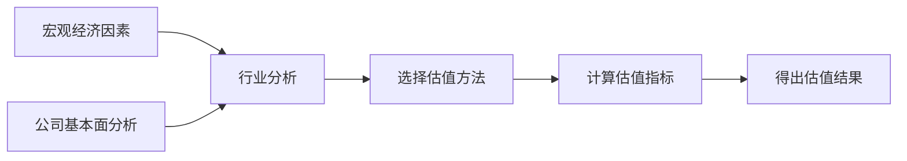

# 全球股市估值与人工智能伦理标准的关联

> 关键词：全球股市估值、人工智能伦理标准、关联分析、市场影响、技术发展

> 摘要：本文深入探讨了全球股市估值与人工智能伦理标准之间的关联。首先介绍了研究的背景、目的、预期读者等基本信息，接着阐述了全球股市估值和人工智能伦理标准的核心概念及联系，详细讲解了相关的核心算法原理和操作步骤，通过数学模型和公式进行了理论分析，并结合实际案例进行说明。在项目实战部分，展示了如何在实际场景中应用相关知识。同时，探讨了其实际应用场景，推荐了相关的学习资源、开发工具框架和论文著作。最后总结了未来发展趋势与挑战，并对常见问题进行了解答，提供了扩展阅读和参考资料。旨在帮助读者全面理解两者之间的关系，为投资者、研究者和从业者提供有价值的参考。

## 1. 背景介绍 
### 1.1 目的和范围
随着人工智能技术在金融领域的广泛应用，其对全球股市的影响日益显著。同时，人工智能伦理标准的重要性也逐渐凸显，因为不恰当的人工智能应用可能会引发各种风险和问题。本研究的目的在于深入分析全球股市估值与人工智能伦理标准之间的关联，明确这种关联在金融市场中的具体表现和影响机制。研究范围涵盖了全球主要股票市场，以及人工智能在金融投资决策、风险评估、市场预测等方面的应用所涉及的伦理问题。

### 1.2 预期读者
本文预期读者包括金融投资者、金融分析师、人工智能研究人员、监管机构工作人员以及对金融市场和人工智能技术感兴趣的学者和爱好者。对于投资者来说，了解两者之间的关联有助于做出更明智的投资决策；金融分析师可以利用研究结果更好地评估市场趋势；人工智能研究人员能从中获取关于在金融领域应用时应遵循的伦理方向；监管机构工作人员可据此制定更合理的监管政策；而学者和爱好者则能拓宽对这一新兴交叉领域的认知。

### 1.3 文档结构概述
本文首先对相关的核心概念进行介绍，明确全球股市估值和人工智能伦理标准的定义和内涵，以及它们之间的联系。接着详细阐述核心算法原理和具体操作步骤，通过数学模型和公式对两者的关联进行量化分析，并举例说明。在项目实战部分，提供实际的代码案例和详细解释。然后探讨实际应用场景，为读者展示两者关联在现实中的具体体现。之后推荐相关的学习资源、开发工具框架和论文著作，方便读者进一步深入学习。最后总结未来发展趋势与挑战，解答常见问题，并提供扩展阅读和参考资料。

### 1.4 术语表
#### 1.4.1 核心术语定义
- **全球股市估值**：是指对全球各个股票市场上上市公司的价值进行评估的过程和结果。它反映了市场参与者对上市公司未来盈利能力、资产质量、行业前景等因素的综合判断，通常通过各种估值指标来衡量，如市盈率（P/E）、市净率（P/B）等。
- **人工智能伦理标准**：是指在人工智能技术的研发、应用和管理过程中，为确保其符合人类的价值观、道德规范和社会利益而制定的一系列准则和规范。这些标准涉及到公平性、透明度、隐私保护、责任归属等多个方面。

#### 1.4.2 相关概念解释
- **金融科技（Fintech）**：是金融和科技的融合，利用人工智能、大数据、区块链等新兴技术来创新金融服务和业务模式。在全球股市中，金融科技的应用可以提高交易效率、降低成本、改善风险评估等。
- **算法交易**：是指利用计算机程序和算法来自动执行交易决策的交易方式。在人工智能的支持下，算法交易可以根据市场数据和预设的规则进行快速、准确的交易操作。

#### 1.4.3 缩略词列表
- **P/E**：市盈率（Price-to-Earnings Ratio），是指股票价格与每股收益的比率，用于衡量股票的估值水平。
- **P/B**：市净率（Price-to-Book Ratio），是指股票价格与每股净资产的比率，反映了股票价格相对于公司净资产的倍数。

## 2. 核心概念与联系 
### 全球股市估值的原理和架构
全球股市估值是一个复杂的过程，涉及到多个因素和方法。其基本原理是基于对上市公司未来现金流的预期，通过一定的折现率将未来现金流折现到当前，从而得到公司的内在价值。常用的估值方法包括绝对估值法和相对估值法。

绝对估值法主要有现金流折现模型（DCF），其基本公式为：
$$V = \sum_{t=1}^{n} \frac{CF_t}{(1 + r)^t}$$
其中，$V$ 表示公司的内在价值，$CF_t$ 表示第 $t$ 期的现金流，$r$ 表示折现率，$n$ 表示预测期数。

相对估值法是通过比较同行业或类似公司的估值指标来评估目标公司的价值，常用的指标有市盈率（P/E）、市净率（P/B）等。

全球股市估值的架构可以用以下 Mermaid 流程图表示：


### 人工智能伦理标准的原理和架构
人工智能伦理标准的制定是为了确保人工智能技术的发展和应用符合人类的利益和价值观。其核心原理包括尊重人类尊严、保障公平公正、保护隐私安全、确保可解释性和责任可追溯等。

人工智能伦理标准的架构可以分为三个层次：原则层、准则层和操作层。原则层是最基本的伦理原则，如公平、透明、责任等；准则层是根据原则层制定的具体行为准则，如避免算法歧视、保护用户数据等；操作层是将准则层转化为具体的操作规范和技术措施，如数据脱敏、模型审计等。

人工智能伦理标准的架构可以用以下 Mermaid 流程图表示：


### 全球股市估值与人工智能伦理标准的联系
全球股市估值与人工智能伦理标准之间存在着密切的联系。一方面，人工智能技术在全球股市估值中的应用越来越广泛，如利用机器学习算法进行财务数据分析、市场趋势预测等。然而，如果人工智能系统不符合伦理标准，可能会导致错误的估值结果，从而影响投资者的决策和市场的稳定。例如，算法歧视可能会导致对某些公司的估值不准确，从而影响市场的公平性。

另一方面，全球股市的表现也会影响人工智能伦理标准的发展。当股市出现大幅波动或危机时，人们会更加关注人工智能在金融领域应用的伦理问题，从而推动相关伦理标准的制定和完善。例如，在金融危机后，人们对金融机构使用的人工智能算法的透明度和可解释性提出了更高的要求。

两者之间的联系可以用以下 Mermaid 流程图表示：


## 3. 核心算法原理 & 具体操作步骤 
### 基于机器学习的全球股市估值算法原理
在全球股市估值中，机器学习算法可以用于预测公司的未来业绩和股价走势。以支持向量机（SVM）为例，其基本原理是通过寻找一个最优的超平面，将不同类别的数据点分隔开来。在股市估值中，我们可以将公司的财务指标、市场指标等作为输入特征，将公司的估值水平（如高估值、中估值、低估值）作为输出类别。

以下是一个使用 Python 实现的简单 SVM 股市估值示例代码：
```python
import numpy as np
from sklearn import svm
from sklearn.model_selection import train_test_split
from sklearn.preprocessing import StandardScaler

# 生成示例数据
X = np.random.rand(100, 5)  # 100 个样本，每个样本有 5 个特征
y = np.random.randint(0, 3, 100)  # 随机生成 0、1、2 三个类别

# 划分训练集和测试集
X_train, X_test, y_train, y_test = train_test_split(X, y, test_size=0.2, random_state=42)

# 数据标准化
scaler = StandardScaler()
X_train = scaler.fit_transform(X_train)
X_test = scaler.transform(X_test)

# 创建 SVM 分类器
clf = svm.SVC(kernel='linear')

# 训练模型
clf.fit(X_train, y_train)

# 预测
y_pred = clf.predict(X_test)

# 评估模型
accuracy = np.mean(y_pred == y_test)
print(f"模型准确率: {accuracy}")
```

### 具体操作步骤
1. **数据收集**：收集全球股市中上市公司的财务数据、市场数据等相关信息。这些数据可以从金融数据库、证券交易所网站等渠道获取。
2. **数据预处理**：对收集到的数据进行清洗、转换和标准化处理。清洗数据包括去除缺失值、异常值等；转换数据可以将数据进行对数变换、差分变换等，以提高数据的稳定性；标准化处理可以将数据缩放到相同的尺度，便于机器学习算法的处理。
3. **特征选择**：从预处理后的数据中选择与股市估值相关的特征。可以使用相关性分析、特征重要性排序等方法来选择特征。
4. **模型训练**：选择合适的机器学习算法，如支持向量机、决策树、神经网络等，对训练数据进行训练。在训练过程中，需要调整模型的参数，以提高模型的性能。
5. **模型评估**：使用测试数据对训练好的模型进行评估，计算模型的准确率、召回率、F1 值等指标，评估模型的性能。
6. **模型应用**：将训练好的模型应用到实际的股市估值中，对上市公司的估值水平进行预测。

## 4. 数学模型和公式 & 详细讲解 & 举例说明 
### 全球股市估值的数学模型
如前文所述，现金流折现模型（DCF）是一种常用的绝对估值方法。其详细推导过程如下：

假设公司在未来 $n$ 期内的现金流分别为 $CF_1, CF_2, \cdots, CF_n$，折现率为 $r$。则公司的内在价值 $V$ 可以表示为：
$$V = \frac{CF_1}{(1 + r)^1} + \frac{CF_2}{(1 + r)^2} + \cdots + \frac{CF_n}{(1 + r)^n}$$

在实际应用中，由于未来现金流的预测存在不确定性，通常会采用两阶段或三阶段模型。例如，两阶段模型假设公司在第一阶段（通常为 5 - 10 年）具有较高的增长率，在第二阶段具有稳定的增长率。

### 人工智能伦理标准的量化模型
虽然人工智能伦理标准难以直接用数学公式进行量化，但可以通过一些指标来间接衡量。例如，公平性可以用基尼系数来衡量，透明度可以用模型的可解释性指标来衡量。

基尼系数是一种衡量收入分配公平程度的指标，也可以用于衡量人工智能算法的公平性。假设 $X$ 是一个包含 $n$ 个样本的数据集，$y$ 是样本的真实标签，$\hat{y}$ 是模型的预测标签。则基尼系数可以表示为：
$$G = \frac{1}{n^2 \bar{y}} \sum_{i=1}^{n} \sum_{j=1}^{n} |y_i - y_j|$$
其中，$\bar{y}$ 是样本标签的平均值。

### 举例说明
假设我们要对一家科技公司进行估值。通过分析公司的财务报表和市场前景，我们预测该公司在未来 5 年的现金流分别为 $100$ 万元、$120$ 万元、$140$ 万元、$160$ 万元和 $180$ 万元。假设折现率为 $10\%$，则该公司的内在价值为：
$$V = \frac{100}{(1 + 0.1)^1} + \frac{120}{(1 + 0.1)^2} + \frac{140}{(1 + 0.1)^3} + \frac{160}{(1 + 0.1)^4} + \frac{180}{(1 + 0.1)^5}$$
```python
import numpy as np

cash_flows = [100, 120, 140, 160, 180]
discount_rate = 0.1
years = np.arange(1, 6)

present_values = [cf / (1 + discount_rate) ** year for cf, year in zip(cash_flows, years)]
intrinsic_value = sum(present_values)

print(f"公司的内在价值: {intrinsic_value} 万元")
```

## 5. 项目实战：代码实际案例和详细解释说明 
### 5.1  开发环境搭建
为了实现全球股市估值与人工智能伦理标准相关的项目，我们需要搭建以下开发环境：
1. **操作系统**：推荐使用 Linux 或 macOS 系统，也可以使用 Windows 系统。
2. **Python 环境**：安装 Python 3.7 及以上版本。可以使用 Anaconda 来管理 Python 环境，它包含了许多常用的科学计算库。
3. **开发工具**：推荐使用 PyCharm 或 Jupyter Notebook 作为开发工具。PyCharm 是一个功能强大的 Python IDE，适合开发大型项目；Jupyter Notebook 则适合进行交互式数据分析和模型开发。
4. **相关库**：安装必要的 Python 库，如 Pandas、NumPy、Scikit-learn、TensorFlow 等。可以使用以下命令进行安装：
```bash
pip install pandas numpy scikit-learn tensorflow
```

### 5.2  源代码详细实现和代码解读
以下是一个完整的项目示例，用于使用机器学习算法进行全球股市估值，并考虑人工智能伦理标准中的公平性问题。

```python
import pandas as pd
import numpy as np
from sklearn.model_selection import train_test_split
from sklearn.preprocessing import StandardScaler
from sklearn.svm import SVC
from sklearn.metrics import accuracy_score
from aif360.datasets import BinaryLabelDataset
from aif360.metrics import BinaryLabelDatasetMetric
from aif360.algorithms.preprocessing import Reweighing

# 1. 数据加载和预处理
data = pd.read_csv('stock_data.csv')  # 假设数据文件名为 stock_data.csv
X = data.drop('valuation', axis=1)  # 特征
y = data['valuation']  # 标签

# 划分训练集和测试集
X_train, X_test, y_train, y_test = train_test_split(X, y, test_size=0.2, random_state=42)

# 数据标准化
scaler = StandardScaler()
X_train = scaler.fit_transform(X_train)
X_test = scaler.transform(X_test)

# 2. 考虑公平性问题
# 假设 'gender' 是一个敏感特征
privileged_groups = [{'gender': 1}]
unprivileged_groups = [{'gender': 0}]

# 创建 BinaryLabelDataset 对象
train_dataset = BinaryLabelDataset(df=pd.concat([pd.DataFrame(X_train, columns=X.columns), pd.Series(y_train, name='label')], axis=1),
                                   label_names=['label'],
                                   protected_attribute_names=['gender'],
                                   privileged_protected_attributes=privileged_groups[0]['gender'])

# 计算公平性指标
metric = BinaryLabelDatasetMetric(train_dataset,
                                  unprivileged_groups=unprivileged_groups,
                                  privileged_groups=privileged_groups)
print(f"原始数据的公平性指标（统计平等差异）: {metric.statistical_parity_difference()}")

# 进行重加权处理以提高公平性
RW = Reweighing(unprivileged_groups=unprivileged_groups,
                privileged_groups=privileged_groups)
train_dataset_transf = RW.fit_transform(train_dataset)

# 3. 模型训练和评估
# 创建 SVM 分类器
clf = SVC(kernel='linear')

# 使用重加权后的数据进行训练
clf.fit(train_dataset_transf.features, train_dataset_transf.labels.ravel())

# 预测
y_pred = clf.predict(X_test)

# 评估模型
accuracy = accuracy_score(y_test, y_pred)
print(f"模型准确率: {accuracy}")

# 计算处理后数据的公平性指标
test_dataset = BinaryLabelDataset(df=pd.concat([pd.DataFrame(X_test, columns=X.columns), pd.Series(y_test, name='label')], axis=1),
                                  label_names=['label'],
                                  protected_attribute_names=['gender'],
                                  privileged_protected_attributes=privileged_groups[0]['gender'])
test_dataset_pred = test_dataset.copy()
test_dataset_pred.labels = y_pred
metric_transf = BinaryLabelDatasetMetric(test_dataset_pred,
                                        unprivileged_groups=unprivileged_groups,
                                        privileged_groups=privileged_groups)
print(f"处理后数据的公平性指标（统计平等差异）: {metric_transf.statistical_parity_difference()}")
```

### 5.3  代码解读与分析
1. **数据加载和预处理**：首先使用 Pandas 库加载股市数据，并将特征和标签分离。然后使用 `train_test_split` 函数将数据划分为训练集和测试集，并使用 `StandardScaler` 对数据进行标准化处理。
2. **考虑公平性问题**：使用 `aif360` 库来处理人工智能伦理标准中的公平性问题。首先定义特权群体和非特权群体，然后创建 `BinaryLabelDataset` 对象。计算原始数据的公平性指标（统计平等差异），并使用 `Reweighing` 算法对数据进行重加权处理，以提高公平性。
3. **模型训练和评估**：使用重加权后的数据训练 SVM 分类器，并对测试集进行预测。计算模型的准确率和处理后数据的公平性指标，以评估模型的性能和公平性。

通过这个项目示例，我们可以看到如何在全球股市估值中考虑人工智能伦理标准，以及如何使用相关工具和算法来提高模型的公平性。

## 6. 实际应用场景 
### 投资决策
在投资决策中，全球股市估值是投资者判断股票是否具有投资价值的重要依据。而人工智能伦理标准的遵守可以确保估值结果的可靠性和公平性。例如，投资者可以使用基于人工智能算法的估值模型来筛选具有潜力的股票，但需要确保模型的训练数据没有偏差，避免算法歧视。同时，模型的可解释性也有助于投资者理解估值的依据，做出更明智的投资决策。

### 风险管理
金融机构在进行风险管理时，需要对股市的波动和风险进行准确评估。人工智能技术可以帮助金融机构建立更精确的风险模型，但伦理标准的遵循至关重要。例如，在使用人工智能算法进行风险评估时，需要确保算法不会对某些特定群体或行业产生不公平的风险评估结果，避免引发系统性风险。

### 监管合规
监管机构需要对金融市场进行监管，确保市场的公平、透明和稳定。全球股市估值和人工智能伦理标准都与监管合规密切相关。监管机构可以制定相关的估值标准和伦理规范，要求金融机构和投资者在进行股市估值和使用人工智能技术时遵守这些标准和规范。例如，要求金融机构公开其使用的人工智能算法的透明度和可解释性，以防止潜在的市场操纵和欺诈行为。

### 市场研究
市场研究机构可以利用全球股市估值和人工智能技术来分析市场趋势和行业动态。在研究过程中，遵循人工智能伦理标准可以保证研究结果的客观性和可信度。例如，在进行行业比较和市场预测时，确保使用的数据和算法没有偏差，避免误导投资者和市场参与者。

## 7. 工具和资源推荐
### 7.1 学习资源推荐
#### 7.1.1 书籍推荐
- 《金融市场与金融机构》：全面介绍了金融市场的基本概念、运行机制和金融机构的业务模式，为理解全球股市估值提供了基础。
- 《机器学习》：详细讲解了机器学习的基本算法和理论，是学习人工智能在金融领域应用的重要参考书籍。
- 《人工智能伦理》：深入探讨了人工智能伦理的相关问题和标准，帮助读者了解人工智能伦理的重要性和实践方法。

#### 7.1.2 在线课程
- Coursera 上的“机器学习”课程：由斯坦福大学教授 Andrew Ng 授课，是全球最受欢迎的机器学习课程之一，适合初学者入门。
- edX 上的“金融科技基础”课程：介绍了金融科技的基本概念和应用，包括人工智能在金融领域的应用，对理解全球股市估值与人工智能的关系有很大帮助。
- Udemy 上的“人工智能伦理与社会影响”课程：专门讲解人工智能伦理的相关知识和实践，帮助读者掌握人工智能伦理标准的制定和应用。

#### 7.1.3 技术博客和网站
- Towards Data Science：是一个专注于数据科学和机器学习的技术博客，上面有很多关于人工智能在金融领域应用的文章和案例。
- Medium：是一个综合性的写作平台，有很多专家和从业者分享关于全球股市估值和人工智能伦理的观点和经验。
- IEEE Xplore：是电气和电子工程师协会（IEEE）的数字图书馆，提供了大量关于人工智能、金融科技等领域的学术论文和研究报告。

### 7.2 开发工具框架推荐
#### 7.2.1 IDE和编辑器
- PyCharm：是一款专业的 Python IDE，具有强大的代码编辑、调试和项目管理功能，适合开发大型的 Python 项目。
- Jupyter Notebook：是一个交互式的开发环境，支持多种编程语言，特别适合进行数据分析和模型开发。
- Visual Studio Code：是一个轻量级的代码编辑器，具有丰富的插件和扩展功能，可以用于 Python 开发和数据处理。

#### 7.2.2 调试和性能分析工具
- PDB：是 Python 内置的调试器，可以帮助开发者定位和解决代码中的问题。
- TensorBoard：是 TensorFlow 提供的可视化工具，可以用于监控模型的训练过程和性能指标。
- Scalene：是一个高性能的 Python 性能分析器，可以帮助开发者找出代码中的性能瓶颈。

#### 7.2.3 相关框架和库
- Pandas：是一个用于数据处理和分析的 Python 库，提供了丰富的数据结构和函数，方便进行数据清洗、转换和分析。
- NumPy：是 Python 的一个基础科学计算库，提供了高效的多维数组对象和各种数学函数，是许多机器学习库的基础。
- Scikit-learn：是一个常用的机器学习库，提供了各种机器学习算法和工具，方便进行模型训练和评估。
- TensorFlow：是一个开源的深度学习框架，广泛应用于人工智能领域，提供了强大的模型构建和训练功能。
- AIF360：是一个用于人工智能公平性评估和处理的 Python 库，提供了各种公平性指标和算法，帮助开发者解决人工智能伦理中的公平性问题。

### 7.3 相关论文著作推荐
#### 7.3.1 经典论文
- "Machine Learning in Asset Pricing"：探讨了机器学习在资产定价中的应用，分析了机器学习算法在预测股票收益和风险方面的优势和局限性。
- "Ethics of Artificial Intelligence"：是一篇关于人工智能伦理的经典论文，提出了人工智能伦理的基本原则和框架，对后续的研究和实践产生了深远影响。
- "The Limits of Financial Modeling"：分析了金融建模的局限性，强调了在金融领域应用人工智能技术时需要注意的问题和挑战。

#### 7.3.2 最新研究成果
- "AI in Finance: Applications and Challenges"：总结了人工智能在金融领域的最新应用和面临的挑战，包括全球股市估值、风险管理等方面。
- "Fairness in Machine Learning: A Survey"：对机器学习中的公平性问题进行了全面的综述，介绍了各种公平性指标和算法，以及在不同领域的应用。
- "The Impact of AI on Global Stock Markets"：研究了人工智能技术对全球股市的影响，包括对市场效率、波动性和投资者行为的影响。

#### 7.3.3 应用案例分析
- "Case Studies in AI-Enabled Stock Valuation"：通过实际案例分析了人工智能在股票估值中的应用，展示了如何使用机器学习算法提高估值的准确性和效率。
- "Ethical Considerations in AI-Powered Financial Services"：结合实际案例探讨了人工智能在金融服务中的伦理问题，提出了相应的解决方案和建议。
- "How AI is Transforming Global Stock Trading"：介绍了人工智能在全球股票交易中的应用案例，包括算法交易、高频交易等，分析了其对市场结构和交易行为的影响。

## 8. 总结：未来发展趋势与挑战
### 未来发展趋势
1. **深度融合**：全球股市估值与人工智能伦理标准将更加深度融合。随着人工智能技术在金融领域的不断应用，投资者和监管机构将更加关注人工智能算法的伦理问题，确保其在股市估值中的应用符合公平、透明和责任等伦理原则。
2. **智能化决策**：人工智能将在全球股市估值中发挥越来越重要的作用，实现智能化决策。通过大数据分析和机器学习算法，能够更准确地预测股市走势和公司价值，为投资者提供更科学的决策依据。
3. **伦理标准国际化**：随着全球金融市场的一体化，人工智能伦理标准将逐渐走向国际化。各国监管机构和行业组织将加强合作，制定统一的人工智能伦理标准，以规范人工智能在全球股市估值中的应用。
4. **可解释性增强**：为了提高人工智能算法的可信度和接受度，未来的研究将更加注重算法的可解释性。在股市估值中，投资者需要了解算法的决策过程和依据，以便做出更明智的投资决策。

### 挑战
1. **数据隐私和安全**：在全球股市估值中使用人工智能技术需要大量的数据，这些数据涉及到公司的财务信息、投资者的个人信息等，数据隐私和安全问题成为了重要挑战。如何保护数据的隐私和安全，防止数据泄露和滥用，是亟待解决的问题。
2. **算法歧视和偏见**：人工智能算法可能会受到训练数据的影响，产生歧视和偏见。在股市估值中，如果算法对某些特定群体或行业存在歧视，可能会导致不公平的估值结果，影响市场的公平性和稳定性。
3. **伦理标准的制定和执行**：制定人工智能伦理标准是一个复杂的过程，需要考虑到技术、法律、社会等多个方面的因素。同时，如何确保这些伦理标准得到有效执行，也是一个挑战。监管机构需要建立有效的监督机制，对违反伦理标准的行为进行处罚。
4. **技术更新换代快**：人工智能技术发展迅速，新的算法和模型不断涌现。在全球股市估值中，如何及时跟上技术的发展步伐，采用最新的技术和方法，提高估值的准确性和效率，是投资者和金融机构面临的挑战。

## 9. 附录：常见问题与解答
### 问题 1：全球股市估值与人工智能伦理标准之间的关联是如何产生的？
答：随着人工智能技术在金融领域的广泛应用，其在全球股市估值中的作用越来越重要。然而，人工智能算法的不恰当应用可能会导致各种问题，如算法歧视、数据隐私泄露等，这些问题涉及到伦理层面。为了确保股市估值的公平、透明和可靠，需要制定相应的人工智能伦理标准，从而产生了两者之间的关联。

### 问题 2：如何衡量人工智能在全球股市估值中的伦理问题？
答：可以从多个方面衡量人工智能在全球股市估值中的伦理问题。例如，公平性可以用基尼系数、统计平等差异等指标来衡量；透明度可以通过模型的可解释性指标来评估；数据隐私可以通过数据保护措施的完善程度来判断。此外，还可以通过对算法的审计和评估，检查其是否存在歧视、偏见等问题。

### 问题 3：在全球股市估值中，如何确保人工智能算法符合伦理标准？
答：可以从以下几个方面确保人工智能算法符合伦理标准：
1. **数据质量**：确保训练数据的质量，避免数据中存在偏差和歧视。对数据进行清洗和预处理，去除异常值和错误数据。
2. **算法设计**：在算法设计阶段，考虑伦理因素，采用公平、透明的算法。例如，使用可解释性强的算法，避免使用过于复杂和难以理解的模型。
3. **模型评估**：在模型评估阶段，引入伦理指标进行评估，如公平性指标、透明度指标等。对不符合伦理标准的模型进行改进和优化。
4. **监管和审计**：建立监管机制，对人工智能算法在全球股市估值中的应用进行监督和审计。要求金融机构和投资者定期报告算法的使用情况和伦理评估结果。

### 问题 4：人工智能伦理标准的制定会对全球股市估值产生什么影响？
答：人工智能伦理标准的制定会对全球股市估值产生多方面的影响。一方面，合理的伦理标准可以提高股市估值的可靠性和公平性，增强投资者的信心，促进市场的稳定发展。例如，确保算法的公平性可以避免对某些公司的不公平估值，提高市场的效率。另一方面，过于严格的伦理标准可能会限制人工智能技术在股市估值中的应用，增加金融机构和投资者的合规成本，对市场的创新和发展产生一定的阻碍。

## 10. 扩展阅读 & 参考资料
### 扩展阅读
- 《金融科技前沿》：深入探讨了金融科技的最新发展趋势和应用案例，包括人工智能在金融领域的创新应用。
- 《数据驱动的金融决策》：介绍了如何利用数据和分析方法进行金融决策，对全球股市估值有一定的启示作用。
- 《人工智能时代的金融伦理》：专门研究了人工智能时代金融领域的伦理问题，为理解全球股市估值与人工智能伦理标准的关系提供了更深入的视角。

### 参考资料
1. 金融数据提供商：如 Bloomberg、Wind 等，提供了全球股市的实时数据和历史数据，是进行股市估值的重要数据来源。
2. 监管机构网站：如美国证券交易委员会（SEC）、中国证券监督管理委员会（CSRC）等，发布了金融市场的监管政策和法规，对理解全球股市估值和人工智能伦理标准的监管要求有重要参考价值。
3. 学术数据库：如 Google Scholar、Web of Science 等，提供了大量关于全球股市估值、人工智能伦理等领域的学术论文和研究报告。

作者：AI天才研究院/AI Genius Institute & 禅与计算机程序设计艺术 /Zen And The Art of Computer Programming