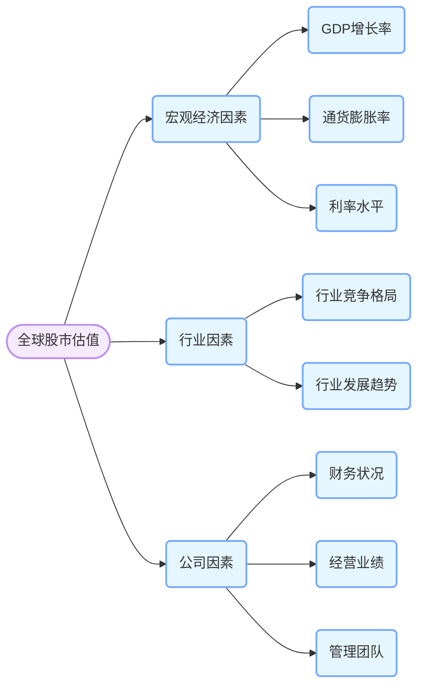
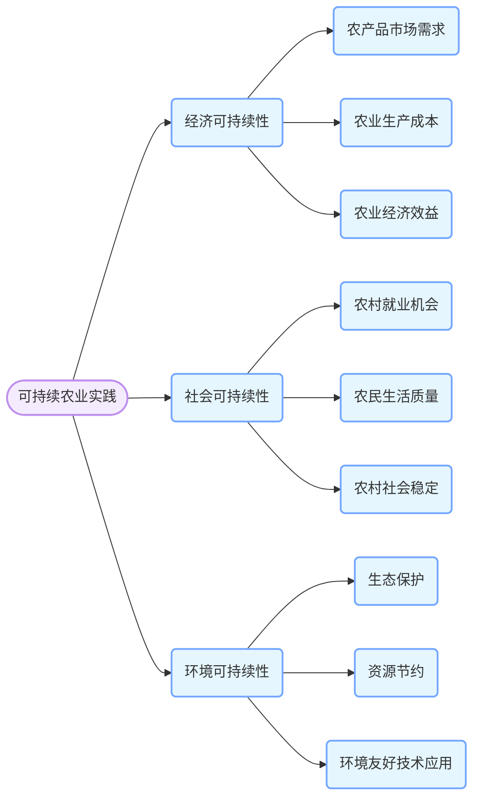

# 全球股市估值与可持续农业实践的关系

> 关键词：全球股市估值、可持续农业实践、经济影响、环境因素、市场趋势、投资策略、农业发展

> 摘要：本文旨在深入探讨全球股市估值与可持续农业实践之间的关系。通过对相关核心概念的阐述、算法原理的分析、数学模型的构建以及实际案例的研究，揭示两者之间的内在联系和相互影响。同时，探讨了其在实际应用场景中的表现，推荐了相关的学习资源、开发工具和论文著作，最后对未来发展趋势与挑战进行了总结。这对于投资者制定合理的投资策略、农业从业者优化农业实践以及政策制定者推动可持续发展具有重要的参考价值。

## 1. 背景介绍 
### 1.1 目的和范围
本研究的主要目的是全面分析全球股市估值与可持续农业实践之间的关系。一方面，了解可持续农业实践如何影响全球股市中农业相关企业以及其他相关行业的估值；另一方面，探讨全球股市的波动和趋势对可持续农业实践的发展和推广可能产生的影响。研究范围涵盖全球主要股票市场以及不同国家和地区的可持续农业实践情况，包括但不限于发达国家和发展中国家的农业发展模式、政策导向以及市场反应。

### 1.2 预期读者
本文预期读者包括金融投资者、农业从业者、政策制定者、研究学者以及对全球经济和农业发展感兴趣的各界人士。投资者可以通过本文了解可持续农业实践对股市投资的影响，从而调整投资组合；农业从业者可以从中获取关于市场需求和发展趋势的信息，优化农业生产和经营策略；政策制定者可以参考研究结果制定相关政策，促进可持续农业的发展和股市的稳定；研究学者可以在本文的基础上进一步深入研究相关领域的问题。

### 1.3 文档结构概述
本文首先介绍了研究的背景、目的、预期读者和文档结构，接着阐述了全球股市估值和可持续农业实践的核心概念及其联系，通过核心算法原理和具体操作步骤、数学模型和公式进一步分析两者之间的关系，然后通过项目实战展示实际案例并进行详细解释说明，探讨了实际应用场景，推荐了相关的工具和资源，最后总结未来发展趋势与挑战，提供常见问题与解答以及扩展阅读和参考资料。

### 1.4 术语表
#### 1.4.1 核心术语定义
- **全球股市估值**：指对全球范围内各个股票市场中上市公司的价值进行评估和衡量的过程和结果。通常通过各种估值方法，如市盈率（P/E）、市净率（P/B）等，来确定股票的相对价值，反映市场对公司未来盈利能力和发展前景的预期。
- **可持续农业实践**：是指在满足当代人对农产品需求的同时，不损害后代人满足其需求的能力的农业生产方式。它综合考虑了经济、社会和环境三个方面的因素，旨在实现农业的长期可持续发展，包括采用生态友好的种植和养殖技术、保护自然资源、促进农村社区的发展等。

#### 1.4.2 相关概念解释
- **经济外部性**：指一个经济主体的经济活动对其他经济主体所产生的影响，这种影响可能是有益的（正外部性），也可能是有害的（负外部性）。在可持续农业实践中，采用环保的种植技术可能会减少对环境的污染，产生正外部性；而过度使用化肥和农药可能会对土壤和水资源造成破坏，产生负外部性。
- **市场效率**：指市场在资源配置过程中达到最优状态的程度。在有效市场中，股票价格能够及时、准确地反映所有相关信息，包括公司的基本面信息和市场的宏观经济环境等。如果市场是有效的，那么可持续农业实践对股市估值的影响应该能够迅速反映在股票价格上。

#### 1.4.3 缩略词列表
- **P/E**：市盈率（Price-to-Earnings Ratio），是指股票价格与每股收益的比率，用于衡量股票的估值水平。
- **P/B**：市净率（Price-to-Book Ratio），是指股票价格与每股净资产的比率，反映了市场对公司净资产的估值。

## 2. 核心概念与联系 

### 2.1 全球股市估值的原理和架构
全球股市估值是一个复杂的过程，涉及到多个因素和方法。从原理上讲，股市估值的基础是对上市公司未来现金流的预期。投资者通过分析公司的财务报表、行业前景、宏观经济环境等因素，来预测公司未来的盈利能力和现金流状况，进而确定股票的价值。

其架构可以用以下文本示意图表示：

全球股市估值
|--宏观经济因素
|   |--GDP增长率
|   |--通货膨胀率
|   |--利率水平
|--行业因素
|   |--行业竞争格局
|   |--行业发展趋势
|--公司因素
|   |--财务状况
|   |--经营业绩
|   |--管理团队

对应的Mermaid流程图如下：


### 2.2 可持续农业实践的原理和架构
可持续农业实践的核心原理是实现农业的经济、社会和环境效益的协调发展。它强调在农业生产过程中，要合理利用自然资源，减少对环境的破坏，同时提高农业生产效率，保障农民的收入和农村社区的发展。

其架构可以用以下文本示意图表示：

可持续农业实践
|--经济可持续性
|   |--农产品市场需求
|   |--农业生产成本
|   |--农业经济效益
|--社会可持续性
|   |--农村就业机会
|   |--农民生活质量
|   |--农村社会稳定
|--环境可持续性
|   |--生态保护
|   |--资源节约
|   |--环境友好技术应用

对应的Mermaid流程图如下：


### 2.3 两者之间的联系
全球股市估值与可持续农业实践之间存在着密切的联系。一方面，可持续农业实践的发展会对全球股市中农业相关企业以及其他相关行业的估值产生影响。例如，采用可持续农业实践的企业可能会因为其良好的环境和社会形象，吸引更多的投资者，从而提高其股票估值。另一方面，全球股市的波动和趋势也会影响可持续农业实践的发展。如果股市表现良好，投资者可能更愿意投资于可持续农业项目，从而推动可持续农业实践的推广和发展；反之，如果股市低迷，投资者可能会减少对可持续农业项目的投资，影响可持续农业实践的发展进程。

## 3. 核心算法原理 & 具体操作步骤 

### 3.1 股市估值算法原理
在股市估值中，常用的算法之一是现金流折现法（Discounted Cash Flow, DCF）。该算法的基本原理是将公司未来的现金流按照一定的折现率折现到当前时刻，从而得到公司的内在价值。

以下是使用Python实现现金流折现法的源代码：
```python
def dcf_valuation(cash_flows, discount_rate):
    """
    现金流折现法计算公司内在价值
    :param cash_flows: 未来各期的现金流列表
    :param discount_rate: 折现率
    :return: 公司的内在价值
    """
    present_value = 0
    for i, cash_flow in enumerate(cash_flows):
        present_value += cash_flow / (1 + discount_rate) ** (i + 1)
    return present_value

# 示例数据
cash_flows = [100, 120, 150, 180, 200]  # 未来五年的现金流
discount_rate = 0.1  # 折现率为10%

# 计算内在价值
intrinsic_value = dcf_valuation(cash_flows, discount_rate)
print(f"公司的内在价值为: {intrinsic_value}")
```

### 3.2 具体操作步骤
1. **确定未来现金流**：通过对公司的财务报表、行业前景、宏观经济环境等因素的分析，预测公司未来各期的现金流。
2. **选择折现率**：折现率反映了投资者对投资风险的预期。一般来说，折现率越高，说明投资者对投资风险的要求越高。可以根据市场利率、公司的风险水平等因素来确定折现率。
3. **计算内在价值**：将未来各期的现金流按照折现率折现到当前时刻，然后将它们相加，得到公司的内在价值。
4. **比较内在价值和市场价格**：如果公司的内在价值高于市场价格，说明股票被低估，具有投资价值；反之，如果内在价值低于市场价格，说明股票被高估，需要谨慎投资。

### 3.3 可持续农业实践对股市估值的影响分析算法
为了分析可持续农业实践对股市估值的影响，可以采用多元线性回归模型。该模型可以用来研究多个自变量（如可持续农业实践的指标）对因变量（如股市估值指标）的影响。

以下是使用Python实现多元线性回归模型的源代码：
```python
import numpy as np
from sklearn.linear_model import LinearRegression

# 示例数据
# 自变量：可持续农业实践的指标（如环保投入、资源利用率等）
X = np.array([[10, 0.8], [20, 0.9], [30, 0.95], [40, 0.98], [50, 1.0]])
# 因变量：股市估值指标（如市盈率）
y = np.array([15, 20, 25, 30, 35])

# 创建线性回归模型
model = LinearRegression()

# 拟合模型
model.fit(X, y)

# 输出模型参数
print(f"模型系数: {model.coef_}")
print(f"模型截距: {model.intercept_}")

# 预测新数据
new_X = np.array([[60, 1.02]])
predicted_y = model.predict(new_X)
print(f"预测的股市估值指标: {predicted_y}")
```

### 3.4 具体操作步骤
1. **数据收集**：收集可持续农业实践的相关指标数据和股市估值的相关指标数据。
2. **数据预处理**：对收集到的数据进行清洗、标准化等预处理操作，以提高模型的准确性。
3. **模型建立**：选择合适的回归模型，如多元线性回归模型，并使用训练数据对模型进行训练。
4. **模型评估**：使用测试数据对训练好的模型进行评估，计算模型的评估指标，如均方误差（MSE）、决定系数（R²）等，以评估模型的性能。
5. **结果分析**：根据模型的系数和截距，分析可持续农业实践的各个指标对股市估值的影响程度。

## 4. 数学模型和公式 & 详细讲解 & 举例说明 

### 4.1 现金流折现法的数学模型和公式
现金流折现法的数学模型可以表示为：
$$V = \sum_{t=1}^{n} \frac{CF_t}{(1 + r)^t}$$
其中，$V$ 表示公司的内在价值，$CF_t$ 表示第 $t$ 期的现金流，$r$ 表示折现率，$n$ 表示预测的期数。

详细讲解：该公式的核心思想是将未来各期的现金流按照折现率折现到当前时刻，因为未来的现金流具有不确定性，所以需要通过折现来考虑时间价值和风险因素。折现率 $r$ 反映了投资者对投资风险的预期，折现率越高，未来现金流的现值就越低。

举例说明：假设某公司未来三年的现金流分别为 $100$ 万元、$120$ 万元和 $150$ 万元，折现率为 $10\%$，则该公司的内在价值为：
$$V = \frac{100}{(1 + 0.1)^1} + \frac{120}{(1 + 0.1)^2} + \frac{150}{(1 + 0.1)^3} \approx 90.91 + 99.17 + 112.70 = 302.78 \text{（万元）}$$

### 4.2 多元线性回归模型的数学模型和公式
多元线性回归模型的数学模型可以表示为：
$$y = \beta_0 + \beta_1x_1 + \beta_2x_2 + \cdots + \beta_px_p + \epsilon$$
其中，$y$ 表示因变量（如股市估值指标），$x_1, x_2, \cdots, x_p$ 表示自变量（如可持续农业实践的指标），$\beta_0$ 表示截距，$\beta_1, \beta_2, \cdots, \beta_p$ 表示回归系数，$\epsilon$ 表示误差项。

详细讲解：该公式描述了因变量 $y$ 与多个自变量 $x_1, x_2, \cdots, x_p$ 之间的线性关系。回归系数 $\beta_1, \beta_2, \cdots, \beta_p$ 表示每个自变量对因变量的影响程度，截距 $\beta_0$ 表示当所有自变量都为 $0$ 时因变量的取值。误差项 $\epsilon$ 表示模型无法解释的随机误差。

举例说明：假设我们使用两个自变量 $x_1$ 和 $x_2$ 来预测因变量 $y$，通过多元线性回归模型得到的回归系数 $\beta_1 = 2$，$\beta_2 = 3$，截距 $\beta_0 = 5$，则当 $x_1 = 10$，$x_2 = 20$ 时，预测的 $y$ 值为：
$$y = 5 + 2\times10 + 3\times20 = 5 + 20 + 60 = 85$$

## 5. 项目实战：代码实际案例和详细解释说明 

### 5.1  开发环境搭建
1. **安装Python**：可以从Python官方网站（https://www.python.org/downloads/）下载并安装Python 3.x版本。
2. **安装必要的库**：使用以下命令安装所需的库：
```sh
pip install numpy pandas scikit-learn matplotlib
```
3. **选择开发工具**：可以选择使用PyCharm、Jupyter Notebook等开发工具进行代码的编写和调试。

### 5.2  源代码详细实现和代码解读
以下是一个完整的项目实战代码示例，用于分析可持续农业实践对股市估值的影响：
```python
import numpy as np
import pandas as pd
from sklearn.linear_model import LinearRegression
import matplotlib.pyplot as plt

# 读取数据
data = pd.read_csv('sustainable_agriculture_stock_data.csv')

# 提取自变量和因变量
X = data[['sustainable_practice_1', 'sustainable_practice_2']].values
y = data['stock_valuation'].values

# 创建线性回归模型
model = LinearRegression()

# 拟合模型
model.fit(X, y)

# 输出模型参数
print(f"模型系数: {model.coef_}")
print(f"模型截距: {model.intercept_}")

# 预测新数据
new_X = np.array([[50, 60]])
predicted_y = model.predict(new_X)
print(f"预测的股市估值指标: {predicted_y}")

# 绘制散点图和拟合直线
plt.scatter(data['sustainable_practice_1'], data['stock_valuation'], color='blue', label='Data Points')
plt.plot(data['sustainable_practice_1'], model.predict(X), color='red', linewidth=2, label='Fitted Line')
plt.xlabel('Sustainable Practice 1')
plt.ylabel('Stock Valuation')
plt.title('Relationship between Sustainable Practice and Stock Valuation')
plt.legend()
plt.show()
```

代码解读：
1. **数据读取**：使用 `pandas` 库的 `read_csv` 函数读取包含可持续农业实践指标和股市估值指标的数据文件。
2. **自变量和因变量提取**：从数据中提取自变量（可持续农业实践指标）和因变量（股市估值指标），并将其转换为 `numpy` 数组。
3. **模型创建和拟合**：使用 `sklearn` 库的 `LinearRegression` 类创建线性回归模型，并使用 `fit` 方法对模型进行拟合。
4. **模型参数输出**：输出模型的系数和截距，以了解每个自变量对因变量的影响程度。
5. **预测新数据**：使用训练好的模型对新的自变量数据进行预测，并输出预测结果。
6. **绘制散点图和拟合直线**：使用 `matplotlib` 库绘制散点图和拟合直线，直观地展示可持续农业实践指标和股市估值指标之间的关系。

### 5.3  代码解读与分析
通过上述代码，我们可以得到以下分析结果：
1. **模型系数**：模型的系数表示每个自变量对因变量的影响程度。如果系数为正，说明该自变量与因变量呈正相关关系；如果系数为负，说明该自变量与因变量呈负相关关系。系数的绝对值越大，说明该自变量对因变量的影响越大。
2. **模型截距**：模型的截距表示当所有自变量都为 $0$ 时因变量的取值。在实际应用中，截距的意义可能不大，但它是模型的一部分。
3. **预测结果**：通过预测新数据，我们可以了解模型在未知数据上的表现。预测结果的准确性取决于模型的拟合程度和数据的质量。
4. **散点图和拟合直线**：散点图和拟合直线可以直观地展示可持续农业实践指标和股市估值指标之间的关系。如果拟合直线的斜率为正，说明两者呈正相关关系；如果斜率为负，说明两者呈负相关关系。

## 6. 实际应用场景 
### 6.1 投资决策
对于投资者来说，了解全球股市估值与可持续农业实践之间的关系可以帮助他们做出更明智的投资决策。例如，如果投资者发现采用可持续农业实践的企业的股票估值有上升的趋势，他们可以考虑增加对这些企业的投资。此外，投资者还可以通过分析可持续农业实践的发展趋势，预测相关行业的未来发展前景，从而提前布局投资组合。

### 6.2 农业企业战略规划
农业企业可以根据全球股市的估值情况和可持续农业实践的发展趋势，制定合理的战略规划。如果股市对可持续农业企业的估值较高，企业可以加大在可持续农业实践方面的投入，提高自身的竞争力和市场价值。同时，企业还可以通过改善自身的可持续发展形象，吸引更多的投资者和消费者，促进企业的长期发展。

### 6.3 政策制定
政策制定者可以参考全球股市估值与可持续农业实践之间的关系，制定相关的政策来促进可持续农业的发展。例如，政府可以出台税收优惠政策、补贴政策等，鼓励农业企业采用可持续农业实践，提高农业的可持续发展水平。此外，政策制定者还可以通过加强对股市的监管，引导投资者将资金投向可持续农业领域，推动可持续农业的发展。

### 6.4 风险管理
对于金融机构和企业来说，了解全球股市估值与可持续农业实践之间的关系可以帮助他们进行风险管理。例如，金融机构可以通过评估可持续农业企业的风险状况，合理调整贷款额度和利率，降低信贷风险。企业可以通过分析股市波动对可持续农业实践的影响，制定相应的风险应对策略，降低经营风险。

## 7. 工具和资源推荐
### 7.1 学习资源推荐
#### 7.1.1 书籍推荐
- 《金融学》（兹维·博迪、亚历克斯·凯恩、艾伦·马库斯著）：全面介绍了金融学的基本理论和方法，包括股市估值、投资决策等内容，对于理解全球股市估值的原理和方法有很大的帮助。
- 《可持续农业导论》（朱有勇、陈华平著）：系统阐述了可持续农业的概念、原理、技术和实践，对于了解可持续农业实践的内涵和发展趋势具有重要的参考价值。
- 《计量经济学》（詹姆斯·H·斯托克、马克·W·沃森著）：介绍了计量经济学的基本理论和方法，包括回归分析、时间序列分析等，对于分析全球股市估值与可持续农业实践之间的关系提供了重要的工具和方法。

#### 7.1.2 在线课程
- Coursera平台上的“Financial Markets”课程：由耶鲁大学的罗伯特·席勒教授授课，深入讲解了金融市场的运作机制和投资策略，包括股市估值的方法和技巧。
- edX平台上的“Sustainable Agriculture”课程：由宾夕法尼亚州立大学的专家团队授课，介绍了可持续农业的最新研究成果和实践经验，对于了解可持续农业实践的发展趋势和应用案例具有重要的参考价值。
- 中国大学MOOC平台上的“计量经济学”课程：由国内知名高校的教授授课，系统讲解了计量经济学的基本理论和方法，包括回归分析、时间序列分析等，对于掌握数据分析和建模的方法有很大的帮助。

#### 7.1.3 技术博客和网站
- Seeking Alpha（https://seekingalpha.com/）：提供全球股市的分析和评论，包括公司基本面分析、行业趋势分析等内容，对于了解全球股市估值的动态和趋势有很大的帮助。
- Food and Agriculture Organization of the United Nations（https://www.fao.org/）：联合国粮食及农业组织的官方网站，提供全球农业发展的最新信息和数据，包括可持续农业实践的政策、技术和案例等内容，对于了解可持续农业实践的发展现状和趋势具有重要的参考价值。
- Towards Data Science（https://towardsdatascience.com/）：一个专注于数据科学和机器学习的技术博客，提供数据分析、建模和算法等方面的技术文章和教程，对于掌握数据分析和建模的方法有很大的帮助。

### 7.2 开发工具框架推荐
#### 7.2.1 IDE和编辑器
- PyCharm：一款专业的Python集成开发环境，提供代码编辑、调试、版本控制等功能，对于Python开发非常方便。
- Jupyter Notebook：一个交互式的笔记本环境，支持多种编程语言，如Python、R等，适合进行数据分析和模型开发。
- Visual Studio Code：一款轻量级的代码编辑器，支持多种编程语言和插件，具有丰富的扩展功能，对于快速开发和调试代码非常有用。

#### 7.2.2 调试和性能分析工具
- pdb：Python内置的调试器，可以帮助开发者在代码中设置断点、查看变量值等，进行代码调试。
- cProfile：Python的性能分析工具，可以帮助开发者分析代码的性能瓶颈，优化代码的执行效率。
- Spyder：一款专门为科学计算和数据分析设计的Python集成开发环境，提供代码编辑、调试、性能分析等功能，对于数据分析和模型开发非常方便。

#### 7.2.3 相关框架和库
- numpy：Python的数值计算库，提供高效的数组操作和数学函数，对于数据分析和模型开发非常有用。
- pandas：Python的数据处理库，提供数据结构和数据分析工具，如DataFrame、Series等，对于数据清洗、整理和分析非常方便。
- scikit-learn：Python的机器学习库，提供各种机器学习算法和工具，如线性回归、逻辑回归、决策树等，对于数据分析和建模非常有用。
- matplotlib：Python的绘图库，提供各种绘图功能，如折线图、散点图、柱状图等，对于数据可视化非常方便。

### 7.3 相关论文著作推荐
#### 7.3.1 经典论文
- “The Capital Asset Pricing Model: Theory and Evidence”（作者：Fischer Black、Michael C. Jensen、Myron Scholes）：这篇论文提出了资本资产定价模型（CAPM），为股市估值和投资决策提供了重要的理论基础。
- “The Economics of Sustainable Agriculture”（作者：David Pimentel、Mario Giampietro）：这篇论文探讨了可持续农业的经济学原理和方法，对于理解可持续农业实践的经济意义和价值具有重要的参考价值。
- “Regression Analysis: Theory, Methods, and Applications”（作者：George A. F. Seber、Alan J. Lee）：这篇论文系统介绍了回归分析的理论、方法和应用，对于掌握数据分析和建模的方法有很大的帮助。

#### 7.3.2 最新研究成果
- 关注《Journal of Financial Economics》《American Journal of Agricultural Economics》《Nature Sustainability》等学术期刊，这些期刊经常发表关于全球股市估值、可持续农业实践等方面的最新研究成果。
- 参加相关的学术会议，如金融经济学年会、农业经济学会年会等，了解该领域的最新研究动态和趋势。

#### 7.3.3 应用案例分析
- 《Sustainable Investing: Practices, Progress, and Challenges》（作者：Global Sustainable Investment Alliance）：这本书介绍了可持续投资的实践经验、进展和挑战，包括可持续农业投资的案例分析，对于了解可持续投资的应用和发展具有重要的参考价值。
- 《Case Studies in Sustainable Agriculture》（作者：International Center for Tropical Agriculture）：这本书收集了全球各地的可持续农业实践案例，包括不同国家和地区的农业发展模式、技术应用和政策措施等，对于了解可持续农业实践的具体应用和效果具有重要的参考价值。

## 8. 总结：未来发展趋势与挑战
### 8.1 未来发展趋势
1. **可持续农业实践的普及和推广**：随着人们对环境保护和食品安全的关注度不断提高，可持续农业实践将得到更广泛的普及和推广。越来越多的农业企业将采用可持续农业技术和管理模式，提高农业的可持续发展水平。
2. **股市对可持续农业企业的关注度增加**：投资者对可持续发展的意识不断增强，将更加关注采用可持续农业实践的企业。这些企业的股票估值可能会得到提升，吸引更多的投资者。
3. **数据驱动的决策和分析**：随着信息技术的不断发展，数据的收集、分析和应用将在全球股市估值和可持续农业实践中发挥越来越重要的作用。通过数据分析和建模，可以更准确地评估可持续农业实践对股市估值的影响，为投资决策和政策制定提供更科学的依据。
4. **跨学科合作的加强**：全球股市估值与可持续农业实践涉及到金融、农业、环境等多个领域的知识和技术，未来需要加强跨学科合作，整合各方资源，共同推动可持续农业的发展和股市的稳定。

### 8.2 挑战
1. **数据质量和可得性**：目前，关于可持续农业实践和股市估值的数据质量和可得性存在一定的问题。数据的不完整、不准确可能会影响分析结果的准确性和可靠性。因此，需要加强数据的收集、整理和管理，提高数据质量。
2. **标准和规范的统一**：可持续农业实践和股市估值的标准和规范在不同国家和地区存在差异，这给跨地区的比较和分析带来了困难。需要制定统一的标准和规范，促进可持续农业实践和股市估值的国际化和标准化。
3. **技术和人才的短缺**：数据分析、建模和人工智能等技术在全球股市估值和可持续农业实践中的应用越来越广泛，但目前相关的技术和人才相对短缺。需要加强技术研发和人才培养，提高技术水平和创新能力。
4. **政策和市场的不确定性**：全球经济和政治环境的不确定性可能会对股市估值和可持续农业实践产生影响。政策的变化、市场的波动等因素可能会增加投资风险和农业发展的不确定性。需要加强政策的稳定性和市场的监管，降低不确定性带来的影响。

## 9. 附录：常见问题与解答
### 9.1 什么是可持续农业实践？
可持续农业实践是指在满足当代人对农产品需求的同时，不损害后代人满足其需求的能力的农业生产方式。它综合考虑了经济、社会和环境三个方面的因素，旨在实现农业的长期可持续发展，包括采用生态友好的种植和养殖技术、保护自然资源、促进农村社区的发展等。

### 9.2 如何评估可持续农业实践对股市估值的影响？
可以采用多种方法来评估可持续农业实践对股市估值的影响，如多元线性回归模型、事件研究法等。通过收集可持续农业实践的相关指标数据和股市估值的相关指标数据，建立模型进行分析，从而了解两者之间的关系和影响程度。

### 9.3 可持续农业实践对股市估值的影响是长期的还是短期的？
可持续农业实践对股市估值的影响可能是长期的，也可能是短期的。从长期来看，可持续农业实践有助于提高农业企业的竞争力和市场价值，从而对股市估值产生积极的影响。从短期来看，市场的波动和投资者的情绪等因素可能会导致股市估值的短期波动，但这种波动不一定能反映可持续农业实践的真实价值。

### 9.4 投资者应该如何应对全球股市估值与可持续农业实践之间的关系？
投资者可以通过以下方式应对全球股市估值与可持续农业实践之间的关系：
1. 加强对可持续农业实践的了解和研究，关注相关企业的发展动态和可持续发展报告。
2. 分析可持续农业实践对股市估值的影响，制定合理的投资策略，适当增加对可持续农业企业的投资。
3. 关注政策和市场的变化，及时调整投资组合，降低投资风险。

### 9.5 政府在促进可持续农业实践和股市估值的良性互动方面可以采取哪些措施？
政府可以采取以下措施促进可持续农业实践和股市估值的良性互动：
1. 制定相关的政策和法规，鼓励农业企业采用可持续农业实践，提高农业的可持续发展水平。
2. 加强对股市的监管，引导投资者将资金投向可持续农业领域，推动可持续农业的发展。
3. 加大对可持续农业技术研发和推广的支持力度，提高农业的科技含量和竞争力。
4. 加强数据的收集、整理和管理，提高数据质量，为分析和决策提供科学依据。

## 10. 扩展阅读 & 参考资料
1. 《金融市场与金融机构基础》（弗兰克·J·法博齐、弗郎哥·莫迪利亚尼等著）
2. 《农业经济学》（李秉龙、薛兴利主编）
3. 《数据挖掘：概念与技术》（Jiawei Han、Jian Pei、Jianwen Yin著）
4. “The Impact of Corporate Social Responsibility on Firm Value: A Meta - Analysis”（作者：Margarita Orlitzky、Frank L. Schmidt、Sarah L. Rynes）
5. “Sustainable Agriculture and Food Systems: Global Perspectives and Challenges”（作者：P. K. Aggarwal、R. K. Singh、S. K. Singh）
6. 世界银行官方网站（https://www.worldbank.org/）
7. 国际货币基金组织官方网站（https://www.imf.org/）

作者：AI天才研究院/AI Genius Institute & 禅与计算机程序设计艺术 /Zen And The Art of Computer Programming