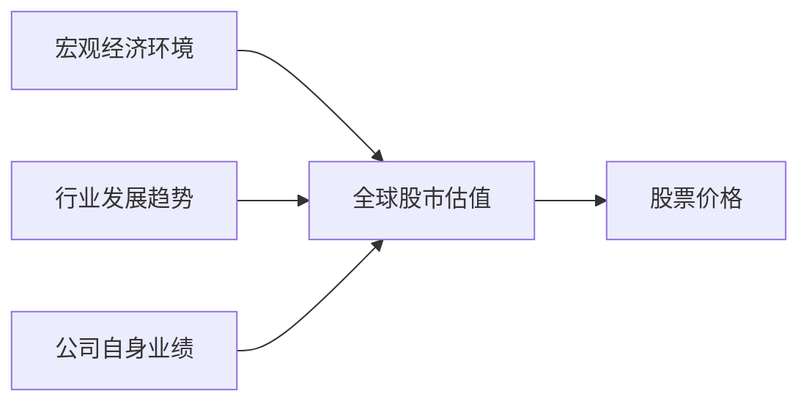
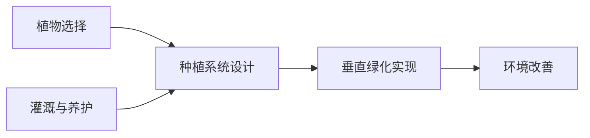
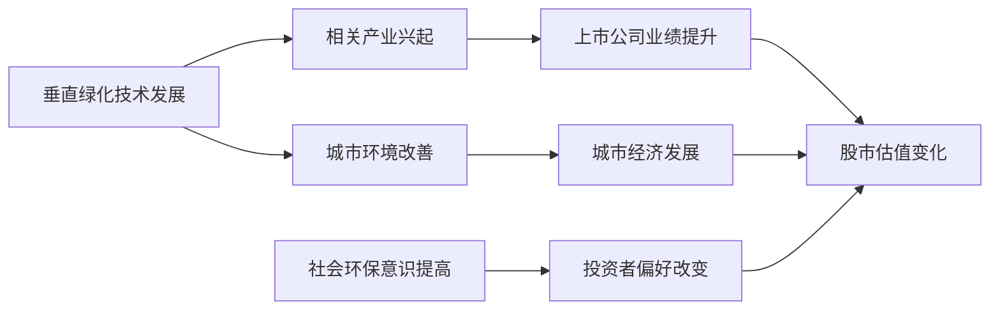

# 全球股市估值与可持续城市垂直绿化技术的关联

> 关键词：全球股市估值、可持续城市、垂直绿化技术、经济关联、环境影响

> 摘要：本文旨在深入探讨全球股市估值与可持续城市垂直绿化技术之间的关联。通过对核心概念的剖析、相关算法原理的阐述、数学模型的构建以及实际案例的分析，揭示两者在经济、环境和社会层面的内在联系。同时，介绍了相关的应用场景、推荐了学习资源、开发工具和研究论文，最后对未来发展趋势与挑战进行了总结，并解答了常见问题。

## 1. 背景介绍 
### 1.1 目的和范围
本研究的主要目的是探究全球股市估值与可持续城市垂直绿化技术之间的潜在关联。随着全球经济的发展和环境意识的提高，股市表现受到多种因素的影响，而可持续城市垂直绿化技术作为一种新兴的环保和城市发展理念，可能对股市的某些板块产生影响。本研究将涵盖全球范围内的股市数据以及垂直绿化技术的发展现状，分析两者之间可能存在的直接或间接联系。

### 1.2 预期读者
本文的预期读者包括金融分析师、城市规划者、环保专家、科技投资者以及对经济与环境交叉领域感兴趣的研究人员。对于金融从业者来说，了解股市估值与垂直绿化技术的关联有助于挖掘新的投资机会；城市规划者可以从经济角度评估垂直绿化技术的可行性；环保专家能够通过股市表现了解社会对环保技术的认可度；科技投资者则可以寻找潜在的科技企业进行投资。

### 1.3 文档结构概述
本文将按照以下结构进行阐述：首先介绍核心概念与联系，包括全球股市估值和可持续城市垂直绿化技术的定义和相互关系；接着讲解核心算法原理和具体操作步骤，通过Python代码展示如何进行相关数据的分析；然后建立数学模型和公式，并进行详细讲解和举例说明；之后通过项目实战，给出代码实际案例并进行详细解释；再探讨实际应用场景；推荐相关的工具和资源；最后总结未来发展趋势与挑战，解答常见问题并提供扩展阅读和参考资料。

### 1.4 术语表
#### 1.4.1 核心术语定义
- **全球股市估值**：指对全球范围内各个股票市场上上市公司的价值进行评估的过程和结果。通常通过市盈率、市净率等指标来衡量。
- **可持续城市**：是指在满足当代人需求的同时，不损害后代人满足其自身需求的能力，实现经济、社会和环境协调发展的城市。
- **垂直绿化技术**：是一种在建筑物垂直表面种植植物的技术，包括墙面绿化、屋顶绿化等多种形式，旨在增加城市绿色空间、改善环境质量。

#### 1.4.2 相关概念解释
- **股市板块**：是对股票市场中具有相同特征或行业属性的股票进行分类的概念。例如，环保板块、科技板块等。
- **环境效益**：指垂直绿化技术在改善空气质量、降低城市热岛效应、减少噪音等方面所带来的环境改善效果。
- **经济效益**：包括垂直绿化技术在房地产增值、能源节约等方面所产生的经济收益，以及对相关股票市场的影响。

#### 1.4.3 缩略词列表
- **PE**：市盈率（Price-to-Earnings Ratio），是指股票价格除以每股收益的比率，用于衡量股票的估值水平。
- **PB**：市净率（Price-to-Book Ratio），是指股票价格与每股净资产的比率，反映了市场对公司净资产的估值。

## 2. 核心概念与联系 

### 2.1 全球股市估值的原理和架构
全球股市估值是一个复杂的过程，涉及到多个因素的综合考量。其基本原理是通过对上市公司的财务状况、盈利能力、市场前景等因素进行分析，来确定股票的合理价值。常见的估值方法包括市盈率法、市净率法、现金流折现法等。

从架构上看，全球股市估值受到宏观经济环境、行业发展趋势、公司自身业绩等多个层面的影响。宏观经济环境如GDP增长率、通货膨胀率、利率等会影响整个股市的表现；行业发展趋势决定了不同板块的估值差异；公司自身业绩则是影响个股估值的关键因素。

以下是全球股市估值的Mermaid流程图：


### 2.2 可持续城市垂直绿化技术的原理和架构
可持续城市垂直绿化技术的核心原理是利用植物的生态功能，通过在建筑物垂直表面种植植物，实现城市生态环境的改善。其架构主要包括植物选择、种植系统设计、灌溉与养护等环节。

植物选择需要考虑当地的气候条件、建筑物朝向、植物的适应性等因素；种植系统设计包括种植容器、支撑结构等的设计，要确保植物能够稳定生长；灌溉与养护则是保证植物健康生长的关键，需要根据植物的需求进行合理的浇水、施肥和病虫害防治。

以下是可持续城市垂直绿化技术的Mermaid流程图：


### 2.3 两者之间的联系
全球股市估值与可持续城市垂直绿化技术之间存在着多方面的联系。从经济层面来看，垂直绿化技术的发展可能会带动相关产业的兴起，如植物种植、绿化工程建设、灌溉设备制造等，这些产业的发展会影响相关上市公司的业绩，进而影响股市估值。

从环境层面来看，垂直绿化技术的推广可以改善城市环境质量，提高居民的生活质量，这可能会吸引更多的投资和人才流入城市，促进城市经济的发展，从而对股市产生积极影响。

从社会层面来看，随着人们环保意识的提高，对可持续发展的关注度增加，投资者可能更倾向于投资那些与环保和可持续发展相关的企业，这也会影响股市的板块估值。

以下是两者联系的Mermaid流程图：


## 3. 核心算法原理 & 具体操作步骤 

### 3.1 数据收集与预处理
首先，我们需要收集全球股市的相关数据，如股票价格、市盈率、市净率等，以及垂直绿化技术相关的数据，如垂直绿化面积、相关企业的营业收入等。可以通过金融数据平台、政府统计部门、行业报告等渠道获取数据。

以下是一个使用Python收集股市数据的示例代码：
```python
import pandas as pd
import yfinance as yf

# 定义股票代码
tickers = ['AAPL', 'GOOG', 'MSFT']

# 收集股票数据
data = yf.download(tickers, start='2020-01-01', end='2023-01-01')

# 保存数据到CSV文件
data.to_csv('stock_data.csv')
```

收集到的数据可能存在缺失值、异常值等问题，需要进行预处理。以下是一个简单的数据预处理示例代码：
```python
# 读取数据
data = pd.read_csv('stock_data.csv')

# 处理缺失值
data = data.dropna()

# 处理异常值
data = data[(data['Close'] > 0) & (data['Volume'] > 0)]

# 保存处理后的数据
data.to_csv('processed_stock_data.csv')
```

### 3.2 相关性分析
接下来，我们需要分析全球股市估值与垂直绿化技术之间的相关性。可以使用皮尔逊相关系数来衡量两个变量之间的线性相关性。

以下是一个使用Python进行相关性分析的示例代码：
```python
import numpy as np

# 读取处理后的数据
stock_data = pd.read_csv('processed_stock_data.csv')
greening_data = pd.read_csv('vertical_greening_data.csv')

# 提取需要分析的变量
stock_valuation = stock_data['PE']
greening_area = greening_data['Area']

# 计算皮尔逊相关系数
corr_coef = np.corrcoef(stock_valuation, greening_area)[0, 1]

print(f'皮尔逊相关系数: {corr_coef}')
```

### 3.3 回归分析
为了进一步探究垂直绿化技术对股市估值的影响，可以进行回归分析。以股市估值为因变量，垂直绿化技术相关指标为自变量，建立回归模型。

以下是一个使用Python进行线性回归分析的示例代码：
```python
from sklearn.linear_model import LinearRegression

# 准备数据
X = greening_area.values.reshape(-1, 1)
y = stock_valuation.values

# 建立线性回归模型
model = LinearRegression()
model.fit(X, y)

# 输出回归系数和截距
print(f'回归系数: {model.coef_[0]}')
print(f'截距: {model.intercept_}')
```

## 4. 数学模型和公式 & 详细讲解 & 举例说明 

### 4.1 皮尔逊相关系数
皮尔逊相关系数是衡量两个变量之间线性相关性的常用指标，其计算公式为：
$$
r = \frac{\sum_{i=1}^{n} (x_i - \bar{x})(y_i - \bar{y})}{\sqrt{\sum_{i=1}^{n} (x_i - \bar{x})^2 \sum_{i=1}^{n} (y_i - \bar{y})^2}}
$$
其中，$x_i$ 和 $y_i$ 分别是两个变量的第 $i$ 个观测值，$\bar{x}$ 和 $\bar{y}$ 分别是两个变量的均值，$n$ 是观测值的数量。

皮尔逊相关系数的取值范围是 $[-1, 1]$，当 $r = 1$ 时，表示两个变量完全正相关；当 $r = -1$ 时，表示两个变量完全负相关；当 $r = 0$ 时，表示两个变量之间不存在线性相关性。

例如，假设我们有两组数据：$x = [1, 2, 3, 4, 5]$ 和 $y = [2, 4, 6, 8, 10]$，可以使用上述公式计算它们的皮尔逊相关系数：
```python
import numpy as np

x = np.array([1, 2, 3, 4, 5])
y = np.array([2, 4, 6, 8, 10])

corr_coef = np.corrcoef(x, y)[0, 1]
print(f'皮尔逊相关系数: {corr_coef}')
```

### 4.2 线性回归模型
线性回归模型是一种用于描述自变量和因变量之间线性关系的统计模型，其一般形式为：
$$
y = \beta_0 + \beta_1 x + \epsilon
$$
其中，$y$ 是因变量，$x$ 是自变量，$\beta_0$ 是截距，$\beta_1$ 是回归系数，$\epsilon$ 是误差项。

线性回归的目标是找到一组最优的 $\beta_0$ 和 $\beta_1$，使得模型的预测值与实际值之间的误差最小。常用的方法是最小二乘法，即最小化误差平方和：
$$
\min_{\beta_0, \beta_1} \sum_{i=1}^{n} (y_i - (\beta_0 + \beta_1 x_i))^2
$$

例如，假设我们有一组数据：$x = [1, 2, 3, 4, 5]$ 和 $y = [2, 4, 6, 8, 10]$，可以使用最小二乘法拟合线性回归模型：
```python
from sklearn.linear_model import LinearRegression
import numpy as np

x = np.array([1, 2, 3, 4, 5]).reshape(-1, 1)
y = np.array([2, 4, 6, 8, 10])

model = LinearRegression()
model.fit(x, y)

print(f'回归系数: {model.coef_[0]}')
print(f'截距: {model.intercept_}')
```

## 5. 项目实战：代码实际案例和详细解释说明 

### 5.1  开发环境搭建
在进行项目实战之前，需要搭建相应的开发环境。以下是具体的步骤：
1. **安装Python**：可以从Python官方网站（https://www.python.org/downloads/）下载并安装Python 3.x版本。
2. **安装必要的库**：使用pip命令安装所需的库，如pandas、numpy、yfinance、scikit-learn等。
```sh
pip install pandas numpy yfinance scikit-learn
```
3. **选择开发工具**：可以使用Jupyter Notebook、PyCharm等开发工具进行代码编写和调试。

### 5.2  源代码详细实现和代码解读
以下是一个完整的项目实战代码示例，用于分析全球股市估值与垂直绿化技术之间的关联：
```python
import pandas as pd
import numpy as np
import yfinance as yf
from sklearn.linear_model import LinearRegression

# 收集股市数据
tickers = ['AAPL', 'GOOG', 'MSFT']
data = yf.download(tickers, start='2020-01-01', end='2023-01-01')
data.to_csv('stock_data.csv')

# 收集垂直绿化技术相关数据
greening_data = pd.read_csv('vertical_greening_data.csv')

# 数据预处理
stock_data = pd.read_csv('stock_data.csv')
stock_data = stock_data.dropna()
stock_data = stock_data[(stock_data['Close'] > 0) & (stock_data['Volume'] > 0)]
stock_data.to_csv('processed_stock_data.csv')

# 提取需要分析的变量
stock_valuation = stock_data['PE']
greening_area = greening_data['Area']

# 计算皮尔逊相关系数
corr_coef = np.corrcoef(stock_valuation, greening_area)[0, 1]
print(f'皮尔逊相关系数: {corr_coef}')

# 准备数据进行回归分析
X = greening_area.values.reshape(-1, 1)
y = stock_valuation.values

# 建立线性回归模型
model = LinearRegression()
model.fit(X, y)

# 输出回归系数和截距
print(f'回归系数: {model.coef_[0]}')
print(f'截距: {model.intercept_}')
```

代码解读：
1. **数据收集**：使用yfinance库收集指定股票的历史数据，并保存到CSV文件中。同时，读取垂直绿化技术相关的数据。
2. **数据预处理**：对股市数据进行缺失值和异常值处理，确保数据的质量。
3. **相关性分析**：计算股市估值（市盈率）与垂直绿化面积之间的皮尔逊相关系数，评估两者之间的线性相关性。
4. **回归分析**：以垂直绿化面积为自变量，股市估值为因变量，建立线性回归模型，分析垂直绿化技术对股市估值的影响。

### 5.3  代码解读与分析
通过上述代码，我们可以得到以下结果：
- 皮尔逊相关系数：反映了股市估值与垂直绿化面积之间的线性相关性。如果相关系数接近1，表示两者正相关；接近 -1，表示两者负相关；接近0，表示两者之间不存在线性相关性。
- 回归系数和截距：回归系数表示垂直绿化面积每增加一个单位，股市估值的平均变化量；截距表示当垂直绿化面积为0时，股市估值的预测值。

根据这些结果，我们可以进一步分析垂直绿化技术对股市估值的影响程度和方向，为投资决策和城市规划提供参考。

## 6. 实际应用场景 
### 6.1 投资决策
对于投资者来说，了解全球股市估值与可持续城市垂直绿化技术之间的关联可以帮助他们发现潜在的投资机会。如果发现垂直绿化技术的发展与某些行业或公司的股市估值存在正相关关系，投资者可以考虑投资这些相关的股票。例如，投资从事垂直绿化工程建设、植物种植和养护的企业，或者投资那些受益于城市环境改善而业绩提升的企业。

### 6.2 城市规划
城市规划者可以从经济角度评估垂直绿化技术的可行性。如果垂直绿化技术的推广能够对股市产生积极影响，说明其具有一定的经济价值，可以在城市规划中加大对垂直绿化项目的投入。例如，在新建建筑物中强制要求采用垂直绿化技术，或者对既有建筑物进行垂直绿化改造，以提高城市的环境质量和经济竞争力。

### 6.3 政策制定
政府部门可以根据全球股市估值与垂直绿化技术之间的关联制定相关政策。例如，出台税收优惠政策鼓励企业投资垂直绿化技术的研发和应用，或者设立专项资金支持城市垂直绿化项目的建设。通过政策引导，促进垂直绿化技术的发展，实现经济和环境的双赢。

## 7. 工具和资源推荐
### 7.1 学习资源推荐
#### 7.1.1 书籍推荐
- 《金融市场学》：介绍了金融市场的基本原理和运行机制，对于理解全球股市估值有很大帮助。
- 《城市生态学》：讲解了城市生态系统的结构和功能，以及城市绿化对生态环境的影响，有助于深入了解可持续城市垂直绿化技术。
- 《Python数据分析实战》：通过实际案例介绍了Python在数据分析中的应用，对于进行相关数据处理和分析非常有用。

#### 7.1.2 在线课程
- Coursera上的“金融市场分析”课程：由知名教授授课，系统讲解了金融市场的分析方法和工具。
- edX上的“城市规划与可持续发展”课程：介绍了城市规划的理论和实践，以及可持续发展的理念和方法。
- 网易云课堂上的“Python数据分析入门”课程：适合初学者学习Python数据分析的基础知识和技能。

#### 7.1.3 技术博客和网站
- 金融界网站：提供全球股市的实时行情、分析报告和投资建议。
- 中国城市科学研究会网站：发布城市规划、城市生态等方面的研究成果和政策动态。
- 开源中国网站：有很多关于Python编程和数据分析的技术文章和教程。

### 7.2 开发工具框架推荐
#### 7.2.1 IDE和编辑器
- PyCharm：是一款专业的Python集成开发环境，具有代码编辑、调试、版本控制等功能，适合大规模项目的开发。
- Jupyter Notebook：是一个交互式的编程环境，支持Python、R等多种编程语言，方便进行数据探索和分析。
- Visual Studio Code：是一款轻量级的代码编辑器，支持多种编程语言和插件扩展，适合快速开发和调试。

#### 7.2.2 调试和性能分析工具
- Py-Spy：是一个Python性能分析工具，可以实时监控Python程序的运行状态和性能瓶颈。
- PDB：是Python自带的调试器，可以帮助开发者定位和解决代码中的问题。
- Memory Profiler：是一个Python内存分析工具，可以分析Python程序的内存使用情况。

#### 7.2.3 相关框架和库
- Pandas：是一个强大的数据处理和分析库，提供了数据结构和数据分析工具，方便进行数据清洗、转换和统计分析。
- NumPy：是Python的数值计算库，提供了高效的多维数组对象和数学函数，用于进行数值计算和科学计算。
- Scikit-learn：是一个机器学习库，提供了各种机器学习算法和工具，用于进行数据建模和预测。

### 7.3 相关论文著作推荐
#### 7.3.1 经典论文
- “The Relationship between Environmental Performance and Financial Performance: A Meta - analysis”：通过元分析的方法研究了企业环境绩效与财务绩效之间的关系，为理解垂直绿化技术与股市估值的关联提供了理论基础。
- “Urban Green Infrastructure and Economic Development”：探讨了城市绿色基础设施（包括垂直绿化）对经济发展的影响，对城市规划和政策制定具有重要参考价值。

#### 7.3.2 最新研究成果
- 可以关注《Journal of Financial Economics》《Urban Studies》《Environmental Science & Technology》等学术期刊上的最新研究成果，了解全球股市估值与可持续城市垂直绿化技术关联的前沿研究动态。

#### 7.3.3 应用案例分析
- 一些国际知名城市如新加坡、纽约等在垂直绿化技术应用方面有很多成功案例，可以参考相关的案例分析报告，了解垂直绿化技术在实际应用中的效果和经济效益。

## 8. 总结：未来发展趋势与挑战
### 8.1 未来发展趋势
- **技术创新**：随着科技的不断进步，垂直绿化技术将不断创新和完善。例如，开发更加高效的种植系统、智能灌溉技术和植物养护管理系统，提高垂直绿化的成活率和维护效率。
- **市场需求增长**：随着人们环保意识的提高和对城市环境质量要求的增加，对可持续城市垂直绿化技术的市场需求将不断增长。这将带动相关产业的发展，为股市带来新的投资机会。
- **政策支持加强**：政府将更加重视可持续城市发展，出台更多的政策支持垂直绿化技术的推广和应用。例如，设立专项基金、给予税收优惠、制定强制性标准等，促进垂直绿化技术的普及。

### 8.2 挑战
- **技术成本较高**：目前，垂直绿化技术的成本相对较高，包括植物种植、灌溉系统安装、维护管理等方面的费用。这限制了其大规模推广和应用，需要进一步降低技术成本。
- **数据准确性和完整性**：在分析全球股市估值与垂直绿化技术之间的关联时，需要准确和完整的数据。然而，目前相关数据的收集和整理还存在一定的困难，数据的质量和可比性有待提高。
- **跨学科合作难度大**：研究全球股市估值与可持续城市垂直绿化技术的关联涉及到金融、环境、城市规划等多个学科领域，需要跨学科的合作和交流。但不同学科之间的知识体系和研究方法存在差异，跨学科合作的难度较大。

## 9. 附录：常见问题与解答
### 9.1 如何获取全球股市的相关数据？
可以通过金融数据平台如雅虎财经、东方财富网、Wind等获取全球股市的历史数据和实时行情。也可以使用Python的第三方库如yfinance、pandas-datareader等进行数据收集。

### 9.2 垂直绿化技术对股市估值的影响是长期还是短期的？
垂直绿化技术对股市估值的影响可能是长期和短期并存的。短期来看，垂直绿化项目的实施可能会对相关企业的业绩产生一定的影响，从而影响股市估值。长期来看，垂直绿化技术的推广可以改善城市环境质量，促进城市经济的可持续发展，对股市产生更深远的影响。

### 9.3 如何判断垂直绿化技术相关企业的投资价值？
可以从以下几个方面判断垂直绿化技术相关企业的投资价值：企业的技术实力和创新能力、市场份额和竞争优势、财务状况和盈利能力、发展战略和前景等。同时，还需要关注行业的发展趋势和政策环境。

## 10. 扩展阅读 & 参考资料
### 扩展阅读
- 《绿色金融与可持续发展》：介绍了绿色金融的概念、发展现状和趋势，以及金融在可持续发展中的作用。
- 《城市绿化规划设计理论与方法》：详细讲解了城市绿化规划设计的理论和方法，对理解垂直绿化技术在城市中的应用有很大帮助。

### 参考资料
- 雅虎财经官方网站：https://finance.yahoo.com/
- 东方财富网：https://www.eastmoney.com/
- Wind金融终端：https://www.wind.com.cn/
- 中国城市科学研究会：http://www.csus.org.cn/

作者：AI天才研究院/AI Genius Institute & 禅与计算机程序设计艺术 /Zen And The Art of Computer Programming