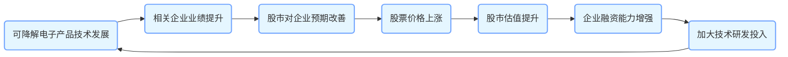

# 全球股市估值与可降解电子产品技术的关联

> 关键词：全球股市估值、可降解电子产品技术、市场趋势、行业影响、投资分析

> 摘要：本文旨在深入探讨全球股市估值与可降解电子产品技术之间的关联。首先介绍了研究的背景、目的、预期读者等信息，接着阐述了核心概念及联系，详细讲解了相关算法原理和数学模型。通过项目实战案例，具体分析了代码实现和解读。还探讨了该关联在实际中的应用场景，推荐了相关的学习资源、开发工具和论文著作。最后总结了未来发展趋势与挑战，并对常见问题进行了解答，为投资者和相关从业者提供全面的参考。

## 1. 背景介绍 
### 1.1 目的和范围
本研究的主要目的是探究全球股市估值与可降解电子产品技术之间的内在联系和相互影响。随着科技的不断进步，可降解电子产品技术逐渐成为研究和发展的热点领域，其发展态势可能对相关企业的业绩和市场表现产生重要影响，进而影响全球股市的估值。研究范围涵盖了全球主要股票市场，以及与可降解电子产品技术相关的产业链上的各类企业，包括原材料供应商、产品制造商、技术研发机构等。

### 1.2 预期读者
本文的预期读者包括金融投资者、证券分析师、科技行业从业者、学术研究人员等。对于投资者来说，了解两者之间的关联有助于做出更明智的投资决策；证券分析师可以借助研究结果为客户提供更精准的市场分析和投资建议；科技行业从业者能够从金融市场的角度审视可降解电子产品技术的发展前景；学术研究人员则可以将其作为进一步深入研究的参考。

### 1.3 文档结构概述
本文将按照以下结构展开：首先介绍相关背景信息，让读者对研究有初步的了解；接着阐述核心概念及它们之间的联系，包括全球股市估值和可降解电子产品技术的原理和架构；然后详细讲解核心算法原理和具体操作步骤，并结合 Python 代码进行说明；随后介绍相关的数学模型和公式，并举例说明其应用；通过项目实战案例，展示代码的实际实现和详细解读；探讨该关联在实际中的应用场景；推荐相关的学习资源、开发工具和论文著作；最后总结未来发展趋势与挑战，解答常见问题，并提供扩展阅读和参考资料。

### 1.4 术语表
#### 1.4.1 核心术语定义
- **全球股市估值**：指对全球范围内各个股票市场上的股票价值进行评估和衡量的过程和结果。通常通过各种估值方法，如市盈率、市净率等，来确定股票的合理价格区间。
- **可降解电子产品技术**：是一种致力于开发能够在自然环境中逐渐分解的电子产品的技术。这类电子产品使用可降解材料制造，在完成使用寿命后，能够减少对环境的污染。

#### 1.4.2 相关概念解释
- **市盈率（P/E Ratio）**：是指股票价格除以每股收益的比率。它反映了市场对公司未来盈利的预期，是衡量股票估值的重要指标之一。
- **市净率（P/B Ratio）**：是指股票价格与每股净资产的比率。该指标可以反映公司的资产质量和市场对其净资产的估值。
- **可降解材料**：是指在自然环境中，通过微生物的作用能够逐渐分解为小分子物质的材料。常见的可降解材料包括生物可降解塑料、天然纤维等。

#### 1.4.3 缩略词列表
- **P/E**：市盈率（Price-to-Earnings Ratio）
- **P/B**：市净率（Price-to-Book Ratio）

## 2. 核心概念与联系 

### 全球股市估值原理
全球股市估值是一个复杂的过程，涉及到多个因素和方法。常见的估值方法包括绝对估值法和相对估值法。绝对估值法主要基于公司的未来现金流折现来计算股票的内在价值，如股利折现模型（DDM）和自由现金流折现模型（FCFF）。相对估值法则是通过与同行业或类似公司的估值指标进行比较，来评估股票的相对价值，常用的指标有市盈率、市净率等。

### 可降解电子产品技术架构
可降解电子产品技术主要包括材料研发、产品设计和制造工艺等方面。在材料研发阶段，需要寻找和开发合适的可降解材料，如生物可降解聚合物、天然纤维复合材料等。产品设计阶段要考虑如何将可降解材料应用到电子产品中，同时保证产品的性能和功能。制造工艺则涉及到如何将可降解材料加工成电子产品的各个部件。

### 两者的联系
可降解电子产品技术的发展对相关企业的业绩和市场前景产生影响，进而影响全球股市估值。一方面，如果可降解电子产品技术取得重大突破，相关企业的市场竞争力将增强，可能带来更高的盈利预期，从而推动其股票价格上涨，提升股市估值。另一方面，股市估值的变化也会影响可降解电子产品技术的发展。如果股市对该领域的企业给予较高的估值，企业将更容易获得融资，从而加大研发投入，促进技术的进一步发展。

以下是用 Mermaid 绘制的两者联系的流程图：


## 3. 核心算法原理 & 具体操作步骤 

### 股市估值算法原理 - 市盈率法
市盈率法是一种常用的相对估值方法，其基本原理是通过比较目标公司的市盈率与同行业平均市盈率或可比公司的市盈率，来评估目标公司股票的价值。计算公式为：

```python
# 市盈率法计算股票价值
def calculate_stock_value(earnings_per_share, industry_pe_ratio):
    """
    该函数用于根据市盈率法计算股票价值
    :param earnings_per_share: 每股收益
    :param industry_pe_ratio: 行业平均市盈率
    :return: 股票价值
    """
    stock_value = earnings_per_share * industry_pe_ratio
    return stock_value

# 示例数据
earnings_per_share = 2.5
industry_pe_ratio = 20

# 计算股票价值
stock_value = calculate_stock_value(earnings_per_share, industry_pe_ratio)
print(f"根据市盈率法计算的股票价值为: {stock_value}")
```

### 操作步骤
1. 收集目标公司的财务数据，计算每股收益（EPS）。每股收益可以通过公司的净利润除以总股本得到。
2. 确定同行业的平均市盈率。可以通过查阅金融数据提供商或相关研究报告获取。
3. 将每股收益乘以行业平均市盈率，得到股票的估值。

### 可降解电子产品技术研发成功率预测算法 - 贝叶斯方法
在评估可降解电子产品技术研发项目时，需要预测其成功的概率。贝叶斯方法可以结合先验信息和新的证据来更新对事件发生概率的估计。

```python
import numpy as np

# 贝叶斯方法计算研发成功概率
def bayesian_success_probability(prior_probability, likelihood, evidence):
    """
    该函数用于根据贝叶斯方法计算研发成功概率
    :param prior_probability: 先验概率
    :param likelihood: 似然度
    :param evidence: 证据概率
    :return: 后验概率
    """
    posterior_probability = (likelihood * prior_probability) / evidence
    return posterior_probability

# 示例数据
prior_probability = 0.3  # 先验概率，假设研发成功的初始概率为 30%
likelihood = 0.8  # 似然度，假设在有新证据的情况下研发成功的概率为 80%
evidence = 0.4  # 证据概率

# 计算后验概率
posterior_probability = bayesian_success_probability(prior_probability, likelihood, evidence)
print(f"根据贝叶斯方法计算的研发成功后验概率为: {posterior_probability}")
```

### 操作步骤
1. 确定先验概率：根据以往的经验或专家判断，估计可降解电子产品技术研发成功的初始概率。
2. 收集新的证据：例如实验结果、市场反馈等，并计算似然度，即新证据在研发成功情况下出现的概率。
3. 计算证据概率：即新证据出现的总体概率。
4. 使用贝叶斯公式计算后验概率，得到更新后的研发成功概率。

## 4. 数学模型和公式 & 详细讲解 & 举例说明 

### 股市估值 - 自由现金流折现模型（FCFF）
自由现金流折现模型是一种绝对估值方法，其基本思想是将公司未来的自由现金流折现到当前时刻，得到公司的内在价值。公式如下：

$$V = \sum_{t=1}^{n} \frac{FCFF_t}{(1 + WACC)^t} + \frac{TV}{(1 + WACC)^n}$$

其中：
- $V$ 表示公司的内在价值
- $FCFF_t$ 表示第 $t$ 年的自由现金流
- $WACC$ 表示加权平均资本成本
- $n$ 表示预测期数
- $TV$ 表示终值

#### 详细讲解
自由现金流是指公司在满足所有运营成本和资本支出后剩余的现金流量。加权平均资本成本是公司使用各种融资方式的成本的加权平均值，反映了公司融资的总体成本。预测期数是指我们对公司未来自由现金流进行预测的时间范围。终值是指预测期结束后公司的价值，可以通过多种方法计算，如永续增长模型。

#### 举例说明
假设一家公司未来 5 年的自由现金流分别为 100 万元、120 万元、140 万元、160 万元、180 万元，加权平均资本成本为 10%，预测期结束后公司的终值为 2000 万元。则该公司的内在价值计算如下：

```python
import numpy as np

# 自由现金流
fcff = np.array([100, 120, 140, 160, 180])
wacc = 0.1
n = len(fcff)
tv = 2000

# 计算每年自由现金流的折现值
discounted_fcff = fcff / (1 + wacc) ** np.arange(1, n + 1)

# 计算终值的折现值
discounted_tv = tv / (1 + wacc) ** n

# 计算公司内在价值
company_value = np.sum(discounted_fcff) + discounted_tv
print(f"公司的内在价值为: {company_value} 万元")
```

### 可降解电子产品技术 - 技术扩散模型（Bass 模型）
Bass 模型用于描述新技术在市场中的扩散过程。其基本公式为：

$$F(t) = \frac{1 - e^{-(p + q)t}}{1 + \frac{q}{p}e^{-(p + q)t}}$$

其中：
- $F(t)$ 表示在时间 $t$ 时采用新技术的累计比例
- $p$ 表示创新系数，反映了消费者受外部因素（如广告、宣传）影响而采用新技术的概率
- $q$ 表示模仿系数，反映了消费者受已采用者影响而采用新技术的概率

#### 详细讲解
创新系数 $p$ 体现了新技术的初始吸引力和市场推广的效果。模仿系数 $q$ 则反映了口碑传播和社会影响对新技术扩散的作用。随着时间的推移，采用新技术的累计比例逐渐增加，最终趋近于 1。

#### 举例说明
假设可降解电子产品技术的创新系数 $p = 0.05$，模仿系数 $q = 0.3$，我们可以计算在不同时间点采用该技术的累计比例。

```python
import numpy as np
import matplotlib.pyplot as plt

# 创新系数和模仿系数
p = 0.05
q = 0.3

# 时间范围
t = np.arange(0, 20)

# 计算累计采用比例
F_t = (1 - np.exp(-(p + q) * t)) / (1 + (q / p) * np.exp(-(p + q) * t))

# 绘制曲线
plt.plot(t, F_t)
plt.xlabel('时间 (年)')
plt.ylabel('累计采用比例')
plt.title('可降解电子产品技术扩散曲线')
plt.show()
```

## 5. 项目实战：代码实际案例和详细解释说明 

### 5.1  开发环境搭建
为了实现上述算法和模型，我们可以使用 Python 作为开发语言。以下是搭建开发环境的步骤：

1. **安装 Python**：从 Python 官方网站（https://www.python.org/downloads/）下载并安装适合您操作系统的 Python 版本。建议安装 Python 3.7 及以上版本。
2. **安装必要的库**：使用以下命令安装所需的库：
```sh
pip install numpy matplotlib
```
3. **选择开发工具**：可以使用 Jupyter Notebook、PyCharm 等开发工具进行代码编写和调试。

### 5.2  源代码详细实现和代码解读
以下是一个综合的项目案例，结合股市估值和可降解电子产品技术研发成功率预测。

```python
import numpy as np

# 市盈率法计算股票价值
def calculate_stock_value(earnings_per_share, industry_pe_ratio):
    stock_value = earnings_per_share * industry_pe_ratio
    return stock_value

# 贝叶斯方法计算研发成功概率
def bayesian_success_probability(prior_probability, likelihood, evidence):
    posterior_probability = (likelihood * prior_probability) / evidence
    return posterior_probability

# 示例数据
# 股市估值相关数据
earnings_per_share = 2.5
industry_pe_ratio = 20

# 可降解电子产品技术研发相关数据
prior_probability = 0.3
likelihood = 0.8
evidence = 0.4

# 计算股票价值
stock_value = calculate_stock_value(earnings_per_share, industry_pe_ratio)
print(f"根据市盈率法计算的股票价值为: {stock_value}")

# 计算研发成功后验概率
posterior_probability = bayesian_success_probability(prior_probability, likelihood, evidence)
print(f"根据贝叶斯方法计算的研发成功后验概率为: {posterior_probability}")

# 综合分析：如果研发成功概率高，则调整股票价值
if posterior_probability > 0.5:
    adjusted_stock_value = stock_value * 1.2  # 假设研发成功概率高时，股票价值上浮 20%
    print(f"考虑研发成功概率后，调整后的股票价值为: {adjusted_stock_value}")
else:
    print("研发成功概率较低，股票价值维持不变。")
```

### 代码解读与分析
1. **函数定义**：定义了两个函数 `calculate_stock_value` 和 `bayesian_success_probability`，分别用于计算股票价值和研发成功概率。
2. **数据准备**：准备了股市估值和可降解电子产品技术研发相关的示例数据。
3. **计算股票价值和研发成功概率**：调用相应的函数计算股票价值和研发成功后验概率。
4. **综合分析**：根据研发成功概率的高低，对股票价值进行调整。如果研发成功概率大于 0.5，则认为研发成功的可能性较大，将股票价值上浮 20%；否则，股票价值维持不变。

## 6. 实际应用场景 
### 投资决策
投资者可以利用全球股市估值与可降解电子产品技术的关联来做出投资决策。例如，如果某家公司在可降解电子产品技术领域具有领先地位，且技术研发成功的概率较高，那么投资者可以根据股市估值模型评估该公司股票的价值，并考虑是否进行投资。同时，投资者还可以关注整个可降解电子产品行业的发展趋势，选择具有潜力的企业进行投资组合。

### 企业战略规划
对于从事可降解电子产品技术研发和生产的企业来说，了解股市估值对其发展具有重要意义。如果股市对该领域的企业给予较高的估值，企业可以通过增发股票等方式获得更多的融资，加大研发投入，扩大生产规模，提升市场竞争力。反之，如果股市估值较低，企业则需要重新审视自身的战略规划，寻找提升企业价值的途径。

### 政策制定
政府和监管机构可以根据全球股市估值与可降解电子产品技术的关联制定相关政策。例如，为了鼓励可降解电子产品技术的发展，政府可以出台税收优惠、补贴等政策，提高相关企业的盈利能力，从而提升股市对该领域企业的估值。同时，监管机构也可以加强对可降解电子产品市场的监管，规范市场秩序，保障投资者的利益。

## 7. 工具和资源推荐
### 7.1 学习资源推荐
#### 7.1.1 书籍推荐
- 《证券分析》（Security Analysis）：由本杰明·格雷厄姆（Benjamin Graham）和戴维·多德（David Dodd）所著，是价值投资领域的经典著作，详细介绍了股票估值的方法和理论。
- 《创新的扩散》（Diffusion of Innovations）：由埃弗雷特·罗杰斯（Everett Rogers）所著，深入探讨了新技术在市场中的扩散过程和影响因素，对于理解可降解电子产品技术的市场推广具有重要参考价值。
- 《Python 数据分析实战》：帮助读者掌握使用 Python 进行数据分析和建模的技能，为实现股市估值和技术研发预测等算法提供技术支持。

#### 7.1.2 在线课程
- Coursera 上的“金融市场”（Financial Markets）课程：由耶鲁大学教授罗伯特·席勒（Robert Shiller）主讲，涵盖了金融市场的基本原理和股票估值方法。
- edX 上的“创新管理与创业”（Innovation Management and Entrepreneurship）课程：介绍了创新技术的管理和商业化过程，对于可降解电子产品技术的研发和推广具有指导意义。
- 慕课网上的“Python 数据分析与挖掘实战”课程：提供了丰富的 Python 数据分析案例和实践项目，帮助学习者提高数据分析能力。

#### 7.1.3 技术博客和网站
- Seeking Alpha：提供全球股市的分析和评论，以及公司的财务数据和估值报告。
- TechCrunch：专注于科技行业的新闻和报道，对于了解可降解电子产品技术的最新发展动态具有重要价值。
- 知乎：有许多关于金融和科技领域的讨论和分享，可以从中获取不同的观点和见解。

### 7.2 开发工具框架推荐
#### 7.2.1 IDE和编辑器
- PyCharm：一款专业的 Python 集成开发环境，提供了丰富的代码编辑、调试和项目管理功能。
- Jupyter Notebook：以交互式的方式进行代码编写和数据分析，适合快速验证算法和展示结果。
- Visual Studio Code：一款轻量级的代码编辑器，支持多种编程语言和插件扩展，方便进行 Python 开发。

#### 7.2.2 调试和性能分析工具
- PDB：Python 自带的调试器，可以帮助开发者定位代码中的错误和问题。
- cProfile：Python 的性能分析工具，用于分析代码的运行时间和资源消耗情况，帮助优化代码性能。
- Py-Spy：一个轻量级的 Python 性能分析工具，可以实时监测 Python 程序的运行状态和性能指标。

#### 7.2.3 相关框架和库
- NumPy：用于科学计算和数值处理，提供了高效的数组操作和数学函数。
- Pandas：用于数据处理和分析，提供了丰富的数据结构和数据操作方法。
- Matplotlib：用于数据可视化，能够绘制各种类型的图表和图形。

### 7.3 相关论文著作推荐
#### 7.3.1 经典论文
- “The Capital Asset Pricing Model: Theory and Evidence”：由 Eugene F. Fama 和 Kenneth R. French 所著，探讨了资本资产定价模型的理论和实证研究，对于理解股市估值的理论基础具有重要意义。
- “A New Product Growth for Model Consumer Durables”：由 Frank M. Bass 所著，提出了 Bass 模型，用于描述新技术在市场中的扩散过程。

#### 7.3.2 最新研究成果
- 关注顶级学术期刊，如《Journal of Financial Economics》《Management Science》等，这些期刊会发表关于金融市场和技术创新的最新研究成果。
- 参加相关的学术会议，如金融学年会、技术创新管理会议等，与国内外的专家学者交流最新的研究动态。

#### 7.3.3 应用案例分析
- 可以查阅咨询公司的研究报告，如麦肯锡、波士顿咨询等，这些报告通常会提供行业的应用案例和分析，对于理解全球股市估值与可降解电子产品技术的关联在实际中的应用具有参考价值。

## 8. 总结：未来发展趋势与挑战
### 未来发展趋势
- **技术突破推动股市估值上升**：随着可降解电子产品技术的不断发展和突破，相关企业的市场竞争力将进一步增强，有望带来更高的盈利预期，从而推动全球股市对该领域企业的估值上升。
- **环保意识促进市场需求增长**：全球环保意识的不断提高，将促使消费者对可降解电子产品的需求增加。这将为可降解电子产品行业带来更广阔的市场空间，进一步推动行业的发展和股市估值的提升。
- **跨界融合趋势明显**：可降解电子产品技术将与其他领域的技术，如人工智能、物联网等进行跨界融合，创造出更多的创新产品和应用场景。这将为相关企业带来新的增长点，也将对全球股市估值产生积极影响。

### 挑战
- **技术研发难度大**：可降解电子产品技术仍处于发展阶段，面临着诸多技术难题，如材料性能的提升、产品可靠性的保证等。技术研发的不确定性可能导致企业的研发成本增加，影响企业的盈利能力和股市估值。
- **市场竞争激烈**：随着可降解电子产品市场的逐渐扩大，将吸引更多的企业进入该领域，市场竞争将日益激烈。企业需要不断提升自身的技术实力和市场竞争力，否则可能面临被淘汰的风险，从而影响股市估值。
- **政策法规的不确定性**：可降解电子产品行业的发展受到政策法规的影响较大。政策法规的变化可能导致企业的经营环境发生改变，增加企业的经营风险，对股市估值产生不利影响。

## 9. 附录：常见问题与解答
### 问题 1：如何确定同行业的平均市盈率？
解答：可以通过以下几种方式确定同行业的平均市盈率：
- 查阅金融数据提供商，如 Wind、Bloomberg 等，这些平台提供了丰富的行业数据和估值指标。
- 参考专业的证券研究报告，分析师通常会对同行业的公司进行分析和比较，并给出平均市盈率等估值指标。
- 自己计算同行业公司的市盈率，然后取平均值。需要注意的是，在选择同行业公司时，要确保公司的业务和规模具有可比性。

### 问题 2：可降解电子产品技术研发成功的概率如何评估？
解答：可以采用多种方法评估可降解电子产品技术研发成功的概率，如：
- 专家评估法：邀请相关领域的专家根据他们的经验和知识对研发项目进行评估，给出研发成功的概率估计。
- 历史数据分析法：分析类似技术研发项目的历史数据，统计研发成功的比例，作为参考。
- 贝叶斯方法：结合先验信息和新的证据，使用贝叶斯公式更新研发成功的概率估计。

### 问题 3：股市估值的变化对可降解电子产品技术的发展有哪些具体影响？
解答：股市估值的变化对可降解电子产品技术的发展具有重要影响：
- **融资方面**：如果股市对可降解电子产品领域的企业给予较高的估值，企业将更容易获得融资，包括股权融资和债权融资。这将为企业的研发和生产提供资金支持，促进技术的发展。
- **人才吸引**：高估值的企业通常具有更强的吸引力，能够吸引更多的优秀人才加入。人才是技术创新的关键因素，有助于推动可降解电子产品技术的进步。
- **市场信心**：股市估值的上升反映了市场对可降解电子产品技术的信心增强，这将鼓励更多的企业和投资者进入该领域，促进技术的商业化和产业化。

## 10. 扩展阅读 & 参考资料
### 扩展阅读
- 《金融炼金术》（The Alchemy of Finance）：由乔治·索罗斯（George Soros）所著，探讨了金融市场的反身性原理，对于理解股市估值的波动和市场行为具有重要启示。
- 《技术的本质》（The Nature of Technology）：由布莱恩·阿瑟（W. Brian Arthur）所著，深入剖析了技术的本质和发展规律，对于理解可降解电子产品技术的创新和进化具有参考价值。

### 参考资料
- 金融数据提供商的官方网站，如 Wind、Bloomberg 等。
- 学术期刊数据库，如 IEEE Xplore、ACM Digital Library 等。
- 相关企业的年报和财务报告。

作者：AI天才研究院/AI Genius Institute & 禅与计算机程序设计艺术 /Zen And The Art of Computer Programming