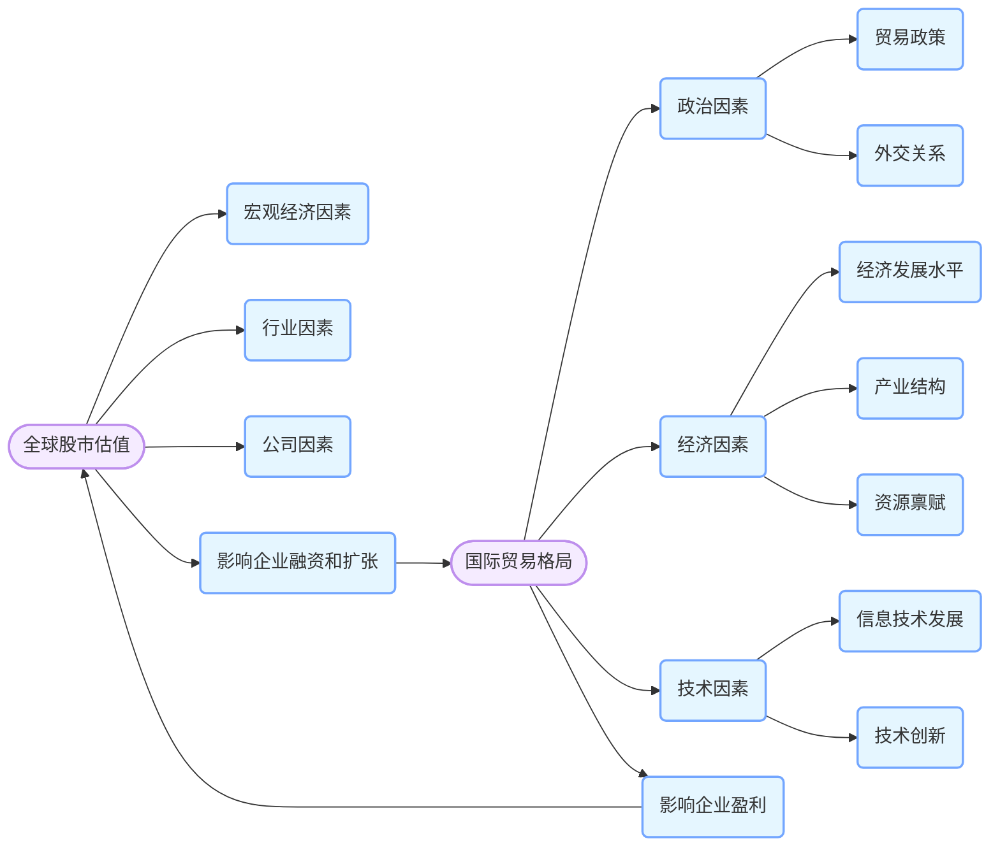

# 全球股市估值与国际贸易格局的互动

> 关键词：全球股市估值、国际贸易格局、互动关系、经济指标、市场动态

> 摘要：本文旨在深入探讨全球股市估值与国际贸易格局之间的互动关系。通过对核心概念的解析、算法原理的阐述、数学模型的构建，结合实际案例进行详细分析，揭示两者相互影响的内在机制。同时，介绍了在研究和实践中可运用的工具和资源，最后对未来发展趋势与挑战进行总结，并对常见问题给予解答。希望能为投资者、政策制定者和相关研究人员提供有价值的参考。

## 1. 背景介绍 
### 1.1 目的和范围
本研究的主要目的是全面分析全球股市估值与国际贸易格局之间的互动关系。通过对这一关系的深入理解，我们可以更好地预测市场趋势，为投资者提供决策依据，同时也有助于政策制定者制定合理的经济政策。研究范围涵盖了全球主要经济体的股市和国际贸易数据，时间跨度为过去几十年，以确保能够捕捉到不同经济周期下两者的互动特征。

### 1.2 预期读者
本文的预期读者包括金融投资者、经济分析师、政策制定者以及对全球经济和金融市场感兴趣的研究人员。对于投资者来说，了解全球股市估值与国际贸易格局的互动关系可以帮助他们优化投资组合，降低风险；经济分析师可以通过本文的研究方法和结论，进一步深入分析市场动态；政策制定者可以根据研究结果制定更加科学合理的经济政策，促进经济的稳定发展；研究人员则可以将本文作为进一步研究的基础，拓展相关领域的研究。

### 1.3 文档结构概述
本文将按照以下结构进行阐述：首先介绍核心概念与联系，明确全球股市估值和国际贸易格局的定义、影响因素以及两者之间的关联；接着讲解核心算法原理和具体操作步骤，通过 Python 代码实现相关算法；然后构建数学模型和公式，详细解释其原理并举例说明；再通过项目实战，展示代码实际案例并进行详细解释；之后探讨实际应用场景；推荐相关的工具和资源；总结未来发展趋势与挑战；最后提供附录，解答常见问题并列出扩展阅读和参考资料。

### 1.4 术语表
#### 1.4.1 核心术语定义
- **全球股市估值**：指对全球范围内各个股票市场中上市公司股票价值的评估。常用的估值指标包括市盈率（P/E）、市净率（P/B）等，它反映了市场对上市公司未来盈利能力和资产价值的预期。
- **国际贸易格局**：是指世界各国或地区之间贸易的规模、结构、流向等方面的总体状况。包括贸易额的大小、不同产业的贸易占比、主要贸易伙伴的分布等，它受到各国经济发展水平、政策、技术等多种因素的影响。

#### 1.4.2 相关概念解释
- **市盈率（P/E）**：是指股票价格除以每股收益（EPS）的比率。它反映了投资者为获取公司每一元盈利所愿意支付的价格，是衡量股票估值高低的重要指标之一。较高的市盈率通常表示市场对该公司未来盈利增长的预期较高，但也可能意味着股票被高估。
- **市净率（P/B）**：是指股票价格与每股净资产的比率。它反映了市场对公司净资产价值的评估，市净率越低，通常表示股票越具有投资价值，但也可能暗示公司存在经营问题。
- **贸易顺差**：指一个国家或地区在一定时期内（通常为一年）出口商品和服务的总值超过进口商品和服务的总值。贸易顺差意味着该国在国际贸易中处于有利地位，能够积累外汇储备，但也可能引发贸易摩擦等问题。
- **贸易逆差**：与贸易顺差相反，指一个国家或地区在一定时期内进口商品和服务的总值超过出口商品和服务的总值。贸易逆差可能反映该国国内消费需求旺盛，但长期的贸易逆差可能导致外债增加、货币贬值等问题。

#### 1.4.3 缩略词列表
- **P/E**：Price-to-Earnings Ratio，市盈率
- **P/B**：Price-to-Book Ratio，市净率
- **GDP**：Gross Domestic Product，国内生产总值

## 2. 核心概念与联系 

### 全球股市估值的概念与影响因素
全球股市估值是一个复杂的概念，它受到多种因素的影响。从宏观经济层面来看，GDP 增长率、通货膨胀率、利率等因素都会对股市估值产生重要影响。当 GDP 增长率较高时，通常意味着企业的盈利前景较好，市场对股票的预期也会相应提高，从而推动股市估值上升；通货膨胀率过高可能会导致企业成本上升，盈利下降，进而压低股市估值；利率的变化会影响资金的流向，当利率较低时，资金更倾向于流入股市，推动股价上涨，提高股市估值。

从行业层面来看，不同行业的发展前景和盈利能力也会导致股市估值的差异。例如，新兴科技行业通常具有较高的增长潜力，市场对其未来盈利的预期较高，因此其股市估值也相对较高；而传统制造业等行业的增长速度相对较慢，股市估值可能相对较低。

从公司层面来看，公司的业绩表现、治理结构、创新能力等因素也会影响其股票的估值。一家业绩优秀、治理良好、具有较强创新能力的公司，其股票往往会受到市场的青睐，估值也会较高。

### 国际贸易格局的概念与影响因素
国际贸易格局是全球经济活动的重要组成部分，它受到多种因素的综合影响。政治因素是影响国际贸易格局的重要因素之一，各国的贸易政策、外交关系等都会对贸易规模和流向产生影响。例如，贸易保护主义政策会限制进口，影响国际贸易的规模和结构；而自由贸易协定的签订则有助于促进贸易自由化，扩大贸易规模。

经济因素也是影响国际贸易格局的关键因素。各国的经济发展水平、产业结构、资源禀赋等都会决定其在国际贸易中的地位和比较优势。发达国家通常在高端制造业、服务业等领域具有较强的竞争力，出口的产品和服务附加值较高；而发展中国家则在劳动密集型产业和资源型产业方面具有一定的优势。

技术因素也在不断改变着国际贸易格局。随着信息技术的飞速发展，跨境电商等新型贸易模式不断涌现，降低了贸易成本，提高了贸易效率，促进了国际贸易的发展。同时，技术创新也会推动产业升级，改变各国的产业结构和比较优势，从而影响国际贸易格局。

### 全球股市估值与国际贸易格局的联系
全球股市估值与国际贸易格局之间存在着密切的联系。一方面，国际贸易格局的变化会对全球股市估值产生影响。当一个国家或地区的国际贸易状况改善，贸易顺差增加时，意味着该国企业的出口业务增长，盈利增加，从而会推动相关企业的股价上涨，提高股市估值。例如，中国在过去几十年中，随着出口的快速增长，相关制造业企业的业绩大幅提升，股市估值也相应提高。

另一方面，全球股市估值的变化也会影响国际贸易格局。当股市估值较高时，企业的融资成本相对较低，有利于企业扩大生产规模、进行技术创新和海外投资，从而促进出口增长，改变国际贸易格局。例如，美国的科技企业在股市高估值的情况下，能够获得大量的资金支持，进行海外扩张，提高其在全球市场的份额。

### 核心概念原理和架构的文本示意图
```plaintext
全球股市估值
|--宏观经济因素（GDP增长率、通货膨胀率、利率等）
|--行业因素（行业发展前景、盈利能力等）
|--公司因素（业绩表现、治理结构、创新能力等）

国际贸易格局
|--政治因素（贸易政策、外交关系等）
|--经济因素（经济发展水平、产业结构、资源禀赋等）
|--技术因素（信息技术发展、技术创新等）

全球股市估值与国际贸易格局的联系
|--国际贸易格局变化 -> 影响企业盈利 -> 影响股市估值
|--股市估值变化 -> 影响企业融资和扩张 -> 影响国际贸易格局
```

### Mermaid 流程图


## 3. 核心算法原理 & 具体操作步骤 

### 数据获取与预处理
在研究全球股市估值与国际贸易格局的互动关系时，首先需要获取相关的数据。股市估值数据可以从金融数据提供商（如 Bloomberg、Wind 等）获取，包括股票价格、每股收益、每股净资产等指标，通过这些指标可以计算出市盈率、市净率等估值指标。国际贸易数据可以从国际组织（如世界贸易组织、国际货币基金组织等）的官方网站获取，包括贸易额、贸易顺差/逆差等数据。

在获取数据后，需要对数据进行预处理。首先，要检查数据的完整性，处理缺失值和异常值。对于缺失值，可以采用插值法（如线性插值、多项式插值等）进行填充；对于异常值，可以采用统计方法（如基于标准差的方法）进行识别和处理。然后，对数据进行标准化处理，将不同指标的数据统一到相同的尺度上，以便后续的分析。

以下是使用 Python 进行数据获取和预处理的示例代码：
```python
import pandas as pd
import numpy as np
from sklearn.preprocessing import StandardScaler

# 模拟获取股市估值数据
stock_data = pd.DataFrame({
    'stock_price': [100, 110, 120, 130, 140],
    'earnings_per_share': [5, 6, 7, 8, 9],
    'book_value_per_share': [20, 22, 24, 26, 28]
})

# 计算市盈率和市净率
stock_data['pe_ratio'] = stock_data['stock_price'] / stock_data['earnings_per_share']
stock_data['pb_ratio'] = stock_data['stock_price'] / stock_data['book_value_per_share']

# 模拟获取国际贸易数据
trade_data = pd.DataFrame({
    'export_value': [1000, 1100, 1200, 1300, 1400],
    'import_value': [800, 900, 1000, 1100, 1200]
})

# 计算贸易顺差
trade_data['trade_surplus'] = trade_data['export_value'] - trade_data['import_value']

# 处理缺失值
stock_data = stock_data.fillna(method='ffill')
trade_data = trade_data.fillna(method='ffill')

# 标准化处理
scaler_stock = StandardScaler()
scaler_trade = StandardScaler()

stock_data_scaled = scaler_stock.fit_transform(stock_data[['pe_ratio', 'pb_ratio']])
trade_data_scaled = scaler_trade.fit_transform(trade_data[['trade_surplus']])

print("标准化后的股市估值数据：")
print(stock_data_scaled)
print("标准化后的国际贸易数据：")
print(trade_data_scaled)
```

### 相关性分析
在完成数据预处理后，需要分析全球股市估值与国际贸易格局之间的相关性。常用的相关性分析方法包括皮尔逊相关系数、斯皮尔曼相关系数等。皮尔逊相关系数适用于分析两个连续变量之间的线性相关性，其计算公式为：
$$r = \frac{\sum_{i=1}^{n}(x_i - \bar{x})(y_i - \bar{y})}{\sqrt{\sum_{i=1}^{n}(x_i - \bar{x})^2 \sum_{i=1}^{n}(y_i - \bar{y})^2}}$$
其中，$x_i$ 和 $y_i$ 分别是两个变量的第 $i$ 个观测值，$\bar{x}$ 和 $\bar{y}$ 分别是两个变量的均值，$n$ 是观测值的数量。

斯皮尔曼相关系数则适用于分析两个变量之间的单调相关性，它是基于变量的秩次来计算的。

以下是使用 Python 进行相关性分析的示例代码：
```python
import pandas as pd
import numpy as np
from scipy.stats import pearsonr, spearmanr

# 假设已经有标准化后的股市估值数据和国际贸易数据
stock_valuation = np.array([0.1, 0.2, 0.3, 0.4, 0.5])
trade_surplus = np.array([0.2, 0.3, 0.4, 0.5, 0.6])

# 计算皮尔逊相关系数和 p 值
pearson_corr, pearson_p = pearsonr(stock_valuation, trade_surplus)

# 计算斯皮尔曼相关系数和 p 值
spearman_corr, spearman_p = spearmanr(stock_valuation, trade_surplus)

print("皮尔逊相关系数：", pearson_corr)
print("皮尔逊 p 值：", pearson_p)
print("斯皮尔曼相关系数：", spearman_corr)
print("斯皮尔曼 p 值：", spearman_p)
```

### 因果关系分析
除了相关性分析，还需要进一步分析全球股市估值与国际贸易格局之间的因果关系。常用的因果关系分析方法包括格兰杰因果检验等。格兰杰因果检验的基本思想是，如果一个变量 $X$ 的过去值能够帮助预测另一个变量 $Y$ 的未来值，那么就可以认为 $X$ 是 $Y$ 的格兰杰原因。

以下是使用 Python 进行格兰杰因果检验的示例代码：
```python
import pandas as pd
from statsmodels.tsa.stattools import grangercausalitytests

# 假设已经有标准化后的股市估值数据和国际贸易数据
data = pd.DataFrame({
    'stock_valuation': [0.1, 0.2, 0.3, 0.4, 0.5],
    'trade_surplus': [0.2, 0.3, 0.4, 0.5, 0.6]
})

# 进行格兰杰因果检验
maxlag = 2
test_result = grangercausalitytests(data[['stock_valuation', 'trade_surplus']], maxlag=maxlag, verbose=False)

for lag in range(1, maxlag + 1):
    p_value = test_result[lag][0]['ssr_ftest'][1]
    print(f"滞后 {lag} 期的格兰杰因果检验 p 值：", p_value)
```

## 4. 数学模型和公式 & 详细讲解 & 举例说明 

### 线性回归模型
线性回归模型是一种常用的数学模型，用于分析两个或多个变量之间的线性关系。在研究全球股市估值与国际贸易格局的互动关系时，可以使用线性回归模型来分析国际贸易指标（如贸易顺差）对股市估值指标（如市盈率）的影响。

线性回归模型的一般形式为：
$$y = \beta_0 + \beta_1x_1 + \beta_2x_2 + \cdots + \beta_nx_n + \epsilon$$
其中，$y$ 是因变量（如市盈率），$x_1, x_2, \cdots, x_n$ 是自变量（如贸易顺差、GDP 增长率等），$\beta_0, \beta_1, \beta_2, \cdots, \beta_n$ 是回归系数，$\epsilon$ 是误差项。

回归系数 $\beta_i$ 表示自变量 $x_i$ 对因变量 $y$ 的影响程度。可以使用最小二乘法来估计回归系数，使得误差项的平方和最小。

以下是一个简单的线性回归模型的示例，假设我们只考虑贸易顺差对市盈率的影响：
$$PE = \beta_0 + \beta_1 \times TradeSurplus + \epsilon$$
其中，$PE$ 是市盈率，$TradeSurplus$ 是贸易顺差。

假设我们有以下数据：
| 贸易顺差（亿美元） | 市盈率 |
| --- | --- |
| 100 | 15 |
| 200 | 18 |
| 300 | 21 |
| 400 | 24 |
| 500 | 27 |

使用最小二乘法可以估计出回归系数 $\beta_0$ 和 $\beta_1$。具体步骤如下：
1. 计算自变量和因变量的均值：
   - $\bar{x} = \frac{100 + 200 + 300 + 400 + 500}{5} = 300$
   - $\bar{y} = \frac{15 + 18 + 21 + 24 + 27}{5} = 21$
2. 计算回归系数 $\beta_1$：
   - $\beta_1 = \frac{\sum_{i=1}^{n}(x_i - \bar{x})(y_i - \bar{y})}{\sum_{i=1}^{n}(x_i - \bar{x})^2}$
   - 计算分子：
     - $(100 - 300)(15 - 21) + (200 - 300)(18 - 21) + (300 - 300)(21 - 21) + (400 - 300)(24 - 21) + (500 - 300)(27 - 21)$
     - $= (-200)(-6) + (-100)(-3) + 0 + 100 \times 3 + 200 \times 6$
     - $= 1200 + 300 + 0 + 300 + 1200 = 3000$
   - 计算分母：
     - $(100 - 300)^2 + (200 - 300)^2 + (300 - 300)^2 + (400 - 300)^2 + (500 - 300)^2$
     - $= (-200)^2 + (-100)^2 + 0 + 100^2 + 200^2$
     - $= 40000 + 10000 + 0 + 10000 + 40000 = 100000$
   - 则 $\beta_1 = \frac{3000}{100000} = 0.03$
3. 计算回归系数 $\beta_0$：
   - $\beta_0 = \bar{y} - \beta_1\bar{x} = 21 - 0.03 \times 300 = 21 - 9 = 12$

所以，回归方程为 $PE = 12 + 0.03 \times TradeSurplus$。这意味着贸易顺差每增加 1 亿美元，市盈率平均增加 0.03。

### 向量自回归（VAR）模型
向量自回归（VAR）模型是一种多变量时间序列模型，用于分析多个变量之间的动态关系。在研究全球股市估值与国际贸易格局的互动关系时，可以使用 VAR 模型来同时考虑多个股市估值指标和国际贸易指标之间的相互影响。

VAR 模型的一般形式为：
$$Y_t = A_1Y_{t-1} + A_2Y_{t-2} + \cdots + A_pY_{t-p} + \epsilon_t$$
其中，$Y_t$ 是一个 $k$ 维向量，包含 $k$ 个变量（如市盈率、市净率、贸易顺差等），$A_1, A_2, \cdots, A_p$ 是 $k \times k$ 维的系数矩阵，$p$ 是滞后阶数，$\epsilon_t$ 是 $k$ 维的误差向量。

VAR 模型的估计可以使用最小二乘法或极大似然估计法。在估计出模型的系数后，可以进行脉冲响应分析和方差分解，以进一步分析变量之间的动态关系。

例如，假设我们有两个变量：市盈率 $PE$ 和贸易顺差 $TradeSurplus$，VAR(1) 模型的形式为：
$$
\begin{bmatrix}
PE_t \\
TradeSurplus_t
\end{bmatrix}
=
\begin{bmatrix}
a_{11} & a_{12} \\
a_{21} & a_{22}
\end{bmatrix}
\begin{bmatrix}
PE_{t-1} \\
TradeSurplus_{t-1}
\end{bmatrix}
+
\begin{bmatrix}
\epsilon_{1t} \\
\epsilon_{2t}
\end{bmatrix}
$$

其中，$a_{ij}$ 是系数，$\epsilon_{it}$ 是误差项。

### 协整分析
协整分析用于检验两个或多个非平稳时间序列之间是否存在长期稳定的关系。在研究全球股市估值与国际贸易格局的互动关系时，由于股市估值和国际贸易数据通常是非平稳的时间序列，因此需要进行协整分析来确定它们之间是否存在长期均衡关系。

如果两个时间序列 $x_t$ 和 $y_t$ 都是非平稳的，但它们的线性组合 $z_t = x_t - \beta y_t$ 是平稳的，则称 $x_t$ 和 $y_t$ 是协整的，$\beta$ 是协整系数。

协整分析的步骤如下：
1. 对时间序列进行单位根检验，确定它们是否是非平稳的。常用的单位根检验方法包括 ADF 检验、PP 检验等。
2. 如果两个时间序列都是非平稳的，则进行协整检验。常用的协整检验方法包括 Engle-Granger 两步法、Johansen 检验等。
3. 如果存在协整关系，则可以建立误差修正模型（ECM）来分析变量之间的短期动态调整过程。

例如，假设我们有市盈率 $PE$ 和贸易顺差 $TradeSurplus$ 两个时间序列，经过单位根检验发现它们都是非平稳的。然后进行协整检验，发现它们存在协整关系。可以建立如下的误差修正模型：
$$\Delta PE_t = \alpha_1 + \beta_1 \Delta TradeSurplus_t + \gamma_1 (PE_{t-1} - \beta TradeSurplus_{t-1}) + \epsilon_{1t}$$
$$\Delta TradeSurplus_t = \alpha_2 + \beta_2 \Delta PE_t + \gamma_2 (PE_{t-1} - \beta TradeSurplus_{t-1}) + \epsilon_{2t}$$
其中，$\Delta$ 表示一阶差分，$\alpha_i$ 是截距项，$\beta_i$ 是短期调整系数，$\gamma_i$ 是误差修正系数，$\epsilon_{it}$ 是误差项。

## 5. 项目实战：代码实际案例和详细解释说明 

### 5.1  开发环境搭建
在进行项目实战之前，需要搭建相应的开发环境。以下是具体的步骤：
1. **安装 Python**：建议使用 Python 3.7 及以上版本。可以从 Python 官方网站（https://www.python.org/downloads/）下载安装包，按照安装向导进行安装。
2. **安装必要的库**：需要安装以下常用的 Python 库：
   - **pandas**：用于数据处理和分析。可以使用以下命令进行安装：
     ```sh
     pip install pandas
     ```
   - **numpy**：用于科学计算。安装命令如下：
     ```sh
     pip install numpy
     ```
   - **scikit-learn**：用于机器学习和数据预处理。安装命令如下：
     ```sh
     pip install scikit-learn
     ```
   - **statsmodels**：用于统计建模和时间序列分析。安装命令如下：
     ```sh
     pip install statsmodels
     ```
   - **matplotlib**：用于数据可视化。安装命令如下：
     ```sh
     pip install matplotlib
     ```

### 5.2  源代码详细实现和代码解读
以下是一个完整的项目实战代码示例，包括数据获取、预处理、相关性分析、线性回归分析和可视化：
```python
import pandas as pd
import numpy as np
from scipy.stats import pearsonr
from sklearn.linear_model import LinearRegression
import matplotlib.pyplot as plt

# 模拟获取股市估值数据
stock_data = pd.DataFrame({
    'stock_price': [100, 110, 120, 130, 140],
    'earnings_per_share': [5, 6, 7, 8, 9],
    'book_value_per_share': [20, 22, 24, 26, 28]
})

# 计算市盈率和市净率
stock_data['pe_ratio'] = stock_data['stock_price'] / stock_data['earnings_per_share']
stock_data['pb_ratio'] = stock_data['stock_price'] / stock_data['book_value_per_share']

# 模拟获取国际贸易数据
trade_data = pd.DataFrame({
    'export_value': [1000, 1100, 1200, 1300, 1400],
    'import_value': [800, 900, 1000, 1100, 1200]
})

# 计算贸易顺差
trade_data['trade_surplus'] = trade_data['export_value'] - trade_data['import_value']

# 数据合并
combined_data = pd.concat([stock_data[['pe_ratio']], trade_data[['trade_surplus']]], axis=1)

# 相关性分析
pearson_corr, pearson_p = pearsonr(combined_data['pe_ratio'], combined_data['trade_surplus'])
print("皮尔逊相关系数：", pearson_corr)
print("皮尔逊 p 值：", pearson_p)

# 线性回归分析
X = combined_data[['trade_surplus']]
y = combined_data['pe_ratio']

model = LinearRegression()
model.fit(X, y)

# 输出回归系数和截距
print("回归系数：", model.coef_[0])
print("截距：", model.intercept_)

# 预测
new_trade_surplus = np.array([1500]).reshape(-1, 1)
predicted_pe_ratio = model.predict(new_trade_surplus)
print("预测的市盈率：", predicted_pe_ratio[0])

# 可视化
plt.scatter(combined_data['trade_surplus'], combined_data['pe_ratio'])
plt.plot(combined_data['trade_surplus'], model.predict(X), color='red')
plt.xlabel('贸易顺差')
plt.ylabel('市盈率')
plt.title('贸易顺差与市盈率的关系')
plt.show()
```

### 代码解读与分析
1. **数据获取与处理**：首先模拟获取了股市估值数据和国际贸易数据，并计算了市盈率、市净率和贸易顺差。然后将股市估值数据和国际贸易数据进行合并，得到一个综合的数据集。
2. **相关性分析**：使用 `pearsonr` 函数计算了市盈率和贸易顺差之间的皮尔逊相关系数和 p 值，以判断两者之间的线性相关性。
3. **线性回归分析**：使用 `LinearRegression` 类建立了线性回归模型，将贸易顺差作为自变量，市盈率作为因变量进行拟合。然后输出了回归系数和截距，回归系数表示贸易顺差对市盈率的影响程度，截距表示当贸易顺差为 0 时的市盈率估计值。
4. **预测**：使用训练好的模型对新的贸易顺差数据进行预测，得到预测的市盈率。
5. **可视化**：使用 `matplotlib` 库绘制了散点图和拟合直线，直观地展示了贸易顺差和市盈率之间的关系。

## 6. 实际应用场景 
### 投资者决策
对于投资者来说，了解全球股市估值与国际贸易格局的互动关系可以帮助他们做出更明智的投资决策。当国际贸易格局发生变化，如某个国家的贸易顺差增加时，相关出口企业的业绩可能会提升，其股票的估值也可能会上升。投资者可以根据这一趋势，增加对相关企业股票的投资。例如，当中国的贸易顺差持续扩大时，投资者可以关注出口导向型企业，如制造业、电子科技等行业的股票。

同时，投资者还可以通过分析股市估值与国际贸易格局的相关性，进行资产配置的调整。如果发现股市估值与国际贸易指标之间存在较强的正相关关系，当国际贸易形势向好时，可以增加股票资产的配置比例；反之，则可以适当减少股票资产的配置，增加债券、现金等避险资产的比例。

### 政策制定
政策制定者可以根据全球股市估值与国际贸易格局的互动关系制定更加科学合理的经济政策。当股市估值过高，可能存在泡沫风险时，政策制定者可以通过调整货币政策、财政政策等手段来稳定股市。例如，提高利率可以减少资金流入股市，降低股市估值；增加税收可以抑制企业的过度投资和扩张，防止股市泡沫的形成。

在国际贸易方面，政策制定者可以根据股市估值的变化来调整贸易政策。如果股市估值的上升主要是由于出口企业的业绩增长带动的，政策制定者可以继续推行促进出口的政策，如降低关税、提供出口补贴等；如果股市估值的上升与国际贸易关系不大，政策制定者则可以更加关注国内市场的需求，通过扩大内需来促进经济的稳定增长。

### 企业战略规划
企业在制定战略规划时，也需要考虑全球股市估值与国际贸易格局的互动关系。当国际贸易格局发生变化时，企业需要及时调整自身的经营策略。例如，当某个国家的贸易保护主义政策加强，出口面临困难时，企业可以加大对国内市场的开拓力度，或者寻找新的海外市场。

同时，企业还可以根据股市估值的变化来进行融资决策。当股市估值较高时，企业可以通过发行股票等方式进行融资，获取更多的资金用于扩大生产规模、进行技术创新等；当股市估值较低时，企业可以选择通过债务融资等方式来满足资金需求。

### 经济预测与预警
通过分析全球股市估值与国际贸易格局的互动关系，可以对经济形势进行预测和预警。如果发现股市估值与国际贸易指标之间的关系发生了异常变化，可能预示着经济即将出现波动。例如，当股市估值持续上升，但国际贸易数据却出现下滑时，可能意味着股市存在泡沫风险，经济可能面临衰退的压力。

政府和相关机构可以建立经济预警机制，根据股市估值和国际贸易数据的变化情况，及时发布预警信息，提醒投资者、企业和政策制定者采取相应的措施，防范经济风险。

## 7. 工具和资源推荐
### 7.1 学习资源推荐
#### 7.1.1 书籍推荐
- 《金融市场与金融机构》（*Financial Markets and Institutions*）：这本书全面介绍了金融市场和金融机构的基本概念、运作机制和相关理论，对于理解全球股市估值和国际贸易格局的金融背景非常有帮助。
- 《国际贸易学》（*International Trade*）：系统阐述了国际贸易的基本理论、政策和实践，包括比较优势理论、贸易保护主义、区域经济一体化等内容，有助于深入了解国际贸易格局的形成和发展。
- 《计量经济学》（*Econometrics*）：计量经济学是研究经济变量之间数量关系的学科，这本书介绍了计量经济学的基本方法和模型，如线性回归模型、时间序列分析等，对于分析全球股市估值与国际贸易格局的互动关系提供了重要的工具和方法。

#### 7.1.2 在线课程
- Coursera 上的“金融市场”（*Financial Markets*）课程：由耶鲁大学教授罗伯特·席勒（Robert Shiller）授课，课程内容涵盖了金融市场的各个方面，包括股票市场、债券市场、衍生品市场等，对于理解全球股市估值的原理和影响因素非常有帮助。
- edX 上的“国际贸易与金融”（*International Trade and Finance*）课程：该课程介绍了国际贸易和金融的基本理论和实践，包括贸易政策、汇率制度、国际收支等内容，有助于深入了解国际贸易格局的动态变化。
- 中国大学 MOOC 上的“计量经济学”课程：由国内知名高校的教授授课，系统讲解了计量经济学的基本原理和方法，包括线性回归模型、时间序列分析、面板数据模型等，为分析全球股市估值与国际贸易格局的关系提供了实用的分析工具。

#### 7.1.3 技术博客和网站
- 华尔街见闻（https://wallstreetcn.com/）：提供全球金融市场的实时资讯、分析和评论，包括股市、汇市、债市等，对于了解全球股市估值和国际贸易格局的最新动态非常有帮助。
- 世界贸易组织（https://www.wto.org/）：世界贸易组织的官方网站，提供了丰富的国际贸易数据、政策文件和研究报告，是研究国际贸易格局的重要信息来源。
- 国家统计局（https://data.stats.gov.cn/）：中国国家统计局的官方网站，提供了中国的宏观经济数据，包括 GDP、贸易数据、物价指数等，对于分析中国的股市估值和国际贸易格局具有重要的参考价值。

### 7.2 开发工具框架推荐
#### 7.2.1 IDE和编辑器
- PyCharm：是一款专业的 Python 集成开发环境（IDE），具有代码编辑、调试、版本控制等功能，支持多种 Python 库和框架，对于开发和调试分析全球股市估值与国际贸易格局关系的 Python 代码非常方便。
- Jupyter Notebook：是一个交互式的开发环境，支持多种编程语言，如 Python、R 等。可以在浏览器中运行代码、展示数据可视化结果和撰写文档，非常适合进行数据分析和研究。

#### 7.2.2 调试和性能分析工具
- PDB：是 Python 内置的调试器，可以在代码中设置断点，逐步执行代码，查看变量的值和程序的执行流程，帮助开发者快速定位和解决代码中的问题。
- cProfile：是 Python 标准库中的性能分析工具，可以统计代码中各个函数的执行时间和调用次数，帮助开发者找出代码中的性能瓶颈，进行优化。

#### 7.2.3 相关框架和库
- Pandas：是一个强大的数据处理和分析库，提供了 DataFrame 和 Series 等数据结构，支持数据的读取、清洗、转换和分析，是处理全球股市估值和国际贸易数据的重要工具。
- Numpy：是 Python 的科学计算库，提供了高效的多维数组对象和各种数学函数，用于进行数值计算和矩阵运算，在数据分析和建模中广泛应用。
- Scikit-learn：是一个机器学习库，提供了各种机器学习算法和工具，如线性回归、逻辑回归、决策树等，用于建立和训练分析全球股市估值与国际贸易格局关系的模型。

### 7.3 相关论文著作推荐
#### 7.3.1 经典论文
- “The Influence of International Trade on Stock Market Valuations”（国际贸易对股市估值的影响）：该论文深入分析了国际贸易格局的变化对股市估值的影响机制，通过实证研究验证了两者之间的相关性和因果关系。
- “Stock Market Valuation and International Trade Flows: A Dynamic Analysis”（股市估值与国际贸易流量：动态分析）：运用动态模型研究了股市估值和国际贸易流量之间的长期动态关系，为理解两者的互动提供了新的视角。

#### 7.3.2 最新研究成果
- 近年来，随着人工智能和大数据技术的发展，一些研究开始运用机器学习和深度学习算法来分析全球股市估值与国际贸易格局的关系。例如，使用神经网络模型预测股市估值的变化趋势，以及分析国际贸易数据中的隐含信息。
- 还有一些研究关注了新兴经济体在全球股市估值和国际贸易格局中的作用，探讨了新兴经济体的崛起对传统国际贸易格局和股市估值体系的影响。

#### 7.3.3 应用案例分析
- 一些研究通过具体的案例分析，展示了全球股市估值与国际贸易格局的互动在实际经济中的表现。例如，分析了美国贸易政策的变化对全球股市和国际贸易的影响，以及中国“一带一路”倡议对相关国家股市估值和贸易格局的推动作用。

## 8. 总结：未来发展趋势与挑战
### 未来发展趋势
#### 数字化和智能化趋势
随着信息技术的飞速发展，全球股市估值和国际贸易格局将呈现出更加数字化和智能化的趋势。金融科技的应用将使得股市交易更加便捷、高效，同时也为股市估值的分析和预测提供了更多的数据和工具。例如，人工智能算法可以对海量的股市数据和国际贸易数据进行实时分析，提供更准确的市场预测和投资建议。

在国际贸易方面，数字化贸易将成为未来的发展方向。跨境电商、数字服务贸易等新型贸易模式将不断涌现，降低贸易成本，提高贸易效率。同时，区块链技术的应用将增强国际贸易的透明度和安全性，促进贸易的便利化。

#### 区域化和多元化趋势
全球贸易保护主义的抬头和地缘政治的不确定性将促使国际贸易格局呈现出区域化和多元化的趋势。各国将更加注重区域经济合作，加强与周边国家的贸易往来，形成区域贸易集团。例如，亚洲地区的区域全面经济伙伴关系协定（RCEP）的签订，将促进亚洲地区的贸易自由化和经济一体化。

在股市估值方面，不同地区和行业的差异将更加明显。新兴经济体的股市将具有更大的发展潜力，一些新兴行业如新能源、人工智能、生物医药等将受到市场的更多关注，其股市估值也可能会出现较大的波动。

#### 绿色发展趋势
随着全球对气候变化和环境保护的关注度不断提高，绿色发展将成为未来全球股市估值和国际贸易格局的重要影响因素。在股市方面，绿色产业相关的股票将受到投资者的青睐，如可再生能源、节能环保等行业的企业。这些企业的业绩增长和股市估值可能会受到政策支持和市场需求的推动。

在国际贸易方面，绿色贸易壁垒将逐渐增加，各国将对进口产品的环保标准提出更高的要求。这将促使企业加强环保意识，推动绿色技术的研发和应用，从而影响国际贸易的结构和流向。

### 挑战
#### 数据质量和安全问题
在数字化和智能化的时代，数据是分析全球股市估值和国际贸易格局的重要基础。然而，数据质量和安全问题也成为了一个严峻的挑战。数据的准确性、完整性和一致性直接影响到分析结果的可靠性。同时，数据的安全问题也不容忽视，金融和贸易数据涉及到大量的敏感信息，如果数据泄露，将给企业和国家带来巨大的损失。

#### 贸易保护主义和地缘政治风险
贸易保护主义和地缘政治的不确定性给全球股市估值和国际贸易格局带来了很大的挑战。贸易保护主义政策如关税壁垒、贸易限制等将影响国际贸易的规模和结构，导致相关企业的业绩下滑，进而影响股市估值。地缘政治冲突如战争、地区动荡等也会对全球金融市场和贸易格局产生负面影响，增加市场的不确定性和风险。

#### 模型和算法的局限性
在分析全球股市估值和国际贸易格局的互动关系时，我们通常会使用各种模型和算法。然而，这些模型和算法都存在一定的局限性。例如，线性回归模型假设变量之间存在线性关系，但实际情况可能更为复杂；时间序列模型需要满足一定的前提条件，如平稳性等，如果数据不满足这些条件，模型的预测效果可能会受到影响。因此，如何选择合适的模型和算法，以及如何对模型进行改进和优化，是一个需要解决的问题。

## 9. 附录：常见问题与解答
### 1. 如何判断股市估值是否过高或过低？
判断股市估值是否过高或过低可以从多个方面进行分析。常用的估值指标包括市盈率（P/E）、市净率（P/B）等。可以将当前的估值指标与历史数据进行比较，如果当前的估值指标明显高于历史平均水平，可能意味着股市估值过高；反之，如果明显低于历史平均水平，则可能意味着股市估值过低。

此外，还可以将不同国家或地区的股市估值进行比较，以及与宏观经济指标进行对比。例如，如果股市估值的上升与宏观经济基本面的增长不匹配，可能存在估值过高的风险。

### 2. 国际贸易格局的变化对哪些行业的股市估值影响较大？
国际贸易格局的变化对出口导向型行业和资源依赖型行业的股市估值影响较大。出口导向型行业如制造业、电子科技、纺织服装等，其业绩直接受到国际贸易形势的影响。当国际贸易形势向好，出口增加时，这些行业的企业业绩会提升，股市估值也可能会上升；反之，当国际贸易形势恶化，出口受阻时，这些行业的企业业绩会下滑，股市估值也可能会下降。

资源依赖型行业如石油、矿产等，其产品的价格和需求也与国际贸易密切相关。国际贸易格局的变化会影响资源的供需关系和价格走势，从而影响相关企业的业绩和股市估值。

### 3. 如何运用数学模型分析全球股市估值与国际贸易格局的互动关系？
可以运用多种数学模型来分析全球股市估值与国际贸易格局的互动关系。常用的模型包括线性回归模型、向量自回归（VAR）模型、协整分析等。

线性回归模型可以用于分析国际贸易指标（如贸易顺差）对股市估值指标（如市盈率）的影响，通过估计回归系数来确定两者之间的关系。

VAR 模型可以同时考虑多个股市估值指标和国际贸易指标之间的相互影响，分析它们的动态变化关系。

协整分析可以检验股市估值和国际贸易数据之间是否存在长期稳定的关系，如果存在协整关系，可以建立误差修正模型来分析变量之间的短期动态调整过程。

### 4. 投资者如何根据全球股市估值与国际贸易格局的互动关系进行投资决策？
投资者可以从以下几个方面根据全球股市估值与国际贸易格局的互动关系进行投资决策：
- **行业选择**：关注出口导向型行业和受益于国际贸易政策的行业。当国际贸易形势向好时，可以增加对这些行业股票的投资；当国际贸易形势恶化时，可以适当减少投资。
- **资产配置**：根据股市估值和国际贸易指标的变化，调整资产配置比例。当股市估值过高且国际贸易形势不稳定时，可以增加债券、现金等避险资产的配置；当股市估值合理且国际贸易形势向好时，可以增加股票资产的配置。
- **关注宏观经济政策**：政府的宏观经济政策如货币政策、财政政策和贸易政策等会影响全球股市估值和国际贸易格局。投资者需要关注政策的变化，及时调整投资策略。

### 5. 政策制定者如何利用全球股市估值与国际贸易格局的互动关系制定政策？
政策制定者可以从以下几个方面利用全球股市估值与国际贸易格局的互动关系制定政策：
- **稳定股市**：当股市估值过高，可能存在泡沫风险时，政策制定者可以通过调整货币政策、财政政策等手段来稳定股市。例如，提高利率可以减少资金流入股市，降低股市估值；增加税收可以抑制企业的过度投资和扩张，防止股市泡沫的形成。
- **促进国际贸易**：根据股市估值的变化来调整贸易政策。如果股市估值的上升主要是由于出口企业的业绩增长带动的，政策制定者可以继续推行促进出口的政策，如降低关税、提供出口补贴等；如果股市估值的上升与国际贸易关系不大，政策制定者则可以更加关注国内市场的需求，通过扩大内需来促进经济的稳定增长。
- **防范经济风险**：建立经济预警机制，根据股市估值和国际贸易数据的变化情况，及时发布预警信息，提醒投资者、企业和政策制定者采取相应的措施，防范经济风险。

## 10. 扩展阅读 & 参考资料
### 扩展阅读
- 《金融炼金术》（*The Alchemy of Finance*）：作者乔治·索罗斯（George Soros）在书中阐述了他的反身性理论，该理论认为市场参与者的认知和行为会影响市场的走势，而市场的走势又会反过来影响参与者的认知和行为。这一理论对于理解全球股市估值和国际贸易格局的动态变化具有重要的启示作用。
- 《资本的秘密》（*The Mystery of Capital*）：作者赫尔南多·德·索托（Hernando de Soto）探讨了资本的本质和作用，以及如何通过制度创新来释放资本的潜力。这本书对于理解国际贸易和金融市场的发展具有一定的参考