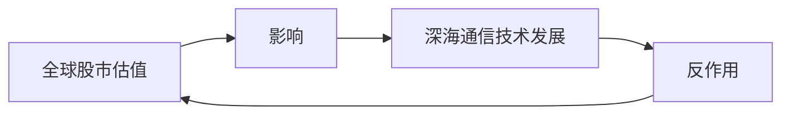

# 全球股市估值与深海通信技术的发展

> 关键词：全球股市估值、深海通信技术、经济影响、技术创新、市场趋势

> 摘要：本文旨在深入探讨全球股市估值与深海通信技术发展之间的关联。首先介绍了研究的背景、目的、预期读者等内容。接着详细阐述了全球股市估值和深海通信技术的核心概念及其联系，通过Python代码讲解了相关算法原理和操作步骤，同时给出了涉及的数学模型和公式。在项目实战部分，以具体案例展示了开发环境搭建、代码实现及解读。分析了深海通信技术在不同领域的实际应用场景，推荐了学习该领域知识的工具和资源。最后总结了未来发展趋势与挑战，解答了常见问题，并提供了扩展阅读和参考资料，有助于读者全面理解全球股市估值与深海通信技术发展的内在关系和影响。

## 1. 背景介绍 
### 1.1 目的和范围
本研究的主要目的是揭示全球股市估值与深海通信技术发展之间的相互关系和影响机制。通过对全球股市估值的分析，我们可以了解资本市场对深海通信技术相关企业的预期和评价，而深海通信技术的发展状况又会在一定程度上影响相关企业的业绩和市场表现，进而影响股市估值。研究范围涵盖了全球主要股票市场中与深海通信技术相关的企业，包括从事深海通信设备制造、系统集成、服务提供等领域的企业。同时，也会关注深海通信技术的发展趋势、创新成果以及政策环境等因素对股市估值的影响。

### 1.2 预期读者
本文的预期读者包括金融投资者、科技爱好者、企业管理者、政策制定者以及相关领域的研究人员。金融投资者可以从本文中获取关于深海通信技术相关股票的投资分析和建议；科技爱好者能够了解深海通信技术的最新发展动态及其在经济领域的影响；企业管理者可以参考本文对市场趋势的分析，制定企业的发展战略；政策制定者可以根据研究结果制定相关的产业政策；研究人员则可以在本文的基础上进行更深入的学术研究。

### 1.3 文档结构概述
本文共分为十个部分。第一部分是背景介绍，阐述了研究的目的、范围、预期读者和文档结构。第二部分介绍了全球股市估值和深海通信技术的核心概念及其联系，并给出了相应的文本示意图和Mermaid流程图。第三部分详细讲解了核心算法原理和具体操作步骤，使用Python代码进行了示例。第四部分介绍了相关的数学模型和公式，并通过具体例子进行了说明。第五部分是项目实战，包括开发环境搭建、源代码实现和代码解读。第六部分分析了深海通信技术的实际应用场景。第七部分推荐了学习该领域知识的工具和资源，包括书籍、在线课程、技术博客、开发工具和相关论文等。第八部分总结了未来发展趋势与挑战。第九部分是附录，解答了常见问题。第十部分提供了扩展阅读和参考资料。

### 1.4 术语表
#### 1.4.1 核心术语定义
- **全球股市估值**：指对全球范围内各个股票市场中上市公司股票价值的评估，通常通过市盈率、市净率等指标来衡量。
- **深海通信技术**：是指用于在深海环境下实现信息传输和通信的技术，包括水下声学通信、水下光通信、卫星与水下通信等技术手段。
- **市盈率（P/E）**：是指股票价格除以每股收益的比率，反映了市场对公司未来盈利的预期。
- **市净率（P/B）**：是指股票价格除以每股净资产的比率，反映了市场对公司净资产的估值。

#### 1.4.2 相关概念解释
- **资本市场**：是指进行中长期资金借贷和证券交易的市场，包括股票市场、债券市场等。
- **技术创新**：是指通过引入新的技术、方法或理念，创造出具有更高价值的产品或服务的过程。
- **产业政策**：是指政府为了促进特定产业的发展而制定的一系列政策措施，包括财政补贴、税收优惠、研发支持等。

#### 1.4.3 缩略词列表
- **P/E**：市盈率（Price-to-Earnings Ratio）
- **P/B**：市净率（Price-to-Book Ratio）
- **AI**：人工智能（Artificial Intelligence）
- **IoT**：物联网（Internet of Things）

## 2. 核心概念与联系 

### 全球股市估值
全球股市估值是对全球股票市场中上市公司价值的综合评估。它反映了投资者对上市公司未来盈利能力、市场竞争力和发展前景的预期。常见的估值指标包括市盈率（P/E）、市净率（P/B）、股息率等。市盈率是最常用的估值指标之一，它表示投资者为了获得公司每股盈利愿意支付的价格倍数。市净率则反映了公司股票价格与每股净资产的关系，市净率越低，通常表示股票越具有投资价值。

### 深海通信技术
深海通信技术是实现深海环境下信息传输和通信的关键技术。由于深海环境的特殊性，如高压、低温、高盐度、强腐蚀性等，传统的通信技术在深海中难以有效应用。因此，需要开发专门的深海通信技术来满足深海探测、海洋资源开发、海洋科学研究等领域的通信需求。目前，主要的深海通信技术包括水下声学通信、水下光通信和卫星与水下通信等。

### 两者的联系
深海通信技术的发展对全球股市估值有着重要的影响。一方面，深海通信技术的创新和突破会为相关企业带来新的业务机会和增长空间，从而提高企业的盈利能力和市场竞争力，进而推动相关股票的估值上升。例如，当一家企业研发出更高效、更稳定的水下声学通信设备时，其市场份额可能会扩大，利润也会相应增加，投资者对该企业的预期也会提高，导致其股票价格上涨，估值上升。另一方面，全球股市估值的变化也会影响深海通信技术的发展。当股市估值较高时，相关企业可以通过发行股票等方式筹集更多的资金，用于技术研发和业务拓展，从而推动深海通信技术的发展。相反，当股市估值较低时，企业的融资难度会增加，可能会影响技术研发的投入和进度。

### 文本示意图
```plaintext
全球股市估值
    |
    | 影响
    |
深海通信技术发展
    |
    | 反作用
    |
全球股市估值
```

### Mermaid流程图


## 3. 核心算法原理 & 具体操作步骤 

### 股市估值计算算法
股市估值的计算通常涉及到市盈率和市净率等指标的计算。以下是使用Python实现市盈率和市净率计算的代码示例：

```python
# 定义计算市盈率的函数
def calculate_pe_ratio(stock_price, earnings_per_share):
    """
    计算市盈率
    :param stock_price: 股票价格
    :param earnings_per_share: 每股收益
    :return: 市盈率
    """
    if earnings_per_share == 0:
        return float('inf')
    return stock_price / earnings_per_share

# 定义计算市净率的函数
def calculate_pb_ratio(stock_price, book_value_per_share):
    """
    计算市净率
    :param stock_price: 股票价格
    :param book_value_per_share: 每股净资产
    :return: 市净率
    """
    if book_value_per_share == 0:
        return float('inf')
    return stock_price / book_value_per_share

# 示例数据
stock_price = 50
earnings_per_share = 2
book_value_per_share = 10

# 计算市盈率和市净率
pe_ratio = calculate_pe_ratio(stock_price, earnings_per_share)
pb_ratio = calculate_pb_ratio(stock_price, book_value_per_share)

print(f"市盈率: {pe_ratio}")
print(f"市净率: {pb_ratio}")
```

### 操作步骤
1. **数据收集**：收集股票的价格、每股收益和每股净资产等数据。这些数据可以从金融数据提供商、证券交易所网站等渠道获取。
2. **数据预处理**：对收集到的数据进行清洗和整理，确保数据的准确性和完整性。
3. **调用函数计算**：使用上述定义的函数计算市盈率和市净率。
4. **结果分析**：根据计算结果对股票的估值进行分析和评估。一般来说，市盈率较低的股票可能被低估，具有投资价值；而市净率较低的股票可能具有较高的安全边际。

## 4. 数学模型和公式 & 详细讲解 & 举例说明 

### 市盈率（P/E）模型
市盈率的计算公式为：
$$P/E = \frac{P}{EPS}$$
其中，$P$ 表示股票价格，$EPS$ 表示每股收益。

市盈率反映了投资者为了获得公司每股盈利愿意支付的价格倍数。例如，某股票的价格为 $50$ 元，每股收益为 $2$ 元，则该股票的市盈率为：
$$P/E = \frac{50}{2} = 25$$
这意味着投资者愿意为该公司每股 $2$ 元的盈利支付 $25$ 倍的价格。

### 市净率（P/B）模型
市净率的计算公式为：
$$P/B = \frac{P}{BVPS}$$
其中，$P$ 表示股票价格，$BVPS$ 表示每股净资产。

市净率反映了公司股票价格与每股净资产的关系。例如，某股票的价格为 $50$ 元，每股净资产为 $10$ 元，则该股票的市净率为：
$$P/B = \frac{50}{10} = 5$$
这意味着该股票的价格是每股净资产的 $5$ 倍。

### 举例说明
假设我们有两家公司，公司 A 和公司 B。公司 A 的股票价格为 $100$ 元，每股收益为 $5$ 元，每股净资产为 $20$ 元；公司 B 的股票价格为 $80$ 元，每股收益为 $4$ 元，每股净资产为 $15$ 元。

- **计算市盈率**：
  - 公司 A 的市盈率：$P/E_A = \frac{100}{5} = 20$
  - 公司 B 的市盈率：$P/E_B = \frac{80}{4} = 20$
  两家公司的市盈率相同，说明市场对它们的盈利预期相同。

- **计算市净率**：
  - 公司 A 的市净率：$P/B_A = \frac{100}{20} = 5$
  - 公司 B 的市净率：$P/B_B = \frac{80}{15} \approx 5.33$
  公司 A 的市净率较低，说明相对于公司 B，公司 A 的股票更具有投资价值，因为它的价格相对于净资产更低。

## 5. 项目实战：代码实际案例和详细解释说明 

### 5.1  开发环境搭建
为了进行股市估值和深海通信技术相关的项目实战，我们需要搭建一个合适的开发环境。以下是具体的搭建步骤：

1. **安装Python**：Python是一种广泛使用的编程语言，具有丰富的科学计算和数据分析库。我们可以从Python官方网站（https://www.python.org/downloads/）下载并安装最新版本的Python。
2. **安装必要的库**：我们需要安装一些必要的Python库，如`pandas`、`numpy`、`matplotlib`等。可以使用以下命令进行安装：
```bash
pip install pandas numpy matplotlib
```
3. **安装开发工具**：推荐使用Jupyter Notebook或PyCharm作为开发工具。Jupyter Notebook是一个交互式的开发环境，适合进行数据分析和可视化；PyCharm是一个功能强大的Python集成开发环境，适合进行大型项目的开发。

### 5.2  源代码详细实现和代码解读
以下是一个简单的项目实战案例，通过收集某深海通信技术相关企业的股票数据，计算其市盈率和市净率，并进行可视化分析。

```python
import pandas as pd
import numpy as np
import matplotlib.pyplot as plt

# 模拟收集到的股票数据
data = {
    '日期': ['2023-01-01', '2023-02-01', '2023-03-01', '2023-04-01', '2023-05-01'],
    '股票价格': [50, 52, 55, 53, 56],
    '每股收益': [2, 2.1, 2.2, 2.3, 2.4],
    '每股净资产': [10, 10.2, 10.5, 10.6, 10.8]
}

# 创建DataFrame对象
df = pd.DataFrame(data)

# 将日期列转换为日期类型
df['日期'] = pd.to_datetime(df['日期'])

# 计算市盈率和市净率
df['市盈率'] = df['股票价格'] / df['每股收益']
df['市净率'] = df['股票价格'] / df['每股净资产']

# 可视化分析
plt.figure(figsize=(12, 6))

# 绘制市盈率曲线
plt.subplot(2, 1, 1)
plt.plot(df['日期'], df['市盈率'], label='市盈率')
plt.title('市盈率变化趋势')
plt.xlabel('日期')
plt.ylabel('市盈率')
plt.legend()

# 绘制市净率曲线
plt.subplot(2, 1, 2)
plt.plot(df['日期'], df['市净率'], label='市净率')
plt.title('市净率变化趋势')
plt.xlabel('日期')
plt.ylabel('市净率')
plt.legend()

plt.tight_layout()
plt.show()
```

### 5.3  代码解读与分析
1. **数据模拟**：使用字典`data`模拟收集到的股票数据，包括日期、股票价格、每股收益和每股净资产。
2. **创建DataFrame对象**：使用`pandas`库的`DataFrame`函数将字典数据转换为DataFrame对象，方便进行数据处理和分析。
3. **日期类型转换**：使用`pd.to_datetime`函数将日期列转换为日期类型，以便后续进行时间序列分析。
4. **计算市盈率和市净率**：根据市盈率和市净率的计算公式，使用DataFrame的列运算功能计算市盈率和市净率，并将结果添加到DataFrame中。
5. **可视化分析**：使用`matplotlib`库绘制市盈率和市净率的变化趋势图，直观地展示股票估值的变化情况。

通过以上代码，我们可以对某深海通信技术相关企业的股票估值进行分析和可视化，帮助投资者更好地了解该企业的市场表现和投资价值。

## 6. 实际应用场景 
### 海洋资源开发
深海通信技术在海洋资源开发中起着至关重要的作用。在深海石油、天然气等资源的勘探和开采过程中，需要实时传输各种数据，如地质数据、设备状态数据、环境监测数据等。通过深海通信技术，可以将这些数据及时准确地传输到岸上的控制中心，以便工作人员进行实时监控和决策。例如，水下声学通信技术可以在深海环境下实现数据的远程传输，确保海上钻井平台与陆地之间的通信畅通。

### 海洋科学研究
海洋科学研究需要对深海环境进行长期、连续的监测和数据采集。深海通信技术可以实现科研设备与岸上实验室之间的数据传输，使科研人员能够及时获取深海的温度、盐度、压力、生物信息等数据。例如，通过水下光通信技术，可以实现高速的数据传输，提高科研数据的采集效率和质量。

### 海上军事防御
在海上军事防御领域，深海通信技术可以用于潜艇之间、潜艇与水面舰艇之间的通信，以及水下传感器网络的数据传输。通过可靠的深海通信技术，可以实现军事信息的快速传递和共享，提高作战指挥的效率和准确性。例如，卫星与水下通信技术可以实现潜艇与卫星之间的通信，使潜艇能够在深海环境下与外界保持联系。

### 海洋旅游业
随着海洋旅游业的发展，深海通信技术也可以为游客提供更好的服务和体验。例如，在深海潜水、海底观光等旅游项目中，游客可以通过水下通信设备与导游或岸上工作人员进行实时沟通，确保旅游活动的安全和顺利进行。

## 7. 工具和资源推荐
### 7.1 学习资源推荐
#### 7.1.1 书籍推荐
- 《证券分析》（Security Analysis）：由本杰明·格雷厄姆（Benjamin Graham）和大卫·多德（David Dodd）所著，是价值投资领域的经典著作，介绍了股票估值的基本方法和理论。
- 《海洋通信技术》（Marine Communication Technology）：详细介绍了海洋通信技术的原理、发展和应用，适合对深海通信技术感兴趣的读者。
- 《Python数据分析实战》（Python for Data Analysis）：由韦斯·麦金尼（Wes McKinney）所著，介绍了使用Python进行数据分析的方法和技巧，对于进行股市估值分析和数据处理非常有帮助。

#### 7.1.2 在线课程
- Coursera上的“Financial Markets”：由耶鲁大学的罗伯特·席勒（Robert Shiller）教授授课，介绍了金融市场的基本原理和股票估值的方法。
- edX上的“Introduction to Oceanography”：由伍兹霍尔海洋研究所（Woods Hole Oceanographic Institution）提供，介绍了海洋科学的基础知识和海洋通信技术的应用。
- 慕课网上的“Python数据分析与挖掘实战”：提供了Python数据分析和挖掘的实战教程，帮助学习者掌握数据分析的基本技能。

#### 7.1.3 技术博客和网站
- Seeking Alpha：提供了丰富的股票分析和投资建议，是投资者获取股市信息和分析报告的重要平台。
- Ocean News & Technology：专注于海洋科技领域的新闻和技术报道，提供了深海通信技术的最新发展动态。
- Towards Data Science：是一个数据科学领域的技术博客，提供了大量的数据分析和机器学习的教程和案例。

### 7.2 开发工具框架推荐
#### 7.2.1 IDE和编辑器
- PyCharm：是一款功能强大的Python集成开发环境，提供了代码编辑、调试、版本控制等功能，适合进行大型项目的开发。
- Jupyter Notebook：是一个交互式的开发环境，支持Python、R等多种编程语言，适合进行数据分析和可视化。
- Visual Studio Code：是一款轻量级的代码编辑器，支持多种编程语言和插件扩展，具有丰富的开发工具和功能。

#### 7.2.2 调试和性能分析工具
- Py-Spy：是一个用于Python程序的性能分析工具，可以实时监控Python程序的CPU使用情况和函数调用时间。
- PDB：是Python自带的调试器，可以帮助开发者定位和解决代码中的问题。
- Memory Profiler：是一个用于Python程序的内存分析工具，可以帮助开发者检测和优化程序的内存使用情况。

#### 7.2.3 相关框架和库
- Pandas：是一个用于数据处理和分析的Python库，提供了高效的数据结构和数据操作方法，适合进行股市数据的处理和分析。
- Numpy：是一个用于科学计算的Python库，提供了高效的数组操作和数学函数，适合进行数值计算和数据分析。
- Matplotlib：是一个用于数据可视化的Python库，提供了丰富的绘图功能，适合进行股市估值数据的可视化分析。

### 7.3 相关论文著作推荐
#### 7.3.1 经典论文
- Fama, Eugene F., and Kenneth R. French. "The Cross-Section of Expected Stock Returns." The Journal of Finance 47.2 (1992): 427-465. 该论文提出了著名的Fama-French三因子模型，用于解释股票收益率的横截面差异。
- Grossman, Sanford J., and Joseph E. Stiglitz. "On the Impossibility of Informationally Efficient Markets." The American Economic Review 70.3 (1980): 393-408. 该论文探讨了信息效率市场的不可能性，对股票估值和市场效率的研究具有重要意义。

#### 7.3.2 最新研究成果
- 可以通过IEEE Xplore、ACM Digital Library等学术数据库搜索关于深海通信技术和股市估值的最新研究论文，了解该领域的前沿动态和研究成果。

#### 7.3.3 应用案例分析
- 可以参考一些金融分析机构和研究报告，了解深海通信技术相关企业的股票估值和市场表现的实际案例分析，从中获取投资经验和启示。

## 8. 总结：未来发展趋势与挑战
### 未来发展趋势
- **技术创新加速**：随着科技的不断进步，深海通信技术将不断创新和突破。例如，水下光通信技术的传输速率将不断提高，通信距离将不断延长；卫星与水下通信技术将更加稳定和可靠，实现全球范围内的深海通信覆盖。
- **应用领域拓展**：深海通信技术的应用领域将不断拓展，除了海洋资源开发、海洋科学研究、海上军事防御和海洋旅游业等领域外，还将在深海养殖、深海采矿、海洋环境保护等领域得到广泛应用。
- **与其他技术融合**：深海通信技术将与人工智能、物联网、大数据等技术深度融合，实现深海信息的智能化处理和应用。例如，通过人工智能技术对深海监测数据进行分析和预测，为海洋资源开发和环境保护提供决策支持。
- **股市估值上升**：随着深海通信技术的发展和应用，相关企业的业绩和市场竞争力将不断提高，从而推动其股票估值上升。投资者对深海通信技术相关股票的关注度也将不断增加，为股市带来新的投资机会。

### 挑战
- **技术难题**：深海通信技术仍然面临着许多技术难题，如水下信号衰减、多径效应、噪声干扰等，需要进一步研发和创新来解决。
- **成本高昂**：深海通信技术的研发和应用成本较高，包括设备研发、安装调试、维护管理等方面的费用。这将限制深海通信技术的推广和应用。
- **政策法规不完善**：目前，深海通信技术的政策法规还不完善，缺乏统一的标准和规范。这将影响深海通信技术的健康发展和市场竞争秩序。
- **市场风险**：股市估值受到多种因素的影响，如宏观经济环境、行业竞争态势、企业经营业绩等。深海通信技术相关企业的股票估值也存在一定的市场风险，投资者需要谨慎对待。

## 9. 附录：常见问题与解答
### 问题1：深海通信技术的发展对股市估值的影响有多大？
答：深海通信技术的发展对股市估值的影响程度取决于多个因素，如技术创新的程度、市场需求的大小、企业的市场竞争力等。一般来说，如果深海通信技术取得重大突破，市场需求旺盛，相关企业的业绩和市场竞争力将得到显著提升，从而推动其股票估值上升。但股市估值还受到宏观经济环境、行业竞争态势等多种因素的影响，因此具体影响程度需要综合考虑。

### 问题2：如何选择深海通信技术相关的股票进行投资？
答：选择深海通信技术相关的股票进行投资需要考虑以下几个方面：
- **企业的技术实力**：选择具有较强技术研发能力和创新能力的企业，能够不断推出具有竞争力的产品和服务。
- **市场份额**：选择市场份额较大的企业，说明其产品和服务得到了市场的认可，具有较强的市场竞争力。
- **财务状况**：关注企业的财务状况，如盈利能力、偿债能力、现金流等，确保企业具有良好的财务健康状况。
- **行业前景**：了解深海通信技术的发展趋势和市场前景，选择处于行业领先地位的企业。

### 问题3：深海通信技术的发展面临哪些技术挑战？
答：深海通信技术的发展面临以下几个方面的技术挑战：
- **水下信号衰减**：由于海水对信号的吸收和散射作用，水下信号在传输过程中会发生严重的衰减，导致通信距离受限。
- **多径效应**：水下信号在传播过程中会受到反射、折射等多种因素的影响，产生多径效应，导致信号失真和干扰。
- **噪声干扰**：深海环境中存在各种噪声源，如海洋生物噪声、水流噪声等，会对水下信号的传输产生干扰，影响通信质量。
- **高压低温环境**：深海环境具有高压、低温等特点，对通信设备的性能和可靠性提出了很高的要求。

### 问题4：如何评估深海通信技术相关企业的估值？
答：评估深海通信技术相关企业的估值可以采用以下方法：
- **市盈率法**：通过计算企业的市盈率，与同行业其他企业进行比较，评估企业的估值水平。
- **市净率法**：通过计算企业的市净率，与同行业其他企业进行比较，评估企业的估值水平。
- **现金流折现法**：通过预测企业未来的现金流，并将其折现到当前，评估企业的内在价值。
- **相对估值法**：通过与同行业其他企业的估值指标进行比较，评估企业的估值水平。

## 10. 扩展阅读 & 参考资料
### 扩展阅读
- 《金融炼金术》（The Alchemy of Finance）：由乔治·索罗斯（George Soros）所著，介绍了金融市场的运行机制和投资者的心理行为，对理解股市估值和市场波动具有重要意义。
- 《海洋战略与中国崛起》：探讨了海洋战略对中国发展的重要性和海洋科技的发展趋势，有助于了解深海通信技术在国家战略中的地位和作用。
- 《大数据时代》（Big Data: A Revolution That Will Transform How We Live, Work, and Think）：由维克托·迈尔 - 舍恩伯格（Viktor Mayer-Schönberger）和肯尼斯·库克耶（Kenneth Cukier）所著，介绍了大数据的概念、技术和应用，对理解深海通信技术与大数据的融合具有启示作用。

### 参考资料
- 各证券交易所网站，如上海证券交易所（https://www.sse.com.cn/）、深圳证券交易所（https://www.szse.cn/）、纽约证券交易所（https://www.nyse.com/）等，获取股票市场数据和相关信息。
- 金融数据提供商，如万得资讯（https://www.wind.com.cn/）、东方财富网（https://www.eastmoney.com/）等，获取金融数据和分析报告。
- 学术数据库，如IEEE Xplore（https://ieeexplore.ieee.org/）、ACM Digital Library（https://dl.acm.org/）等，获取深海通信技术和股市估值的学术研究论文。

作者：AI天才研究院/AI Genius Institute & 禅与计算机程序设计艺术 /Zen And The Art of Computer Programming