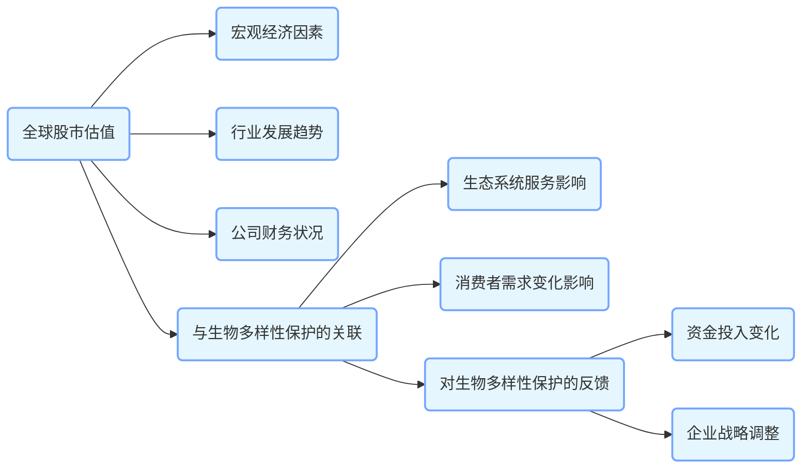

# 全球股市估值与生物多样性保护的关联

> 关键词：全球股市估值、生物多样性保护、生态经济、风险评估、可持续投资

> 摘要：本文深入探讨了全球股市估值与生物多样性保护之间的关联。通过分析股市估值的影响因素以及生物多样性保护的重要性和面临的挑战，揭示两者之间潜在的内在联系。从核心概念、算法原理、数学模型等多个角度进行阐述，并结合项目实战案例和实际应用场景进行分析。同时，提供了相关的工具和资源推荐，最后对未来发展趋势与挑战进行总结，旨在为投资者、政策制定者和环保人士提供全面的参考，促进生态经济的可持续发展。

## 1. 背景介绍 
### 1.1 目的和范围
本研究旨在全面剖析全球股市估值与生物多样性保护之间的复杂关联。通过对股市估值相关因素以及生物多样性保护现状的研究，揭示两者之间的相互作用机制。研究范围涵盖全球主要股市以及不同地区的生物多样性保护情况，分析生物多样性变化如何影响股市估值，以及股市估值的波动对生物多样性保护可能产生的反馈。

### 1.2 预期读者
本文预期读者包括金融领域的投资者、分析师、基金经理，环保领域的政策制定者、研究人员、环保组织工作人员，以及对生态经济和可持续发展感兴趣的学者和普通读者。

### 1.3 文档结构概述
本文首先介绍研究的背景、目的和预期读者，接着阐述核心概念以及它们之间的联系，包括使用文本示意图和 Mermaid 流程图进行说明。然后详细讲解核心算法原理和具体操作步骤，通过 Python 代码进行阐述。随后介绍相关的数学模型和公式，并举例说明。在项目实战部分，给出代码实际案例和详细解释。之后分析实际应用场景，推荐相关的工具和资源。最后总结未来发展趋势与挑战，提供常见问题解答和扩展阅读参考资料。

### 1.4 术语表
#### 1.4.1 核心术语定义
- **全球股市估值**：指对全球范围内各个股票市场上上市公司价值的综合评估，通常通过股价、市盈率、市净率等指标来衡量。
- **生物多样性保护**：指采取各种措施保护地球上各种生物及其生态系统的多样性，包括物种多样性、基因多样性和生态系统多样性。
- **生态经济**：是一种把经济发展与生态环境保护和建设有机结合起来，使二者互相促进的经济活动形式。

#### 1.4.2 相关概念解释
- **生态系统服务**：指生态系统为人类提供的各种惠益，如食物供应、水源涵养、气候调节等。生物多样性是生态系统服务的基础，生物多样性的丧失可能导致生态系统服务功能的下降。
- **可持续投资**：是一种考虑环境、社会和治理（ESG）因素的投资策略，旨在实现长期的财务回报和积极的社会影响。生物多样性保护是可持续投资中环境因素的重要组成部分。

#### 1.4.3 缩略词列表
- **ESG**：Environmental, Social and Governance（环境、社会和治理）
- **GDP**：Gross Domestic Product（国内生产总值）

## 2. 核心概念与联系 

### 核心概念原理
全球股市估值反映了市场对上市公司未来盈利能力和发展前景的预期。其受到多种因素的影响，包括宏观经济环境、行业发展趋势、公司财务状况等。而生物多样性保护对于维持生态平衡、提供生态系统服务以及促进可持续发展至关重要。

生物多样性的丧失可能通过多种途径影响股市估值。例如，生态系统服务功能的下降可能导致农业、渔业等依赖自然资源的行业面临生产风险，从而影响相关上市公司的业绩和股价。同时，消费者对环保产品和服务的需求增加，也会促使企业调整战略，这对不同行业的股市表现产生影响。

另一方面，股市估值的波动也可能影响生物多样性保护。当股市繁荣时，企业有更多的资金用于研发和投资，可能加大对可持续发展项目的投入，从而有利于生物多样性保护。相反，股市低迷时，企业可能削减环保相关的开支，对生物多样性保护产生不利影响。

### 架构的文本示意图
```plaintext
全球股市估值
    |
    |---宏观经济因素
    |---行业发展趋势
    |---公司财务状况
    |
    |---与生物多样性保护的关联
            |
            |---生态系统服务影响
            |---消费者需求变化影响
            |
            |---对生物多样性保护的反馈
                    |
                    |---资金投入变化
                    |---企业战略调整
```

### Mermaid 流程图


## 3. 核心算法原理 & 具体操作步骤 

### 核心算法原理
为了量化全球股市估值与生物多样性保护之间的关联，我们可以采用多元回归分析的方法。多元回归分析可以同时考虑多个自变量对因变量的影响。

假设我们用 $Y$ 表示全球股市估值（例如，全球股票市场的平均市盈率），用 $X_1, X_2, \cdots, X_n$ 表示与生物多样性保护相关的因素，如生物多样性指数、生态系统服务价值等，以及其他可能影响股市估值的控制变量，如 GDP 增长率、利率等。多元回归模型可以表示为：

$$Y = \beta_0 + \beta_1X_1 + \beta_2X_2 + \cdots + \beta_nX_n + \epsilon$$

其中，$\beta_0$ 是截距项，$\beta_1, \beta_2, \cdots, \beta_n$ 是回归系数，$\epsilon$ 是误差项。

### 具体操作步骤
1. **数据收集**：收集全球股市估值数据、生物多样性相关数据（如物种数量、生态系统面积等）以及其他控制变量的数据。数据来源可以包括金融数据库、环保组织报告、政府统计部门等。
2. **数据预处理**：对收集到的数据进行清洗，处理缺失值和异常值。同时，对数据进行标准化处理，以消除不同变量之间的量纲差异。
3. **模型建立**：使用 Python 的 `statsmodels` 库建立多元回归模型。
4. **模型拟合**：将处理后的数据代入模型进行拟合，得到回归系数和其他统计指标。
5. **模型评估**：通过计算决定系数 $R^2$、调整后的决定系数 $\bar{R}^2$、F 统计量等指标评估模型的拟合优度和显著性。
6. **结果分析**：根据回归系数的符号和大小，分析各个自变量对因变量的影响方向和程度。

### Python 代码实现
```python
import pandas as pd
import statsmodels.api as sm

# 假设我们已经收集并整理好了数据，存储在一个 CSV 文件中
data = pd.read_csv('stock_biodiversity_data.csv')

# 定义因变量和自变量
y = data['stock_valuation']
X = data[['biodiversity_index', 'gdp_growth_rate', 'interest_rate']]

# 添加常数项
X = sm.add_constant(X)

# 建立多元回归模型
model = sm.OLS(y, X)

# 拟合模型
results = model.fit()

# 输出模型结果
print(results.summary())
```

## 4. 数学模型和公式 & 详细讲解 & 举例说明 

### 多元回归模型公式
如前所述，多元回归模型的一般形式为：

$$Y = \beta_0 + \beta_1X_1 + \beta_2X_2 + \cdots + \beta_nX_n + \epsilon$$

其中：
- $Y$ 是因变量，即全球股市估值。
- $X_1, X_2, \cdots, X_n$ 是自变量，包括与生物多样性保护相关的因素和其他控制变量。
- $\beta_0$ 是截距项，表示当所有自变量都为 0 时因变量的取值。
- $\beta_1, \beta_2, \cdots, \beta_n$ 是回归系数，表示自变量每变化一个单位时因变量的平均变化量。
- $\epsilon$ 是误差项，反映了模型无法解释的随机因素。

### 决定系数 $R^2$
决定系数 $R^2$ 用于衡量回归模型的拟合优度，其计算公式为：

$$R^2 = 1 - \frac{\sum_{i=1}^{N}(y_i - \hat{y}_i)^2}{\sum_{i=1}^{N}(y_i - \bar{y})^2}$$

其中：
- $y_i$ 是实际观测值。
- $\hat{y}_i$ 是模型预测值。
- $\bar{y}$ 是因变量的平均值。
- $N$ 是样本数量。

$R^2$ 的取值范围在 0 到 1 之间，越接近 1 表示模型对数据的拟合效果越好。

### 调整后的决定系数 $\bar{R}^2$
调整后的决定系数 $\bar{R}^2$ 是对 $R^2$ 的修正，考虑了模型中自变量的数量，其计算公式为：

$$\bar{R}^2 = 1 - \frac{(1 - R^2)(N - 1)}{N - k - 1}$$

其中：
- $k$ 是自变量的数量。

### 举例说明
假设我们通过上述多元回归模型得到以下结果：

| 变量 | 系数 |
| ---- | ---- |
| 常数项 | 10 |
| 生物多样性指数 | 2 |
| GDP 增长率 | 1.5 |
| 利率 | -0.5 |

这意味着，在其他条件不变的情况下，生物多样性指数每增加 1 个单位，全球股市估值平均增加 2 个单位；GDP 增长率每增加 1 个百分点，全球股市估值平均增加 1.5 个单位；利率每增加 1 个百分点，全球股市估值平均减少 0.5 个单位。

## 5. 项目实战：代码实际案例和详细解释说明 

### 5.1  开发环境搭建
- **Python 安装**：从 Python 官方网站（https://www.python.org/downloads/）下载并安装 Python 3.x 版本。
- **库安装**：使用 `pip` 命令安装所需的库，包括 `pandas`、`statsmodels` 等。
```sh
pip install pandas statsmodels
```

### 5.2  源代码详细实现和代码解读
```python
import pandas as pd
import statsmodels.api as sm

# 读取数据
data = pd.read_csv('stock_biodiversity_data.csv')

# 数据探索性分析
print('数据基本信息：')
data.info()

# 查看数据集行数和列数
rows, columns = data.shape

if rows < 30:
    # 小样本数据（行数少于30）查看全量数据信息
    print('数据全部内容信息：')
    print(data.to_csv(sep='\t', na_rep='nan'))
else:
    # 大样本数据查看数据前几行信息
    print('数据前几行内容信息：')
    print(data.head().to_csv(sep='\t', na_rep='nan'))

# 定义因变量和自变量
y = data['stock_valuation']
X = data[['biodiversity_index', 'gdp_growth_rate', 'interest_rate']]

# 添加常数项
X = sm.add_constant(X)

# 建立多元回归模型
model = sm.OLS(y, X)

# 拟合模型
results = model.fit()

# 输出模型结果
print(results.summary())
```

### 代码解读与分析
1. **数据读取**：使用 `pandas` 库的 `read_csv` 函数读取存储在 CSV 文件中的数据。
2. **数据探索性分析**：通过 `info` 方法查看数据的基本信息，包括数据类型、缺失值情况等。根据数据行数的多少，决定输出全量数据信息还是前几行数据信息，方便对数据有一个初步的了解。
3. **定义因变量和自变量**：将 `stock_valuation` 列作为因变量 $y$，`biodiversity_index`、`gdp_growth_rate` 和 `interest_rate` 列作为自变量 $X$。
4. **添加常数项**：使用 `sm.add_constant` 函数为自变量添加常数项，以便在回归模型中包含截距项。
5. **建立多元回归模型**：使用 `sm.OLS` 函数建立普通最小二乘（OLS）回归模型。
6. **拟合模型**：调用 `fit` 方法对模型进行拟合，得到回归结果。
7. **输出模型结果**：使用 `summary` 方法输出模型的详细统计信息，包括回归系数、标准误差、t 统计量、p 值等。

## 6. 实际应用场景 
### 投资者决策
投资者可以将生物多样性保护因素纳入投资决策过程中。例如，关注那些积极参与生物多样性保护、具有良好环境表现的企业，这些企业可能在长期内具有更好的发展前景和抗风险能力。同时，通过分析生物多样性变化对不同行业的影响，调整投资组合，降低投资风险。

### 企业战略规划
企业可以认识到生物多样性保护对自身业务的重要性，制定可持续发展战略。例如，农业企业可以采取生态友好型的种植方式，减少对生物多样性的破坏，提高农产品的质量和市场竞争力。制造业企业可以优化供应链管理，确保原材料的可持续采购。

### 政策制定
政策制定者可以根据股市估值与生物多样性保护的关联，制定相关政策。例如，通过税收优惠、补贴等政策鼓励企业加大对生物多样性保护的投入，促进生态经济的发展。同时，加强对生物多样性的监测和保护，维护生态平衡，为经济的可持续发展提供保障。

## 7. 工具和资源推荐
### 7.1 学习资源推荐
#### 7.1.1 书籍推荐
- 《生态经济学：原理与应用》：本书介绍了生态经济学的基本原理和方法，探讨了经济发展与生态环境保护之间的关系，对于理解全球股市估值与生物多样性保护的关联具有重要的参考价值。
- 《可持续投资：环境、社会和治理因素对投资的影响》：详细阐述了可持续投资的概念、策略和实践，帮助读者了解如何将生物多样性保护等 ESG 因素纳入投资决策中。

#### 7.1.2 在线课程
- Coursera 上的“生态经济学”课程：由知名高校的教授授课，系统讲解生态经济学的理论和实践，提供丰富的案例分析。
- edX 上的“可持续金融”课程：介绍可持续金融的最新发展和趋势，包括生物多样性保护在金融领域的应用。

#### 7.1.3 技术博客和网站
- 世界自然基金会（WWF）官网：提供关于生物多样性保护的最新资讯、研究报告和政策动态。
- 彭博社 ESG 研究中心：发布关于可持续投资和 ESG 因素分析的专业报告和文章。

### 7.2 开发工具框架推荐
#### 7.2.1 IDE和编辑器
- PyCharm：功能强大的 Python 集成开发环境，提供代码编辑、调试、版本控制等功能，适合开发数据分析和机器学习项目。
- Jupyter Notebook：交互式的编程环境，方便进行数据探索、模型开发和结果展示，支持多种编程语言。

#### 7.2.2 调试和性能分析工具
- `pdb`：Python 内置的调试工具，用于定位和解决代码中的错误。
- `cProfile`：Python 的性能分析工具，可以帮助分析代码的运行时间和资源消耗情况。

#### 7.2.3 相关框架和库
- `pandas`：用于数据处理和分析的 Python 库，提供了丰富的数据结构和函数，方便进行数据清洗、转换和可视化。
- `statsmodels`：用于统计建模和计量经济学分析的 Python 库，支持多种回归模型和统计检验。

### 7.3 相关论文著作推荐
#### 7.3.1 经典论文
- “The Economics of Ecosystems and Biodiversity (TEEB)”：该报告系统评估了生物多样性丧失的经济成本和生态系统服务的价值，为生态经济研究提供了重要的理论基础。
- “Valuing Nature: Lessons Learned and Future Research Directions”：探讨了生态系统服务价值评估的方法和挑战，对于理解生物多样性保护的经济意义具有重要的参考价值。

#### 7.3.2 最新研究成果
- 关注《Nature》、《Science》、《Ecological Economics》等国际顶级学术期刊上发表的关于生物多样性保护和生态经济的最新研究论文。

#### 7.3.3 应用案例分析
- 国际金融公司（IFC）发布的关于可持续投资和生物多样性保护的案例研究报告，介绍了不同行业企业在生物多样性保护方面的实践经验和取得的成效。

## 8. 总结：未来发展趋势与挑战
### 未来发展趋势
- **可持续投资的增长**：随着投资者对环境和社会问题的关注度不断提高，可持续投资将成为未来金融市场的重要发展方向。生物多样性保护作为可持续投资的重要组成部分，将吸引更多的资金投入。
- **企业社会责任的强化**：企业将更加重视生物多样性保护，将其纳入企业战略和运营管理中。通过采取可持续发展措施，企业可以提高自身的竞争力和社会形象。
- **政策支持的加强**：政府将出台更多的政策措施支持生物多样性保护，包括税收优惠、补贴、监管要求等。这些政策将促进生态经济的发展，推动股市估值与生物多样性保护的良性互动。

### 挑战
- **数据质量和可得性**：目前，生物多样性相关数据的质量和可得性存在一定的问题，这给准确评估股市估值与生物多样性保护的关联带来了困难。需要加强数据收集和监测体系的建设，提高数据的准确性和完整性。
- **跨学科研究的难度**：全球股市估值与生物多样性保护的关联涉及金融、生态、经济等多个学科领域，需要跨学科的研究方法和团队合作。然而，不同学科之间的沟通和融合存在一定的障碍，需要加强跨学科研究的平台建设和人才培养。
- **短期利益与长期目标的平衡**：在实际操作中，企业和投资者往往更关注短期利益，而生物多样性保护是一个长期的过程。如何平衡短期利益与长期目标，是实现股市估值与生物多样性保护协调发展的关键挑战之一。

## 9. 附录：常见问题与解答
### 问题 1：如何衡量生物多样性保护对股市估值的影响程度？
答：可以通过建立多元回归模型，将生物多样性相关指标作为自变量，股市估值作为因变量，通过回归系数来衡量生物多样性保护对股市估值的影响程度。同时，还可以结合其他方法，如案例分析、情景模拟等，进行综合评估。

### 问题 2：生物多样性保护对哪些行业的股市估值影响较大？
答：生物多样性保护对农业、渔业、林业、旅游业等依赖自然资源的行业影响较大。此外，随着消费者对环保产品和服务的需求增加，环保产业、可再生能源产业等也将受到积极影响。

### 问题 3：企业如何将生物多样性保护纳入战略规划中？
答：企业可以从以下几个方面将生物多样性保护纳入战略规划：进行生物多样性风险评估，识别业务活动对生物多样性的影响；制定生物多样性保护目标和行动计划，明确具体的措施和责任；加强供应链管理，确保原材料的可持续采购；开展员工培训和教育，提高员工的环保意识。

## 10. 扩展阅读 & 参考资料
- 联合国环境规划署（UNEP）发布的相关报告和文件。
- 国际自然保护联盟（IUCN）的研究成果和保护指南。
- 各国政府发布的生物多样性保护政策和法规。

作者：AI天才研究院/AI Genius Institute & 禅与计算机程序设计艺术 /Zen And The Art of Computer Programming