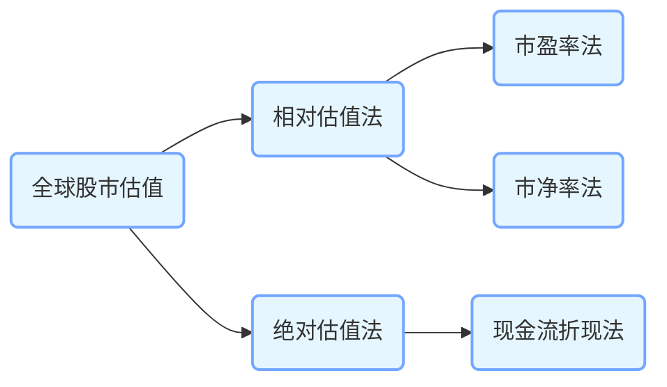
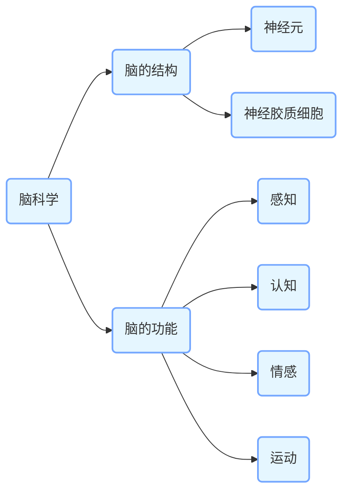
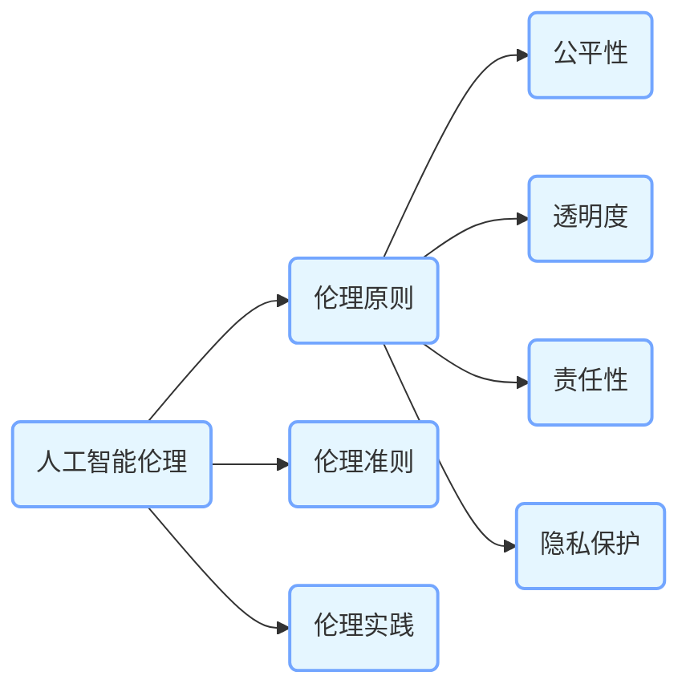

# 全球股市估值与脑科学在人工智能伦理中的应用

> 关键词：全球股市估值、脑科学、人工智能伦理、应用、交叉研究

> 摘要：本文旨在深入探讨全球股市估值与脑科学在人工智能伦理中的应用这一前沿且具有跨学科性质的主题。首先介绍全球股市估值的基本概念、方法及其重要性，以及脑科学和人工智能伦理的相关背景知识。接着分析脑科学如何为人工智能伦理提供理论支持和方法借鉴，以及全球股市估值与人工智能伦理之间潜在的联系。然后通过具体的案例和数学模型阐述这些理论和联系在实际中的应用。最后探讨该领域未来的发展趋势和面临的挑战，以期为相关领域的研究和实践提供有益的参考和启示。

## 1. 背景介绍 
### 1.1 目的和范围
本研究的目的在于揭示全球股市估值、脑科学与人工智能伦理三者之间的内在联系和潜在应用价值。通过综合分析不同领域的知识和方法，为投资者、人工智能开发者和伦理学家提供新的思路和视角。范围涵盖全球股市估值的基本理论和方法，脑科学的最新研究成果及其在人工智能伦理中的应用，以及人工智能伦理对全球股市估值的影响等方面。

### 1.2 预期读者
本文预期读者包括金融领域的投资者、分析师、研究人员，人工智能领域的开发者、科学家、伦理学家，以及对跨学科研究感兴趣的学者和学生。

### 1.3 文档结构概述
本文首先介绍相关背景知识，包括全球股市估值、脑科学和人工智能伦理的基本概念和发展历程。然后深入探讨核心概念与联系，分析三者之间的相互关系和作用机制。接着详细阐述核心算法原理和具体操作步骤，通过数学模型和公式进一步解释相关理论。之后通过项目实战案例展示这些理论和方法的实际应用。再探讨实际应用场景和相关工具资源。最后总结未来发展趋势与挑战，并提供常见问题解答和扩展阅读参考资料。

### 1.4 术语表
#### 1.4.1 核心术语定义
- **全球股市估值**：是指对全球范围内股票市场中上市公司的价值进行评估和判断的过程和方法。通过对公司的财务状况、经营业绩、行业前景等因素的分析，确定股票的合理价格和市场价值。
- **脑科学**：是研究脑的结构和功能的科学，旨在揭示脑的工作原理和神经机制，包括认知、情感、行为等方面的神经基础。
- **人工智能伦理**：是研究人工智能技术在设计、开发、应用过程中涉及的道德和伦理问题的学科，旨在确保人工智能技术的发展和应用符合人类的价值观和利益。

#### 1.4.2 相关概念解释
- **股票估值方法**：包括市盈率法、市净率法、现金流折现法等，用于评估股票的内在价值。
- **神经可塑性**：指脑在经历学习、经验或损伤后，其结构和功能发生改变的能力。
- **人工智能偏见**：指人工智能系统在数据、算法或决策过程中存在的不公平、不公正或歧视性的现象。

#### 1.4.3 缩略词列表
- **AI**：Artificial Intelligence，人工智能
- **PE**：Price-to-Earnings Ratio，市盈率
- **PB**：Price-to-Book Ratio，市净率
- **DCF**：Discounted Cash Flow，现金流折现法

## 2. 核心概念与联系 

### 全球股市估值的原理与架构
全球股市估值的基本原理是基于对上市公司未来盈利能力和现金流的预期，通过一定的方法和模型将其转化为当前的股票价值。常见的估值方法包括相对估值法和绝对估值法。相对估值法是通过与同行业或类似公司的比较来确定股票的价值，如市盈率法、市净率法等；绝对估值法是通过对公司未来现金流的折现来确定股票的内在价值，如现金流折现法。

其架构可以用以下示意图表示：



### 脑科学的原理与架构
脑科学的研究主要集中在脑的结构和功能上。脑由神经元和神经胶质细胞组成，神经元之间通过突触连接形成复杂的神经网络。脑的功能包括感知、认知、情感、运动等多个方面，这些功能是通过神经网络的活动来实现的。

其架构可以用以下示意图表示：



### 人工智能伦理的原理与架构
人工智能伦理的核心原理是确保人工智能技术的发展和应用符合人类的价值观和利益。其主要内容包括公平性、透明度、责任性、隐私保护等方面。人工智能伦理的架构可以分为伦理原则、伦理准则和伦理实践三个层次。

其架构可以用以下示意图表示：



### 三者之间的联系
全球股市估值、脑科学和人工智能伦理之间存在着密切的联系。脑科学的研究成果可以为人工智能伦理提供理论支持和方法借鉴，例如通过对人类认知和决策过程的研究，帮助人工智能系统更好地理解人类的价值观和利益，从而设计出更加符合伦理要求的人工智能算法。同时，人工智能技术在金融领域的应用也对全球股市估值产生了影响，例如通过机器学习算法对大量的金融数据进行分析和预测，提高股市估值的准确性和效率。而人工智能伦理的规范和约束可以确保人工智能技术在金融领域的应用符合道德和法律要求，保护投资者的利益。

## 3. 核心算法原理 & 具体操作步骤 

### 全球股市估值算法原理
#### 市盈率法
市盈率法是一种相对估值法，其基本原理是通过比较目标公司与同行业或类似公司的市盈率来确定目标公司的股票价值。市盈率（PE）的计算公式为：

$$PE = \frac{股价}{每股收益}$$

具体操作步骤如下：
1. 选择同行业或类似公司作为参考对象。
2. 计算参考对象的平均市盈率。
3. 确定目标公司的每股收益。
4. 根据参考对象的平均市盈率和目标公司的每股收益，计算目标公司的股票价值：

$$股票价值 = 每股收益 \times 平均市盈率$$

以下是使用 Python 实现市盈率法的代码示例：

```python
# 参考对象的市盈率列表
pe_list = [10, 12, 15, 13, 11]
# 计算平均市盈率
average_pe = sum(pe_list) / len(pe_list)
# 目标公司的每股收益
eps = 2
# 计算目标公司的股票价值
stock_value = eps * average_pe
print("目标公司的股票价值为:", stock_value)
```

#### 现金流折现法
现金流折现法是一种绝对估值法，其基本原理是将公司未来的现金流折现到当前时刻，以确定公司的内在价值。其计算公式为：

$$V = \sum_{t=1}^{n} \frac{CF_t}{(1 + r)^t}$$

其中，$V$ 表示公司的内在价值，$CF_t$ 表示第 $t$ 期的现金流，$r$ 表示折现率，$n$ 表示预测期数。

具体操作步骤如下：
1. 预测公司未来各期的现金流。
2. 确定折现率。
3. 根据上述公式计算公司的内在价值。
4. 根据公司的总股本，计算每股股票的内在价值。

以下是使用 Python 实现现金流折现法的代码示例：

```python
import numpy as np

# 预测的未来现金流列表
cf_list = [100, 120, 150, 180, 200]
# 折现率
r = 0.1
# 预测期数
n = len(cf_list)
# 计算各期现金流的现值
pv_list = []
for t in range(1, n + 1):
    pv = cf_list[t - 1] / (1 + r) ** t
    pv_list.append(pv)
# 计算公司的内在价值
company_value = sum(pv_list)
# 公司的总股本
total_shares = 100
# 计算每股股票的内在价值
stock_value = company_value / total_shares
print("每股股票的内在价值为:", stock_value)
```

### 脑科学与人工智能伦理相关算法原理
#### 基于脑电信号的情感识别算法
该算法的基本原理是通过采集和分析人类的脑电信号，识别出人类的情感状态。具体步骤如下：
1. 采集脑电信号。
2. 对脑电信号进行预处理，包括滤波、去噪等。
3. 提取脑电信号的特征，如频率特征、时域特征等。
4. 使用机器学习或深度学习算法对特征进行分类，识别出不同的情感状态。

以下是一个简单的基于 Python 的脑电信号情感识别示例代码：

```python
import numpy as np
from sklearn.model_selection import train_test_split
from sklearn.svm import SVC
from sklearn.metrics import accuracy_score

# 模拟脑电信号特征数据
X = np.random.rand(100, 10)
# 模拟情感标签数据
y = np.random.randint(0, 2, 100)

# 划分训练集和测试集
X_train, X_test, y_train, y_test = train_test_split(X, y, test_size=0.2, random_state=42)

# 创建支持向量机分类器
clf = SVC()

# 训练模型
clf.fit(X_train, y_train)

# 预测
y_pred = clf.predict(X_test)

# 计算准确率
accuracy = accuracy_score(y_test, y_pred)
print("情感识别准确率为:", accuracy)
```

#### 人工智能伦理审查算法
该算法的基本原理是通过对人工智能系统的代码、数据和决策过程进行分析和评估，检查是否存在伦理问题。具体步骤如下：
1. 定义伦理规则和准则。
2. 对人工智能系统的代码进行静态分析，检查是否存在违反伦理规则的代码。
3. 对人工智能系统的数据进行分析，检查是否存在数据偏见等伦理问题。
4. 对人工智能系统的决策过程进行模拟和评估，检查是否存在不公平、不公正的决策。

以下是一个简单的基于 Python 的人工智能伦理审查示例代码：

```python
# 定义伦理规则：禁止使用敏感数据
sensitive_data = ["race", "gender", "age"]

# 模拟人工智能系统的数据
data = ["name", "address", "race"]

# 检查是否存在敏感数据
for d in data:
    if d in sensitive_data:
        print("存在伦理问题：使用了敏感数据", d)
```

## 4. 数学模型和公式 & 详细讲解 & 举例说明 

### 全球股市估值的数学模型和公式
#### 市盈率法
如前所述，市盈率法的计算公式为：

$$PE = \frac{股价}{每股收益}$$

$$股票价值 = 每股收益 \times 平均市盈率$$

举例说明：假设同行业公司的平均市盈率为 15，目标公司的每股收益为 3 元，则目标公司的股票价值为：

$$股票价值 = 3 \times 15 = 45（元）$$

#### 现金流折现法
现金流折现法的计算公式为：

$$V = \sum_{t=1}^{n} \frac{CF_t}{(1 + r)^t}$$

举例说明：假设某公司未来 5 年的现金流分别为 100 万元、120 万元、150 万元、180 万元、200 万元，折现率为 10%，则该公司的内在价值为：

$$V = \frac{100}{(1 + 0.1)^1} + \frac{120}{(1 + 0.1)^2} + \frac{150}{(1 + 0.1)^3} + \frac{180}{(1 + 0.1)^4} + \frac{200}{(1 + 0.1)^5}$$

$$V \approx 90.91 + 99.17 + 112.70 + 122.94 + 124.18 = 549.90（万元）$$

### 脑科学与人工智能伦理相关的数学模型和公式
#### 基于脑电信号的情感识别
在基于脑电信号的情感识别中，常用的机器学习算法如支持向量机（SVM）的决策函数为：

$$f(x) = \text{sgn}(\sum_{i=1}^{n} \alpha_i y_i K(x_i, x) + b)$$

其中，$\alpha_i$ 是拉格朗日乘子，$y_i$ 是样本标签，$K(x_i, x)$ 是核函数，$b$ 是偏置项。

举例说明：假设我们使用线性核函数 $K(x_i, x) = x_i^T x$，并且已经训练得到了 $\alpha_i$ 和 $b$ 的值，对于一个新的脑电信号特征向量 $x$，我们可以通过上述决策函数计算出其预测的情感标签。

#### 人工智能伦理审查
在人工智能伦理审查中，我们可以使用一些统计指标来评估数据的偏见程度，如基尼系数（Gini coefficient）。基尼系数的计算公式为：

$$G = \frac{\sum_{i=1}^{n} \sum_{j=1}^{n} |x_i - x_j|}{2n^2 \bar{x}}$$

其中，$x_i$ 和 $x_j$ 是数据集中的样本值，$\bar{x}$ 是样本的平均值，$n$ 是样本数量。基尼系数越接近 0，表示数据越均匀，越不容易存在偏见；基尼系数越接近 1，表示数据越不均匀，越容易存在偏见。

举例说明：假设我们有一个数据集 $X = [1, 2, 3, 4, 5]$，则其平均值为：

$$\bar{x} = \frac{1 + 2 + 3 + 4 + 5}{5} = 3$$

基尼系数为：

$$G = \frac{|1 - 1| + |1 - 2| + |1 - 3| + |1 - 4| + |1 - 5| + |2 - 1| + |2 - 2| + |2 - 3| + |2 - 4| + |2 - 5| + |3 - 1| + |3 - 2| + |3 - 3| + |3 - 4| + |3 - 5| + |4 - 1| + |4 - 2| + |4 - 3| + |4 - 4| + |4 - 5| + |5 - 1| + |5 - 2| + |5 - 3| + |5 - 4| + |5 - 5|}{2 \times 5^2 \times 3}$$

$$G = \frac{0 + 1 + 2 + 3 + 4 + 1 + 0 + 1 + 2 + 3 + 2 + 1 + 0 + 1 + 2 + 3 + 2 + 1 + 0 + 1 + 4 + 3 + 2 + 1 + 0}{150} = \frac{40}{150} \approx 0.27$$

## 5. 项目实战：代码实际案例和详细解释说明 

### 5.1  开发环境搭建
#### 安装 Python
首先需要安装 Python 环境，建议使用 Python 3.7 及以上版本。可以从 Python 官方网站（https://www.python.org/downloads/） 下载安装包进行安装。

#### 安装必要的库
在项目中，我们需要使用一些 Python 库，如 numpy、pandas、scikit-learn 等。可以使用以下命令进行安装：

```sh
pip install numpy pandas scikit-learn
```

### 5.2  源代码详细实现和代码解读
#### 全球股市估值案例
以下是一个完整的全球股市估值案例，使用市盈率法和现金流折现法对某公司的股票价值进行评估：

```python
import numpy as np

# 市盈率法
# 参考对象的市盈率列表
pe_list = [10, 12, 15, 13, 11]
# 计算平均市盈率
average_pe = sum(pe_list) / len(pe_list)
# 目标公司的每股收益
eps = 2
# 计算目标公司的股票价值
stock_value_pe = eps * average_pe
print("市盈率法计算的目标公司股票价值为:", stock_value_pe)

# 现金流折现法
# 预测的未来现金流列表
cf_list = [100, 120, 150, 180, 200]
# 折现率
r = 0.1
# 预测期数
n = len(cf_list)
# 计算各期现金流的现值
pv_list = []
for t in range(1, n + 1):
    pv = cf_list[t - 1] / (1 + r) ** t
    pv_list.append(pv)
# 计算公司的内在价值
company_value = sum(pv_list)
# 公司的总股本
total_shares = 100
# 计算每股股票的内在价值
stock_value_dcf = company_value / total_shares
print("现金流折现法计算的每股股票内在价值为:", stock_value_dcf)
```

代码解读：
- 市盈率法部分：首先定义了参考对象的市盈率列表，计算出平均市盈率。然后确定目标公司的每股收益，最后根据市盈率法的公式计算出目标公司的股票价值。
- 现金流折现法部分：定义了预测的未来现金流列表和折现率，通过循环计算各期现金流的现值，求和得到公司的内在价值。再根据公司的总股本计算出每股股票的内在价值。

#### 脑科学与人工智能伦理相关案例
以下是一个基于脑电信号的情感识别和人工智能伦理审查的案例：

```python
import numpy as np
from sklearn.model_selection import train_test_split
from sklearn.svm import SVC
from sklearn.metrics import accuracy_score

# 基于脑电信号的情感识别
# 模拟脑电信号特征数据
X = np.random.rand(100, 10)
# 模拟情感标签数据
y = np.random.randint(0, 2, 100)

# 划分训练集和测试集
X_train, X_test, y_train, y_test = train_test_split(X, y, test_size=0.2, random_state=42)

# 创建支持向量机分类器
clf = SVC()

# 训练模型
clf.fit(X_train, y_train)

# 预测
y_pred = clf.predict(X_test)

# 计算准确率
accuracy = accuracy_score(y_test, y_pred)
print("情感识别准确率为:", accuracy)

# 人工智能伦理审查
# 定义伦理规则：禁止使用敏感数据
sensitive_data = ["race", "gender", "age"]

# 模拟人工智能系统的数据
data = ["name", "address", "race"]

# 检查是否存在敏感数据
for d in data:
    if d in sensitive_data:
        print("存在伦理问题：使用了敏感数据", d)
```

代码解读：
- 基于脑电信号的情感识别部分：首先模拟了脑电信号特征数据和情感标签数据，然后将数据划分为训练集和测试集。创建支持向量机分类器并进行训练，最后进行预测并计算准确率。
- 人工智能伦理审查部分：定义了伦理规则，模拟了人工智能系统的数据，通过循环检查数据中是否存在敏感数据，若存在则输出相应的提示信息。

### 5.3  代码解读与分析
#### 全球股市估值代码分析
市盈率法和现金流折现法是两种常用的全球股市估值方法。市盈率法简单直观，易于理解和计算，但它依赖于同行业或类似公司的比较，可能存在一定的局限性。现金流折现法考虑了公司未来的现金流和时间价值，更能反映公司的内在价值，但它需要对未来现金流进行准确的预测，预测的不确定性较大。

#### 脑科学与人工智能伦理相关代码分析
基于脑电信号的情感识别可以帮助人工智能系统更好地理解人类的情感状态，从而提供更加个性化和人性化的服务。但脑电信号的采集和分析存在一定的技术难度，并且不同个体的脑电信号可能存在差异，需要进一步的研究和改进。人工智能伦理审查可以帮助发现和解决人工智能系统中存在的伦理问题，但伦理规则的定义和评估标准还需要进一步完善。

## 6. 实际应用场景 
### 全球股市估值的应用场景
- **投资决策**：投资者可以通过对全球股市估值的分析，选择具有投资价值的股票，制定合理的投资策略。
- **公司并购**：在公司并购过程中，需要对目标公司的价值进行评估，全球股市估值方法可以为并购决策提供参考。
- **宏观经济分析**：全球股市估值的变化可以反映宏观经济的运行状况，政府和政策制定者可以通过对股市估值的监测，制定相应的经济政策。

### 脑科学在人工智能伦理中的应用场景
- **人工智能系统设计**：通过对脑科学的研究，了解人类的认知和决策过程，将其应用到人工智能系统的设计中，使人工智能系统更加符合人类的价值观和利益。
- **人工智能伦理审查**：利用脑科学的方法和技术，对人工智能系统的决策过程进行监测和评估，检查是否存在伦理问题。
- **人机交互**：脑科学的研究成果可以帮助改善人机交互的方式和效果，使人类与人工智能系统之间的交互更加自然和高效。

### 三者结合的应用场景
- **智能投资顾问**：结合全球股市估值、脑科学和人工智能伦理的知识，开发智能投资顾问系统，为投资者提供更加个性化、智能化和符合伦理要求的投资建议。
- **金融监管**：利用脑科学和人工智能技术，对金融市场进行监测和分析，及时发现和防范金融风险，同时确保金融监管过程符合伦理要求。
- **企业社会责任评估**：通过对企业的人工智能应用和股市估值的分析，结合脑科学的研究成果，评估企业的社会责任履行情况，促进企业的可持续发展。

## 7. 工具和资源推荐
### 7.1 学习资源推荐
#### 7.1.1 书籍推荐
- 《金融学》：由兹维·博迪等著，全面介绍了金融学的基本理论和方法，包括股市估值的相关内容。
- 《脑与意识》：由斯坦尼斯拉斯·迪昂著，深入探讨了脑科学的最新研究成果和意识的本质。
- 《人工智能伦理》：由温德尔·瓦拉赫等著，系统阐述了人工智能伦理的基本概念、理论和实践。

#### 7.1.2 在线课程
- Coursera 上的“金融市场”课程，介绍了金融市场的基本原理和投资策略。
- edX 上的“脑科学导论”课程，提供了脑科学的基础知识和研究方法。
- Udemy 上的“人工智能伦理与安全”课程，讲解了人工智能伦理的相关问题和解决方案。

#### 7.1.3 技术博客和网站
- 金融界（https://www.jrj.com.cn/）：提供全球股市的行情、分析和研究报告。
- 中国脑科学网（http://www.chinabrain.org.cn/）：发布脑科学领域的最新研究成果和学术动态。
- 人工智能伦理网（https://aiethics.org/）：专注于人工智能伦理的研究和讨论，提供相关的论文、案例和资源。

### 7.2 开发工具框架推荐
#### 7.2.1 IDE和编辑器
- PyCharm：一款专业的 Python 集成开发环境，提供代码编辑、调试、版本控制等功能。
- Jupyter Notebook：一种交互式的开发环境，适合进行数据探索、模型训练和代码演示。
- Visual Studio Code：一款轻量级的代码编辑器，支持多种编程语言和插件扩展。

#### 7.2.2 调试和性能分析工具
- PDB：Python 自带的调试工具，可以帮助开发者定位和解决代码中的问题。
- cProfile：Python 标准库中的性能分析工具，可以分析代码的运行时间和资源消耗。
- TensorBoard：TensorFlow 提供的可视化工具，可以帮助开发者监控和分析深度学习模型的训练过程。

#### 7.2.3 相关框架和库
- Numpy：Python 中用于科学计算的基础库，提供了高效的数组操作和数学函数。
- Pandas：用于数据处理和分析的库，提供了数据结构和数据操作的工具。
- Scikit-learn：用于机器学习的库，提供了各种机器学习算法和工具。
- TensorFlow：用于深度学习的开源框架，提供了高效的模型训练和部署功能。

### 7.3 相关论文著作推荐
#### 7.3.1 经典论文
- Fama, E. F., & French, K. R. (1992). The cross-section of expected stock returns. Journal of Finance, 47(2), 427-465. 该论文提出了著名的 Fama-French 三因子模型，对股市估值和资产定价理论产生了深远影响。
- Crick, F., & Koch, C. (1990). Towards a neurobiological theory of consciousness. Seminars in the Neurosciences, 2(6), 263-275. 该论文探讨了意识的神经生物学基础，为脑科学的研究提供了重要的理论框架。
- Floridi, L., & Cowls, J. (2019). A moral algorithm: How to do the right thing when machines make decisions. Oxford University Press. 该书系统地阐述了人工智能伦理的理论和实践问题，提出了一种道德算法的框架。

#### 7.3.2 最新研究成果
- 在学术数据库如 IEEE Xplore、ACM Digital Library、ScienceDirect 等上搜索关于全球股市估值、脑科学和人工智能伦理的最新研究论文。
- 关注顶级学术会议如 NeurIPS、ICML、AAAI 等的会议论文，了解相关领域的最新研究动态。

#### 7.3.3 应用案例分析
- 可以参考金融机构的研究报告和案例分析，了解全球股市估值在实际投资中的应用。
- 关注科技公司的研究成果和实践案例，了解脑科学和人工智能伦理在人工智能产品和服务中的应用。

## 8. 总结：未来发展趋势与挑战
### 未来发展趋势
- **跨学科融合**：全球股市估值、脑科学和人工智能伦理的跨学科研究将越来越深入，不同领域的知识和方法将相互借鉴和融合，产生更多的创新成果。
- **智能化应用**：随着人工智能技术的不断发展，智能投资顾问、智能金融监管等智能化应用将越来越普及，为金融市场和社会发展带来更多的便利和效益。
- **伦理意识增强**：人们对人工智能伦理的认识将不断提高，人工智能伦理的规范和标准将不断完善，确保人工智能技术的发展和应用符合人类的价值观和利益。

### 挑战
- **数据隐私和安全**：在全球股市估值、脑科学和人工智能伦理的研究和应用中，涉及大量的个人和敏感数据，数据隐私和安全问题将成为一个重要的挑战。
- **伦理标准的统一**：不同国家和地区对人工智能伦理的认识和标准存在差异，如何统一伦理标准，促进全球范围内的人工智能伦理合作和发展，是一个亟待解决的问题。
- **技术的局限性**：目前脑科学和人工智能技术还存在一定的局限性，如脑电信号的采集和分析精度不够、人工智能算法的可解释性不强等，需要进一步的技术创新和突破。

## 9. 附录：常见问题与解答
### 全球股市估值相关问题
- **问**：市盈率法和现金流折现法哪个更准确？
**答**：两种方法都有其优缺点，市盈率法简单直观，但依赖于同行业比较；现金流折现法考虑了未来现金流和时间价值，但预测难度较大。具体使用哪种方法需要根据实际情况进行选择。
- **问**：如何确定折现率？
**答**：折现率的确定需要考虑多种因素，如市场利率、风险水平等。一般可以参考市场上类似投资的收益率来确定折现率。

### 脑科学与人工智能伦理相关问题
- **问**：脑电信号的情感识别准确率有多高？
**答**：目前脑电信号的情感识别准确率还不是很高，受到多种因素的影响，如脑电信号的采集质量、个体差异等。随着技术的不断发展，准确率有望进一步提高。
- **问**：如何确保人工智能系统符合伦理要求？
**答**：可以通过制定伦理规则和准则、进行伦理审查、加强教育和培训等方式来确保人工智能系统符合伦理要求。

## 10. 扩展阅读 & 参考资料
- 《金融市场与金融机构基础》
- 《认知神经科学：关于心智的生物学》
- 《人工智能：现代方法》
- https://www.investopedia.com/
- https://www.nature.com/
- https://www.science.org/

作者：AI天才研究院/AI Genius Institute & 禅与计算机程序设计艺术 /Zen And The Art of Computer Programming