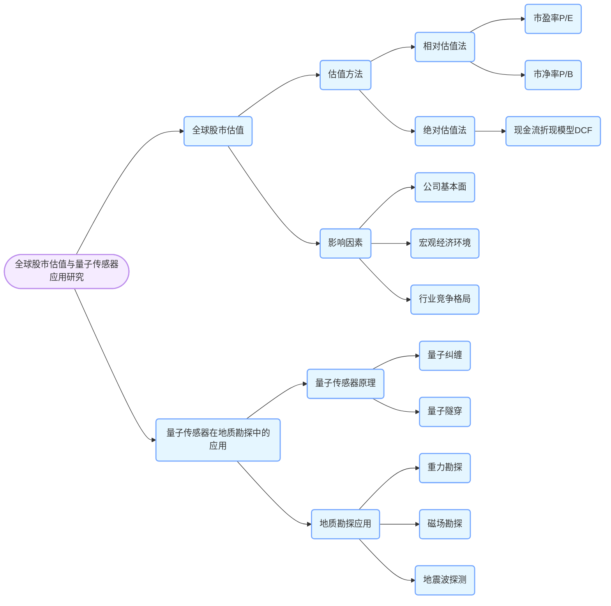

# 全球股市估值与量子传感器在地质勘探中的应用

> 关键词：全球股市估值、量子传感器、地质勘探、金融分析、地质探测技术

> 摘要：本文旨在探讨两个看似不相关领域的知识，即全球股市估值和量子传感器在地质勘探中的应用。首先深入剖析全球股市估值的原理、方法和影响因素，为投资者和金融从业者提供全面的理论和实践指导。然后详细介绍量子传感器的原理、特点以及其在地质勘探中的具体应用，展示其在该领域的巨大潜力。最后，通过对两个领域的综合分析，探讨它们之间可能存在的潜在联系和相互影响，为跨领域的研究和应用提供新的思路和视角。

## 1. 背景介绍 
### 1.1 目的和范围
本研究的目的有两个方面。一方面，对全球股市估值进行系统的分析，明确其核心概念、常用方法和影响因素，帮助投资者和金融机构更准确地评估股票价值，制定合理的投资策略。另一方面，深入研究量子传感器在地质勘探中的应用，介绍其原理、优势和实际应用案例，推动该技术在地质领域的进一步发展和应用。范围涵盖了全球主要股票市场的估值分析以及量子传感器在不同地质勘探场景下的应用。

### 1.2 预期读者
本文预期读者包括金融领域的投资者、分析师、基金经理等，他们可以从全球股市估值的内容中获取有价值的投资信息和分析方法。同时，地质勘探领域的科研人员、工程师和相关从业者可以从量子传感器的应用介绍中了解新技术，为实际工作提供参考。此外，对跨领域研究感兴趣的学者和爱好者也可以从本文中获得启发。

### 1.3 文档结构概述
本文将按照以下结构进行阐述：首先介绍全球股市估值和量子传感器在地质勘探中的相关背景知识，包括目的、读者和文档结构。接着详细讲解两个领域的核心概念、联系、算法原理、数学模型等内容。然后通过实际案例展示相关技术的应用和实现。之后介绍实际应用场景、推荐学习资源和开发工具。最后对未来发展趋势和挑战进行总结，并提供常见问题解答和扩展阅读资料。

### 1.4 术语表
#### 1.4.1 核心术语定义
- **全球股市估值**：对全球范围内各个股票市场中上市公司股票的内在价值进行评估的过程和方法。
- **量子传感器**：基于量子力学原理设计的传感器，利用量子态的特性来实现高灵敏度、高精度的物理量测量。
- **地质勘探**：通过各种技术手段对地球表层进行调查研究，以寻找和评估矿产资源、地质构造等地质信息的过程。

#### 1.4.2 相关概念解释
- **市盈率（P/E）**：股票价格与每股收益的比率，是衡量股票估值的常用指标之一。
- **量子纠缠**：量子力学中的一种现象，两个或多个量子系统之间存在一种特殊的关联，即使它们相隔很远，一个系统的状态变化会瞬间影响另一个系统的状态。
- **重力勘探**：通过测量地球重力场的变化来推断地下地质构造和矿产分布的勘探方法。

#### 1.4.3 缩略词列表
- **P/E**：市盈率（Price-to-Earnings Ratio）
- **GDP**：国内生产总值（Gross Domestic Product）
- **SNR**：信噪比（Signal-to-Noise Ratio）

## 2. 核心概念与联系 

### 2.1 全球股市估值核心概念
全球股市估值是金融领域的重要课题，它旨在确定股票的合理价格。其核心原理基于股票的内在价值，即公司未来现金流的折现。常用的估值方法包括相对估值法和绝对估值法。相对估值法通过与同行业其他公司或市场平均水平进行比较，如市盈率（P/E）、市净率（P/B）等指标。绝对估值法主要是现金流折现模型（DCF），通过预测公司未来的自由现金流并折现到当前来计算股票的内在价值。

### 2.2 量子传感器核心概念
量子传感器是基于量子力学原理的新型传感器。它利用量子态的特性，如量子纠缠、量子隧穿等，实现对物理量的高精度测量。与传统传感器相比，量子传感器具有更高的灵敏度、分辨率和抗干扰能力。例如，基于原子干涉的量子重力仪可以测量极其微小的重力变化，为地质勘探提供更精确的数据。

### 2.3 两者联系
虽然全球股市估值和量子传感器在地质勘探中的应用看似没有直接联系，但从宏观经济和资源供需的角度来看，它们之间存在一定的关联。地质勘探的结果会影响矿产资源的供应，而矿产资源的价格波动会对相关上市公司的业绩产生影响，进而影响股市估值。例如，如果量子传感器在地质勘探中发现了新的大型矿产资源，可能会增加该资源的供应预期，导致其价格下降，相关矿业公司的利润可能受到影响，从而影响其股票估值。

### 2.4 核心概念原理和架构的文本示意图
```plaintext
全球股市估值
|-- 估值方法
|   |-- 相对估值法
|   |   |-- 市盈率（P/E）
|   |   |-- 市净率（P/B）
|   |-- 绝对估值法
|       |-- 现金流折现模型（DCF）
|-- 影响因素
|   |-- 公司基本面
|   |-- 宏观经济环境
|   |-- 行业竞争格局

量子传感器在地质勘探中的应用
|-- 量子传感器原理
|   |-- 量子纠缠
|   |-- 量子隧穿
|-- 地质勘探应用
|   |-- 重力勘探
|   |-- 磁场勘探
|   |-- 地震波探测
```

### 2.5 Mermaid 流程图


## 3. 核心算法原理 & 具体操作步骤 

### 3.1 全球股市估值算法原理及Python实现
#### 3.1.1 市盈率（P/E）估值法
市盈率是最常用的相对估值指标之一，其计算公式为：
$$P/E = \frac{股票价格}{每股收益}$$
通过与同行业其他公司的平均市盈率进行比较，可以判断该股票是否被高估或低估。

以下是一个简单的Python代码示例，用于计算和比较不同公司的市盈率：
```python
# 定义公司数据
companies = {
    "Company A": {"price": 50, "earnings_per_share": 5},
    "Company B": {"price": 80, "earnings_per_share": 6},
    "Company C": {"price": 120, "earnings_per_share": 10}
}

# 计算市盈率
for company, data in companies.items():
    pe_ratio = data["price"] / data["earnings_per_share"]
    print(f"{company}的市盈率: {pe_ratio}")

# 计算行业平均市盈率
total_pe = 0
for data in companies.values():
    total_pe += data["price"] / data["earnings_per_share"]
average_pe = total_pe / len(companies)
print(f"行业平均市盈率: {average_pe}")
```
#### 3.1.2 现金流折现模型（DCF）
现金流折现模型是一种绝对估值方法，其基本原理是将公司未来的自由现金流折现到当前，计算公式为：
$$V = \sum_{t=1}^{n} \frac{FCF_t}{(1 + r)^t} + \frac{TV}{(1 + r)^n}$$
其中，$V$ 是公司的内在价值，$FCF_t$ 是第 $t$ 年的自由现金流，$r$ 是折现率，$TV$ 是终值，$n$ 是预测期数。

以下是一个简化的DCF模型的Python实现：
```python
# 假设参数
free_cash_flows = [100, 120, 140, 160, 180]  # 未来5年的自由现金流
discount_rate = 0.1  # 折现率
terminal_growth_rate = 0.03  # 终值增长率

# 计算终值
terminal_value = free_cash_flows[-1] * (1 + terminal_growth_rate) / (discount_rate - terminal_growth_rate)

# 计算现金流折现值
present_value = 0
for i, fcf in enumerate(free_cash_flows):
    present_value += fcf / ((1 + discount_rate) ** (i + 1))

# 加上终值的折现值
present_value += terminal_value / ((1 + discount_rate) ** len(free_cash_flows))

print(f"公司的内在价值: {present_value}")
```

### 3.2 量子传感器信号处理算法原理及Python实现
#### 3.2.1 信号增强算法
量子传感器采集到的信号通常比较微弱，需要进行信号增强处理。一种常用的方法是自适应滤波，通过自适应调整滤波器的参数来提高信号的信噪比（SNR）。

以下是一个简单的自适应滤波算法的Python实现：
```python
import numpy as np

# 生成模拟信号
t = np.linspace(0, 1, 1000)
signal = np.sin(2 * np.pi * 10 * t)  # 原始信号
noise = 0.5 * np.random.randn(len(t))  # 噪声
noisy_signal = signal + noise  # 含噪信号

# 自适应滤波参数
filter_length = 10
mu = 0.01

# 初始化滤波器系数
w = np.zeros(filter_length)

# 自适应滤波过程
filtered_signal = np.zeros(len(noisy_signal))
for n in range(filter_length, len(noisy_signal)):
    x = noisy_signal[n - filter_length:n]
    y = np.dot(w, x)
    e = noisy_signal[n] - y
    w = w + mu * e * x
    filtered_signal[n] = y

import matplotlib.pyplot as plt
plt.figure(figsize=(12, 6))
plt.subplot(3, 1, 1)
plt.plot(t, signal, label='原始信号')
plt.title('原始信号')
plt.subplot(3, 1, 2)
plt.plot(t, noisy_signal, label='含噪信号')
plt.title('含噪信号')
plt.subplot(3, 1, 3)
plt.plot(t, filtered_signal, label='滤波后信号')
plt.title('滤波后信号')
plt.tight_layout()
plt.show()
```
#### 3.2.2 特征提取算法
为了从量子传感器采集的信号中提取有用的地质信息，需要进行特征提取。例如，通过对重力信号进行傅里叶变换，提取不同频率成分的幅值和相位信息。

以下是一个简单的傅里叶变换特征提取的Python实现：
```python
import numpy as np
import matplotlib.pyplot as plt

# 生成模拟重力信号
t = np.linspace(0, 1, 1000)
gravity_signal = np.sin(2 * np.pi * 5 * t) + 0.5 * np.sin(2 * np.pi * 15 * t)

# 进行傅里叶变换
fourier_transform = np.fft.fft(gravity_signal)
frequencies = np.fft.fftfreq(len(gravity_signal), t[1] - t[0])

# 取正频率部分
positive_frequencies = frequencies[:len(frequencies) // 2]
positive_fourier_transform = 2.0 / len(gravity_signal) * np.abs(fourier_transform[:len(fourier_transform) // 2])

# 绘制频谱图
plt.figure(figsize=(12, 6))
plt.plot(positive_frequencies, positive_fourier_transform)
plt.title('重力信号频谱图')
plt.xlabel('频率 (Hz)')
plt.ylabel('幅值')
plt.show()
```

## 4. 数学模型和公式 & 详细讲解 & 举例说明 

### 4.1 全球股市估值数学模型
#### 4.1.1 市盈率（P/E）模型
市盈率模型的基本公式为 $P/E = \frac{P}{EPS}$，其中 $P$ 是股票价格，$EPS$ 是每股收益。例如，某公司的股票价格为 $50$ 元，每股收益为 $5$ 元，则其市盈率为 $\frac{50}{5} = 10$。如果同行业平均市盈率为 $15$，则该股票可能被低估，具有投资价值。

#### 4.1.2 现金流折现模型（DCF）
DCF模型的公式为 $V = \sum_{t=1}^{n} \frac{FCF_t}{(1 + r)^t} + \frac{TV}{(1 + r)^n}$。假设一家公司未来5年的自由现金流分别为 $100$ 万元、$120$ 万元、$140$ 万元、$160$ 万元、$180$ 万元，折现率为 $10\%$，终值增长率为 $3\%$。首先计算终值：
$$TV = \frac{180\times(1 + 0.03)}{0.1 - 0.03} = \frac{185.4}{0.07} \approx 2648.57$$
然后计算各年现金流的折现值：
- 第1年：$\frac{100}{(1 + 0.1)^1} \approx 90.91$
- 第2年：$\frac{120}{(1 + 0.1)^2} \approx 99.17$
- 第3年：$\frac{140}{(1 + 0.1)^3} \approx 105.18$
- 第4年：$\frac{160}{(1 + 0.1)^4} \approx 109.28$
- 第5年：$\frac{180}{(1 + 0.1)^5} \approx 111.77$
最后加上终值的折现值：
$$V = 90.91 + 99.17 + 105.18 + 109.28 + 111.77 + \frac{2648.57}{(1 + 0.1)^5} \approx 1736.39$$

### 4.2 量子传感器数学模型
#### 4.2.1 量子干涉模型
在基于原子干涉的量子传感器中，原子的干涉现象可以用波函数来描述。假设两个原子波函数分别为 $\psi_1$ 和 $\psi_2$，它们的叠加态为 $\psi = \psi_1 + \psi_2$。干涉后的概率密度为 $|\psi|^2 = |\psi_1|^2 + |\psi_2|^2 + 2|\psi_1||\psi_2|\cos(\Delta\phi)$，其中 $\Delta\phi$ 是两个波函数的相位差。通过测量干涉条纹的变化，可以计算出物理量的变化，如重力加速度的变化。

#### 4.2.2 信号处理模型
在信号处理中，自适应滤波的最小均方误差（LMS）算法的更新公式为 $w(n + 1) = w(n) + \mu e(n)x(n)$，其中 $w(n)$ 是滤波器系数向量，$\mu$ 是步长因子，$e(n)$ 是误差信号，$x(n)$ 是输入信号向量。例如，在前面的自适应滤波代码中，通过不断更新滤波器系数 $w$，使得误差 $e$ 逐渐减小，从而实现信号的增强。

## 5. 项目实战：代码实际案例和详细解释说明 

### 5.1  开发环境搭建
#### 5.1.1 全球股市估值项目环境搭建
- **Python环境**：建议使用Python 3.7及以上版本，可以从Python官方网站（https://www.python.org/downloads/）下载安装。
- **依赖库安装**：使用`pip`命令安装所需的库，如`pandas`用于数据处理，`matplotlib`用于数据可视化。
```sh
pip install pandas matplotlib
```

#### 5.1.2 量子传感器信号处理项目环境搭建
- **Python环境**：同样使用Python 3.7及以上版本。
- **依赖库安装**：除了`pandas`和`matplotlib`外，还需要安装`numpy`用于数值计算。
```sh
pip install numpy pandas matplotlib
```

### 5.2  源代码详细实现和代码解读
#### 5.2.1 全球股市估值项目代码实现
```python
import pandas as pd
import matplotlib.pyplot as plt

# 模拟公司数据
data = {
    "Company": ["A", "B", "C", "D"],
    "Price": [50, 80, 120, 60],
    "EarningsPerShare": [5, 6, 10, 4]
}
df = pd.DataFrame(data)

# 计算市盈率
df["PE_Ratio"] = df["Price"] / df["EarningsPerShare"]

# 绘制市盈率柱状图
plt.figure(figsize=(10, 6))
plt.bar(df["Company"], df["PE_Ratio"])
plt.title("各公司市盈率对比")
plt.xlabel("公司")
plt.ylabel("市盈率")
plt.show()

# 计算行业平均市盈率
average_pe = df["PE_Ratio"].mean()
print(f"行业平均市盈率: {average_pe}")
```
**代码解读**：
- 首先，使用`pandas`库创建一个包含公司信息的DataFrame，包括公司名称、股票价格和每股收益。
- 然后，计算每个公司的市盈率，并将结果添加到DataFrame中。
- 接着，使用`matplotlib`库绘制市盈率的柱状图，直观展示各公司的市盈率对比。
- 最后，计算行业平均市盈率并打印输出。

#### 5.2.2 量子传感器信号处理项目代码实现
```python
import numpy as np
import matplotlib.pyplot as plt

# 生成模拟量子传感器信号
t = np.linspace(0, 1, 1000)
signal = np.sin(2 * np.pi * 10 * t)  # 原始信号
noise = 0.5 * np.random.randn(len(t))  # 噪声
noisy_signal = signal + noise  # 含噪信号

# 自适应滤波参数
filter_length = 10
mu = 0.01

# 初始化滤波器系数
w = np.zeros(filter_length)

# 自适应滤波过程
filtered_signal = np.zeros(len(noisy_signal))
for n in range(filter_length, len(noisy_signal)):
    x = noisy_signal[n - filter_length:n]
    y = np.dot(w, x)
    e = noisy_signal[n] - y
    w = w + mu * e * x
    filtered_signal[n] = y

# 绘制信号图
plt.figure(figsize=(12, 6))
plt.subplot(3, 1, 1)
plt.plot(t, signal, label='原始信号')
plt.title('原始信号')
plt.subplot(3, 1, 2)
plt.plot(t, noisy_signal, label='含噪信号')
plt.title('含噪信号')
plt.subplot(3, 1, 3)
plt.plot(t, filtered_signal, label='滤波后信号')
plt.title('滤波后信号')
plt.tight_layout()
plt.show()
```
**代码解读**：
- 首先，使用`numpy`库生成模拟的量子传感器信号，包括原始信号和噪声信号，并将它们叠加得到含噪信号。
- 然后，设置自适应滤波的参数，如滤波器长度和步长因子。
- 接着，初始化滤波器系数，并通过循环进行自适应滤波过程，不断更新滤波器系数，得到滤波后的信号。
- 最后，使用`matplotlib`库绘制原始信号、含噪信号和滤波后信号的图形，直观展示滤波效果。

### 5.3  代码解读与分析
#### 5.3.1 全球股市估值代码分析
- **数据处理**：使用`pandas`库可以方便地处理和分析股票数据，如计算市盈率和行业平均市盈率。
- **可视化**：`matplotlib`库提供了强大的可视化功能，通过绘制柱状图可以直观地比较各公司的市盈率，帮助投资者快速了解股票的估值情况。

#### 5.3.2 量子传感器信号处理代码分析
- **信号生成**：通过`numpy`库生成模拟信号和噪声信号，模拟实际量子传感器采集到的含噪信号。
- **自适应滤波**：自适应滤波算法可以根据信号的变化自动调整滤波器系数，有效地提高信号的信噪比，从而提取出有用的地质信息。
- **可视化**：绘制原始信号、含噪信号和滤波后信号的图形，有助于分析滤波效果，评估算法的性能。

## 6. 实际应用场景 

### 6.1 全球股市估值的应用场景
#### 6.1.1 投资决策
投资者可以通过对全球股市估值的分析，选择被低估的股票进行投资，以获取更高的收益。例如，当某只股票的市盈率低于行业平均水平时，可能意味着该股票具有投资价值。
#### 6.1.2 风险管理
金融机构可以利用股市估值模型评估投资组合的风险，合理配置资产，降低投资风险。例如，通过对不同行业和不同公司的股票进行估值分析，调整投资组合的权重，以实现风险和收益的平衡。
#### 6.1.3 宏观经济分析
股市估值可以反映宏观经济的运行状况。当股市整体估值较高时，可能意味着经济处于繁荣阶段；而当股市估值较低时，可能预示着经济面临下行压力。政府和监管机构可以根据股市估值情况制定相应的宏观经济政策。

### 6.2 量子传感器在地质勘探中的应用场景
#### 6.2.1 矿产资源勘探
量子传感器可以高精度地测量地球重力场和磁场的变化，帮助勘探人员发现潜在的矿产资源。例如，通过测量重力异常，可以推断地下是否存在高密度的矿体，如金属矿、煤矿等。
#### 6.2.2 地质构造研究
量子传感器可以检测地震波的微小变化，用于研究地质构造和地壳运动。通过分析地震波的传播速度和方向，可以了解地下岩石的结构和性质，为地震预测和地质灾害评估提供重要依据。
#### 6.2.3 环境监测
量子传感器可以监测地下水位、土壤湿度等环境参数的变化，为环境保护和资源管理提供数据支持。例如，通过测量土壤中的磁场变化，可以监测土壤污染情况。

## 7. 工具和资源推荐
### 7.1 学习资源推荐
#### 7.1.1 书籍推荐
- 《证券分析》（Security Analysis）：由本杰明·格雷厄姆（Benjamin Graham）和戴维·多德（David Dodd）所著，是价值投资领域的经典著作，详细介绍了股票估值的方法和理论。
- 《量子力学导论》（Introduction to Quantum Mechanics）：由大卫·J·格里菲斯（David J. Griffiths）所著，系统介绍了量子力学的基本原理和应用，为理解量子传感器的原理提供了理论基础。
- 《地质勘探技术与方法》：全面介绍了地质勘探的各种技术和方法，包括重力勘探、磁场勘探等，对于了解量子传感器在地质勘探中的应用有很大帮助。

#### 7.1.2 在线课程
- Coursera上的“金融市场”（Financial Markets）课程：由耶鲁大学教授罗伯特·席勒（Robert Shiller）主讲，深入讲解了金融市场的运行机制和股票估值的方法。
- edX上的“量子力学基础”（Fundamentals of Quantum Mechanics）课程：由麻省理工学院（MIT）的教授授课，系统介绍了量子力学的基本概念和数学原理。
- 中国大学MOOC上的“地质勘探概论”课程：由国内知名高校的地质专家授课，介绍了地质勘探的基本理论和实践方法。

#### 7.1.3 技术博客和网站
- Seeking Alpha：提供全球股市的分析和评论，包括股票估值、投资策略等方面的内容。
- arXiv：一个预印本数据库，包含了大量关于量子力学和量子传感器的最新研究成果。
- 中国地质调查局官网：提供地质勘探领域的最新政策、技术和研究成果。

### 7.2 开发工具框架推荐
#### 7.2.1 IDE和编辑器
- PyCharm：一款功能强大的Python集成开发环境，提供代码编辑、调试、版本控制等功能，适合开发全球股市估值和量子传感器信号处理项目。
- Jupyter Notebook：一种交互式的开发环境，支持Python代码的编写和运行，同时可以方便地展示代码和数据可视化结果，适合进行数据分析和模型验证。

#### 7.2.2 调试和性能分析工具
- pdb：Python自带的调试工具，可以帮助开发者定位代码中的错误和问题。
- cProfile：Python的性能分析工具，可以分析代码的运行时间和内存使用情况，帮助优化代码性能。

#### 7.2.3 相关框架和库
- Pandas：用于数据处理和分析的Python库，提供了高效的数据结构和数据操作方法，适合处理全球股市估值中的股票数据。
- Numpy：用于数值计算的Python库，提供了丰富的数学函数和数组操作方法，在量子传感器信号处理中广泛应用。
- Matplotlib：用于数据可视化的Python库，可以绘制各种类型的图表，如折线图、柱状图、散点图等，帮助直观展示数据和分析结果。

### 7.3 相关论文著作推荐
#### 7.3.1 经典论文
- Fama, E. F., & French, K. R. (1992). The cross-section of expected stock returns. The Journal of Finance, 47(2), 427-465. 该论文提出了著名的Fama-French三因子模型，对股票收益率的横截面进行了深入研究。
- Kasevich, M. A., & Chu, S. (1991). Measurement of the gravitational acceleration by dropping atoms. Physical Review Letters, 67(1), 18-21. 该论文介绍了基于原子干涉的重力测量方法，为量子重力仪的发展奠定了基础。

#### 7.3.2 最新研究成果
- 在arXiv和IEEE Xplore等数据库中，可以找到关于全球股市估值和量子传感器的最新研究论文，如利用机器学习方法改进股市估值模型、开发新型量子传感器等方面的研究。

#### 7.3.3 应用案例分析
- 一些专业的金融研究报告和地质勘探项目报告中，包含了全球股市估值和量子传感器在实际应用中的案例分析。例如，某些金融机构发布的投资研究报告中会分析特定行业或公司的股票估值情况；地质勘探部门的项目报告中会介绍量子传感器在某地区矿产资源勘探中的应用效果。

## 8. 总结：未来发展趋势与挑战

### 8.1 全球股市估值的未来发展趋势与挑战
#### 8.1.1 发展趋势
- **智能化和自动化**：随着人工智能和机器学习技术的发展，股市估值模型将越来越智能化和自动化。通过大数据分析和深度学习算法，可以更准确地预测公司的未来业绩和股票价格走势。
- **全球化和跨市场分析**：全球金融市场的联系越来越紧密，投资者需要进行全球化和跨市场的股市估值分析。未来的估值模型将考虑更多的国际因素和宏观经济变量，以提供更全面的投资建议。
- **与其他领域的融合**：股市估值将与其他领域如区块链、物联网等进行更深入的融合。例如，区块链技术可以提高股票交易的透明度和安全性，物联网技术可以提供更多的公司运营数据，从而改进股市估值的准确性。

#### 8.1.2 挑战
- **数据质量和可靠性**：股市估值依赖于大量的历史数据和实时数据，数据的质量和可靠性直接影响估值模型的准确性。然而，数据的收集、整理和清洗过程中可能存在误差和偏差，需要建立有效的数据质量管理体系。
- **市场不确定性和复杂性**：全球金融市场受到多种因素的影响，如政治、经济、社会等，市场不确定性和复杂性不断增加。估值模型很难准确预测这些因素的变化，需要不断改进和优化模型，以提高应对市场变化的能力。
- **监管和合规要求**：金融市场的监管和合规要求越来越严格，股市估值模型需要符合相关的法规和标准。例如，模型的透明度、可解释性等方面需要满足监管要求，这对模型的开发和应用带来了一定的挑战。

### 8.2 量子传感器在地质勘探中的未来发展趋势与挑战
#### 8.2.1 发展趋势
- **高性能和微型化**：未来量子传感器将朝着高性能和微型化的方向发展。通过改进量子技术和材料科学，提高传感器的灵敏度、分辨率和稳定性，同时减小传感器的体积和功耗，便于在野外和复杂环境中使用。
- **多参数和多功能集成**：量子传感器将实现多参数和多功能集成，能够同时测量多种物理量，如重力、磁场、温度等。这将为地质勘探提供更全面的信息，提高勘探效率和准确性。
- **与其他技术的融合**：量子传感器将与其他技术如无人机、卫星遥感等进行融合，实现更高效的地质勘探。例如，无人机搭载量子传感器可以快速对大面积区域进行勘探，卫星遥感数据可以为量子传感器的测量提供背景信息。

#### 8.2.2 挑战
- **技术成熟度和成本**：目前量子传感器技术还处于发展阶段，技术成熟度有待提高，成本也相对较高。需要进一步加大研发投入，降低生产成本，提高技术的可靠性和稳定性，以促进量子传感器在地质勘探中的广泛应用。
- **环境适应性**：地质勘探环境复杂多变，量子传感器需要具备良好的环境适应性。例如，在高温、高压、潮湿等恶劣环境下，传感器的性能可能会受到影响，需要开发相应的防护和补偿技术。
- **数据处理和解释**：量子传感器采集到的数据量巨大且复杂，需要开发高效的数据处理和解释算法。如何从海量数据中提取有用的地质信息，是量子传感器在地质勘探中面临的重要挑战之一。

## 9. 附录：常见问题与解答
### 9.1 全球股市估值相关问题
#### 9.1.1 市盈率估值法有哪些局限性？
市盈率估值法的局限性主要包括：（1）不同行业的市盈率水平差异较大，不能简单地进行跨行业比较；（2）市盈率只考虑了当前的盈利情况，没有考虑公司的未来增长潜力；（3）会计政策的不同可能会导致每股收益的计算存在差异，从而影响市盈率的准确性。

#### 9.1.2 现金流折现模型中折现率如何确定？
折现率的确定通常考虑以下因素：（1）无风险利率，如国债收益率；（2）市场风险溢价，反映投资者承担市场风险所要求的额外回报；（3）公司的特定风险，如行业竞争、财务杠杆等。常用的方法是资本资产定价模型（CAPM），公式为 $r = R_f + \beta\times(R_m - R_f)$，其中 $r$ 是折现率，$R_f$ 是无风险利率，$\beta$ 是公司的贝塔系数，$R_m$ 是市场收益率。

### 9.2 量子传感器在地质勘探相关问题
#### 9.2.1 量子传感器与传统传感器相比有哪些优势？
量子传感器与传统传感器相比，具有更高的灵敏度、分辨率和抗干扰能力。例如，量子重力仪可以测量极其微小的重力变化，能够检测到传统重力仪无法检测到的地质异常；量子磁场传感器可以在复杂的电磁环境中准确测量磁场信号。

#### 9.2.2 量子传感器在地质勘探中的应用成本高吗？
目前量子传感器在地质勘探中的应用成本相对较高，主要原因包括技术研发成本、设备制造成本等。随着技术的不断发展和成熟，成本有望逐渐降低。同时，量子传感器的高精度和高可靠性可以提高地质勘探的效率和准确性，从长远来看，可能会降低整体的勘探成本。

## 10. 扩展阅读 & 参考资料
### 10.1 扩展阅读
- 《聪明的投资者》（The Intelligent Investor）：本杰明·格雷厄姆的另一本经典著作，深入阐述了价值投资的理念和方法，对全球股市估值有进一步的探讨。
- 《量子物理史话：上帝掷骰子吗？》：以生动有趣的方式介绍了量子力学的发展历程和基本概念，帮助读者更好地理解量子传感器的原理。
- 《地质勘探与资源开发》：详细介绍了地质勘探的各个环节和资源开发的相关技术，对于了解量子传感器在地质勘探中的具体应用场景有很大帮助。

### 10.2 参考资料
- Fama, E. F., & French, K. R. (1992). The cross-section of expected stock returns. The Journal of Finance, 47(2), 427-465.
- Kasevich, M. A., & Chu, S. (1991). Measurement of the gravitational acceleration by dropping atoms. Physical Review Letters, 67(1), 18-21.
- 中国证券监督管理委员会官网：提供了关于股票市场的政策法规、统计数据等信息。
- 国际量子传感器协会官网：提供了量子传感器领域的最新技术动态和研究成果。

作者：AI天才研究院/AI Genius Institute & 禅与计算机程序设计艺术 /Zen And The Art of Computer Programming