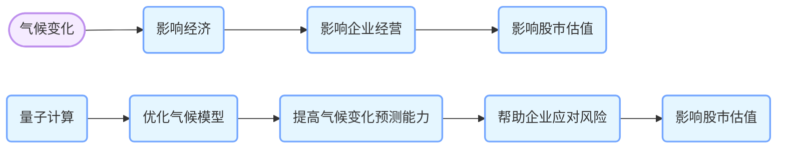

# 全球股市估值与量子计算在气候模型中的应用

> 关键词：全球股市估值、量子计算、气候模型、金融市场、气候变化、计算科学、经济预测

> 摘要：本文旨在探讨全球股市估值与量子计算在气候模型中的应用这两个看似不相关领域的内在联系与重要意义。一方面，详细阐述全球股市估值的基本概念、常见方法及影响因素，帮助读者理解金融市场的运行机制；另一方面，深入研究量子计算在气候模型中的原理、优势及应用案例，展示计算科学在应对气候变化中的巨大潜力。同时，分析两者之间可能存在的间接联系，如气候变化对经济的影响进而影响股市估值。通过全面的分析和探讨，为相关领域的研究和实践提供有价值的参考。

## 1. 背景介绍 
### 1.1 目的和范围
全球股市估值是金融领域的核心问题之一，准确的估值对于投资者决策、金融机构风险管理以及宏观经济政策制定都具有重要意义。而量子计算作为一种新兴的计算技术，其强大的计算能力为解决复杂的科学问题提供了新的途径，在气候模型中的应用也逐渐成为研究热点。本文的目的在于系统地介绍全球股市估值的方法和理论，以及量子计算在气候模型中的应用原理和实践，探讨两者之间可能存在的联系和相互影响。范围涵盖了金融市场的基本理论、量子计算的技术原理、气候模型的构建和应用等多个领域。

### 1.2 预期读者
本文预期读者包括金融领域的从业者，如投资者、分析师、基金经理等，他们可以从文中了解全球股市估值的最新方法和理论，为投资决策提供参考；计算机科学和物理学领域的研究人员，他们可以关注量子计算的技术发展和在气候模型中的应用案例；环境科学和气候变化领域的专家，他们可以探讨气候变化对经济和金融市场的影响机制；以及对金融、科技和环境领域感兴趣的广大读者，他们可以通过本文了解不同领域之间的交叉融合和相互影响。

### 1.3 文档结构概述
本文将按照以下结构进行组织：首先介绍全球股市估值和量子计算在气候模型应用的背景和相关概念；然后详细阐述全球股市估值的核心概念、方法和影响因素，以及量子计算在气候模型中的原理、优势和具体应用；接着分析两者之间可能存在的联系和相互影响；再通过实际案例和数据进行验证和说明；最后对未来的发展趋势和挑战进行展望，并提供相关的工具和资源推荐。

### 1.4 术语表
#### 1.4.1 核心术语定义
- **全球股市估值**：指对全球范围内股票市场中上市公司的价值进行评估和计算的过程和方法。
- **量子计算**：基于量子力学原理的新型计算模式，利用量子比特的叠加和纠缠等特性进行信息处理，具有强大的计算能力。
- **气候模型**：用于描述地球气候系统的数学模型，通过对大气、海洋、陆地等多个要素的模拟和计算，预测气候变化的趋势和影响。
- **金融市场**：资金融通和金融资产交易的场所，包括股票市场、债券市场、外汇市场等。
- **气候变化**：指地球气候系统在自然和人类活动影响下发生的长期变化，如全球气温升高、海平面上升等。

#### 1.4.2 相关概念解释
- **股票估值方法**：包括市盈率法、市净率法、现金流折现法等，用于评估股票的内在价值。
- **量子比特**：量子计算中的基本信息单位，与经典比特不同，具有叠加和纠缠等特性。
- **气候系统**：由大气圈、水圈、冰冻圈、岩石圈和生物圈组成的复杂系统，它们之间相互作用和影响。
- **经济预测**：通过对经济数据和信息的分析和研究，预测未来经济发展的趋势和变化。

#### 1.4.3 缩略词列表
- **GDP**：国内生产总值（Gross Domestic Product）
- **CPI**：消费者物价指数（Consumer Price Index）
- **QPU**：量子处理单元（Quantum Processing Unit）
- **IPCC**：政府间气候变化专门委员会（Intergovernmental Panel on Climate Change）

## 2. 核心概念与联系 

### 2.1 全球股市估值核心概念
全球股市估值是一个复杂的过程，其核心目标是确定股票的内在价值。股票的内在价值反映了公司未来的盈利能力和现金流状况。常见的估值方法基于不同的理论基础，例如市盈率（P/E）法，它是用股票价格除以每股收益，反映了投资者为获取公司一元盈利所愿意支付的价格倍数。市净率（P/B）法是股票价格与每股净资产的比值，衡量了股票价格相对于公司净资产的倍数，常用于评估资产类公司的价值。现金流折现法（DCF）则是通过预测公司未来的现金流，并将其折现到当前时刻，来确定公司的内在价值，这种方法更注重公司的长期盈利能力和现金流状况。

股票市场受到多种因素的影响，宏观经济因素如 GDP 增长率、通货膨胀率、利率水平等会影响整个市场的走势和公司的盈利能力。行业发展趋势也对股票估值产生重要影响，新兴行业如科技、新能源等往往具有较高的估值倍数，而传统行业如钢铁、煤炭等的估值相对较低。公司自身的财务状况、经营管理能力、市场竞争力等因素也直接影响其股票的估值。

### 2.2 量子计算在气候模型中的核心概念
量子计算基于量子力学的原理，利用量子比特（qubit）作为信息载体。与经典比特只能处于 0 或 1 两种状态不同，量子比特可以处于 0 和 1 的叠加态，这使得量子计算机能够同时处理多个计算任务，大大提高了计算效率。量子纠缠是量子计算的另一个重要特性，它使得多个量子比特之间存在一种特殊的关联，即使它们相隔很远，一个量子比特的状态变化也会瞬间影响到其他量子比特的状态。

气候模型是对地球气候系统的数学描述，它包括大气、海洋、陆地、冰雪等多个子系统的相互作用。传统的气候模型计算量巨大，需要处理大量的气象数据和物理过程。量子计算的强大计算能力可以加速气候模型的计算过程，提高模型的精度和预测能力。例如，在模拟大气环流、海洋温度变化等复杂过程时，量子计算机可以更快地处理大量的数据和方程，从而更准确地预测气候变化的趋势。

### 2.3 两者联系示意图及流程图
#### 示意图
全球股市估值和量子计算在气候模型中的应用虽然看似属于不同的领域，但实际上存在着一定的联系。气候变化会对经济产生广泛的影响，例如极端天气事件会破坏基础设施、影响农业生产、导致能源供应中断等，这些都会对企业的经营和盈利能力产生负面影响，进而影响股票市场的估值。而量子计算在气候模型中的应用可以提高对气候变化的预测能力，帮助企业和投资者更好地应对气候变化带来的风险，从而间接影响股市估值。

#### Mermaid 流程图


## 3. 核心算法原理 & 具体操作步骤 

### 3.1 全球股市估值核心算法原理及 Python 实现
#### 市盈率法
市盈率法的核心原理是通过比较股票的市盈率与同行业或市场平均市盈率，来判断股票的估值是否合理。计算公式为：
$$P = E \times PE$$
其中，$P$ 为股票价格，$E$ 为每股收益，$PE$ 为市盈率。

以下是一个简单的 Python 代码示例，用于计算股票的理论价格：
```python
def pe_valuation(eps, pe_ratio):
    """
    市盈率法计算股票价格
    :param eps: 每股收益
    :param pe_ratio: 市盈率
    :return: 股票价格
    """
    return eps * pe_ratio

# 示例数据
eps = 2.5
pe_ratio = 15

# 计算股票价格
stock_price = pe_valuation(eps, pe_ratio)
print(f"根据市盈率法计算的股票价格为: {stock_price}")
```
#### 现金流折现法
现金流折现法的核心原理是将公司未来的现金流折现到当前时刻，来确定公司的内在价值。计算公式为：
$$V = \sum_{t=1}^{n} \frac{CF_t}{(1 + r)^t}$$
其中，$V$ 为公司的内在价值，$CF_t$ 为第 $t$ 期的现金流，$r$ 为折现率，$n$ 为预测期数。

以下是一个简单的 Python 代码示例，用于计算公司的内在价值：
```python
def dcf_valuation(cash_flows, discount_rate):
    """
    现金流折现法计算公司内在价值
    :param cash_flows: 未来各期现金流列表
    :param discount_rate: 折现率
    :return: 公司内在价值
    """
    value = 0
    for t, cf in enumerate(cash_flows, start=1):
        value += cf / (1 + discount_rate) ** t
    return value

# 示例数据
cash_flows = [100, 120, 150, 180, 200]
discount_rate = 0.1

# 计算公司内在价值
company_value = dcf_valuation(cash_flows, discount_rate)
print(f"根据现金流折现法计算的公司内在价值为: {company_value}")
```

### 3.2 量子计算在气候模型中的算法原理及操作步骤
#### 量子模拟算法原理
量子模拟是量子计算在气候模型中应用的重要算法之一。其核心原理是利用量子比特的叠加和纠缠特性，模拟量子系统的演化过程。在气候模型中，量子模拟可以用于模拟大气、海洋等复杂系统的物理过程。例如，通过量子模拟可以更准确地计算大气中分子的相互作用、海洋中热量的传递等过程，从而提高气候模型的精度。

#### 操作步骤
1. **问题建模**：将气候模型中的物理问题转化为量子系统的演化问题，确定需要模拟的量子系统的哈密顿量。
2. **量子比特编码**：将经典信息编码到量子比特上，例如将大气温度、湿度等物理量编码为量子比特的状态。
3. **量子门操作**：设计一系列的量子门操作，用于模拟量子系统的演化过程。
4. **测量与结果分析**：对量子系统进行测量，得到模拟结果，并进行分析和验证。

以下是一个简单的量子模拟示例代码（使用 Qiskit 库）：
```python
from qiskit import QuantumCircuit, Aer, execute

# 创建一个量子电路
qc = QuantumCircuit(2)

# 应用量子门操作
qc.h(0)
qc.cx(0, 1)

# 测量量子比特
qc.measure_all()

# 选择模拟器
backend = Aer.get_backend('qasm_simulator')

# 执行量子电路
job = execute(qc, backend, shots=1024)
result = job.result()

# 获取测量结果
counts = result.get_counts(qc)
print(f"测量结果: {counts}")
```

## 4. 数学模型和公式 & 详细讲解 & 举例说明 

### 4.1 全球股市估值数学模型和公式
#### 股息贴现模型（DDM）
股息贴现模型是一种基于股息的股票估值模型，其基本思想是股票的价值等于其未来股息的现值之和。计算公式为：
$$V = \sum_{t=1}^{\infty} \frac{D_t}{(1 + r)^t}$$
其中，$V$ 为股票的内在价值，$D_t$ 为第 $t$ 期的股息，$r$ 为折现率。

在实际应用中，为了简化计算，通常假设股息以固定的增长率 $g$ 增长，此时公式可以简化为：
$$V = \frac{D_1}{r - g}$$
其中，$D_1$ 为下一期的股息。

例如，某公司下一期的股息预计为 2 元，股息增长率为 5%，折现率为 10%，则该公司股票的内在价值为：
$$V = \frac{2}{0.1 - 0.05} = 40$$

#### 剩余收益模型（RIM）
剩余收益模型是一种基于公司经济利润的股票估值模型，其基本思想是股票的价值等于公司的账面价值加上未来剩余收益的现值之和。计算公式为：
$$V = B_0 + \sum_{t=1}^{\infty} \frac{RI_t}{(1 + r)^t}$$
其中，$V$ 为股票的内在价值，$B_0$ 为公司的当前账面价值，$RI_t$ 为第 $t$ 期的剩余收益，$r$ 为折现率。

剩余收益的计算公式为：
$$RI_t = E_t - r \times B_{t-1}$$
其中，$E_t$ 为第 $t$ 期的净利润，$B_{t-1}$ 为第 $t - 1$ 期的账面价值。

### 4.2 量子计算在气候模型中的数学模型和公式
#### 薛定谔方程
薛定谔方程是量子力学的基本方程，用于描述量子系统的演化过程。在量子计算中，薛定谔方程可以表示为：
$$i\hbar \frac{\partial}{\partial t} \Psi(t) = H \Psi(t)$$
其中，$i$ 为虚数单位，$\hbar$ 为约化普朗克常数，$\Psi(t)$ 为量子系统的波函数，$H$ 为量子系统的哈密顿量。

在气候模型的量子模拟中，通过求解薛定谔方程可以模拟大气、海洋等系统的量子态演化过程，从而得到更准确的物理过程模拟结果。

#### 量子态的表示和计算
量子态可以用希尔伯特空间中的向量来表示，例如一个单量子比特的量子态可以表示为：
$$|\psi\rangle = \alpha |0\rangle + \beta |1\rangle$$
其中，$\alpha$ 和 $\beta$ 为复数，满足 $|\alpha|^2 + |\beta|^2 = 1$。

量子门操作可以用矩阵来表示，例如哈达玛门（Hadamard gate）的矩阵表示为：
$$H = \frac{1}{\sqrt{2}} \begin{bmatrix} 1 & 1 \\ 1 & -1 \end{bmatrix}$$

通过矩阵乘法可以计算量子门操作对量子态的影响，例如对单量子比特的量子态 $|\psi\rangle$ 应用哈达玛门的结果为：
$$H |\psi\rangle = \frac{1}{\sqrt{2}} \begin{bmatrix} 1 & 1 \\ 1 & -1 \end{bmatrix} \begin{bmatrix} \alpha \\ \beta \end{bmatrix} = \frac{1}{\sqrt{2}} \begin{bmatrix} \alpha + \beta \\ \alpha - \beta \end{bmatrix}$$

## 5. 项目实战：代码实际案例和详细解释说明 

### 5.1  开发环境搭建
#### 全球股市估值项目环境搭建
对于全球股市估值项目，我们可以使用 Python 作为开发语言。以下是搭建开发环境的步骤：
1. **安装 Python**：从 Python 官方网站（https://www.python.org/downloads/）下载并安装 Python 3.x 版本。
2. **安装必要的库**：使用 pip 命令安装所需的库，例如 pandas、numpy、matplotlib 等。
```bash
pip install pandas numpy matplotlib
```

#### 量子计算在气候模型中的项目环境搭建
对于量子计算在气候模型中的项目，我们可以使用 Qiskit 作为量子计算开发框架。以下是搭建开发环境的步骤：
1. **安装 Python**：同样需要安装 Python 3.x 版本。
2. **安装 Qiskit**：使用 pip 命令安装 Qiskit 库。
```bash
pip install qiskit
```

### 5.2  源代码详细实现和代码解读
#### 全球股市估值项目源代码实现
以下是一个简单的全球股市估值项目示例，使用市盈率法和现金流折现法对股票进行估值：
```python
import pandas as pd
import numpy as np
import matplotlib.pyplot as plt

# 定义市盈率法计算函数
def pe_valuation(eps, pe_ratio):
    return eps * pe_ratio

# 定义现金流折现法计算函数
def dcf_valuation(cash_flows, discount_rate):
    value = 0
    for t, cf in enumerate(cash_flows, start=1):
        value += cf / (1 + discount_rate) ** t
    return value

# 示例数据
eps = 2.5
pe_ratio = 15
cash_flows = [100, 120, 150, 180, 200]
discount_rate = 0.1

# 计算股票价格
pe_price = pe_valuation(eps, pe_ratio)
dcf_value = dcf_valuation(cash_flows, discount_rate)

# 输出结果
print(f"根据市盈率法计算的股票价格为: {pe_price}")
print(f"根据现金流折现法计算的公司内在价值为: {dcf_value}")

# 绘制现金流折现图
years = np.arange(1, len(cash_flows) + 1)
discounted_cash_flows = [cf / (1 + discount_rate) ** t for t, cf in enumerate(cash_flows, start=1)]

plt.plot(years, discounted_cash_flows)
plt.xlabel('Year')
plt.ylabel('Discounted Cash Flow')
plt.title('Discounted Cash Flow Diagram')
plt.show()
```
#### 代码解读
1. **导入必要的库**：导入 pandas、numpy 和 matplotlib 库，用于数据处理、数值计算和绘图。
2. **定义估值函数**：定义 pe_valuation 函数和 dcf_valuation 函数，分别用于计算市盈率法和现金流折现法的估值结果。
3. **设置示例数据**：设置每股收益、市盈率、未来现金流和折现率等示例数据。
4. **计算估值结果**：调用估值函数计算股票价格和公司内在价值，并输出结果。
5. **绘制现金流折现图**：使用 matplotlib 库绘制现金流折现图，直观展示未来现金流的现值变化情况。

#### 量子计算在气候模型中的项目源代码实现
以下是一个简单的量子计算在气候模型中的项目示例，使用 Qiskit 库进行量子模拟：
```python
from qiskit import QuantumCircuit, Aer, execute
import matplotlib.pyplot as plt

# 创建一个量子电路
qc = QuantumCircuit(2)

# 应用量子门操作
qc.h(0)
qc.cx(0, 1)

# 测量量子比特
qc.measure_all()

# 选择模拟器
backend = Aer.get_backend('qasm_simulator')

# 执行量子电路
job = execute(qc, backend, shots=1024)
result = job.result()

# 获取测量结果
counts = result.get_counts(qc)

# 绘制测量结果直方图
from qiskit.visualization import plot_histogram
plot_histogram(counts).show()
```
#### 代码解读
1. **导入必要的库**：导入 QuantumCircuit、Aer 和 execute 等 Qiskit 库中的类和函数，以及 matplotlib 库用于绘图。
2. **创建量子电路**：创建一个包含 2 个量子比特的量子电路。
3. **应用量子门操作**：应用哈达玛门（H 门）和受控非门（CX 门）对量子比特进行操作。
4. **测量量子比特**：对量子比特进行测量，将量子态转换为经典比特。
5. **选择模拟器**：选择 Qiskit 中的 qasm_simulator 作为模拟器。
6. **执行量子电路**：使用 execute 函数执行量子电路，并获取测量结果。
7. **绘制测量结果直方图**：使用 plot_histogram 函数绘制测量结果的直方图，直观展示量子态的测量概率分布。

### 5.3  代码解读与分析
#### 全球股市估值项目代码分析
市盈率法和现金流折现法是两种常用的股票估值方法，它们各有优缺点。市盈率法简单易懂，适用于快速估算股票的大致价值，但它忽略了公司的长期发展潜力和现金流状况。现金流折现法考虑了公司的未来现金流，更能反映公司的内在价值，但需要对未来现金流和折现率进行准确的预测，计算过程相对复杂。

在代码实现中，我们通过定义函数的方式将估值算法封装起来，提高了代码的复用性和可维护性。使用 matplotlib 库绘制现金流折现图可以帮助我们更直观地理解现金流的现值变化情况，为投资决策提供参考。

#### 量子计算在气候模型中的项目代码分析
量子模拟是量子计算在气候模型中应用的关键技术之一。通过 Qiskit 库，我们可以方便地创建量子电路、应用量子门操作、测量量子比特并获取测量结果。在代码中，我们创建了一个简单的 2 量子比特量子电路，应用了哈达玛门和受控非门，实现了量子态的叠加和纠缠。测量结果的直方图可以直观地展示量子态的测量概率分布，帮助我们验证量子模拟的结果。

量子计算在气候模型中的应用仍处于研究阶段，目前的量子计算机还存在噪声和误差等问题。未来需要进一步提高量子计算机的性能和稳定性，开发更高效的量子算法，以更好地应用于气候模型的计算和模拟。

## 6. 实际应用场景 
### 6.1 全球股市估值的实际应用场景
#### 投资决策
投资者在选择股票进行投资时，需要对股票的估值进行分析和判断。通过使用市盈率法、现金流折现法等估值方法，投资者可以评估股票的内在价值，判断股票是否被高估或低估，从而做出合理的投资决策。例如，如果某只股票的市盈率明显低于同行业平均水平，且公司的基本面良好，那么该股票可能被低估，具有投资价值。

#### 风险管理
金融机构在进行风险管理时，需要对股票市场的风险进行评估和控制。股票估值可以帮助金融机构了解股票的价值和风险状况，合理调整投资组合，降低投资风险。例如，当股票市场整体估值过高时，金融机构可以适当减少股票投资比例，增加债券等其他资产的投资比例，以降低市场风险。

#### 宏观经济政策制定
政府在制定宏观经济政策时，需要考虑股票市场的运行状况和估值水平。股票市场的估值过高或过低可能会对经济稳定产生影响。例如，当股票市场估值过高时，可能会引发资产泡沫，增加金融风险；当股票市场估值过低时，可能会影响企业的融资和投资，进而影响经济增长。政府可以通过调整货币政策、财政政策等手段，来引导股票市场的合理估值，促进经济的稳定发展。

### 6.2 量子计算在气候模型中的实际应用场景
#### 气候变化预测
气候模型是预测气候变化的重要工具，而量子计算的强大计算能力可以提高气候模型的精度和预测能力。通过量子模拟，科学家可以更准确地模拟大气、海洋等复杂系统的物理过程，预测气候变化的趋势和影响。例如，量子计算可以帮助科学家更准确地预测极端天气事件的发生概率和强度，为应对气候变化提供科学依据。

#### 气候政策制定
政府在制定气候政策时，需要考虑气候变化的影响和成本效益。量子计算在气候模型中的应用可以提供更准确的气候变化预测数据，帮助政府制定更科学合理的气候政策。例如，政府可以根据量子计算的预测结果，制定碳排放减排目标和能源发展战略，以应对气候变化的挑战。

#### 能源规划
能源行业是受气候变化影响较大的行业之一，量子计算在气候模型中的应用可以帮助能源企业进行能源规划和决策。通过准确预测气候变化对能源需求和供应的影响，能源企业可以合理调整能源生产和消费结构，提高能源利用效率，降低能源成本。例如，能源企业可以根据量子计算的预测结果，加大对可再生能源的投资和开发，减少对化石能源的依赖。

## 7. 工具和资源推荐
### 7.1 学习资源推荐
#### 7.1.1 书籍推荐
- 《金融学》（兹维·博迪、亚历克斯·凯恩、艾伦·马库斯著）：全面介绍了金融学的基本理论和方法，包括金融市场、投资、风险管理等方面的内容，是学习金融知识的经典教材。
- 《量子计算与量子信息》（迈克尔·A·尼尔森、艾萨克·L·庄著）：系统阐述了量子计算和量子信息的基本原理和算法，是量子计算领域的权威著作。
- 《气候变化经济学》（尼古拉斯·斯特恩著）：探讨了气候变化对经济的影响和应对气候变化的经济策略，为理解气候变化与经济的关系提供了重要参考。

#### 7.1.2 在线课程
- Coursera 平台上的“金融市场”课程：由耶鲁大学教授罗伯特·希勒讲授，介绍了金融市场的基本原理和运行机制。
- edX 平台上的“量子计算基础”课程：由麻省理工学院等机构的教授讲授，系统讲解了量子计算的基本概念和算法。
- Udemy 平台上的“气候变化与可持续发展”课程：介绍了气候变化的科学原理和应对策略，以及可持续发展的理念和实践。

#### 7.1.3 技术博客和网站
- 金融界（https://www.jrj.com.cn/）：提供金融市场的最新资讯、分析和研究报告，是了解金融市场动态的重要渠道。
- 量子计算中国（https://www.qcc.ac.cn/）：专注于量子计算领域的技术研究和应用推广，提供量子计算的最新技术动态和研究成果。
- 政府间气候变化专门委员会（IPCC）官网（https://www.ipcc.ch/）：提供气候变化的科学评估报告和相关政策建议，是了解气候变化科学的权威网站。

### 7.2 开发工具框架推荐
#### 7.2.1 IDE和编辑器
- PyCharm：是一款专门用于 Python 开发的集成开发环境，具有强大的代码编辑、调试和自动补全功能，适合开发全球股市估值和量子计算相关的 Python 项目。
- Visual Studio Code：是一款轻量级的代码编辑器，支持多种编程语言和插件扩展，可用于开发量子计算项目中的量子电路代码。

#### 7.2.2 调试和性能分析工具
- Qiskit Aer：是 Qiskit 库中的量子模拟器，可用于调试和验证量子电路的正确性，分析量子算法的性能。
- Pandas Profiling：是一个用于数据分析和可视化的 Python 库，可用于对全球股市估值项目中的数据进行快速分析和探查。

#### 7.2.3 相关框架和库
- Qiskit：是 IBM 开发的开源量子计算框架，提供了丰富的量子算法和工具，可用于开发量子计算在气候模型中的应用项目。
- TensorFlow Quantum：是 Google 开发的用于量子机器学习的框架，可结合量子计算和机器学习技术，解决复杂的科学问题。
- Scikit-learn：是一个用于机器学习的 Python 库，可用于全球股市估值项目中的数据分析和模型训练。

### 7.3 相关论文著作推荐
#### 7.3.1 经典论文
- “The Pricing of Options and Corporate Liabilities”（Fischer Black、Myron Scholes 著）：提出了著名的布莱克 - 斯科尔斯期权定价模型，对金融市场的定价理论产生了深远影响。
- “Quantum Computation and the Turing Machine”（David Deutsch 著）：首次提出了量子图灵机的概念，为量子计算的发展奠定了理论基础。
- “The Economics of Climate Change: The Stern Review”（Nicholas Stern 著）：对气候变化的经济影响进行了全面评估，提出了应对气候变化的经济策略。

#### 7.3.2 最新研究成果
- 关注 Nature、Science、Physical Review Letters 等顶级学术期刊上关于量子计算和气候变化的最新研究论文，了解该领域的前沿动态和研究成果。
- 参加国际量子计算会议（QIP）、国际气候变化会议（COP）等学术会议，获取最新的研究报告和学术交流信息。

#### 7.3.3 应用案例分析
- 研究 IBM、Google 等公司在量子计算领域的应用案例，了解量子计算在不同领域的实际应用和发展趋势。
- 分析世界银行、国际货币基金组织等国际组织发布的关于气候变化经济影响的报告和案例，学习应对气候变化的实践经验。

## 8. 总结：未来发展趋势与挑战
### 8.1 全球股市估值的未来发展趋势与挑战
#### 发展趋势
- **智能化估值**：随着人工智能和机器学习技术的发展，未来全球股市估值将越来越智能化。通过大数据分析和深度学习算法，可以更准确地预测公司的未来盈利能力和现金流状况，提高估值的准确性和效率。
- **跨市场估值**：随着全球经济一体化的加速，股票市场之间的联系越来越紧密。未来全球股市估值将更加注重跨市场的比较和分析，考虑不同国家和地区的经济、政治、文化等因素对股票估值的影响。
- **可持续发展估值**：随着人们对可持续发展的关注度不断提高，未来全球股市估值将越来越重视公司的环境、社会和治理（ESG）表现。将 ESG 因素纳入估值模型，可以更全面地评估公司的价值和风险。

#### 挑战
- **数据质量和可靠性**：全球股市估值需要大量的经济、财务和市场数据，数据的质量和可靠性直接影响估值的准确性。然而，数据的获取、整理和分析过程中可能存在误差和偏差，如何保证数据的质量和可靠性是一个挑战。
- **市场不确定性**：股票市场受到多种因素的影响，如宏观经济政策、地缘政治风险、突发事件等，市场不确定性较大。如何在不确定的市场环境中准确地进行估值是一个挑战。
- **模型的局限性**：现有的股票估值模型大多基于一定的假设和理论，存在一定的局限性。例如，现金流折现法需要对未来现金流和折现率进行预测，而这些预测往往存在较大的不确定性。如何改进和完善估值模型，提高模型的适应性和准确性是一个挑战。

### 8.2 量子计算在气候模型中的未来发展趋势与挑战
#### 发展趋势
- **量子硬件的发展**：未来量子计算硬件将不断发展和进步，量子比特的数量和质量将不断提高，量子计算机的性能和稳定性将不断增强。这将为量子计算在气候模型中的应用提供更强大的计算能力。
- **量子算法的优化**：随着量子计算技术的发展，将不断涌现出更高效的量子算法。这些算法将能够更准确地模拟大气、海洋等复杂系统的物理过程，提高气候模型的精度和预测能力。
- **多学科交叉融合**：量子计算在气候模型中的应用需要多学科的交叉融合，包括物理学、计算机科学、气象学、数学等。未来将加强不同学科之间的合作和交流，共同推动量子计算在气候模型中的应用和发展。

#### 挑战
- **量子噪声和误差**：目前的量子计算机存在量子噪声和误差等问题，这些问题会影响量子计算的准确性和可靠性。如何降低量子噪声和误差，提高量子计算机的性能和稳定性是一个挑战。
- **量子算法的可扩展性**：随着气候模型的复杂度不断增加，需要处理的数据量和计算量也不断增大。如何设计可扩展的量子算法，以适应大规模的气候模型计算是一个挑战。
- **人才短缺**：量子计算是一个新兴的领域，相关的专业人才短缺。如何培养和吸引更多的量子计算专业人才，满足量子计算在气候模型中的应用需求是一个挑战。

## 9. 附录：常见问题与解答
### 9.1 全球股市估值相关问题
#### 问题 1：不同的股票估值方法得出的结果为什么会不同？
答：不同的股票估值方法基于不同的理论和假设，考虑的因素也不同，因此得出的结果可能会不同。例如，市盈率法主要考虑公司的盈利水平，而现金流折现法更注重公司的未来现金流状况。在实际应用中，需要综合使用多种估值方法，结合公司的基本面和市场情况，进行全面的分析和判断。

#### 问题 2：如何选择合适的折现率进行现金流折现法估值？
答：折现率的选择是现金流折现法估值的关键。折现率反映了投资者对投资风险的预期和要求的回报率。一般来说，可以参考市场的无风险利率、行业的平均收益率、公司的风险水平等因素来确定折现率。同时，折现率也需要根据市场情况和公司的发展变化进行动态调整。

### 9.2 量子计算在气候模型中的相关问题
#### 问题 1：量子计算与经典计算相比，在气候模型中有哪些优势？
答：量子计算利用量子比特的叠加和纠缠特性，能够同时处理多个计算任务，大大提高了计算效率。在气候模型中，量子计算可以加速对大气、海洋等复杂系统的物理过程的模拟和计算，提高模型的精度和预测能力。而经典计算由于计算能力的限制，在处理大规模、复杂的气候模型时往往效率较低。

#### 问题 2：目前量子计算在气候模型中的应用处于什么阶段？
答：目前量子计算在气候模型中的应用仍处于研究和探索阶段。虽然已经取得了一些初步的研究成果，但还存在量子噪声、误差、算法可扩展性等问题。未来需要进一步提高量子计算机的性能和稳定性，开发更高效的量子算法，加强多学科的合作和交流，推动量子计算在气候模型中的实际应用。

## 10. 扩展阅读 & 参考资料
- 博迪, 凯恩, 马库斯. 金融学[M]. 机械工业出版社, 2018.
- 尼尔森, 庄. 量子计算与量子信息[M]. 高等教育出版社, 2009.
- 斯特恩. 气候变化经济学[M]. 中国人民大学出版社, 2009.
- Black, F., & Scholes, M. (1973). The Pricing of Options and Corporate Liabilities. Journal of Political Economy, 81(3), 637-654.
- Deutsch, D. (1985). Quantum Computation and the Turing Machine. Proceedings of the Royal Society of London. Series A, Mathematical and Physical Sciences, 400(1818), 97-117.
- Stern, N. (2006). The Economics of Climate Change: The Stern Review. Cambridge University Press.
- Qiskit 官方文档：https://qiskit.org/documentation/
- 政府间气候变化专门委员会（IPCC）报告：https://www.ipcc.ch/reports/

作者：AI天才研究院/AI Genius Institute & 禅与计算机程序设计艺术 /Zen And The Art of Computer Programming