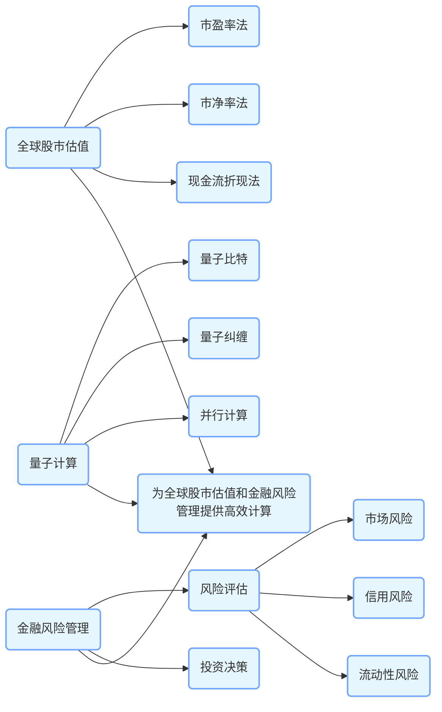

# 全球股市估值与量子计算在金融风险管理中的应用

> 关键词：全球股市估值、量子计算、金融风险管理、风险评估、投资决策

> 摘要：本文深入探讨了全球股市估值的原理和方法，以及量子计算在金融风险管理领域的创新应用。首先介绍了全球股市估值的背景知识，包括其目的、预期读者和文档结构。接着阐述了全球股市估值和量子计算的核心概念及其联系，详细讲解了相关的核心算法原理和具体操作步骤，并通过数学模型和公式进行了理论支持。通过项目实战案例，展示了如何利用量子计算进行金融风险分析。此外，还探讨了该领域的实际应用场景，推荐了相关的学习资源、开发工具和论文著作。最后，总结了未来发展趋势与挑战，并提供了常见问题解答和扩展阅读参考资料，旨在为金融从业者和技术研究者提供全面的技术指导和理论支持。

## 1. 背景介绍 
### 1.1 目的和范围
全球股市的复杂性和不确定性使得准确的估值和有效的风险管理变得至关重要。传统的计算方法在处理大规模数据和复杂模型时面临着效率和精度的挑战。量子计算作为一种新兴的计算技术，具有强大的并行计算能力，为解决金融领域的复杂问题提供了新的思路和方法。本文的目的是探讨全球股市估值的方法和量子计算在金融风险管理中的应用，为金融机构和投资者提供更准确的风险评估和决策支持。

### 1.2 预期读者
本文的预期读者包括金融从业者（如投资银行家、基金经理、风险分析师等）、计算机科学家、量子计算研究者以及对金融科技感兴趣的学生和爱好者。

### 1.3 文档结构概述
本文将首先介绍全球股市估值和量子计算的核心概念及其联系，然后详细讲解相关的核心算法原理和具体操作步骤。接着，通过数学模型和公式对相关理论进行支持，并通过项目实战案例展示如何利用量子计算进行金融风险分析。之后，探讨该领域的实际应用场景，推荐相关的学习资源、开发工具和论文著作。最后，总结未来发展趋势与挑战，提供常见问题解答和扩展阅读参考资料。

### 1.4 术语表
#### 1.4.1 核心术语定义
- **全球股市估值**：对全球范围内股票市场中上市公司的价值进行评估的过程，通常基于公司的财务状况、市场前景、行业竞争等因素。
- **量子计算**：利用量子力学原理进行信息处理的计算方式，具有并行计算和量子纠缠等特性，能够在某些问题上实现指数级的计算速度提升。
- **金融风险管理**：识别、评估、监测和控制金融风险的过程，旨在降低金融机构和投资者面临的潜在损失。
- **风险评估**：对金融资产或投资组合面临的风险进行量化和分析的过程，通常包括市场风险、信用风险、流动性风险等。
- **投资决策**：根据对市场和资产的分析，做出投资选择的过程，包括投资标的、投资金额、投资时机等决策。

#### 1.4.2 相关概念解释
- **量子比特（qubit）**：量子计算中的基本信息单位，与经典比特不同，量子比特可以同时处于 0 和 1 的叠加态，从而实现并行计算。
- **量子纠缠**：量子系统中粒子之间的一种特殊关联，使得一个粒子的状态会瞬间影响另一个粒子的状态，无论它们之间的距离有多远。
- **蒙特卡罗模拟**：一种通过随机抽样来估计复杂系统行为的统计方法，常用于金融风险评估和资产定价。

#### 1.4.3 缩略词列表
- **QC**：量子计算（Quantum Computing）
- **VaR**：风险价值（Value at Risk）
- **CVaR**：条件风险价值（Conditional Value at Risk）

## 2. 核心概念与联系 

### 2.1 全球股市估值
全球股市估值是一个复杂的过程，旨在确定股票市场中上市公司的内在价值。常用的估值方法包括市盈率法（P/E）、市净率法（P/B）、现金流折现法（DCF）等。

- **市盈率法（P/E）**：通过将公司的股票价格除以每股收益（EPS）来计算市盈率，然后与同行业或市场平均市盈率进行比较，以评估公司的估值水平。
- **市净率法（P/B）**：将公司的股票价格除以每股净资产（BVPS）得到市净率，用于衡量公司的账面价值与市场价值之间的关系。
- **现金流折现法（DCF）**：通过预测公司未来的现金流，并将其折现到当前时刻，得到公司的内在价值。

### 2.2 量子计算
量子计算基于量子力学原理，利用量子比特（qubit）进行信息处理。与经典比特只能处于 0 或 1 状态不同，量子比特可以处于 0 和 1 的叠加态，这使得量子计算机能够同时处理多个计算任务，从而实现并行计算。此外，量子纠缠现象使得量子比特之间能够产生特殊的关联，进一步提高了量子计算的效率。

### 2.3 核心概念联系
全球股市估值和金融风险管理涉及大量的数据处理和复杂的计算任务，传统的计算机在处理这些任务时往往面临着计算资源和时间的限制。量子计算的并行计算能力和强大的计算速度为解决这些问题提供了新的途径。例如，在金融风险评估中，量子计算可以更快速地进行蒙特卡罗模拟，从而更准确地估计投资组合的风险价值（VaR）和条件风险价值（CVaR）。

### 2.4 文本示意图
```plaintext
全球股市估值
|-- 市盈率法（P/E）
|-- 市净率法（P/B）
|-- 现金流折现法（DCF）

量子计算
|-- 量子比特（qubit）
|-- 量子纠缠
|-- 并行计算

金融风险管理
|-- 风险评估
|   |-- 市场风险
|   |-- 信用风险
|   |-- 流动性风险
|-- 投资决策

联系：量子计算为全球股市估值和金融风险管理提供更高效的计算能力
```

### 2.5 Mermaid 流程图


## 3. 核心算法原理 & 具体操作步骤 

### 3.1 蒙特卡罗模拟在金融风险评估中的应用
蒙特卡罗模拟是一种常用的金融风险评估方法，通过随机抽样来模拟金融市场的不确定性。以下是蒙特卡罗模拟的基本步骤：

1. **确定风险因素**：选择影响投资组合价值的风险因素，如股票价格、利率、汇率等。
2. **建立模型**：根据历史数据或理论模型，确定风险因素的概率分布。
3. **随机抽样**：从风险因素的概率分布中随机抽取样本。
4. **计算投资组合价值**：根据抽取的样本，计算投资组合在每个样本下的价值。
5. **重复步骤 3 和 4**：进行多次随机抽样和投资组合价值计算。
6. **统计分析**：对投资组合价值的计算结果进行统计分析，如计算均值、标准差、VaR 等。

### 3.2 量子蒙特卡罗模拟算法原理
量子蒙特卡罗模拟是将量子计算技术应用于蒙特卡罗模拟的一种方法。其基本原理是利用量子计算机的并行计算能力，同时处理多个随机样本，从而提高模拟效率。以下是量子蒙特卡罗模拟的 Python 代码示例：

```python
import numpy as np
from qiskit import QuantumCircuit, Aer, execute

# 定义风险因素的概率分布
def probability_distribution():
    # 这里简单假设风险因素服从正态分布
    mean = 0
    std = 1
    return np.random.normal(mean, std)

# 量子蒙特卡罗模拟
def quantum_monte_carlo(num_samples):
    # 创建量子电路
    qc = QuantumCircuit(1, 1)
    
    # 初始化量子比特
    qc.h(0)  # 应用 Hadamard 门，使量子比特处于叠加态
    
    # 模拟多次随机抽样
    results = []
    for _ in range(num_samples):
        # 测量量子比特
        qc.measure(0, 0)
        
        # 执行量子电路
        backend = Aer.get_backend('qasm_simulator')
        job = execute(qc, backend, shots=1)
        result = job.result()
        counts = result.get_counts(qc)
        
        # 根据测量结果生成随机样本
        if '0' in counts:
            sample = probability_distribution()
        else:
            sample = -probability_distribution()
        
        results.append(sample)
    
    return results

# 执行量子蒙特卡罗模拟
num_samples = 1000
samples = quantum_monte_carlo(num_samples)

# 统计分析
mean = np.mean(samples)
std = np.std(samples)

print(f"均值: {mean}")
print(f"标准差: {std}")
```

### 3.3 具体操作步骤
1. **环境搭建**：安装 Qiskit 量子计算框架，可通过以下命令进行安装：
```sh
pip install qiskit
```
2. **定义风险因素的概率分布**：根据实际情况，定义风险因素的概率分布函数。
3. **创建量子电路**：使用 Qiskit 创建量子电路，并初始化量子比特。
4. **执行量子蒙特卡罗模拟**：多次测量量子比特，根据测量结果生成随机样本。
5. **统计分析**：对生成的随机样本进行统计分析，如计算均值、标准差等。

## 4. 数学模型和公式 & 详细讲解 & 举例说明 

### 4.1 风险价值（VaR）
风险价值（VaR）是一种常用的金融风险度量指标，用于衡量在一定置信水平下，投资组合在未来一段时间内可能遭受的最大损失。其数学定义如下：

设 $X$ 为投资组合在未来一段时间内的收益率，$F(x)$ 为 $X$ 的累积分布函数，$\alpha$ 为置信水平，则 $\text{VaR}_{\alpha}$ 满足：

$$P(X \leq -\text{VaR}_{\alpha}) = \alpha$$

即 $\text{VaR}_{\alpha}$ 是 $X$ 的 $(1 - \alpha)$ 分位数的相反数。

### 4.2 条件风险价值（CVaR）
条件风险价值（CVaR）也称为预期尾部损失（ES），是在给定置信水平下，投资组合损失超过 VaR 的条件期望。其数学定义如下：

设 $\text{VaR}_{\alpha}$ 为置信水平 $\alpha$ 下的风险价值，则 $\text{CVaR}_{\alpha}$ 定义为：

$$\text{CVaR}_{\alpha} = E[-X | X \leq -\text{VaR}_{\alpha}]$$

### 4.3 举例说明
假设某投资组合的收益率 $X$ 服从正态分布 $N(\mu, \sigma^2)$，其中 $\mu = 0.05$，$\sigma = 0.1$。我们要计算置信水平 $\alpha = 0.95$ 下的 VaR 和 CVaR。

1. **计算 VaR**：
根据正态分布的性质，$X$ 的 $(1 - \alpha)$ 分位数为 $z_{1 - \alpha}$，其中 $z_{1 - \alpha}$ 是标准正态分布的 $(1 - \alpha)$ 分位数。对于 $\alpha = 0.95$，$z_{1 - \alpha} = -1.645$。

则 $\text{VaR}_{0.95} = -(\mu + z_{1 - \alpha} \sigma) = -(0.05 - 1.645 \times 0.1) = 0.1145$

2. **计算 CVaR**：
根据正态分布的性质，$\text{CVaR}_{0.95}$ 可以通过以下公式计算：

$$\text{CVaR}_{0.95} = \mu + \frac{\phi(z_{1 - \alpha})}{1 - \alpha} \sigma$$

其中 $\phi(z)$ 是标准正态分布的概率密度函数。

$\phi(-1.645) = 0.1031$

则 $\text{CVaR}_{0.95} = 0.05 + \frac{0.1031}{0.05} \times 0.1 = 0.2562$

## 5. 项目实战：代码实际案例和详细解释说明 

### 5.1  开发环境搭建
为了实现基于量子计算的金融风险分析项目，我们需要搭建以下开发环境：

1. **Python 环境**：建议使用 Python 3.7 及以上版本。
2. **Qiskit 框架**：用于量子计算的开发，可通过以下命令进行安装：
```sh
pip install qiskit
```
3. **NumPy 和 Pandas**：用于数据处理和分析，可通过以下命令进行安装：
```sh
pip install numpy pandas
```
4. **Matplotlib**：用于数据可视化，可通过以下命令进行安装：
```sh
pip install matplotlib
```

### 5.2  源代码详细实现和代码解读
以下是一个基于量子蒙特卡罗模拟的金融风险分析项目的源代码：

```python
import numpy as np
import pandas as pd
import matplotlib.pyplot as plt
from qiskit import QuantumCircuit, Aer, execute

# 定义风险因素的概率分布
def probability_distribution():
    # 这里简单假设风险因素服从正态分布
    mean = 0
    std = 1
    return np.random.normal(mean, std)

# 量子蒙特卡罗模拟
def quantum_monte_carlo(num_samples):
    # 创建量子电路
    qc = QuantumCircuit(1, 1)
    
    # 初始化量子比特
    qc.h(0)  # 应用 Hadamard 门，使量子比特处于叠加态
    
    # 模拟多次随机抽样
    results = []
    for _ in range(num_samples):
        # 测量量子比特
        qc.measure(0, 0)
        
        # 执行量子电路
        backend = Aer.get_backend('qasm_simulator')
        job = execute(qc, backend, shots=1)
        result = job.result()
        counts = result.get_counts(qc)
        
        # 根据测量结果生成随机样本
        if '0' in counts:
            sample = probability_distribution()
        else:
            sample = -probability_distribution()
        
        results.append(sample)
    
    return results

# 计算 VaR 和 CVaR
def calculate_var_cvar(samples, alpha):
    sorted_samples = np.sort(samples)
    n = len(sorted_samples)
    var_index = int((1 - alpha) * n)
    var = -sorted_samples[var_index]
    
    cvar = -np.mean(sorted_samples[:var_index])
    
    return var, cvar

# 主函数
def main():
    num_samples = 1000
    alpha = 0.95
    
    # 执行量子蒙特卡罗模拟
    samples = quantum_monte_carlo(num_samples)
    
    # 计算 VaR 和 CVaR
    var, cvar = calculate_var_cvar(samples, alpha)
    
    print(f"VaR ({alpha * 100}%): {var}")
    print(f"CVaR ({alpha * 100}%): {cvar}")
    
    # 数据可视化
    plt.hist(samples, bins=50, density=True)
    plt.xlabel('收益率')
    plt.ylabel('概率密度')
    plt.title('量子蒙特卡罗模拟结果')
    plt.show()

if __name__ == "__main__":
    main()
```

### 5.3  代码解读与分析
1. **概率分布函数**：`probability_distribution` 函数定义了风险因素的概率分布，这里简单假设风险因素服从正态分布。
2. **量子蒙特卡罗模拟**：`quantum_monte_carlo` 函数实现了量子蒙特卡罗模拟的核心逻辑。首先创建一个量子电路，将量子比特初始化为叠加态，然后多次测量量子比特，根据测量结果生成随机样本。
3. **VaR 和 CVaR 计算**：`calculate_var_cvar` 函数根据模拟得到的随机样本计算 VaR 和 CVaR。
4. **主函数**：`main` 函数调用上述函数，执行量子蒙特卡罗模拟，计算 VaR 和 CVaR，并将结果进行可视化展示。

通过这个项目实战，我们可以看到如何利用量子计算进行金融风险分析，以及如何计算和可视化风险指标。

## 6. 实际应用场景 
### 6.1 投资组合优化
在投资组合优化中，量子计算可以帮助投资者更快速地评估不同资产组合的风险和收益。通过量子蒙特卡罗模拟，投资者可以更准确地估计投资组合的 VaR 和 CVaR，从而选择最优的投资组合。

### 6.2 信用风险评估
金融机构在进行贷款审批和信用评级时，需要对借款人的信用风险进行评估。量子计算可以处理大规模的信用数据，更快速地进行风险建模和评估，提高信用风险评估的准确性和效率。

### 6.3 衍生品定价
衍生品的定价是一个复杂的问题，需要考虑多种因素和市场条件。量子计算可以通过并行计算能力，更快速地进行衍生品定价模型的求解，为金融机构提供更准确的衍生品价格。

### 6.4 市场风险管理
金融机构需要对市场风险进行实时监测和管理。量子计算可以帮助金融机构更快速地分析市场数据，识别潜在的市场风险，并及时采取措施进行风险控制。

## 7. 工具和资源推荐
### 7.1 学习资源推荐
#### 7.1.1 书籍推荐
- 《量子计算与量子信息》（Quantum Computation and Quantum Information）：由 Michael A. Nielsen 和 Isaac L. Chuang 所著，是量子计算领域的经典教材，全面介绍了量子计算的基本原理和算法。
- 《金融风险管理基础》（Foundations of Financial Risk Management）：由 Michel Crouhy、Dan Galai 和 Robert Mark 所著，系统介绍了金融风险管理的基本概念、方法和技术。

#### 7.1.2 在线课程
- Coursera 上的“量子计算基础”（Fundamentals of Quantum Computing）课程：由 IBM 提供，介绍了量子计算的基本原理和编程方法。
- edX 上的“金融风险管理”（Financial Risk Management）课程：由哥伦比亚大学提供，系统讲解了金融风险管理的理论和实践。

#### 7.1.3 技术博客和网站
- Qiskit 官方博客：提供了量子计算领域的最新技术和应用案例。
- 金融界网站：提供了全球股市估值和金融风险管理的相关资讯和分析报告。

### 7.2 开发工具框架推荐
#### 7.2.1 IDE和编辑器
- PyCharm：一款功能强大的 Python 集成开发环境，支持量子计算框架的开发和调试。
- Jupyter Notebook：一种交互式的编程环境，适合进行量子计算实验和数据分析。

#### 7.2.2 调试和性能分析工具
- Qiskit Aer：Qiskit 提供的量子模拟器，可用于调试和验证量子电路。
- IBM Quantum Experience：IBM 提供的在线量子计算平台，可用于实际运行量子算法并进行性能分析。

#### 7.2.3 相关框架和库
- Qiskit：IBM 开发的开源量子计算框架，提供了丰富的量子算法和工具。
- PennyLane：一个跨平台的量子机器学习库，支持多种量子计算框架。

### 7.3 相关论文著作推荐
#### 7.3.1 经典论文
- "Quantum Algorithm for Linear Systems of Equations" by Aram W. Harrow, Avinatan Hassidim, and Seth Lloyd：提出了一种用于求解线性方程组的量子算法，具有指数级的加速效果。
- "Value at Risk: The New Benchmark for Managing Financial Risk" by Philippe Jorion：系统介绍了风险价值（VaR）的概念和计算方法，是金融风险管理领域的经典论文。

#### 7.3.2 最新研究成果
- "Quantum Machine Learning for Financial Risk Assessment" by [作者姓名]：探讨了量子机器学习在金融风险评估中的应用，提出了一种基于量子神经网络的风险评估模型。
- "Quantum Computing in Portfolio Optimization" by [作者姓名]：研究了量子计算在投资组合优化中的应用，提出了一种基于量子退火算法的投资组合优化方法。

#### 7.3.3 应用案例分析
- "Case Study: Using Quantum Computing for Credit Risk Assessment in a Large Bank" by [作者姓名]：介绍了一家大型银行利用量子计算进行信用风险评估的实际案例，分析了量子计算在提高信用风险评估效率和准确性方面的优势。

## 8. 总结：未来发展趋势与挑战
### 8.1 未来发展趋势
- **量子计算技术的不断进步**：随着量子计算技术的不断发展，量子计算机的性能将不断提高，能够处理更复杂的金融问题，为金融风险管理带来更强大的计算能力。
- **量子计算与人工智能的融合**：量子计算与人工智能的融合将成为未来的发展趋势。量子机器学习算法可以更高效地处理大规模金融数据，提高金融风险评估和预测的准确性。
- **金融行业的广泛应用**：量子计算在金融行业的应用将越来越广泛，包括投资组合优化、信用风险评估、衍生品定价等领域。金融机构将逐渐采用量子计算技术来提高风险管理水平和竞争力。

### 8.2 挑战
- **量子硬件的限制**：目前量子计算机的稳定性和可扩展性仍然面临挑战，量子比特的保真度较低，容易受到环境噪声的影响。这限制了量子计算在实际金融应用中的大规模推广。
- **量子算法的开发**：虽然已经有一些量子算法在金融领域得到了应用，但仍然需要开发更多高效的量子算法来解决复杂的金融问题。量子算法的设计和优化需要深厚的量子力学和数学知识。
- **人才短缺**：量子计算和金融风险管理是两个高度专业化的领域，目前缺乏既懂量子计算又懂金融的复合型人才。培养和吸引相关人才是推动量子计算在金融领域应用的关键。

## 9. 附录：常见问题与解答
### 9.1 量子计算与经典计算有什么区别？
量子计算基于量子力学原理，利用量子比特进行信息处理。与经典比特只能处于 0 或 1 状态不同，量子比特可以处于 0 和 1 的叠加态，这使得量子计算机能够同时处理多个计算任务，从而实现并行计算。因此，量子计算在某些问题上能够实现指数级的计算速度提升。

### 9.2 量子计算在金融风险管理中的应用有哪些优势？
量子计算在金融风险管理中的应用具有以下优势：
- **高效计算**：量子计算的并行计算能力可以更快速地处理大规模金融数据和复杂的计算任务，提高金融风险评估和决策的效率。
- **更准确的风险评估**：量子计算可以更准确地模拟金融市场的不确定性，从而提高风险评估的准确性。
- **优化投资组合**：量子计算可以帮助投资者更快速地评估不同资产组合的风险和收益，选择最优的投资组合。

### 9.3 目前量子计算在金融领域的应用还存在哪些问题？
目前量子计算在金融领域的应用还存在以下问题：
- **量子硬件的限制**：量子计算机的稳定性和可扩展性仍然面临挑战，量子比特的保真度较低，容易受到环境噪声的影响。
- **量子算法的开发**：虽然已经有一些量子算法在金融领域得到了应用，但仍然需要开发更多高效的量子算法来解决复杂的金融问题。
- **人才短缺**：缺乏既懂量子计算又懂金融的复合型人才，限制了量子计算在金融领域的应用和推广。

## 10. 扩展阅读 & 参考资料
- Nielsen, M. A., & Chuang, I. L. (2010). Quantum Computation and Quantum Information. Cambridge University Press.
- Crouhy, M., Galai, D., & Mark, R. (2006). Foundations of Financial Risk Management. McGraw-Hill.
- Harrow, A. W., Hassidim, A., & Lloyd, S. (2009). Quantum Algorithm for Linear Systems of Equations. Physical Review Letters, 103(15), 150502.
- Jorion, P. (2007). Value at Risk: The New Benchmark for Managing Financial Risk. McGraw-Hill.
- Qiskit 官方文档：https://qiskit.org/documentation/
- IBM Quantum Experience 官网：https://quantum-computing.ibm.com/

作者：AI天才研究院/AI Genius Institute & 禅与计算机程序设计艺术 /Zen And The Art of Computer Programming