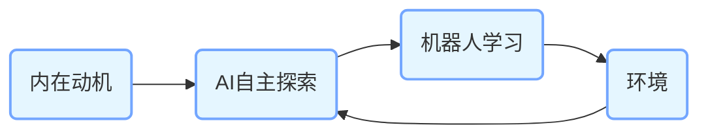

# 内在动机驱动的AI自主探索在机器人学习中的应用

> 关键词：内在动机、AI自主探索、机器人学习、强化学习、奖励机制

> 摘要：本文深入探讨了内在动机驱动的AI自主探索在机器人学习中的应用。首先介绍了相关背景知识，包括研究目的、预期读者、文档结构和术语定义。接着阐述了核心概念，如内在动机和AI自主探索的原理及联系，并给出了相应的示意图和流程图。详细讲解了核心算法原理，用Python代码进行了具体实现。同时，分析了数学模型和公式，并举例说明。通过项目实战，展示了代码实际案例和详细解释。还探讨了实际应用场景，推荐了学习资源、开发工具和相关论文。最后总结了未来发展趋势与挑战，提供了常见问题解答和扩展阅读参考资料，旨在为相关领域的研究者和开发者提供全面且深入的技术指导。

## 1. 背景介绍 
### 1.1 目的和范围
随着人工智能和机器人技术的不断发展，机器人需要具备更强的自主学习能力，以适应复杂多变的环境。内在动机驱动的AI自主探索为机器人学习提供了一种新的思路。本文的目的在于详细介绍内在动机驱动的AI自主探索在机器人学习中的应用，涵盖其核心概念、算法原理、数学模型、实际案例等方面，旨在让读者全面了解这一技术的原理和应用方法。

### 1.2 预期读者
本文预期读者包括人工智能、机器人学领域的研究者、开发者，对相关技术感兴趣的学生，以及希望了解机器人自主学习技术的行业从业者。

### 1.3 文档结构概述
本文首先介绍相关背景知识，包括目的、读者和术语定义。接着阐述核心概念和联系，给出原理和架构的示意图与流程图。然后讲解核心算法原理，用Python代码实现具体操作步骤。分析数学模型和公式，并举例说明。通过项目实战展示代码案例和详细解释。探讨实际应用场景，推荐学习资源、开发工具和相关论文。最后总结未来发展趋势与挑战，提供常见问题解答和扩展阅读参考资料。

### 1.4 术语表
#### 1.4.1 核心术语定义
- **内在动机（Intrinsic Motivation）**：指机器人或AI系统基于自身内部的需求和目标，而非外部明确的奖励信号，产生的一种主动探索和学习的动力。
- **AI自主探索（AI Autonomous Exploration）**：AI系统在没有外部详细指令的情况下，主动地对环境进行探索，以获取新的知识和经验。
- **机器人学习（Robot Learning）**：机器人通过与环境进行交互，不断调整自身的行为和策略，以提高完成任务的能力。

#### 1.4.2 相关概念解释
- **强化学习（Reinforcement Learning）**：一种机器学习方法，智能体通过与环境进行交互，根据环境反馈的奖励信号来学习最优的行为策略。
- **奖励机制（Reward Mechanism）**：在强化学习中，用于衡量智能体行为好坏的一种反馈机制，分为外在奖励和内在奖励。

#### 1.4.3 缩略词列表
- **RL**：Reinforcement Learning（强化学习）
- **AI**：Artificial Intelligence（人工智能）

## 2. 核心概念与联系 
### 核心概念原理
#### 内在动机
内在动机的核心思想是让机器人或AI系统在没有外部明确奖励的情况下，也能主动地去探索环境。这通常基于一些内部的奖励信号，如对新颖性的追求、对自身能力提升的感知等。例如，机器人在探索新的环境区域时，会得到一个基于新颖性的内在奖励，从而激励它继续探索。

#### AI自主探索
AI自主探索强调AI系统的自主性，它能够根据自身的状态和环境信息，自主地选择探索的方向和方式。通过不断地尝试新的行为，AI系统可以发现新的知识和规律，从而提高自身的学习能力。

#### 机器人学习
机器人学习是一个不断迭代的过程，机器人通过与环境进行交互，获取环境的反馈信息，然后根据这些信息调整自己的行为策略。内在动机驱动的AI自主探索可以为机器人学习提供更多的探索机会，从而加速机器人的学习过程。

### 架构的文本示意图
```plaintext
            内在动机
               |
               v
AI自主探索 ----> 机器人学习
               ^
               |
            环境反馈
```
这个示意图展示了内在动机驱动AI自主探索，进而促进机器人学习的过程。同时，机器人在学习过程中会与环境进行交互，获取环境反馈，进一步调整自身的探索行为。

### Mermaid流程图

该流程图清晰地展示了内在动机、AI自主探索、机器人学习和环境之间的关系。内在动机促使AI进行自主探索，探索的结果用于机器人学习，而机器人学习的过程又会与环境进行交互，环境反馈会影响后续的探索行为。

## 3. 核心算法原理 & 具体操作步骤 
### 核心算法原理
在内在动机驱动的AI自主探索中，常用的算法是基于强化学习的方法。以深度Q网络（Deep Q-Network，DQN）为例，其核心思想是通过一个神经网络来估计每个动作的Q值（即该动作在当前状态下的预期累积奖励），然后选择Q值最大的动作执行。

内在动机的引入通常是在奖励函数中加入一个内在奖励项。例如，定义内在奖励 $r_{int}$ 为对状态新颖性的度量，总的奖励 $r_{total}$ 为外在奖励 $r_{ext}$ 和内在奖励 $r_{int}$ 之和：

$r_{total} = r_{ext} + r_{int}$

### 具体操作步骤
#### 步骤1：初始化
初始化DQN网络的参数 $\theta$，经验回放缓冲区 $D$，折扣因子 $\gamma$，内在奖励系数 $\alpha$ 等。

```python
import torch
import torch.nn as nn
import torch.optim as optim
import random
import numpy as np

# 定义DQN网络
class DQN(nn.Module):
    def __init__(self, input_dim, output_dim):
        super(DQN, self).__init__()
        self.fc1 = nn.Linear(input_dim, 64)
        self.fc2 = nn.Linear(64, 64)
        self.fc3 = nn.Linear(64, output_dim)

    def forward(self, x):
        x = torch.relu(self.fc1(x))
        x = torch.relu(self.fc2(x))
        return self.fc3(x)

# 初始化参数
input_dim = 4  # 假设状态维度为4
output_dim = 2  # 假设动作维度为2
model = DQN(input_dim, output_dim)
target_model = DQN(input_dim, output_dim)
target_model.load_state_dict(model.state_dict())
optimizer = optim.Adam(model.parameters(), lr=0.001)
D = []  # 经验回放缓冲区
gamma = 0.99  # 折扣因子
alpha = 0.1  # 内在奖励系数
```

#### 步骤2：环境交互
在每个时间步 $t$，机器人根据当前状态 $s_t$ 选择动作 $a_t$，与环境进行交互，得到下一个状态 $s_{t+1}$ 和外在奖励 $r_{ext}$。

```python
# 选择动作
def select_action(state):
    state = torch.FloatTensor(state).unsqueeze(0)
    q_values = model(state)
    action = torch.argmax(q_values).item()
    return action

# 环境交互
state = np.random.rand(input_dim)  # 初始化状态
for t in range(1000):
    action = select_action(state)
    # 假设环境返回下一个状态和外在奖励
    next_state = np.random.rand(input_dim)
    r_ext = np.random.rand()
```

#### 步骤3：计算内在奖励
计算当前状态的内在奖励 $r_{int}$，可以使用状态的新颖性度量方法，如基于状态访问频率的方法。

```python
# 假设使用简单的新颖性度量：状态访问频率的倒数
state_counts = {}

def calculate_intrinsic_reward(state):
    state_tuple = tuple(state)
    if state_tuple not in state_counts:
        state_counts[state_tuple] = 0
    state_counts[state_tuple] += 1
    return 1 / state_counts[state_tuple]

r_int = calculate_intrinsic_reward(state)
r_total = r_ext + alpha * r_int
```

#### 步骤4：经验回放
将 $(s_t, a_t, r_{total}, s_{t+1})$ 存储到经验回放缓冲区 $D$ 中，并从缓冲区中随机采样一批数据进行训练。

```python
# 存储经验
experience = (state, action, r_total, next_state)
D.append(experience)

# 经验回放
batch_size = 32
if len(D) >= batch_size:
    batch = random.sample(D, batch_size)
    states, actions, rewards, next_states = zip(*batch)
    states = torch.FloatTensor(states)
    actions = torch.LongTensor(actions).unsqueeze(1)
    rewards = torch.FloatTensor(rewards).unsqueeze(1)
    next_states = torch.FloatTensor(next_states)

    q_values = model(states).gather(1, actions)
    next_q_values = target_model(next_states).max(1)[0].unsqueeze(1)
    target_q_values = rewards + gamma * next_q_values

    loss = nn.MSELoss()(q_values, target_q_values)
    optimizer.zero_grad()
    loss.backward()
    optimizer.step()
```

#### 步骤5：更新目标网络
定期更新目标网络的参数，使其与主网络的参数保持一致。

```python
# 每100步更新一次目标网络
if t % 100 == 0:
    target_model.load_state_dict(model.state_dict())

    state = next_state
```

## 4. 数学模型和公式 & 详细讲解 & 举例说明 
### 数学模型
在强化学习中，通常使用马尔可夫决策过程（Markov Decision Process，MDP）来描述机器人与环境的交互过程。一个MDP可以用一个五元组 $(S, A, P, R, \gamma)$ 表示：
- $S$ 是状态空间，表示机器人可能处于的所有状态的集合。
- $A$ 是动作空间，表示机器人可以执行的所有动作的集合。
- $P(s'|s, a)$ 是状态转移概率，表示在状态 $s$ 执行动作 $a$ 后转移到状态 $s'$ 的概率。
- $R(s, a, s')$ 是奖励函数，表示在状态 $s$ 执行动作 $a$ 转移到状态 $s'$ 后获得的奖励。
- $\gamma$ 是折扣因子，用于衡量未来奖励的重要性。

### 价值函数
在MDP中，常用的价值函数有状态价值函数 $V(s)$ 和动作价值函数 $Q(s, a)$：
- 状态价值函数 $V(s)$ 表示从状态 $s$ 开始，遵循某个策略 $\pi$ 所能获得的预期累积奖励：
  $$V^{\pi}(s) = \mathbb{E}_{\pi}\left[\sum_{t=0}^{\infty}\gamma^{t}R(s_t, a_t, s_{t+1})|s_0 = s\right]$$
- 动作价值函数 $Q(s, a)$ 表示在状态 $s$ 执行动作 $a$，然后遵循某个策略 $\pi$ 所能获得的预期累积奖励：
  $$Q^{\pi}(s, a) = \mathbb{E}_{\pi}\left[\sum_{t=0}^{\infty}\gamma^{t}R(s_t, a_t, s_{t+1})|s_0 = s, a_0 = a\right]$$

### 最优策略
最优策略 $\pi^*$ 是使得动作价值函数 $Q(s, a)$ 最大的策略：
$$\pi^*(s) = \arg\max_{a}Q^*(s, a)$$
其中 $Q^*(s, a)$ 是最优动作价值函数。

### 贝尔曼方程
价值函数满足贝尔曼方程，以动作价值函数为例：
$$Q^{\pi}(s, a) = \mathbb{E}_{s'\sim P(\cdot|s, a)}\left[R(s, a, s') + \gamma V^{\pi}(s')\right]$$
最优动作价值函数满足最优贝尔曼方程：
$$Q^*(s, a) = \mathbb{E}_{s'\sim P(\cdot|s, a)}\left[R(s, a, s') + \gamma \max_{a'}Q^*(s', a')\right]$$

### 举例说明
假设一个简单的机器人导航任务，机器人在一个二维网格世界中移动。状态 $s$ 可以表示机器人在网格中的位置 $(x, y)$，动作 $a$ 可以是上下左右四个方向的移动。外在奖励 $r_{ext}$ 可以是机器人到达目标位置时获得的正奖励，未到达目标时获得的零奖励。

内在奖励 $r_{int}$ 可以根据机器人访问每个网格的频率来计算。例如，机器人第一次访问某个网格时，$r_{int} = 1$，第二次访问时，$r_{int} = 0.5$，以此类推。

总的奖励 $r_{total} = r_{ext} + \alpha r_{int}$，其中 $\alpha$ 是内在奖励系数。机器人通过不断地与环境交互，根据贝尔曼方程更新动作价值函数 $Q(s, a)$，最终找到最优策略。

## 5. 项目实战：代码实际案例和详细解释说明 
### 5.1  开发环境搭建
#### 安装Python
首先需要安装Python，建议使用Python 3.7及以上版本。可以从Python官方网站（https://www.python.org/downloads/） 下载并安装。

#### 安装必要的库
使用以下命令安装必要的库：
```bash
pip install torch numpy matplotlib gym
```
- `torch`：用于深度学习模型的构建和训练。
- `numpy`：用于数值计算。
- `matplotlib`：用于可视化结果。
- `gym`：OpenAI开发的一个用于开发和比较强化学习算法的工具包。

### 5.2  源代码详细实现和代码解读
```python
import torch
import torch.nn as nn
import torch.optim as optim
import random
import numpy as np
import gym
import matplotlib.pyplot as plt

# 定义DQN网络
class DQN(nn.Module):
    def __init__(self, input_dim, output_dim):
        super(DQN, self).__init__()
        self.fc1 = nn.Linear(input_dim, 64)
        self.fc2 = nn.Linear(64, 64)
        self.fc3 = nn.Linear(64, output_dim)

    def forward(self, x):
        x = torch.relu(self.fc1(x))
        x = torch.relu(self.fc2(x))
        return self.fc3(x)

# 选择动作
def select_action(state, model, epsilon):
    if random.random() < epsilon:
        return random.randint(0, model.fc3.out_features - 1)
    state = torch.FloatTensor(state).unsqueeze(0)
    q_values = model(state)
    action = torch.argmax(q_values).item()
    return action

# 计算内在奖励
state_counts = {}
def calculate_intrinsic_reward(state):
    state_tuple = tuple(state)
    if state_tuple not in state_counts:
        state_counts[state_tuple] = 0
    state_counts[state_tuple] += 1
    return 1 / state_counts[state_tuple]

# 训练函数
def train(model, target_model, optimizer, D, gamma, alpha, batch_size):
    if len(D) >= batch_size:
        batch = random.sample(D, batch_size)
        states, actions, rewards, next_states = zip(*batch)
        states = torch.FloatTensor(states)
        actions = torch.LongTensor(actions).unsqueeze(1)
        rewards = torch.FloatTensor(rewards).unsqueeze(1)
        next_states = torch.FloatTensor(next_states)

        q_values = model(states).gather(1, actions)
        next_q_values = target_model(next_states).max(1)[0].unsqueeze(1)
        target_q_values = rewards + gamma * next_q_values

        loss = nn.MSELoss()(q_values, target_q_values)
        optimizer.zero_grad()
        loss.backward()
        optimizer.step()

# 主函数
def main():
    env = gym.make('CartPole-v1')
    input_dim = env.observation_space.shape[0]
    output_dim = env.action_space.n

    model = DQN(input_dim, output_dim)
    target_model = DQN(input_dim, output_dim)
    target_model.load_state_dict(model.state_dict())
    optimizer = optim.Adam(model.parameters(), lr=0.001)
    D = []  # 经验回放缓冲区
    gamma = 0.99  # 折扣因子
    alpha = 0.1  # 内在奖励系数
    epsilon = 1.0  # 探索率
    epsilon_decay = 0.995  # 探索率衰减率
    epsilon_min = 0.01  # 最小探索率
    batch_size = 32
    episodes = 1000
    rewards = []

    for episode in range(episodes):
        state = env.reset()
        episode_reward = 0
        for t in range(500):
            action = select_action(state, model, epsilon)
            next_state, r_ext, done, _ = env.step(action)
            r_int = calculate_intrinsic_reward(state)
            r_total = r_ext + alpha * r_int
            experience = (state, action, r_total, next_state)
            D.append(experience)
            train(model, target_model, optimizer, D, gamma, alpha, batch_size)
            state = next_state
            episode_reward += r_total
            if done:
                break

        if episode % 100 == 0:
            target_model.load_state_dict(model.state_dict())
        epsilon = max(epsilon * epsilon_decay, epsilon_min)
        rewards.append(episode_reward)
        print(f'Episode {episode}: Reward = {episode_reward}')

    plt.plot(rewards)
    plt.xlabel('Episode')
    plt.ylabel('Reward')
    plt.title('Training Rewards')
    plt.show()

if __name__ == '__main__':
    main()
```

### 5.3  代码解读与分析
#### 代码结构
- `DQN` 类：定义了深度Q网络，包含三个全连接层。
- `select_action` 函数：根据当前状态和探索率选择动作，使用 $\epsilon$-贪心策略。
- `calculate_intrinsic_reward` 函数：计算当前状态的内在奖励，使用状态访问频率的倒数作为新颖性度量。
- `train` 函数：从经验回放缓冲区中采样一批数据，计算损失并更新网络参数。
- `main` 函数：主函数，初始化环境、网络、优化器等，进行训练，并绘制训练奖励曲线。

#### 训练过程
1. 初始化环境、网络、优化器等参数。
2. 在每个回合中，机器人与环境进行交互，选择动作，获取外在奖励和下一个状态。
3. 计算内在奖励，将总的奖励和经验存储到经验回放缓冲区中。
4. 从缓冲区中采样一批数据进行训练，更新网络参数。
5. 定期更新目标网络的参数。
6. 衰减探索率，逐渐减少随机探索的概率。

#### 结果分析
通过绘制训练奖励曲线，可以观察到机器人在训练过程中的性能变化。如果奖励曲线逐渐上升，说明机器人在不断学习和进步。

## 6. 实际应用场景 
### 机器人导航
在未知环境中，机器人需要自主探索以找到目标位置。内在动机驱动的AI自主探索可以让机器人主动地去探索新的区域，而不仅仅依赖于预先设定的路径规划。例如，在室内环境中，机器人可以通过对新颖性的追求，探索各个房间，最终找到目标物品。

### 机器人操作
在工业生产中，机器人需要学习如何操作各种工具和物体。内在动机可以促使机器人主动尝试不同的操作方式，从而更快地掌握有效的操作策略。例如，机器人在装配任务中，可以通过自主探索不同的装配顺序和力度，提高装配效率和质量。

### 智能家居
智能家居系统中的机器人可以通过自主探索来了解用户的生活习惯和环境布局。例如，扫地机器人可以在无人干预的情况下，主动探索房间的各个角落，学习最佳的清扫路径，提高清扫效果。

### 教育机器人
教育机器人可以利用内在动机驱动的自主探索，为学生提供更加个性化的学习体验。机器人可以根据学生的反应和表现，主动调整教学内容和方式，激发学生的学习兴趣。

## 7. 工具和资源推荐
### 7.1 学习资源推荐
#### 7.1.1 书籍推荐
- 《Reinforcement Learning: An Introduction》：由Richard S. Sutton和Andrew G. Barto所著，是强化学习领域的经典教材，全面介绍了强化学习的基本概念、算法和应用。
- 《Deep Learning》：由Ian Goodfellow、Yoshua Bengio和Aaron Courville所著，详细介绍了深度学习的理论和实践，包括神经网络、卷积神经网络、循环神经网络等。

#### 7.1.2 在线课程
- Coursera上的“Reinforcement Learning Specialization”：由Alberta大学的教授授课，涵盖了强化学习的基础知识、算法和应用，通过实际案例和编程作业帮助学生掌握强化学习的技能。
- edX上的“Introduction to Artificial Intelligence”：由UC Berkeley的教授授课，介绍了人工智能的基本概念、算法和应用，包括搜索算法、机器学习、自然语言处理等。

#### 7.1.3 技术博客和网站
- OpenAI Blog（https://openai.com/blog/）：OpenAI发布最新研究成果和技术动态的博客，涵盖了人工智能的各个领域，包括强化学习、深度学习等。
- Towards Data Science（https://towardsdatascience.com/）：一个数据科学和机器学习的社区，有很多关于强化学习和机器人学习的优秀文章和教程。

### 7.2 开发工具框架推荐
#### 7.2.1 IDE和编辑器
- PyCharm：一款专门为Python开发设计的集成开发环境，具有代码编辑、调试、版本控制等功能，适合开发大规模的Python项目。
- Jupyter Notebook：一个交互式的开发环境，可以将代码、文本、图像等整合在一起，方便进行数据分析和模型训练。

#### 7.2.2 调试和性能分析工具
- TensorBoard：TensorFlow提供的一个可视化工具，可以用于监控模型的训练过程、可视化模型结构、分析性能指标等。
- Py-Spy：一个轻量级的Python性能分析工具，可以实时监控Python程序的CPU使用率、函数调用时间等。

#### 7.2.3 相关框架和库
- PyTorch：一个开源的深度学习框架，具有动态图机制，易于使用和调试，广泛应用于强化学习和机器人学习领域。
- OpenAI Gym：一个用于开发和比较强化学习算法的工具包，提供了各种模拟环境，如机器人导航、游戏等。

### 7.3 相关论文著作推荐
#### 7.3.1 经典论文
- “Playing Atari with Deep Reinforcement Learning”：由DeepMind团队发表，介绍了使用深度Q网络在Atari游戏上取得优异成绩的方法，开创了深度强化学习的先河。
- “Proximal Policy Optimization Algorithms”：由OpenAI团队发表，提出了近端策略优化算法，是一种高效的策略梯度算法。

#### 7.3.2 最新研究成果
- “Curiosity-driven Exploration by Self-supervised Prediction”：提出了一种基于自监督预测的内在动机机制，通过预测未来的状态来驱动机器人的自主探索。
- “Exploration by Random Network Distillation”：提出了一种随机网络蒸馏的方法，用于衡量状态的新颖性，从而激励机器人进行探索。

#### 7.3.3 应用案例分析
- “Learning Dexterous In-Hand Manipulation”：介绍了如何使用强化学习和内在动机驱动的自主探索，让机器人学会灵活的手部操作技能。
- “Autonomous Exploration and Mapping with a Team of Mobile Robots”：研究了多机器人团队的自主探索和地图构建问题，通过内在动机机制提高了探索效率。

## 8. 总结：未来发展趋势与挑战
### 未来发展趋势
- **多模态融合**：将视觉、听觉、触觉等多种传感器信息融合到内在动机驱动的AI自主探索中，使机器人能够更全面地感知环境，提高探索的效率和准确性。
- **终身学习**：让机器人具备终身学习的能力，能够在不断变化的环境中持续进行自主探索和学习，不断提升自身的智能水平。
- **多智能体协作**：研究多个机器人之间的协作探索问题，通过内在动机机制协调各个机器人的行为，实现更高效的任务完成。

### 挑战
- **内在动机设计**：如何设计有效的内在动机机制，使其能够准确地反映机器人的学习需求和环境的特点，仍然是一个具有挑战性的问题。
- **计算资源需求**：深度强化学习和自主探索算法通常需要大量的计算资源，如何在有限的计算资源下实现高效的探索和学习是一个亟待解决的问题。
- **安全性和可靠性**：在实际应用中，机器人的自主探索行为需要保证安全性和可靠性，避免对环境和人类造成伤害。

## 9. 附录：常见问题与解答
### 问题1：内在动机和外在奖励有什么区别？
内在动机是基于机器人自身内部的需求和目标产生的动力，不依赖于外部明确的奖励信号。而外在奖励是由环境直接提供的，用于衡量机器人行为的好坏。内在动机可以促使机器人主动地去探索新的环境和行为，而外在奖励通常引导机器人朝着特定的目标前进。

### 问题2：如何选择合适的内在奖励函数？
选择合适的内在奖励函数需要考虑机器人的任务和环境特点。常见的内在奖励函数包括对新颖性的度量、对自身能力提升的感知等。可以通过实验和调试来确定最适合的内在奖励函数。

### 问题3：内在动机驱动的AI自主探索是否适用于所有的机器人任务？
并不是所有的机器人任务都适合使用内在动机驱动的AI自主探索。对于一些目标明确、环境简单的任务，传统的基于外在奖励的方法可能更加有效。而对于复杂的、未知的环境，内在动机驱动的自主探索可以帮助机器人更快地学习和适应。

### 问题4：如何评估内在动机驱动的AI自主探索的效果？
可以通过多种指标来评估内在动机驱动的AI自主探索的效果，如探索的覆盖率、学习的速度、任务完成的成功率等。同时，也可以观察机器人的行为是否更加多样化和主动。

## 10. 扩展阅读 & 参考资料
- Sutton, R. S., & Barto, A. G. (2018). Reinforcement Learning: An Introduction. MIT press.
- Goodfellow, I., Bengio, Y., & Courville, A. (2016). Deep Learning. MIT press.
- Mnih, V., Kavukcuoglu, K., Silver, D., Rusu, A. A., Veness, J., Bellemare, M. G.,... & Petersen, S. (2015). Human-level control through deep reinforcement learning. Nature, 518(7540), 529-533.
- Schulman, J., Wolski, F., Dhariwal, P., Radford, A., & Klimov, O. (2017). Proximal policy optimization algorithms. arXiv preprint arXiv:1707.06347.
- Pathak, D., Agrawal, P., Efros, A. A., & Darrell, T. (2017). Curiosity-driven exploration by self-supervised prediction. arXiv preprint arXiv:1705.05363.
- Burda, Y., Edwards, H., Storkey, A., & Klimov, O. (2018). Exploration by random network distillation. arXiv preprint arXiv:1810.12894.
- OpenAI Blog: https://openai.com/blog/
- Towards Data Science: https://towardsdatascience.com/

作者：AI天才研究院/AI Genius Institute & 禅与计算机程序设计艺术 /Zen And The Art of Computer Programming