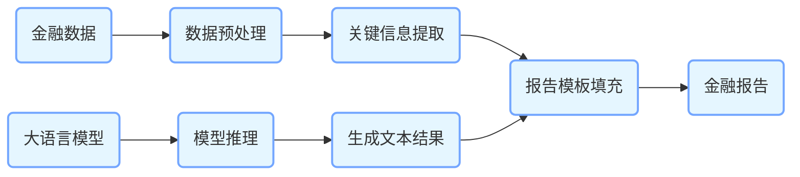

# 利用LLM优化金融报告的自动生成

> 关键词：大语言模型（LLM）、金融报告、自动生成、优化、自然语言处理

> 摘要：本文聚焦于利用大语言模型（LLM）优化金融报告的自动生成。首先介绍了该研究的背景、目的、预期读者和文档结构等内容。接着阐述了核心概念，包括LLM和金融报告自动生成的原理与联系，并给出相应的示意图和流程图。详细讲解了核心算法原理及操作步骤，通过Python代码进行说明。深入探讨了相关的数学模型和公式，并举例分析。通过项目实战展示代码案例及解读，介绍了开发环境搭建、源代码实现等内容。还探讨了实际应用场景，推荐了学习资源、开发工具框架和相关论文著作。最后总结了未来发展趋势与挑战，提供了常见问题解答和扩展阅读参考资料。旨在为利用LLM优化金融报告自动生成提供全面且深入的技术指导。

## 1. 背景介绍 
### 1.1 目的和范围
金融报告是金融机构和企业向投资者、监管机构等利益相关者传达财务状况、经营成果和现金流量等重要信息的关键文件。传统的金融报告生成方式往往依赖人工操作，不仅耗时费力，而且容易出现人为错误。随着自然语言处理技术的飞速发展，大语言模型（LLM）如GPT - 3、ChatGPT等展现出强大的语言理解和生成能力。本研究的目的是探索如何利用LLM来优化金融报告的自动生成过程，提高报告生成的效率、准确性和质量。

本研究的范围主要涵盖金融报告自动生成的关键环节，包括数据收集与预处理、文本生成、内容审核与修改等。重点关注如何利用LLM的特性来改进这些环节，同时分析在实际应用中可能面临的挑战和解决方案。

### 1.2 预期读者
本文的预期读者包括金融行业的从业者，如财务分析师、投资经理、金融监管人员等，他们可以通过本文了解如何利用先进的技术优化金融报告的生成，提高工作效率和决策质量。同时，也适合自然语言处理领域的研究人员和开发者，他们可以从中获取将LLM应用于金融领域的实践经验和技术思路。此外，对金融科技感兴趣的学生和爱好者也能从本文中获得有价值的知识和启发。

### 1.3 文档结构概述
本文将按照以下结构进行组织：首先介绍核心概念与联系，包括LLM和金融报告自动生成的基本原理和它们之间的关系，并通过示意图和流程图进行直观展示。接着详细讲解核心算法原理和具体操作步骤，使用Python代码进行阐述。然后介绍相关的数学模型和公式，并通过具体例子进行说明。通过项目实战部分展示代码实际案例，包括开发环境搭建、源代码实现和代码解读。探讨实际应用场景，推荐学习资源、开发工具框架和相关论文著作。最后总结未来发展趋势与挑战，提供常见问题解答和扩展阅读参考资料。

### 1.4 术语表
#### 1.4.1 核心术语定义
- **大语言模型（LLM）**：是一种基于深度学习的自然语言处理模型，通过在大规模文本数据上进行训练，学习语言的模式和规律，能够完成文本生成、问答、翻译等多种自然语言处理任务。
- **金融报告**：是反映金融机构或企业财务状况、经营成果和现金流量等信息的书面文件，包括资产负债表、利润表、现金流量表等主要报表，以及附注和其他相关说明。
- **自动生成**：指利用计算机程序和算法，根据输入的数据和预设的规则，自动生成所需的文本或文档，无需人工逐一编写。

#### 1.4.2 相关概念解释
- **自然语言处理（NLP）**：是人工智能的一个重要分支，研究如何让计算机理解、处理和生成人类语言。大语言模型是自然语言处理领域的一项重要技术成果。
- **数据预处理**：在将数据输入到模型之前，对数据进行清洗、转换、特征提取等操作，以提高数据的质量和可用性，便于模型更好地学习和处理。
- **微调（Fine - Tuning）**：在预训练的大语言模型基础上，使用特定领域的数据集对模型进行进一步训练，使模型能够更好地适应特定任务的需求。

#### 1.4.3 缩略词列表
- **LLM**：Large Language Model（大语言模型）
- **NLP**：Natural Language Processing（自然语言处理）

## 2. 核心概念与联系 

### 核心概念原理
#### 大语言模型（LLM）原理
大语言模型通常基于Transformer架构，Transformer架构由编码器和解码器组成，它通过多头自注意力机制（Multi - Head Self - Attention）来捕捉文本中不同位置之间的依赖关系。在训练过程中，模型在大规模的无监督文本数据上进行预训练，学习语言的通用模式和规律。常见的预训练任务包括掩码语言模型（Masked Language Model，MLM）和下一句预测（Next Sentence Prediction，NSP）。

以GPT系列模型为例，它是一种基于Transformer解码器的自回归语言模型。在生成文本时，模型根据之前生成的文本预测下一个单词的概率分布，然后根据概率分布选择合适的单词进行输出，逐步生成完整的文本。

#### 金融报告自动生成原理
金融报告自动生成的基本原理是将金融数据与预设的报告模板相结合。首先，收集和整理金融数据，如财务报表数据、市场数据等。然后，对数据进行分析和处理，提取关键信息。最后，根据报告模板和生成规则，将关键信息填充到模板中，生成金融报告。

### 架构的文本示意图
```plaintext
+---------------------+         +---------------------+
|      金融数据       |         |      大语言模型      |
| （财务报表、市场数据） |         | （预训练、微调）    |
+---------------------+         +---------------------+
          |                            |
          v                            v
+---------------------+         +---------------------+
|    数据预处理       |         |    模型推理         |
| （清洗、特征提取）   |         | （文本生成）       |
+---------------------+         +---------------------+
          |                            |
          v                            v
+---------------------+         +---------------------+
|    关键信息提取     |         |    生成文本结果     |
+---------------------+         +---------------------+
          |                            |
          v                            v
+---------------------+
|    报告模板填充     |
| （生成金融报告）   |
+---------------------+
```

### Mermaid流程图


## 3. 核心算法原理 & 具体操作步骤 

### 核心算法原理
本优化方案主要基于大语言模型的文本生成能力。在金融报告自动生成中，核心算法包括数据预处理算法、文本生成算法和结果评估算法。

#### 数据预处理算法
数据预处理的目的是将原始的金融数据转换为适合大语言模型处理的格式。常见的步骤包括数据清洗、缺失值处理、数据归一化等。以下是一个简单的数据清洗和缺失值处理的Python代码示例：

```python
import pandas as pd

def data_preprocessing(data):
    # 数据清洗，去除重复值
    data = data.drop_duplicates()
    
    # 处理缺失值，这里简单地用均值填充
    for column in data.columns:
        if data[column].isnull().any():
            data[column] = data[column].fillna(data[column].mean())
    
    return data

# 示例数据
data = pd.DataFrame({
    'revenue': [100, 200, None, 300],
    'cost': [50, 100, 150, None]
})

processed_data = data_preprocessing(data)
print(processed_data)
```

#### 文本生成算法
文本生成算法基于大语言模型，使用提示工程（Prompt Engineering）来引导模型生成符合金融报告要求的文本。提示包括金融数据、报告类型、关键指标等信息。以下是一个使用Hugging Face的Transformers库进行文本生成的示例：

```python
from transformers import pipeline

# 加载预训练的语言模型
generator = pipeline('text-generation', model='gpt2')

# 定义提示
prompt = "根据以下财务数据生成一份简单的财务报告：收入为1000万元，成本为500万元，利润为500万元。"

# 生成文本
output = generator(prompt, max_length=200, num_return_sequences=1)
print(output[0]['generated_text'])
```

#### 结果评估算法
结果评估算法用于评估生成的金融报告的质量。常见的评估指标包括语法正确性、信息完整性、逻辑一致性等。可以使用自然语言处理工具如NLTK进行语法检查，使用自定义规则进行信息完整性和逻辑一致性检查。以下是一个简单的语法检查示例：

```python
import nltk
from nltk.tokenize import word_tokenize
from nltk import pos_tag

nltk.download('punkt')
nltk.download('averaged_perceptron_tagger')

def grammar_check(text):
    tokens = word_tokenize(text)
    tagged_tokens = pos_tag(tokens)
    # 简单示例，检查是否有明显的语法错误
    # 这里只是一个简单的示例，实际应用中需要更复杂的规则
    for word, tag in tagged_tokens:
        if tag.startswith('NN') and word.islower():
            print(f"可能存在语法错误：{word} 作为名词首字母未大写")

# 示例文本
text = "the company revenue is 1000."
grammar_check(text)
```

### 具体操作步骤
1. **数据收集**：从财务系统、市场数据库等数据源收集金融数据。
2. **数据预处理**：对收集到的数据进行清洗、缺失值处理、特征提取等操作。
3. **模型选择与微调**：选择合适的大语言模型，如GPT - 3、BLOOM等，并使用金融领域的数据集对模型进行微调。
4. **提示工程设计**：根据金融报告的类型和要求，设计合适的提示，将预处理后的数据融入提示中。
5. **文本生成**：将提示输入到微调后的大语言模型中，生成金融报告的文本内容。
6. **结果评估与修改**：使用结果评估算法对生成的文本进行评估，根据评估结果对文本进行修改和完善。
7. **报告生成与输出**：将生成的文本填充到报告模板中，生成最终的金融报告，并输出为PDF、Word等格式。

## 4. 数学模型和公式 & 详细讲解 & 举例说明 

### 大语言模型的损失函数
在大语言模型的预训练过程中，常用的损失函数是交叉熵损失（Cross - Entropy Loss）。对于一个序列 $x = (x_1, x_2, \cdots, x_n)$，模型预测下一个单词 $x_{i + 1}$ 的概率分布为 $P(x_{i+1}|x_1, x_2, \cdots, x_i)$，真实的下一个单词为 $y_{i + 1}$，则交叉熵损失定义为：

$$
L = -\frac{1}{n}\sum_{i = 1}^{n}\log P(y_{i+1}|x_1, x_2, \cdots, x_i)
$$

详细讲解：交叉熵损失衡量了模型预测的概率分布与真实分布之间的差异。当模型预测的概率分布与真实分布越接近时，交叉熵损失越小，说明模型的性能越好。在训练过程中，通过最小化交叉熵损失来调整模型的参数。

举例说明：假设我们有一个简单的文本序列 "I love apples"，模型在预测 "apples" 时，预测的概率分布为 $P = [0.1, 0.2, 0.7]$（分别对应 "oranges"、"bananas"、"apples"），真实的单词是 "apples"，则该步骤的交叉熵损失为 $-\log(0.7) \approx 0.357$。

### 数据预处理中的归一化公式
在数据预处理中，常用的归一化方法是最小 - 最大归一化（Min - Max Normalization）。对于一个特征 $x$，其归一化后的取值 $x_{norm}$ 计算公式为：

$$
x_{norm}=\frac{x - \min(x)}{\max(x)-\min(x)}
$$

详细讲解：最小 - 最大归一化将特征的取值范围缩放到 $[0, 1]$ 区间。通过减去最小值并除以取值范围，可以消除特征之间的量纲差异，使模型更容易学习。

举例说明：假设我们有一个特征 "revenue"，其取值为 $[100, 200, 300]$，则 $\min(revenue)=100$，$\max(revenue)=300$。对于取值为 200 的数据点，归一化后的取值为 $\frac{200 - 100}{300 - 100}=0.5$。

### 结果评估中的BLEU分数
BLEU（Bilingual Evaluation Understudy）分数是一种常用的文本生成评估指标，用于衡量生成文本与参考文本之间的相似度。对于一个生成的句子 $s_{gen}$ 和参考句子 $s_{ref}$，BLEU分数的计算公式为：

$$
BLEU_n=\min\left(1, \frac{len(s_{gen})}{len(s_{ref})}\right)\exp\left(\sum_{k = 1}^{n}w_k\log p_k\right)
$$

其中，$p_k$ 是 $k$ - gram 的匹配率，$w_k$ 是 $k$ - gram 的权重，通常 $w_k=\frac{1}{n}$。

详细讲解：BLEU分数综合考虑了不同长度的 $k$ - gram 的匹配情况，通过指数加权的方式计算相似度。同时，为了避免生成的句子过短，引入了长度惩罚因子 $\min\left(1, \frac{len(s_{gen})}{len(s_{ref})}\right)$。

举例说明：假设参考句子为 "The company has high revenue"，生成句子为 "The company has good revenue"。对于 1 - gram，匹配的单词有 "The"、"company"、"has"、"revenue"，匹配率 $p_1=\frac{4}{5}=0.8$；对于 2 - gram，匹配的 2 - gram 有 "The company"、"company has"、"has revenue"，匹配率 $p_2=\frac{3}{4}=0.75$。假设 $n = 2$，$w_1 = w_2 = 0.5$，长度惩罚因子为 1，则 $BLEU_2 = \exp(0.5\log(0.8)+0.5\log(0.75))\approx 0.77$。

## 5. 项目实战：代码实际案例和详细解释说明 

### 5.1  开发环境搭建
#### 安装Python和相关库
首先，确保你已经安装了Python 3.7及以上版本。可以从Python官方网站（https://www.python.org/downloads/）下载并安装。

然后，使用以下命令安装所需的库：
```bash
pip install pandas transformers nltk
```

#### 下载预训练模型
可以使用Hugging Face的Transformers库下载预训练的大语言模型。以下是下载GPT - 2模型的示例代码：
```python
from transformers import GPT2LMHeadModel, GPT2Tokenizer

model_name = "gpt2"
tokenizer = GPT2Tokenizer.from_pretrained(model_name)
model = GPT2LMHeadModel.from_pretrained(model_name)
```

### 5.2  源代码详细实现和代码解读
以下是一个完整的金融报告自动生成的代码示例：

```python
import pandas as pd
from transformers import pipeline
import nltk
from nltk.tokenize import word_tokenize
from nltk import pos_tag

nltk.download('punkt')
nltk.download('averaged_perceptron_tagger')

def data_preprocessing(data):
    # 数据清洗，去除重复值
    data = data.drop_duplicates()
    
    # 处理缺失值，这里简单地用均值填充
    for column in data.columns:
        if data[column].isnull().any():
            data[column] = data[column].fillna(data[column].mean())
    
    return data

def grammar_check(text):
    tokens = word_tokenize(text)
    tagged_tokens = pos_tag(tokens)
    # 简单示例，检查是否有明显的语法错误
    for word, tag in tagged_tokens:
        if tag.startswith('NN') and word.islower():
            print(f"可能存在语法错误：{word} 作为名词首字母未大写")

def generate_financial_report(data):
    # 数据预处理
    processed_data = data_preprocessing(data)
    
    # 提取关键信息
    revenue = processed_data['revenue'].sum()
    cost = processed_data['cost'].sum()
    profit = revenue - cost
    
    # 定义提示
    prompt = f"根据以下财务数据生成一份简单的财务报告：收入为{revenue}万元，成本为{cost}万元，利润为{profit}万元。"
    
    # 加载预训练的语言模型
    generator = pipeline('text-generation', model='gpt2')
    
    # 生成文本
    output = generator(prompt, max_length=200, num_return_sequences=1)
    report_text = output[0]['generated_text']
    
    # 语法检查
    grammar_check(report_text)
    
    return report_text

# 示例数据
data = pd.DataFrame({
    'revenue': [100, 200, 300],
    'cost': [50, 100, 150]
})

report = generate_financial_report(data)
print(report)
```

### 5.3  代码解读与分析
#### 数据预处理部分
`data_preprocessing` 函数负责对输入的金融数据进行清洗和缺失值处理。使用 `drop_duplicates` 方法去除重复值，使用均值填充缺失值。

#### 语法检查部分
`grammar_check` 函数使用NLTK库对生成的文本进行简单的语法检查。通过词性标注，检查名词的首字母是否大写。

#### 报告生成部分
`generate_financial_report` 函数是核心函数，它首先调用 `data_preprocessing` 函数对数据进行预处理，然后提取关键信息，如收入、成本和利润。根据关键信息生成提示，使用 `pipeline` 加载预训练的GPT - 2模型进行文本生成。最后，调用 `grammar_check` 函数对生成的文本进行语法检查，并返回报告文本。

通过这个代码示例，我们可以看到如何将数据预处理、文本生成和结果评估结合起来，实现金融报告的自动生成。

## 6. 实际应用场景 
### 金融机构内部报告生成
金融机构如银行、证券公司、基金公司等需要定期生成各种内部报告，如财务报表分析报告、市场风险评估报告等。利用LLM优化金融报告的自动生成可以大大提高报告生成的效率，减少人工错误。例如，银行可以根据客户的交易数据和财务信息，自动生成客户信用评估报告，为信贷决策提供支持。

### 上市公司信息披露
上市公司需要按照监管要求定期披露财务报告和其他重要信息。使用LLM自动生成这些报告可以确保报告内容的准确性和规范性，同时提高信息披露的及时性。例如，上市公司可以根据财务数据自动生成年度报告的财务部分，减少人工撰写的工作量。

### 投资分析报告
投资分析师需要撰写大量的投资分析报告，评估不同公司的投资价值。LLM可以帮助分析师快速生成报告的初稿，根据公司的财务数据、行业动态等信息，提供详细的分析和建议。分析师可以在此基础上进行进一步的修改和完善，提高报告的质量和效率。

### 金融监管报告
金融监管机构需要对金融机构进行监管和评估，生成各种监管报告。利用LLM优化报告的自动生成可以提高监管效率，及时发现金融机构存在的问题。例如，监管机构可以根据金融机构上报的数据，自动生成风险评估报告，对金融机构的风险状况进行评估和预警。

## 7. 工具和资源推荐
### 7.1 学习资源推荐
#### 7.1.1 书籍推荐
- 《自然语言处理入门》：作者何晗，本书系统地介绍了自然语言处理的基础知识和常用算法，适合初学者入门。
- 《深度学习》：作者Ian Goodfellow、Yoshua Bengio和Aaron Courville，这本书是深度学习领域的经典教材，涵盖了深度学习的基本原理、模型架构和应用场景。
- 《金融数据分析与挖掘》：作者Ruppert David，本书介绍了金融数据分析和挖掘的方法和技术，结合实际案例进行讲解，对于将自然语言处理应用于金融领域有很好的参考价值。

#### 7.1.2 在线课程
- Coursera上的“Natural Language Processing Specialization”：由斯坦福大学的教授授课，全面介绍了自然语言处理的各个方面，包括词法分析、句法分析、语义分析和文本生成等。
- edX上的“Deep Learning for Natural Language Processing”：该课程深入讲解了深度学习在自然语言处理中的应用，包括循环神经网络、卷积神经网络和Transformer架构等。
- 中国大学MOOC上的“金融大数据分析”：介绍了金融大数据的采集、处理和分析方法，以及如何利用大数据技术进行金融决策。

#### 7.1.3 技术博客和网站
- Hugging Face博客（https://huggingface.co/blog）：提供了关于自然语言处理和大语言模型的最新技术文章和研究成果。
- Towards Data Science（https://towardsdatascience.com/）：是一个数据科学和人工智能领域的技术博客平台，有很多关于自然语言处理和金融科技的优质文章。
- arXiv（https://arxiv.org/）：是一个学术预印本平台，提供了大量的计算机科学和人工智能领域的研究论文，包括大语言模型和金融数据处理方面的最新研究。

### 7.2 开发工具框架推荐
#### 7.2.1 IDE和编辑器
- PyCharm：是一款专业的Python集成开发环境，提供了丰富的代码编辑、调试和版本控制功能，适合开发Python项目。
- Jupyter Notebook：是一个交互式的开发环境，支持Python、R等多种编程语言，适合进行数据分析和模型实验。
- Visual Studio Code：是一款轻量级的代码编辑器，支持多种编程语言和插件扩展，具有良好的代码编辑和调试功能。

#### 7.2.2 调试和性能分析工具
- Py-Spy：是一个用于Python程序的性能分析工具，可以实时监测程序的CPU使用率和函数调用情况，帮助开发者找出性能瓶颈。
- TensorBoard：是TensorFlow提供的一个可视化工具，可以用于可视化模型的训练过程、损失函数变化和模型结构等信息。
- cProfile：是Python标准库中的一个性能分析模块，可以统计程序中各个函数的调用次数和执行时间，帮助开发者优化代码性能。

#### 7.2.3 相关框架和库
- Hugging Face Transformers：是一个流行的自然语言处理库，提供了多种预训练的大语言模型和工具，方便开发者进行文本生成、问答系统等任务的开发。
- Pandas：是一个强大的数据分析库，提供了数据结构和数据处理功能，适合进行金融数据的清洗、分析和处理。
- NLTK：是一个自然语言处理工具包，提供了丰富的语料库和工具，如词性标注、命名实体识别等，方便进行文本处理和分析。

### 7.3 相关论文著作推荐
#### 7.3.1 经典论文
- “Attention Is All You Need”：这篇论文提出了Transformer架构，是大语言模型的基础，对自然语言处理领域产生了深远的影响。
- “BERT: Pre-training of Deep Bidirectional Transformers for Language Understanding”：介绍了BERT模型，通过预训练和微调的方式，在多个自然语言处理任务上取得了优异的成绩。
- “Generating Long Sequences with Sparse Transformers”：提出了稀疏Transformer架构，解决了传统Transformer在处理长序列时的计算效率问题。

#### 7.3.2 最新研究成果
- 关于将大语言模型应用于金融领域的最新研究论文，如“Financial Report Generation with Large Language Models”、“LLM - based Risk Assessment in Financial Markets”等。这些论文探讨了如何利用大语言模型解决金融领域的实际问题，如金融报告生成、风险评估等。
- 关于大语言模型的可解释性和安全性的研究论文，如“Interpretable Large Language Models for Financial Decision - Making”、“Security Challenges of Large Language Models in Financial Applications”等。这些论文关注大语言模型在金融应用中的可解释性和安全性问题，提出了相应的解决方案。

#### 7.3.3 应用案例分析
- 一些金融机构和企业发布的关于利用大语言模型优化金融报告自动生成的应用案例分析报告，如“Case Study: Automating Financial Report Generation with GPT - 3”、“How XYZ Bank Uses LLM for Regulatory Reporting”等。这些案例分析报告详细介绍了实际应用中的技术方案、实施过程和取得的效果，具有很高的参考价值。

## 8. 总结：未来发展趋势与挑战
### 未来发展趋势
#### 模型性能不断提升
随着深度学习技术的不断发展，大语言模型的性能将不断提升。未来的大语言模型将具有更强的语言理解和生成能力，能够生成更加准确、流畅和有逻辑的金融报告。同时，模型的训练效率也将不断提高，能够在更短的时间内完成训练。

#### 与其他技术的融合
大语言模型将与其他技术如知识图谱、计算机视觉等进行融合，进一步拓展金融报告自动生成的应用场景。例如，结合知识图谱可以为金融报告提供更丰富的背景知识和语义信息，提高报告的质量和可读性；结合计算机视觉可以对金融图表和图像进行识别和分析，将相关信息融入报告中。

#### 个性化定制
未来的金融报告自动生成系统将能够根据不同用户的需求和偏好进行个性化定制。例如，投资者可以根据自己的投资风格和关注点，定制不同类型的金融报告；金融机构可以根据自身的业务特点和监管要求，定制符合自身需求的报告模板和生成规则。

#### 智能化交互
金融报告自动生成系统将具备智能化交互能力，用户可以通过自然语言与系统进行交互，提出问题和需求，系统能够实时生成相应的报告和解答。例如，投资者可以询问某家公司的财务状况，系统能够快速生成相关的财务报告并进行详细解读。

### 挑战
#### 数据质量和隐私问题
金融数据的质量和隐私是利用LLM优化金融报告自动生成面临的重要挑战。金融数据往往包含大量的敏感信息，如客户的财务状况、交易记录等，需要采取严格的安全措施来保护数据的隐私。同时，数据的质量也会影响模型的性能，不准确或不完整的数据可能导致生成的报告出现错误。

#### 模型可解释性和可靠性
大语言模型通常是基于深度学习的黑盒模型，其决策过程和输出结果难以解释。在金融领域，模型的可解释性和可靠性至关重要，因为金融决策往往涉及到大量的资金和风险。因此，需要研究如何提高大语言模型的可解释性和可靠性，确保生成的金融报告具有可信度。

#### 法律法规和监管要求
金融行业受到严格的法律法规和监管要求的约束，利用LLM优化金融报告自动生成需要符合相关的规定。例如，报告的内容必须真实、准确、完整，不得包含虚假信息；模型的训练和使用过程也需要遵循数据保护和隐私法规。因此，需要建立相应的法律法规和监管框架，确保技术的合法合规应用。

#### 技术成本和资源限制
训练和部署大语言模型需要大量的计算资源和成本，包括高性能的服务器、大规模的数据集和专业的技术人员。对于一些小型金融机构和企业来说，可能难以承担这些成本和资源。因此，需要研究如何降低技术成本，提高资源利用效率，使更多的机构和企业能够受益于这项技术。

## 9. 附录：常见问题与解答
### 1. 使用LLM生成的金融报告是否可以直接用于正式发布？
一般来说，不建议直接将LLM生成的金融报告用于正式发布。虽然LLM可以生成高质量的文本，但仍然可能存在一些错误和不准确的地方，如语法错误、数据错误、逻辑不一致等。因此，生成的报告需要经过人工审核和修改，确保报告的内容准确、完整、合规后才能正式发布。

### 2. 如何选择适合金融报告自动生成的大语言模型？
选择适合金融报告自动生成的大语言模型需要考虑多个因素，如模型的性能、训练数据、可扩展性等。一般来说，可以选择在大规模文本数据上预训练的通用大语言模型，如GPT - 3、BLOOM等，然后使用金融领域的数据集对模型进行微调，使其更好地适应金融报告生成的任务。同时，还可以考虑模型的开源性和社区支持，以便在开发过程中获取更多的帮助和资源。

### 3. 如何处理金融数据的不平衡问题？
金融数据的不平衡问题可能会影响模型的性能。可以采用以下方法来处理数据不平衡问题：
- **数据重采样**：通过过采样（如SMOTE算法）或欠采样的方法，调整数据集中不同类别的样本比例。
- **成本敏感学习**：在模型训练过程中，对不同类别的样本设置不同的损失权重，提高模型对少数类样本的关注度。
- **集成学习**：使用多个模型进行集成，每个模型在不同的数据集上进行训练，然后将它们的预测结果进行综合。

### 4. 如何确保生成的金融报告符合监管要求？
为了确保生成的金融报告符合监管要求，可以采取以下措施：
- **建立合规规则库**：收集和整理相关的监管要求和合规规则，建立规则库。在报告生成过程中，对生成的文本进行合规检查，确保报告内容符合规则要求。
- **人工审核**：安排专业的金融人员对生成的报告进行人工审核，检查报告的内容是否准确、完整、合规。
- **定期更新规则**：随着监管政策的不断变化，及时更新合规规则库，确保报告生成系统始终符合最新的监管要求。

## 10. 扩展阅读 & 参考资料
### 扩展阅读
- 《人工智能时代的金融科技》：探讨了人工智能技术在金融领域的应用和发展趋势，包括自然语言处理、机器学习、区块链等技术在金融业务中的应用案例。
- 《智能金融：科技重塑金融未来》：介绍了智能金融的概念、技术和应用场景，分析了科技对金融行业的影响和挑战。
- 《金融科技前沿：技术驱动的金融创新》：涵盖了金融科技的各个前沿领域，如大数据、人工智能、云计算等，为读者提供了全面的金融科技知识。

### 参考资料
- Hugging Face官方文档（https://huggingface.co/docs）：提供了关于Transformers库的详细文档和使用指南。
- Pandas官方文档（https://pandas.pydata.org/docs/）：是Pandas库的官方文档，包含了数据结构、数据处理和分析的详细介绍。
- NLTK官方文档（https://www.nltk.org/）：NLTK工具包的官方文档，提供了自然语言处理的各种工具和方法的使用说明。

作者：AI天才研究院/AI Genius Institute & 禅与计算机程序设计艺术 /Zen And The Art of Computer Programming