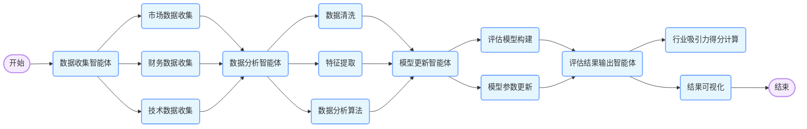

# 利用多智能体AI实现动态行业吸引力评估

> 关键词：多智能体AI、动态行业吸引力评估、智能决策、数据融合、实时评估

> 摘要：本文聚焦于利用多智能体AI实现动态行业吸引力评估这一前沿技术。首先介绍了相关背景知识，包括目的范围、预期读者等。接着详细阐述了核心概念，给出了原理和架构的文本示意图与Mermaid流程图。深入分析了核心算法原理，并通过Python代码进行说明，同时讲解了数学模型和公式。通过项目实战，展示了代码的实际案例及详细解释。探讨了该技术在不同领域的实际应用场景，推荐了学习、开发相关的工具和资源，包括书籍、在线课程、开发框架等。最后总结了未来发展趋势与挑战，还提供了常见问题解答和扩展阅读参考资料，旨在为读者全面呈现利用多智能体AI进行动态行业吸引力评估的技术全貌。

## 1. 背景介绍 
### 1.1 目的和范围
在当今快速变化的商业环境中，准确评估行业吸引力对于企业战略决策、投资者资产配置等至关重要。传统的行业吸引力评估方法往往基于静态数据和固定模型，难以适应市场的动态变化。本研究的目的是利用多智能体AI技术，实现对行业吸引力的动态评估，为决策者提供更及时、准确的信息。

本研究的范围涵盖了多个行业领域，包括但不限于金融、制造业、科技、医疗等。通过收集和分析这些行业的多源数据，构建多智能体系统，实现对行业吸引力的实时监测和评估。

### 1.2 预期读者
本文预期读者包括企业战略规划人员、投资者、市场研究人员、人工智能研究者以及对行业分析和智能决策感兴趣的技术爱好者。对于企业战略规划人员，本文提供的动态行业吸引力评估方法可以帮助他们制定更具前瞻性的战略；投资者可以利用评估结果优化资产配置；市场研究人员可以从中获取新的研究思路和方法；人工智能研究者可以关注多智能体AI在行业评估领域的应用；技术爱好者则可以了解该领域的前沿技术和发展趋势。

### 1.3 文档结构概述
本文将按照以下结构进行组织：首先介绍核心概念与联系，包括多智能体AI和动态行业吸引力评估的原理和架构；接着详细阐述核心算法原理和具体操作步骤，并给出Python代码示例；然后讲解数学模型和公式，并通过举例进行说明；之后通过项目实战展示代码的实际应用和详细解释；再探讨该技术的实际应用场景；推荐相关的学习、开发工具和资源；最后总结未来发展趋势与挑战，提供常见问题解答和扩展阅读参考资料。

### 1.4 术语表
#### 1.4.1 核心术语定义
- **多智能体AI（Multi - Agent AI）**：由多个智能体组成的人工智能系统，每个智能体具有自主决策能力，能够感知环境、与其他智能体交互，并根据自身目标进行行动。
- **动态行业吸引力评估**：对行业在不同时间点的吸引力进行评估，考虑到行业的各种动态因素，如市场需求变化、技术创新、政策调整等。
- **智能体（Agent）**：在多智能体系统中，具有一定感知、决策和行动能力的个体。
- **行业吸引力**：反映一个行业对企业或投资者的吸引力程度，通常由市场规模、增长潜力、竞争程度、利润率等因素决定。

#### 1.4.2 相关概念解释
- **数据融合**：将来自不同数据源的多源数据进行整合和处理，以获取更全面、准确的信息。在动态行业吸引力评估中，需要融合市场数据、财务数据、技术数据等。
- **实时评估**：在数据更新的同时，及时对行业吸引力进行评估，以反映行业的最新状态。

#### 1.4.3 缩略词列表
- **AI**：Artificial Intelligence，人工智能
- **MAS**：Multi - Agent System，多智能体系统

## 2. 核心概念与联系 

### 核心概念原理
#### 多智能体AI原理
多智能体AI系统由多个智能体组成，每个智能体可以是一个独立的算法模块、软件程序或硬件设备。智能体具有以下特点：
- **自主性**：能够独立地感知环境、做出决策和采取行动。
- **交互性**：可以与其他智能体进行通信和协作，共同完成任务。
- **适应性**：能够根据环境的变化调整自己的行为。

在动态行业吸引力评估中，不同的智能体可以负责不同的任务，如数据收集、数据分析、模型更新等。通过智能体之间的协作，可以实现对行业吸引力的动态评估。

#### 动态行业吸引力评估原理
动态行业吸引力评估需要考虑多个因素，包括市场因素、技术因素、政策因素等。这些因素随时间不断变化，因此需要实时收集和分析数据。评估过程通常包括以下步骤：
- **数据收集**：收集与行业相关的多源数据，如市场规模、增长率、竞争态势、技术创新等。
- **数据预处理**：对收集到的数据进行清洗、转换和归一化处理，以提高数据质量。
- **模型构建**：构建评估模型，考虑各因素之间的权重和关系。
- **实时评估**：根据实时数据更新评估模型，得出行业吸引力的实时评估结果。

### 架构的文本示意图
```plaintext
多智能体AI系统
├── 数据收集智能体
│   ├── 市场数据收集
│   ├── 财务数据收集
│   ├── 技术数据收集
├── 数据分析智能体
│   ├── 数据清洗
│   ├── 特征提取
│   ├── 数据分析算法
├── 模型更新智能体
│   ├── 评估模型构建
│   ├── 模型参数更新
├── 评估结果输出智能体
│   ├── 行业吸引力得分计算
│   ├── 结果可视化
```

### Mermaid流程图


## 3. 核心算法原理 & 具体操作步骤 

### 核心算法原理
本研究采用的核心算法是基于多智能体的协同过滤算法和机器学习算法相结合的方法。

#### 协同过滤算法
协同过滤算法的基本思想是根据智能体之间的相似性进行信息推荐和决策。在动态行业吸引力评估中，不同的智能体可以根据其对行业因素的感知和评估结果进行相似性计算，然后相互推荐信息，以提高评估的准确性。

#### 机器学习算法
机器学习算法用于构建评估模型，常用的算法包括线性回归、逻辑回归、决策树、随机森林等。这些算法可以根据历史数据进行训练，学习各因素与行业吸引力之间的关系，然后用于实时评估。

### 具体操作步骤
#### 步骤1：数据收集
使用数据收集智能体从多个数据源收集与行业相关的数据，包括市场数据（如市场规模、增长率、市场份额等）、财务数据（如利润率、资产负债率等）、技术数据（如专利数量、技术创新指数等）。

#### 步骤2：数据预处理
使用数据分析智能体对收集到的数据进行预处理，包括数据清洗、缺失值处理、异常值处理、数据归一化等操作，以提高数据质量。

#### 步骤3：特征提取
从预处理后的数据中提取有用的特征，例如可以计算市场增长率的变化趋势、利润率的波动情况等。这些特征将作为评估模型的输入。

#### 步骤4：模型训练
使用机器学习算法对历史数据进行训练，构建评估模型。可以采用交叉验证的方法选择最优的模型参数。

#### 步骤5：实时评估
使用模型更新智能体根据实时数据更新评估模型，然后使用评估结果输出智能体计算行业吸引力得分，并进行结果可视化。

### Python源代码详细阐述
```python
import pandas as pd
from sklearn.model_selection import train_test_split
from sklearn.linear_model import LinearRegression
from sklearn.preprocessing import StandardScaler

# 步骤1：数据收集（假设数据已经存储在CSV文件中）
data = pd.read_csv('industry_data.csv')

# 步骤2：数据预处理
# 处理缺失值
data = data.dropna()

# 分离特征和目标变量
X = data.drop('industry_attractiveness', axis=1)
y = data['industry_attractiveness']

# 数据归一化
scaler = StandardScaler()
X_scaled = scaler.fit_transform(X)

# 步骤3：特征提取（这里简单示例，未进行复杂特征提取）
# 可以根据实际情况添加更多特征提取步骤

# 步骤4：模型训练
# 划分训练集和测试集
X_train, X_test, y_train, y_test = train_test_split(X_scaled, y, test_size=0.2, random_state=42)

# 创建线性回归模型
model = LinearRegression()

# 训练模型
model.fit(X_train, y_train)

# 步骤5：实时评估（假设新的实时数据）
new_data = pd.read_csv('new_industry_data.csv')
new_X = new_data.drop('industry_attractiveness', axis=1)
new_X_scaled = scaler.transform(new_X)

# 预测行业吸引力得分
predictions = model.predict(new_X_scaled)

print("预测的行业吸引力得分：", predictions)
```

## 4. 数学模型和公式 & 详细讲解 & 举例说明 

### 线性回归模型
线性回归是一种常用的机器学习算法，用于建立自变量和因变量之间的线性关系。在动态行业吸引力评估中，可以使用线性回归模型来预测行业吸引力得分。

#### 数学公式
线性回归模型的一般形式为：
$$y = \beta_0 + \beta_1x_1 + \beta_2x_2 + \cdots + \beta_nx_n + \epsilon$$
其中，$y$ 是因变量（行业吸引力得分），$x_1, x_2, \cdots, x_n$ 是自变量（如市场规模、增长率等行业因素），$\beta_0, \beta_1, \cdots, \beta_n$ 是模型的系数，$\epsilon$ 是误差项。

#### 详细讲解
模型的目标是通过最小化误差项的平方和来估计系数 $\beta_0, \beta_1, \cdots, \beta_n$。最小二乘法是一种常用的估计方法，其目标函数为：
$$\min_{\beta_0, \beta_1, \cdots, \beta_n} \sum_{i = 1}^{m}(y_i - (\beta_0 + \beta_1x_{i1} + \beta_2x_{i2} + \cdots + \beta_nx_{in}))^2$$
其中，$m$ 是样本数量，$y_i$ 是第 $i$ 个样本的实际值，$x_{i1}, x_{i2}, \cdots, x_{in}$ 是第 $i$ 个样本的自变量值。

#### 举例说明
假设我们有以下数据：

| 市场规模（亿元） | 增长率（%） | 行业吸引力得分 |
| --- | --- | --- |
| 100 | 5 | 70 |
| 200 | 8 | 80 |
| 150 | 6 | 75 |

设市场规模为 $x_1$，增长率为 $x_2$，行业吸引力得分为 $y$，则线性回归模型为：
$$y = \beta_0 + \beta_1x_1 + \beta_2x_2 + \epsilon$$

使用最小二乘法估计系数 $\beta_0, \beta_1, \beta_2$，可以得到具体的模型。假设估计结果为 $\beta_0 = 30$，$\beta_1 = 0.1$，$\beta_2 = 2$，则模型为：
$$y = 30 + 0.1x_1 + 2x_2$$

当市场规模为 300 亿元，增长率为 10% 时，预测的行业吸引力得分 $y$ 为：
$$y = 30 + 0.1\times300 + 2\times10 = 80$$

### 随机森林模型
随机森林是一种集成学习算法，由多个决策树组成。在动态行业吸引力评估中，随机森林可以处理高维数据和非线性关系。

#### 数学公式
随机森林的预测结果是多个决策树预测结果的平均值（回归问题）或多数表决（分类问题）。设 $T_1, T_2, \cdots, T_k$ 是随机森林中的 $k$ 个决策树，对于输入样本 $x$，第 $i$ 个决策树的预测结果为 $T_i(x)$，则随机森林的预测结果为：
$$\hat{y} = \frac{1}{k}\sum_{i = 1}^{k}T_i(x)$$

#### 详细讲解
随机森林的训练过程包括以下步骤：
1. 从原始数据集中进行有放回的抽样，得到 $k$ 个不同的子集。
2. 对于每个子集，构建一个决策树。在构建决策树的过程中，随机选择一部分特征进行分裂。
3. 最终的随机森林由这 $k$ 个决策树组成。

#### 举例说明
假设我们有一个包含 10 个决策树的随机森林，对于一个输入样本 $x$，10 个决策树的预测结果分别为 $[72, 75, 73, 76, 74, 71, 77, 75, 73, 74]$，则随机森林的预测结果为：
$$\hat{y} = \frac{1}{10}(72 + 75 + 73 + 76 + 74 + 71 + 77 + 75 + 73 + 74) = 74$$

## 5. 项目实战：代码实际案例和详细解释说明 

### 5.1  开发环境搭建
#### 操作系统
本项目可以在 Windows、Linux 或 macOS 操作系统上进行开发。建议使用 Linux 系统，如 Ubuntu，因为它对 Python 开发环境的支持较好。

#### Python 环境
安装 Python 3.7 及以上版本。可以从 Python 官方网站（https://www.python.org/downloads/）下载安装包进行安装。

#### 依赖库安装
使用以下命令安装项目所需的依赖库：
```bash
pip install pandas scikit-learn matplotlib
```
- `pandas`：用于数据处理和分析。
- `scikit-learn`：提供机器学习算法和工具。
- `matplotlib`：用于数据可视化。

### 5.2  源代码详细实现和代码解读
```python
import pandas as pd
from sklearn.model_selection import train_test_split
from sklearn.ensemble import RandomForestRegressor
from sklearn.metrics import mean_squared_error
import matplotlib.pyplot as plt

# 步骤1：数据收集
# 假设数据存储在CSV文件中
data = pd.read_csv('industry_data.csv')

# 步骤2：数据预处理
# 处理缺失值
data = data.dropna()

# 分离特征和目标变量
X = data.drop('industry_attractiveness', axis=1)
y = data['industry_attractiveness']

# 步骤3：划分训练集和测试集
X_train, X_test, y_train, y_test = train_test_split(X, y, test_size=0.2, random_state=42)

# 步骤4：模型训练
# 创建随机森林回归模型
model = RandomForestRegressor(n_estimators=100, random_state=42)

# 训练模型
model.fit(X_train, y_train)

# 步骤5：模型评估
# 在测试集上进行预测
y_pred = model.predict(X_test)

# 计算均方误差
mse = mean_squared_error(y_test, y_pred)
print("均方误差：", mse)

# 步骤6：结果可视化
plt.scatter(y_test, y_pred)
plt.xlabel('实际行业吸引力得分')
plt.ylabel('预测行业吸引力得分')
plt.title('实际得分 vs 预测得分')
plt.show()
```

### 5.3  代码解读与分析
#### 数据收集和预处理
使用 `pandas` 库的 `read_csv` 函数读取存储在 CSV 文件中的行业数据。然后使用 `dropna` 函数处理缺失值，确保数据的完整性。

#### 划分训练集和测试集
使用 `train_test_split` 函数将数据集划分为训练集和测试集，测试集占比为 20%。

#### 模型训练
创建一个随机森林回归模型，设置决策树的数量为 100。使用 `fit` 方法对模型进行训练。

#### 模型评估
使用 `predict` 方法在测试集上进行预测，然后使用 `mean_squared_error` 函数计算预测结果与实际结果之间的均方误差，评估模型的性能。

#### 结果可视化
使用 `matplotlib` 库绘制散点图，展示实际行业吸引力得分和预测得分之间的关系，直观地观察模型的预测效果。

## 6. 实际应用场景 
### 企业战略决策
企业在制定战略规划时，需要了解不同行业的吸引力。利用多智能体AI实现的动态行业吸引力评估可以实时提供各行业的吸引力得分，帮助企业决策者判断进入或退出某个行业的时机，优化业务布局。例如，一家多元化企业可以根据评估结果决定是否将资源投入到新兴的科技行业，或者是否从竞争激烈的传统制造业中撤出。

### 投资者资产配置
投资者在进行资产配置时，需要考虑不同行业的投资价值。动态行业吸引力评估可以为投资者提供及时的行业信息，帮助他们调整投资组合。例如，投资者可以根据评估结果增加对吸引力上升行业的投资比例，减少对吸引力下降行业的投资。

### 政府政策制定
政府在制定产业政策时，需要了解各行业的发展状况和潜力。通过动态行业吸引力评估，政府可以准确把握行业的动态变化，制定针对性的政策，促进产业的健康发展。例如，对于吸引力较低但具有战略意义的行业，政府可以出台扶持政策，推动其发展。

### 市场研究机构
市场研究机构可以利用多智能体AI进行动态行业吸引力评估，为客户提供专业的市场研究报告。评估结果可以帮助客户了解行业的竞争态势、发展趋势等信息，为企业决策提供参考。

## 7. 工具和资源推荐
### 7.1 学习资源推荐
#### 7.1.1 书籍推荐
- 《人工智能：一种现代的方法》：这本书是人工智能领域的经典教材，涵盖了多智能体系统、机器学习等多个方面的内容，适合初学者和有一定基础的读者深入学习。
- 《Python机器学习》：详细介绍了使用Python进行机器学习的方法和技巧，包括数据预处理、模型训练、评估等内容，对于掌握本项目中的机器学习算法非常有帮助。
- 《多智能体系统：原理与编程》：专门介绍多智能体系统的原理、设计和实现，对于理解多智能体AI在动态行业吸引力评估中的应用有很大的帮助。

#### 7.1.2 在线课程
- Coursera上的“人工智能基础”课程：由知名高校的教授授课，系统地介绍了人工智能的基本概念、算法和应用，适合初学者入门。
- edX上的“机器学习”课程：提供了丰富的机器学习理论和实践内容，包括线性回归、决策树、随机森林等算法的详细讲解和代码实现。
- Udemy上的“多智能体系统开发实战”课程：通过实际项目案例，讲解多智能体系统的开发过程和技术要点。

#### 7.1.3 技术博客和网站
- 机器之心：提供人工智能领域的最新技术动态、研究成果和应用案例，是了解行业前沿信息的重要渠道。
- 开源中国：有丰富的技术文章和开源项目资源，对于学习和实践多智能体AI和机器学习算法很有帮助。
- Kaggle：是一个数据科学和机器学习竞赛平台，上面有很多关于数据分析和模型训练的优秀案例和代码，可以供学习者参考和学习。

### 7.2 开发工具框架推荐
#### 7.2.1 IDE和编辑器
- PyCharm：是一款专业的Python集成开发环境，具有代码自动补全、调试、版本控制等功能，适合大型Python项目的开发。
- Jupyter Notebook：以交互式的方式进行代码编写和数据分析，方便进行数据探索和模型调试，非常适合机器学习和数据科学项目。
- Visual Studio Code：轻量级的代码编辑器，支持多种编程语言和插件扩展，对于Python开发也有很好的支持。

#### 7.2.2 调试和性能分析工具
- PDB：Python自带的调试器，可以帮助开发者定位代码中的问题。
- cProfile：用于分析Python代码的性能，找出性能瓶颈。
- TensorBoard：虽然主要用于深度学习项目，但也可以用于可视化机器学习模型的训练过程和性能指标。

#### 7.2.3 相关框架和库
- Scikit-learn：提供了丰富的机器学习算法和工具，如线性回归、决策树、随机森林等，方便进行模型训练和评估。
- Pandas：用于数据处理和分析，提供了高效的数据结构和数据操作方法。
- Numpy：是Python科学计算的基础库，提供了高性能的多维数组对象和数学函数。

### 7.3 相关论文著作推荐
#### 7.3.1 经典论文
- “Multi - Agent Systems: A Modern Approach to Distributed Artificial Intelligence”：介绍了多智能体系统的基本概念、理论和方法，是多智能体领域的经典论文。
- “Random Forests”：详细阐述了随机森林算法的原理和性能，对于理解和应用随机森林算法有重要的参考价值。
- “Linear Regression Analysis”：对线性回归模型进行了深入的理论分析和推导，有助于掌握线性回归的数学原理。

#### 7.3.2 最新研究成果
- 可以关注顶级学术会议如AAAI（Association for the Advancement of Artificial Intelligence）、IJCAI（International Joint Conference on Artificial Intelligence）上的相关研究论文，了解多智能体AI和行业评估领域的最新研究动态。
- 一些知名学术期刊如《Artificial Intelligence》、《Journal of Artificial Intelligence Research》也会发表该领域的前沿研究成果。

#### 7.3.3 应用案例分析
- 可以查找一些实际应用案例的研究报告，了解多智能体AI在不同行业吸引力评估中的具体应用和效果。例如，某些金融机构使用多智能体AI进行行业风险评估的案例分析，对于实际项目的开发有很大的借鉴意义。

## 8. 总结：未来发展趋势与挑战
### 未来发展趋势
#### 与深度学习的融合
随着深度学习技术的不断发展，将多智能体AI与深度学习相结合，可以提高动态行业吸引力评估的准确性和智能化水平。例如，使用深度神经网络对行业数据进行特征提取和分析，能够发现更复杂的模式和关系。

#### 跨行业融合应用
多智能体AI在动态行业吸引力评估中的应用将不仅仅局限于单一行业，而是会向跨行业融合的方向发展。例如，在评估金融行业吸引力时，考虑科技行业的创新对金融行业的影响，实现更全面的评估。

#### 实时性和可解释性的提升
未来的动态行业吸引力评估系统将更加注重实时性，能够更快地响应市场变化。同时，模型的可解释性也将得到提升，决策者可以更好地理解评估结果的依据。

### 挑战
#### 数据质量和安全性
多智能体AI需要大量的高质量数据进行训练和评估，但数据的收集、清洗和管理面临着诸多挑战。同时，数据的安全性也是一个重要问题，需要采取有效的措施保护行业数据的隐私和安全。

#### 智能体之间的协作和协调
在多智能体系统中，智能体之间的协作和协调是一个复杂的问题。不同智能体可能具有不同的目标和策略，如何实现智能体之间的有效协作，提高系统的整体性能，是需要解决的关键问题。

#### 模型的可扩展性和适应性
随着行业的不断发展和变化，动态行业吸引力评估模型需要具有良好的可扩展性和适应性。能够快速适应新的行业数据和变化的市场环境，是模型面临的挑战之一。

## 9. 附录：常见问题与解答
### 问题1：多智能体AI与传统人工智能有什么区别？
解答：传统人工智能通常是单个智能体进行决策和行动，而多智能体AI由多个智能体组成，每个智能体具有自主决策能力，并且可以与其他智能体进行交互和协作。多智能体AI更适合处理复杂的、动态的问题，能够更好地适应环境的变化。

### 问题2：如何选择合适的机器学习算法进行动态行业吸引力评估？
解答：选择合适的机器学习算法需要考虑多个因素，如数据的特点、问题的复杂度、模型的可解释性等。如果数据具有线性关系，可以选择线性回归算法；如果数据是非线性的，并且特征维度较高，可以考虑使用随机森林、支持向量机等算法。同时，还可以通过交叉验证等方法比较不同算法的性能，选择最优的算法。

### 问题3：多智能体AI系统的开发难度大吗？
解答：多智能体AI系统的开发难度相对较大，需要掌握多智能体系统的理论和方法，以及相关的编程技术。同时，智能体之间的协作和协调也需要进行精心设计。但是，随着相关技术的不断发展和开源框架的出现，开发难度也在逐渐降低。可以通过学习相关的知识和参考开源项目，逐步掌握多智能体AI系统的开发。

### 问题4：如何评估动态行业吸引力评估模型的性能？
解答：可以使用多种指标来评估模型的性能，如均方误差（MSE）、平均绝对误差（MAE）、决定系数（R²）等。均方误差衡量了预测值与实际值之间的平均平方误差，值越小表示模型的预测精度越高；平均绝对误差衡量了预测值与实际值之间的平均绝对误差；决定系数表示模型对数据的拟合程度，取值范围在 0 到 1 之间，越接近 1 表示模型的拟合效果越好。

## 10. 扩展阅读 & 参考资料
### 扩展阅读
- 《智能系统原理与设计》：进一步深入介绍智能系统的原理和设计方法，包括多智能体系统、专家系统等。
- 《数据挖掘：概念与技术》：详细讲解数据挖掘的各种算法和技术，对于数据预处理和特征提取有更深入的介绍。
- 《复杂系统与复杂性科学》：探讨复杂系统的理论和方法，有助于理解多智能体AI在复杂环境中的应用。

### 参考资料
- [1] Russell S, Norvig P. Artificial Intelligence: A Modern Approach[M]. Pearson Education, 2020.
- [2] Pedregosa F, Varoquaux G, Gramfort A, et al. Scikit - learn: Machine Learning in Python[J]. Journal of Machine Learning Research, 2011, 12: 2825 - 2830.
- [3] Breiman L. Random Forests[J]. Machine Learning, 2001, 45(1): 5 - 32.

作者：AI天才研究院/AI Genius Institute & 禅与计算机程序设计艺术 /Zen And The Art of Computer Programming