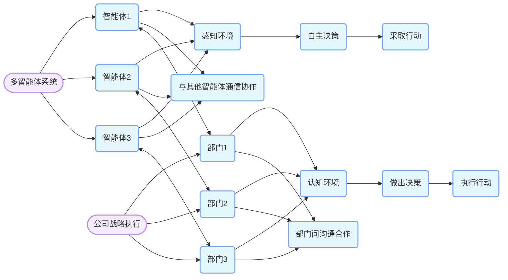

# 利用多智能体系统进行全面的公司战略执行力分析

> 关键词：多智能体系统、公司战略执行力、分析模型、人工智能、决策支持

> 摘要：本文聚焦于利用多智能体系统对公司战略执行力进行全面分析。首先介绍多智能体系统和公司战略执行力的相关背景知识，阐述核心概念及它们之间的联系。接着深入探讨核心算法原理，结合Python代码详细说明具体操作步骤，同时给出相应的数学模型和公式并举例讲解。通过项目实战，展示如何搭建开发环境、实现源代码并进行解读分析。还探讨了该方法的实际应用场景，推荐相关的工具和资源。最后总结未来发展趋势与挑战，提供常见问题解答和扩展阅读参考资料，旨在为企业借助多智能体系统提升战略执行力分析水平提供全面且深入的技术指导。

## 1. 背景介绍 
### 1.1 目的和范围
在当今竞争激烈的商业环境中，公司战略的有效执行是企业取得成功的关键因素之一。然而，准确评估公司战略执行力面临诸多挑战，传统的分析方法往往难以全面、动态地反映实际情况。本研究的目的在于利用多智能体系统的优势，构建一个全面的公司战略执行力分析框架，以提高分析的准确性和有效性。

本研究的范围涵盖了多智能体系统的基本原理、公司战略执行力的构成要素、核心算法的设计与实现、实际应用场景的探讨等方面。通过理论与实践相结合，为企业提供一套可行的战略执行力分析方案。

### 1.2 预期读者
本文预期读者包括企业管理人员、战略规划师、人工智能和管理科学领域的研究人员、相关专业的学生等。对于希望深入了解如何利用先进技术提升公司战略管理水平的人士具有参考价值。

### 1.3 文档结构概述
本文共分为十个部分。第一部分为背景介绍，阐述研究的目的、范围、预期读者和文档结构。第二部分介绍核心概念与联系，包括多智能体系统和公司战略执行力的原理及架构。第三部分详细讲解核心算法原理和具体操作步骤，并给出Python源代码。第四部分介绍数学模型和公式，进行详细讲解并举例说明。第五部分通过项目实战，展示代码的实际案例和详细解释。第六部分探讨实际应用场景。第七部分推荐相关的工具和资源。第八部分总结未来发展趋势与挑战。第九部分为附录，提供常见问题与解答。第十部分为扩展阅读和参考资料。

### 1.4 术语表
#### 1.4.1 核心术语定义
- **多智能体系统（Multi - Agent System, MAS）**：由多个智能体组成的系统，这些智能体能够感知环境、自主决策并与其他智能体进行交互，以实现共同或各自的目标。
- **公司战略执行力**：指企业将战略目标转化为实际行动并取得预期成果的能力，包括战略的制定、实施、监控和调整等环节。
- **智能体（Agent）**：具有自主性、反应性、社会性和主动性的实体，能够在一定环境中独立运行并与其他智能体进行交互。

#### 1.4.2 相关概念解释
- **自主性**：智能体能够在没有外部干预的情况下，独立地做出决策和采取行动。
- **反应性**：智能体能够感知环境的变化，并及时做出相应的反应。
- **社会性**：智能体能够与其他智能体进行通信和协作，以实现共同的目标。
- **主动性**：智能体能够主动地发起行动，以追求自身的目标。

#### 1.4.3 缩略词列表
- **MAS**：Multi - Agent System（多智能体系统）
- **AI**：Artificial Intelligence（人工智能）

## 2. 核心概念与联系 

### 多智能体系统原理
多智能体系统是一种分布式人工智能系统，它由多个智能体组成。每个智能体都具有一定的知识和能力，能够根据环境的变化自主地做出决策和采取行动。智能体之间通过通信和协作来实现共同的目标。

多智能体系统的架构通常包括以下几个部分：
- **智能体**：是系统的基本组成单元，具有自主性、反应性、社会性和主动性。
- **环境**：智能体所处的外部世界，智能体通过感知环境来获取信息。
- **通信机制**：智能体之间进行信息交换的方式，如消息传递、共享内存等。
- **协调机制**：用于协调智能体之间的行为，避免冲突和实现共同目标。

### 公司战略执行力原理
公司战略执行力是一个复杂的概念，它涉及到企业的各个层面和环节。公司战略执行力的构成要素包括：
- **战略目标**：企业期望实现的长期和短期目标。
- **组织结构**：企业的组织架构和部门设置，影响战略的实施效率。
- **人员能力**：员工的专业技能、知识水平和工作态度，对战略执行起着关键作用。
- **流程制度**：企业的业务流程和管理制度，确保战略的有效实施。
- **企业文化**：企业的价值观、信念和行为准则，影响员工的行为和决策。

### 两者之间的联系
多智能体系统可以用于模拟公司战略执行过程中的各个环节和主体。每个智能体可以代表企业中的一个部门、团队或员工，智能体之间的交互可以模拟部门之间的协作、员工之间的沟通等。通过多智能体系统，可以全面、动态地分析公司战略执行力的各个方面，发现潜在的问题和瓶颈，并提供相应的解决方案。

### 文本示意图
多智能体系统与公司战略执行力的联系可以用以下文本示意图表示：

多智能体系统中的智能体对应公司战略执行中的各个主体（部门、团队、员工等），智能体的感知对应主体对环境的认知，智能体的决策对应主体的决策过程，智能体的行动对应主体的执行行为，智能体之间的通信和协作对应主体之间的沟通和合作。通过多智能体系统的模拟和分析，可以深入了解公司战略执行的实际情况，为企业的战略管理提供支持。

### Mermaid流程图


## 3. 核心算法原理 & 具体操作步骤 

### 核心算法原理
在利用多智能体系统进行公司战略执行力分析时，核心算法主要包括智能体的决策算法和多智能体的协调算法。

#### 智能体决策算法
智能体的决策算法通常基于效用理论。智能体根据自身的目标和对环境的感知，计算不同行动的效用值，然后选择效用值最大的行动。效用值的计算可以考虑多个因素，如战略目标的达成程度、资源的消耗、风险等。

以下是一个简单的智能体决策算法的Python代码示例：
```python
class Agent:
    def __init__(self, goals, resources):
        self.goals = goals
        self.resources = resources

    def calculate_utility(self, action):
        # 简单示例：假设行动对目标的贡献和资源消耗的差值为效用值
        goal_contribution = action.get('goal_contribution', 0)
        resource_consumption = action.get('resource_consumption', 0)
        return goal_contribution - resource_consumption

    def make_decision(self, available_actions):
        max_utility = float('-inf')
        best_action = None
        for action in available_actions:
            utility = self.calculate_utility(action)
            if utility > max_utility:
                max_utility = utility
                best_action = action
        return best_action
```

#### 多智能体协调算法
多智能体的协调算法用于解决智能体之间的冲突和实现共同目标。常见的协调算法包括合同网协议、拍卖算法等。这里以合同网协议为例进行介绍。

合同网协议的基本思想是：一个智能体（管理者）发布任务，其他智能体（参与者）根据自身能力进行投标，管理者选择最优的投标者并分配任务。

以下是一个简单的合同网协议的Python代码示例：
```python
class ContractNet:
    def __init__(self, agents):
        self.agents = agents

    def manager_announce_task(self, task):
        bids = []
        for agent in self.agents:
            bid = agent.submit_bid(task)
            bids.append(bid)
        best_bid = max(bids, key=lambda x: x.get('score', 0))
        winner = best_bid.get('agent')
        winner.receive_task(task)
        return winner
```

### 具体操作步骤
1. **定义智能体**：根据公司的组织结构和战略执行流程，定义不同类型的智能体，如部门智能体、员工智能体等。
2. **初始化智能体状态**：为每个智能体设置初始的目标、资源和能力等状态信息。
3. **模拟环境**：构建一个模拟的环境，包括市场信息、竞争态势、内部资源状况等，智能体可以感知环境的变化。
4. **智能体决策**：每个智能体根据自身的目标和对环境的感知，使用决策算法做出决策。
5. **多智能体协调**：使用协调算法解决智能体之间的冲突和实现共同目标。
6. **执行行动**：智能体根据决策结果采取相应的行动，更新自身状态和环境信息。
7. **评估战略执行力**：根据智能体的行动结果和环境变化，评估公司战略执行力的各个方面，如目标达成情况、资源利用效率等。
8. **调整战略**：根据评估结果，调整公司的战略目标、组织结构、流程制度等，以提高战略执行力。

## 4. 数学模型和公式 & 详细讲解 & 举例说明 

### 智能体效用计算模型
智能体的效用计算模型可以用以下公式表示：

$$U(a) = \sum_{i = 1}^{n} w_i \cdot f_i(a)$$

其中，$U(a)$ 表示行动 $a$ 的效用值，$w_i$ 表示第 $i$ 个因素的权重，$f_i(a)$ 表示行动 $a$ 在第 $i$ 个因素上的得分。

### 详细讲解
- **因素权重 $w_i$**：反映了每个因素在智能体决策中的重要程度。权重的确定可以根据专家经验、历史数据等方法进行。
- **因素得分 $f_i(a)$**：表示行动 $a$ 在第 $i$ 个因素上的表现。例如，如果第 $i$ 个因素是战略目标的达成程度，$f_i(a)$ 可以表示行动 $a$ 对战略目标的贡献值。

### 举例说明
假设一个智能体的决策考虑两个因素：战略目标的达成程度和资源的消耗。因素的权重分别为 $w_1 = 0.6$ 和 $w_2 = 0.4$。有两个行动 $a_1$ 和 $a_2$，它们在两个因素上的得分如下：

| 行动 | 战略目标达成程度得分 $f_1$ | 资源消耗得分 $f_2$ |
| ---- | ---- | ---- |
| $a_1$ | 8 | 3 |
| $a_2$ | 6 | 2 |

则行动 $a_1$ 的效用值为：

$$U(a_1) = 0.6 \times 8 + 0.4 \times (-3) = 4.8 - 1.2 = 3.6$$

行动 $a_2$ 的效用值为：

$$U(a_2) = 0.6 \times 6 + 0.4 \times (-2) = 3.6 - 0.8 = 2.8$$

由于 $U(a_1) > U(a_2)$，智能体将选择行动 $a_1$。

### 多智能体协调中的任务分配模型
在合同网协议中，任务分配可以用以下数学模型表示：

设 $T$ 为任务集合，$A$ 为智能体集合，$b_{ij}$ 表示智能体 $j$ 对任务 $i$ 的投标得分。任务分配的目标是最大化总得分，即：

$$\max \sum_{i \in T} \sum_{j \in A} x_{ij} \cdot b_{ij}$$

约束条件为：

$$\sum_{j \in A} x_{ij} = 1, \forall i \in T$$

$$\sum_{i \in T} x_{ij} \leq 1, \forall j \in A$$

其中，$x_{ij}$ 为决策变量，当智能体 $j$ 被分配到任务 $i$ 时，$x_{ij} = 1$，否则 $x_{ij} = 0$。

### 详细讲解
- **目标函数**：最大化总得分，即选择投标得分最高的智能体来完成任务。
- **约束条件**：第一个约束条件表示每个任务必须分配给一个智能体，第二个约束条件表示每个智能体最多只能承担一个任务。

### 举例说明
假设有两个任务 $T = \{t_1, t_2\}$ 和三个智能体 $A = \{a_1, a_2, a_3\}$，投标得分矩阵如下：

|  | $a_1$ | $a_2$ | $a_3$ |
| ---- | ---- | ---- | ---- |
| $t_1$ | 8 | 6 | 7 |
| $t_2$ | 5 | 9 | 6 |

通过求解上述数学模型，可以得到最优的任务分配方案。在这个例子中，最优方案是将任务 $t_1$ 分配给智能体 $a_1$，将任务 $t_2$ 分配给智能体 $a_2$，总得分最大。

## 5. 项目实战：代码实际案例和详细解释说明 

### 5.1  开发环境搭建
- **Python 环境**：安装 Python 3.x 版本。可以从 Python 官方网站（https://www.python.org/downloads/） 下载并安装。
- **开发工具**：推荐使用 PyCharm 作为开发工具。PyCharm 是一款功能强大的 Python 集成开发环境（IDE），可以提高开发效率。可以从 JetBrains 官方网站（https://www.jetbrains.com/pycharm/download/） 下载并安装。
- **相关库**：在本项目中，需要使用一些 Python 库，如 `numpy`、`pandas` 等。可以使用以下命令进行安装：
```sh
pip install numpy pandas
```

### 5.2  源代码详细实现和代码解读
以下是一个完整的利用多智能体系统进行公司战略执行力分析的 Python 代码示例：

```python
import numpy as np
import pandas as pd

# 定义智能体类
class Agent:
    def __init__(self, agent_id, goals, resources, capabilities):
        self.agent_id = agent_id
        self.goals = goals
        self.resources = resources
        self.capabilities = capabilities
        self.tasks = []

    def calculate_utility(self, task):
        # 简单示例：假设任务对目标的贡献和资源消耗的差值为效用值
        goal_contribution = task.get('goal_contribution', 0)
        resource_consumption = task.get('resource_consumption', 0)
        return goal_contribution - resource_consumption

    def submit_bid(self, task):
        utility = self.calculate_utility(task)
        bid = {
            'agent': self,
            'score': utility
        }
        return bid

    def receive_task(self, task):
        self.tasks.append(task)
        self.resources -= task.get('resource_consumption', 0)

# 定义合同网协议类
class ContractNet:
    def __init__(self, agents):
        self.agents = agents

    def manager_announce_task(self, task):
        bids = []
        for agent in self.agents:
            bid = agent.submit_bid(task)
            bids.append(bid)
        best_bid = max(bids, key=lambda x: x.get('score', 0))
        winner = best_bid.get('agent')
        winner.receive_task(task)
        return winner

# 定义任务类
class Task:
    def __init__(self, task_id, goal_contribution, resource_consumption):
        self.task_id = task_id
        self.goal_contribution = goal_contribution
        self.resource_consumption = resource_consumption

# 主程序
if __name__ == '__main__':
    # 初始化智能体
    agent1 = Agent(1, goals=10, resources=20, capabilities=[1, 2])
    agent2 = Agent(2, goals=10, resources=15, capabilities=[2, 3])
    agents = [agent1, agent2]

    # 初始化任务
    task1 = Task(1, goal_contribution=5, resource_consumption=3)
    task2 = Task(2, goal_contribution=6, resource_consumption=4)
    tasks = [task1, task2]

    # 合同网协议执行
    contract_net = ContractNet(agents)
    for task in tasks:
        winner = contract_net.manager_announce_task(task)
        print(f"任务 {task.task_id} 分配给智能体 {winner.agent_id}")

    # 输出智能体状态
    for agent in agents:
        print(f"智能体 {agent.agent_id} 剩余资源: {agent.resources}, 承担任务: {[task.task_id for task in agent.tasks]}")
```

### 代码解读与分析
1. **智能体类 `Agent`**：
    - `__init__` 方法：初始化智能体的基本信息，包括智能体 ID、目标、资源和能力。
    - `calculate_utility` 方法：计算任务的效用值，根据任务对目标的贡献和资源消耗来计算。
    - `submit_bid` 方法：提交对任务的投标，投标得分根据效用值确定。
    - `receive_task` 方法：接收分配的任务，并更新资源状态。

2. **合同网协议类 `ContractNet`**：
    - `__init__` 方法：初始化合同网协议，传入智能体列表。
    - `manager_announce_task` 方法：管理者发布任务，收集投标，选择最优投标者并分配任务。

3. **任务类 `Task`**：
    - `__init__` 方法：初始化任务的基本信息，包括任务 ID、目标贡献和资源消耗。

4. **主程序**：
    - 初始化智能体和任务。
    - 创建合同网协议对象。
    - 执行合同网协议，分配任务。
    - 输出智能体的状态信息。

通过这个代码示例，可以看到如何使用多智能体系统和合同网协议来进行任务分配，模拟公司战略执行过程中的任务协调。

## 6. 实际应用场景 
### 战略规划与调整
利用多智能体系统可以模拟不同战略方案的执行过程，评估各个方案的可行性和效果。通过分析智能体的行为和交互，可以发现战略方案中存在的问题和潜在风险，从而及时调整战略规划，提高战略的成功率。

### 资源分配优化
在公司战略执行过程中，资源的合理分配是关键。多智能体系统可以根据智能体的需求和能力，模拟资源的分配过程，找出最优的资源分配方案，提高资源的利用效率。

### 团队协作优化
多智能体系统可以模拟团队成员之间的协作过程，分析团队协作中存在的问题，如沟通不畅、任务分配不合理等。通过调整智能体的行为和协作机制，可以优化团队协作，提高团队的工作效率。

### 风险预警与应对
多智能体系统可以实时监测公司战略执行过程中的各种风险因素，如市场变化、竞争对手行动等。当风险发生时，智能体可以及时做出反应，采取相应的应对措施，降低风险对公司的影响。

## 7. 工具和资源推荐
### 7.1 学习资源推荐
#### 7.1.1 书籍推荐
- 《多智能体系统：原理与应用》：全面介绍了多智能体系统的基本原理、算法和应用，是学习多智能体系统的经典教材。
- 《公司战略管理》：系统阐述了公司战略管理的理论和方法，对于理解公司战略执行力的概念和要素有很大帮助。

#### 7.1.2 在线课程
- Coursera 上的 “Artificial Intelligence: Multi - Agent Systems” 课程：由知名教授授课，深入讲解多智能体系统的相关知识。
- edX 上的 “Strategic Management” 课程：提供了丰富的公司战略管理案例和实践经验。

#### 7.1.3 技术博客和网站
- AI Stack Exchange：一个关于人工智能的问答社区，可以在上面找到多智能体系统相关的问题和解答。
- Harvard Business Review：提供了大量关于公司战略管理的前沿观点和案例分析。

### 7.2 开发工具框架推荐
#### 7.2.1 IDE和编辑器
- PyCharm：功能强大的 Python 集成开发环境，适合开发多智能体系统的 Python 代码。
- Visual Studio Code：轻量级的代码编辑器，支持多种编程语言，具有丰富的插件生态系统。

#### 7.2.2 调试和性能分析工具
- PySnooper：一个简单易用的 Python 调试工具，可以自动记录函数的执行过程和变量的值。
- cProfile：Python 内置的性能分析工具，可以分析代码的性能瓶颈。

#### 7.2.3 相关框架和库
- Mesa：一个用于构建多智能体系统的 Python 框架，提供了丰富的工具和接口。
- NetworkX：一个用于处理图和网络的 Python 库，可以用于分析智能体之间的交互关系。

### 7.3 相关论文著作推荐
#### 7.3.1 经典论文
- “Distributed Problem Solving and Expert Systems”：介绍了分布式问题求解和专家系统的基本概念和方法，对多智能体系统的发展产生了重要影响。
- “A Strategic Management Model for the 21st Century”：提出了一种适用于 21 世纪的公司战略管理模型。

#### 7.3.2 最新研究成果
- 关注顶级学术会议如 AAAI（Association for the Advancement of Artificial Intelligence）、IJCAI（International Joint Conference on Artificial Intelligence）上的相关研究论文，了解多智能体系统和公司战略管理领域的最新进展。

#### 7.3.3 应用案例分析
- 参考一些知名企业的战略管理案例分析，学习如何将多智能体系统等先进技术应用于实际的公司战略执行中。

## 8. 总结：未来发展趋势与挑战
### 未来发展趋势
- **与其他技术的融合**：多智能体系统将与大数据、云计算、物联网等技术深度融合，实现更强大的功能和更广泛的应用。例如，通过物联网获取实时的环境数据，为智能体的决策提供更准确的信息。
- **应用领域的拓展**：除了公司战略执行力分析，多智能体系统还将在智慧城市、智能交通、医疗保健等领域得到更广泛的应用。
- **智能化水平的提高**：智能体的自主学习和自适应能力将不断提高，能够更好地应对复杂多变的环境。

### 挑战
- **模型的复杂性**：随着多智能体系统的规模和复杂性不断增加，模型的构建和分析变得更加困难。需要开发更高效的建模和分析方法。
- **通信和协调的效率**：智能体之间的通信和协调是多智能体系统的关键问题。在大规模系统中，如何提高通信和协调的效率是一个挑战。
- **数据的安全性和隐私性**：多智能体系统需要处理大量的数据，数据的安全性和隐私性是需要重点关注的问题。

## 9. 附录：常见问题与解答
### 问题 1：多智能体系统和传统的人工智能系统有什么区别？
解答：传统的人工智能系统通常是集中式的，由一个中心控制器进行决策和控制。而多智能体系统是分布式的，由多个智能体组成，每个智能体具有一定的自主性和决策能力，通过智能体之间的交互和协作来实现共同的目标。

### 问题 2：如何确定智能体的决策算法中的因素权重？
解答：因素权重的确定可以根据专家经验、历史数据、机器学习算法等方法进行。例如，可以通过问卷调查的方式收集专家的意见，然后对意见进行统计分析，确定因素的权重。也可以使用机器学习算法，如层次分析法（AHP），根据历史数据自动学习因素的权重。

### 问题 3：多智能体系统在实际应用中可能会遇到哪些问题？
解答：多智能体系统在实际应用中可能会遇到以下问题：通信延迟、冲突解决、协调困难、数据不一致等。这些问题需要通过优化通信机制、设计合理的协调算法、加强数据管理等方法来解决。

## 10. 扩展阅读 & 参考资料
### 扩展阅读
- 《复杂适应系统：社会生活计算模型导论》：深入探讨了复杂适应系统的理论和应用，对于理解多智能体系统的本质有很大帮助。
- 《创新战略管理》：介绍了创新战略管理的最新理论和实践，为公司战略执行力的提升提供了新的思路。

### 参考资料
- Wooldridge, M. (2009). An Introduction to Multi - Agent Systems. John Wiley & Sons.
- Porter, M. E. (1998). Competitive Advantage: Creating and Sustaining Superior Performance. Free Press.

作者：AI天才研究院/AI Genius Institute & 禅与计算机程序设计艺术 /Zen And The Art of Computer Programming