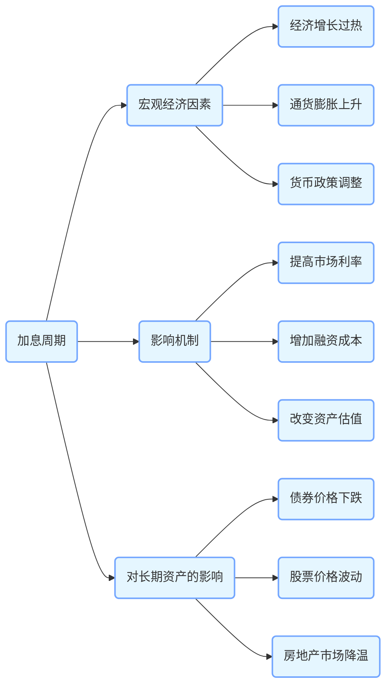

# 加息周期对长期资产的影响分析

> 关键词：加息周期、长期资产、债券、股票、房地产、影响分析

> 摘要：本文旨在深入剖析加息周期对长期资产的影响。通过对加息周期的概念、形成机制等背景知识的介绍，阐述相关核心概念及其联系，详细讲解核心算法原理并给出操作步骤，借助数学模型和公式进行理论分析和举例说明。同时，结合项目实战案例，分析加息周期下不同长期资产的表现，探讨其实际应用场景。此外，还推荐了相关的学习资源、开发工具框架以及论文著作，最后总结未来发展趋势与挑战，并对常见问题进行解答，为投资者和相关从业者在加息周期下合理配置长期资产提供全面且深入的参考。

## 1. 背景介绍 
### 1.1 目的和范围
本研究的主要目的是全面且深入地分析加息周期对长期资产的影响。范围涵盖了各类常见的长期资产，如债券、股票、房地产等，旨在为投资者、金融从业者以及对宏观经济和金融市场感兴趣的人士提供专业的见解和决策依据，帮助他们在加息周期中更好地理解市场动态，合理配置资产，降低风险并实现资产的保值增值。

### 1.2 预期读者
本文的预期读者包括但不限于专业投资者，他们需要在加息周期中调整投资组合以获取最大收益；金融分析师，负责对市场趋势进行研究和预测；金融机构从业者，如银行、基金公司等的工作人员，需要为客户提供专业的投资建议；以及对宏观经济和金融市场有一定了解并希望深入学习的普通读者。

### 1.3 文档结构概述
本文首先介绍了加息周期相关的背景知识，包括目的、预期读者和文档结构等。接着阐述了核心概念及其联系，通过文本示意图和 Mermaid 流程图进行直观展示。然后详细讲解了核心算法原理和具体操作步骤，结合 Python 源代码进行说明。之后运用数学模型和公式进行分析，并举例说明。通过项目实战案例，展示代码实现和详细解读。探讨了实际应用场景，为读者提供实践指导。推荐了相关的学习资源、开发工具框架和论文著作，方便读者进一步深入学习。最后总结未来发展趋势与挑战，解答常见问题，并提供扩展阅读和参考资料。

### 1.4 术语表
#### 1.4.1 核心术语定义
- **加息周期**：指中央银行在一段时间内持续提高基准利率的过程。基准利率的提高会影响整个金融市场的资金成本和投资回报率，对各类资产价格产生重要影响。
- **长期资产**：是指企业或个人持有的预计在一年以上时间内为其带来经济利益的资产，包括债券、股票、房地产等。这些资产通常具有较高的价值和较长的投资期限。
- **债券**：是发行人向投资者发行的一种债务凭证，承诺在一定时期内支付利息，并在到期时偿还本金。债券价格与市场利率呈反向变动关系。
- **股票**：是股份公司发行的所有权凭证，是股份公司为筹集资金而发行给各个股东作为持股凭证并借以取得股息和红利的一种有价证券。股票价格受公司基本面、宏观经济环境和市场情绪等多种因素影响。
- **房地产**：指土地、建筑物及固着在土地、建筑物上不可分离的部分及其附带的各种权益。房地产市场受宏观经济、政策调控和人口因素等影响较大。

#### 1.4.2 相关概念解释
- **市场利率**：是由资金市场上供求关系决定的利率，反映了资金的使用成本。加息周期会导致市场利率上升，影响各类资产的估值和投资决策。
- **资产估值**：是对资产的价值进行评估的过程，通常基于资产的未来现金流、风险水平和市场利率等因素。加息周期会改变资产的估值模型和参数，从而影响资产价格。
- **投资组合**：是投资者将不同类型的资产组合在一起，以达到分散风险、实现预期收益的目的。在加息周期中，合理调整投资组合可以降低风险并提高收益。

#### 1.4.3 缩略词列表
- **CPI**：消费者物价指数（Consumer Price Index），反映居民家庭一般所购买的消费品和服务项目价格水平变动情况的宏观经济指标。
- **GDP**：国内生产总值（Gross Domestic Product），是一个国家（或地区）所有常住单位在一定时期内生产活动的最终成果。
- **FED**：美国联邦储备系统（Federal Reserve System），负责履行美国的中央银行的职责，其货币政策对全球金融市场有重要影响。

## 2. 核心概念与联系 

### 核心概念原理
#### 加息周期原理
加息周期通常是中央银行根据宏观经济形势和政策目标采取的货币政策调整措施。当经济增长过热、通货膨胀压力上升时，中央银行会通过提高基准利率来收紧货币供应量，抑制过度投资和消费，稳定物价水平。加息会导致市场利率上升，增加企业和个人的融资成本，从而影响经济活动和资产价格。

#### 长期资产原理
- **债券**：债券的价值主要取决于其票面利率、到期时间和市场利率。当市场利率上升时，新发行债券的票面利率会提高，导致已发行债券的相对吸引力下降，价格下跌。反之，当市场利率下降时，债券价格会上涨。
- **股票**：股票价格与公司的盈利能力、成长前景和市场估值有关。加息会增加企业的融资成本，可能导致企业盈利增长放缓，同时也会提高投资者对股票的预期回报率，从而对股票价格产生负面影响。然而，如果加息是由于经济增长强劲导致的，企业盈利可能会增加，对股票价格也可能产生积极影响。
- **房地产**：房地产市场受利率影响较大。加息会增加购房者的贷款成本，降低购房需求，从而对房价产生下行压力。同时，加息也会增加房地产开发商的融资成本，影响房地产项目的开发和供应。

### 架构的文本示意图
```plaintext
加息周期
├── 宏观经济因素
│   ├── 经济增长过热
│   ├── 通货膨胀上升
│   └── 货币政策调整
├── 影响机制
│   ├── 提高市场利率
│   ├── 增加融资成本
│   └── 改变资产估值
└── 对长期资产的影响
    ├── 债券价格下跌
    ├── 股票价格波动
    └── 房地产市场降温
```

### Mermaid 流程图


## 3. 核心算法原理 & 具体操作步骤 

### 债券定价算法原理
债券定价的基本原理是将债券未来的现金流（利息和本金）按照市场利率进行折现。假设债券的票面金额为 $F$，票面利率为 $r$，每年付息一次，到期时间为 $n$ 年，市场利率为 $y$，则债券的价格 $P$ 可以通过以下公式计算：

$$P = \sum_{t=1}^{n} \frac{C}{(1 + y)^t} + \frac{F}{(1 + y)^n}$$

其中，$C = F \times r$ 为每年支付的利息。

### Python 代码实现
```python
def bond_price(face_value, coupon_rate, market_rate, years):
    """
    计算债券价格
    :param face_value: 债券票面金额
    :param coupon_rate: 债券票面利率
    :param market_rate: 市场利率
    :param years: 到期年限
    :return: 债券价格
    """
    coupon_payment = face_value * coupon_rate
    price = 0
    for t in range(1, years + 1):
        price += coupon_payment / ((1 + market_rate) ** t)
    price += face_value / ((1 + market_rate) ** years)
    return price

# 示例
face_value = 1000
coupon_rate = 0.05
market_rate = 0.06
years = 10

bond_price = bond_price(face_value, coupon_rate, market_rate, years)
print(f"债券价格: {bond_price}")
```

### 操作步骤
1. 确定债券的票面金额、票面利率、到期时间和市场利率等参数。
2. 调用 `bond_price` 函数，传入上述参数，计算债券价格。
3. 分析市场利率变化对债券价格的影响。可以通过改变市场利率的值，重新计算债券价格，观察价格的变化趋势。

### 股票估值算法原理
股票估值的方法有很多种，这里介绍最常用的股息贴现模型（Dividend Discount Model, DDM）。假设股票每年支付的股息为 $D$，股息增长率为 $g$，投资者要求的回报率为 $r$，则股票的价格 $P$ 可以通过以下公式计算：

$$P = \frac{D_1}{r - g}$$

其中，$D_1 = D_0 \times (1 + g)$ 为下一年的股息，$D_0$ 为当前股息。

### Python 代码实现
```python
def stock_price(dividend, growth_rate, required_return):
    """
    计算股票价格
    :param dividend: 当前股息
    :param growth_rate: 股息增长率
    :param required_return: 投资者要求的回报率
    :return: 股票价格
    """
    next_dividend = dividend * (1 + growth_rate)
    price = next_dividend / (required_return - growth_rate)
    return price

# 示例
dividend = 2
growth_rate = 0.03
required_return = 0.08

stock_price = stock_price(dividend, growth_rate, required_return)
print(f"股票价格: {stock_price}")
```

### 操作步骤
1. 确定股票的当前股息、股息增长率和投资者要求的回报率等参数。
2. 调用 `stock_price` 函数，传入上述参数，计算股票价格。
3. 分析市场利率变化对股票价格的影响。市场利率上升会导致投资者要求的回报率提高，从而降低股票价格。可以通过改变投资者要求的回报率的值，重新计算股票价格，观察价格的变化趋势。

## 4. 数学模型和公式 & 详细讲解 & 举例说明 

### 债券定价公式详细讲解
债券定价公式 $P = \sum_{t=1}^{n} \frac{C}{(1 + y)^t} + \frac{F}{(1 + y)^n}$ 是基于现金流折现的原理。公式中的 $\sum_{t=1}^{n} \frac{C}{(1 + y)^t}$ 表示债券每年支付的利息的现值之和，$\frac{F}{(1 + y)^n}$ 表示债券本金的现值。市场利率 $y$ 越高，折现因子 $(1 + y)^t$ 越大，债券未来现金流的现值就越小，债券价格也就越低。

### 举例说明
假设债券的票面金额为 $1000$ 元，票面利率为 $5\%$，每年付息一次，到期时间为 $10$ 年。当市场利率为 $6\%$ 时，根据上述公式计算债券价格：

每年支付的利息 $C = 1000 \times 0.05 = 50$ 元

$$P = \sum_{t=1}^{10} \frac{50}{(1 + 0.06)^t} + \frac{1000}{(1 + 0.06)^{10}}$$

通过 Python 代码计算得到债券价格约为 $926.40$ 元。

当市场利率上升到 $7\%$ 时，重新计算债券价格：

$$P = \sum_{t=1}^{10} \frac{50}{(1 + 0.07)^t} + \frac{1000}{(1 + 0.07)^{10}}$$

计算得到债券价格约为 $859.53$ 元。可以看到，市场利率上升导致债券价格下跌。

### 股票估值公式详细讲解
股息贴现模型公式 $P = \frac{D_1}{r - g}$ 是基于股票的价值等于其未来股息的现值之和的原理。当股息增长率 $g$ 小于投资者要求的回报率 $r$ 时，公式成立。公式中的 $D_1$ 为下一年的股息，$r - g$ 表示股息的折现率。投资者要求的回报率 $r$ 越高，折现率越大，股票价格就越低。

### 举例说明
假设股票当前股息为 $2$ 元，股息增长率为 $3\%$，投资者要求的回报率为 $8\%$。根据上述公式计算股票价格：

下一年的股息 $D_1 = 2 \times (1 + 0.03) = 2.06$ 元

$$P = \frac{2.06}{0.08 - 0.03} = 41.2$$ 元

当市场利率上升，投资者要求的回报率提高到 $9\%$ 时，重新计算股票价格：

$$P = \frac{2.06}{0.09 - 0.03} = 34.33$$ 元

可以看到，投资者要求的回报率提高导致股票价格下跌。

### 房地产估值模型
房地产估值可以采用收益法，假设房地产每年的净收益为 $R$，资本化率为 $i$，则房地产的价值 $V$ 可以通过以下公式计算：

$$V = \frac{R}{i}$$

资本化率 $i$ 与市场利率相关，市场利率上升会导致资本化率提高，从而降低房地产价值。

### 举例说明
假设某房地产每年的净收益为 $10$ 万元，资本化率为 $5\%$。根据上述公式计算房地产价值：

$$V = \frac{10}{0.05} = 200$$ 万元

当市场利率上升，资本化率提高到 $6\%$ 时，重新计算房地产价值：

$$V = \frac{10}{0.06} \approx 166.67$$ 万元

可以看到，市场利率上升导致房地产价值下降。

## 5. 项目实战：代码实际案例和详细解释说明 

### 5.1  开发环境搭建
- **Python 环境**：建议使用 Python 3.7 及以上版本。可以从 Python 官方网站（https://www.python.org/downloads/）下载并安装。
- **开发工具**：推荐使用 PyCharm 或 Jupyter Notebook。PyCharm 是一款功能强大的 Python 集成开发环境，适合大型项目开发；Jupyter Notebook 则适合交互式编程和数据分析，方便代码的调试和展示。

### 5.2  源代码详细实现和代码解读

#### 债券价格模拟
```python
import numpy as np
import matplotlib.pyplot as plt

# 定义债券参数
face_value = 1000
coupon_rate = 0.05
years = 10

# 生成不同的市场利率
market_rates = np.linspace(0.01, 0.1, 100)

# 计算不同市场利率下的债券价格
bond_prices = []
for rate in market_rates:
    price = bond_price(face_value, coupon_rate, rate, years)
    bond_prices.append(price)

# 绘制债券价格与市场利率的关系图
plt.plot(market_rates, bond_prices)
plt.xlabel('市场利率')
plt.ylabel('债券价格')
plt.title('债券价格与市场利率的关系')
plt.grid(True)
plt.show()
```

#### 代码解读
1. **导入必要的库**：`numpy` 用于生成不同的市场利率，`matplotlib.pyplot` 用于绘制债券价格与市场利率的关系图。
2. **定义债券参数**：设置债券的票面金额、票面利率和到期时间。
3. **生成不同的市场利率**：使用 `np.linspace` 函数生成从 $1\%$ 到 $10\%$ 的 100 个不同的市场利率。
4. **计算不同市场利率下的债券价格**：遍历每个市场利率，调用 `bond_price` 函数计算债券价格，并将结果存储在 `bond_prices` 列表中。
5. **绘制关系图**：使用 `plt.plot` 函数绘制债券价格与市场利率的关系图，设置坐标轴标签和标题，最后显示图形。

#### 股票价格模拟
```python
# 定义股票参数
dividend = 2
growth_rate = 0.03

# 生成不同的投资者要求的回报率
required_returns = np.linspace(0.04, 0.1, 100)

# 计算不同投资者要求的回报率下的股票价格
stock_prices = []
for return_rate in required_returns:
    price = stock_price(dividend, growth_rate, return_rate)
    stock_prices.append(price)

# 绘制股票价格与投资者要求的回报率的关系图
plt.plot(required_returns, stock_prices)
plt.xlabel('投资者要求的回报率')
plt.ylabel('股票价格')
plt.title('股票价格与投资者要求的回报率的关系')
plt.grid(True)
plt.show()
```

#### 代码解读
1. **定义股票参数**：设置股票的当前股息和股息增长率。
2. **生成不同的投资者要求的回报率**：使用 `np.linspace` 函数生成从 $4\%$ 到 $10\%$ 的 100 个不同的投资者要求的回报率。
3. **计算不同投资者要求的回报率下的股票价格**：遍历每个投资者要求的回报率，调用 `stock_price` 函数计算股票价格，并将结果存储在 `stock_prices` 列表中。
4. **绘制关系图**：使用 `plt.plot` 函数绘制股票价格与投资者要求的回报率的关系图，设置坐标轴标签和标题，最后显示图形。

### 5.3  代码解读与分析
通过上述代码可以直观地看到市场利率变化对债券价格和股票价格的影响。债券价格与市场利率呈反向变动关系，市场利率上升，债券价格下跌；股票价格与投资者要求的回报率呈反向变动关系，投资者要求的回报率提高，股票价格下跌。这些结果与我们前面的理论分析一致。在实际投资中，投资者可以根据市场利率的变化趋势，合理调整债券和股票的投资比例，以降低风险并实现资产的保值增值。

## 6. 实际应用场景 
### 投资者资产配置
在加息周期中，投资者可以根据加息对不同长期资产的影响，调整投资组合。例如，当市场利率上升时，债券价格下跌，投资者可以减少债券的投资比例；股票市场可能会出现波动，投资者可以选择具有较强抗风险能力和盈利能力的优质股票；房地产市场可能会降温，投资者可以谨慎投资房地产。通过合理的资产配置，投资者可以降低风险，提高投资回报率。

### 金融机构风险管理
金融机构如银行、基金公司等在加息周期中需要加强风险管理。银行需要关注贷款利率上升对借款人还款能力的影响，合理调整贷款政策，降低信用风险。基金公司需要根据市场利率变化调整基金的投资组合，确保基金的净值稳定。同时，金融机构还需要加强对利率风险的监测和管理，运用金融衍生品等工具进行套期保值，降低利率波动对自身业务的影响。

### 宏观经济政策制定
政府和中央银行在制定宏观经济政策时，需要考虑加息周期对长期资产市场的影响。例如，在加息过程中，需要关注房地产市场的稳定，避免房价大幅下跌引发金融风险。同时，需要通过财政政策和货币政策的协调配合，促进经济的稳定增长，缓解加息对实体经济的压力。

### 企业融资决策
企业在加息周期中需要调整融资策略。由于加息会增加企业的融资成本，企业可以选择减少债务融资，增加股权融资，降低财务风险。同时，企业还可以优化资金使用效率，提高资金回报率，以应对加息带来的挑战。

## 7. 工具和资源推荐
### 7.1 学习资源推荐
#### 7.1.1 书籍推荐
- 《货币金融学》（米什金著）：全面介绍了货币、银行和金融市场的基本原理和理论，对理解加息周期和金融市场运行机制有很大帮助。
- 《投资学》（博迪、凯恩、马库斯著）：系统阐述了投资的基本概念、理论和方法，包括资产定价、投资组合管理等内容，是投资领域的经典教材。
- 《房地产经济学》（丹尼斯·迪帕斯奎尔、威廉·C·惠顿著）：深入探讨了房地产市场的供求关系、价格形成机制和政策调控等问题，对于理解加息对房地产市场的影响具有重要参考价值。

#### 7.1.2 在线课程
- Coursera 上的“金融市场”课程：由耶鲁大学教授罗伯特·希勒主讲，介绍了金融市场的基本原理和实践，包括股票市场、债券市场和衍生品市场等。
- edX 上的“投资组合管理”课程：讲解了投资组合的构建、优化和风险管理等内容，帮助学习者掌握投资组合管理的方法和技巧。
- 中国大学 MOOC 上的“宏观经济学”课程：系统介绍了宏观经济的基本理论和政策，包括货币政策、财政政策等，有助于理解加息周期的宏观经济背景。

#### 7.1.3 技术博客和网站
- 华尔街见闻（https://wallstreetcn.com/）：提供全球金融市场的实时资讯、分析和评论，是了解金融市场动态的重要平台。
- 雪球（https://xueqiu.com/）：专注于股票投资，提供股票行情、研究报告、投资策略等内容，同时还有众多投资者分享投资经验和观点。
- 房地产信息网（https://www.realestate.com.cn/）：提供房地产市场的最新资讯、数据分析和政策解读，对于研究房地产市场具有重要参考价值。

### 7.2 开发工具框架推荐
#### 7.2.1 IDE和编辑器
- PyCharm：功能强大的 Python 集成开发环境，具有代码编辑、调试、版本控制等功能，适合专业 Python 开发者使用。
- Jupyter Notebook：交互式编程环境，支持 Python、R 等多种编程语言，方便代码的调试和展示，适合数据分析和机器学习领域的开发者。
- Visual Studio Code：轻量级的代码编辑器，支持多种编程语言，具有丰富的插件生态系统，可以根据需要进行个性化配置。

#### 7.2.2 调试和性能分析工具
- PDB：Python 内置的调试器，可以帮助开发者在代码中设置断点、单步执行代码，方便调试程序。
- cProfile：Python 标准库中的性能分析工具，可以统计程序中各个函数的执行时间和调用次数，帮助开发者找出程序的性能瓶颈。
- Memory Profiler：用于分析 Python 程序的内存使用情况，帮助开发者优化内存占用。

#### 7.2.3 相关框架和库
- NumPy：Python 中用于科学计算的基础库，提供了多维数组对象和各种数学函数，方便进行数值计算和数据分析。
- Pandas：用于数据处理和分析的 Python 库，提供了数据结构和数据操作工具，如 DataFrame 和 Series，方便进行数据清洗、转换和分析。
- Matplotlib：Python 中常用的绘图库，提供了丰富的绘图函数和工具，用于绘制各种类型的图表，如折线图、柱状图、散点图等。

### 7.3 相关论文著作推荐
#### 7.3.1 经典论文
- “The General Theory of Employment, Interest and Money”（凯恩斯著）：提出了凯恩斯主义经济学理论，对宏观经济政策的制定和理解加息周期的经济背景具有重要影响。
- “Efficient Capital Markets: A Review of Theory and Empirical Work”（法玛著）：阐述了有效市场假说，对理解金融市场的效率和资产定价具有重要意义。
- “A Theory of the Term Structure of Interest Rates”（希克斯著）：提出了利率期限结构理论，对理解债券市场和利率变动具有重要参考价值。

#### 7.3.2 最新研究成果
- 国际货币基金组织（IMF）的《世界经济展望》报告：定期发布全球经济形势和前景分析，包括对加息周期和金融市场的研究和预测。
- 美联储（FED）的货币政策报告：详细阐述了美联储的货币政策目标、决策过程和对经济形势的判断，对理解美国加息周期和全球金融市场具有重要参考价值。
- 学术期刊如《金融研究》、《经济研究》等：发表了大量关于加息周期、金融市场和资产定价的最新研究成果。

#### 7.3.3 应用案例分析
- 《中国房地产市场发展报告》：对中国房地产市场的发展趋势、政策调控和市场热点问题进行了深入分析，提供了大量的房地产市场应用案例。
- 《中国债券市场年度报告》：全面介绍了中国债券市场的发展状况、市场结构和政策环境，包含了债券市场的应用案例和分析。
- 《上市公司投资价值分析报告》：对上市公司的基本面、财务状况和投资价值进行了评估和分析，提供了股票投资的应用案例。

## 8. 总结：未来发展趋势与挑战
### 未来发展趋势
- **加息周期的不确定性**：未来加息周期的时间长度、加息幅度和频率等都存在不确定性。全球经济形势的复杂性、地缘政治风险和突发事件等因素都可能影响中央银行的货币政策决策，导致加息周期的变化难以预测。
- **长期资产价格的波动加剧**：加息周期会导致市场利率上升，从而影响长期资产的价格。不同类型的长期资产对加息的敏感度不同，债券价格通常会下跌，股票价格可能会出现波动，房地产市场可能会降温。未来长期资产价格的波动可能会加剧，投资者需要更加谨慎地进行资产配置。
- **金融创新和风险管理工具的发展**：为了应对加息周期带来的风险，金融市场将不断推出新的金融产品和风险管理工具。例如，利率互换、期权等金融衍生品可以帮助投资者对冲利率风险；资产证券化等金融创新可以提高金融市场的流动性和效率。
- **绿色金融和可持续投资的兴起**：随着全球对气候变化和可持续发展的关注度不断提高，绿色金融和可持续投资将成为未来金融市场的重要发展方向。在加息周期中，投资者可能会更加关注具有良好环境、社会和治理（ESG）表现的长期资产，推动绿色金融和可持续投资的发展。

### 挑战
- **投资者教育和风险意识**：加息周期对长期资产的影响较为复杂，投资者需要具备一定的金融知识和风险意识。然而，目前很多投资者对加息周期的认识不足，缺乏有效的投资策略和风险管理能力。因此，加强投资者教育，提高投资者的风险意识和投资能力是当前面临的重要挑战。
- **金融市场的稳定性**：加息周期可能会导致金融市场的波动加剧，增加金融市场的不稳定性。特别是在一些新兴市场和发展中国家，金融体系相对脆弱，加息可能会引发资本外流、汇率波动和金融风险。因此，维护金融市场的稳定性，防范系统性金融风险是金融监管部门面临的重要挑战。
- **宏观经济政策的协调配合**：加息周期会对实体经济产生一定的影响，如增加企业的融资成本、抑制消费和投资等。为了缓解加息对实体经济的压力，需要财政政策和货币政策的协调配合。然而，在实际操作中，财政政策和货币政策的协调配合存在一定的难度，需要政府和中央银行加强沟通和协作。
- **技术创新和数字化转型**：随着科技的不断发展，金融科技和数字化转型将深刻改变金融市场的格局。在加息周期中，金融机构需要加快技术创新和数字化转型的步伐，提高金融服务的效率和质量，以应对市场竞争和客户需求的变化。然而，技术创新和数字化转型也带来了新的风险和挑战，如网络安全、数据隐私等问题。

## 9. 附录：常见问题与解答
### 问题 1：加息周期一定会导致债券价格下跌吗？
解答：一般情况下，加息周期会导致市场利率上升，从而使债券价格下跌。但债券价格的变化还受到其他因素的影响，如债券的信用质量、剩余期限、票面利率等。如果债券的信用质量较高、剩余期限较短或票面利率较高，其价格下跌的幅度可能会相对较小。此外，如果市场对加息的预期已经充分反映在债券价格中，那么加息对债券价格的影响可能会减弱。

### 问题 2：加息周期对股票市场的影响是怎样的？
解答：加息周期对股票市场的影响较为复杂，既有负面影响，也可能有正面影响。负面影响主要体现在加息会增加企业的融资成本，导致企业盈利增长放缓，同时也会提高投资者对股票的预期回报率，从而对股票价格产生下行压力。正面影响主要体现在如果加息是由于经济增长强劲导致的，企业盈利可能会增加，对股票价格也可能产生积极影响。此外，不同行业和板块对加息的敏感度不同，一些防御性行业如公用事业、消费等可能受到的影响较小，而一些周期性行业如金融、房地产等可能受到的影响较大。

### 问题 3：加息周期中房地产市场一定会降温吗？
解答：加息周期通常会对房地产市场产生降温作用，但不一定会导致房地产市场全面降温。加息会增加购房者的贷款成本，降低购房需求，从而对房价产生下行压力。同时，加息也会增加房地产开发商的融资成本，影响房地产项目的开发和供应。然而，房地产市场还受到其他因素的影响，如人口增长、城市化进程、土地供应、政策调控等。如果这些因素对房地产市场的支撑作用较强，那么房地产市场可能不会出现明显的降温。

### 问题 4：在加息周期中，投资者应该如何调整投资组合？
解答：在加息周期中，投资者可以根据加息对不同长期资产的影响，调整投资组合。一般来说，可以减少债券的投资比例，尤其是长期债券；选择具有较强抗风险能力和盈利能力的优质股票；谨慎投资房地产。同时，可以适当增加现金或短期理财产品的配置，以提高资金的流动性和安全性。此外，投资者还可以考虑投资一些与利率走势无关或负相关的资产，如黄金、大宗商品等，以分散风险。

### 问题 5：加息周期会持续多久？
解答：加息周期的持续时间受到多种因素的影响，如宏观经济形势、通货膨胀水平、货币政策目标等，因此难以准确预测。一般来说，加息周期会持续几个月到几年不等。在经济增长强劲、通货膨胀压力较大的情况下，加息周期可能会持续较长时间；而在经济增长放缓、通货膨胀压力较小的情况下，加息周期可能会较短。投资者可以关注中央银行的货币政策声明和经济数据的变化，以了解加息周期的动态。

## 10. 扩展阅读 & 参考资料
### 扩展阅读
- 《金融炼金术》（乔治·索罗斯著）：介绍了索罗斯的投资理念和方法，以及他对金融市场的深刻理解和独特见解。
- 《聪明的投资者》（本杰明·格雷厄姆著）：被誉为投资界的圣经，阐述了价值投资的基本原理和方法，对投资者具有重要的指导意义。
- 《资本论》（卡尔·马克思著）：对资本主义经济制度进行了深入的分析和批判，对于理解宏观经济和金融市场的本质具有重要的理论价值。

### 参考资料
- 各国中央银行的官方网站，如美联储（https://www.federalreserve.gov/）、欧洲央行（https://www.ecb.europa.eu/）、中国人民银行（https://www.pbc.gov.cn/）等，提供了货币政策、经济数据和研究报告等信息。
- 国际金融机构的报告，如国际货币基金组织（https://www.imf.org/）、世界银行（https://www.worldbank.org/）等，发布了全球经济形势和金融市场的研究和分析。
- 学术数据库，如中国知网（https://www.cnki.net/）、万方数据（https://www.wanfangdata.com.cn/）、维普资讯（https://www.cqvip.com/）等，提供了大量的学术论文和研究成果。

作者：AI天才研究院/AI Genius Institute & 禅与计算机程序设计艺术 /Zen And The Art of Computer Programming