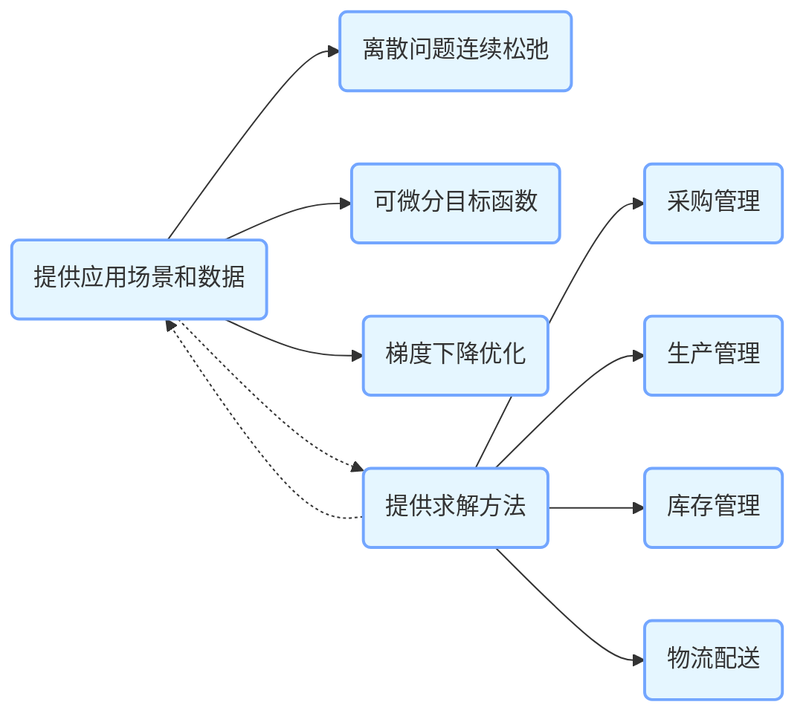

# 可微分组合优化在智能供应链管理中的应用

> 关键词：可微分组合优化、智能供应链管理、运筹学、机器学习、物流优化

> 摘要：本文深入探讨了可微分组合优化在智能供应链管理中的应用。首先介绍了可微分组合优化和智能供应链管理的相关背景知识，阐述了其目的、范围和预期读者。接着详细讲解了可微分组合优化的核心概念、算法原理、数学模型，并通过Python代码进行了示例说明。然后通过项目实战展示了如何在实际中应用可微分组合优化解决供应链管理问题。还探讨了其实际应用场景，推荐了相关的学习资源、开发工具和论文著作。最后总结了未来发展趋势与挑战，并对常见问题进行了解答。通过本文，读者可以全面了解可微分组合优化在智能供应链管理中的重要作用和应用方法。

## 1. 背景介绍 
### 1.1 目的和范围
可微分组合优化作为一种新兴的技术手段，旨在解决传统组合优化问题在计算复杂度和可扩展性方面的瓶颈。在智能供应链管理领域，涉及到众多复杂的组合优化问题，如库存管理、物流路径规划、生产调度等。本文的目的是详细阐述可微分组合优化的原理和方法，并深入探讨其在智能供应链管理各个环节的具体应用，为相关领域的研究人员和从业者提供全面的技术指导和实践参考。

本文的范围涵盖了可微分组合优化的核心概念、算法原理、数学模型，以及在智能供应链管理中的实际应用案例。同时，还会介绍相关的学习资源、开发工具和最新的研究成果，以帮助读者深入了解该领域的发展动态。

### 1.2 预期读者
本文的预期读者包括智能供应链管理领域的研究人员、工程师和从业者，他们希望通过引入可微分组合优化技术来提升供应链的效率和决策质量。此外，对机器学习、运筹学和组合优化等领域感兴趣的学生和科研人员也可以从本文中获取有价值的信息。

### 1.3 文档结构概述
本文将按照以下结构进行组织：
- 核心概念与联系：介绍可微分组合优化和智能供应链管理的核心概念，并阐述它们之间的联系。
- 核心算法原理 & 具体操作步骤：详细讲解可微分组合优化的核心算法原理，并通过Python代码展示具体的操作步骤。
- 数学模型和公式 & 详细讲解 & 举例说明：建立可微分组合优化在智能供应链管理中的数学模型，推导相关公式，并通过具体例子进行说明。
- 项目实战：代码实际案例和详细解释说明：通过一个实际的供应链管理项目，展示可微分组合优化的具体应用和代码实现。
- 实际应用场景：探讨可微分组合优化在智能供应链管理中的各种实际应用场景。
- 工具和资源推荐：推荐相关的学习资源、开发工具和论文著作。
- 总结：未来发展趋势与挑战：总结可微分组合优化在智能供应链管理中的应用现状，展望未来的发展趋势，并分析面临的挑战。
- 附录：常见问题与解答：解答读者在学习和应用过程中可能遇到的常见问题。
- 扩展阅读 & 参考资料：提供相关的扩展阅读材料和参考资料。

### 1.4 术语表
#### 1.4.1 核心术语定义
- **可微分组合优化**：是一种将组合优化问题转化为可微分的连续优化问题的技术，通过使用梯度下降等优化算法来求解组合优化问题。
- **智能供应链管理**：利用先进的信息技术和优化算法，对供应链中的物流、信息流和资金流进行全面管理和优化，以提高供应链的效率和竞争力。
- **组合优化问题**：是一类在离散的可行解空间中寻找最优解的问题，如旅行商问题、背包问题等。
- **梯度下降**：是一种常用的优化算法，通过沿着目标函数的负梯度方向迭代更新参数，以找到目标函数的最小值。

#### 1.4.2 相关概念解释
- **运筹学**：是一门应用数学学科，主要研究在有限的资源条件下，如何进行最优决策和资源分配。
- **机器学习**：是一门多领域交叉学科，涉及概率论、统计学、逼近论、凸分析、算法复杂度理论等多门学科。它专门研究计算机怎样模拟或实现人类的学习行为，以获取新的知识或技能，重新组织已有的知识结构使之不断改善自身的性能。
- **深度学习**：是机器学习的一个分支领域，它是一种基于对数据进行表征学习的方法。深度学习通过构建具有很多层的神经网络模型，自动从大量数据中学习特征和模式。

#### 1.4.3 缩略词列表
- **LP**：线性规划（Linear Programming）
- **ILP**：整数线性规划（Integer Linear Programming）
- **NN**：神经网络（Neural Network）
- **SGD**：随机梯度下降（Stochastic Gradient Descent）

## 2. 核心概念与联系 

### 可微分组合优化的核心概念
可微分组合优化的核心思想是将传统的组合优化问题转化为可微分的连续优化问题。传统的组合优化问题通常具有离散的可行解空间，求解这类问题往往需要使用穷举搜索、启发式算法等方法，计算复杂度较高。而可微分组合优化通过引入连续的松弛变量和可微分的目标函数，将离散问题转化为连续问题，从而可以使用梯度下降等高效的优化算法进行求解。

例如，对于一个二进制变量的组合优化问题，传统方法需要在 $2^n$ 个可能的解中进行搜索，而可微分组合优化可以通过引入连续变量 $x\in[0,1]^n$ 来松弛这个问题，然后使用可微分的目标函数和约束条件进行优化。

### 智能供应链管理的核心概念
智能供应链管理是利用先进的信息技术和优化算法，对供应链中的物流、信息流和资金流进行全面管理和优化。它涉及到多个环节，如采购、生产、库存管理、物流配送等，旨在提高供应链的效率、降低成本、提高客户满意度。

智能供应链管理的核心目标是实现供应链的协同运作和优化决策。通过实时监控和分析供应链中的各种数据，结合优化算法，可以做出更加科学合理的决策，如确定最佳的采购量、生产计划、库存水平和物流路径等。

### 两者之间的联系
可微分组合优化为智能供应链管理提供了一种强大的工具。在智能供应链管理中，存在着大量的组合优化问题，如库存管理中的库存分配问题、物流配送中的车辆路径规划问题等。这些问题往往具有复杂的约束条件和大规模的可行解空间，传统的优化方法难以有效求解。

可微分组合优化通过将这些问题转化为可微分的连续优化问题，可以利用深度学习等技术进行高效求解。同时，智能供应链管理中的实时数据和动态变化的环境也为可微分组合优化提供了新的挑战和机遇。通过结合实时数据，可微分组合优化可以实现动态优化，提高供应链的响应速度和灵活性。

### 文本示意图
```plaintext
可微分组合优化
|
|-- 离散问题连续松弛
|-- 可微分目标函数
|-- 梯度下降优化

智能供应链管理
|
|-- 采购管理
|-- 生产管理
|-- 库存管理
|-- 物流配送

联系：可微分组合优化为智能供应链管理中的组合优化问题提供求解方法，智能供应链管理为可微分组合优化提供应用场景和数据支持
```

### Mermaid 流程图


## 3. 核心算法原理 & 具体操作步骤 

### 核心算法原理
可微分组合优化的核心算法通常基于梯度下降或其变种。下面以一个简单的线性组合优化问题为例，介绍其算法原理。

假设我们有一个线性目标函数 $f(x) = c^T x$，其中 $x\in\{0,1\}^n$ 是二进制变量，$c\in\mathbb{R}^n$ 是系数向量。同时，存在一些线性约束条件 $Ax\leq b$，其中 $A\in\mathbb{R}^{m\times n}$ 和 $b\in\mathbb{R}^m$ 是约束矩阵和向量。

传统的求解方法是使用整数线性规划（ILP）算法，但对于大规模问题，ILP算法的计算复杂度很高。可微分组合优化的方法是将二进制变量 $x$ 松弛为连续变量 $x\in[0,1]^n$，得到松弛后的目标函数 $f(x) = c^T x$ 和约束条件 $Ax\leq b$。

然后，我们可以使用梯度下降算法来求解这个连续优化问题。梯度下降算法的基本思想是沿着目标函数的负梯度方向更新变量 $x$，直到达到收敛条件。具体来说，梯度下降算法的更新公式为：

$$x_{t+1} = x_t - \alpha\nabla f(x_t)$$

其中 $x_t$ 是第 $t$ 次迭代的变量值，$\alpha$ 是学习率，$\nabla f(x_t)$ 是目标函数在 $x_t$ 处的梯度。

### 具体操作步骤
下面是使用Python实现可微分组合优化的具体操作步骤：

```python
import numpy as np

# 定义目标函数和约束条件
c = np.array([1, 2, 3])  # 系数向量
A = np.array([[1, 1, 1], [1, 0, 0]])  # 约束矩阵
b = np.array([2, 1])  # 约束向量

# 初始化变量
x = np.random.rand(len(c))  # 初始值在 [0, 1] 之间

# 定义学习率和迭代次数
alpha = 0.01
num_iterations = 100

# 梯度下降算法
for i in range(num_iterations):
    # 计算目标函数的梯度
    grad = c
    
    # 检查约束条件
    constraint_violation = np.dot(A, x) - b
    if np.any(constraint_violation > 0):
        # 如果违反约束条件，调整梯度
        constraint_grad = np.dot(A.T, constraint_violation)
        grad += constraint_grad
    
    # 更新变量
    x = x - alpha * grad
    
    # 确保变量在 [0, 1] 之间
    x = np.clip(x, 0, 1)

# 输出结果
print("最优解:", x)
print("最优目标函数值:", np.dot(c, x))
```

### 代码解释
1. **定义目标函数和约束条件**：首先定义了目标函数的系数向量 $c$、约束矩阵 $A$ 和约束向量 $b$。
2. **初始化变量**：随机初始化变量 $x$，其值在 $[0, 1]$ 之间。
3. **定义学习率和迭代次数**：设置学习率 $\alpha$ 和迭代次数 $num\_iterations$。
4. **梯度下降算法**：在每次迭代中，计算目标函数的梯度，并检查约束条件。如果违反约束条件，则调整梯度。然后更新变量 $x$，并确保其值在 $[0, 1]$ 之间。
5. **输出结果**：输出最优解和最优目标函数值。

## 4. 数学模型和公式 & 详细讲解 & 举例说明 

### 数学模型
在智能供应链管理中，可微分组合优化可以应用于多个问题，如库存管理、物流路径规划等。下面以库存管理问题为例，建立数学模型。

假设我们有 $n$ 种商品，每种商品的库存水平为 $x_i\in\{0,1\}$（$i = 1,2,\cdots,n$），表示是否持有该商品的库存。每种商品的采购成本为 $c_i$，销售利润为 $p_i$，库存持有成本为 $h_i$。同时，存在一个库存容量限制 $C$。

我们的目标是最大化总利润，同时满足库存容量限制。数学模型可以表示为：

$$\max_{x\in\{0,1\}^n} \sum_{i=1}^n (p_i x_i - c_i x_i - h_i x_i)$$

$$\text{s.t.} \quad \sum_{i=1}^n s_i x_i \leq C$$

其中 $s_i$ 是第 $i$ 种商品的单位库存占用空间。

### 公式详细讲解
- **目标函数**：$\sum_{i=1}^n (p_i x_i - c_i x_i - h_i x_i)$ 表示总利润，其中 $p_i x_i$ 是销售利润，$c_i x_i$ 是采购成本，$h_i x_i$ 是库存持有成本。
- **约束条件**：$\sum_{i=1}^n s_i x_i \leq C$ 表示库存容量限制，即所有商品的库存占用空间之和不能超过库存容量 $C$。

### 举例说明
假设我们有 3 种商品，相关参数如下：

| 商品编号 | 采购成本 $c_i$ | 销售利润 $p_i$ | 库存持有成本 $h_i$ | 单位库存占用空间 $s_i$ |
|----------|----------------|----------------|---------------------|------------------------|
| 1        | 10             | 20             | 2                   | 1                      |
| 2        | 15             | 30             | 3                   | 2                      |
| 3        | 20             | 40             | 4                   | 3                      |

库存容量 $C = 4$。

我们可以将上述数学模型转化为可微分组合优化问题，通过松弛二进制变量 $x_i$ 为连续变量 $x_i\in[0,1]$，并使用梯度下降算法进行求解。

```python
import numpy as np

# 定义参数
c = np.array([10, 15, 20])
p = np.array([20, 30, 40])
h = np.array([2, 3, 4])
s = np.array([1, 2, 3])
C = 4

# 初始化变量
x = np.random.rand(len(c))

# 定义学习率和迭代次数
alpha = 0.01
num_iterations = 100

# 梯度下降算法
for i in range(num_iterations):
    # 计算目标函数的梯度
    grad = p - c - h
    
    # 检查约束条件
    constraint_violation = np.dot(s, x) - C
    if constraint_violation > 0:
        # 如果违反约束条件，调整梯度
        constraint_grad = s * constraint_violation
        grad += constraint_grad
    
    # 更新变量
    x = x - alpha * grad
    
    # 确保变量在 [0, 1] 之间
    x = np.clip(x, 0, 1)

# 输出结果
print("最优解:", x)
print("最优目标函数值:", np.dot(p - c - h, x))
```

通过上述代码，我们可以得到近似的最优解和最优目标函数值。

## 5. 项目实战：代码实际案例和详细解释说明 

### 5.1  开发环境搭建
为了实现可微分组合优化在智能供应链管理中的应用，我们需要搭建相应的开发环境。以下是具体的步骤：

#### 安装Python
首先，确保你已经安装了Python。建议使用Python 3.6及以上版本。你可以从Python官方网站（https://www.python.org/downloads/）下载并安装Python。

#### 安装必要的库
我们需要安装一些必要的Python库，如NumPy、Matplotlib等。可以使用以下命令进行安装：

```bash
pip install numpy matplotlib
```

### 5.2  源代码详细实现和代码解读
下面我们以一个物流路径规划问题为例，展示可微分组合优化的实际应用。

#### 问题描述
假设有 $n$ 个城市，我们需要找到一条经过所有城市且每个城市仅经过一次的最短路径（旅行商问题）。

#### 代码实现

```python
import numpy as np
import matplotlib.pyplot as plt

# 生成城市坐标
n = 10
cities = np.random.rand(n, 2)

# 初始化路径矩阵
path = np.random.permutation(n)

# 定义目标函数：计算路径长度
def path_length(path, cities):
    total_length = 0
    for i in range(n - 1):
        total_length += np.linalg.norm(cities[path[i]] - cities[path[i + 1]])
    total_length += np.linalg.norm(cities[path[-1]] - cities[path[0]])
    return total_length

# 可微分组合优化：模拟退火算法
def simulated_annealing(cities, initial_path, initial_temperature=100, cooling_rate=0.99, num_iterations=1000):
    current_path = initial_path
    current_length = path_length(current_path, cities)
    best_path = current_path
    best_length = current_length
    temperature = initial_temperature
    
    for i in range(num_iterations):
        # 生成新的路径
        new_path = current_path.copy()
        idx1, idx2 = np.random.choice(n, 2, replace=False)
        new_path[idx1], new_path[idx2] = new_path[idx2], new_path[idx1]
        new_length = path_length(new_path, cities)
        
        # 判断是否接受新路径
        if new_length < current_length or np.random.rand() < np.exp((current_length - new_length) / temperature):
            current_path = new_path
            current_length = new_length
        
        # 更新最优路径
        if current_length < best_length:
            best_path = current_path
            best_length = current_length
        
        # 降温
        temperature *= cooling_rate
    
    return best_path, best_length

# 运行模拟退火算法
best_path, best_length = simulated_annealing(cities, path)

# 绘制最优路径
plt.figure(figsize=(8, 8))
plt.scatter(cities[:, 0], cities[:, 1], color='red')
for i in range(n - 1):
    plt.plot([cities[best_path[i]][0], cities[best_path[i + 1]][0]], [cities[best_path[i]][1], cities[best_path[i + 1]][1]], 'b-')
plt.plot([cities[best_path[-1]][0], cities[best_path[0]][0]], [cities[best_path[-1]][1], cities[best_path[0]][1]], 'b-')
plt.title(f"最优路径长度: {best_length:.2f}")
plt.show()
```

#### 代码解读
1. **生成城市坐标**：使用 `np.random.rand(n, 2)` 生成 $n$ 个城市的随机坐标。
2. **初始化路径矩阵**：使用 `np.random.permutation(n)` 随机生成一个初始路径。
3. **定义目标函数**：`path_length` 函数用于计算给定路径的长度。
4. **模拟退火算法**：`simulated_annealing` 函数实现了可微分组合优化的模拟退火算法。在每次迭代中，生成一个新的路径，并根据一定的概率接受该路径。同时，不断更新最优路径。
5. **运行算法并绘制结果**：调用 `simulated_annealing` 函数得到最优路径和最优路径长度，并使用 `matplotlib` 库绘制最优路径。

### 5.3  代码解读与分析
#### 模拟退火算法原理
模拟退火算法是一种基于概率的全局优化算法，它通过模拟固体退火过程来寻找最优解。在算法的初始阶段，温度较高，算法允许接受一些较差的解，以避免陷入局部最优解。随着温度的降低，算法逐渐收敛到全局最优解。

#### 优点和局限性
- **优点**：模拟退火算法具有较强的全局搜索能力，能够在复杂的搜索空间中找到较优的解。
- **局限性**：算法的收敛速度较慢，需要较长的计算时间。同时，算法的性能受到初始温度、降温速率等参数的影响较大。

## 6. 实际应用场景 
### 库存管理
在库存管理中，可微分组合优化可以用于确定最优的库存水平和补货策略。通过考虑采购成本、库存持有成本、缺货成本等因素，建立可微分的目标函数和约束条件，使用梯度下降等算法求解最优解。例如，在多仓库库存分配问题中，可以使用可微分组合优化来确定每个仓库的库存分配量，以最小化总成本。

### 物流路径规划
物流路径规划是智能供应链管理中的一个重要问题。可微分组合优化可以用于解决旅行商问题、车辆路径规划问题等。通过将路径规划问题转化为可微分的连续优化问题，使用深度学习等技术进行求解。例如，在快递配送中，可以使用可微分组合优化来确定最优的配送路线，以提高配送效率和降低成本。

### 生产调度
在生产调度中，可微分组合优化可以用于确定最优的生产计划和任务分配。通过考虑生产时间、生产成本、设备利用率等因素，建立可微分的目标函数和约束条件，使用优化算法求解最优解。例如，在多工序生产调度问题中，可以使用可微分组合优化来确定每个工序的生产顺序和时间安排，以最大化生产效率。

### 供应商选择
供应商选择是智能供应链管理中的一个关键环节。可微分组合优化可以用于评估和选择最优的供应商。通过考虑供应商的价格、质量、交货期等因素，建立可微分的评价模型，使用优化算法求解最优解。例如，在采购决策中，可以使用可微分组合优化来选择最优的供应商组合，以降低采购成本和提高采购质量。

## 7. 工具和资源推荐
### 7.1 学习资源推荐
#### 7.1.1 书籍推荐
- 《运筹学导论》：本书是运筹学领域的经典教材，系统介绍了线性规划、整数规划、动态规划等优化方法，对于理解可微分组合优化的理论基础有很大帮助。
- 《机器学习》：周志华著，全面介绍了机器学习的基本概念、算法和应用，对于学习可微分组合优化在机器学习中的应用有重要参考价值。
- 《深度学习》：Ian Goodfellow、Yoshua Bengio和Aaron Courville著，深入探讨了深度学习的原理和应用，对于理解可微分组合优化在深度学习中的应用有很大帮助。

#### 7.1.2 在线课程
- Coursera上的“Optimization Methods in Statistics”：该课程介绍了统计中的优化方法，包括梯度下降、牛顿法等，对于学习可微分组合优化的算法原理有很大帮助。
- edX上的“Introduction to Artificial Intelligence”：该课程介绍了人工智能的基本概念和算法，包括机器学习、深度学习等，对于学习可微分组合优化在人工智能中的应用有重要参考价值。

#### 7.1.3 技术博客和网站
- arXiv.org：是一个开放获取的预印本平台，提供了大量关于可微分组合优化、机器学习、运筹学等领域的最新研究成果。
- Medium.com：是一个技术博客平台，有很多关于可微分组合优化和智能供应链管理的文章和教程。

### 7.2 开发工具框架推荐
#### 7.2.1 IDE和编辑器
- PyCharm：是一款专业的Python集成开发环境，提供了丰富的代码编辑、调试和分析功能，对于开发可微分组合优化相关的Python代码非常方便。
- Jupyter Notebook：是一个交互式的开发环境，支持Python、R等多种编程语言，适合进行数据分析和模型实验。

#### 7.2.2 调试和性能分析工具
- PDB：是Python自带的调试工具，可以帮助我们调试Python代码，定位和解决问题。
- cProfile：是Python的性能分析工具，可以帮助我们分析代码的性能瓶颈，优化代码的执行效率。

#### 7.2.3 相关框架和库
- NumPy：是Python的一个科学计算库，提供了高效的数组操作和数学函数，对于实现可微分组合优化的算法非常有用。
- PyTorch：是一个开源的深度学习框架，支持自动求导和梯度下降等优化算法，对于实现可微分组合优化在深度学习中的应用非常方便。

### 7.3 相关论文著作推荐
#### 7.3.1 经典论文
- “Neural Combinatorial Optimization with Reinforcement Learning”：该论文提出了一种基于强化学习的神经网络方法来解决组合优化问题，为可微分组合优化的研究提供了新的思路。
- “Learning to Solve NP-Complete Problems with Policy Gradient Reinforcement Learning”：该论文研究了如何使用策略梯度强化学习来解决NP完全问题，对于可微分组合优化在复杂问题中的应用有重要参考价值。

#### 7.3.2 最新研究成果
- 在顶级学术会议如NeurIPS、ICML、AAAI等上发表的关于可微分组合优化的最新研究成果，这些研究成果反映了该领域的最新发展动态。

#### 7.3.3 应用案例分析
- 一些实际应用案例的分析文章，如可微分组合优化在物流、供应链管理等领域的应用案例，这些文章可以帮助我们了解可微分组合优化在实际中的应用效果和挑战。

## 8. 总结：未来发展趋势与挑战
### 未来发展趋势
- **与深度学习的深度融合**：可微分组合优化将与深度学习技术更加紧密地结合，通过构建深度神经网络模型来解决复杂的组合优化问题。例如，使用图神经网络来处理图结构的组合优化问题。
- **实时动态优化**：随着智能供应链管理的发展，对实时动态优化的需求越来越高。可微分组合优化将能够更好地处理实时数据和动态变化的环境，实现供应链的实时优化决策。
- **跨领域应用**：可微分组合优化将在更多的领域得到应用，如金融、医疗、交通等。通过将可微分组合优化技术应用到不同的领域，可以解决这些领域中的复杂组合优化问题。

### 挑战
- **理论基础的完善**：可微分组合优化作为一个新兴的领域，其理论基础还不够完善。需要进一步研究可微分组合优化的收敛性、稳定性等理论问题，为其实际应用提供更坚实的理论支持。
- **计算复杂度**：虽然可微分组合优化可以将离散问题转化为连续问题，但在处理大规模问题时，计算复杂度仍然是一个挑战。需要开发更高效的算法和优化策略，以提高计算效率。
- **实际应用的验证**：可微分组合优化在实际应用中还需要进行更多的验证和测试。需要建立实际的应用案例，评估可微分组合优化在不同场景下的性能和效果。

## 9. 附录：常见问题与解答
### 可微分组合优化与传统组合优化方法有什么区别？
传统组合优化方法通常使用穷举搜索、启发式算法等方法来求解离散的可行解空间，计算复杂度较高。而可微分组合优化通过将离散问题转化为连续问题，使用梯度下降等优化算法进行求解，计算效率更高。

### 可微分组合优化在智能供应链管理中的应用有哪些局限性？
可微分组合优化在智能供应链管理中的应用存在一些局限性，如计算复杂度仍然较高、对数据质量要求较高、理论基础还不够完善等。同时，在实际应用中还需要考虑问题的复杂性和不确定性，需要进行更多的验证和测试。

### 如何选择合适的可微分组合优化算法？
选择合适的可微分组合优化算法需要考虑问题的特点、计算复杂度、求解精度等因素。对于小规模问题，可以使用简单的梯度下降算法；对于大规模问题，可以考虑使用随机梯度下降、模拟退火等算法。同时，还可以结合深度学习等技术，使用神经网络来求解组合优化问题。

## 10. 扩展阅读 & 参考资料
### 扩展阅读
- 《智能供应链管理：理论与实践》：本书详细介绍了智能供应链管理的理论和实践，对于深入了解可微分组合优化在智能供应链管理中的应用有很大帮助。
- 《组合优化：算法与复杂性》：该书系统介绍了组合优化的算法和复杂性理论，对于理解可微分组合优化的理论基础有重要参考价值。

### 参考资料
- “Neural Combinatorial Optimization with Reinforcement Learning”，Vinyals, Oriol, Meire Fortunato, and Navdeep Jaitly. arXiv preprint arXiv:1511.09340 (2015).
- “Learning to Solve NP-Complete Problems with Policy Gradient Reinforcement Learning”，Bello, Irwan, et al. Proceedings of the 34th International Conference on Machine Learning-Volume 70. JMLR. org, 2017.

作者：AI天才研究院/AI Genius Institute & 禅与计算机程序设计艺术 /Zen And The Art of Computer Programming