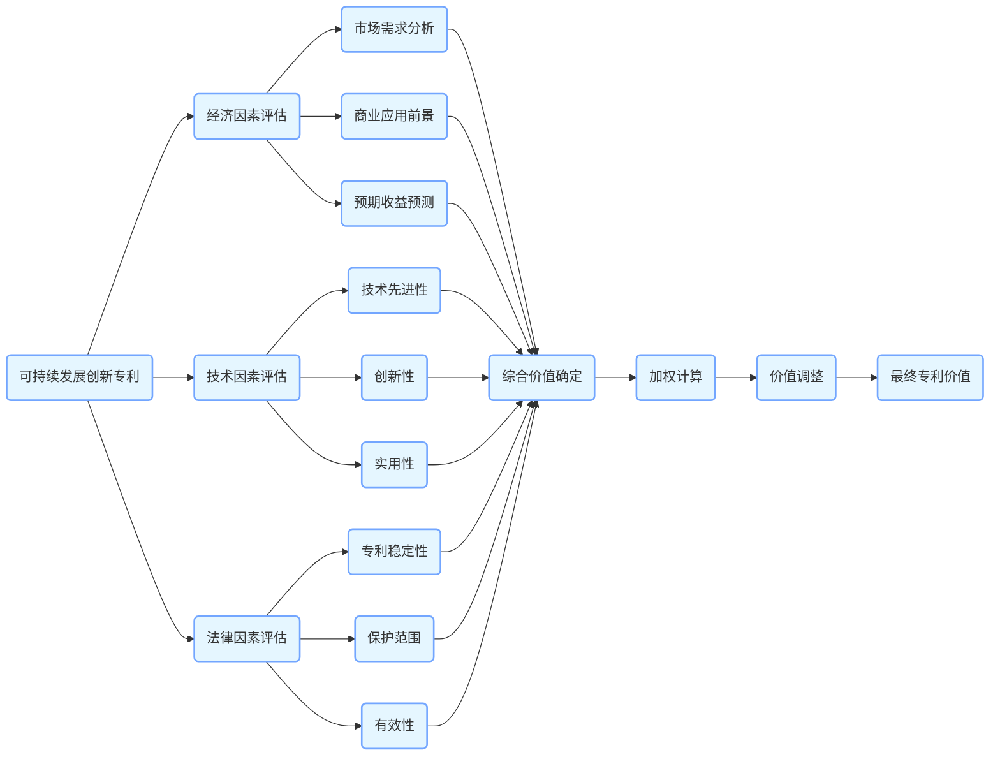

# 可持续发展创新的专利价值评估方法

> 关键词：可持续发展、创新、专利价值评估、评估方法、价值量化

> 摘要：本文聚焦于可持续发展创新的专利价值评估方法。在当今社会，可持续发展已成为全球关注的焦点，与之相关的创新专利不断涌现。然而，如何准确评估这些专利的价值是一个具有挑战性的问题。文章深入探讨了相关背景，阐述了核心概念及联系，详细介绍了核心算法原理、数学模型和公式，通过项目实战案例展示了具体操作，分析了实际应用场景，推荐了相关工具和资源，最后总结了未来发展趋势与挑战，旨在为准确评估可持续发展创新的专利价值提供全面且深入的方法和思路。

## 1. 背景介绍 
### 1.1 目的和范围
在可持续发展理念深入人心的时代，企业和科研机构在该领域的创新活动日益活跃，产生了大量相关专利。准确评估这些专利的价值对于企业的战略决策、技术交易、融资等具有重要意义。本文章的目的在于系统地探讨可持续发展创新的专利价值评估方法，涵盖从基本概念到具体操作，再到实际应用和未来趋势的各个方面，为相关领域的从业者和研究者提供全面的参考。

### 1.2 预期读者
本文预期读者包括专利评估师、企业管理人员、技术研发人员、投资者、科研工作者以及对可持续发展创新和专利价值评估感兴趣的人士。

### 1.3 文档结构概述
本文首先介绍背景信息，包括目的、预期读者和文档结构。接着阐述核心概念与联系，包括相关原理和架构示意图。然后详细讲解核心算法原理和具体操作步骤，同时给出数学模型和公式。通过项目实战展示实际案例和代码实现。分析实际应用场景，推荐相关工具和资源。最后总结未来发展趋势与挑战，提供常见问题解答和扩展阅读参考资料。

### 1.4 术语表
#### 1.4.1 核心术语定义
- **可持续发展创新**：指在经济、社会和环境三个维度实现协调发展的创新活动，旨在满足当代人的需求，同时不损害后代人满足其需求的能力。
- **专利价值**：指专利所具有的经济、技术、法律等方面的综合价值，反映了专利在市场上的潜在收益和竞争力。
- **专利价值评估**：是指通过一定的方法和程序，对专利的价值进行量化和判断的过程。

#### 1.4.2 相关概念解释
- **经济价值**：专利在商业应用中可能带来的经济收益，如销售收入、成本节约等。
- **技术价值**：专利所涉及技术的先进性、创新性和实用性。
- **法律价值**：专利的法律稳定性、保护范围和有效性等方面的价值。

#### 1.4.3 缩略词列表
- **NPV**：Net Present Value，净现值
- **IRR**：Internal Rate of Return，内部收益率

## 2. 核心概念与联系 

### 2.1 可持续发展创新的内涵
可持续发展创新强调在创新过程中充分考虑经济、社会和环境的协调发展。从经济角度看，它可以提高企业的竞争力和经济效益；从社会角度看，它有助于解决社会问题，提高人民生活质量；从环境角度看，它可以减少对环境的负面影响，实现资源的可持续利用。

### 2.2 专利价值的构成
专利价值主要由经济价值、技术价值和法律价值构成。经济价值是专利价值的核心，它取决于专利的市场需求、应用前景和商业潜力。技术价值反映了专利所涉及技术的水平和创新性，是专利能够实现经济价值的基础。法律价值则保障了专利的独占性和有效性，为专利的经济价值和技术价值提供了法律支持。

### 2.3 可持续发展创新与专利价值的联系
可持续发展创新的专利往往具有更高的社会认可度和市场潜力，因为它们符合社会发展的趋势和需求。这些专利在经济价值方面可能表现为更高的销售收入、成本节约和市场份额；在技术价值方面，可能具有更高的创新性和实用性；在法律价值方面，可能更容易获得专利保护和维持专利的有效性。

### 2.4 核心概念原理和架构的文本示意图
可持续发展创新的专利价值评估是一个综合的过程，涉及多个因素和环节。其基本原理是通过对专利的经济、技术和法律等方面的因素进行分析和评估，确定专利的综合价值。

架构示意图如下：
```plaintext
可持续发展创新专利价值评估
|-- 经济因素评估
|   |-- 市场需求分析
|   |-- 商业应用前景
|   |-- 预期收益预测
|-- 技术因素评估
|   |-- 技术先进性
|   |-- 创新性
|   |-- 实用性
|-- 法律因素评估
|   |-- 专利稳定性
|   |-- 保护范围
|   |-- 有效性
|-- 综合价值确定
|   |-- 加权计算
|   |-- 价值调整
```

### 2.5 Mermaid 流程图


## 3. 核心算法原理 & 具体操作步骤 

### 3.1 核心算法原理
本方法采用综合评估法，通过对经济、技术和法律三个方面的因素进行量化评估，然后加权计算得出专利的综合价值。具体步骤如下：

1. **因素量化**：对经济、技术和法律因素分别进行量化评估，得到各因素的得分。
2. **权重确定**：根据各因素对专利价值的重要程度，确定其权重。
3. **加权计算**：将各因素的得分乘以其权重，然后相加得到专利的综合得分。
4. **价值调整**：根据市场情况、行业特点等因素对综合得分进行调整，得到最终的专利价值。

### 3.2 具体操作步骤

#### 3.2.1 经济因素评估
- **市场需求分析**：通过市场调研、数据分析等方法，评估专利所涉及产品或服务的市场需求情况，包括市场规模、增长趋势、竞争状况等。
- **商业应用前景**：分析专利的商业应用潜力，包括应用领域、应用场景、商业模式等。
- **预期收益预测**：根据市场需求和商业应用前景，预测专利在未来一定时期内的预期收益，包括销售收入、成本节约等。

#### 3.2.2 技术因素评估
- **技术先进性**：评估专利所涉及技术的先进性，包括技术水平、创新性、领先程度等。
- **创新性**：分析专利的创新程度，包括新颖性、创造性等。
- **实用性**：评估专利的实用性，包括技术的可操作性、可靠性、适用性等。

#### 3.2.3 法律因素评估
- **专利稳定性**：评估专利的法律稳定性，包括专利的申请过程、审查情况、有效性等。
- **保护范围**：分析专利的保护范围，包括权利要求的范围、保护期限等。
- **有效性**：评估专利的有效性，包括是否存在侵权纠纷、是否被无效宣告等。

#### 3.2.4 综合价值确定
- **加权计算**：根据各因素的权重，将经济、技术和法律因素的得分进行加权计算，得到专利的综合得分。
- **价值调整**：根据市场情况、行业特点等因素对综合得分进行调整，得到最终的专利价值。

### 3.3 Python 源代码实现
```python
# 定义各因素的权重
economic_weight = 0.4
technical_weight = 0.3
legal_weight = 0.3

# 定义经济因素得分
def economic_score(market_demand, business_prospect, expected_income):
    """
    计算经济因素得分
    :param market_demand: 市场需求得分
    :param business_prospect: 商业应用前景得分
    :param expected_income: 预期收益得分
    :return: 经济因素得分
    """
    return (market_demand + business_prospect + expected_income) / 3

# 定义技术因素得分
def technical_score(technological_advancement, innovation, practicality):
    """
    计算技术因素得分
    :param technological_advancement: 技术先进性得分
    :param innovation: 创新性得分
    :param practicality: 实用性得分
    :return: 技术因素得分
    """
    return (technological_advancement + innovation + practicality) / 3

# 定义法律因素得分
def legal_score(patent_stability, protection_scope, validity):
    """
    计算法律因素得分
    :param patent_stability: 专利稳定性得分
    :param protection_scope: 保护范围得分
    :param validity: 有效性得分
    :return: 法律因素得分
    """
    return (patent_stability + protection_scope + validity) / 3

# 定义综合价值计算函数
def comprehensive_value(market_demand, business_prospect, expected_income,
                        technological_advancement, innovation, practicality,
                        patent_stability, protection_scope, validity):
    """
    计算专利的综合价值
    :param market_demand: 市场需求得分
    :param business_prospect: 商业应用前景得分
    :param expected_income: 预期收益得分
    :param technological_advancement: 技术先进性得分
    :param innovation: 创新性得分
    :param practicality: 实用性得分
    :param patent_stability: 专利稳定性得分
    :param protection_scope: 保护范围得分
    :param validity: 有效性得分
    :return: 专利的综合价值
    """
    economic = economic_score(market_demand, business_prospect, expected_income)
    technical = technical_score(technological_advancement, innovation, practicality)
    legal = legal_score(patent_stability, protection_scope, validity)
    return economic * economic_weight + technical * technical_weight + legal * legal_weight

# 示例数据
market_demand = 8
business_prospect = 7
expected_income = 9
technological_advancement = 7
innovation = 8
practicality = 7
patent_stability = 8
protection_scope = 7
validity = 9

# 计算综合价值
value = comprehensive_value(market_demand, business_prospect, expected_income,
                            technological_advancement, innovation, practicality,
                            patent_stability, protection_scope, validity)
print("专利的综合价值为:", value)
```

## 4. 数学模型和公式 & 详细讲解 & 举例说明 

### 4.1 数学模型
设专利的经济因素得分为 $E$，技术因素得分为 $T$，法律因素得分为 $L$，经济因素权重为 $w_E$，技术因素权重为 $w_T$，法律因素权重为 $w_L$，则专利的综合价值 $V$ 可以表示为：

$$V = w_E \times E + w_T \times T + w_L \times L$$

其中，$w_E + w_T + w_L = 1$。

### 4.2 详细讲解
- **经济因素得分 $E$**：经济因素得分是通过对市场需求、商业应用前景和预期收益三个方面的得分进行平均计算得到的。即：

$$E = \frac{E_{md} + E_{bp} + E_{ei}}{3}$$

其中，$E_{md}$ 表示市场需求得分，$E_{bp}$ 表示商业应用前景得分，$E_{ei}$ 表示预期收益得分。

- **技术因素得分 $T$**：技术因素得分是通过对技术先进性、创新性和实用性三个方面的得分进行平均计算得到的。即：

$$T = \frac{T_{ta} + T_{i} + T_{p}}{3}$$

其中，$T_{ta}$ 表示技术先进性得分，$T_{i}$ 表示创新性得分，$T_{p}$ 表示实用性得分。

- **法律因素得分 $L$**：法律因素得分是通过对专利稳定性、保护范围和有效性三个方面的得分进行平均计算得到的。即：

$$L = \frac{L_{ps} + L_{psc} + L_{v}}{3}$$

其中，$L_{ps}$ 表示专利稳定性得分，$L_{psc}$ 表示保护范围得分，$L_{v}$ 表示有效性得分。

### 4.3 举例说明
假设某可持续发展创新专利的各因素得分如下：

- 市场需求得分 $E_{md} = 8$
- 商业应用前景得分 $E_{bp} = 7$
- 预期收益得分 $E_{ei} = 9$
- 技术先进性得分 $T_{ta} = 7$
- 创新性得分 $T_{i} = 8$
- 实用性得分 $T_{p} = 7$
- 专利稳定性得分 $L_{ps} = 8$
- 保护范围得分 $L_{psc} = 7$
- 有效性得分 $L_{v} = 9$

经济因素权重 $w_E = 0.4$，技术因素权重 $w_T = 0.3$，法律因素权重 $w_L = 0.3$。

首先计算各因素得分：

- 经济因素得分 $E = \frac{8 + 7 + 9}{3} = 8$
- 技术因素得分 $T = \frac{7 + 8 + 7}{3} = 7.33$
- 法律因素得分 $L = \frac{8 + 7 + 9}{3} = 8$

然后计算专利的综合价值：

$$V = 0.4 \times 8 + 0.3 \times 7.33 + 0.3 \times 8 = 7.8$$

因此，该专利的综合价值为 7.8。

## 5. 项目实战：代码实际案例和详细解释说明 

### 5.1  开发环境搭建
- **Python 环境**：本项目使用 Python 3.x 版本进行开发，可从 Python 官方网站（https://www.python.org/downloads/） 下载并安装。
- **开发工具**：推荐使用 PyCharm 作为开发工具，可从 JetBrains 官方网站（https://www.jetbrains.com/pycharm/download/） 下载并安装。

### 5.2  源代码详细实现和代码解读
```python
# 定义各因素的权重
economic_weight = 0.4
technical_weight = 0.3
legal_weight = 0.3

# 定义经济因素得分
def economic_score(market_demand, business_prospect, expected_income):
    """
    计算经济因素得分
    :param market_demand: 市场需求得分
    :param business_prospect: 商业应用前景得分
    :param expected_income: 预期收益得分
    :return: 经济因素得分
    """
    return (market_demand + business_prospect + expected_income) / 3

# 定义技术因素得分
def technical_score(technological_advancement, innovation, practicality):
    """
    计算技术因素得分
    :param technological_advancement: 技术先进性得分
    :param innovation: 创新性得分
    :param practicality: 实用性得分
    :return: 技术因素得分
    """
    return (technological_advancement + innovation + practicality) / 3

# 定义法律因素得分
def legal_score(patent_stability, protection_scope, validity):
    """
    计算法律因素得分
    :param patent_stability: 专利稳定性得分
    :param protection_scope: 保护范围得分
    :param validity: 有效性得分
    :return: 法律因素得分
    """
    return (patent_stability + protection_scope + validity) / 3

# 定义综合价值计算函数
def comprehensive_value(market_demand, business_prospect, expected_income,
                        technological_advancement, innovation, practicality,
                        patent_stability, protection_scope, validity):
    """
    计算专利的综合价值
    :param market_demand: 市场需求得分
    :param business_prospect: 商业应用前景得分
    :param expected_income: 预期收益得分
    :param technological_advancement: 技术先进性得分
    :param innovation: 创新性得分
    :param practicality: 实用性得分
    :param patent_stability: 专利稳定性得分
    :param protection_scope: 保护范围得分
    :param validity: 有效性得分
    :return: 专利的综合价值
    """
    economic = economic_score(market_demand, business_prospect, expected_income)
    technical = technical_score(technological_advancement, innovation, practicality)
    legal = legal_score(patent_stability, protection_scope, validity)
    return economic * economic_weight + technical *