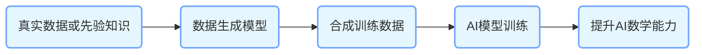

# 合成训练数据:提升AI数学能力的新方法

> 关键词：合成训练数据、AI数学能力、数据生成、机器学习、人工智能、数学推理、训练优化

> 摘要：本文聚焦于通过合成训练数据来提升AI数学能力这一创新方法。首先介绍了该方法提出的背景和相关概念，阐述了合成训练数据背后的核心原理与架构。接着详细讲解了核心算法原理，并给出Python代码示例。从数学模型和公式的角度深入剖析，结合实际案例进行说明。通过项目实战展示代码实现和解读，探讨其实际应用场景。推荐了相关的学习资源、开发工具和论文著作。最后总结未来发展趋势与挑战，解答常见问题并提供扩展阅读与参考资料，旨在全面深入地探讨合成训练数据在提升AI数学能力方面的潜力和价值。

## 1. 背景介绍 
### 1.1 目的和范围
在人工智能领域，提升AI的数学能力具有重要意义。数学能力是许多复杂任务的基础，如科学计算、金融分析、工程设计等。然而，获取大量高质量的数学相关训练数据往往面临诸多挑战，如数据标注成本高、数据隐私问题等。本文章的目的在于探讨合成训练数据这一新兴方法，以解决数据获取难题，提升AI的数学能力。范围涵盖合成训练数据的原理、算法、实际应用等多个方面，旨在为相关研究和实践提供全面的参考。

### 1.2 预期读者
本文预期读者包括人工智能领域的研究人员、开发人员、对AI数学能力提升感兴趣的学者、以及相关专业的学生等。无论是希望深入了解合成训练数据技术的专业人士，还是对AI数学能力发展趋势感兴趣的爱好者，都能从本文中获取有价值的信息。

### 1.3 文档结构概述
本文将按照以下结构展开：首先介绍背景知识，包括目的、预期读者和文档结构概述等。接着阐述合成训练数据的核心概念与联系，展示其原理和架构。然后详细讲解核心算法原理及具体操作步骤，给出Python代码示例。从数学模型和公式的角度进行深入分析，并举例说明。通过项目实战展示代码实现和解读。探讨实际应用场景，推荐相关的学习资源、开发工具和论文著作。最后总结未来发展趋势与挑战，解答常见问题并提供扩展阅读与参考资料。

### 1.4 术语表
#### 1.4.1 核心术语定义
- **合成训练数据**：通过特定算法和模型生成的用于训练AI的数据，而非直接从真实世界中收集。
- **AI数学能力**：AI在处理数学相关任务时的表现，如数学推理、计算、问题解决等能力。
- **数据生成模型**：用于生成合成训练数据的模型，如生成对抗网络（GAN）、变分自编码器（VAE）等。

#### 1.4.2 相关概念解释
- **生成对抗网络（GAN）**：由生成器和判别器组成的深度学习模型，生成器尝试生成逼真的数据，判别器则尝试区分生成的数据和真实数据，两者通过对抗训练不断提升性能。
- **变分自编码器（VAE）**：一种生成模型，通过将输入数据编码为潜在空间的分布，然后从该分布中采样解码生成新的数据。

#### 1.4.3 缩略词列表
- **GAN**：Generative Adversarial Network（生成对抗网络）
- **VAE**：Variational Autoencoder（变分自编码器）
- **ML**：Machine Learning（机器学习）
- **AI**：Artificial Intelligence（人工智能）

## 2. 核心概念与联系 

### 合成训练数据的原理
合成训练数据的核心思想是利用数据生成模型来创造新的数据样本。这些模型基于已有的真实数据或先验知识，学习数据的分布特征，然后根据这些特征生成新的数据。例如，在数学领域，可以根据数学问题的类型、难度级别等特征，生成具有不同复杂度的数学问题及对应的答案。

### 架构示意图


这个示意图展示了合成训练数据的基本流程。首先，数据生成模型从真实数据或先验知识中学习数据的特征和分布。然后，根据这些学习到的信息，生成合成训练数据。最后，将合成训练数据用于AI模型的训练，从而提升AI的数学能力。

## 3. 核心算法原理 & 具体操作步骤 

### 基于生成对抗网络（GAN）的合成训练数据生成算法原理
生成对抗网络（GAN）由生成器（Generator）和判别器（Discriminator）组成。生成器的目标是生成尽可能逼真的合成数据，而判别器的目标是区分生成的数据和真实数据。两者通过对抗训练不断提升性能。

以下是一个简单的基于Python和PyTorch库的GAN生成合成训练数据的示例代码：

```python
import torch
import torch.nn as nn
import torch.optim as optim
import numpy as np

# 定义生成器
class Generator(nn.Module):
    def __init__(self, input_dim, output_dim):
        super(Generator, self).__init__()
        self.model = nn.Sequential(
            nn.Linear(input_dim, 128),
            nn.LeakyReLU(0.2),
            nn.Linear(128, 256),
            nn.BatchNorm1d(256),
            nn.LeakyReLU(0.2),
            nn.Linear(256, 512),
            nn.BatchNorm1d(512),
            nn.LeakyReLU(0.2),
            nn.Linear(512, output_dim),
            nn.Tanh()
        )

    def forward(self, x):
        return self.model(x)

# 定义判别器
class Discriminator(nn.Module):
    def __init__(self, input_dim):
        super(Discriminator, self).__init__()
        self.model = nn.Sequential(
            nn.Linear(input_dim, 512),
            nn.LeakyReLU(0.2),
            nn.Linear(512, 256),
            nn.LeakyReLU(0.2),
            nn.Linear(256, 1),
            nn.Sigmoid()
        )

    def forward(self, x):
        return self.model(x)

# 超参数设置
input_dim = 100
output_dim = 28 * 28  # 假设生成的是28x28的图像数据（可根据数学数据调整）
batch_size = 32
epochs = 100
learning_rate = 0.0002

# 初始化生成器和判别器
generator = Generator(input_dim, output_dim)
discriminator = Discriminator(output_dim)

# 定义损失函数和优化器
criterion = nn.BCELoss()
g_optimizer = optim.Adam(generator.parameters(), lr=learning_rate)
d_optimizer = optim.Adam(discriminator.parameters(), lr=learning_rate)

# 训练过程
for epoch in range(epochs):
    # 模拟真实数据（这里用随机数据代替，实际应是数学相关数据）
    real_data = torch.randn(batch_size, output_dim)
    # 生成随机噪声
    noise = torch.randn(batch_size, input_dim)

    # 训练判别器
    d_optimizer.zero_grad()
    real_labels = torch.ones(batch_size, 1)
    fake_labels = torch.zeros(batch_size, 1)

    # 计算判别器对真实数据的损失
    real_output = discriminator(real_data)
    d_real_loss = criterion(real_output, real_labels)

    # 生成假数据
    fake_data = generator(noise)
    # 计算判别器对假数据的损失
    fake_output = discriminator(fake_data.detach())
    d_fake_loss = criterion(fake_output, fake_labels)

    # 判别器总损失
    d_loss = d_real_loss + d_fake_loss
    d_loss.backward()
    d_optimizer.step()

    # 训练生成器
    g_optimizer.zero_grad()
    fake_output = discriminator(fake_data)
    g_loss = criterion(fake_output, real_labels)
    g_loss.backward()
    g_optimizer.step()

    if epoch % 10 == 0:
        print(f'Epoch {epoch}, D_loss: {d_loss.item()}, G_loss: {g_loss.item()}')

# 生成合成训练数据
noise = torch.randn(10, input_dim)
synthetic_data = generator(noise)
print('Synthetic data shape:', synthetic_data.shape)
```

### 具体操作步骤
1. **数据准备**：收集或定义真实的数学相关数据，作为训练的基础。
2. **模型初始化**：初始化生成器和判别器模型，设置超参数，如学习率、批次大小、训练轮数等。
3. **训练判别器**：计算判别器对真实数据和生成数据的损失，更新判别器的参数。
4. **训练生成器**：计算生成器的损失，更新生成器的参数。
5. **迭代训练**：重复步骤3和4，直到模型收敛。
6. **生成合成数据**：使用训练好的生成器生成合成训练数据。

## 4. 数学模型和公式 & 详细讲解 & 举例说明 

### 生成对抗网络（GAN）的数学模型
GAN的目标是找到生成器 $G$ 和判别器 $D$ 的最优解，使得生成器生成的数据尽可能接近真实数据的分布，判别器无法准确区分生成数据和真实数据。

GAN的目标函数可以表示为：

$$
\min_{G} \max_{D} V(D, G) = \mathbb{E}_{x \sim p_{data}(x)}[\log D(x)] + \mathbb{E}_{z \sim p_{z}(z)}[\log(1 - D(G(z)))]
$$

其中，$p_{data}(x)$ 是真实数据的分布，$p_{z}(z)$ 是噪声的分布，$x$ 是真实数据，$z$ 是噪声，$G(z)$ 是生成器根据噪声生成的数据，$D(x)$ 是判别器对真实数据的判断结果，$D(G(z))$ 是判别器对生成数据的判断结果。

### 详细讲解
- **判别器的目标**：判别器的目标是最大化目标函数 $V(D, G)$，即尽可能准确地区分真实数据和生成数据。对于真实数据 $x$，判别器希望 $D(x)$ 接近1；对于生成数据 $G(z)$，判别器希望 $D(G(z))$ 接近0。
- **生成器的目标**：生成器的目标是最小化目标函数 $V(D, G)$，即生成尽可能逼真的数据，使得判别器无法区分生成数据和真实数据。生成器希望 $D(G(z))$ 接近1。

### 举例说明
假设我们要生成简单的数学加法问题及答案。真实数据是一系列的加法问题和对应的答案，如 `(2 + 3, 5)`、`(4 + 6, 10)` 等。噪声 $z$ 可以是随机生成的向量。生成器根据噪声生成新的加法问题和答案，判别器则判断这些生成的问题和答案是否与真实数据相似。通过不断的对抗训练，生成器可以学习到加法问题的模式，生成更逼真的合成训练数据。

## 5. 项目实战：代码实际案例和详细解释说明 

### 5.1  开发环境搭建
- **Python环境**：建议使用Python 3.7及以上版本。
- **深度学习框架**：使用PyTorch深度学习框架，可以通过以下命令安装：
```sh
pip install torch torchvision
```
- **其他依赖库**：根据具体需求安装相关的库，如NumPy、Matplotlib等。

### 5.2  源代码详细实现和代码解读
以下是一个生成简单数学加法问题合成训练数据的示例代码：

```python
import torch
import torch.nn as nn
import torch.optim as optim
import numpy as np

# 定义生成器
class Generator(nn.Module):
    def __init__(self, input_dim, output_dim):
        super(Generator, self).__init__()
        self.model = nn.Sequential(
            nn.Linear(input_dim, 128),
            nn.LeakyReLU(0.2),
            nn.Linear(128, 256),
            nn.BatchNorm1d(256),
            nn.LeakyReLU(0.2),
            nn.Linear(256, output_dim),
            nn.Tanh()
        )

    def forward(self, x):
        return self.model(x)

# 定义判别器
class Discriminator(nn.Module):
    def __init__(self, input_dim):
        super(Discriminator, self).__init__()
        self.model = nn.Sequential(
            nn.Linear(input_dim, 512),
            nn.LeakyReLU(0.2),
            nn.Linear(512, 256),
            nn.LeakyReLU(0.2),
            nn.Linear(256, 1),
            nn.Sigmoid()
        )

    def forward(self, x):
        return self.model(x)

# 生成真实数学加法问题数据
def generate_real_data(num_samples):
    data = []
    for _ in range(num_samples):
        a = np.random.randint(1, 10)
        b = np.random.randint(1, 10)
        result = a + b
        # 将问题和答案转换为向量形式
        input_vector = np.array([a, b])
        output_vector = np.array([result])
        data.append(np.concatenate((input_vector, output_vector)))
    return torch.tensor(np.array(data), dtype=torch.float32)

# 超参数设置
input_dim = 100
output_dim = 3  # 两个加数和一个结果
batch_size = 32
epochs = 100
learning_rate = 0.0002

# 初始化生成器和判别器
generator = Generator(input_dim, output_dim)
discriminator = Discriminator(output_dim)

# 定义损失函数和优化器
criterion = nn.BCELoss()
g_optimizer = optim.Adam(generator.parameters(), lr=learning_rate)
d_optimizer = optim.Adam(discriminator.parameters(), lr=learning_rate)

# 训练过程
for epoch in range(epochs):
    # 生成真实数据
    real_data = generate_real_data(batch_size)
    # 生成随机噪声
    noise = torch.randn(batch_size, input_dim)

    # 训练判别器
    d_optimizer.zero_grad()
    real_labels = torch.ones(batch_size, 1)
    fake_labels = torch.zeros(batch_size, 1)

    # 计算判别器对真实数据的损失
    real_output = discriminator(real_data)
    d_real_loss = criterion(real_output, real_labels)

    # 生成假数据
    fake_data = generator(noise)
    # 计算判别器对假数据的损失
    fake_output = discriminator(fake_data.detach())
    d_fake_loss = criterion(fake_output, fake_labels)

    # 判别器总损失
    d_loss = d_real_loss + d_fake_loss
    d_loss.backward()
    d_optimizer.step()

    # 训练生成器
    g_optimizer.zero_grad()
    fake_output = discriminator(fake_data)
    g_loss = criterion(fake_output, real_labels)
    g_loss.backward()
    g_optimizer.step()

    if epoch % 10 == 0:
        print(f'Epoch {epoch}, D_loss: {d_loss.item()}, G_loss: {g_loss.item()}')

# 生成合成训练数据
noise = torch.randn(10, input_dim)
synthetic_data = generator(noise)
print('Synthetic data:', synthetic_data)
```

### 5.3  代码解读与分析
- **生成器和判别器的定义**：生成器和判别器都是基于全连接神经网络实现的。生成器将随机噪声作为输入，输出合成的数学加法问题数据；判别器将输入的数据判断为真实数据或生成数据。
- **真实数据生成**：`generate_real_data` 函数用于生成真实的数学加法问题数据，将加数和结果转换为向量形式。
- **训练过程**：训练过程分为判别器训练和生成器训练两个阶段。判别器的目标是准确区分真实数据和生成数据，生成器的目标是生成逼真的数据，使得判别器无法区分。
- **合成数据生成**：训练完成后，使用训练好的生成器生成合成训练数据。

## 6. 实际应用场景 
### 教育领域
在教育中，可以使用合成训练数据来生成各种难度级别的数学练习题，帮助学生进行个性化学习。例如，根据学生的学习进度和能力水平，生成适合他们的数学问题，提高学习效果。

### 科研领域
在数学研究中，合成训练数据可以用于模拟复杂的数学问题和场景，帮助研究人员进行实验和验证。例如，在密码学研究中，生成大量的加密和解密问题数据，用于测试和优化算法。

### 金融领域
在金融分析中，合成训练数据可以用于生成模拟的金融数据，如股票价格走势、风险评估数据等。这些数据可以用于训练AI模型，进行市场预测和风险控制。

### 工业领域
在工业生产中，合成训练数据可以用于模拟各种数学模型，如优化生产流程、预测设备故障等。通过训练AI模型，提高生产效率和质量。

## 7. 工具和资源推荐
### 7.1 学习资源推荐
#### 7.1.1 书籍推荐
- 《深度学习》（Deep Learning）：由Ian Goodfellow、Yoshua Bengio和Aaron Courville撰写，是深度学习领域的经典教材，详细介绍了生成对抗网络等相关知识。
- 《Python深度学习》（Deep Learning with Python）：由Francois Chollet编写，通过Python代码示例介绍深度学习的应用，包括生成模型的实现。

#### 7.1.2 在线课程
- Coursera上的“深度学习专项课程”（Deep Learning Specialization）：由Andrew Ng教授授课，涵盖深度学习的各个方面，包括生成对抗网络的原理和应用。
- edX上的“强化学习基础”（Foundations of Reinforcement Learning）：介绍强化学习和生成模型的相关知识，对理解合成训练数据有帮助。

#### 7.1.3 技术博客和网站
- Medium：有许多关于人工智能和深度学习的技术博客，其中包含了大量关于合成训练数据和生成模型的文章。
- arXiv：提供最新的学术研究论文，涵盖了合成训练数据的最新研究成果。

### 7.2 开发工具框架推荐
#### 7.2.1 IDE和编辑器
- PyCharm：功能强大的Python集成开发环境，提供代码编辑、调试、版本控制等功能。
- Jupyter Notebook：交互式的开发环境，适合进行数据探索和模型实验。

#### 7.2.2 调试和性能分析工具
- TensorBoard：用于可视化深度学习模型的训练过程和性能指标，帮助调试和优化模型。
- PyTorch Profiler：用于分析PyTorch模型的性能瓶颈，提高模型的训练效率。

#### 7.2.3 相关框架和库
- PyTorch：流行的深度学习框架，提供了丰富的工具和函数，方便实现生成对抗网络等生成模型。
- TensorFlow：另一个广泛使用的深度学习框架，支持生成模型的开发和训练。

### 7.3 相关论文著作推荐
#### 7.3.1 经典论文
- “Generative Adversarial Nets”：由Ian Goodfellow等人发表，首次提出了生成对抗网络的概念。
- “Auto-Encoding Variational Bayes”：介绍了变分自编码器（VAE）的原理和应用。

#### 7.3.2 最新研究成果
- 关注arXiv上关于合成训练数据和生成模型的最新研究论文，了解该领域的最新进展。

#### 7.3.3 应用案例分析
- 一些学术会议和期刊上发表的关于合成训练数据在不同领域应用的案例分析，如教育、金融等领域。

## 8. 总结：未来发展趋势与挑战
### 未来发展趋势
- **多样化的数据生成**：未来合成训练数据将不仅仅局限于数学领域，还将扩展到图像、语音、文本等多个领域，生成更加多样化和复杂的数据。
- **与其他技术的融合**：合成训练数据将与强化学习、迁移学习等技术相结合，提高AI模型的性能和泛化能力。
- **自动化数据生成**：开发更加自动化的数据生成工具和框架，减少人工干预，提高数据生成的效率和质量。

### 挑战
- **数据质量控制**：确保合成训练数据的质量和真实性是一个挑战，需要开发有效的评估和验证方法。
- **隐私和安全问题**：合成训练数据可能涉及隐私和安全问题，需要采取相应的措施来保护数据的安全和隐私。
- **模型可解释性**：生成模型的可解释性较差，需要研究如何提高模型的可解释性，以便更好地理解和应用合成训练数据。

## 9. 附录：常见问题与解答
### 问题1：合成训练数据的质量如何保证？
解答：可以通过多种方法保证合成训练数据的质量，如使用真实数据进行对比验证、引入专家评估、使用评估指标（如生成数据与真实数据的分布相似度）等。

### 问题2：合成训练数据是否可以完全替代真实数据？
解答：目前合成训练数据还不能完全替代真实数据。虽然合成训练数据可以提供大量的数据样本，但真实数据仍然具有不可替代的价值，特别是在一些对数据真实性要求较高的场景中。合成训练数据可以作为真实数据的补充，提高AI模型的训练效果。

### 问题3：如何选择合适的数据生成模型？
解答：选择合适的数据生成模型需要考虑多个因素，如数据类型、任务需求、计算资源等。例如，对于图像数据，生成对抗网络（GAN）可能是一个不错的选择；对于文本数据，变分自编码器（VAE）或基于Transformer的生成模型可能更合适。

## 10. 扩展阅读 & 参考资料
- Goodfellow, I. J., et al. (2014). Generative adversarial nets. Advances in neural information processing systems.
- Kingma, D. P., & Welling, M. (2013). Auto-encoding variational bayes. arXiv preprint arXiv:1312.6114.
- Chollet, F. (2018). Deep Learning with Python. Manning Publications.

作者：AI天才研究院/AI Genius Institute & 禅与计算机程序设计艺术 /Zen And The Art of Computer Programming