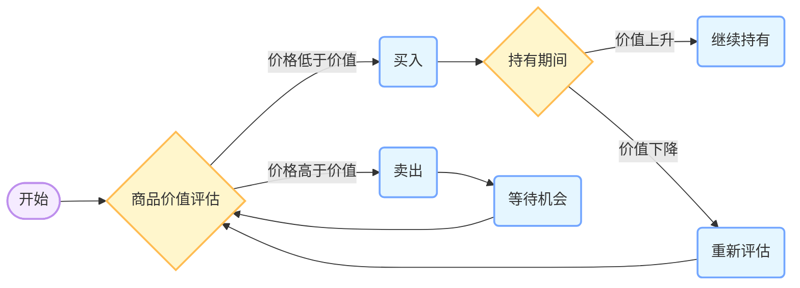

# 吉姆·罗杰斯的商品价值投资：实物资产中的价值

> 关键词：吉姆·罗杰斯、商品价值投资、实物资产、价值分析、投资策略

> 摘要：本文深入探讨了吉姆·罗杰斯所倡导的商品价值投资理念，聚焦于实物资产中的价值。首先介绍了相关背景知识，包括目的范围、预期读者等。接着阐述了核心概念及联系，通过文本示意图和 Mermaid 流程图进行展示。详细讲解了核心算法原理和具体操作步骤，并给出 Python 源代码。从数学模型和公式角度进行深入剖析并举例说明。通过项目实战，展示代码实际案例并详细解释。分析了商品价值投资在实际中的应用场景，推荐了学习工具和资源。最后总结未来发展趋势与挑战，解答常见问题并提供扩展阅读和参考资料，旨在帮助读者全面理解和运用吉姆·罗杰斯的商品价值投资理念。

## 1. 背景介绍 
### 1.1 目的和范围
本文的主要目的是全面解读吉姆·罗杰斯的商品价值投资理念，深入剖析实物资产中蕴含的价值。具体范围涵盖从理论层面理解商品价值投资的核心概念、算法原理、数学模型，到实际应用中的项目实战案例，以及与之相关的工具资源推荐。通过对这些方面的探讨，为投资者提供系统的知识体系，帮助他们更好地运用商品价值投资策略。

### 1.2 预期读者
本文预期读者包括对投资领域感兴趣的初学者，他们希望通过学习吉姆·罗杰斯的投资理念，了解商品价值投资的基本知识和方法；也适合有一定投资经验的投资者，他们可以通过本文进一步深化对商品价值投资的理解，优化自己的投资策略；同时，对于金融研究人员和相关专业学生来说，本文也提供了有价值的研究素材和学习参考。

### 1.3 文档结构概述
本文按照以下结构展开：首先介绍背景知识，为读者奠定基础；接着阐述核心概念与联系，帮助读者建立清晰的概念框架；然后详细讲解核心算法原理和具体操作步骤，通过 Python 代码进行说明；之后介绍数学模型和公式，并举例说明；通过项目实战展示代码案例和详细解释；分析实际应用场景；推荐相关工具和资源；总结未来发展趋势与挑战；解答常见问题；最后提供扩展阅读和参考资料。

### 1.4 术语表
#### 1.4.1 核心术语定义
- **商品价值投资**：基于对商品内在价值的分析，通过投资实物资产或相关金融工具，以获取长期投资回报的投资策略。
- **实物资产**：具有实际物理形态的资产，如黄金、白银、石油、农产品等。
- **价值分析**：对商品的内在价值进行评估和判断的过程，考虑因素包括供求关系、生产成本、市场趋势等。

#### 1.4.2 相关概念解释
- **商品周期**：商品价格在市场供求关系等因素影响下，呈现出周期性波动的现象。了解商品周期有助于投资者把握投资时机。
- **通货膨胀对冲**：商品投资在一定程度上可以抵御通货膨胀的影响，因为商品价格往往会随着通货膨胀而上涨。

#### 1.4.3 缩略词列表
- **CPI**：消费者物价指数（Consumer Price Index），用于衡量通货膨胀水平的指标。
- **PPI**：生产者物价指数（Producer Price Index），反映生产领域价格变动情况的指标。

## 2. 核心概念与联系 
### 核心概念原理
吉姆·罗杰斯的商品价值投资理念基于对实物资产内在价值的深刻理解。他认为，商品作为人类生产和生活的基础物质，其价值是由供求关系、生产成本、宏观经济环境等多种因素共同决定的。在长期的经济发展过程中，商品价格会围绕其内在价值上下波动。当商品价格低于其内在价值时，就存在投资机会；而当价格高于内在价值时，则可能面临投资风险。

实物资产与金融资产不同，它们具有实际的使用价值。例如，黄金不仅是一种装饰品，还在工业、电子等领域有广泛应用；石油是现代工业的血液，对全球经济的运行至关重要。这种实际使用价值为商品提供了内在的支撑，使其在经济不稳定时期往往能够保值甚至增值。

### 架构的文本示意图
```plaintext
商品价值投资
|
|-- 核心因素
|   |-- 供求关系
|   |-- 生产成本
|   |-- 宏观经济环境
|
|-- 投资对象
|   |-- 实物资产（黄金、石油、农产品等）
|   |-- 相关金融工具（期货、期权等）
|
|-- 投资策略
|   |-- 价值分析
|   |-- 周期判断
|   |-- 风险管理
```

### Mermaid 流程图


## 3. 核心算法原理 & 具体操作步骤 
### 核心算法原理
商品价值投资的核心算法原理可以基于以下几个方面：

#### 供求关系分析
供求关系是影响商品价格的最直接因素。我们可以通过建立供求模型来分析商品的价格走势。假设商品的供给函数为 $S(p)$，需求函数为 $D(p)$，其中 $p$ 为商品价格。当供给等于需求时，即 $S(p)=D(p)$，市场达到均衡状态，此时的价格为均衡价格 $p^*$。

#### 价值评估模型
我们可以使用相对估值法来评估商品的价值。例如，对于黄金，我们可以参考历史价格与其他经济指标（如 CPI、PPI 等）的关系，建立回归模型来预测黄金的合理价值。假设黄金价格为 $P_{gold}$，CPI 为 $C$，PPI 为 $P$，我们可以建立如下回归模型：

$P_{gold} = \alpha + \beta_1 C + \beta_2 P + \epsilon$

其中 $\alpha$ 为截距项，$\beta_1$ 和 $\beta_2$ 为回归系数，$\epsilon$ 为误差项。

### 具体操作步骤
#### 数据收集
收集商品的供求数据、价格数据、相关经济指标数据等。可以通过政府部门、行业协会、金融机构等渠道获取数据。

#### 模型建立
根据收集到的数据，建立供求模型和价值评估模型。可以使用统计分析软件（如 Python 中的 `pandas`、`statsmodels` 等库）进行模型拟合和参数估计。

#### 价值评估
使用建立好的模型对商品的价值进行评估，计算出商品的合理价格。

#### 投资决策
比较商品的市场价格和合理价格，如果市场价格低于合理价格，则考虑买入；如果市场价格高于合理价格，则考虑卖出。

### Python 源代码实现
```python
import pandas as pd
import statsmodels.api as sm

# 模拟数据
data = {
    'gold_price': [1000, 1100, 1200, 1300, 1400],
    'cpi': [100, 105, 110, 115, 120],
    'ppi': [90, 95, 100, 105, 110]
}
df = pd.DataFrame(data)

# 准备自变量和因变量
X = df[['cpi', 'ppi']]
y = df['gold_price']

# 添加常数项
X = sm.add_constant(X)

# 建立回归模型
model = sm.OLS(y, X).fit()

# 输出模型结果
print(model.summary())

# 预测黄金价格
new_data = pd.DataFrame({
    'const': [1],
    'cpi': [125],
    'ppi': [115]
})
predicted_price = model.predict(new_data)
print(f"预测的黄金价格: {predicted_price[0]}")
```

## 4. 数学模型和公式 & 详细讲解 & 举例说明 
### 供求模型
供求模型是基于经济学原理建立的，用于描述商品市场上供给和需求与价格之间的关系。

#### 供给函数
供给函数表示生产者在不同价格水平下愿意提供的商品数量。一般来说，供给量与价格呈正相关关系，即价格越高，生产者愿意提供的商品数量越多。常见的供给函数形式为线性函数：

$S(p) = a + bp$

其中 $a$ 和 $b$ 为常数，$a$ 表示价格为 0 时的供给量（通常为负数或 0），$b$ 表示供给的价格弹性，即价格每变动一个单位，供给量的变动量。

#### 需求函数
需求函数表示消费者在不同价格水平下愿意购买的商品数量。一般来说，需求量与价格呈负相关关系，即价格越高，消费者愿意购买的商品数量越少。常见的需求函数形式也为线性函数：

$D(p) = c - dp$

其中 $c$ 和 $d$ 为常数，$c$ 表示价格为 0 时的需求量，$d$ 表示需求的价格弹性。

#### 均衡价格和均衡数量
当供给等于需求时，市场达到均衡状态，此时的价格为均衡价格 $p^*$，数量为均衡数量 $Q^*$。我们可以通过联立供给函数和需求函数求解均衡价格和均衡数量：

$\begin{cases} S(p) = D(p) \\ S(p) = a + bp \\ D(p) = c - dp \end{cases}$

将供给函数和需求函数代入 $S(p) = D(p)$ 中，得到：

$a + bp = c - dp$

移项可得：

$(b + d)p = c - a$

解得均衡价格：

$p^* = \frac{c - a}{b + d}$

将均衡价格代入供给函数或需求函数中，可得均衡数量：

$Q^* = S(p^*) = D(p^*) = a + b \frac{c - a}{b + d}$

### 举例说明
假设某商品的供给函数为 $S(p) = -10 + 2p$，需求函数为 $D(p) = 50 - 3p$。

#### 求解均衡价格
联立供给函数和需求函数：

$\begin{cases} -10 + 2p = 50 - 3p \\ \end{cases}$

移项可得：

$2p + 3p = 50 + 10$

$5p = 60$

解得均衡价格：

$p^* = 12$

#### 求解均衡数量
将均衡价格代入供给函数中：

$Q^* = S(12) = -10 + 2 \times 12 = 14$

所以，该商品的均衡价格为 12，均衡数量为 14。

### 价值评估模型
如前面所述，我们可以使用回归模型来评估商品的价值。假设我们要评估黄金的价值，建立的回归模型为：

$P_{gold} = \alpha + \beta_1 C + \beta_2 P + \epsilon$

其中 $P_{gold}$ 为黄金价格，$C$ 为 CPI，$P$ 为 PPI，$\alpha$ 为截距项，$\beta_1$ 和 $\beta_2$ 为回归系数，$\epsilon$ 为误差项。

### 举例说明
假设通过历史数据拟合得到回归模型：

$P_{gold} = 200 + 5C + 3P$

当 CPI 为 130，PPI 为 120 时，预测的黄金价格为：

$P_{gold} = 200 + 5 \times 130 + 3 \times 120 = 200 + 650 + 360 = 1210$

## 5. 项目实战：代码实际案例和详细解释说明 
### 5.1  开发环境搭建
#### 安装 Python
首先需要安装 Python 环境，建议使用 Python 3.7 及以上版本。可以从 Python 官方网站（https://www.python.org/downloads/）下载安装包，按照安装向导进行安装。

#### 安装必要的库
使用 `pip` 命令安装必要的库，包括 `pandas`、`statsmodels` 等：

```sh
pip install pandas statsmodels
```

### 5.2  源代码详细实现和代码解读
```python
import pandas as pd
import statsmodels.api as sm

# 步骤 1: 数据收集
# 假设我们已经从数据源获取了黄金价格、CPI 和 PPI 的数据，并保存为 CSV 文件
data = pd.read_csv('gold_data.csv')

# 步骤 2: 数据预处理
# 提取自变量和因变量
X = data[['cpi', 'ppi']]
y = data['gold_price']

# 添加常数项
X = sm.add_constant(X)

# 步骤 3: 建立回归模型
model = sm.OLS(y, X).fit()

# 步骤 4: 输出模型结果
print(model.summary())

# 步骤 5: 预测黄金价格
# 假设我们有新的 CPI 和 PPI 数据
new_data = pd.DataFrame({
    'const': [1],
    'cpi': [135],
    'ppi': [125]
})
predicted_price = model.predict(new_data)
print(f"预测的黄金价格: {predicted_price[0]}")
```

### 代码解读与分析
#### 数据收集
使用 `pandas` 库的 `read_csv` 函数从 CSV 文件中读取数据。实际应用中，数据可以从多种数据源获取，如数据库、API 等。

#### 数据预处理
提取自变量（CPI 和 PPI）和因变量（黄金价格），并使用 `sm.add_constant` 函数添加常数项，以便进行线性回归分析。

#### 建立回归模型
使用 `statsmodels` 库的 `OLS` 函数建立普通最小二乘回归模型，并使用 `fit` 方法进行模型拟合。

#### 输出模型结果
使用 `summary` 方法输出模型的详细结果，包括回归系数、R 平方值、F 统计量等，帮助我们评估模型的拟合效果。

#### 预测黄金价格
使用 `predict` 方法对新的 CPI 和 PPI 数据进行预测，得到预测的黄金价格。

## 6. 实际应用场景 
### 个人投资
对于个人投资者来说，商品价值投资可以作为资产配置的一部分。例如，在通货膨胀预期上升时，投资黄金等实物资产可以起到保值增值的作用。投资者可以根据商品价值分析，选择合适的投资时机和投资品种，如买入低估的商品期货合约或相关的 ETF 基金。

### 企业风险管理
企业在生产经营过程中面临着原材料价格波动的风险。通过商品价值投资策略，企业可以进行套期保值操作，降低原材料价格上涨带来的成本压力。例如，一家石油加工企业可以在石油价格低估时，通过期货市场买入一定数量的石油期货合约，锁定原材料成本。

### 宏观经济研究
商品价格的波动往往反映了宏观经济的运行状况。经济学家和研究机构可以通过分析商品价值，预测宏观经济的走势。例如，农产品价格的上涨可能预示着通货膨胀的压力增大，政府可以根据这些信息制定相应的宏观经济政策。

## 7. 工具和资源推荐
### 7.1 学习资源推荐
#### 7.1.1 书籍推荐
- 《热门商品投资》（Hot Commodities）：吉姆·罗杰斯的经典著作，详细阐述了他的商品价值投资理念和方法。
- 《期货市场技术分析》（Technical Analysis of the Futures Markets）：约翰·墨菲的著作，介绍了期货市场的技术分析方法，对于商品投资有很大的帮助。
- 《聪明的投资者》（The Intelligent Investor）：本杰明·格雷厄姆的经典投资书籍，虽然主要针对股票投资，但其中的价值投资理念也适用于商品投资。

#### 7.1.2 在线课程
- Coursera 上的“Financial Markets”课程：由耶鲁大学教授罗伯特·席勒讲授，涵盖了金融市场的各个方面，包括商品市场。
- edX 上的“Investment Management”课程：介绍了投资管理的基本理论和方法，对商品投资有一定的涉及。

#### 7.1.3 技术博客和网站
- Seeking Alpha：提供各种金融市场的分析和评论，包括商品市场。
- Bloomberg：全球知名的金融信息提供商，提供实时的商品价格数据和市场分析。

### 7.2 开发工具框架推荐
#### 7.2.1 IDE和编辑器
- PyCharm：专业的 Python 集成开发环境，提供代码编辑、调试、版本控制等功能。
- Jupyter Notebook：交互式的开发环境，适合进行数据分析和模型开发。

#### 7.2.2 调试和性能分析工具
- `pdb`：Python 自带的调试工具，可以帮助我们定位代码中的问题。
- `cProfile`：Python 标准库中的性能分析工具，可以分析代码的运行时间和函数调用情况。

#### 7.2.3 相关框架和库
- `pandas`：用于数据处理和分析的 Python 库，提供了高效的数据结构和数据操作方法。
- `statsmodels`：用于统计建模和计量经济学分析的 Python 库，支持线性回归、时间序列分析等多种模型。

### 7.3 相关论文著作推荐
#### 7.3.1 经典论文
- "Commodity Futures Prices: Some Evidence on Forecast Power, Premiums, and the Theory of Storage"：该论文研究了商品期货价格的预测能力、风险溢价和仓储理论。
- "The Relationship between Spot and Futures Prices in Commodity Markets"：探讨了商品市场中现货价格和期货价格之间的关系。

#### 7.3.2 最新研究成果
可以通过学术数据库（如 Google Scholar、Web of Science 等）搜索关于商品价值投资的最新研究论文，了解该领域的前沿动态。

#### 7.3.3 应用案例分析
一些金融研究机构和咨询公司会发布商品价值投资的应用案例分析报告，可以通过他们的官方网站获取相关资料。

## 8. 总结：未来发展趋势与挑战
### 未来发展趋势
#### 数字化和智能化
随着科技的发展，商品价值投资将越来越多地运用数字化和智能化技术。例如，利用大数据分析和人工智能算法进行商品价格预测和投资决策，提高投资效率和准确性。

#### 全球化和多元化
商品市场的全球化趋势将更加明显，投资者可以更容易地参与全球商品市场的投资。同时，投资品种也将更加多元化，除了传统的黄金、石油等商品，还将出现更多新兴的商品投资领域，如新能源、稀有金属等。

#### 绿色和可持续投资
随着全球对环境保护和可持续发展的重视，绿色和可持续商品投资将成为未来的发展方向。例如，投资可再生能源相关的商品（如太阳能板、风力发电机等原材料），既符合环保要求，又具有投资价值。

### 挑战
#### 市场不确定性
商品市场受到多种因素的影响，如供求关系、宏观经济环境、政治局势等，市场不确定性较大。投资者需要具备较强的风险意识和风险管理能力。

#### 技术门槛
数字化和智能化技术的应用对投资者的技术水平提出了更高的要求。投资者需要学习和掌握相关的数据分析和编程技能，才能更好地运用这些技术进行投资决策。

#### 政策风险
商品市场受到政府政策的影响较大，如税收政策、进出口政策等。政策的变化可能会对商品价格和投资收益产生不利影响，投资者需要密切关注政策动态。

## 9. 附录：常见问题与解答
### 问题 1：商品价值投资适合所有投资者吗？
解答：商品价值投资并不适合所有投资者。它需要投资者具备一定的金融知识和投资经验，能够对商品市场进行深入的分析和研究。同时，商品市场的波动性较大，风险也相对较高，对于风险承受能力较低的投资者来说，可能不太适合。

### 问题 2：如何判断商品价格是否低估或高估？
解答：可以通过多种方法判断商品价格是否低估或高估。例如，使用价值评估模型（如回归模型）计算商品的合理价格，然后与市场价格进行比较；分析商品的供求关系，当供给过剩时，价格可能被低估，当需求旺盛时，价格可能被高估；参考商品的历史价格走势和相关经济指标。

### 问题 3：商品价值投资的周期一般有多长？
解答：商品价值投资的周期没有固定的标准，它取决于多种因素，如商品的特性、市场环境、投资策略等。一般来说，商品价值投资是一种长期投资策略，投资周期可能从几年到十几年不等。投资者需要有足够的耐心，等待商品价格回归其内在价值。

## 10. 扩展阅读 & 参考资料
### 扩展阅读
- 《大宗商品市场的投资策略与风险管理》
- 《全球商品市场的发展趋势与投资机会》

### 参考资料
- 吉姆·罗杰斯的官方网站和相关访谈资料
- 各大金融机构和研究机构发布的商品市场研究报告
- 相关学术期刊和论文数据库中的研究成果

作者：AI天才研究院/AI Genius Institute & 禅与计算机程序设计艺术 /Zen And The Art of Computer Programming