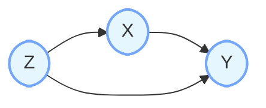

# 因果推理在公平贷款决策系统中的应用研究

> 关键词：因果推理、公平贷款决策系统、机器学习、算法公平性、信贷风险评估

> 摘要：本文聚焦于因果推理在公平贷款决策系统中的应用。首先介绍了研究的背景、目的和范围，明确预期读者和文档结构。接着阐述了因果推理与公平贷款决策的核心概念及联系，详细讲解了核心算法原理并给出 Python 源代码示例。通过数学模型和公式深入剖析了相关理论，结合项目实战给出代码案例和详细解释。探讨了因果推理在公平贷款决策系统中的实际应用场景，推荐了相关的学习资源、开发工具框架以及论文著作。最后总结了未来发展趋势与挑战，提供了常见问题解答和扩展阅读参考资料。旨在全面探讨因果推理在公平贷款决策系统中的应用，为构建更公平、高效的贷款决策系统提供理论和实践指导。

## 1. 背景介绍 
### 1.1 目的和范围
在传统的贷款决策系统中，往往依赖于历史数据和简单的统计模型来评估借款人的信用风险和决定是否发放贷款。然而，这些方法可能会受到数据偏差和潜在的歧视性因素影响，导致不公平的贷款决策，例如对某些特定群体的不公平拒绝或给予过高的贷款利率。本研究的目的是将因果推理技术应用于贷款决策系统中，以识别和消除潜在的不公平因素，构建更加公平、准确的贷款决策模型。

研究范围涵盖了因果推理的基本理论和方法，贷款决策系统的架构和工作流程，以及如何将因果推理与贷款决策相结合的具体实现技术。同时，还会探讨该系统在不同场景下的应用效果和面临的挑战。

### 1.2 预期读者
本文预期读者包括从事金融科技、机器学习、人工智能等领域的研究人员和开发者，以及对贷款决策系统公平性问题感兴趣的政策制定者和监管机构人员。对于想要深入了解因果推理技术在实际金融场景中应用的学生和从业者也具有参考价值。

### 1.3 文档结构概述
本文将按照以下结构进行阐述：首先介绍因果推理和公平贷款决策系统的核心概念及联系，包括原理和架构示意图。然后详细讲解核心算法原理，并给出具体的 Python 源代码示例。接着通过数学模型和公式深入分析相关理论，并举例说明。之后进行项目实战，给出代码实际案例和详细解释。再探讨因果推理在公平贷款决策系统中的实际应用场景。推荐相关的学习资源、开发工具框架和论文著作。最后总结未来发展趋势与挑战，提供常见问题解答和扩展阅读参考资料。

### 1.4 术语表
#### 1.4.1 核心术语定义
- **因果推理**：是一种从数据中发现因果关系的方法，通过分析变量之间的因果效应，而不仅仅是关联关系，来推断某个因素对另一个因素的影响。
- **公平贷款决策系统**：是一种旨在确保贷款决策过程公平、无歧视的系统，通过综合考虑各种因素，避免因借款人的性别、种族、年龄等敏感因素而产生不公平的决策。
- **信贷风险评估**：是指对借款人按时偿还贷款本息的可能性进行评估的过程，通常基于借款人的信用历史、收入水平、债务状况等因素。

#### 1.4.2 相关概念解释
- **混杂因素**：是指同时影响原因变量和结果变量的因素，可能会导致因果关系的混淆。在贷款决策中，例如借款人的社会经济背景可能是一个混杂因素，既影响借款人的信用风险，又与某些敏感因素（如种族）相关。
- **反事实推理**：是因果推理中的一种重要方法，通过想象在不同条件下的结果，来推断某个因素的因果效应。例如，在贷款决策中，可以想象如果借款人属于不同的群体（如不同性别），其贷款结果会如何变化。

#### 1.4.3 缩略词列表
- **ML**：机器学习（Machine Learning）
- **AI**：人工智能（Artificial Intelligence）
- **LASSO**：最小绝对收缩和选择算子（Least Absolute Shrinkage and Selection Operator）

## 2. 核心概念与联系 
### 2.1 因果推理原理
因果推理的核心目标是从数据中识别出变量之间的因果关系，而不仅仅是相关关系。传统的统计方法主要关注变量之间的相关性，例如通过计算相关系数来衡量两个变量之间的线性关系。然而，相关性并不等同于因果关系，两个变量之间的相关性可能是由于其他因素的影响而产生的。

因果推理的一种常见方法是基于结构因果模型（Structural Causal Model，SCM）。SCM 是一种用有向无环图（Directed Acyclic Graph，DAG）来表示变量之间因果关系的模型。在 DAG 中，节点表示变量，有向边表示因果关系。例如，图 1 展示了一个简单的 SCM 示例，其中变量 $X$ 是原因变量，变量 $Y$ 是结果变量，变量 $Z$ 是混杂因素。


图 1：简单的结构因果模型示例

通过 SCM，我们可以使用干预（Intervention）的概念来推断因果关系。干预是指人为地改变某个变量的值，而不考虑其他变量的影响。例如，在图 1 中，如果我们想要知道 $X$ 对 $Y$ 的因果效应，可以通过干预 $X$ 的值，然后观察 $Y$ 的变化。

### 2.2 公平贷款决策系统架构
公平贷款决策系统通常包括数据采集、数据预处理、特征工程、模型训练、模型评估和决策生成等模块。图 2 展示了公平贷款决策系统的架构示意图。


图 2：公平贷款决策系统架构示意图

- **数据采集**：收集与借款人相关的各种数据，包括个人信息、信用历史、收入水平等。
- **数据预处理**：对采集到的数据进行清洗、缺失值处理、异常值处理等操作，以提高数据质量。
- **特征工程**：从原始数据中提取有用的特征，例如计算借款人的债务收入比、信用评分等。
- **模型训练**：使用机器学习或深度学习算法对处理后的数据进行训练，构建贷款决策模型。
- **模型评估**：使用评估指标（如准确率、召回率、F1 值等）对训练好的模型进行评估，以确保模型的性能和公平性。
- **决策生成**：根据训练好的模型和输入的借款人信息，生成贷款决策结果，如批准、拒绝或需要进一步审核。

### 2.3 因果推理与公平贷款决策系统的联系
因果推理在公平贷款决策系统中具有重要作用。通过因果推理，我们可以识别出贷款决策中潜在的不公平因素，例如某些特征与敏感因素（如性别、种族）之间的因果关系。然后，可以采取相应的措施来消除这些不公平因素，例如对模型进行调整或对数据进行处理。

例如，假设在贷款决策模型中，发现某个特征（如居住地址）与种族之间存在因果关系，并且该特征对贷款决策有显著影响。通过因果推理，我们可以分析这种因果关系的强度和方向，然后决定是否需要对该特征进行调整或去除，以确保贷款决策的公平性。

## 3. 核心算法原理 & 具体操作步骤 
### 3.1 因果效应估计算法
在因果推理中，因果效应估计是一个核心问题。一种常见的因果效应估计方法是逆概率加权（Inverse Probability Weighting，IPW）。IPW 的基本思想是通过对样本进行加权，使得处理组和对照组在协变量上的分布尽可能相似，从而消除混杂因素的影响。

以下是使用 Python 实现 IPW 算法的示例代码：

```python
import numpy as np
import pandas as pd
from sklearn.linear_model import LogisticRegression

def ipw_estimator(data, treatment, outcome, covariates):
    """
    使用逆概率加权法估计因果效应
    :param data: 数据集
    :param treatment: 处理变量
    :param outcome: 结果变量
    :param covariates: 协变量列表
    :return: 因果效应估计值
    """
    # 拟合倾向得分模型
    X = data[covariates]
    y = data[treatment]
    model = LogisticRegression()
    model.fit(X, y)
    propensity_scores = model.predict_proba(X)[:, 1]

    # 计算权重
    weights = data[treatment] / propensity_scores + (1 - data[treatment]) / (1 - propensity_scores)

    # 计算加权结果
    weighted_outcome_treated = np.sum(data[treatment] * weights * data[outcome]) / np.sum(data[treatment] * weights)
    weighted_outcome_control = np.sum((1 - data[treatment]) * weights * data[outcome]) / np.sum((1 - data[treatment]) * weights)

    # 计算因果效应
    causal_effect = weighted_outcome_treated - weighted_outcome_control

    return causal_effect
```

### 3.2 具体操作步骤
1. **数据准备**：收集与贷款决策相关的数据，包括借款人的个人信息、信用历史、贷款结果等。确保数据的完整性和准确性。
2. **变量定义**：确定处理变量（如是否给予贷款）、结果变量（如是否按时还款）和协变量（如收入水平、信用评分等）。
3. **倾向得分模型拟合**：使用逻辑回归等方法拟合倾向得分模型，计算每个样本的倾向得分。
4. **权重计算**：根据倾向得分计算每个样本的权重。
5. **因果效应估计**：使用加权后的样本计算处理组和对照组的平均结果，然后计算因果效应。

### 3.3 算法优化与扩展
IPW 算法在实际应用中可能会受到样本权重过大或过小的影响，导致估计结果不稳定。为了克服这个问题，可以采用修剪（Trimming）或稳定加权（Stabilized Weighting）等方法。

修剪方法是指去除倾向得分过高或过低的样本，以减少极端权重的影响。稳定加权方法是指对权重进行调整，使得权重的分布更加均匀。

以下是使用修剪方法优化 IPW 算法的示例代码：

```python
def ipw_estimator_trimming(data, treatment, outcome, covariates, trim_threshold=0.05):
    """
    使用逆概率加权法（修剪）估计因果效应
    :param data: 数据集
    :param treatment: 处理变量
    :param outcome: 结果变量
    :param covariates: 协变量列表
    :param trim_threshold: 修剪阈值
    :return: 因果效应估计值
    """
    # 拟合倾向得分模型
    X = data[covariates]
    y = data[treatment]
    model = LogisticRegression()
    model.fit(X, y)
    propensity_scores = model.predict_proba(X)[:, 1]

    # 修剪倾向得分
    mask = (propensity_scores >= trim_threshold) & (propensity_scores <= 1 - trim_threshold)
    data = data[mask]
    propensity_scores = propensity_scores[mask]

    # 计算权重
    weights = data[treatment] / propensity_scores + (1 - data[treatment]) / (1 - propensity_scores)

    # 计算加权结果
    weighted_outcome_treated = np.sum(data[treatment] * weights * data[outcome]) / np.sum(data[treatment] * weights)
    weighted_outcome_control = np.sum((1 - data[treatment]) * weights * data[outcome]) / np.sum((1 - data[treatment]) * weights)

    # 计算因果效应
    causal_effect = weighted_outcome_treated - weighted_outcome_control

    return causal_effect
```

## 4. 数学模型和公式 & 详细讲解 & 举例说明 
### 4.1 因果效应的数学定义
在因果推理中，因果效应通常用潜在结果（Potential Outcomes）来定义。假设 $Y$ 是结果变量，$T$ 是处理变量，$T \in \{0, 1\}$ 表示是否接受处理。对于每个个体 $i$，存在两个潜在结果 $Y_i(0)$ 和 $Y_i(1)$，分别表示个体 $i$ 在未接受处理和接受处理时的结果。

个体因果效应（Individual Causal Effect，ICE）定义为：
$$ICE_i = Y_i(1) - Y_i(0)$$

然而，在实际中，我们只能观察到一个潜在结果，即个体 $i$ 实际接受处理或未接受处理时的结果。因此，我们通常关注平均因果效应（Average Causal Effect，ACE），定义为：
$$ACE = E[Y(1) - Y(0)]$$

### 4.2 逆概率加权法的数学原理
逆概率加权法的目标是通过对样本进行加权，使得处理组和对照组在协变量上的分布尽可能相似。假设 $X$ 是协变量，$p(T = 1|X)$ 是倾向得分，表示在给定协变量 $X$ 的条件下，个体接受处理的概率。

逆概率加权法的权重定义为：
$$w_i = \frac{T_i}{p(T_i = 1|X_i)} + \frac{1 - T_i}{1 - p(T_i = 1|X_i)}$$

其中，$T_i$ 是个体 $i$ 的处理变量值，$p(T_i = 1|X_i)$ 是个体 $i$ 的倾向得分。

加权后的平均结果定义为：
$$\hat{Y}(t) = \frac{\sum_{i=1}^{n} w_i T_i Y_i}{\sum_{i=1}^{n} w_i T_i}$$

其中，$t \in \{0, 1\}$ 表示处理状态。

平均因果效应的估计值为：
$$\hat{ACE} = \hat{Y}(1) - \hat{Y}(0)$$

### 4.3 举例说明
假设我们有一个贷款决策数据集，包含以下变量：
- $T$：是否给予贷款（1 表示给予，0 表示不给予）
- $Y$：是否按时还款（1 表示按时还款，0 表示未按时还款）
- $X_1$：收入水平
- $X_2$：信用评分

我们想要估计给予贷款对按时还款的因果效应。

首先，我们使用逻辑回归模型拟合倾向得分模型：
$$p(T = 1|X_1, X_2) = \frac{1}{1 + e^{-(\beta_0 + \beta_1 X_1 + \beta_2 X_2)}}$$

然后，根据倾向得分计算每个样本的权重：
$$w_i = \frac{T_i}{p(T_i = 1|X_{i1}, X_{i2})} + \frac{1 - T_i}{1 - p(T_i = 1|X_{i1}, X_{i2})}$$

最后，计算加权后的平均结果和因果效应估计值。

## 5. 项目实战：代码实际案例和详细解释说明 
### 5.1  开发环境搭建
在进行项目实战之前，需要搭建相应的开发环境。以下是搭建开发环境的步骤：

1. **安装 Python**：推荐使用 Python 3.7 及以上版本。可以从 Python 官方网站（https://www.python.org/downloads/） 下载并安装。
2. **安装必要的库**：使用以下命令安装必要的库：
```sh
pip install numpy pandas scikit-learn
```

### 5.2  源代码详细实现和代码解读
以下是一个完整的项目实战代码示例，包括数据生成、因果效应估计和结果可视化：

```python
import numpy as np
import pandas as pd
from sklearn.linear_model import LogisticRegression
import matplotlib.pyplot as plt

# 生成模拟数据
np.random.seed(42)
n_samples = 1000
X1 = np.random.normal(0, 1, n_samples)
X2 = np.random.normal(0, 1, n_samples)
true_causal_effect = 0.2
propensity_score = 1 / (1 + np.exp(-(0.5 * X1 + 0.3 * X2)))
T = np.random.binomial(1, propensity_score)
Y0 = np.random.binomial(1, 0.3 + 0.1 * X1 + 0.1 * X2)
Y1 = Y0 + true_causal_effect
Y = T * Y1 + (1 - T) * Y0

data = pd.DataFrame({
    'X1': X1,
    'X2': X2,
    'T': T,
    'Y': Y
})

# 定义 IPW 估计函数
def ipw_estimator(data, treatment, outcome, covariates):
    X = data[covariates]
    y = data[treatment]
    model = LogisticRegression()
    model.fit(X, y)
    propensity_scores = model.predict_proba(X)[:, 1]

    weights = data[treatment] / propensity_scores + (1 - data[treatment]) / (1 - propensity_scores)

    weighted_outcome_treated = np.sum(data[treatment] * weights * data[outcome]) / np.sum(data[treatment] * weights)
    weighted_outcome_control = np.sum((1 - data[treatment]) * weights * data[outcome